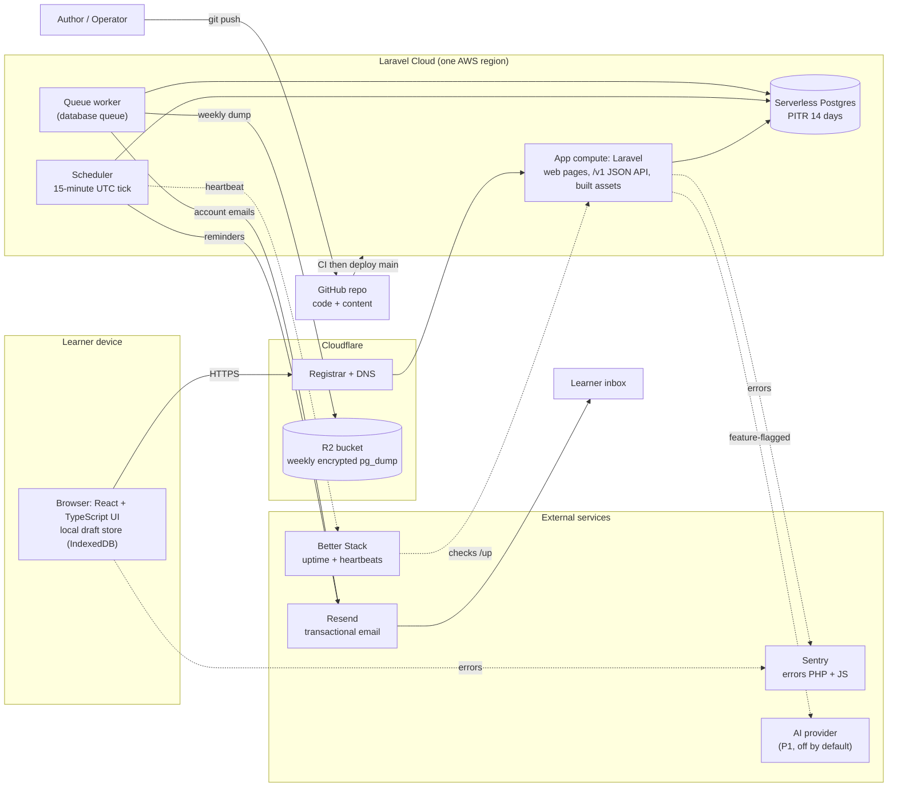
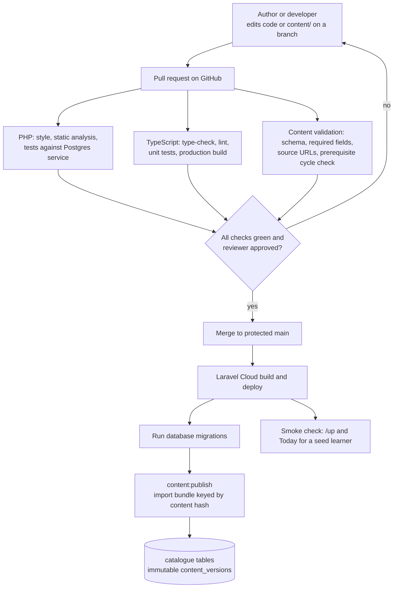

# 01 · Tech stack and hosting (ADR-001)

Status: Proposal — for discussion

**Purpose.** This doc chooses what the DevStep web app is built with and where it runs. The goal is a stack that one part-time person can build and operate cheaply. It records the options, scoring, physical architecture, environments, delivery path and a three-stage cost model, so the founder can accept, amend or reject the choice.

## Summary

- **Recommendation (Proposal):** one **Laravel modular monolith** (PHP) on **Laravel Cloud**. The same app serves the React + TypeScript UI and the `/v1` JSON API from one origin. It uses PostgreSQL (Laravel Cloud Serverless Postgres with point-in-time recovery), the Laravel scheduler and a database-backed queue.
- **Runner-up:** the same codebase on a small **Hetzner VPS managed by Laravel Forge**. It costs less from about 500 MAU upwards but means more operating work. It is also the exit route if Laravel Cloud stops suiting us.
- **Strongest non-PHP option:** Cloudflare Workers + D1 at about $5/month. It is the cheapest and needs the least operating. However, it is slower to build for a Laravel-strong founder, and D1 has no interactive transactions.
- **Monthly cost estimates (all `unverified`):**
  - concierge trial: about $1 (no app needed)
  - pilot (≤ 50 learners): about $12–31, budget **about $30**
  - early (500 MAU): about $55–80
  - growth (5,000 MAU): about $115–190
- **Six vendors**, four of them on free tiers: Laravel Cloud, Resend (email), Cloudflare (registrar, DNS, R2), GitHub, Sentry and Better Stack. Analytics events stay in our own Postgres table.
- **Business rules live in application code with tests.** Postgres provides constraints (FK, unique, check) for integrity and as defence-in-depth. No business logic goes in triggers or RLS policies.
- **Pricing evidence:** direct fetches of vendor pages were blocked from the research environment on 2026-10-06. Every vendor figure here comes from search summaries of the cited official pages and is marked `unverified`.
- **The app stack is independent of the lab-kit stack.** Labs run on the learner's machine (§17, `07-curriculum-plan.md`).

## 1. Context

| Fact | Label |
| --- | --- |
| PRD §11 proposes Laravel + React/TypeScript + PostgreSQL + a background worker, as a modular monolith. The founder treats this as a suggestion, not a mandate. | PRD |
| PRD §8 says Laravel/PHP and SQL are "the creator's practical strengths". | PRD |
| Founder priorities, in order: (1) easiest for one part-time person to build **and** operate; (2) cheapest to host, especially at pilot scale. | Founder brief |
| Recommendation, evidence and scheduling logic must live in one testable application codebase. The database may enforce ownership as defence-in-depth. | Founder brief |
| Load is tiny for at least a year. The pilot has 30–50 participants (PRD §13). Five thousand MAU is the "growth" planning case, not a forecast. | PRD / Hypothesis |
| Functional alpha is planned at 3–4 weeks of part-time work (PRD §14), so a framework that already includes auth, queues, scheduling, mail and testing saves weeks. | PRD / Proposal |
| A database-backed queue is adequate for the pilot. Redis is added only when measured need justifies it (PRD §11). | PRD |

## 2. Requirements the stack must satisfy

| ID | Requirement | Source | What it demands of the stack |
| --- | --- | --- | --- |
| S1 | Opt-in reminders: at most one per scheduled learning day, in the learner's IANA time zone, with pause, unsubscribe, and suppression after a completed session | F10, §6 | A reliable scheduler that ticks at least every 15 minutes, because some offsets are not whole hours (e.g. `Asia/Kolkata` +05:30, `Asia/Kathmandu` +05:45). A current tz database. Idempotent dispatch through a unique constraint. Signed unsubscribe links. |
| S2 | Relational integrity; idempotent attempt submission and completion; topic completion updated exactly once | F09, R02 | ACID transactions, unique and partial-unique indexes, row locks, an `idempotency_keys` table |
| S3 | Account export and deletion (active records removed within 30 days; backups expire within a documented period) | F09, §12 | Background jobs; configurable backup retention of 30 days or less |
| S4 | Backups, with a restore tested before the pilot | §12 | Point-in-time recovery (PITR) or dumps, plus a restore we can rehearse |
| S5 | p95 Today API under 500 ms at pilot load | §12 | A region near the cohort and no cold-start penalty on the hot path (see §16 trigger T2) |
| S6 | First usable screen within 2.5 s on representative mobile | §12 | Hashed static assets with long cache lifetimes, code splitting, a bundle budget |
| S7 | Recoverable local draft during network loss; no silent overwrite across devices | §12 | Client-side storage (IndexedDB/localStorage) plus `base_revision` checks on the server. No special hosting needed. |
| S8 | Email, analytics or AI outages never block learning | §12 | Sends are asynchronous, calls have timeouts, AI sits behind a feature flag with an authored fallback |
| S9 | Optional AI tutor later, with server-side keys, quotas, cost caps and cost logging | §11, §14, F13 | Secret management, per-user counters, a global budget switch |
| S10 | Content goes through draft → review → publish → retire, with version history | F11, §8 | Git history, a review gate, validation in CI, an idempotent publish step |
| S11 | Authorisation tests, TLS, secure sessions, rate limiting, input validation | §12 | First-class support in the framework |
| S12 | Pseudonymous analytics with no free text | F12, §12 | Storage we control, or a vendor configured to match |
| S13 | No arbitrary server-side code execution | §7, §11 | No sandbox hosting at all |

## 3. Decision drivers and weights

| ID | Driver | Weight | 5 means… | 1 means… |
| --- | --- | ---: | --- | --- |
| D1 | Build speed for this founder (familiarity, built-in auth, queue, scheduler, mail, migrations, testing) | 25 | Known framework; almost nothing to assemble | New language or runtime; many libraries to stitch together |
| D2 | Operating burden for one part-time person (patching, backups, restores, upgrades, on-call) | 25 | No servers; managed DB with PITR | We patch the OS, run the DB and script backups |
| D3 | Pilot hosting cost | 15 | ≤ $10/month | > $30/month |
| D4 | Requirement fit (§2, especially S1–S5) | 15 | All met natively | Workarounds needed for transactions or scheduling |
| D5 | Business logic in one testable codebase | 10 | All rules in app code, tested in CI | Rules split across RLS, triggers, functions and app |
| D6 | Lock-in and exit cost | 5 | Standard runtime and plain Postgres | Proprietary runtime or data APIs |
| D7 | Cost and operating load at 5,000 MAU | 5 | Flat and low | Steep usage-based growth |

## 4. Options considered

Vendor figures in this section are all `unverified`; source tags `[S…]` refer to the list at the end of this doc.

| Option | Shape | Strengths | Weaknesses and gotchas |
| --- | --- | --- | --- |
| **A1 · Laravel on Laravel Cloud** | Laravel app (web, API, scheduler, queue worker) on managed compute; Laravel Cloud Serverless Postgres | Founder's framework. No OS or DB-server admin. PITR with 0–30 day retention [S5]. Preview environment per pull request [S7]. Scheduler wakes a sleeping environment [S6]. AWS regions including Frankfurt, London, Virginia and Singapore [S7]. Starter $5/month including $5 of usage [S4]. | Usage-based bills are less predictable. Scale-to-zero wake-ups (DB "a few hundred ms" [S5]) can hurt p95 when pilot traffic is sparse. A scheduler tick shorter than the sleep timeout keeps the environment awake [S6]. Starter allows 1 replica and DB ≤ 1 CU [S4]. Young platform whose pricing has already changed. |
| **A2 · Laravel on a VPS via Forge** | Hetzner CX23 (or Forge's own "Laravel VPS") with nginx, PHP-FPM, Postgres, scheduler and worker on one box | Founder's framework. Flat, low cost (CX23 €5.49/month since 15 Jun 2026 [S1]; Forge Hobby $12/month [S8]). Best cost at growth. Lowest lock-in. | We patch the OS, upgrade PHP and Postgres, configure and test backups, and own a single point of failure. Hetzner raised prices twice in 2026 [S1]. Cheap CX plans appear to be EU-only (`unverified`). Running without Forge saves $12 but means more scripts. |
| **B · Supabase + static React SPA** | Postgres, Auth, pg_cron and Edge Functions (Deno); SPA on a static host | Managed Postgres and auth; generous free MAU. | Pushes rules into RLS, SQL functions and Edge Functions, against the founder's single-codebase rule. Free projects pause after 7 days of inactivity [S11]. Daily backups only on paid plans (Pro from $25/month, 7-day retention [S11]). |
| **C · Cloudflare Workers (Hono, TypeScript) + D1** | One Worker serving API and static assets; D1 (SQLite) or Neon via Hyperdrive; Cron Triggers; Cloudflare Email Service | Cheapest: Workers Paid $5/month includes 10M requests, D1 quotas, cron and 3,000 emails/month [S12][S13][S16]. Static asset requests free [S17]. D1 Time Travel gives 30-day PITR [S13]. No servers. | Founder must assemble auth (e.g. Better Auth [S38]), ORM, migrations and job patterns in TypeScript. D1 has no interactive transactions, only atomic batches [S14], which makes S2 awkward. 10 GB per database [S13]. Email sending is in public beta [S16]. Workers runtime limits. Higher lock-in. |
| **D · Next.js on Vercel + managed Postgres (Neon)** | Full-stack Next.js, serverless functions, Vercel Cron | Strong React developer experience; preview deployments. | Hobby is non-commercial only [S19], so Pro at $20/month. Hobby cron runs once a day with ±59 min timing [S19], which fails S1. Neon free scales to zero after 5 min [S18]. Queue and cron must be bolted on. Two vendors before email. |
| **E · Monolith on a container PaaS** (Fly.io, Railway, Render) with SQLite + Litestream or managed Postgres | Laravel in a container; Litestream streams the SQLite WAL to object storage for PITR [S24] | Founder's framework. Low cost (Fly 256 MB machine $2.19/month, volumes $0.15/GB [S20]; Railway Hobby $5 including $5 usage [S21]). | No free allowance for new Fly organisations [S20]. Render free services sleep after 15 min, take about 1 min to wake, and free Postgres is deleted after 30 days plus 14 days' grace [S22]. We own the Dockerfile, volumes, Litestream sidecar and worker/scheduler processes. SQLite breaks dev/prod parity with the Postgres-based labs. |
| **F · PocketBase single binary** | Go binary with SQLite, auth, admin UI and JS hooks, on a VPS | Very cheap; quick CRUD. | Pre-1.0, so backward compatibility is not guaranteed [S23]. Logic split between collection rules and JS hooks. Cron jobs only at hook top level [S23]. We operate the VPS and backups. |

Also considered and dropped: Rails 8 + Kamal (not the founder's stack), self-hosted PaaS panels such as Coolify (another system to operate), and Firebase (document store, weak relational integrity for S2).

## 5. Scoring matrix

Scores run from 1 (poor) to 5 (best). Weighted total = Σ(weight × score) ÷ 100.

| Driver (weight) | A1 Cloud | A2 VPS+Forge | B Supabase | C Workers+D1 | D Vercel | E PaaS | F PocketBase |
| --- | ---: | ---: | ---: | ---: | ---: | ---: | ---: |
| D1 Build speed (25) | 5 | 5 | 2 | 2 | 3 | 5 | 3 |
| D2 Operating burden (25) | 5 | 3 | 4 | 5 | 4 | 3 | 2 |
| D3 Pilot cost (15) | 3 | 3 | 3 | 5 | 3 | 4 | 5 |
| D4 Requirement fit (15) | 5 | 5 | 4 | 3 | 4 | 4 | 3 |
| D5 Single codebase (10) | 5 | 5 | 2 | 5 | 4 | 5 | 3 |
| D6 Lock-in (5) | 4 | 5 | 2 | 3 | 3 | 5 | 3 |
| D7 Cost at growth (5) | 3 | 5 | 4 | 5 | 3 | 4 | 4 |
| **Weighted total** | **4.55** | **4.20** | **3.05** | **3.85** | **3.50** | **4.15** | **3.10** |

**Sensitivity checks (Proposal):**

- **Cost-first weights** (D1 20, D2 20, D3 25, others unchanged): A1 4.35, E 4.15, A2 4.10, C 4.00. A1 still leads.
- **If the founder is equally fluent in TypeScript** (C and D get D1 = 4): C rises to 4.35 and D to 3.75. A1 still leads, and C becomes the obvious second choice.
- **The deciding factor is D2.** A1 and A2 run identical code; the difference is who patches servers and runs backups. That difference is worth about $10–20/month at pilot scale.

## 6. Decision

**Decision (Proposal): Option A1.** All rows below are Proposals except where marked PRD.

| Layer | Choice | Notes |
| --- | --- | --- |
| Language and framework | PHP + Laravel. Pin the current supported major version when implementation starts (PRD §11). | One deployable modular monolith with the modules in `00-conventions.md`. Boundary rules are in `02-system-architecture.md`. |
| UI | React + TypeScript built by Vite. Hashed assets are served by the same Laravel app. | Same origin: no CORS and no tokens in browser storage. Whether routing uses Inertia or a client router is decided in `02-system-architecture.md`. |
| API | `/v1` JSON endpoints in the same app, with session-cookie auth (Sanctum SPA mode or the starter kit's session) | CSRF protection, rate limiter and policies come from the framework (S11) |
| Database | PostgreSQL via Laravel Cloud Serverless Postgres; PITR retention 14 days | Integrity comes from FK, unique, partial-unique and check constraints. Ownership checks happen in app policies; Postgres RLS is optional defence-in-depth only (founder brief). See `04-data-model.md`. |
| Background work | Laravel scheduler with a 15-minute UTC tick for reminders; `database` queue driver with one worker | No Redis (PRD §11). The scheduler pings a heartbeat monitor every tick. |
| Authentication | Laravel starter kit (Fortify): email + password with verification, GitHub OAuth via Socialite, passkeys through Fortify's WebAuthn support [S9] | No auth vendor, no per-MAU fees, users stay in our DB (simpler export and deletion). We use framework hashing, WebAuthn and OAuth implementations and roll no crypto of our own. |
| Email | Resend through Laravel's mail driver [S25] | Postmark is the fallback (§10) |
| Hosting | Laravel Cloud Starter, moving to Growth when a second operator, more previews or > 1 CU is needed [S4] | Region nearest the pilot cohort (Open question 3) |
| DNS, registrar, off-site backup | Cloudflare Registrar and DNS, with R2 for weekly encrypted logical dumps | One vendor for three jobs |
| Errors and uptime | Sentry Developer (free) for PHP and JS; Better Stack free (HTTP checks + heartbeats) | §10 |
| Analytics | Own `analytics_events` table (PRD F12 payload rules) | No third-party processor at pilot |
| CI/CD | GitHub Actions on pull requests. Laravel Cloud deploys the protected `main` branch from Git. | §9 |
| Content | Markdown/YAML in a `content/` directory of the same repo; pull-request review; `content:publish` command | Format and workflow are in `06-content-system.md` |

**Reminder dispatch as the stack must support it (S1).** The full flow belongs in `03-key-flows.md` and the rules in `05-learning-engine.md`. At stack level:

- **Tick:** every 15 minutes the scheduler selects learners whose local reminder time falls in `(previous tick, now]`. "Local" uses PHP's bundled IANA tz data, so keeping the PHP runtime patched also keeps DST rules current.
- **Idempotency:** a `notification_deliveries` row with UNIQUE(`user_id`, `local_learning_date`) is inserted *before* sending. A conflict means "already handled", so a reminder is sent at most once.
- **Suppression:** a learner who has already completed a session that local day gets no reminder. Reminders are also skipped when paused, unsubscribed or in quiet hours.
- **Outages:** if the provider fails, the delivery row is marked failed and retried once within the same local window. Learning is never blocked (S8).
- **Monitoring:** Better Stack alerts if the heartbeat stops (dead scheduler).

## 7. Physical architecture (recommended option)



Notes:

- **Single deployable.** Web, scheduler and worker run from the same build, so business logic exists once (D5).
- **Static assets** use content-hashed filenames and long cache lifetimes. Laravel Cloud states it has an edge network [S4], but whether that caches our assets is `unverified`. If S6 fails, proxying assets through Cloudflare is the first fix to test.
- **Dotted edges are non-blocking** (S8). Sentry and analytics calls are fire-and-forget. AI calls have timeouts and fall back to authored hints.
- **Exports and lab evidence stay in Postgres at pilot scale** (each export is well under 1 MB). Laravel Cloud's compute disk should be treated as ephemeral (`unverified`). Object storage is added only if file uploads arrive (PRD §11), through Laravel's `Storage` interface.
- **Whether `pg_dump` can run on Laravel Cloud is `unverified`.** If it cannot, a scheduled GitHub Actions job runs the dump instead (09 owns the runbook).

## 8. Environments

```mermaid
flowchart LR
  subgraph Local["Local: developer laptop"]
    L1["Laravel + Vite dev server"]
    L2[("Postgres in Docker")]
    L3["Mail capture (Mailpit)"]
    L4["AI: fake provider"]
  end
  subgraph Preview["Preview: one per pull request"]
    P1["Laravel Cloud preview environment"]
    P2[("Own Postgres<br/>synthetic seed data only")]
    P3["Mail: log driver"]
  end
  subgraph Prod["Production"]
    R1["Laravel Cloud production environment"]
    R2db[("Serverless Postgres + PITR")]
    R3["Resend, Sentry, Better Stack live"]
  end
  Local -->|push branch and open PR| Preview
  Preview -->|CI green and review approved then merge| Prod
```



| Aspect | Local | Preview | Production |
| --- | --- | --- | --- |
| Purpose | Build and test | Review a pull request, try content, demo to the reviewer | Learners |
| Database | Postgres in Docker, same major version as production | Its own Serverless Postgres; scale-to-zero **on** | Serverless Postgres; scale-to-zero **off** during the measured pilot (Open question 4) |
| Data | Synthetic seeds | Synthetic seeds; **never** a copy of production (privacy, `09-security-privacy-ops.md`) | Real, owned per learner |
| Email | Captured locally | Log driver only | Resend, verified sending subdomain |
| Secrets | `.env` (not committed) | Cloud environment variables | Cloud environment variables; AI key empty until F13 |
| Cost | $0 | Counts against Starter usage; one preview automation on Starter [S7] | §12 |

There is no separate staging environment: previews fill that role, which keeps moving parts down (Proposal).

## 9. CI/CD and content publish path



- **The gate is branch protection.** Required status checks plus required review, with `CODEOWNERS` assigning `content/` to the reviewer. Laravel Cloud only deploys `main`, so nothing undeployable reaches production. This needs no deploy-hook scripting.
- **Tests run against real Postgres in CI**, never SQLite, because S2 depends on Postgres constraint behaviour.
- **Content history is Git history (F11).** Who wrote, who reviewed (pull-request approval), when, and the source URLs live in the bundle. `content:publish` is idempotent: an unchanged hash means no new `content_versions` row. Retiring content is a content change like any other.
- **Content runs as a separate deploy-time command** (Laravel Cloud deploy commands are `unverified`). That lets a content-only pull request publish without touching code.
- **CI budget:** GitHub Free gives 2,000 Actions minutes/month on private repos and unlimited minutes on public repos [S35]. Estimate: about 6 min per run × about 60 runs/month ≈ 360 min.

## 10. Supporting services

| Concern | Recommendation (Proposal) | Alternatives | Why, and gotchas (figures `unverified`) |
| --- | --- | --- | --- |
| Transactional email | **Resend** (free: 3,000/month, **100/day**; Pro $20 for 50,000/month [S25]) | Postmark (free 100/month; $15 for 10,000 [S26]). Amazon SES ($0.10 per 1,000; its free tier ended for new customers on 21 Jul 2026 [S27]). Brevo (free 300/day [S28]). Cloudflare Email Service (beta, needs Workers Paid [S16]). | Laravel ships drivers for Resend, Postmark and SES, so switching is a config change. The pilot peak is about 40/day, under the 100/day cap. Verify SPF, DKIM and DMARC on a sending subdomain weeks before the pilot, because DNS verification and warm-up take time. Move to Postmark if deliverability suffers; consider SES above roughly 50,000/month. |
| Authentication | **Library in the app:** starter kit + Fortify (email/password, verification, passkeys) + Socialite for GitHub [S9] | WorkOS AuthKit starter-kit variant (social, passkeys, "Magic Auth" [S9]; pricing not checked); Supabase Auth; Better Auth (TypeScript) | No extra vendor, users live in our DB, and the crypto comes from the framework. **No email-only magic-link login at pilot.** That keeps email off the login critical path, so an email outage only blocks sign-up verification and password reset (S8). |
| Error monitoring | **Sentry Developer** (free, 1 user [S29]) | Laravel Cloud logs alone | Error quota is reported as 5,000/month, but sources conflict. On the free plan, events beyond quota are dropped [S29]. Scrub answer text from breadcrumbs (`09-security-privacy-ops.md`). |
| Uptime and job checks | **Better Stack free:** 10 monitors, 10 heartbeats, 3-minute checks, 1 status page [S30] | UptimeRobot free: 50 monitors, 5-minute checks, commercial use allowed [S31] | Heartbeats catch a dead scheduler or backup job, which is the most likely silent failure for F10. |
| Analytics storage | **Own `analytics_events` table** | PostHog (1M events/month free [S32]) | The pilot produces about 6,500 events/month. Keeping them local means no third-party processing to disclose, and metrics are plain SQL (`10-measurement-and-validation.md`). Revisit only if funnels need a UI. |
| Backups and restore | **Laravel Cloud PITR 14 days [S5] + weekly `pg_dump` to Cloudflare R2**, encrypted, kept 28 days (R2 free tier: 10 GB-month [S33]) | Backblaze B2 (first 10 GB free [S34]); Hetzner Object Storage (€4.99 base [S39], too big for us) | Two independent copies with total retention under 30 days, so deletions propagate (PRD §12). **Restore drill before the pilot:** PITR into a new database, plus the dump restored into local Docker, then the smoke test. Runbook in `09-security-privacy-ops.md`. |
| CI/CD | **GitHub Actions** + Laravel Cloud Git deploys | — | §9 |
| Domain, DNS, TLS | **Cloudflare Registrar** (registry cost, no markup [S36]) + Cloudflare DNS. TLS is managed by Laravel Cloud for custom domains (`unverified`). | Any registrar | Set records to DNS-only so they don't double-proxy Laravel Cloud's edge (`unverified`). Brand and domain availability are still unchecked (PRD header). |
| Where content lives | **Same Git repo, `content/` directory** | Separate content repo | One pull request can change a player feature and its content together. Split the repo if non-developer authors join (Open question 7). |
| Secrets | Laravel Cloud environment variables; local `.env` | — | The AI provider key stays server-side only (PRD §11) |

## 11. Free-tier and pricing gotchas

All rows `unverified`, checked 2026-10-06 via search summaries of the cited pages.

| Vendor | Gotcha | Impact on us |
| --- | --- | --- |
| Laravel Cloud [S4–S6] | Scale-to-zero wakes in under a second, but the first request after sleep is slower. Ticks more frequent than the sleep timeout keep the environment awake. `withoutOverlapping` cache lookups can keep the DB awake. | Our 15-minute tick plus sparse traffic: either accept cold starts or pay for always-on (§12). Measure p95 (S5). |
| Hetzner [S1–S3] | Prices rose on 1 Apr 2026 and again on 15 Jun 2026 (CPX22 went from €7.99 to €19.49). IPv4 is €0.50/month extra. Backups cost 20% of the server price. | The runner-up's cost advantage is real but volatile. |
| Supabase [S11] | Free projects pause after 7 days of low activity. Daily backups need a paid plan. | A free tier is unusable for a 6-week pilot. |
| Vercel [S19] | Hobby is non-commercial. Hobby cron is daily with ±59 min timing. | Fails S1 unless on Pro. |
| Neon [S18] | Free compute scales to zero after 5 min of idle; 100 CU-hours per project per month. | Cold DB on sparse traffic. |
| Cloudflare [S12][S13][S16] | Free: 100k requests/day and 10 ms CPU per invocation. Since 1 Sep 2026, D1 free-tier queries **fail** above daily row limits. 500 MB database on free, 10 GB on paid. Emailing arbitrary recipients needs Paid. | Option C needs the $5 Paid plan from day one. |
| Render [S22] | Free services sleep after 15 min and take about 1 min to wake. Free Postgres is deleted after 30 days plus 14 days' grace. | Not viable for a pilot. |
| Fly.io [S20] | No free allowance for new organisations; the trial is 2 hours of machine time or 7 days. | Pay from day one. |
| Railway [S21] | The trial is a one-off $5 credit that expires in 30 days. Hobby's $5 is charged even if unused. | Minimum $5/month. |
| Resend [S25] | 100 emails/day cap on free. The domain must be verified. | Fine for the pilot (about 40/day peak); upgrade at early stage. |
| Postmark [S26] | Free is only 100 emails/month. | Paid from the pilot onwards if chosen. |
| Amazon SES [S27] | The SES-specific free tier is closed to new customers since 21 Jul 2026. New-account sandbox and production-access request (`unverified`). | Extra setup steps; cheapest only at volume. |
| Sentry [S29] | One user. Events beyond quota are dropped, with no pay-as-you-go on free. | Acceptable while the founder is the only operator. |
| GitHub [S35] | 2,000 min/month and 500 MB artifact storage for private repos. | Comfortable for us (§9). |

## 12. Cost model

### 12.1 Assumptions

All assumptions are Hypotheses unless marked.

| Symbol | Assumption | Value |
| --- | --- | --- |
| `s` | Practice sessions per active learner per month: 3/week × 52 ÷ 12 (PRD §5 default) | 13 |
| `r` | API requests per session (Today, start, ~6 steps × (read + draft save), hints, attempts, complete, event batches) | 30 |
| `o` | Share of learners opted in to reminders | 60% |
| `e_rem` | Reminder emails per opted-in learner per month (≤ 1 per learning day ≈ 3/week) | 13 |
| `e_acct` | Account emails per learner per month (verification, reset, export ready) | 2 |
| `b` | DB growth per learner-month: 13 sessions × (5 attempts × 2 KB + 10 events × 0.3 KB + 2 KB drafts) | ≈ 0.2 MB |
| — | Catalogue size (18 missions, alternates, 6 labs, rubrics) | < 20 MB |
| — | Laravel Cloud rates [S4][S5]: Flex 512 MiB capped at $6/month; Flex 1 GiB capped at $12/month; queue worker about $0.00548/h (≈ $4/month always-on); Postgres $0.106 per CU-hour, minimum 0.25 CU; storage $0.50/GB-month | `unverified` |

### 12.2 Formulas

```text
requests_per_month = MAU × s × r
emails_per_month   = MAU × o × e_rem + MAU × e_acct
db_size_after_n_months ≈ catalogue + MAU × b × n
pg_compute_cost    = awake_hours × CU × 0.106          (always-on: 730 h)
  e.g. 0.25 CU always-on = 730 × 0.25 × 0.106 ≈ $19.35
cloud_bill         = plan_fee + max(0, usage − included_credit)
```

| Stage | MAU | Requests/month | Emails/month | DB size after 12 months |
| --- | ---: | ---: | ---: | ---: |
| Pilot | 50 | ≈ 19,500 | ≈ 490 (peak day ≈ 40) | < 0.2 GB |
| Early | 500 | ≈ 195,000 | ≈ 4,900 | ≈ 1.2 GB |
| Growth | 5,000 | ≈ 1.95M (≈ 2–3 req/s at evening peak) | ≈ 49,000 | ≈ 12 GB |

### 12.3 Monthly estimate for the recommended option

USD; all vendor prices `unverified`.

| Line item | Concierge (2 weeks) | Pilot ≤ 50 learners | Early 500 MAU | Growth 5,000 MAU |
| --- | --- | --- | --- | --- |
| Laravel Cloud plan | — (no app needed: PRD §13 trial is manually curated) | Starter $5, includes $5 usage | Starter $5 | Growth $20 |
| App compute | — | Flex 512 MiB: $2 (hibernating ~8 h/day) to $6 (always-on) | Flex 1 GiB always-on $12 | 2 × Flex 1 GiB $24 |
| Queue worker | — | $0–4 | $4 | $4–8 |
| Postgres compute | — | 0.25 CU: $6 (~8 h/day) to $19 (always-on) | 0.25–0.5 CU always-on $19–39 | 0.5–1 CU always-on $39–77 |
| Postgres storage + PITR | — | < $1 | $1–2 | $8 |
| Data transfer | — | included | included | $0–4 (overage $0.10/GB [S4]) |
| Usage credit | — | −$5 | −$5 | — |
| Email | — | Resend free $0 | Resend Pro $20 (or Postmark $15) | Resend Pro $20 (near the 50k cap; SES ≈ $5 alternative) |
| Sentry, Better Stack, R2, GitHub | — | $0 | $0 | $0–26 (Sentry Team if quota bites) |
| Domain (amortised) | ≈ $0.70 | ≈ $0.70 | ≈ $0.70 | ≈ $0.70 |
| **Total per month** | **≈ $1** | **≈ $12–31; budget $30** | **≈ $55–80** | **≈ $115–190** |

### 12.4 Pilot-stage comparison across options

All figures `unverified`.

| Option | Pilot monthly estimate | Basis |
| --- | --- | --- |
| A1 Laravel Cloud | $12–31 | §12.3 |
| A2 Hetzner CX23 + Forge Hobby | ≈ $20 (≈ $8 without Forge) | €5.49 + €0.50 IPv4 + 20% backups ≈ €7.09, plus $12 Forge [S1–S3][S8]. Alternatively Forge's "Laravel VPS" from $6 [S8]. At growth: CX33 €8.49 [S1] → ≈ $45–70 including email. |
| B Supabase Pro + static host | ≈ $25 | Free tier pauses and lacks backups [S11] |
| C Cloudflare Workers Paid + D1 + Email Service | ≈ $5 | Includes 3,000 emails/month [S12][S16] |
| D Vercel Pro + Neon | ≈ $20+ | Hobby is non-commercial and its cron is too coarse [S19][S18] |
| E Fly.io + SQLite + Litestream + R2 | ≈ $3–6 | 256 MB machine $2.19 (tight for PHP-FPM) + volume [S20] |
| F PocketBase on a VPS | ≈ €7 | VPS only |

### 12.5 One-off costs

| Item | Estimate | Note |
| --- | --- | --- |
| Domain, first year (.com) | ≈ $8 | Registry fee $7.85 + ICANN $0.18 at cost [S36] `unverified`; other TLDs differ |
| Laravel Cloud first month | $0 | First month free for new Starter subscriptions [S4] `unverified` |
| Email domain set-up (SPF, DKIM, DMARC) and warm-up | Time only | Start during discovery (PRD §14) |
| Restore drill and exit rehearsal | About 0.5–1 day of founder time | Required before the pilot (PRD §12) |
| Independent security review before public launch | Quote needed | Optional; `09-security-privacy-ops.md` |

### 12.6 AI tutor cost model (F13, P1, off by default)

PRD §14 formula:

```text
monthly_ai_cost = active_learners × assisted_sessions_per_learner × calls_per_session × avg_call_cost
avg_call_cost   = input_tokens × input_price + output_tokens × output_price
```

**Provider not chosen.** The prices below are one illustration only, taken from an Anthropic API reference cached on 2026-09-25 [S37]. The official page was not fetched, so they are `unverified`.

The illustrative call has about 2,000 input tokens (reviewed lesson excerpt + question) and about 300 output tokens.

| Model (illustrative) | Price per 1M tokens (input / output) | Cost per call | 500 learners × 6 assisted sessions × 3 calls | 5,000 learners × same |
| --- | --- | ---: | ---: | ---: |
| Claude Haiku 4.5 | $1 / $5 | $0.0035 | $31.50 | $315 |
| Claude Sonnet 5.5 | $2 / $10 | $0.0070 | $63.00 | $630 |

**Proposed caps (Proposal):**

- **Per learner:** 10 tutor calls per day and 60 per month. Worst case at $0.007 per call is $0.42 per learner per month.
- **Per call:** at most 400 output tokens and at most 3,000 tokens of input context.
- **Global monthly budget:** pilot $25, which covers the 50-learner worst case of $21; early $75; growth $400.
- **Alerts and fallback:** alert at 50% and 80% of the budget. At 100% the tutor switches off automatically and authored hints continue (S8).
- **Logging:** log tokens, latency and cost per call, with text redacted (PRD §11).
- **Off by default:** enabled only after the PRD's evidence gate (PRD §16).

## 13. Consequences

**Positive**

- Fastest path to the functional alpha. Auth, scheduler, queue, mail, validation, policies, rate limiting, migrations and tests come built in with the founder's own framework.
- No operating-system or database-server administration. PITR is included and previews come per pull request.
- A single codebase holds all business rules (D5). CI tests run against the production database engine.

**Negative**

- The bill is usage-based. Pilot cost ranges from $12 to $31 depending on hibernation, which needs a monthly glance.
- Cold starts may affect p95 while traffic is sparse. The fix (always-on) costs about $20/month.
- At about 5,000 MAU, Laravel Cloud costs roughly 2–3 times the VPS runner-up.
- Laravel Cloud is a young platform, so feature and pricing churn is likely.
- PHP on the server and TypeScript in the browser means two languages. This is accepted, because the founder already works in both.

## 14. Runner-up: A2 (Laravel on a Hetzner VPS via Forge)

- **Choose it instead if:** the founder is comfortable patching Ubuntu and running Postgres, the cohort is in the EU, and predictable flat cost matters more than operating time.
- **Additional duties:**
  - unattended security upgrades
  - quarterly PHP/Postgres patching
  - scripted `pg_dump` every 6 h to R2, plus Hetzner daily backups (+20%)
  - a restore drill
  - monitoring disk space
- **Recovery point:** about 6 h, versus about seconds with PITR on A1.
- **Migration later:** the code is identical, so moving from A1 is a data move, not a rewrite (§15).
- **If the founder prefers TypeScript:** Option C (Workers + D1, or Neon via Hyperdrive [S15]) is the alternative to re-score, not A2.

## 15. Lock-in and exit strategy

| Asset | Portability | Exit action |
| --- | --- | --- |
| Application code | Standard Laravel/PHP; no Cloud-specific SDK in domain code | Deploy to Forge/VPS or any PHP host |
| Data | Plain PostgreSQL | Restore the weekly R2 dump or take a fresh `pg_dump` |
| Scheduler and queue | Laravel's own scheduler and `database` queue | Cron entry `schedule:run` + a supervised `queue:work` |
| Content | Git repo | No change |
| Email, errors, uptime | Laravel mail drivers, Sentry SDK, external monitors | Config only |
| DNS and domain | Cloudflare, independent of the host | Change records; low TTL before a move |
| Cloud-only features | PITR, preview automation, edge, environment UI | Replace with VPS backups, local previews and Cloudflare proxy |

**Rules that keep exit cheap (Proposal):**

- Use only Laravel's abstractions (`Cache`, `Storage`, `Queue`, `Mail`).
- Keep environment variables documented in the repo.
- Keep the weekly off-provider dump.
- Run one exit rehearsal before the pilot. It doubles as the restore drill: restore the dump into local Docker and run the smoke test.
- Estimated exit effort: about 1 day (Hypothesis).

## 16. What would change this decision

| ID | Revisit trigger | Likely move |
| --- | --- | --- |
| T1 | Laravel Cloud bill above $100/month for 2 consecutive months, or more than $50/month above the A2 equivalent | Move to A2 (§15) |
| T2 | p95 Today > 500 ms at pilot load with always-on compute in the nearest region | Profile queries first; then a different region or host |
| T3 | Laravel Cloud removes Starter or scale-to-zero, changes pricing materially, or has a serious reliability incident | Move to A2 |
| T4 | Founder decides to work TypeScript-only, or a TypeScript co-builder joins | Re-score C (and D) |
| T5 | Data-residency requirement in a region Laravel Cloud does not serve | A2 or a regional provider |
| T6 | Measured need for Redis, websockets or heavy background throughput | Add a managed cache/queue within the same platform (PRD §11) |
| T7 | Reminder volume > 50,000/month, or deliverability problems | Switch email driver (Postmark or SES) |
| T8 | Learners need file uploads for lab artifacts | Add object storage through Laravel `Storage` |

## 17. App stack versus lab-kit stack

- **The app stack (this doc) and the lab-kit stack are independent decisions.**
- **Labs run on the learner's own machine** with supplied starter files and synthetic data (PRD §7 F07, §11). The app never executes learner code (S13).
- **Lab kits use Laravel/PHP and PostgreSQL for teaching reasons** (PRD §8). Their packaging, setup check and versions belong to `07-curriculum-plan.md`.
- **The overlap with the app stack is convenient but not required.** Changing the app host or framework would not change any lab, and vice versa.
- **The only interface between them** is lab evidence the learner submits through `POST /v1/labs/{id}/artifacts` (text or test output stored as `artifacts`).

## Open questions for discussion

1. **Confirm Laravel (PHP) as the app framework?** *Recommended default:* yes. It is the founder's strength and scores highest. Re-score Option C only if the founder prefers TypeScript (T4).
2. **Laravel Cloud (managed) or Forge + VPS (self-operated)?** *Recommended default:* Laravel Cloud Starter for alpha and pilot. Reassess at 500 MAU or under T1.
3. **Hosting region?** *Recommended default:* the Laravel Cloud region nearest most pilot participants. Frankfurt or London for Europe, Singapore for South and Southeast Asia, Virginia for the Americas. Decide after recruitment (PRD §13 step 3).
4. **Scale-to-zero in production during the measured pilot?** *Recommended default:* off (always-on, about +$20/month) to protect p95. On for previews.
5. **Email provider?** *Recommended default:* Resend free for the pilot. Move to Pro (or Postmark Basic) above 3,000/month or 100/day.
6. **Login methods at pilot?** *Recommended default:* email + password with verification, plus GitHub OAuth. Add passkeys once Fortify support is confirmed in the pinned version. No email-only magic links.
7. **Content in the same repo or a separate one?** *Recommended default:* the same repo under `content/`, with `CODEOWNERS` for the reviewer. Split if non-developer authors join.
8. **Backup retention?** *Recommended default:* 14-day PITR plus weekly dumps kept 28 days, so deletions clear backups within 30 days. Final policy in `09-security-privacy-ops.md`.
9. **Reminder time granularity?** *Recommended default:* 15-minute steps with a 15-minute scheduler tick. This covers all IANA offsets.
10. **AI caps when F13 is enabled?** *Recommended default:* off until the PRD §16 evidence gate. Then 10 calls/day and 60/month per learner, $25/month global at pilot scale, with automatic switch-off at 100%.
11. **Third-party analytics?** *Recommended default:* none at pilot; use our own `analytics_events` table. Reconsider PostHog only if funnel analysis in SQL becomes a bottleneck.

## PRD traceability

| PRD reference | Covered in |
| --- | --- |
| §11 Technical MVP boundaries (stack, modular monolith, DB queue, no Redis, AI server-side) | §1, §4, §6, §7 |
| §12 Quality, privacy and operations (performance budgets, offline drafts, outages, backups and restore, deletion) | §2 (S3–S8), §7, §10, §15 |
| §14 Cost discipline and AI cost formula | §12, §12.6 |
| F09 Account and continuity (idempotent completion, export, deletion) | §2 S2–S3, §6 |
| F10 Optional email reminder | §2 S1, §6 reminder dispatch, §10 email |
| F11 Content operations | §9, §10 (content) |
| F12 Evaluation instrumentation | §10 analytics |
| F13 Bounded AI tutor (P1) | §12.6 |
| R02 Topic progression exactly once | §2 S2 |
| §7 / §11 No arbitrary code execution; F07 labs local | §17 |
| §8 Founder's practical stack | §1, §5 |

## Sources

All checked 2026-10-06. Direct page fetches were blocked by the research environment's network egress. Figures come from web-search summaries of these official pages, so every figure is `unverified` until someone opens the page.

- [S1] Hetzner — Price adjustment 15 June 2026: <https://docs.hetzner.com/general/infrastructure-and-availability/price-adjustment/>
- [S2] Hetzner — Cloud billing FAQ (backups 20%): <https://docs.hetzner.com/cloud/billing/faq/>
- [S3] Hetzner — IP pricing: <https://docs.hetzner.com/general/infrastructure-and-availability/ipv4-pricing/>
- [S4] Laravel Cloud — Pricing and plans: <https://cloud.laravel.com/pricing>, <https://cloud.laravel.com/docs/pricing>
- [S5] Laravel Cloud — Serverless Postgres: <https://cloud.laravel.com/docs/resources/databases/postgres>
- [S6] Laravel Cloud — Scheduled tasks: <https://cloud.laravel.com/docs/scheduled-tasks>
- [S7] Laravel Cloud — Preview environments: <https://cloud.laravel.com/docs/preview-environments>
- [S8] Laravel Forge — Pricing; Laravel VPS: <https://laravel.com/forge/pricing>, <https://forge.laravel.com/docs/servers/laravel-vps>
- [S9] Laravel — Starter kits; Fortify: <https://laravel.com/docs/13.x/starter-kits>, <https://laravel.com/framework/docs/fortify>
- [S10] Ploi — Pricing (Forge alternative, €8/month Basic): <https://ploi.io/pricing>
- [S11] Supabase — Pricing; project pausing; backups: <https://supabase.com/pricing>, <https://supabase.com/docs/guides/platform/free-project-pausing>, <https://supabase.com/docs/guides/platform/backups>
- [S12] Cloudflare Workers — Pricing; limits: <https://developers.cloudflare.com/workers/platform/pricing/>, <https://developers.cloudflare.com/workers/platform/limits/>
- [S13] Cloudflare D1 — Pricing; limits; free-tier enforcement: <https://developers.cloudflare.com/d1/platform/pricing/>, <https://developers.cloudflare.com/d1/platform/limits/>, <https://developers.cloudflare.com/changelog/post/2026-09-01-d1-free-tier-limit-enforcement/>
- [S14] Cloudflare D1 — Database API (batches as transactions): <https://developers.cloudflare.com/d1/worker-api/d1-database/>
- [S15] Cloudflare Hyperdrive — Pricing: <https://developers.cloudflare.com/hyperdrive/platform/pricing/>
- [S16] Cloudflare Email Service — Pricing: <https://developers.cloudflare.com/email-service/platform/pricing/>
- [S17] Cloudflare Workers — Static assets billing: <https://developers.cloudflare.com/workers/static-assets/billing-and-limitations/>
- [S18] Neon — Pricing: <https://neon.com/pricing>
- [S19] Vercel — Pricing; cron usage and pricing: <https://vercel.com/pricing>, <https://vercel.com/docs/cron-jobs/usage-and-pricing>
- [S20] Fly.io — Resource pricing: <https://fly.io/docs/about/pricing/>
- [S21] Railway — Pricing plans: <https://docs.railway.com/pricing/plans>
- [S22] Render — Free tier; pricing: <https://render.com/docs/free>, <https://render.com/pricing>
- [S23] PocketBase — Repository; JS job scheduling: <https://github.com/pocketbase/pocketbase>, <https://pocketbase.io/docs/js-jobs-scheduling/>
- [S24] Litestream — How it works: <https://litestream.io/how-it-works/>
- [S25] Resend — Pricing: <https://resend.com/pricing>
- [S26] Postmark — Pricing: <https://postmarkapp.com/pricing>
- [S27] Amazon SES — Pricing: <https://aws.amazon.com/ses/pricing/>
- [S28] Brevo — Transactional email: <https://www.brevo.com/products/transactional-email/>
- [S29] Sentry — Pricing: <https://sentry.io/pricing/>, <https://docs.sentry.io/pricing/>
- [S30] Better Stack — Uptime: <https://betterstack.com/uptime>
- [S31] UptimeRobot — Free plan use: <https://help.uptimerobot.com/en/articles/11604710-who-should-use-uptimerobot-s-free-plan>
- [S32] PostHog — Pricing: <https://posthog.com/pricing>
- [S33] Cloudflare R2 — Pricing: <https://developers.cloudflare.com/r2/pricing/>
- [S34] Backblaze B2 — Pricing: <https://www.backblaze.com/cloud-storage/pricing>
- [S35] GitHub — Actions billing: <https://docs.github.com/billing/managing-billing-for-github-actions/about-billing-for-github-actions>
- [S36] Cloudflare — Registrar: <https://www.cloudflare.com/products/registrar/>
- [S37] Anthropic — Pricing: <https://www.anthropic.com/pricing> (figures from an API reference cached 2026-09-25; page not fetched)
- [S38] Better Auth — Plugins: <https://better-auth.com/docs/plugins>
- [S39] Hetzner — Object Storage: <https://www.hetzner.com/storage/object-storage/>
