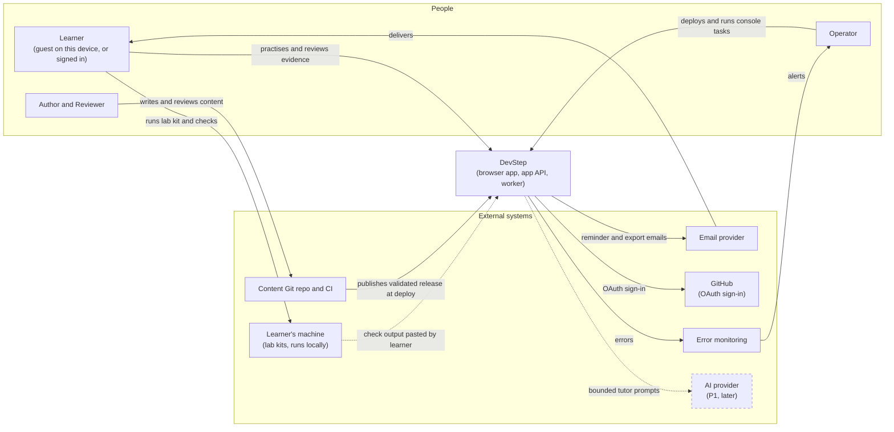
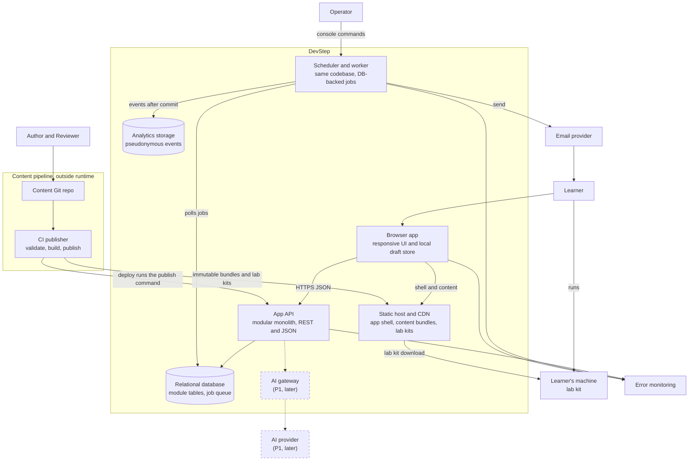
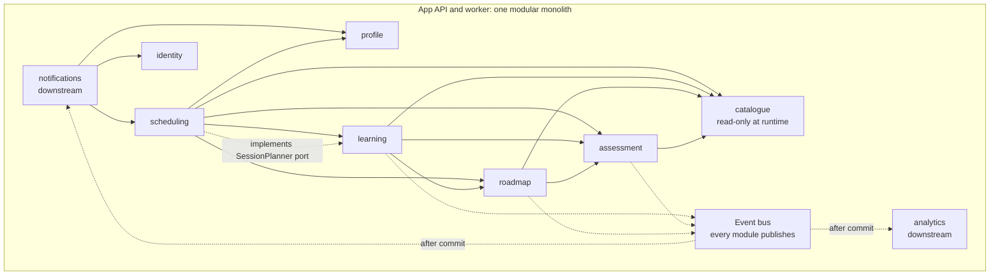
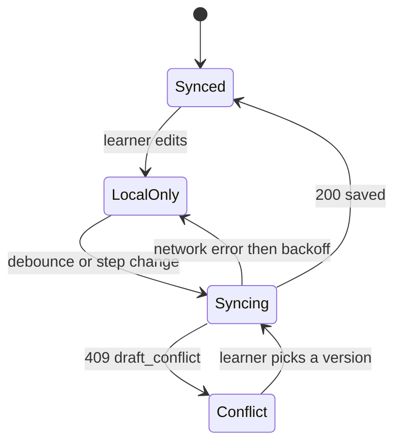

# 02 · System architecture

Status: Proposal — for discussion

Requirements: [`prd/devstep-prd-v0.1.md`](prd/devstep-prd-v0.1.md). Names and vocabulary: [`00-conventions.md`](00-conventions.md). This doc is **stack-neutral**: stack, hosting, vendors and costs are decided in `01-tech-stack-and-hosting.md`. Unless a statement is labelled **PRD**, **Hypothesis** or **Open question**, it is a **Proposal**.

## Purpose

Define DevStep's logical architecture (system context, containers, module boundaries inside one modular monolith, the final `/v1` API catalogue, cross-cutting rules and background jobs) so that `01`, `03`, `04` and `05` can build on one agreed shape.

## Summary

- **One codebase, two processes.** A modular monolith serves the API; the same build runs the scheduler/worker on a database-backed job queue. No Redis, no microservices (PRD §11, Fowler [8]).
- **Nine modules, acyclic call graph.** `catalogue` is read-only at runtime; no module reads another module's tables; `analytics` and `notifications` are strictly downstream.
- **Progress is transactional; side effects are not.** Core event subscribers (`AttemptEvaluated` → `scheduling`, `roadmap`) run inside the request transaction; analytics and email run after commit via the job queue, so they cannot block learning.
- **Server-side evaluation, CDN-delivered content.** Learner-facing content bundles are immutable, versioned and cached at the CDN without answer keys; every attempt references the exact published content version.
- **Every stored learner record has an owning account.** Guests store nothing on the server: their onboarding and sample work stays in the browser until sign-up, then a claim re-evaluates it. Cross-owner access returns 404, enforced by a generated test matrix.
- **Drafts are local-first with revisions.** Stale saves get `409 draft_conflict` with both versions, resolved for the whole draft; nothing is silently overwritten.
- **Layered idempotency:** `Idempotency-Key` replay for attempts, completion, lab artifacts, export, deletion, guest claim and migration; state guards and unique keys protect data even without a key; reminders are at most once per learner per local learning day, de-duplicated by a unique delivery row.
- **Seams, not features,** for AI tutor, briefings, companion, extra/custom roadmaps, native apps and repo integration.

## 1. Architectural drivers

| Driver | Source | Consequence |
| --- | --- | --- |
| One part-time operator | Conventions (Actors), founder | Fewest moving parts: one app, one relational database, managed email and error capture, console commands instead of an admin UI. |
| Cheapest to host | Founder | No always-on extra stores (cache, search, warehouse); static assets and content on the CDN; one small worker. |
| Learning is never blocked by side systems | PRD §12 | Analytics, email and AI are after-commit or optional (§6.12). |
| Evidence integrity | PRD F04, §9 | Server-side evaluation, content-version pinning, hints and reveals recorded by the server. |
| Continuity across devices and interruptions | PRD F03, F09, §12 | Local draft store, revisioned drafts, idempotent writes. |
| Explainable, testable rules | PRD §9 | Business rules live in module code with a fixed-clock test harness. Database triggers may enforce integrity only, never business rules. |
| Validate before expanding | PRD §14, §16 | Leave seams for P1/later features; build none of them now. |

Pilot scale: 30–50 participants (PRD §13). **Hypothesis:** one API instance and one worker are enough; confirm with the load test in §8.

## 2. System context (C4 level 1)

Constraints shown by the context: authors and reviewers never edit production data (repo → review → CI → publish, PRD F11, `06-content-system.md`); the email provider sends transactional mail only (verification, reminders, recovery, export ready); lab kits run on the learner's machine and DevStep never executes learner code (PRD §11); the AI provider is P1 (F13), absent from MVP, and reachable only through an AI gateway seam. The operator's console tasks and runbooks are in `09-security-privacy-ops.md`.

## 3. Containers (C4 level 2)

| Container | Responsibility | Notes |
| --- | --- | --- |
| Browser app | Today, Roadmap, Evidence, player, lab screens; local draft store; the guest's onboarding and sample work before sign-up; client events. | SPA vs server-rendered-with-islands is decided in `01` (AD-06). The player needs client-side state either way. |
| Static host / CDN | Hashed app shell; learner-facing content bundles at immutable versioned paths; lab kit archives. | Bundles contain no answer keys or rubric internals (AD-09). |
| App API | All business logic in nine modules (§4); auth; validation; idempotency. | Stateless; sessions and state in the database. |
| Scheduler / worker | Periodic ticks and job execution (§7). | Same build and modules as the API; separate process. |
| Relational database | Durable state for all modules, the framework's job queue, idempotency keys. | PostgreSQL (`01`). Integrity triggers and `FOR UPDATE SKIP LOCKED` are allowed; SQLite compatibility is not a constraint. Backups: `09`. |
| Analytics storage | `analytics_events` (pseudonymous). | Separate schema in the same database instance at pilot scale (Open question 1). |
| Content repo + CI | Validate, build, publish releases. | Publishing is the deploy-time `content:publish` command, run after migrations. Format and workflow: `06`. |
| Lab kits | Starter project, synthetic data, local check script. | Check output is submitted as `learner_submitted` evidence (PRD §9). |
| AI gateway (P1) | Bounded context, quotas, redaction, fallback (PRD §11). | Seam only (§9). |

## 4. Components of the modular monolith (C4 level 3)

### 4.1 Allowed dependencies

Solid arrow: may call the target's public operations synchronously. Dashed: events delivered after commit through the job queue, or a port implemented by a higher module.

### 4.2 Boundary rules

1. **One owner per table** (§4.3). Only the owner reads or writes it; others use public operations or events. Foreign keys to `users.id` and catalogue IDs are allowed (integrity, not reads). Enforced by a build-time import/table-access check in CI.
2. **Acyclic calls.** When a lower module needs a higher one, the lower module defines a port and the higher one implements it, wired at start-up: `SessionPlanner` (owned by `learning`, implemented by `scheduling`), `UserDataProvider` (owned by `identity`, implemented by every owner-scoped module for export and purge, and by `analytics` to purge the learner's events), `GuestBundleImporter` (owned by `identity`; `profile` imports onboarding answers and `learning` re-evaluates sample answers through `assessment` at claim), `HintProvider` (owned by `learning`; authored hints now).
3. **`catalogue` is read-only at runtime.** Its only writer is the deploy-time `content:publish` command, which inserts new immutable versions and marks old ones `retired`; it never updates published content in place.
4. **Downstream never blocks.** `analytics` and `notifications` are never called inside a learning transaction and only receive after-commit events. `notifications` reads upstream state (scheduling, profile, identity) at send time.
5. **In-transaction subscribers** are limited to core modules (`profile`, `roadmap`, `learning`, `assessment`, `scheduling`) and must not call external services.
6. **Owner comes from the principal**, never from a request body or path (§6.1).
7. **Event contracts** live in a shared contracts package; subscribing does not create a call dependency on the publisher.

### 4.3 Module catalogue

| Module | Responsibilities | Owned tables | Public operations (sketch) | PRD |
| --- | --- | --- | --- | --- |
| `identity` | Accounts, invites, sign-in (password and GitHub OAuth), consent, pilot cohort and arm, guest claim, export, deletion orchestration. | `users`, `auth_sessions`, `auth_tokens`, `invites`, `consent_records`, `pilot_participants`, `export_requests`, `deletion_requests` | `signUp` (invite required), `signIn`, `signInWithGitHub`, `signOut`, `verifyEmail`, `currentPrincipal`, `claimGuest`, `contactFor(user)`, `requestExport`, `requestDeletion`, `cancelDeletion`; ports `UserDataProvider`, `GuestBundleImporter` | F09, §12 |
| `profile` | Goal, stack context, availability, session length, time zone, diagnostic status. | `learning_preferences`, `goals` | `preferencesOf`, `updatePreferences`, `setGoal`, `timeZoneOf`, `availabilityOf`, `importOnboarding` (claim) | F01 |
| `catalogue` | Published roadmaps and content; release import. | `skills`, `skill_prerequisites`, `content_versions`, `missions`, `assessment_items`, `labs`, `roadmaps`, `roadmap_versions`, `roadmap_modules`, `roadmap_topics`, `topic_dependencies`, `topic_activities`, `topic_completion_rules`, `content_releases` | `listRoadmaps`, `roadmapVersion`, `mission`, `assessmentItem`, `lab`, `guestSample`, `alternatesFor(skill)`, `importRelease` (`content:publish` command only) | F11, R01, R06 |
| `roadmap` | Enrolment, topic progress, completion rules, version migration. | `roadmap_enrolments`, `topic_progress` | `enrol`, `pause`, `resume`, `previewMigration`, `migrate`, `declineMigration`, `deferTopic`, `progressOf`, `readyTopics`, `enrolmentContext` | R01–R06 |
| `learning` | Sessions, steps, drafts, attempts, hint, worked-example and reveal usage, lab artifacts, content reports. | `learning_sessions`, `session_drafts`, `session_assistance`, `attempts`, `artifacts`, `content_reports` | `startOrResume`, `session`, `saveDraft`, `useHint`, `reveal`, `submitAttempt`, `complete`, `startChallenge`, `startDiagnostic`, `submitLabArtifact`, `openSessionOf`, `practisedOn(localDate)`, `importGuestSample` (claim); ports `SessionPlanner`, `HintProvider` | F03, F04, F07 |
| `assessment` | Evaluate attempts against rubrics; write skill evidence. | `skill_evidence` | `evaluate(attempt)`, `evaluateGuest(item, answer)` (writes nothing), `recordSubmittedEvidence`, `evidenceOf(user)`, `levelFor(user, skill)` | F04, F08, §9 |
| `scheduling` | Today, session plans, review queue and intervals, recovery after absence. | `review_schedule` | `today(user, now)`, `planSession` (implements `SessionPlanner`), `dueReviews(user, localDate, cap)`, `isLearningDay(user, localDate)` | F02, F05, F06 |
| `notifications` | Reminder settings, dispatch, suppression, unsubscribe, bounce and complaint suppression. | `notification_preferences`, `notification_deliveries`, `email_suppressions` | `settingsOf`, `updateSettings`, `unsubscribe(token)`, `dispatchDue(now)` (job only) | F10 |
| `analytics` | Ingest allow-listed pseudonymous events; metric queries. | `analytics_events` | `record(event)` (job only), `ingestClientBatch`, operator metric queries | F12, §13 |
| platform (not a module) | HTTP, principal, validation, idempotency, event bus, job queue, config and flags, logging. | `idempotency_keys`; the framework's database-queue tables (named in `04`) | — | §11, §12 |

Feature flags are configuration (§6.5), not a table. Column-level definitions for every table, including those added during design, belong to `04-data-model.md`. Evaluation, scheduling and completion algorithms belong to `05-learning-engine.md`.

### 4.4 Domain events

Envelope (all events): `event_id`, `name`, `schema_version`, `occurred_at` (UTC), `owner_id`, `request_id`, payload of IDs, enums and `content_version_id` only (no free text), so the same payload can feed analytics safely.

| Event | Emitted by | In-transaction subscribers | After-commit subscribers |
| --- | --- | --- | --- |
| `AccountCreated` | `identity` | — | `analytics` |
| `GuestProgressClaimed` | `identity` | — | `analytics` |
| `OnboardingCompleted` | `profile` | — | `analytics` |
| `SessionStarted`, `SessionResumed` | `learning` | — | `analytics` |
| `HintUsed` | `learning` | — | `analytics` |
| `SolutionRevealed` | `learning` | `scheduling` (schedule a fresh alternate attempt, PRD §9) | `analytics` |
| `AttemptEvaluated` | `assessment` | `scheduling` (review interval), `roadmap` (topic check, challenge-out) | `analytics` |
| `DiagnosticFinished` | `learning` | `profile` (diagnostic status; skipped areas stay unknown) | `analytics` |
| `LabEvidenceSubmitted` | `learning` | — | `analytics` |
| `SessionCompleted` | `learning` | `roadmap` (activity rules) | `notifications` (suppress today's reminder), `analytics` |
| `TopicCompleted` | `roadmap` | — | `analytics` |
| `TopicDeferred` | `roadmap` | — | `analytics` |
| `RoadmapCompleted` | `roadmap` | — | `analytics` |
| `EnrolmentChanged` (enrol, pause, resume) | `roadmap` | `scheduling` (pause or resume reviews) | `analytics` |
| `MigrationOffered` (first preview for a target version), `MigrationDeclined` | `roadmap` | — | `analytics` |
| `MigrationAccepted` | `roadmap` | `scheduling` (remap reviews for retired items) | `analytics` |
| `ReminderSent`, `ReminderFailed`, `ReminderSettingsChanged` | `notifications` | — | `analytics` |
| `ExportRequested` | `identity` | — | `analytics`, export generation job |
| `AccountDeletionRequested` | `identity` | — | `analytics` (the event is recorded, then purged with the learner's other events on day 7) |
| `ContentReleasePublished` | `catalogue` | — | `analytics` |

`learning` writes the attempt; `assessment.evaluate` is called synchronously inside the same transaction and emits `AttemptEvaluated`. After-commit subscribers run only once the learning transaction has committed. Mapping to the analytics event names (`account_created`, `guest_progress_claimed`, `topic_deferred`, `migration_offered`, `migration_accepted`, `migration_declined`, `export_requested`, `account_deletion_requested`, `attempt_evaluated`, …) is owned by `10-measurement-and-validation.md`.

## 5. API catalogue

### 5.1 Conventions

- Base path `/v1`; JSON (UTF-8); `snake_case` fields; instants as RFC 3339 UTC (`Z`); local dates as `YYYY-MM-DD`; IDs are opaque strings; enums use canonical values.
- Additive changes stay in `/v1`; clients ignore unknown response fields. Breaking changes go to `/v2`.
- Lists that grow use cursor pagination (`cursor`, `limit`).
- Every response carries `X-Request-Id`. Replayed idempotent responses add `Idempotent-Replayed: true`.
- Browser auth: HttpOnly, Secure, SameSite session cookie plus a CSRF token on unsafe methods. There is no operator HTTP API: operator work runs as console commands, and content is published by the deploy-time `content:publish` command (`06`).

- **Auth values:** `public` (no login, rate-limited; guests use only these); `token` (no login, signed single-purpose token for unsubscribe, recovery or email verification); `learner` (signed-in account, owner = principal). There is no `guest` auth type: guests have no server identity.
- **Idempotency values:** `key` (`Idempotency-Key` header required, replay returns the stored status code and body, §6.2); `natural` (same input yields the same state: full replace, target state or unique constraint); `revision` (optimistic concurrency on `base_revision`, §5.5); `safe` (read only); `none` (a duplicate is harmless).

### 5.2 Endpoints

`(added)` marks endpoints not in the conventions starting list. No starting path was renamed.

| Method | Path | Purpose | Module | Auth | Idempotency | PRD |
| --- | --- | --- | --- | --- | --- | --- |
| GET | `/up` | Framework health route extended with a database check; outside `/v1`. | platform | public | safe | §12 |
| POST | `/v1/auth/sign-up` | Create an account with email, password and a single-use invite code bound to the invited email (required during the pilot); cohort and arm come from the invite; sends a verification email. | identity | public | natural (unique email, single-use invite) | F09, §5 |
| POST | `/v1/auth/verification/confirm` (added) | Confirm the email address with the single-use token from the verification email. | identity | token | natural | F09 |
| POST | `/v1/auth/sign-in` | Email and password sign-in. During a deletion grace period the session is limited to cancel and export (§6.1). | identity | public | natural | F09 |
| GET | `/v1/auth/github/start` (added) | Browser redirect to GitHub with a signed, single-use `state`; an `invite_code` for a new account travels in the state. | identity | public | natural | F09 |
| GET | `/v1/auth/github/callback` (added) | OAuth redirect target: checks `state`, signs in the linked account, or creates one when the invite matches a verified GitHub email; otherwise redirects back with `invite_required`. | identity | public | natural (single-use `state`) | F09 |
| POST | `/v1/auth/sign-out` | End session; client clears its local store. | identity | learner | natural | F09, §12 |
| POST | `/v1/auth/recovery` | Send recovery email; same response whether or not the email exists. | identity | public | natural | F09 |
| POST | `/v1/auth/recovery/confirm` (added) | Set a new password with a single-use token. | identity | token | natural | F09 |
| GET | `/v1/me` (added) | Account, time zone, onboarding status, deletion state, client-relevant flags. | identity | learner | safe | F09 |
| GET | `/v1/guest/sample` | The one sample scenario: learner-facing content only, no answer keys. | catalogue | public | safe, CDN-cacheable | §5 |
| POST | `/v1/guest/attempts` | Evaluate one sample answer and return feedback; stateless, stores nothing (§6.8). | assessment | public (rate-limited) | safe (writes nothing) | §5, F04 |
| POST | `/v1/guest/claim` | Upload this browser's guest bundle after sign-up or sign-in; every answer is re-evaluated and evidence is capped at `practised` (§5.3). | identity | learner | key | F09, §5 |
| GET | `/v1/me/preferences` | Stack, availability, session length, time zone, goal. | profile | learner | safe | F01 |
| PUT | `/v1/me/preferences` | Replace preferences. | profile | learner | natural | F01, R05 |
| PUT | `/v1/me/goal` | Set the one active goal. | profile | learner | natural | F01 |
| POST | `/v1/me/diagnostic` | Start a diagnostic session (returned like `POST /v1/sessions`) or skip areas. Results are attempts with purpose `diagnostic`; there is no separate baseline table. | learning | learner | natural (returns the open diagnostic session) | F01 |
| GET | `/v1/today` | Today recommendation (§5.3). | scheduling | learner | safe | F02, F05, F06, R02 |
| POST | `/v1/sessions` | Start, resume or switch session (§5.3). | learning | learner | natural (one open session per learner) | F02, F03, F06 |
| GET | `/v1/sessions/{id}` | Session, steps, latest draft. | learning | learner | safe | F03, R05 |
| PUT | `/v1/sessions/{id}/draft` | Save draft (§5.3, §5.5). | learning | learner | revision; `save_id` replay | F03, §12 |
| POST | `/v1/sessions/{id}/hints` | Show hint `hint_number`, or the worked example when `kind = worked_example`, for the current item; recorded in `session_assistance` before it is shown. | learning | learner | natural (unique per step, kind and hint number) | F03, F04 |
| POST | `/v1/sessions/{id}/reveal` | Show the solution, available at any time behind a confirmation. Before an answer is submitted it records `solution_revealed`: no qualifying attempt (nothing above `introduced`) and a fresh alternate is scheduled. The model answer shown after submission is feedback, not a reveal. | learning | learner | natural | F04, §9 |
| POST | `/v1/sessions/{id}/attempts` | Submit one attempt in a single request; synchronous evaluation and feedback. Not available offline. | learning, assessment | learner | key | F03, F04, F05 |
| POST | `/v1/sessions/{id}/complete` | Complete session; carries `base_revision`; topic progress updated exactly once. | learning | learner | key + state guard | F09, R02, R04 |
| GET | `/v1/labs/{id}` | Lab definition: brief, kit download link and checksum, setup checks, evidence format. No reference solutions. | catalogue | learner | safe | F07 |
| POST | `/v1/labs/{id}/artifacts` | Submit lab check output or decision record (`learner_submitted`; the open-ended decision record is `self_assessed`). | learning | learner | key | F07, F08 |
| POST | `/v1/content-reports` (added) | Report an error in a content step; text never enters analytics. | learning | learner | none | F11, §16 |
| GET | `/v1/roadmaps` | Published roadmaps. | catalogue | public | safe, CDN-cacheable | R01, R07 |
| GET | `/v1/roadmaps/{slug}` | Current version: modules, topics, prerequisites, effort, completion rules. | catalogue | public | safe, CDN-cacheable | R01, §8A |
| GET | `/v1/enrolments` (added) | The learner's enrolments with status and counts. | roadmap | learner | safe | R02, R05 |
| POST | `/v1/enrolments` | Enrol; pins the current published roadmap version. | roadmap | learner | natural (one active) | R01 |
| GET | `/v1/enrolments/{id}` (added) | Topic states, progress count and percentage, pinned version, milestone, migration offer if any. | roadmap | learner | safe | R02, R04, R06 |
| PATCH | `/v1/enrolments/{id}` | Pause or resume; pausing also pauses reviews and reminders. | roadmap | learner | natural | R05 |
| GET | `/v1/enrolments/{id}/migration` (added) | Preview migration to the newest version, with a `preview_hash` (§5.3). | roadmap | learner | safe | R06 |
| POST | `/v1/enrolments/{id}/migrate` | Accept or decline the previewed migration; accepting returns the new enrolment ID (§5.3). | roadmap | learner | key + preview hash | R06 |
| POST | `/v1/topics/{id}/defer` | Defer a topic; no completion credit. | roadmap | learner | natural | R03 |
| POST | `/v1/topics/{id}/challenge` | Start a challenge-out session for a topic (same `if_open` rule as `POST /v1/sessions`). | learning | learner | natural (one open session per learner) | R03 |
| GET | `/v1/evidence` | Evidence by skill: level, basis, dates, limitations. | assessment | learner | safe | F08 |
| GET | `/v1/me/notifications` | Reminder settings. | notifications | learner | safe | F10 |
| PUT | `/v1/me/notifications` | Opt in/out, days, time (15-minute steps), quiet hours, snooze (skip the next reminder), rest today (skip today's reminder). | notifications | learner | natural | F10 |
| POST | `/v1/notifications/unsubscribe` | One-click unsubscribe from an email link; the token can only unsubscribe. | notifications | token | natural | F10 |
| POST | `/v1/me/export` | Request export (allowed during a deletion grace period). | identity | learner | key; one open request | F09 |
| GET | `/v1/me/export/{id}` | Export status; short-lived authenticated download link when ready. | identity | learner | safe | F09 |
| DELETE | `/v1/me` | Request deletion: starts a 7-day cancellable grace and turns reminders off at once; purge on day 7 (§7). | identity | learner | key; returns the open request | F09, §12 |
| POST | `/v1/me/deletion/cancel` | Cancel a pending deletion during the grace period; reminders stay off until consent is given again. | identity | learner | natural (target state) | F09, §12 |
| POST | `/v1/events` | Batch of allow-listed client analytics events. Signed in: stamped with the account's `subject_id`. No login: only the guest allow-list, with the client-generated `subject_id` (§6.8). | analytics | public (rate-limited) | natural (dedupe on `client_event_id`) | F12, §13 |

### 5.3 Shape sketches (fields, not code)

**`GET /v1/today` → `200`**

| Field | Type | Notes |
| --- | --- | --- |
| `local_date`, `time_zone` | date, IANA name | Learner's current date (§6.3). |
| `situation` | enum | Examples: `first_run`, `ready`, `resume`, `returning`, `paused`, `nothing_ready`, `done_for_today`, `roadmap_complete`. `done_for_today` follows a meaningful practice activity on this learning day; its primary action is an optional "practise anyway". Final list in `05`. |
| `primary_action` | object | Exactly one. `kind` (`resume`, `mission`, `review`, `lab`, `challenge`), `mode`, `estimated_minutes`, `title`, `rationale` (why it matters), `context` (roadmap, module, topic, practical purpose), `session_id` (when resuming), `recommendation_id` (signed hash of the recommendation inputs; echoed to `POST /v1/sessions` and stored on the learning session when it starts). |
| `secondary_actions[]` | list, 0–3 | Same shape; `kind` is `resume`, `lab` or `challenge`. Never a list to browse. |
| `smaller_option` | object or null | Same shape with `mode = small`; present only when a small plan exists. A curated variant, never a truncated lesson (PRD §9). |
| `welcome_back` | object or null | `days_away`, `last_work` (title, topic, date). Only after an absence threshold (`05`). |
| `weekly_progress` | object | `practice_days_target`, `practice_days_done` (distinct learning days with a meaningful practice activity), `week_start`. Effort only, no skill claims. |
| `reviews_included` | int | Reviews folded into the action (≤ 2 `practise`, ≤ 1 `small`). No overdue count is returned (PRD §9). |
| `enrolment` | object or null | `id`, `roadmap_slug`, `status`, `completed_required`, `total_required`, `migration_available` (bool; Today shows a one-line notice, the offer itself lives on Roadmap). |

**`POST /v1/sessions`** (request)

| Field | Type | Notes |
| --- | --- | --- |
| `mode` | enum | `small`, `practise`, `build`. |
| `recommendation_id` | string, optional | From Today. The server checks the signature and recomputes the hash from current state; if it no longer matches, the server re-plans. Stored on the new session. |
| `mission_id` | ID, optional | Explicit choice from Roadmap; unready → `409 prerequisites_unmet` listing missing topics. |
| `session_id` | ID, optional | Resume this `suspended` session (from Today's `resume` action). |
| `if_open` | enum, default `resume` | `resume` returns the open session; `suspend` moves it to `suspended` (draft kept, resumable from Today) and starts or resumes the requested one. |

Response `201` (new) or `200` (existing): `session` (`id`, `mode`, `purpose`, `status` `open`/`suspended`/`completed`/`abandoned`, `started_at`, `context`, `estimated_minutes`, `current_step`), `steps[]` (`index`, `kind`, `content_version_id`, `content_url` immutable CDN path, `state`), `draft` (`revision`, `step_index`, `data`, `saved_at`) or null, `resumed` (bool). One open session per learner, whatever its mode (partial unique index, `04`); a multi-day lab is simply suspended when a short session starts. `abandoned` is used only for start-over or retired content.

**`PUT /v1/sessions/{id}/draft`** (request)

| Field | Type | Notes |
| --- | --- | --- |
| `base_revision` | int | Revision the client last received; 0 when no server draft exists yet. The first server save creates revision 1 (no revision-0 row at session start). |
| `save_id` | UUID | Per save. A retry with the same `save_id` (stored as `last_save_id`, `04`) is replayed, never a `409`. |
| `step_index` | int | Advancing past a feedback step records "feedback reviewed" (`05`). |
| `data` | object | Structured in-progress answers; ≤ 64 KB serialised. |
| `device_label` | string | Short label (≤ 60 chars) shown in the conflict UI. |

Response `200`: `revision`, `saved_at`. Stale `base_revision`: `409 draft_conflict` (§5.5).

**`POST /v1/sessions/{id}/attempts`** (request, `Idempotency-Key` required)

| Field | Type | Notes |
| --- | --- | --- |
| `step_index`, `assessment_item_id` | int, ID | Item must belong to the step. |
| `content_version_id` | ID | Version rendered; must equal the session's pin, else `409 content_version_mismatch`. |
| `answer` | object | By item kind: option IDs, ordering, value, free text (≤ 32 KB per answer, ≤ 64 KB per attempt), or self-check ratings against the exemplar shown in the step. One request per attempt: there is no separate self-check call. |
| `confidence` | enum, optional | Recorded; never evidence of competence (PRD §9). |

The browser disables "Check answer" while offline; attempts are never queued. Response `201`: `attempt_id`; `outcome` (`correct`, `partially_correct`, `incorrect`, `self_met`, `self_not_met`; definitions in `05`); `assistance` (server-recorded `none`, `hint` with count, `worked_example`, `solution_revealed`; the client cannot assert it); `feedback` (authored text, misconception note, exemplar and self-check prompts); `evidence_changes[]` (`skill_id`, `from_level`, `to_level`, `basis`; at most one `skill_evidence` row per attempt, unique); `next_step_index`; `revisit_hint` (neutral text such as "We'll bring this back in a few days").

**`POST /v1/sessions/{id}/complete`** (request, `Idempotency-Key` required): one field, `base_revision` (int). The client must sync its draft first; a newer server revision → `409 draft_conflict`.

Response `200`: `session_id`, `completed_at`; `summary` (`steps_done`, `attempts`, aggregated `evidence_changes`, `effort_highlights` such as `started`, `returned_after_gap`, `corrected_misconception`, kept separate from evidence, PRD §6); `topic_changes[]` (`topic_id`, `from_state`, `to_state`, applied once, R02); `roadmap_progress` (`completed_required`, `total_required`, `percent`); `milestone` (when the roadmap completes, R04) or null; `next_suggestion` (next planned day, not a demand). A repeat returns the identical stored status code and body.

**`POST /v1/guest/attempts`** (no login): `assessment_item_id`, `content_version_id` (from `GET /v1/guest/sample`), `answer`. Response `200`: `outcome`, `feedback`. No attempt ID, no rows written, answers never logged.

**`POST /v1/guest/claim`** (request, `Idempotency-Key` required)

| Field | Type | Notes |
| --- | --- | --- |
| `subject_id` | UUID | The browser's random analytics ID; the account adopts it so the funnel joins up. |
| `onboarding` | object | Preference and goal answers, imported by `profile`. |
| `sample` | object | `content_version_id` and `attempts[]` (`assessment_item_id`, `answer`, `answered_at`). |

Response `200`: `claimed_attempts`, `evidence_changes[]`. The server re-evaluates every answer against the pinned content version and records evidence **capped at `practised`**, because the browser could have edited answers after seeing feedback. A repeat with the same key replays the stored response. Merge rules when the account already has data: `03`.

**`GET /v1/enrolments/{id}/migration` → `200`**: `to_version_id`, `preview_hash`, `required_before` and `required_after` (`completed`, `total`), `topics[]` (`topic_key`, `change`, `credit`, `refresh_suggested`). A completed topic whose objective changed keeps its credit and is marked "Refresh suggested" (`05`).

**`POST /v1/enrolments/{id}/migrate`** (request, `Idempotency-Key` required): `to_version_id`, `preview_hash`, `decision` (`accept` or `decline`).

- `accept` → `200` with `enrolment_id` (the **new** enrolment; the old one becomes `migrated`), `previous_enrolment_id`, `roadmap_progress`, `topic_changes[]`.
- `decline` → `200` with the unchanged `enrolment_id`; the offer stays available on Roadmap.
- The hash no longer matches current state → `409 migration_preview_stale` with a fresh preview in `details`; nothing changes.
- A session is open → `409 session_open`. Migration applies only after the open session ends: the learner finishes it or sets it aside, and a suspended session finishes on its original content version.

### 5.4 Standard error envelope

| Field | Type | Notes |
| --- | --- | --- |
| `error.code` | string | Stable snake_case; clients branch on it. |
| `error.message` | string | Plain English, safe to display; never echoes learner input. |
| `error.request_id` | string | Same as `X-Request-Id`. |
| `error.retryable` | bool | Safe to retry with the same idempotency key. |
| `error.details` | object or null | Code-specific. |
| `error.fields` | list or null | Validation only: `field`, `code`, `message`. |

| HTTP | Codes |
| --- | --- |
| 400 | `malformed_request` |
| 401 | `unauthenticated`; `token_invalid` (bad, expired or used signed token: unsubscribe, recovery, email verification, OAuth `state`) |
| 403 | `invite_required` (sign-up without a valid invite for this email), `account_pending_deletion` (only cancel and export are allowed during the grace period), `forbidden` |
| 404 | `not_found`, also returned for another learner's resource |
| 409 | `draft_conflict`, `content_version_mismatch`, `prerequisites_unmet`, `session_not_open`, `session_open`, `migration_preview_stale`, `request_in_progress` |
| 422 | `validation_failed`, `idempotency_key_reused` |
| 429 | `rate_limited` with `Retry-After` |
| 503 | `temporarily_unavailable` with `Retry-After` |
| 500 | `internal_error` |

### 5.5 Stale-draft conflict

`409 draft_conflict` `details`: `server_revision`, `server_step_index`, `server_saved_at`, `server_device_label`, `server_data`, `your_base_revision`.

Client rule: keep the local draft; show both versions ("Saved on *Phone* at 19:42" vs "This device") and highlight the steps that differ; the learner keeps one version for the **whole draft** (no per-step merge, no "decide later"); the client re-sends the chosen data with `base_revision = server_revision`. The server never merges answer content and never overwrites a newer revision silently (PRD §12). Flow detail: `03-key-flows.md`.

## 6. Cross-cutting concerns

### 6.1 Ownership scoping and authorisation

- Every stored learner record has an owning account: each learner-owned table carries a non-null owner (`user_id`). Guests store nothing server-side (§6.8). Data access for these tables takes `owner_id` from the authenticated principal; lookups are by `id AND owner`. Children (attempts, drafts, artifacts) inherit the parent's owner.
- Another learner's resource → `404 not_found` (no existence leak).
- An account in its deletion grace period signs in to a restricted principal: only `GET /v1/me`, `POST /v1/me/deletion/cancel`, the export endpoints and sign-out are allowed; anything else → `403 account_pending_deletion`.
- There is no operator HTTP API. Operator support access to learner data goes through audited console commands (`09`).
- **Authorisation test matrix (PRD §12):** generated from the route table. For every route with an ID: learner B on A's resource → 404; no principal on `learner` routes → 401; account in deletion grace on any route outside the allowed set → 403. CI fails if a route has no auth classification. Attempts, drafts, exports and guest claim are explicitly listed cases.
- Not planned for MVP: database row-level security. Revisit if anything other than the app (for example, analyst access) connects to the primary database.

### 6.2 Idempotency

| Aspect | Rule |
| --- | --- |
| Key | Client-generated UUID per **user action** (not per retry), persisted in the local draft store so retries after reload reuse it. |
| Required on | One scope each (names in `04`): attempt submission, session completion, lab artifacts, guest claim, enrolment migration, export request, account deletion. Reminder email is **not** keyed here: the unique `notification_deliveries` row de-duplicates it (§7). |
| Storage | `idempotency_keys` (`04`): unique (`user_id`, `scope`, `key`), request hash, state, stored response status code and body, `expires_at`. |
| Write | Key row, business change and stored response commit in **one transaction**. A concurrent duplicate blocks on the unique index until the first commits, then replays (PostgreSQL behaviour). |
| Replay | Same key + same hash → the originally stored status code and body, `Idempotent-Replayed: true`. Same key + different hash → `422 idempotency_key_reused`. In-flight beyond timeout → `409 request_in_progress` (retryable). |
| TTL | 7 days; daily housekeeping deletes expired keys. |
| Defence in depth | State guards (`open → completed` only once), unique keys on `topic_progress` transitions and one `skill_evidence` row per attempt, so data stays correct even if a key is lost. |
| Jobs and events | At-least-once; every handler is idempotent; consumers dedupe on `event_id`. |

### 6.3 Time and time zones

| Concern | Rule |
| --- | --- |
| Storage | Instants in UTC. Future local facts (review due date, preferred reminder time) are the source of truth, stored as local `date`/`time` plus the learner's IANA zone. A derived `next_reminder_at` (UTC) index is allowed because it is recomputed whenever the zone or reminder settings change and after each send decision. |
| Learning day | `local_date` = now converted to the learner's zone, with the day boundary at 04:00 local time. Daily rules (one reminder per learning day, due reviews, practice days, "practised today") key on `local_date`. |
| Intervals | Review intervals (≈ 1, 3, 7, 21 days, PRD §9) are calendar-day arithmetic on local dates, so DST never moves a review into another day. |
| Reminder instant | Computed per day: local date + preferred local time → UTC. Non-existent time (spring forward) → shift forward by the gap; ambiguous time (fall back) → earlier occurrence. |
| Zone change | Applies from the next local day. Unique delivery key (user, local date) plus a minimum gap between reminders (12 h proposed) prevents a double send. |
| Zone source | Detected by the browser at onboarding, confirmed by the learner, editable. Never inferred from IP. |
| Clocks | Server time is authoritative; client timestamps are informational. |
| Tests | Fixed-clock harness with DST transitions for `Europe/London`, `America/New_York`, `Australia/Adelaide` (half-hour offset with DST) and `Asia/Kolkata` (half-hour offset, no DST). |

### 6.4 Content-version pinning

- Published content is immutable: every change publishes a new `content_versions` row and a new immutable CDN path. Old versions become `retired`, never deleted, so history and evidence still render (PRD §12).
- Enrolment pins a `roadmap_versions` row (R01). A session pins each step's `content_version_id` at creation; attempts store `assessment_item_id` and `content_version_id` (PRD §11); evidence references attempts.
- Retirement stops new recommendations only. Migration to a new roadmap version is an explicit learner action with a preview of retained credit (R06; rules in `05`, content side in `06`).

### 6.5 Configuration, tunables and feature flags

| Kind | Examples | Where | Change process |
| --- | --- | --- | --- |
| Secrets | Database credentials, email API key, cookie and token signing keys | Host secret store / environment | Operator; rotation in `09` |
| Deploy config | Base URLs, CDN origin, allowed origins | Environment | Deploy |
| Learning tunables | Review intervals, review caps (2/1), retained delay (≥ 7 days), absence threshold, guest bundle expiry in the browser (30 days), idempotency TTL (7 days), reminder window and minimum gap | Versioned config file in the app repo; config hash logged at start-up | Pull request + deploy; records note the policy version applied (`04`/`05`) |
| Feature flags (kill switches) | `reminders_enabled`, `guest_sample_enabled`, `new_signups_enabled`, `client_events_enabled`, later `ai_tutor_enabled` | Configuration (environment variables), read at start-up; no database table | Change in the host's environment settings, which redeploys or restarts the app; the host logs the change |

Flags are global booleans, few, and removed when stable. Tunables that change learning outcomes are code-reviewed, not toggled at runtime.

### 6.6 Rate limiting

| Scope | Proposed limit (tunable) | Key |
| --- | --- | --- |
| Sign-up, sign-in, OAuth start, recovery | 5 per minute, 20 per hour | IP + email (IP only for OAuth) |
| Guest sample attempts | 60 per hour | IP |
| Unsubscribe, recovery confirm, verification confirm | 30 per minute | IP |
| Learner writes (drafts, attempts, hints) | 60 per minute | principal |
| Client events | 120 per minute, ≤ 50 events per batch | principal, or IP without login |

Pilot: in-process counters on the single instance. Move to database-backed counters if a second instance is added. Exceeded → `429 rate_limited` with `Retry-After`. Draft autosave is debounced client-side so normal use never approaches the limit.

### 6.7 Input validation and safe rendering

- Every request is validated at the boundary against a schema: types, enums, lengths, unknown-field rejection on writes. Limits: body ≤ 256 KB, draft `data` ≤ 64 KB, free-text answer ≤ 32 KB (≤ 64 KB per attempt), lab artifact ≤ 64 KB of text or JSON.
- Parameterised SQL only.
- Learner text is stored and rendered as **plain text** (output-encoded); no learner Markdown or HTML in MVP. Learner text never appears in emails, logs or analytics.
- Authored Markdown is compiled to HTML in CI with an allow-list sanitiser (`06`). A Content-Security-Policy forbids inline script. Code samples render as text.
- Export files are JSON; if CSV is ever added, neutralise formula-leading cells.

### 6.8 Guest mode

| Item | Where | Notes |
| --- | --- | --- |
Guest work is **device-only**. The server stores no guest rows, no guest `users` record and no guest cookie, and there is no `guest` auth type.

| Item | Where | Notes |
| --- | --- | --- |
| Scope | Onboarding plus the one sample scenario | No enrolment, diagnostic, further sessions, reminders, labs or export before sign-up. |
| Onboarding answers, sample drafts and attempts | Browser storage (IndexedDB/localStorage) | UI promise (`08`): "Saved only in this browser on this device until you create an account." (PRD §5) |
| Sample content | `GET /v1/guest/sample` | Learner-facing content only; answer keys stay on the server. |
| Sample feedback | `POST /v1/guest/attempts` | Server-side evaluation through `assessment.evaluateGuest`: no auth, rate-limited, stateless, stores nothing. |
| Claim | After sign-up or sign-in, `POST /v1/guest/claim` uploads the bundle | Idempotent (`Idempotency-Key`). Every answer is re-evaluated against the pinned content version; evidence is capped at `practised`. Merge rules: `03`. |
| Expiry | The browser deletes an unclaimed bundle after 30 days | No server purge job, because there is nothing to purge. |
| Analytics | A random client-generated `subject_id`, sent with allow-listed events through `POST /v1/events` | Only `sample_started`, `first_answer_submitted`, `attempt_evaluated` (sample) and `guest_progress_claimed`. On claim the account adopts the `subject_id`, so the funnel spans sign-up (F12). |
| Uninvited visitor | Finishes the sample, then sees how to ask to join | A link to the pilot recruitment form (`10`); there is no waitlist table. |

### 6.9 Offline and draft sync (high level)

- The local draft store holds, per session: latest draft, `base_revision`, pending `save_id`, pending idempotency keys and sync status. Signing out clears it.
- Every edit writes locally first; the client sends `PUT …/draft` after a short idle debounce and **before every step transition** (PRD §12). If the network is down, reading steps and editing can continue and drafts keep saving locally, with the UI showing "Saved on this device, not yet synced". "Check answer" is disabled while offline: evaluation is server-side and attempts are never queued.
- One open session per learner; a second device resumes the same session, and revisions detect concurrent edits. Sequences: `03-key-flows.md`.

### 6.10 Caching

| What | Where | Policy |
| --- | --- | --- |
| App shell assets | Static host/CDN | Content-hashed names, long-lived immutable caching; the entry HTML is revalidated on each load. |
| Published content bundles, lab kits | Static host/CDN | Immutable versioned paths; long-lived caching; never purged (retired versions stay). |
| `GET /v1/roadmaps`, `/v1/roadmaps/{slug}` | CDN | Short public TTL; changes only on release. |
| Learner API responses | None | `Cache-Control: no-store`. |
| Catalogue reads in the app | In-process memo keyed by version ID | Safe because versions are immutable. Nothing mutable is cached. |
| App cache (Redis or similar) | None | Revisit only when Today p95 nears budget after query tuning (AD-03). |

An offline-capable app shell (service worker) is an option for `01`/`08`, not a requirement.

### 6.11 Observability hooks

| Hook | Rule |
| --- | --- |
| Request ID | Generated at entry (or accepted from a trusted proxy), returned as `X-Request-Id`, included in errors, logs, events and jobs started by the request. |
| Structured logs | One JSON line per request and job: time, level, `request_id`, route template, status, duration, module, pseudonymous subject. Never bodies, answers, drafts, emails, tokens or cookies. |
| Error capture | Server and browser exceptions to error monitoring with scrubbing of bodies, cookies, query tokens and headers. |
| Metrics | Per-route rate and p50/p95 latency, error rate, job queue depth and oldest-job age, job failures, reminder sent/failed, draft conflicts, idempotent replays, database connections. Collection method in `01`. |
| Health | `/up` (the framework's health route, extended with a database check) plus an external uptime check. |
| Alerts (few, actionable) | Site down; 5xx rate spike; oldest job > 30 min; reminder failure spike; backup verification failed; deletion request not purged by day 25 after the request. |

### 6.12 Graceful degradation

| Outage | Learner impact | Behaviour |
| --- | --- | --- |
| Email provider | No reminders, verification or recovery emails; learning unaffected | Reminders are at most once: an ambiguous timeout is marked `failed` and never retried, and no reminder is sent late for a past day. Verification, recovery and export emails retry. |
| Analytics storage or ingestion | None | Event jobs retry then dead-letter; `POST /v1/events` returns `202` and may drop; learning transactions never write analytics. |
| Error monitoring | None | SDK fails silently; logs remain. |
| AI provider (P1) | Tutor unavailable | `HintProvider` falls back to authored hints; spend caps trip the same path (PRD §11). |
| Static host/CDN | New page loads fail; API stays up | Accept for pilot; `01` should prefer a host with origin fallback or keep shell and API on the same provider. |
| Worker down | Reminders skipped for the missed window; exports, purges and analytics delayed | Today and the player are computed on request; alert on oldest-job age. |
| Content publish failure | No new content | Transactional `content:publish`; current versions keep serving; the deploy reports the failure. |
| Relational database | API unavailable | `503` with `Retry-After`; local drafts retained; restore per `09`. |

## 7. Background jobs

Mechanics: jobs use the framework's database-queue tables (named in `04`) in the relational database; workers claim with `FOR UPDATE SKIP LOCKED`; delivery is at-least-once with a visibility timeout, capped exponential retries, and a terminal `failed` state. Periodic handlers are idempotent per time slot, so a tick enqueued twice after a restart does no double work. Operators retry failed jobs by console command. Reminder send is the one deliberate exception to retries (at most once, below).

| Job | Module | Trigger / frequency | Idempotency | Failure behaviour |
| --- | --- | --- | --- | --- |
| Event fan-out (one job per downstream subscriber per event) | platform → analytics, notifications | Enqueued in the publishing transaction, run after commit | Subscribers dedupe on `event_id` | Retries (≈ 1 h total, tunable), then `failed`; never visible to the learner. |
| Reminder scan | notifications | Scheduler tick every 15 min; reminder times are in 15-minute steps | Selects due learners from the derived `next_reminder_at` index and claims one `notification_deliveries` row per learner per local learning day (unique) before enqueuing the send | Missed tick is harmless; the next tick catches up inside the send window. |
| Reminder send | notifications | From scan | **At most once.** The unique delivery row is the de-duplication key (status `claimed` → `sent`, `suppressed` or `failed`); no idempotency key is used. Suppression re-checked right before send: practised today, enrolment paused, rest today or snooze, deletion pending, quiet hours (default 21:00–08:00 local; a reminder that falls inside is skipped, not carried over) | No automatic retry after an ambiguous timeout: the row is marked `failed`. Never sends late (send window 2 h after the reminder time, proposed). `next_reminder_at` is recomputed after each decision. |
| Export generation | identity via `UserDataProvider.export` | On request | One open request per user; re-run overwrites its own output | 3 retries, then `failed`; learner can re-request; operator alerted. Output kept in the database 7 days, downloaded through a short-lived authenticated link. |
| Deletion purge | identity via `UserDataProvider.purge` | Daily; picks requests whose 7-day grace has ended | Delete-by-owner per module, **including that learner's analytics events**; per-module completion recorded; the deletion ledger outside the main database is written at request and at purge so purges are re-applied after any restore (`04`, `09`) | Resumes next run; alert if a request is not purged by day 25, inside the 30-day promise (§12). |
| Weekly analytics snapshot | analytics | Weekly during the pilot | One frozen aggregate per week and arm; re-run is a no-op | Pilot metrics survive account deletions; each deleted account is reported as a counted exclusion (`10`). |
| Housekeeping | platform | Daily | Delete where expired (idempotency keys after 7 days, export files, finished jobs) | Retry next day; alert on table growth. |
| Content publish | catalogue | Deploy-time `content:publish` command, run by the pipeline after migrations (`06`) | `release_key` + `manifest_hash` (`04`): same key and hash is a no-op; same key with a new hash is rejected | One transaction; the command refuses unreviewed content (`06`); schema, reference or prerequisite-cycle failure rolls back and fails the deploy. |
| Backup verification | Outside the app (host tooling or scheduled CI) | Weekly (proposed); full restore drill before the pilot (PRD §12) | Restores into a throwaway cloud database, never a laptop | Alert operator; procedure in `09`. |

## 8. Non-functional requirements

| Requirement | Source | Target | How the architecture meets it | Verified by |
| --- | --- | --- | --- | --- |
| Today latency | PRD §12 | p95 < 500 ms at pilot load | Owner-scoped indexed reads in one database; memoised immutable catalogue; no external calls or analytics writes on the path | Load test at 3× pilot concurrency (Proposal); conditions recorded |
| First usable screen | PRD §12 | ≤ 2.5 s, cached content, representative mobile | Shell and content from CDN with immutable caching; Today fetched in parallel | Throttled-profile test; conditions recorded |
| Authorisation | PRD §12 | No access to another learner's attempts, drafts, exports | §6.1 scoping and generated matrix | CI |
| Transport and sessions | PRD §12 | TLS, secure sessions | HTTPS only with HSTS; HttpOnly Secure SameSite cookies; CSRF token; session rotation on sign-in | `09` checklist |
| Draft durability | PRD F03, §12 | No lost input; no silent overwrite | §5.5, §6.9 | End-to-end tests with network toggling |
| Exactly-once progress | PRD F09, R02 | Duplicates never double-count | §6.2 keys, state guards, unique keys | Concurrent duplicate-request tests |
| Degradation | PRD §12 | Email, AI, analytics outages never block learning | §4.2 rule 4, §6.12 | Fault injection per dependency |
| Backups | PRD §12 | Restore tested before pilot | §7 verification and drill | `09` runbook |
| Analytics privacy | PRD §12, F12 | No answer text, code or emails in events | Allow-listed schemas; pseudonymous subject IDs; server validation of client events | Schema tests; log scan |
| Deletion | PRD §12 | Active records removed ≤ 30 days; backups age out within a further 30 days | 7-day cancellable grace, daily purge job on day 7 (analytics events included), alert by day 25, deletion ledger outside the main database | Test and monthly check |
| No training without consent | PRD §12 | Separate explicit consent | No model calls in MVP; consent seam (§9) | Review |
| No timed answers | PRD §5, §10 | No countdowns | Session model has no time limits | `08` |

| Edge case (PRD §12) | Architectural mechanism | Rules in |
| --- | --- | --- |
| Skipped diagnostics | Absent evidence = unknown; `DiagnosticFinished` records skips | `05` |
| All prerequisites unmet | Today offers a refresher or `nothing_ready`; `409 prerequisites_unmet` | `05` |
| Repeated incorrect answers | `AttemptEvaluated` → earlier alternate review and worked example | `05` |
| Exhausted content | `nothing_ready` / `roadmap_complete`; maintenance practice | `05`, `08` |
| Obsolete lesson versions | Pins, retained bundles, migration preview | §6.4, `06` |
| Duplicate submissions | Idempotency keys and unique keys | §6.2 |
| Abandoned sessions | Stay resumable; starting another session moves the open one to `suspended` (`if_open = suspend`) | `05` |
| Long absences | `welcome_back`, retrieval check first, review cap | `05` |
| Daylight-saving changes | Local-date arithmetic and reminder rules | §6.3 |
| Concurrent devices | One open session, revisions, whole-draft conflict UI | §5.5, §6.9 |

## 9. Extension seams

| Later feature | Seam to leave now | Do NOT build yet |
| --- | --- | --- |
| AI tutor (F13) | `HintProvider` port with an authored implementation; assistance already recorded; content carries source references; `ai_tutor_enabled` flag name reserved; container slot for an AI gateway with quotas and redaction | Gateway, prompt store, embeddings or vector search, usage metering, consent UI |
| Technology briefing (F14) | Today response can gain an optional secondary item; catalogue can add a content kind via a release | Briefing feed, news ingestion |
| Companion (F15) | Effort events (`SessionCompleted`, return after gap) already emitted; a future downstream module consumes them | Art, animation, companion state |
| Extra roadmaps (R07) | Catalogue is multi-roadmap; slug-based API; "one active enrolment" enforced in code, not schema | Additional content, rich switching UI |
| Custom roadmap (R08) | Roadmap versions are data assembled from published modules | Editor, AI-generated curricula |
| Native apps | Versioned REST API is the only contract; principal abstraction can accept bearer tokens; `notifications` keeps a channel field (email only) | Apps, push notifications |
| Passkeys | Sign-in is an `identity` operation with pluggable credential types (password and GitHub OAuth at pilot, `01`) | WebAuthn registration and sign-in |
| Repository integration | Lab artifacts accept versioned structured check output; `learner_submitted` basis | Repo scanning, repository-scope Git-host access (sign-in OAuth requests no repository scope), server-side code execution (PRD §7, §11) |
| Human review (`human_reviewed`) | Evidence basis enum already exists | Reviewer queue |
| File uploads | Artifacts stored as bounded text now | Object storage (PRD §11) |

## 10. Architecture decision mini-log

| ID | Decision | Rationale | Revisit when |
| --- | --- | --- | --- |
| AD-01 | Modular monolith, nine modules | One part-time operator; in-process calls and single-database transactions keep progress consistent; PRD source [8] (Fowler, *Monolith First*, practitioner guidance, not a universal rule) and PRD §11 | A module needs independent scaling or release cadence, a second team owns part of the system, or a component needs a separate security or cost boundary |
| AD-02 | Database-backed job queue and scheduler in the same codebase | Enqueue in the business transaction gives an outbox with no extra infrastructure (PRD §11) | Queue polling measurably affects database latency or job volume outgrows it |
| AD-03 | No Redis or other in-memory store | PRD §11: only when measurements justify; queue, sessions, rate limits and caching are covered | Multiple instances need shared rate limits, or Today p95 nears budget after query tuning |
| AD-04 | No microservices; the worker is the same build | Avoid distributed transactions and extra deploy and observability cost (PRD §2, [8]) | Same triggers as AD-01 |
| AD-05 | REST + JSON under `/v1`, cookie sessions | Simple, debuggable, CDN-friendly for public reads, usable by future native clients | Round trips slow the first screen, or native apps arrive (add token auth, keep REST) |
| AD-06 | Rendering approach (SPA vs server-rendered) deferred to `01` | Cost and operations weighting belongs there. Constraint from here: local draft store and one API contract | Decided in `01` |
| AD-07 | In-process events: core in-transaction, downstream after commit | Consistent progress; side systems cannot block learning (PRD §12) | Long transactions or many subscribers |
| AD-08 | Business logic in app modules; database enforces integrity only (FK, unique, check, integrity triggers; never business rules in triggers) | Testable, explainable rules (PRD §9); one place to read logic | A measured hot path cannot meet its budget without moving work into the database |
| AD-09 | Server-side evaluation; public bundles exclude answer keys | Evidence integrity (F04) | Offline practice becomes a validated need (then ship keys only for low-stakes practice items) |
| AD-10 | Guest work is device-only; the sample is evaluated statelessly and the claim re-evaluates with evidence capped at `practised` | No guest records to secure, purge or hijack; nothing stored before an account exists; a claim cannot inflate evidence | Guests need cross-device work or more than the sample, or the stateless endpoint is abused |
| AD-11 | Pilot login: invite-only sign-up, email + password with verification, GitHub OAuth; passkeys later; no magic links | Framework auth with no extra vendor; email stays off the sign-in critical path (`01`) | Passkey support is confirmed in the pinned framework version, or invites end after the pilot |

## Open questions for discussion

1. **Analytics storage.** *Recommended default:* a separate schema in the same database instance, written only by after-commit jobs; move out when rollups or volume affect the primary.
2. **Answer keys.** *Recommended default:* server only; CDN bundles carry learner-facing material and feedback is returned by the attempts and guest-attempts endpoints.
3. **Lab evidence format.** *Recommended default:* pasted text or JSON ≤ 64 KB in `artifacts`; no binary uploads or object storage.
4. **Operator interface.** *Recommended default:* console commands plus audited database access; no admin UI in MVP.
5. **Instance count.** *Recommended default:* one API instance and one worker for the pilot; keep the API stateless so scaling out only needs database-backed rate limits.

## PRD traceability

| PRD | Covered in |
| --- | --- |
| F01, F02 | §4.3 `profile`; §5.2 preferences, goal, diagnostic; §5.3 `GET /v1/today` |
| F03, F04 | §5.3 sessions, drafts, attempts, assistance; §4.4 `AttemptEvaluated`; §6.9; AD-09 |
| F05, F06 | §4.4 scheduling subscribers; §5.3 review cap, `welcome_back`, `smaller_option`, `secondary_actions`; §8 edge cases |
| F07, F08 | §2, §3 lab kits; `GET /v1/labs/{id}`, `POST /v1/labs/{id}/artifacts`; `GET /v1/evidence`; §4.3 `assessment` |
| F09, F10 | §5.2 identity and notification endpoints; §5.3 guest claim; §6.1; §6.2; §6.3; §7 export, purge and reminder jobs; AD-11 |
| F11, F12 | §3 content pipeline; §7 `content:publish`; §4.4 envelope; §6.11; `POST /v1/events` |
| F13–F15, R07, R08 | §9 seams |
| R01–R06 | §4.3 `roadmap`; §5.2 enrolment endpoints; §5.3 migration preview and decision; §6.4 |
| §5, §9 | §6.8 device-only guest first value; AD-10; §4.4, §5.3 adaptation hooks (algorithms in `05`) |
| §11, §12, §13 | §3, §4, §6, §7, §8, §10; event mapping in `10` |
| Source [8] (Fowler, *Monolith First*) | AD-01, AD-04 |
