# 03 · Key flows

Status: Proposal — for discussion

## Purpose

Show how the logical modules work together in the fourteen flows that make or
break the DevStep core loop, so the founder can judge scope, risk and effort
before choosing a stack. The flows show calls, ownership and failure behaviour.
Algorithms (`05-learning-engine.md`), columns (`04-data-model.md`), screens
(`08-ux-and-screens.md`) and vendors (`01-tech-stack-and-hosting.md`) are
covered elsewhere.

## Summary

- One daily loop: Today → session → attempt → evidence → review schedule →
  completion → next action. Every other flow either feeds this loop or protects it.
- Before sign-up, guest work exists **only in the learner's browser**. When the
  guest claims it, the server evaluates the answers again and caps the evidence
  at `practised`, so a guest cannot forge evidence. Pilot sign-up needs an
  invite. **Proposal**
- Anything that could run twice (attempt, completion, claim, migration, lab
  evidence, reminder) has an idempotency key or a conditional update. The
  database guarantees "exactly once". The client does not.
- Drafts are saved locally first, then sent with `base_revision`. If the
  revision is stale the server returns `409 draft_conflict` and the learner
  chooses which version of the whole draft to keep. Nothing is silently
  overwritten (PRD §12). Answers are checked only online.
- Hints, worked examples and reveals are recorded on the server. Revealing the
  solution before submitting leaves no qualifying attempt (nothing above
  `introduced`) and schedules a fresh alternate attempt (PRD §9).
- Missed sessions and long absences create no catch-up debt. The learner gets
  resume or a three-minute refresher, and reviews stay capped (F06, R05).
- Reminders are checked in each learner's IANA zone, at most one per learning
  day, and skipped once the learner has practised that day. Missing one
  reminder is better than sending two. **Proposal**
- Published content and roadmap versions never change. Retiring keeps history.
  Roadmap migration is always the learner's explicit choice, with progress
  before and after shown (F11, R06).

## How to read the diagrams

| Participant | Meaning |
| --- | --- |
| Learner, Author, Reviewer | People (actors in `00-conventions.md`). |
| Browser, Local draft store | The single-page app (SPA) and its durable browser storage for drafts, their idempotency keys and guest work. |
| API | HTTP layer of the single deployable. Authenticates, scopes requests to their owner, opens the transaction. |
| `identity` … `analytics` | Canonical modules. Arrows between them are in-process calls, not network hops (`02`). |
| DB, Scheduler | The single database, and a job runner backed by that database (ticks and queued jobs). |
| Email provider | Outbound email service (choice in `01`). |
| Content repo, CI publisher | The authoring repository and the continuous-integration (CI) pipeline that validates and publishes content. |
| Learner machine | Where lab kits run. The server never executes learner code. |

Diagrams write path parameters as `:id` because Mermaid labels avoid braces.
`(added)` marks an endpoint or event that is not in `00-conventions.md`. Other
docs are referred to by number (`05` = `05-learning-engine.md`, as in the
document map).
Unless a note says otherwise, each API request is one DB transaction.

## Cross-cutting rules used by every flow

| Rule | Behaviour | Label |
| --- | --- | --- |
| Owner scoping | The user ID comes from the login session, never from the request body. Another learner's session, draft, attempt or export returns `404`. | PRD §11, §12 |
| Idempotency keys | The Browser creates one key for each thing the learner means to do and stores it with the local draft, so a reload reuses it. The server stores (user, scope, key, request hash, stored response) in `idempotency_keys` for 7 days, under a unique constraint, in the same transaction as the effect. Same key and same body: the stored response is replayed with its original status code (for example `201`). Same key and different body: `422`. Key still in flight: the request waits for the first to commit and then replays, or gets `409` and retries. | Proposal |
| Conditional transitions | State changes use "update where state = expected". The number of rows changed shows which request won. | Proposal |
| Drafts | Optimistic concurrency with `base_revision` (flow 4). | PRD §12 |
| Analytics | Emitted after commit. Domain events come from the server. Events only the UI sees use `POST /v1/events`. Payloads hold IDs, content version, mode and timestamps only. An analytics outage never blocks learning. | PRD F12, §12, §13 |
| Time | Stored in UTC. A **learning day** runs from 04:00 to 04:00 local time in the learner's IANA zone, so practice at 00:30 counts for the day before. | PRD §11, Proposal |
| Content pinning | Sessions and attempts reference the exact published content version. Retired versions stay readable. | PRD §11, §12 |
| Non-blocking dependencies | An email, AI or analytics failure degrades one feature and never blocks a session. | PRD §12 |

```sql
-- "exactly once", illustrated: only the request that changes the row has side effects
UPDATE topic_progress
   SET state = 'completed', completed_at = now()
 WHERE enrolment_id = :enrolment AND topic_id = :topic AND state <> 'completed';
-- 1 row  → this request completed the topic (recount progress, maybe milestone)
-- 0 rows → already completed: return the stored summary, no second credit
```

## Daily core loop overview

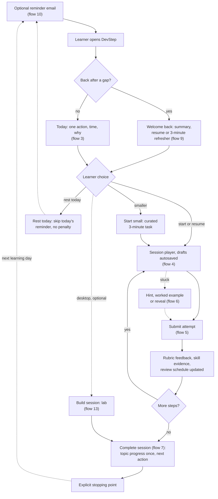
```mermaid
flowchart TD
    REM["Optional reminder email<br/>(flow 10)"] --> OPEN["Learner opens DevStep"]
    OPEN --> GAP{"Back after a gap?"}
    GAP -->|"yes"| WB["Welcome back: summary,<br/>resume or 3-minute refresher (flow 9)"]
    GAP -->|"no"| TODAY["Today: one action, time, why<br/>(flow 3)"]
    WB --> PICK{"Learner choice"}
    TODAY --> PICK
    PICK -->|"start or resume"| SESS["Session player, drafts autosaved<br/>(flow 4)"]
    PICK -->|"smaller"| SMALL["Start small: curated<br/>3-minute task"]
    PICK -->|"rest today"| REST["Rest today: skip today's<br/>reminder, no penalty"]
    PICK -.->|"desktop, optional"| LAB["Build session: lab<br/>(flow 13)"]
    SMALL --> SESS
    SESS --> ATT["Submit attempt<br/>(flow 5)"]
    SESS -.->|"stuck"| HELP["Hint, worked example<br/>or reveal (flow 6)"]
    HELP -.-> ATT
    ATT --> EVID["Rubric feedback, skill evidence,<br/>review schedule updated"]
    EVID --> MORE{"More steps?"}
    MORE -->|"yes"| SESS
    MORE -->|"no"| DONE["Complete session (flow 7):<br/>topic progress once, next action"]
    LAB --> DONE
    DONE --> STOP["Explicit stopping point"]
    STOP -.->|"next learning day"| REM
    REST -.-> REM
```

Supporting flows sit outside the loop: guest first visit (1), onboarding (2),
challenge-out and defer (8), content publish (11), roadmap migration (12), and
export and deletion (14).

## Flow index

| # | Flow | Trigger | Main modules | PRD IDs |
| --- | --- | --- | --- | --- |
| 1 | Guest sample, then sign-up and claim | Public sample link | catalogue, assessment, identity, learning | §5, F03, F04, F09, F12 |
| 2 | Onboarding | First sign-in | profile, learning, assessment, roadmap, notifications | F01, R01, F10, §5 |
| 3 | Today recommendation | Learner opens Today | scheduling, learning, roadmap, catalogue | F02, F05, R02, §9 |
| 4 | Start or resume, autosave, offline, second device | Learner starts an action | learning | F03, F09, R05, §12 |
| 5 | Submit, evaluate, evidence, review | Learner submits an answer | learning, assessment, scheduling | F04, F05, F09, §9 |
| 6 | Hint and solution reveal | Learner asks for help | learning, scheduling | §9, F03, F04, F05 |
| 7 | Complete session, topic once, next task | Learner finishes a session | learning, roadmap, scheduling | R02, R04, F09 |
| 8 | Challenge-out versus defer | Learner acts on a topic | roadmap, learning, assessment | R03, R04, §6 |
| 9 | Return after absence | Learner returns after a gap | scheduling, roadmap, learning | F06, R05, §6, §10 |
| 10 | Reminder dispatch and unsubscribe | Scheduler tick or email link | notifications, learning | F10, §6, §12 |
| 11 | Content publish and retire | Author opens a pull request | Content repo, CI publisher, catalogue | F11, §8, §8A |
| 12 | Roadmap version migration | New roadmap version published | roadmap, catalogue | R06, R01, §8A |
| 13 | Lab with local checks | Learner opens a lab | catalogue, learning, assessment | F07, §9, §11, §16 |
| 14 | Export and account deletion | Learner request | identity, all modules | F09, §12 |

---

## Flow 1 — First visit as guest, then account and claim

**Trigger:** someone opens the public sample link (PRD §15).
**Preconditions:** a published sample mission exists. It uses auto-scored items
only, so guests need no self-check UI. **Proposal**

### 1a · Guest completes one sample scenario

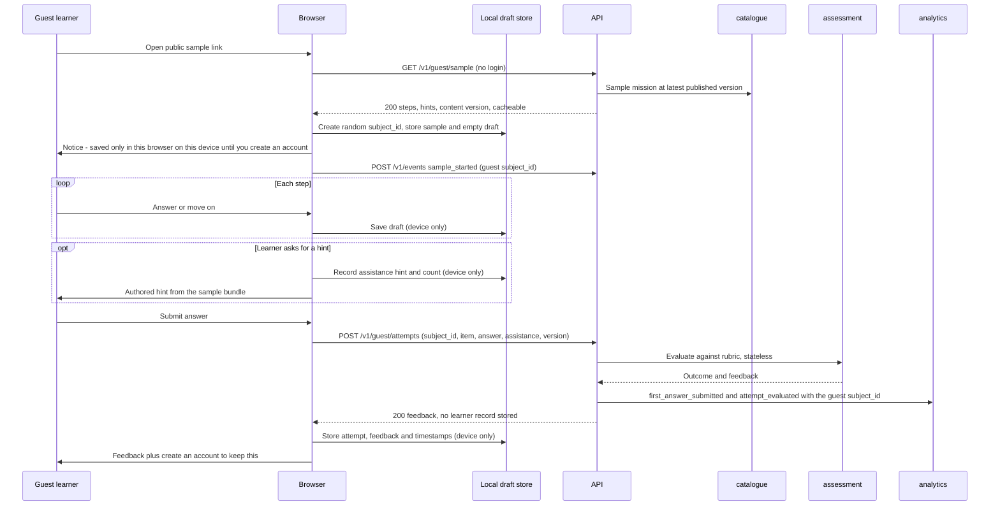
```mermaid
sequenceDiagram
    participant L as Guest learner
    participant B as Browser
    participant LS as Local draft store
    participant API
    participant CAT as catalogue
    participant ASM as assessment
    participant AN as analytics
    L->>B: Open public sample link
    B->>API: GET /v1/guest/sample (no login)
    API->>CAT: Sample mission at latest published version
    API-->>B: 200 steps, hints, content version, cacheable
    B->>LS: Create random subject_id, store sample and empty draft
    B->>L: Notice - saved only in this browser on this device until you create an account
    B->>API: POST /v1/events sample_started (guest subject_id)
    loop Each step
        L->>B: Answer or move on
        B->>LS: Save draft (device only)
    end
    opt Learner asks for a hint
        B->>LS: Record assistance hint and count (device only)
        B->>L: Authored hint from the sample bundle
    end
    L->>B: Submit answer
    B->>API: POST /v1/guest/attempts (subject_id, item, answer, assistance, version)
    API->>ASM: Evaluate against rubric, stateless
    ASM-->>API: Outcome and feedback
    API->>AN: first_answer_submitted and attempt_evaluated with the guest subject_id
    API-->>B: 200 feedback, no learner record stored
    B->>LS: Store attempt, feedback and timestamps (device only)
    B->>L: Feedback plus create an account to keep this
```

### 1b · Create account and claim guest progress

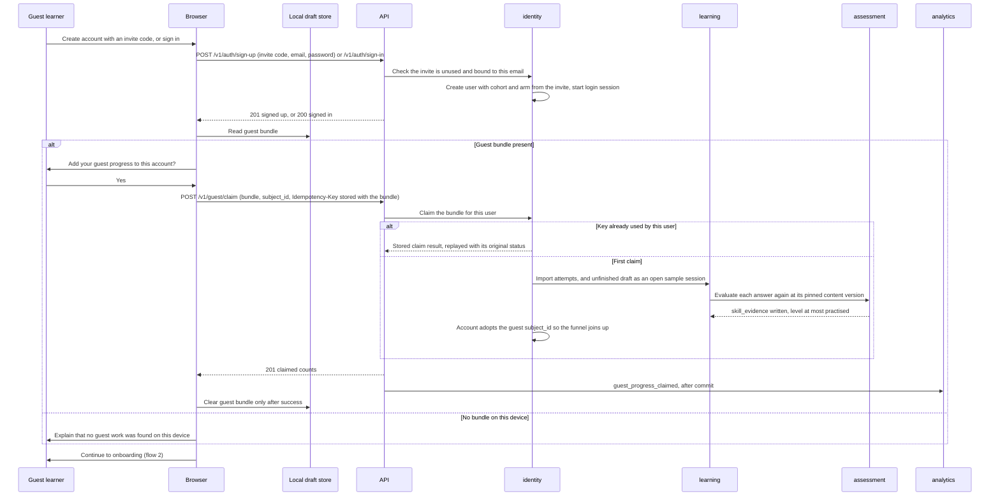
```mermaid
sequenceDiagram
    participant L as Guest learner
    participant B as Browser
    participant LS as Local draft store
    participant API
    participant ID as identity
    participant LRN as learning
    participant ASM as assessment
    participant AN as analytics
    L->>B: Create account with an invite code, or sign in
    B->>API: POST /v1/auth/sign-up (invite code, email, password) or /v1/auth/sign-in
    API->>ID: Check the invite is unused and bound to this email
    ID->>ID: Create user with cohort and arm from the invite, start login session
    API-->>B: 201 signed up, or 200 signed in
    B->>LS: Read guest bundle
    alt Guest bundle present
        B->>L: Add your guest progress to this account?
        L->>B: Yes
        B->>API: POST /v1/guest/claim (bundle, subject_id, Idempotency-Key stored with the bundle)
        API->>ID: Claim the bundle for this user
        alt Key already used by this user
            ID-->>API: Stored claim result, replayed with its original status
        else First claim
            ID->>LRN: Import attempts, and unfinished draft as an open sample session
            LRN->>ASM: Evaluate each answer again at its pinned content version
            ASM-->>LRN: skill_evidence written, level at most practised
            ID->>ID: Account adopts the guest subject_id so the funnel joins up
        end
        API-->>B: 201 claimed counts
        API->>AN: guest_progress_claimed, after commit
        B->>LS: Clear guest bundle only after success
    else No bundle on this device
        B->>L: Explain that no guest work was found on this device
    end
    B->>L: Continue to onboarding (flow 2)
```

| What goes wrong | Behaviour |
| --- | --- |
| Storage blocked or cleared, or sign-up on another device | The sample runs in memory. The notice says the work is lost when the tab closes and is not on other devices (PRD §5). The original device can still claim it later while signed in. |
| Tampered bundle (answers edited, hints hidden) | The server evaluates the answers again and caps claimed evidence at `practised`. Guest assistance is self-reported, which is acceptable at that cap. **Proposal** |
| Malformed or oversized bundle | `422`. The bundle stays on the device and the learner can retry or skip. |
| Sample version retired before claim | Accepted. Attempts reference the retired version (PRD §12). |
| Abuse of the unauthenticated endpoints | Rate limited per IP address and guest ID. Stateless, no free text stored (PRD §12). |
| Claim request fails on the network | The bundle is kept and the claim is retried on the next app open while signed in. |

**Idempotency and concurrency:** the guest ID is the claim key. `identity` keeps
claimed guest IDs under a unique constraint, so a replay returns the stored
result and no second account can claim the same bundle.
**Analytics:** `first_answer_submitted`, `attempt_evaluated` (guest pseudonym),
`account_created` (added), `guest_progress_claimed` (added). A pilot invite code
in the link is kept locally and sent at sign-up for cohort tagging (`10`).
**PRD:** §5 (first value before an account; say whether work is saved only on
the device), F03, F04, F09, F12.

---

## Flow 2 — Onboarding

**Trigger:** first sign-in with no enrolment.
**Preconditions:** signed in. Guest progress is either claimed or absent. The
browser reports an IANA time zone, which the learner confirms.

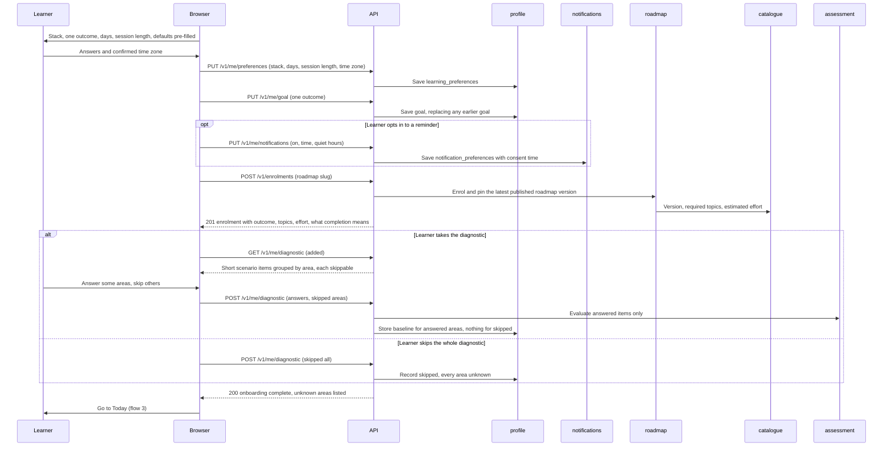
```mermaid
sequenceDiagram
    participant L as Learner
    participant B as Browser
    participant API
    participant PRF as profile
    participant NTF as notifications
    participant RM as roadmap
    participant CAT as catalogue
    participant ASM as assessment
    B->>L: Stack, one outcome, days, session length, defaults pre-filled
    L->>B: Answers and confirmed time zone
    B->>API: PUT /v1/me/preferences (stack, days, session length, time zone)
    API->>PRF: Save learning_preferences
    B->>API: PUT /v1/me/goal (one outcome)
    API->>PRF: Save goal, replacing any earlier goal
    opt Learner opts in to a reminder
        B->>API: PUT /v1/me/notifications (on, time, quiet hours)
        API->>NTF: Save notification_preferences with consent time
    end
    B->>API: POST /v1/enrolments (roadmap slug)
    API->>RM: Enrol and pin the latest published roadmap version
    RM->>CAT: Version, required topics, estimated effort
    API-->>B: 201 enrolment with outcome, topics, effort, what completion means
    alt Learner takes the diagnostic
        B->>API: GET /v1/me/diagnostic (added)
        API-->>B: Short scenario items grouped by area, each skippable
        L->>B: Answer some areas, skip others
        B->>API: POST /v1/me/diagnostic (answers, skipped areas)
        API->>ASM: Evaluate answered items only
        API->>PRF: Store baseline for answered areas, nothing for skipped
    else Learner skips the whole diagnostic
        B->>API: POST /v1/me/diagnostic (skipped all)
        API->>PRF: Record skipped, every area unknown
    end
    API-->>B: 200 onboarding complete, unknown areas listed
    B->>L: Go to Today (flow 3)
```

The defaults come from the PRD pilot schedule: three 10-minute sessions and one
optional 30–45-minute lab a week (PRD §5).

| What goes wrong | Behaviour |
| --- | --- |
| Learner leaves partway | Each step is saved, and onboarding resumes at the first missing step. Today shows "Finish setting up" until an enrolment exists. **Proposal** |
| Diagnostic area skipped | No baseline row and no `skill_evidence`, so the area shows as unknown (F01). |
| Strong diagnostic result | Challenge-out is offered for those topics (flow 8). Topics are never completed automatically (R03). **Proposal** |
| Goal does not fit the only launch roadmap | The goal is stored as written and enrolment explains the fit honestly. It counts as a demand signal for R07 (`10`). |
| Reminder time inside quiet hours, or no time zone | Rejected by validation with an explanation. Reminders stay off until a zone is stored. **Proposal** |
| Guest progress already claimed | Enrolment derives starting topic states from existing attempts, so the sample topic becomes `in_progress`. **Proposal** |

**Idempotency and concurrency:** the `PUT`s replace whole resources.
`POST /v1/enrolments` relies on "one active enrolment per user", so a retry
returns the existing enrolment. The diagnostic is accepted once per enrolment
so the baseline stays stable for PRD §13 comparisons. **Proposal**
**Analytics:** `onboarding_completed` (whether the diagnostic was taken, count
of skipped areas, reminder opt-in flag, session length), `enrolment_created`
(added; for enrolment-to-first-topic activation, PRD §8A).
**PRD:** F01, R01, F10 (consent), §5.

---

## Flow 3 — Today recommendation

**Trigger:** the learner opens Today, or the Browser refreshes it after a session.
**Preconditions:** an active enrolment. The selection rules belong to
`05-learning-engine.md`. Only the calls are shown here.

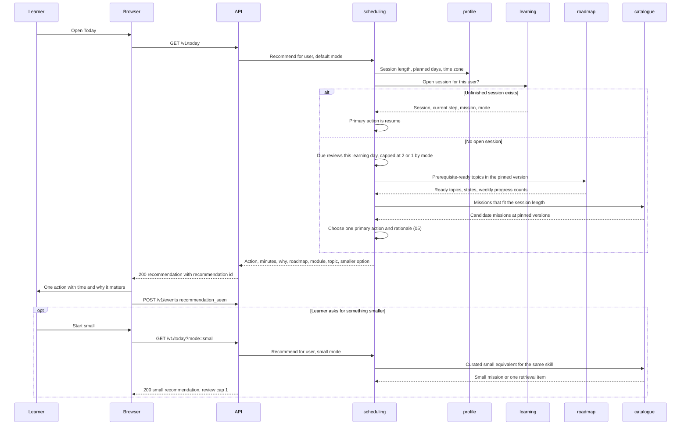
```mermaid
sequenceDiagram
    participant L as Learner
    participant B as Browser
    participant API
    participant SCH as scheduling
    participant PRF as profile
    participant LRN as learning
    participant RM as roadmap
    participant CAT as catalogue
    L->>B: Open Today
    B->>API: GET /v1/today
    API->>SCH: Recommend for user, default mode
    SCH->>PRF: Session length, planned days, time zone
    SCH->>LRN: Open session for this user?
    alt Unfinished session exists
        LRN-->>SCH: Session, current step, mission, mode
        SCH->>SCH: Primary action is resume
    else No open session
        SCH->>SCH: Due reviews this learning day, capped at 2 or 1 by mode
        SCH->>RM: Prerequisite-ready topics in the pinned version
        RM-->>SCH: Ready topics, states, weekly progress counts
        SCH->>CAT: Missions that fit the session length
        CAT-->>SCH: Candidate missions at pinned versions
        SCH->>SCH: Choose one primary action and rationale (05)
    end
    SCH-->>API: Action, minutes, why, roadmap, module, topic, smaller option
    API-->>B: 200 recommendation with recommendation id
    B->>L: One action with time and why it matters
    B->>API: POST /v1/events recommendation_seen
    opt Learner asks for something smaller
        L->>B: Start small
        B->>API: GET /v1/today?mode=small
        API->>SCH: Recommend for user, small mode
        SCH->>CAT: Curated small equivalent for the same skill
        CAT-->>SCH: Small mission or one retrieval item
        API-->>B: 200 small recommendation, review cap 1
    end
```

| What goes wrong | Behaviour |
| --- | --- |
| Smaller requested while a session is open | Today offers "Do the next step only (about 3 min) and stop" at a natural stopping point. The session is never cut off mid-explanation or thrown away (PRD §9). **Proposal** |
| More reviews due than the cap allows | Only the cap is shown. The rest stay due and are spread across later sessions. No overdue counter (F05, §6). |
| No prerequisite-ready topic | Today names the blocking topic and offers it or a challenge-out (PRD §12; open question 3). |
| Content exhausted, or roadmap complete | Completion summary, maintenance reviews, and an offer of another roadmap with no automatic enrolment (PRD §8A). |
| Learner picks a rest day | No session. The Browser offers to snooze today's reminder through `PUT /v1/me/notifications`. Nothing is owed (PRD §6). |
| Paused, returning, or newer roadmap version | See flows 9 and 12. The version notice never blocks. |
| Slow dependency | Today calls no email, AI or analytics service synchronously. Budget: p95 under 500 ms (PRD §12). |

**Idempotency and concurrency:** read-only. The recommendation is calculated on
request and not stored. `POST /v1/sessions` echoes the opaque
`recommendation_id` so the funnel can be joined. Two devices with the same state
see the same recommendation. **Proposal**
**Analytics:** `recommendation_seen` (kind: resume, review, new or small; mode;
context: normal, missed or returning).
**PRD:** F02, F05 (cap), R02 (prerequisite-ready), §9 selection order, §10, §12
performance budget.

---

## Flow 4 — Start or resume a session, autosave, offline, second device

**Trigger:** the learner starts or resumes the recommended action.
**Preconditions:** signed in. The local draft store is available (if not, the
UI warns that offline protection is off).

### 4a · Start or resume, autosave and offline

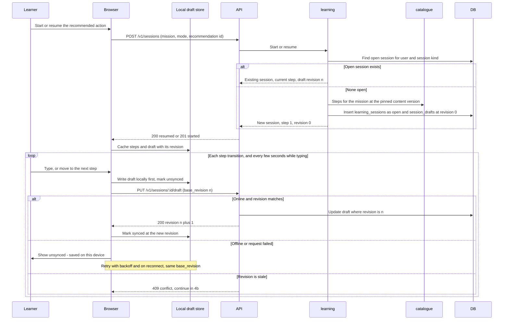
```mermaid
sequenceDiagram
    participant L as Learner
    participant B as Browser
    participant LS as Local draft store
    participant API
    participant LRN as learning
    participant CAT as catalogue
    participant DB
    L->>B: Start or resume the recommended action
    B->>API: POST /v1/sessions (mission, mode, recommendation id)
    API->>LRN: Start or resume
    LRN->>DB: Find open session for user and session kind
    alt Open session exists
        LRN-->>API: Existing session, current step, draft revision n
    else None open
        LRN->>CAT: Steps for the mission at the pinned content version
        LRN->>DB: Insert learning_sessions as open and session_drafts at revision 0
        LRN-->>API: New session, step 1, revision 0
    end
    API-->>B: 200 resumed or 201 started
    B->>LS: Cache steps and draft with its revision
    loop Each step transition, and every few seconds while typing
        L->>B: Type, or move to the next step
        B->>LS: Write draft locally first, mark unsynced
        B->>API: PUT /v1/sessions/:id/draft (base_revision n)
        alt Online and revision matches
            API->>DB: Update draft where revision is n
            API-->>B: 200 revision n plus 1
            B->>LS: Mark synced at the new revision
        else Offline or request failed
            B->>L: Show unsynced - saved on this device
            Note over B,LS: Retry with backoff and on reconnect, same base_revision
        else Revision is stale
            API-->>B: 409 conflict, continue in 4b
        end
    end
```

### 4b · Second device and a stale `base_revision`

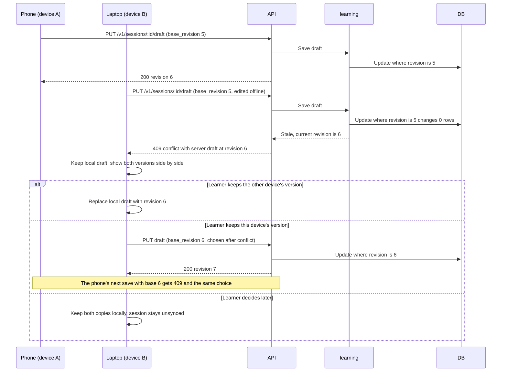
```mermaid
sequenceDiagram
    participant PA as Phone (device A)
    participant LA as Laptop (device B)
    participant API
    participant LRN as learning
    participant DB
    PA->>API: PUT /v1/sessions/:id/draft (base_revision 5)
    API->>LRN: Save draft
    LRN->>DB: Update where revision is 5
    API-->>PA: 200 revision 6
    LA->>API: PUT /v1/sessions/:id/draft (base_revision 5, edited offline)
    API->>LRN: Save draft
    LRN->>DB: Update where revision is 5 changes 0 rows
    LRN-->>API: Stale, current revision is 6
    API-->>LA: 409 conflict with server draft at revision 6
    LA->>LA: Keep local draft, show both versions side by side
    alt Learner keeps the other device's version
        LA->>LA: Replace local draft with revision 6
    else Learner keeps this device's version
        LA->>API: PUT draft (base_revision 6, chosen after conflict)
        API->>DB: Update where revision is 6
        API-->>LA: 200 revision 7
        Note over PA,API: The phone's next save with base 6 gets 409 and the same choice
    else Learner decides later
        LA->>LA: Keep both copies locally, session stays unsynced
    end
```

| What goes wrong | Behaviour |
| --- | --- |
| Start tapped twice | A unique constraint allows one open session per user and kind. The losing insert returns the existing session. |
| Browser closed mid-step | The local draft is restored on reopen and, if newer, synced with its `base_revision`. |
| Offline when starting a new session | Not possible, because the server creates sessions. An open session already cached can continue offline. **Proposal** |
| Retried `PUT` whose first try actually succeeded | It gets `409`, but the server draft matches the local content hash, so the client treats it as success. **Proposal** |
| Learner does not want the open session | Today's secondary option calls `POST /v1/sessions` with a set-aside flag. The old session becomes `abandoned` and its draft is kept (R05). **Proposal** |
| Different user signs in on the same browser | Local drafts are keyed by user ID and never shown to another user. Signing out warns about unsynced drafts, then clears them (PRD §12). |

**Idempotency and concurrency:** draft saves need no key because `base_revision`
makes them conditional. The Browser sends one save per session at a time and
merges pending edits into the next one. Conflicts are resolved for the whole
draft in the MVP (open question 5).
**Analytics:** `session_started` or `session_resumed` (server side). Conflict
counts and unsynced durations are operational metrics (`09`).
**PRD:** F03, F09 (cross-device), R05, §12 (local draft, unsynced status, no
silent overwrite).

---

## Flow 5 — Submit attempt, evaluate, write evidence, update review schedule

**Trigger:** the learner submits an answer in the player.
**Preconditions:** an open session owned by the learner. The draft is synced, or
the submission is queued (see table).

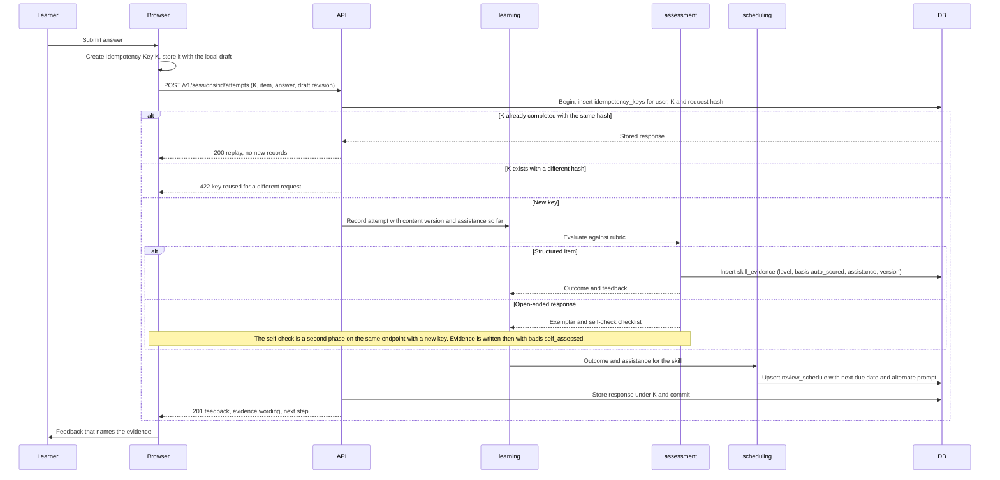
```mermaid
sequenceDiagram
    participant L as Learner
    participant B as Browser
    participant API
    participant LRN as learning
    participant ASM as assessment
    participant SCH as scheduling
    participant DB
    L->>B: Submit answer
    B->>B: Create Idempotency-Key K, store it with the local draft
    B->>API: POST /v1/sessions/:id/attempts (K, item, answer, draft revision)
    API->>DB: Begin, insert idempotency_keys for user, K and request hash
    alt K already completed with the same hash
        DB-->>API: Stored response
        API-->>B: 200 replay, no new records
    else K exists with a different hash
        API-->>B: 422 key reused for a different request
    else New key
        API->>LRN: Record attempt with content version and assistance so far
        LRN->>ASM: Evaluate against rubric
        alt Structured item
            ASM->>DB: Insert skill_evidence (level, basis auto_scored, assistance, version)
            ASM-->>LRN: Outcome and feedback
        else Open-ended response
            ASM-->>LRN: Exemplar and self-check checklist
            Note over B,ASM: The self-check is a second phase on the same endpoint with a new key. Evidence is written then with basis self_assessed.
        end
        LRN->>SCH: Outcome and assistance for the skill
        SCH->>DB: Upsert review_schedule with next due date and alternate prompt
        API->>DB: Store response under K and commit
        API-->>B: 201 feedback, evidence wording, next step
    end
    B->>L: Feedback that names the evidence
```

The level written and the next interval (about 1, 3, 7 or 21 days) are decided
in `05`. Feedback names evidence ("You used a query plan to choose an
investigation") and never says "mastered" (PRD §5).

| What goes wrong | Behaviour |
| --- | --- |
| Network drops after commit, before the response arrives | Retry with the same K replays the result. No duplicate attempt or evidence (PRD §12). |
| Double-click, or two tabs with the same K | The unique insert makes the second request wait, then replay. Otherwise it gets `409` and retries. **Proposal** |
| Two devices send the same item and draft revision with different keys | Treated as a duplicate on (session, item, draft revision). The existing result is returned. **Proposal** |
| Offline at submit | Queued in the local store with K and shown as "Saved — checked when you're back online". Sent on reconnect, with no feedback until then. **Proposal** |
| Evaluation error (rubric defect) | Rollback and `500`. K is not stored, so a retry works and the answer stays in the draft. The operator is alerted (`09`). |
| Repeated incorrect, or correct but heavily assisted | A worked example and a prerequisite refresher are offered, an earlier alternate review is scheduled, and the level stays below `demonstrated`. No punitive wording (PRD §6, §9). |

**Idempotency and concurrency:** the attempt, the evidence, the review schedule
and the key record are committed in one transaction. Evidence is append-only,
so a later attempt never edits earlier evidence.
**Analytics:** `first_answer_submitted` (first attempt in the session),
`attempt_evaluated` (outcome category, assistance, content version, mode),
`review_completed` (when the item came from the review queue). No answer text.
**PRD:** F04, F05, F09, §9, §11 (exact content version), §12 (duplicate submissions).

---

## Flow 6 — Hint use and solution reveal

**Trigger:** the learner asks for a hint, a worked example or the solution.
**Preconditions:** an open session on an item with authored hints. Not a
challenge-out session (flow 8).

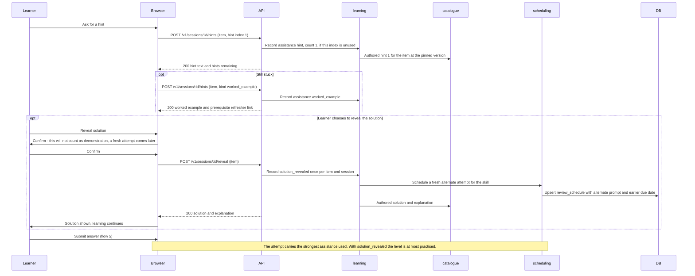
```mermaid
sequenceDiagram
    participant L as Learner
    participant B as Browser
    participant API
    participant LRN as learning
    participant CAT as catalogue
    participant SCH as scheduling
    participant DB
    L->>B: Ask for a hint
    B->>API: POST /v1/sessions/:id/hints (item, hint index 1)
    API->>LRN: Record assistance hint, count 1, if this index is unused
    LRN->>CAT: Authored hint 1 for the item at the pinned version
    API-->>B: 200 hint text and hints remaining
    opt Still stuck
        B->>API: POST /v1/sessions/:id/hints (item, kind worked_example)
        API->>LRN: Record assistance worked_example
        API-->>B: 200 worked example and prerequisite refresher link
    end
    opt Learner chooses to reveal the solution
        L->>B: Reveal solution
        B->>L: Confirm - this will not count as demonstration, a fresh attempt comes later
        L->>B: Confirm
        B->>API: POST /v1/sessions/:id/reveal (item)
        API->>LRN: Record solution_revealed once per item and session
        LRN->>SCH: Schedule a fresh alternate attempt for the skill
        SCH->>DB: Upsert review_schedule with alternate prompt and earlier due date
        LRN->>CAT: Authored solution and explanation
        API-->>B: 200 solution and explanation
        B->>L: Solution shown, learning continues
    end
    L->>B: Submit answer (flow 5)
    Note over B,SCH: The attempt carries the strongest assistance used. With solution_revealed the level is at most practised.
```

| What goes wrong | Behaviour |
| --- | --- |
| Hint retried with the same index | Not counted twice. The same hint is returned. |
| Client asks for a later index first, or hints run out | The server returns only the next unused hint. When none are left it offers the worked example, then the reveal. |
| Offline | Hints come from the server so that assistance is always recorded. Offline, the UI says "Hints need a connection" and the learner can keep writing. **Proposal** (open question 9) |
| Explanation viewed after an evaluated attempt | That is feedback, not a reveal. Evidence already written is unchanged. |
| Reveal followed by a correct answer | Stored with `solution_revealed`, capped at `practised`, and a fresh attempt is scheduled (PRD §9). |
| Repeated reveals over weeks | Tracked as a guardrail metric (PRD §13). No punitive UI. |

**Idempotency and concurrency:** the hint index and "once per item and session"
for reveals make retries and second devices safe. The attempt copies the
strongest assistance recorded on its step.
**Analytics:** `hint_used` (index, kind), `answer_revealed` (item, content version).
**PRD:** §9, F03, F04, F05, §6 ("I do not understand"). A future AI tutor (F13)
would record its hints as `hint` and fall back to authored hints.

---

## Flow 7 — Complete session, update topic exactly once, next task

**Trigger:** the learner finishes the last step or stops at an explicit stopping point.
**Preconditions:** an open session. The draft is synced, and any `409` has been
resolved first (flow 4b).

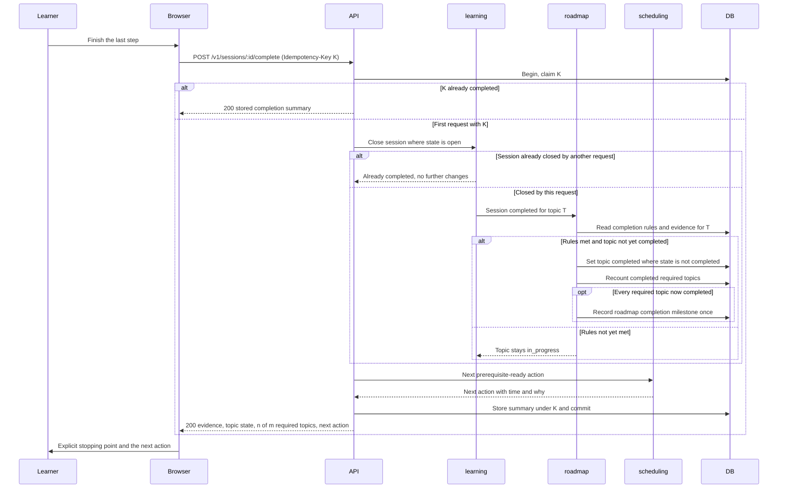
```mermaid
sequenceDiagram
    participant L as Learner
    participant B as Browser
    participant API
    participant LRN as learning
    participant RM as roadmap
    participant SCH as scheduling
    participant DB
    L->>B: Finish the last step
    B->>API: POST /v1/sessions/:id/complete (Idempotency-Key K)
    API->>DB: Begin, claim K
    alt K already completed
        API-->>B: 200 stored completion summary
    else First request with K
        API->>LRN: Close session where state is open
        alt Session already closed by another request
            LRN-->>API: Already completed, no further changes
        else Closed by this request
            LRN->>RM: Session completed for topic T
            RM->>DB: Read completion rules and evidence for T
            alt Rules met and topic not yet completed
                RM->>DB: Set topic completed where state is not completed
                RM->>DB: Recount completed required topics
                opt Every required topic now completed
                    RM->>DB: Record roadmap completion milestone once
                end
            else Rules not yet met
                RM-->>LRN: Topic stays in_progress
            end
        end
        API->>SCH: Next prerequisite-ready action
        SCH-->>API: Next action with time and why
        API->>DB: Store summary under K and commit
        API-->>B: 200 evidence, topic state, n of m required topics, next action
    end
    B->>L: Explicit stopping point and the next action
```

| What goes wrong | Behaviour |
| --- | --- |
| Retry after a timeout with the same K | Replays the stored summary (F09 idempotent completion). |
| Two devices complete the same session with different keys | The conditional close lets only one win. The other gets `200` with "already completed" and no second credit. |
| Two sessions satisfy the same topic at once (practice and challenge-out) | The conditional topic update records one `completed_at`. |
| Stopping before every item is answered | Allowed at any explicit stopping point, and the topic rules decide credit. A `small` session counts as practice, not proof (PRD §5). |
| Feedback not yet reviewed | The pilot rule needs an attempt, a feedback review and an alternate topic check (PRD §8A). Feedback review is recorded when the learner moves past the feedback step (`05`). |
| Roadmap completed, then a delayed review fails | The milestone is recorded once and never revoked. The summary separates optional labs and self-assessed evidence (R04, §8A). |

**Idempotency and concurrency:** there are three guards: the key (retries), the
conditional session close (devices), and the conditional topic update (sessions
racing for the same topic). The milestone is unique per enrolment.
**Analytics:** `session_completed` (mode, duration bucket, content version),
`topic_completed` (added; basis is rules met or challenge-out),
`roadmap_completed` (added).
**PRD:** R02, R04, F09, §8A (completion rules, progress = completed required ÷
all required, count shown beside the percentage).

---

## Flow 8 — Challenge-out versus manual defer

**Trigger:** the learner opens a topic in Roadmap, or Today suggests a challenge
after a strong diagnostic result.
**Preconditions:** the topic is in the pinned version and not completed. No
short session is open (the Browser offers to finish it or set it aside first).

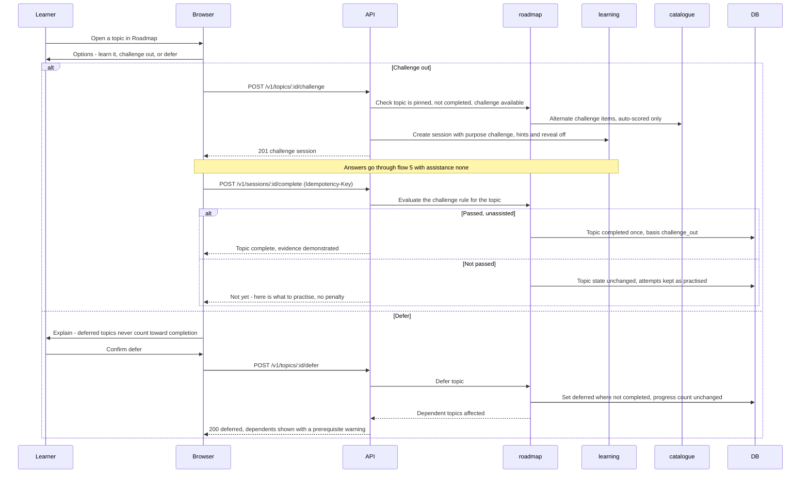
```mermaid
sequenceDiagram
    participant L as Learner
    participant B as Browser
    participant API
    participant RM as roadmap
    participant LRN as learning
    participant CAT as catalogue
    participant DB
    L->>B: Open a topic in Roadmap
    B->>L: Options - learn it, challenge out, or defer
    alt Challenge out
        B->>API: POST /v1/topics/:id/challenge
        API->>RM: Check topic is pinned, not completed, challenge available
        RM->>CAT: Alternate challenge items, auto-scored only
        API->>LRN: Create session with purpose challenge, hints and reveal off
        API-->>B: 201 challenge session
        Note over B,LRN: Answers go through flow 5 with assistance none
        B->>API: POST /v1/sessions/:id/complete (Idempotency-Key)
        API->>RM: Evaluate the challenge rule for the topic
        alt Passed, unassisted
            RM->>DB: Topic completed once, basis challenge_out
            API-->>B: Topic complete, evidence demonstrated
        else Not passed
            RM->>DB: Topic state unchanged, attempts kept as practised
            API-->>B: Not yet - here is what to practise, no penalty
        end
    else Defer
        B->>L: Explain - deferred topics never count toward completion
        L->>B: Confirm defer
        B->>API: POST /v1/topics/:id/defer
        API->>RM: Defer topic
        RM->>DB: Set deferred where not completed, progress count unchanged
        RM-->>API: Dependent topics affected
        API-->>B: 200 deferred, dependents shown with a prerequisite warning
    end
```

| What goes wrong | Behaviour |
| --- | --- |
| Defer on a completed topic | `409`. Completion is historical. **Proposal** |
| Returning to a deferred topic | Starting any mission in it moves it to `in_progress`. **Proposal** |
| Deferred topic is a prerequisite | Dependents are usable with a visible warning. Completion still needs the deferred topic. **Proposal** (open question 3) |
| Roadmap with deferred required topics | Not complete (R03, R04). The summary lists them and offers a challenge-out. |
| Challenge failed | Retry no sooner than the next learning day, with different items if any exist, otherwise the normal path. **Proposal** |
| Open-ended items | Excluded from challenge sets, because self-report alone leaves skill unverified (PRD §6). |

**Idempotency and concurrency:** both outcomes use updates conditional on "not
`completed`", so a defer cannot overwrite a challenge pass that raced it. A
repeated defer returns `200`.
**Analytics:** `session_started` (purpose challenge), `attempt_evaluated`,
`session_completed`, `topic_completed` (added, basis `challenge_out`),
`topic_deferred` (added).
**PRD:** R03, R04, §6 ("I already know this"), §8A.

---

## Flow 9 — Return after a missed session or a long absence

**Trigger:** the learner opens DevStep after a planned learning day passed with
no completed session ("missed"), or after 7 or more days with none ("long
absence"). Thresholds are a **Proposal** (open question 6).
**Preconditions:** an active or paused enrolment.

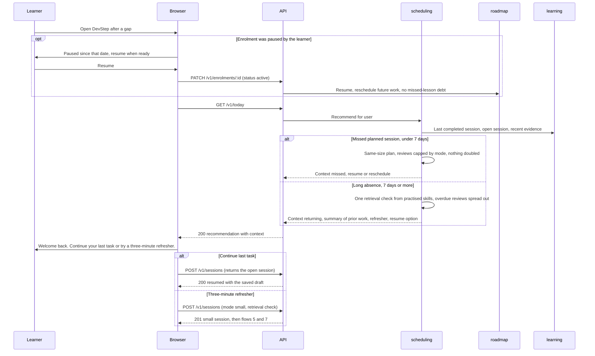
```mermaid
sequenceDiagram
    participant L as Learner
    participant B as Browser
    participant API
    participant SCH as scheduling
    participant RM as roadmap
    participant LRN as learning
    L->>B: Open DevStep after a gap
    opt Enrolment was paused by the learner
        B->>L: Paused since that date, resume when ready
        L->>B: Resume
        B->>API: PATCH /v1/enrolments/:id (status active)
        API->>RM: Resume, reschedule future work, no missed-lesson debt
    end
    B->>API: GET /v1/today
    API->>SCH: Recommend for user
    SCH->>LRN: Last completed session, open session, recent evidence
    alt Missed planned session, under 7 days
        SCH->>SCH: Same-size plan, reviews capped by mode, nothing doubled
        SCH-->>API: Context missed, resume or reschedule
    else Long absence, 7 days or more
        SCH->>SCH: One retrieval check from practised skills, overdue reviews spread out
        SCH-->>API: Context returning, summary of prior work, refresher, resume option
    end
    API-->>B: 200 recommendation with context
    B->>L: Welcome back. Continue your last task or try a three-minute refresher.
    alt Continue last task
        B->>API: POST /v1/sessions (returns the open session)
        API-->>B: 200 resumed with the saved draft
    else Three-minute refresher
        B->>API: POST /v1/sessions (mode small, retrieval check)
        API-->>B: 201 small session, then flows 5 and 7
    end
```

| What goes wrong | Behaviour |
| --- | --- |
| Large review backlog | 2 visible in `practise`, 1 in `small`. The rest stay due and are spread out. No red counter (PRD §6, §9). |
| Retrieval check fails | Nothing is lowered. A worked example and an earlier review follow (PRD §9). |
| Open session is weeks old, or its content was retired | Still resumable on the pinned version. The refresher comes first when the step depends on recall. "Refresh recommended" is shown if the objective changed (PRD §12). |
| Migration offer pending | Shown only after the learner's first action, so the return stays light. **Proposal** |
| Paused enrolment | No reminders and no "missed" counting while paused (R05). |
| Learner chooses reschedule | `PUT /v1/me/preferences` changes the planned days. Future work is recalculated and nothing is owed. |

**Idempotency and concurrency:** the return context is calculated, not stored,
and disappears once a session completes. Resuming is a conditional `PATCH` from
paused to active. The tone is never guilt, streak loss or comparison (PRD §6).
**Analytics:** `recommendation_seen` (context `missed` or `returning`),
`session_resumed` or `session_started` (mode `small`), `review_completed`,
`session_completed`. The return-after-absence metric is derived from these (`10`).
**PRD:** F06, R05, F05, §6, §10 (return screen).

---

## Flow 10 — Reminder dispatch, pause, snooze and unsubscribe

**Trigger:** a Scheduler tick (proposed every 15 minutes), a settings change, or
an unsubscribe link.
**Preconditions:** the learner opted in (F10).

### 10a · Tick, per-learner evaluation, send

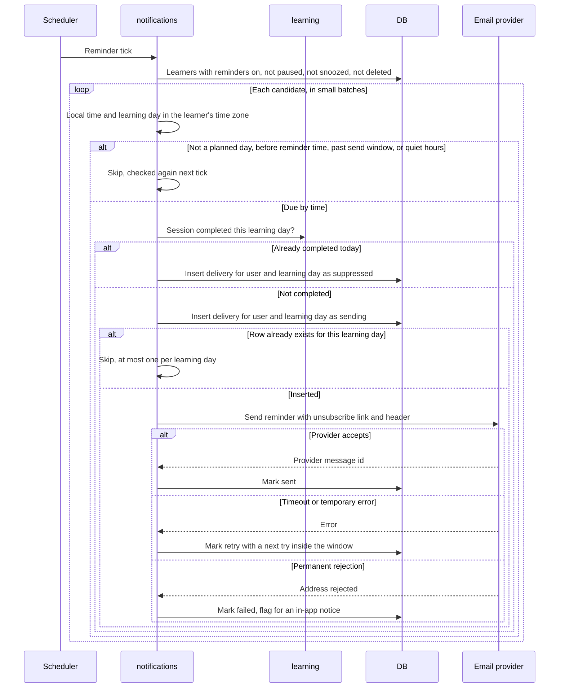
```mermaid
sequenceDiagram
    participant SJ as Scheduler
    participant NTF as notifications
    participant LRN as learning
    participant DB
    participant EP as Email provider
    SJ->>NTF: Reminder tick
    NTF->>DB: Learners with reminders on, not paused, not snoozed, not deleted
    loop Each candidate, in small batches
        NTF->>NTF: Local time and learning day in the learner's time zone
        alt Not a planned day, before reminder time, past send window, or quiet hours
            NTF->>NTF: Skip, checked again next tick
        else Due by time
            NTF->>LRN: Session completed this learning day?
            alt Already completed today
                NTF->>DB: Insert delivery for user and learning day as suppressed
            else Not completed
                NTF->>DB: Insert delivery for user and learning day as sending
                alt Row already exists for this learning day
                    NTF->>NTF: Skip, at most one per learning day
                else Inserted
                    NTF->>EP: Send reminder with unsubscribe link and header
                    alt Provider accepts
                        EP-->>NTF: Provider message id
                        NTF->>DB: Mark sent
                    else Timeout or temporary error
                        EP-->>NTF: Error
                        NTF->>DB: Mark retry with a next try inside the window
                    else Permanent rejection
                        EP-->>NTF: Address rejected
                        NTF->>DB: Mark failed, flag for an in-app notice
                    end
                end
            end
        end
    end
```

### 10b · Pause, snooze and unsubscribe

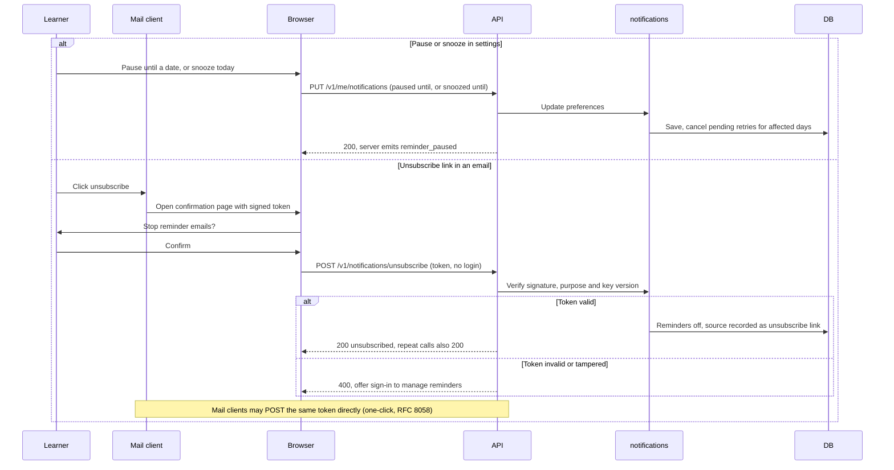
```mermaid
sequenceDiagram
    participant L as Learner
    participant MC as Mail client
    participant B as Browser
    participant API
    participant NTF as notifications
    participant DB
    alt Pause or snooze in settings
        L->>B: Pause until a date, or snooze today
        B->>API: PUT /v1/me/notifications (paused until, or snoozed until)
        API->>NTF: Update preferences
        NTF->>DB: Save, cancel pending retries for affected days
        API-->>B: 200, server emits reminder_paused
    else Unsubscribe link in an email
        L->>MC: Click unsubscribe
        MC->>B: Open confirmation page with signed token
        B->>L: Stop reminder emails?
        L->>B: Confirm
        B->>API: POST /v1/notifications/unsubscribe (token, no login)
        API->>NTF: Verify signature, purpose and key version
        alt Token valid
            NTF->>DB: Reminders off, source recorded as unsubscribe link
            API-->>B: 200 unsubscribed, repeat calls also 200
        else Token invalid or tampered
            API-->>B: 400, offer sign-in to manage reminders
        end
        Note over MC,API: Mail clients may POST the same token directly (one-click, RFC 8058)
    end
```

| What goes wrong | Behaviour |
| --- | --- |
| Clock change (DST) | If the reminder time does not exist that day, send at the next valid local time. In a repeated hour, the unique (user, learning day) row allows one send (PRD §12). |
| Learner changes time zone | The next tick uses the new zone and the unique row prevents a second send on the same date. Crossing many zones may skip a day, which is accepted. |
| Scheduler down for hours | No backlog burst. Reminders are sent only inside a send window (proposed: 2 h after the reminder time), otherwise recorded as skipped. **Proposal** |
| Crash after the provider call, before "sent" is recorded | The row stays `sending` and is not resent unless the provider honours an idempotency key (unverified, `01`). Missing one reminder is better than sending two. **Proposal** |
| Provider outage or hard bounce | Retries inside the window, then `failed`, with an alert on a high failure rate (`09`). A hard bounce pauses reminders and shows an in-app notice. Learning is unaffected (PRD §12). **Proposal** |
| Link scanners that prefetch the URL | `GET` only shows the confirmation page. Only `POST` changes state. **Proposal** |
| Token for a deleted account, or re-subscribing | A deleted account's token returns `200` with no effect and discloses nothing. Re-subscribing needs signed-in settings and a new consent time. |

**Idempotency and concurrency:** (user ID, learning day) is the email-dispatch
key that PRD §11 requires, enforced by a unique constraint on
`notification_deliveries`. Overlapping ticks or workers are safe (insert or
skip, row locks when claiming retries). Email copy never creates urgency or
mentions job loss (PRD §6).
**Analytics:** `reminder_paused`, plus `reminder_sent` (added),
`reminder_suppressed` (added, with reason), `reminder_disabled` (added, source
settings or link) for the "reminders disabled" guardrail (PRD §13).
**PRD:** F10, §6 (one per learning day, snooze, pause, quiet hours, time zones),
§12 (email failure must not block, DST).

---

## Flow 11 — Content publish and retire

**Trigger:** an Author opens a pull request in the Content repo.
**Preconditions:** format and validation rules are defined in
`06-content-system.md`. The Reviewer is not the Author.

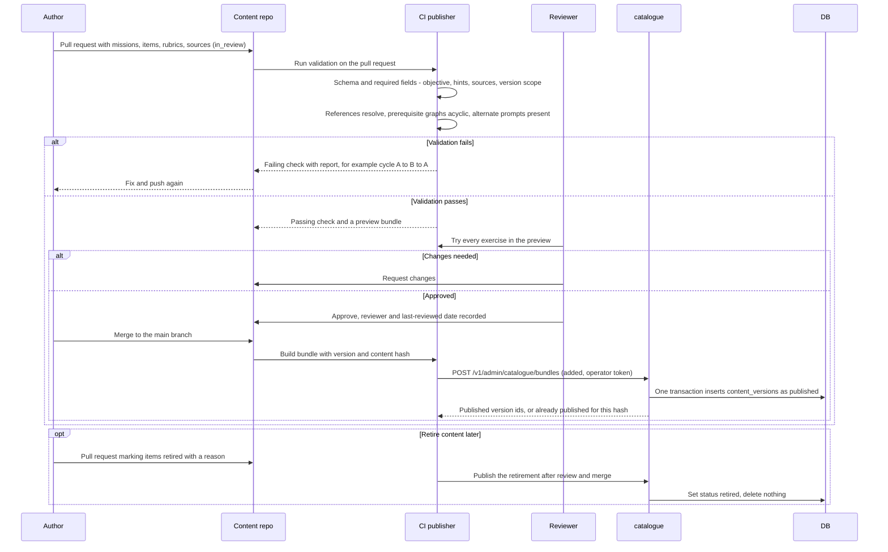
```mermaid
sequenceDiagram
    participant AU as Author
    participant CR as Content repo
    participant CI as CI publisher
    participant RV as Reviewer
    participant CAT as catalogue
    participant DB
    AU->>CR: Pull request with missions, items, rubrics, sources (in_review)
    CR->>CI: Run validation on the pull request
    CI->>CI: Schema and required fields - objective, hints, sources, version scope
    CI->>CI: References resolve, prerequisite graphs acyclic, alternate prompts present
    alt Validation fails
        CI-->>CR: Failing check with report, for example cycle A to B to A
        CR-->>AU: Fix and push again
    else Validation passes
        CI-->>CR: Passing check and a preview bundle
        RV->>CI: Try every exercise in the preview
        alt Changes needed
            RV->>CR: Request changes
        else Approved
            RV->>CR: Approve, reviewer and last-reviewed date recorded
            AU->>CR: Merge to the main branch
            CR->>CI: Build bundle with version and content hash
            CI->>CAT: POST /v1/admin/catalogue/bundles (added, operator token)
            CAT->>DB: One transaction inserts content_versions as published
            CAT-->>CI: Published version ids, or already published for this hash
        end
    end
    opt Retire content later
        AU->>CR: Pull request marking items retired with a reason
        CI->>CAT: Publish the retirement after review and merge
        CAT->>DB: Set status retired, delete nothing
    end
```

Status mapping (**Proposal**): `draft` is a branch and `in_review` is an open
pull request. `published` and `retired` exist only in `catalogue`, so it stays
read-only at runtime apart from this path.

| What goes wrong | Behaviour |
| --- | --- |
| Prerequisite cycle (`topic_dependencies` or `skill_prerequisites`) | CI rejects it and reports the cycle path (PRD §8A). |
| Missing sources, version scope, misconception notes, alternate prompts or accessibility basics | CI rejects it (PRD §8, F11). |
| Author approves their own pull request | Does not count. With a solo founder, a second reviewer is needed before the pilot (PRD §14). |
| Publish fails partway, or the same bundle is published twice | Rollback. Rerunning is safe because of the content hash. A repeat changes nothing. |
| Edit to published content | A new content version. Open sessions and attempts keep the old one (PRD §11). Changes to an objective, rubric or topic set need a new roadmap version (flow 12). Policy in `06`. |
| Retiring content in use, or a bad publish | Open sessions can finish, new sessions skip it, and evidence is kept, flagged "refresh recommended" if the objective changed (PRD §12). A bad publish is fixed by a newer version and is never deleted. |

**Idempotency and concurrency:** the content hash is the publish key, and
publishes run one at a time on the main branch.
**Analytics:** none. Publishes go to an operator audit log (`09`).
**PRD:** F11, §8 (reviewer tries every exercise), §8A (reject cycles), §12.

---

## Flow 12 — Roadmap version migration offer

**Trigger:** a newer roadmap version is published while learners are enrolled
in an older one.
**Preconditions:** an enrolment pinned to the older version (R01). The offer is
calculated on request, with no batch job. **Proposal**

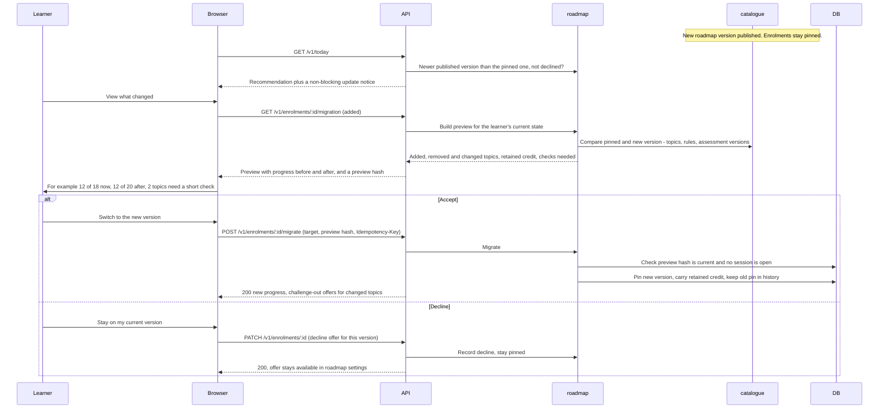
```mermaid
sequenceDiagram
    participant L as Learner
    participant B as Browser
    participant API
    participant RM as roadmap
    participant CAT as catalogue
    participant DB
    Note over CAT: New roadmap version published. Enrolments stay pinned.
    B->>API: GET /v1/today
    API->>RM: Newer published version than the pinned one, not declined?
    API-->>B: Recommendation plus a non-blocking update notice
    L->>B: View what changed
    B->>API: GET /v1/enrolments/:id/migration (added)
    API->>RM: Build preview for the learner's current state
    RM->>CAT: Compare pinned and new version - topics, rules, assessment versions
    RM-->>API: Added, removed and changed topics, retained credit, checks needed
    API-->>B: Preview with progress before and after, and a preview hash
    B->>L: For example 12 of 18 now, 12 of 20 after, 2 topics need a short check
    alt Accept
        L->>B: Switch to the new version
        B->>API: POST /v1/enrolments/:id/migrate (target, preview hash, Idempotency-Key)
        API->>RM: Migrate
        RM->>DB: Check preview hash is current and no session is open
        RM->>DB: Pin new version, carry retained credit, keep old pin in history
        API-->>B: 200 new progress, challenge-out offers for changed topics
    else Decline
        L->>B: Stay on my current version
        B->>API: PATCH /v1/enrolments/:id (decline offer for this version)
        API->>RM: Record decline, stay pinned
        API-->>B: 200, offer stays available in roadmap settings
    end
```

Rules that stop progress shrinking without notice (**Proposal**, from R06 and
§8A): never migrate automatically. Always show the count and percentage before
and after. Carry credit only where the objective and assessment version are
compatible, and list the rest as "needs a short check" with a challenge-out.
Never revoke an earned milestone, and never change `skill_evidence`.

| What goes wrong | Behaviour |
| --- | --- |
| Preview is stale at accept | `409` with a fresh preview. Nothing changed. |
| Session open during migration | Finish it or set it aside first, so content never changes mid-session. **Proposal** |
| New required topics, or a completed topic removed | The denominator change is shown before accepting (R06). A removed topic stays in history as "covered in the previous version". |
| Old version later retired | Enrolled learners can still finish it. Retired is not deleted. **Proposal** |
| Roadmap already completed on the old version | The milestone stays. The new version is offered as "what's new" maintenance practice. |
| Serious error found in the old version | An in-app notice on the affected topic. Migration stays the learner's choice. **Proposal** |

**Idempotency and concurrency:** the key plus the preview hash, both checked in
the migration transaction, prevent a double or out-of-date migration. Reviews
from the old version continue by default.
**Analytics:** `migration_offered` (added, client), `migration_accepted` (added),
`migration_declined` (added).
**PRD:** R06, R01, §8A (reuse evidence only when compatible; milestone never revoked).

---

## Flow 13 — Lab: starter kit, local checks, learner-submitted evidence

**Trigger:** the learner opens a lab from Today or Roadmap, usually on a desktop.
**Preconditions:** the lab is published with a versioned starter kit, a
checksum, a setup check, local checks and a rubric (F07).

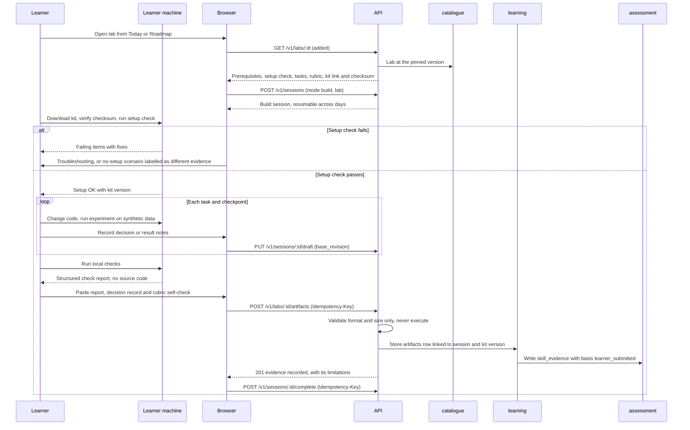
```mermaid
sequenceDiagram
    participant L as Learner
    participant M as Learner machine
    participant B as Browser
    participant API
    participant CAT as catalogue
    participant LRN as learning
    participant ASM as assessment
    L->>B: Open lab from Today or Roadmap
    B->>API: GET /v1/labs/:id (added)
    API->>CAT: Lab at the pinned version
    API-->>B: Prerequisites, setup check, tasks, rubric, kit link and checksum
    B->>API: POST /v1/sessions (mode build, lab)
    API-->>B: Build session, resumable across days
    L->>M: Download kit, verify checksum, run setup check
    alt Setup check fails
        M-->>L: Failing items with fixes
        B->>L: Troubleshooting, or no-setup scenario labelled as different evidence
    else Setup check passes
        M-->>L: Setup OK with kit version
        loop Each task and checkpoint
            L->>M: Change code, run experiment on synthetic data
            L->>B: Record decision or result notes
            B->>API: PUT /v1/sessions/:id/draft (base_revision)
        end
        L->>M: Run local checks
        M-->>L: Structured check report, no source code
        L->>B: Paste report, decision record and rubric self-check
        B->>API: POST /v1/labs/:id/artifacts (Idempotency-Key)
        API->>API: Validate format and size only, never execute
        API->>LRN: Store artifacts row linked to session and kit version
        LRN->>ASM: Write skill_evidence with basis learner_submitted
        API-->>B: 201 evidence recorded, with its limitations
        B->>API: POST /v1/sessions/:id/complete (Idempotency-Key)
    end
```

| What goes wrong | Behaviour |
| --- | --- |
| Setup check fails | Troubleshooting, plus a no-setup scenario clearly labelled as different evidence (PRD §16). |
| Checksum mismatch, or kit version differs from the lab version | Mismatch: download again. Different version: evidence is accepted with a "kit version differs" limitation. **Proposal** |
| Learner pastes employer code or secrets | The UI warns before submit. Size limit. No source upload in the MVP. Text is rendered safely (PRD §11, §12). |
| Report edited by hand | Accepted as learner-submitted evidence, labelled as such, and never shown as a verified credential (PRD §9). |
| Lab spans days, or is opened on a phone | The build session stays open without blocking short sessions (open question 2). On a phone, Today offers a short session instead. |
| File uploads or human review wanted later | Add object storage only then (PRD §11). Human review adds a new `human_reviewed` evidence row and never overwrites. **Proposal** |

**Idempotency and concurrency:** the artifact submit has a key, and lab drafts
use `base_revision` as in flow 4. Labs never affect core roadmap completion
(PRD §8A).
**Analytics:** `session_started` (mode `build`), `lab_evidence_submitted`,
`lab_setup_checked` (added; passed or failed only).
**PRD:** F07, §9 (learner-submitted evidence), §10 (Lab), §11 (no server
execution), §16 (setup fallback).

---

## Flow 14 — Account export and account deletion

**Trigger:** the learner asks for their data, or asks to delete the account.
**Preconditions:** signed in and recently re-authenticated (`09` defines how recent).

### 14a · Export

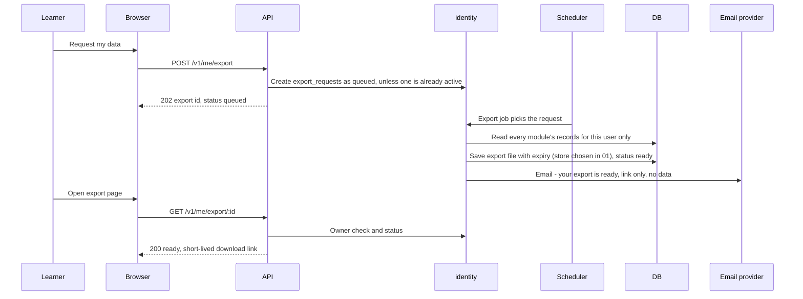
```mermaid
sequenceDiagram
    participant L as Learner
    participant B as Browser
    participant API
    participant ID as identity
    participant SJ as Scheduler
    participant DB
    participant EP as Email provider
    L->>B: Request my data
    B->>API: POST /v1/me/export
    API->>ID: Create export_requests as queued, unless one is already active
    API-->>B: 202 export id, status queued
    SJ->>ID: Export job picks the request
    ID->>DB: Read every module's records for this user only
    ID->>DB: Save export file with expiry (store chosen in 01), status ready
    ID->>EP: Email - your export is ready, link only, no data
    L->>B: Open export page
    B->>API: GET /v1/me/export/:id
    API->>ID: Owner check and status
    API-->>B: 200 ready, short-lived download link
```

### 14b · Deletion request and purge

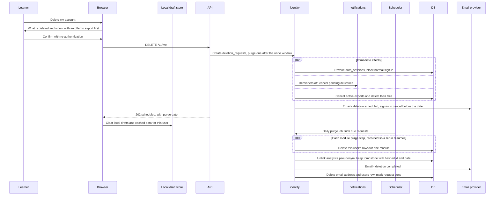
```mermaid
sequenceDiagram
    participant L as Learner
    participant B as Browser
    participant LS as Local draft store
    participant API
    participant ID as identity
    participant NTF as notifications
    participant SJ as Scheduler
    participant DB
    participant EP as Email provider
    L->>B: Delete my account
    B->>L: What is deleted and when, with an offer to export first
    L->>B: Confirm with re-authentication
    B->>API: DELETE /v1/me
    API->>ID: Create deletion_requests, purge due after the undo window
    par Immediate effects
        ID->>DB: Revoke auth_sessions, block normal sign-in
    and
        ID->>NTF: Reminders off, cancel pending deliveries
    and
        ID->>DB: Cancel active exports and delete their files
    end
    ID->>EP: Email - deletion scheduled, sign in to cancel before the date
    API-->>B: 202 scheduled, with purge date
    B->>LS: Clear local drafts and cached data for this user
    SJ->>ID: Daily purge job finds due requests
    loop Each module purge step, recorded so a rerun resumes
        ID->>DB: Delete this user's rows for one module
    end
    ID->>DB: Unlink analytics pseudonym, keep tombstone with hashed id and date
    ID->>EP: Email - deletion completed
    ID->>DB: Delete email address and users row, mark request done
```

| What goes wrong | Behaviour |
| --- | --- |
| Export requested while one is active | Returns the active request (`202`, same ID). |
| Export link used after expiry | `410`. Request a new one. The file is deleted at expiry (proposed: 7 days). **Proposal** |
| Export contents | The learner's own records, including their answer text and notes, as machine-readable JSON with a short readme. No other user's data and no internal secrets. If the "export ready" email fails, the export is still listed in settings. |
| Learner changes their mind in the undo window | Signing in shows only "Cancel deletion" (`POST /v1/me/deletion/cancel`, added). Reminders stay off until consent is given again. **Proposal** (open question 12) |
| Purge fails partway | Step progress is recorded, so a rerun is safe. An alert fires if a request is still open on day 25, ahead of the 30-day ceiling (PRD §12). |
| Backups and analytics | Deleted data stays only until the documented backup expiry. Tombstones are applied again after any restore. Events become unlinkable, and aggregates remain. **Proposal**, confirmed in `09`. |
| Another device still signed in | The next request returns `401` with an "account deleted" reason, and that Browser clears its local data. |

**Idempotency and concurrency:** a repeated `DELETE /v1/me` returns the existing
request. Purge steps are idempotent deletes scoped to the user, with the `users`
row last so foreign keys never dangle. One active export per user.
**Analytics:** `export_requested` (added, optional). Nothing is emitted for a
user after a deletion request, and earlier events are unlinked.
**PRD:** F09 (export, deletion), §12 (removal within 30 days, backup expiry,
owner-only access).

---

## Analytics events by flow

| Events | Source | Flows |
| --- | --- | --- |
| `onboarding_completed` | PRD §13 | 2 |
| `recommendation_seen` | PRD §13 | 3, 9 |
| `session_started`, `session_resumed`, `session_completed` | PRD §13 | 4, 7, 8, 9, 13 |
| `first_answer_submitted`, `attempt_evaluated`, `review_completed` | PRD §13 | 1, 5, 8, 9 |
| `hint_used`, `answer_revealed` | PRD §13 | 6 |
| `lab_evidence_submitted` | PRD §13 | 13 |
| `reminder_paused` | PRD §13 | 10 |
| `account_created`, `guest_progress_claimed`, `enrolment_created` | added | 1, 2 |
| `topic_completed`, `roadmap_completed`, `topic_deferred` | added | 7, 8 |
| `reminder_sent`, `reminder_suppressed`, `reminder_disabled` | added | 10 |
| `migration_offered`, `migration_accepted`, `migration_declined` | added | 12 |
| `lab_setup_checked`, `export_requested` | added | 13, 14 |

The final event catalogue and payloads are owned by `10-measurement-and-validation.md`.

## Endpoints used in this doc

Every canonical operation in `00-conventions.md` is used. Additions, for
`02-system-architecture.md` to accept or reject:

| Endpoint | Flow | Why |
| --- | --- | --- |
| `GET /v1/guest/sample` (no login) | 1 | Serve the sample before sign-up. |
| `POST /v1/guest/attempts` (no login, stateless, rate-limited) | 1 | Rubric feedback for guests without storing learner records. |
| `POST /v1/auth/signup` (and login) | 1 | Account creation. Shape owned by `02` and `09`. |
| `GET /v1/me/diagnostic` | 2 | Diagnostic items for the pinned version. |
| `GET /v1/enrolments/{id}/migration` | 12 | Migration preview with progress before and after. |
| `GET /v1/labs/{id}` | 13 | Lab definition, kit link and checksum. |
| `POST /v1/me/deletion/cancel` | 14 | Cancel during the undo window. |
| `POST /v1/admin/catalogue/bundles` (operator token) | 11 | CI publishes a validated bundle. |

Parameters rather than new endpoints: `GET /v1/today?mode=small`; a set-aside
flag on `POST /v1/sessions`; `kind=worked_example` on the hints endpoint; a
`self_check` phase on the attempts endpoint; a decline field on
`PATCH /v1/enrolments/{id}`.

## Open questions for discussion

1. **How is the guest sample evaluated?** *Recommended default:* on the server
   but stateless (`POST /v1/guest/attempts`). Answers are evaluated again at
   claim, and claimed evidence is capped at `practised`. Evaluating only in the
   client would expose the rubrics.
2. **How many open sessions can a learner have?** *Default:* one per kind:
   `short` (`small` and `practise`) and `build` (labs). `POST /v1/sessions`
   returns the open session of the requested kind, so a multi-day lab never
   blocks a 10-minute session.
3. **Does deferring a prerequisite block the topics that depend on it?**
   *Default:* no. Dependents are usable with a visible warning, and completion
   still requires the deferred topic.
4. **Can a learner submit while offline?** *Default:* yes. The submission is
   queued with its idempotency key and sent on reconnect, with no feedback
   until then.
5. **How fine-grained is draft conflict handling?** *Default:* the learner
   chooses for the whole draft in the MVP. Add per-step merging only if conflict
   metrics show it is needed.
6. **What counts as missed, and as long absence?** *Default:* missed is a
   planned learning day with no completed session. Long absence is 7 or more
   days with none, matching the PRD §13 metric. A learning day ends at local
   midnight.
7. **What is the reminder send window and delivery rule?** *Default:* send
   within 2 hours of the reminder time, at most once. A crash may lose a
   reminder but never duplicates one.
8. **How do reminders respond to reminder fatigue?** *Default (Hypothesis):*
   after 14 days without a completed session, the next reminder offers to pause
   or switch to weekly, and reminders never escalate.
9. **Are hints served only by the server?** *Default:* yes for signed-in
   learners, so assistance is always recorded. Only the guest sample bundles
   hints locally.
10. **Is the onboarding diagnostic the same as the §13 baseline transfer
    assessment?** *Default:* no. The diagnostic is under 5 minutes and only
    places the learner. The baseline is run separately in the pilot (`10`).
11. **How does content reach the catalogue?** *Default:* CI calls an
    operator-only `POST /v1/admin/catalogue/bundles` with a token held by CI.
    Publishing is idempotent by content hash. The alternative is an import
    command run at release (`01` and `06` decide).
12. **Should account deletion have an undo window?** *Default:* yes, 7 days,
    with the purge on day 8 and a hard ceiling of 30 days. This saves the
    operator from restoring backups after accidental deletions. Export files
    also expire after 7 days.

## PRD traceability

| PRD item | Covered by |
| --- | --- |
| F01 Goal and baseline | Flow 2 |
| F02 Today screen | Flows 3, 9 |
| F03 Learning player and drafts | Flows 4, 5, 6 |
| F04 Evidence-based progress | Flows 1, 5, 6, 13 |
| F05 Review scheduling | Flows 3, 5, 6, 9 |
| F06 Recovery flow | Flow 9 |
| F07 Continuing project | Flow 13 |
| F08 Skill evidence view | Evidence wording in flows 5, 7, 13. Screen in `08`. |
| F09 Account and continuity | Flows 1, 4, 5, 7, 14 |
| F10 Optional email reminder | Flows 2, 10 |
| F11 Content operations | Flow 11 |
| F12 Evaluation instrumentation | Every flow, plus "Analytics events by flow" |
| F13 AI tutor (P1) | Flow 6 note only |
| R01 Enrolment, R06 Version stability | Flows 2, 12 |
| R02 Topic progression | Flows 3, 7 |
| R03 Prerequisites and skips, R04 Completion milestone | Flows 7, 8 |
| R05 Pause and return | Flows 4, 9 |
| §5 Onboarding and guest first value | Flows 1, 2 |
| §6 Motivation and return behaviour | Flows 3, 6, 8, 9, 10 |
| §8, §8A Content gates, roadmaps and completion rules | Flows 7, 8, 11, 12 |
| §9 Adaptation and assessment | Flows 3, 5, 6, 8, 13 |
| §10, §11 Screens and technical boundaries | Flows 3, 5, 9, 13, cross-cutting rules |
| §12 Quality, privacy, operations | Flows 4, 5, 10, 11, 14 |
| Not covered | F14, F15 (P1), R07, R08 (later) |
