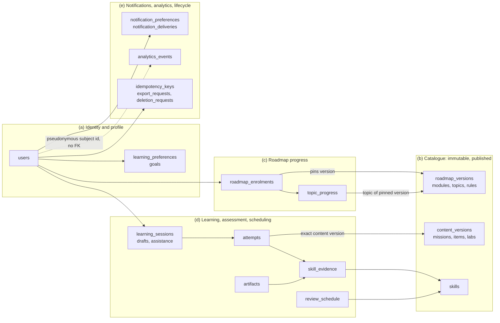
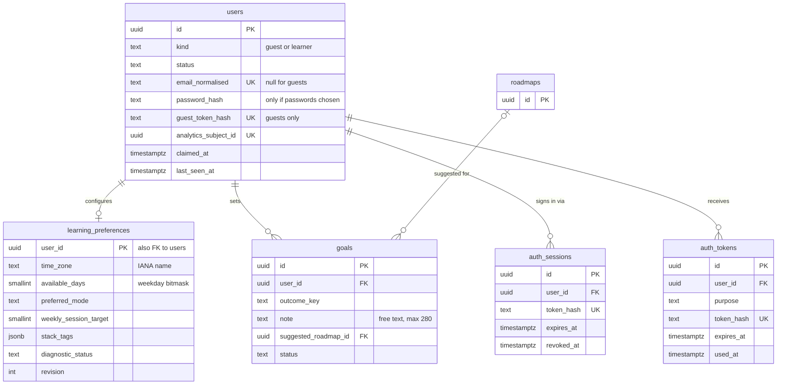
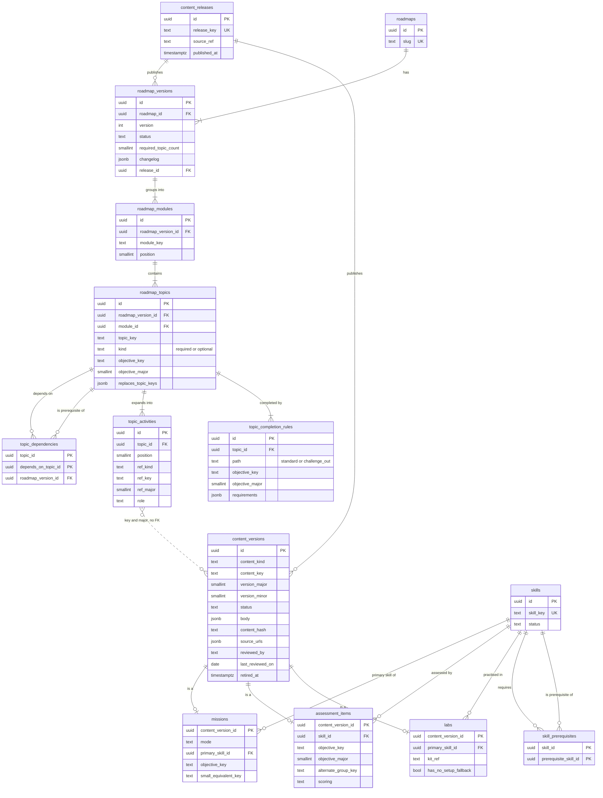
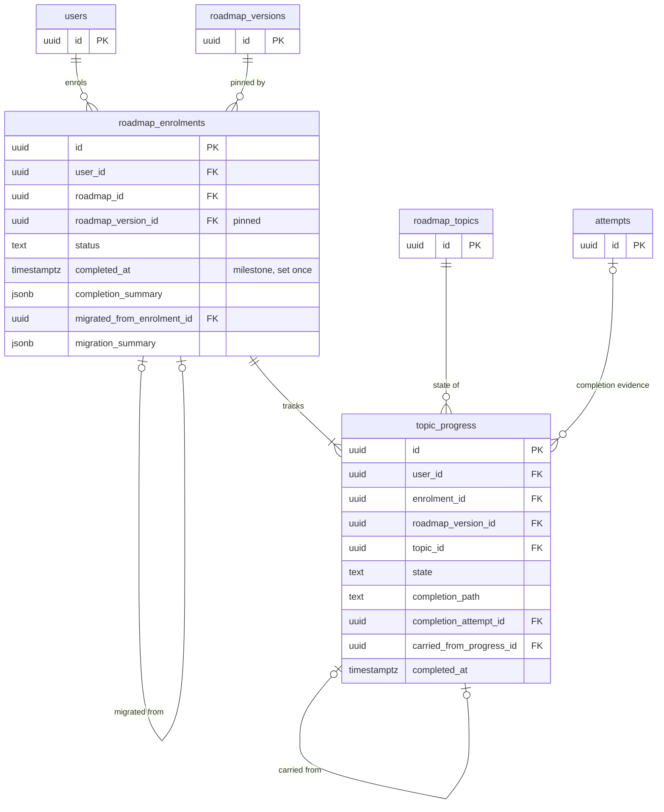
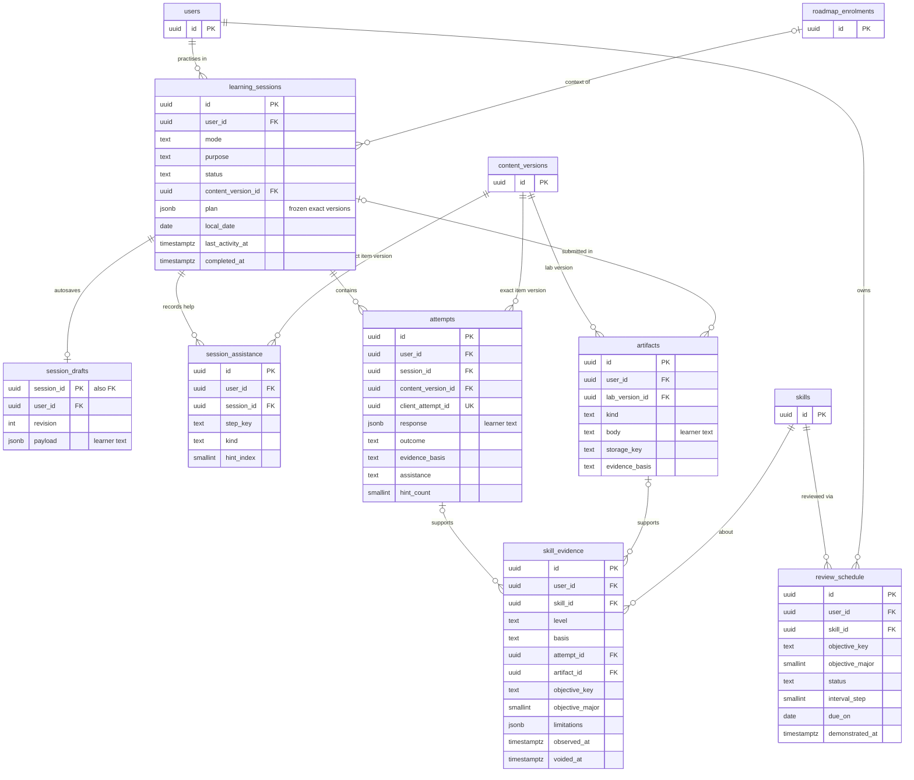
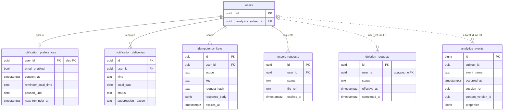
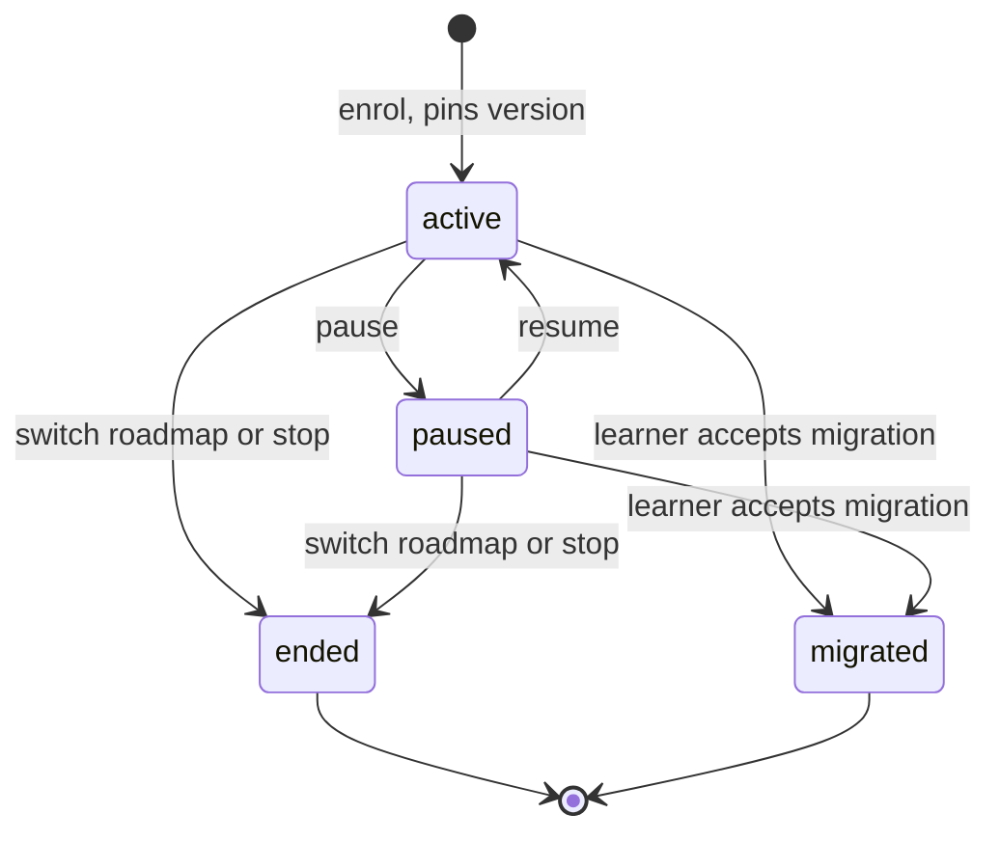
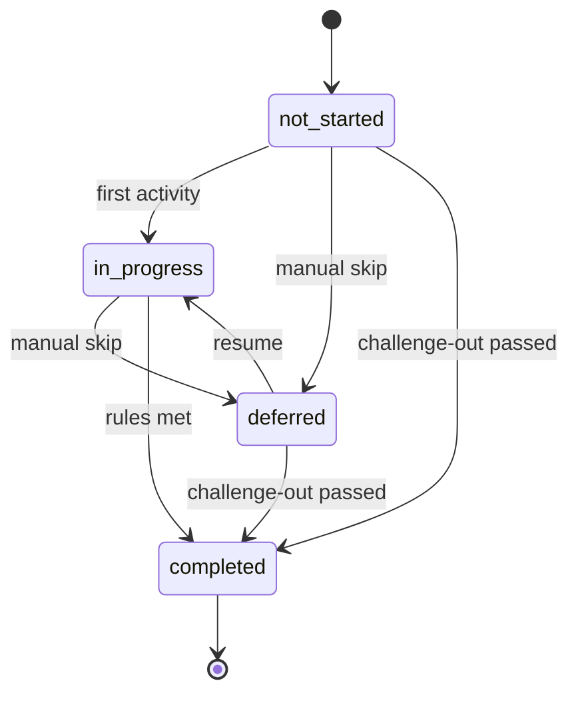

# 04 · Data model

Status: **Proposal — for discussion.** Planning only. No schema, migration or
code exists.

## Purpose

This doc defines DevStep's logical and physical data model: tables, owning
modules, the constraints that enforce PRD rules, retention, deletion, export
and sizing. The founder can use it to judge complexity and hosting cost before
choosing a stack in `01-tech-stack-and-hosting.md`. Examples use
Postgres-compatible SQL. §12 lists what would change on SQLite. Algorithms
belong to `05-learning-engine.md`, the content file format and publish workflow
to `06-content-system.md`, API shapes to `02-system-architecture.md`, and
sequence flows to `03-key-flows.md`.

## Summary

- **34 tables in five domains.** Every learner row carries `user_id`. Where a
  learner row has a learner parent, a composite foreign key `(parent_id, user_id)`
  makes a cross-learner reference impossible inside the database (PRD §11, §12).
- **Published content is insert-only.** Content and roadmap versions are
  immutable once published; only retirement fields change. Learner records
  reference the exact version with `ON DELETE RESTRICT`, so retiring content
  never erases evidence (PRD §11, §12, R01).
- **Two version axes** drive version pinning, migration with retained credit
  (R06) and evidence reuse across roadmaps (§8A). The first is the content
  version (`major.minor`); the second is the objective version
  (`objective_key` at `objective_major`).
- **Constraints carry correctness, not application code alone.** Partial unique
  indexes allow one open session, one current enrolment and one reminder per
  local day. Conditional updates make completion exactly-once. Drafts use
  revision compare-and-set. `idempotency_keys` replays responses but is never
  the only guard.
- **Enumerations are `text` columns with CHECK constraints.** `skill_evidence`
  is append-only and aggregated at read time. PRD rules such as "a revealed
  solution never demonstrates" are written as CHECK constraints.
- **Guests are server-side `users` rows** (`kind = 'guest'`) tied to a device
  cookie. Signing up converts the row in place. Signing in to an existing
  account merges the guest's rows into it.
- **Deletion is a hard delete by cascade.** Analytics rows are kept but given
  new random IDs, so they cannot be linked back to the person even from a
  backup. Export is a versioned JSON zip.
- **Size:** about 3 MB raw per active learner-year (plan for 5 MB). That gives
  roughly 0.3 GB, 2.6 GB or 25 GB for 50, 500 or 5,000 fully active learners.
  Analytics events and free-text attempts dominate.

## 1. Modelling conventions used in this doc

| Topic | Rule (**Proposal** unless cited) |
| --- | --- |
| Primary keys | `id uuid`, generated by the application, time-ordered so inserts stay index-friendly. Exceptions: `analytics_events.id bigint` (high volume, never exposed), and composite keys on pure edge tables. |
| Timestamps | `timestamptz` in UTC, named `*_at` (conventions). Learner-local calendar days are `date` columns named `local_date`, `due_on` or `*_on`. They are computed at write time from the learner's IANA zone. |
| Enumerations | `text` plus `CHECK (col IN (...))`. See §6.1. |
| JSON | `jsonb` only for authored content bodies, learner responses, frozen snapshots, allow-listed analytics properties and short author-supplied lists. Never filter or join on JSON. |
| Audit columns | Every mutable table also has `created_at` and `updated_at`. The column tables below omit them. |
| Owner scoping | Learner tables have `user_id uuid NOT NULL`, an index whose first column is `user_id`, and composite FKs to learner parents. Parents expose `UNIQUE (id, user_id)`. Composite owner FKs are `DEFERRABLE` so a guest merge can re-key in one transaction (§7). |
| FK actions | Learner row → `users`: `ON DELETE CASCADE`. Learner row → learner parent: `CASCADE`. Learner row → catalogue: `RESTRICT`, because the catalogue is never deleted. Every FK column is indexed so cascades stay cheap. |
| Portable subset | No database-specific enum types, arrays, extensions, advisory locks or `SELECT … FOR UPDATE`. Every concurrency pattern uses unique constraints and conditional updates, which also work on SQLite (§12). |
| PII classes | **ID**: direct identifier (email, credential hashes). **LC**: learner content, meaning free text or files the learner wrote, which may contain personal or employer details. **LA**: learner activity tied to an account by `user_id`. **PS**: pseudonymous, keyed by `subject_id` only. **—**: not personal data. |

## 2. Domain overview and ERDs

### 2.1 How the domains connect



### 2.2 (a) Identity and profile



### 2.3 (b) Catalogue and content



### 2.4 (c) Roadmap progress



### 2.5 (d) Learning, assessment and scheduling



### 2.6 (e) Notifications, analytics, idempotency and lifecycle



## 3. Table definitions

### 3.0 Table register

| Table | Module | Purpose | Owner scope | PII |
| --- | --- | --- | --- | --- |
| `users` | `identity` | Account or guest identity, and the pseudonymous analytics ID | `id` (self) | ID |
| `auth_sessions` | `identity` | Server-side login sessions, if `02` chooses them | `user_id` | ID |
| `auth_tokens` (added) | `identity` | Hashes of one-time tokens: email verification, reset, login link | `user_id` | ID |
| `learning_preferences` | `profile` | Time zone, days, mode, targets, stack tags, diagnostic status (F01) | `user_id` (PK) | LA |
| `goals` | `profile` | One active desired outcome, with replaced goals kept as history (F01) | `user_id` | LA, LC |
| `content_releases` (added) | `catalogue` | One row per publish run, linked to the content repository revision | — | — |
| `roadmaps` | `catalogue` | Stable roadmap identity (slug) | — | — |
| `roadmap_versions` | `catalogue` | Immutable roadmap structure that enrolments pin (R01) | — | — |
| `roadmap_modules` | `catalogue` | Ordered modules within a version | — | — |
| `roadmap_topics` | `catalogue` | Topics with kind, objective and a stable `topic_key` | — | — |
| `topic_dependencies` | `catalogue` | Prerequisite edges between topics of one version | — | — |
| `topic_activities` (added) | `catalogue` | Ordered missions, labs and check groups that a topic expands into (§8A) | — | — |
| `topic_completion_rules` | `catalogue` | Standard and challenge-out completion conditions (R03) | — | — |
| `content_versions` | `catalogue` | Immutable envelope for every mission, item and lab version, with F11 metadata | — | — |
| `missions` | `catalogue` | Typed mission metadata | — | — |
| `assessment_items` | `catalogue` | Typed item metadata, including the alternate group | — | — |
| `labs` | `catalogue` | Typed lab metadata (F07) | — | — |
| `skills` | `catalogue` | Stable skill registry | — | — |
| `skill_prerequisites` | `catalogue` | Prerequisite edges between skills | — | — |
| `roadmap_enrolments` | `roadmap` | Pinned enrolment, milestone and migration record | `user_id` | LA |
| `topic_progress` | `roadmap` | Workflow state per topic per enrolment (R02) | `user_id` | LA |
| `learning_sessions` | `learning` | A practice session with a frozen plan of exact versions | `user_id` | LA |
| `session_drafts` | `learning` | Autosaved in-progress answers with a revision counter (F03) | `user_id` | LC |
| `session_assistance` (added) | `learning` | Hints, worked examples and reveals, recorded by the server (F04) | `user_id` | LA |
| `attempts` | `learning` writes, `assessment` evaluates | A submitted answer to an exact item version (F04) | `user_id` | LC, LA |
| `skill_evidence` | `assessment` | Append-only evidence events per skill (F08) | `user_id` | LA |
| `review_schedule` | `scheduling` | One review track per learner per objective version (F05) | `user_id` | LA |
| `artifacts` | `learning` | Learner lab evidence (F07) | `user_id` | LC |
| `notification_preferences` | `notifications` | Consent, reminder time, quiet hours, pause, next send instant (F10) | `user_id` (PK) | LA |
| `notification_deliveries` | `notifications` | One row per learner per local day on which a reminder was considered | `user_id` | LA |
| `analytics_events` | `analytics` | Pseudonymous funnel and outcome events (F12) | `subject_id` (no FK) | PS |
| `idempotency_keys` | cross-cutting; each scope is written by its module | Replay store for unsafe requests (F09) | `user_id` | LA |
| `export_requests` | `identity` | Asynchronous export jobs and file references (F09) | `user_id` | ID |
| `deletion_requests` | `identity` | Deletion workflow, plus a tombstone used to replay deletions after a backup restore | `user_ref` (no FK) | LA (opaque ID only) |

Retention and deletion behaviour for every table are in §8.1.

### 3.1 Identity and profile

**`users`**

| Column | Type | Null | Notes |
| --- | --- | --- | --- |
| `id` | uuid | no | PK |
| `kind` | text | no | CHECK `guest`, `learner` |
| `status` | text | no | CHECK `active`, `pending_deletion` |
| `email` | text | yes | As entered; NULL only for guests |
| `email_normalised` | text | yes | Lower-cased and trimmed; unique |
| `email_verified_at` | timestamptz | yes | |
| `password_hash` | text | yes | Only if `02`/`09` choose passwords; never exported |
| `guest_token_hash` | text | yes | Hash of the guest cookie secret; cleared on claim |
| `analytics_subject_id` | uuid | no | Random; the only link to `analytics_events` |
| `claimed_at` | timestamptz | yes | When a guest became a learner |
| `last_seen_at` | timestamptz | no | Written at most hourly |

Constraints: `CHECK ((kind = 'guest') = (email IS NULL))`;
`CHECK (kind <> 'guest' OR guest_token_hash IS NOT NULL)`. Indexes:
`uq_users_email (email_normalised) WHERE email_normalised IS NOT NULL`,
`uq_users_guest_token`, `uq_users_subject`,
`ix_users_guest_seen (last_seen_at) WHERE kind = 'guest'` (guest purge).

**`auth_sessions`** (only if server-side sessions are chosen) and **`auth_tokens` (added)**

| Table | Key columns |
| --- | --- |
| `auth_sessions` | `id` PK; `user_id` FK cascade; `token_hash text` UK; `last_seen_at`, `expires_at`, `revoked_at timestamptz`; `client_label text` (coarse browser family only; no IP address stored) |
| `auth_tokens` | `id` PK; `user_id` FK cascade; `purpose text` CHECK `email_verification`, `password_reset`, `login_link`, `email_change`; `token_hash text` UK; `expires_at`; `used_at` NULL. Only hashes are stored. |

Indexes: `(user_id)` and `(expires_at)` on both tables, for revocation and purge.

**`learning_preferences`** (1:1 with `users`)

| Column | Type | Null | Notes |
| --- | --- | --- | --- |
| `user_id` | uuid | no | PK; FK `users` cascade |
| `time_zone` | text | no | IANA name, validated by the app (conventions: schedules use the learner's zone) |
| `available_days` | smallint | no | Weekday bitmask, bit 0 = Monday; CHECK `0..127`. These are the "scheduled learning days" used by reminders |
| `preferred_mode` | text | no | CHECK session mode; default `practise` |
| `weekly_session_target` | smallint | no | Default 3 (PRD §5 pilot schedule) |
| `weekly_lab_target` | smallint | no | Default 1 |
| `stack_tags` | jsonb | no | Array of codes from a fixed list; no free text |
| `diagnostic_status` | text | no | CHECK `not_offered`, `skipped`, `partial`, `completed`. Skipped skills simply have no evidence rows, so they stay "unknown" (F01) |
| `revision` | int | no | Optimistic concurrency for settings edits |

**`goals`**

| Column | Type | Null | Notes |
| --- | --- | --- | --- |
| `id`, `user_id` | uuid | no | PK; FK `users` cascade |
| `outcome_key` | text | no | One authored outcome option |
| `note` | text | yes | Optional learner wording; CHECK length ≤ 280 (LC) |
| `suggested_roadmap_id` | uuid | yes | FK `roadmaps` |
| `status` | text | no | CHECK `active`, `replaced` |
| `replaced_at` | timestamptz | yes | CHECK `(status = 'replaced') = (replaced_at IS NOT NULL)` |

Index: `uq_goals_one_active (user_id) WHERE status = 'active'`, which enforces
one goal (F01).

### 3.2 Catalogue

The publish step of the content pipeline (`06-content-system.md`) is the only
writer of these tables. The runtime only reads them. §4 covers immutability.

**`content_releases` (added)**: `id` PK; `release_key text` UK;
`source_ref text NOT NULL` (the content repository revision); `manifest_hash text`;
`published_by text` (operator handle); `published_at`. Rows are kept forever.

**`roadmaps`**: `id` PK; `slug text` UK (immutable); `first_release_id` FK;
`retired_at` NULL.

**`roadmap_versions`**

| Column | Type | Null | Notes |
| --- | --- | --- | --- |
| `id`, `roadmap_id` | uuid | no | PK; FK `roadmaps`; UK `(roadmap_id, version)`; UK `(id, roadmap_id)` |
| `version` | int | no | 1, 2, … |
| `status` | text | no | CHECK `published`, `retired` (runtime subset of the content status enum; see §6.1) |
| `release_id`, `previous_version_id` | uuid | no / yes | FK `content_releases`; FK self |
| `title`, `outcome` | text | no | Outcome is shown before enrolment (R01) |
| `estimated_effort_hours` | numeric | no | Shown before enrolment (R01) |
| `required_topic_count` | smallint | no | CHECK > 0. Set at publish and immutable; the progress denominator (§8A) |
| `changelog` | jsonb | yes | Author's per-`topic_key` change notes, used on the migration screen (R06) |
| `published_at`, `retired_at` | timestamptz | no / yes | |

**`roadmap_modules`**: `id` PK; `roadmap_version_id` FK; `module_key text`;
`position smallint`; `title`, `summary text`. UK `(roadmap_version_id, module_key)`,
UK `(roadmap_version_id, position)`, UK `(id, roadmap_version_id)`.

**`roadmap_topics`**

| Column | Type | Null | Notes |
| --- | --- | --- | --- |
| `id`, `roadmap_version_id`, `module_id` | uuid | no | PK; FK; composite FK `(module_id, roadmap_version_id)` → `roadmap_modules` |
| `topic_key` | text | no | Stable across versions; UK `(roadmap_version_id, topic_key)` |
| `position` | smallint | no | Order within the module |
| `kind` | text | no | CHECK topic kind `required`, `optional` |
| `title`, `objective_text` | text | no | |
| `objective_key`, `objective_major` | text, smallint | no | Objective identity and compatibility version (§4.2) |
| `estimated_minutes` | smallint | no | |
| `replaces_topic_keys` | jsonb | no | Default `[]`; records explicit renames or merges for migration mapping |

UK `(id, roadmap_version_id)` is the target of the composite FKs from
`topic_dependencies`, `topic_activities`, `topic_completion_rules` and `topic_progress`.

**`topic_dependencies`**: `roadmap_version_id`, `topic_id`, `depends_on_topic_id`.
PK `(topic_id, depends_on_topic_id)`. Composite FKs
`(topic_id, roadmap_version_id)` and `(depends_on_topic_id, roadmap_version_id)`
point to `roadmap_topics`, so both ends belong to the same version.
`CHECK (topic_id <> depends_on_topic_id)`. The pipeline rejects cycles before
publish (PRD §8A); a CHECK constraint cannot express acyclicity. Index
`(depends_on_topic_id)`.

**`topic_activities` (added)**

| Column | Type | Null | Notes |
| --- | --- | --- | --- |
| `id`, `roadmap_version_id`, `topic_id` | uuid | no | Composite FK to `roadmap_topics`; UK `(topic_id, position)` |
| `position` | smallint | no | Order of the activity within the topic |
| `ref_kind` | text | no | CHECK `mission`, `lab`, `item_group` |
| `ref_key`, `ref_major` | text, smallint | no | Points to a content key (or alternate group) at a major version. Resolved at run time to the latest published minor (§4.2). Publish validates that the target exists; there is no FK |
| `role` | text | no | CHECK `core`, `enrichment`, `topic_check`, `challenge` |
| `is_required` | bool | no | Optional labs are `false` (PRD §8A pilot rule) |

**`topic_completion_rules`**: `id`; `roadmap_version_id`; `topic_id` (composite
FK); `path text` CHECK `standard`, `challenge_out`; `objective_key text`;
`objective_major smallint`; `requirements jsonb` (structured, validated against
a schema at publish, evaluated by `05`). For example: all required activities
attempted with feedback viewed, plus a `topic_check` group at a minimum outcome
and assistance ceiling. UK `(topic_id, path)`.

**`content_versions`**

| Column | Type | Null | Notes |
| --- | --- | --- | --- |
| `id` | uuid | no | PK |
| `content_kind` | text | no | CHECK `mission`, `assessment_item`, `lab` |
| `content_key` | text | no | Stable author key |
| `version_major`, `version_minor` | smallint | no | UK `(content_kind, content_key, version_major, version_minor)` |
| `status` | text | no | CHECK `published`, `retired` |
| `body` | jsonb | no | Authored payload, including answer keys and rubrics. Only the server reads it before an attempt is submitted (`09`) |
| `content_hash` | text | no | Republishing the same version with a different hash is rejected |
| `source_urls` | jsonb | no | F11 source references |
| `stack_scope` | jsonb | yes | Stack and version scope (PRD §8) |
| `reviewed_by` | text | no | Reviewer handle (F11). A plain string rather than an FK, so it survives account changes |
| `last_reviewed_on` | date | no | F11 |
| `release_id` | uuid | no | FK `content_releases` |
| `published_at` | timestamptz | no | |
| `retired_at`, `retire_reason` | timestamptz, text | yes | CHECK `(status = 'retired') = (retired_at IS NOT NULL)` |

Index: `ix_content_latest (content_kind, content_key, version_major, version_minor DESC) WHERE status = 'published'`
finds the latest minor version within a major.

**Typed subtables.** Each has a 1:1 PK that is also an FK to `content_versions`.

| Table | Key columns |
| --- | --- |
| `missions` | `content_version_id` PK; `mode text` CHECK `small`, `practise`; `small_equivalent_key text` NULL (the curated smaller equivalent, PRD §9); `primary_skill_id` FK `skills`; `objective_key`, `objective_major`; `estimated_minutes`, `step_count smallint` |
| `assessment_items` | `content_version_id` PK; `mission_key text` NULL (NULL for standalone diagnostic or transfer items); `skill_id` FK, exactly one skill per item (Proposal); `objective_key`, `objective_major`; `alternate_group_key text NOT NULL` (interchangeable prompts, PRD §8); `eligible_purposes jsonb` (assessment purposes, §6.1); `response_kind text` CHECK `single_choice`, `multi_choice`, `ordering`, `short_text`, `explanation`, `decision`; `scoring text` CHECK `auto`, `self_check`, `human`; `max_score smallint`. Indexes `(alternate_group_key)`, `(skill_id)` |
| `labs` | `content_version_id` PK; `primary_skill_id` FK; `module_key text`; `estimated_minutes`; `kit_ref text` and `kit_sha256 text` (the local lab kit release); `has_no_setup_fallback bool` (PRD §16; fallback evidence is labelled differently) |

**`skills`**: `id` PK; `skill_key text` UK (immutable); `title`, `description`
(the publisher may update these, as they are display-only); `status` CHECK
`active`, `retired`; `first_release_id` FK; `retired_at`.
**`skill_prerequisites`**: PK `(skill_id, prerequisite_skill_id)`, both FK
`skills`; `CHECK (skill_id <> prerequisite_skill_id)`; cycles are rejected at publish.

### 3.3 Roadmap progress

**`roadmap_enrolments`**

| Column | Type | Null | Notes |
| --- | --- | --- | --- |
| `id`, `user_id` | uuid | no | PK; FK `users` cascade; UK `(id, user_id)`; UK `(id, user_id, roadmap_version_id)` |
| `roadmap_id`, `roadmap_version_id` | uuid | no | Composite FK `(roadmap_version_id, roadmap_id)` → `roadmap_versions` RESTRICT. The pinned version (R01) |
| `status` | text | no | CHECK `active`, `paused`, `ended`, `migrated` (diagram in §4.3) |
| `enrolled_at`, `paused_at`, `ended_at` | timestamptz | no / yes / yes | CHECK `(status = 'paused') = (paused_at IS NOT NULL)` |
| `completed_at` | timestamptz | yes | Roadmap milestone. Set once and never cleared (R04, §8A) |
| `completion_summary` | jsonb | yes | Snapshot taken at the milestone: covered skills, evidence by basis, optional labs, remaining reviews (R04). CHECK that it is set together with `completed_at` |
| `migrated_from_enrolment_id` | uuid | yes | Composite FK to self `(…, user_id)`; UK, so a source enrolment can be migrated only once |
| `migration_summary` | jsonb | yes | Snapshot of the diff and retained credit the learner accepted (R06). CHECK that it is set together with `migrated_from_enrolment_id` |
| `reviews_on_exit` | text | yes | CHECK `continue`, `pause`. The learner's answer when switching roadmap (PRD §8A) |

Indexes: `uq_enrolments_current (user_id) WHERE status IN ('active', 'paused')`
(one active roadmap at a time, §8A); `ix_enrolments_user (user_id, enrolled_at)`.

**`topic_progress`** (one row per topic, created when the enrolment is created)

| Column | Type | Null | Notes |
| --- | --- | --- | --- |
| `id`, `user_id` | uuid | no | PK; UK `(id, user_id)` |
| `enrolment_id`, `roadmap_version_id` | uuid | no | Composite FK `(enrolment_id, user_id, roadmap_version_id)` → `roadmap_enrolments`, cascade |
| `topic_id` | uuid | no | Composite FK `(topic_id, roadmap_version_id)` → `roadmap_topics` RESTRICT. Together with the FK above, a progress row can only point at a topic of the pinned version owned by the same learner |
| `state` | text | no | CHECK topic workflow state |
| `started_at`, `completed_at`, `deferred_at` | timestamptz | yes | |
| `completion_path` | text | yes | CHECK `standard`, `challenge_out`, `carried_over`, `reused_evidence`. There is no defer value (R03) |
| `completion_attempt_id` | uuid | yes | Composite FK → `attempts (id, user_id)` |
| `carried_from_progress_id` | uuid | yes | Composite FK to self; set on migration (R06) |
| `revision` | int | no | |

Constraints: UK `(enrolment_id, topic_id)`;
`CHECK ((state = 'completed') = (completed_at IS NOT NULL AND completion_path IS NOT NULL))`;
`CHECK (state <> 'deferred' OR deferred_at IS NOT NULL)`;
`CHECK (completion_path IS DISTINCT FROM 'carried_over' OR carried_from_progress_id IS NOT NULL)`;
`CHECK (completion_path NOT IN ('standard', 'challenge_out', 'reused_evidence') OR completion_attempt_id IS NOT NULL)`.
A trigger blocks any update that moves a row out of `completed` (§5.2).

### 3.4 Learning, assessment and scheduling

**`learning_sessions`**

| Column | Type | Null | Notes |
| --- | --- | --- | --- |
| `id`, `user_id` | uuid | no | PK; FK `users` cascade; UK `(id, user_id)` |
| `mode` | text | no | CHECK session mode `small`, `practise`, `build` |
| `purpose` | text | no | CHECK `roadmap`, `recovery`, `diagnostic`, `sample`, `challenge`, `maintenance` (`05` may refine) |
| `status` | text | no | CHECK `open`, `suspended`, `completed`, `abandoned` |
| `enrolment_id` | uuid | yes | Composite FK `(enrolment_id, user_id)` |
| `topic_id` | uuid | yes | FK `roadmap_topics` RESTRICT |
| `content_version_id` | uuid | yes | The mission or lab version served; FK RESTRICT |
| `plan` | jsonb | no | Ordered steps, fixed at session start, with the exact `content_version_id` of every item, including review items chosen under the cap |
| `current_step` | smallint | no | |
| `local_date` | date | no | The learner's local date at start. Used for reminder suppression and weekly progress |
| `started_at`, `last_activity_at` | timestamptz | no | |
| `completed_at`, `ended_at` | timestamptz | yes | CHECK `(status = 'completed') = (completed_at IS NOT NULL)` |

Indexes: `uq_sessions_one_open (user_id) WHERE status = 'open'`;
`ix_sessions_user_activity (user_id, last_activity_at DESC)`;
`ix_sessions_user_done_day (user_id, local_date) WHERE status = 'completed'`.
Starting a new session suspends the open one in the same transaction and keeps
its draft (R05). Only an explicit "start over", or retirement of the session's
content major, moves a session to `abandoned`.

**`session_drafts`** (one row per session)

| Column | Type | Null | Notes |
| --- | --- | --- | --- |
| `session_id` | uuid | no | PK; composite FK `(session_id, user_id)` → `learning_sessions`, cascade |
| `user_id` | uuid | no | Index `(user_id)` |
| `revision` | int | no | CHECK ≥ 1. Compare-and-set (§5.5) |
| `step_key` | text | no | Step the learner was on |
| `payload` | jsonb | no | In-progress answers keyed by step (LC); CHECK size ≤ 64 KB |
| `updated_by_client` | text | no | Random ID per device, used by the conflict screen; not a fingerprint |

**`session_assistance` (added)**: `id`; `user_id`; `session_id` (composite FK);
`step_key text`; `content_version_id` (item, RESTRICT); `kind text` CHECK `hint`,
`worked_example`, `solution_revealed`; `hint_index smallint`
(CHECK `(kind = 'hint') = (hint_index >= 1)`, otherwise 0); `used_at`. UK
`(session_id, step_key, kind, hint_index)` makes retried hint and reveal calls
harmless. The server records help *before* showing it, so reloading the page
cannot turn an assisted answer into an unassisted one (F04, PRD §9).

**`attempts`**

| Column | Type | Null | Notes |
| --- | --- | --- | --- |
| `id`, `user_id` | uuid | no | PK; UK `(id, user_id)` |
| `session_id` | uuid | no | Composite FK `(session_id, user_id)`, cascade |
| `content_version_id` | uuid | no | Exact assessment item version, FK RESTRICT (PRD §11) |
| `step_key`, `attempt_no` | text, smallint | no | UK `(session_id, step_key, attempt_no)` |
| `client_attempt_id` | uuid | no | The request's `Idempotency-Key`; UK `(user_id, client_attempt_id)` |
| `purpose` | text | no | CHECK assessment purpose (§6.1) |
| `response` | jsonb | no | Learner answer (LC); CHECK size ≤ 32 KB |
| `outcome` | text | yes | CHECK `correct`, `partially_correct`, `incorrect`, `self_met`, `self_not_met`. NULL until evaluated (self-check pending) |
| `score` | numeric | yes | |
| `evidence_basis` | text | no | CHECK `auto_scored`, `self_assessed`, `human_reviewed` (`learner_submitted` is for artifacts) |
| `assistance`, `hint_count` | text, smallint | no | Highest assistance used, plus the hint count, both copied from `session_assistance` at submit |
| `evaluator_ref` | text | yes | Version of the rubric or scorer |
| `submitted_at`, `evaluated_at`, `feedback_viewed_at` | timestamptz | no / yes / yes | `feedback_viewed_at` supports the "practised" rule (PRD §9) |

Constraints: `CHECK (assistance <> 'none' OR hint_count = 0)`;
`CHECK (assistance <> 'hint' OR hint_count >= 1)`;
`CHECK ((outcome IS NULL) = (evaluated_at IS NULL))`;
`CHECK (outcome NOT IN ('self_met', 'self_not_met') OR evidence_basis = 'self_assessed')`.
Each field is written once. `response`, `content_version_id` and `assistance`
are never updated. Evaluation fields are set by
`UPDATE … WHERE outcome IS NULL`. Indexes: `(user_id, submitted_at)`,
`(content_version_id)` for item-quality analysis.

**`skill_evidence`** (append-only; §6.2)

| Column | Type | Null | Notes |
| --- | --- | --- | --- |
| `id`, `user_id` | uuid | no | PK; FK `users` cascade |
| `skill_id` | uuid | no | FK `skills` RESTRICT |
| `level` | text | no | CHECK evidence level |
| `basis` | text | no | CHECK evidence basis. Always present, so self-assessed evidence stays labelled (§8A) |
| `source` | text | no | CHECK `attempt`, `artifact`, `reading`, `human_review` |
| `attempt_id` / `artifact_id` | uuid | yes | Composite FKs `(…, user_id)` |
| `content_version_id` | uuid | yes | Exact item, mission or lab version; FK RESTRICT |
| `objective_key`, `objective_major` | text, smallint | no | Copied from the item at write time; used for reuse (§4.4) |
| `assistance` | text | no | CHECK assistance |
| `limitations` | jsonb | no | Array of limitation codes (§6.2) |
| `observed_at`, `recorded_at` | timestamptz | no | |
| `voided_at`, `void_reason` | timestamptz, text | yes | Set together. `void_reason` is CHECK `content_error`, `artifact_deleted`, `duplicate` |

PRD rules as constraints:
`CHECK (NOT (level IN ('demonstrated', 'retained') AND assistance = 'solution_revealed'))`
(a reveal never demonstrates, PRD §9).
`CHECK (level = 'introduced' OR attempt_id IS NOT NULL OR artifact_id IS NOT NULL OR voided_at IS NOT NULL)`
(reading alone never raises a level above introduced, F04).
`CHECK (source <> 'artifact' OR basis IN ('learner_submitted', 'self_assessed', 'human_reviewed'))`
(local test output is learner-submitted evidence, PRD §9).
"Retained ≥ 7 days after demonstration" is a rule across rows. `assessment`
enforces it, and a nightly invariant query reports any violation.
Indexes: `ix_evidence_user_skill_time (user_id, skill_id, observed_at)`,
`(attempt_id)`, `(artifact_id)`.

**`review_schedule`**

| Column | Type | Null | Notes |
| --- | --- | --- | --- |
| `id`, `user_id` | uuid | no | PK; UK `(user_id, objective_key, objective_major)` |
| `skill_id` | uuid | no | FK `skills` |
| `objective_key`, `objective_major`, `alternate_group_key` | text, smallint, text | no | What is reviewed, using alternate prompts from the group |
| `status` | text | no | CHECK `active`, `suspended` (for example, the learner chose not to continue reviews after a switch), `retired` (no published alternates remain) |
| `interval_step` | smallint | no | CHECK `0..10`. Interval values live in config (`05`) |
| `due_on` | date | no | Learner-local due date. **The cap never changes it** (§5.6) |
| `last_item_version_id`, `last_attempt_id` | uuid | yes | Used to rotate alternates; composite FK for the attempt |
| `last_outcome`, `last_reviewed_at` | text, timestamptz | yes | |
| `demonstrated_at`, `retained_at` | timestamptz | yes | Inputs to the delayed retained check |
| `source_enrolment_id` | uuid | yes | Composite FK; supports "continue reviews from the previous roadmap?" |
| `revision` | int | no | |

Index: `ix_review_due (user_id, due_on) WHERE status = 'active'`.

**`artifacts`**

| Column | Type | Null | Notes |
| --- | --- | --- | --- |
| `id`, `user_id` | uuid | no | PK; UK `(id, user_id)`; UK `(user_id, client_artifact_id)` |
| `lab_version_id` | uuid | no | FK `content_versions` RESTRICT |
| `session_id` | uuid | yes | Composite FK |
| `kind` | text | no | CHECK `decision_record`, `experiment_result`, `check_output`, `diagram`, `notes` |
| `title`, `body` | text | no / yes | Body is LC; CHECK size ≤ 64 KB |
| `storage_key`, `media_type`, `byte_size`, `sha256` | text, text, int, text | yes | Only if file uploads are introduced (PRD §11). `CHECK (body IS NOT NULL OR storage_key IS NOT NULL)` |
| `rubric_self_check` | jsonb | yes | Met or not met per rubric criterion; no free text |
| `evidence_basis` | text | no | CHECK `learner_submitted`, `self_assessed`, `human_reviewed` |
| `submitted_at` | timestamptz | no | Index `(user_id, submitted_at)` |

A learner may delete an individual artifact. Its evidence rows are voided
(`artifact_deleted`) and their `artifact_id` is set to NULL, so the history
records that evidence existed.

### 3.5 Notifications, analytics, idempotency and lifecycle

**`notification_preferences`** (1:1 with `users`; opt-in, PRD §6)

| Column | Type | Null | Notes |
| --- | --- | --- | --- |
| `user_id` | uuid | no | PK; FK cascade |
| `email_enabled` | bool | no | Default `false` |
| `consent_at`, `consent_text_version` | timestamptz, text | yes | CHECK `NOT email_enabled OR (consent_at IS NOT NULL AND reminder_local_time IS NOT NULL)` |
| `reminder_local_time` | time | yes | Local wall-clock time. Days come from `learning_preferences.available_days` |
| `quiet_start`, `quiet_end` | time | yes | Set together |
| `paused_until` / `snoozed_until` | date / timestamptz | yes | Pause and snooze (F10) |
| `unsubscribed_at`, `unsubscribe_token_version` | timestamptz, int | yes / no | Unsubscribe tokens are signed and stateless. Bumping the version invalidates old links |
| `next_reminder_at` | timestamptz | yes | Next candidate send time in UTC, computed with IANA rules (DST-safe). CHECK `email_enabled OR next_reminder_at IS NULL` |

Index: `ix_notif_next (next_reminder_at) WHERE email_enabled`. Unsubscribing
sets `email_enabled = false` and clears `next_reminder_at`. Re-enabling
requires fresh consent.

**`notification_deliveries`**

| Column | Type | Null | Notes |
| --- | --- | --- | --- |
| `id`, `user_id` | uuid | no | PK; FK cascade |
| `kind`, `channel` | text | no | CHECK `learning_reminder`; CHECK `email` |
| `local_date` | date | no | The learner's local learning day. **UK `(user_id, kind, local_date)`** |
| `status` | text | no | CHECK `claimed`, `sent`, `suppressed`, `failed` |
| `suppression_reason` | text | yes | CHECK `session_completed`, `paused`, `snoozed`, `quiet_hours`, `unsubscribed`, `not_learning_day`. CHECK `(status = 'suppressed') = (suppression_reason IS NOT NULL)` |
| `scheduled_for`, `claimed_at`, `sent_at` | timestamptz | no / no / yes | |
| `provider_message_ref`, `error_code` | text | yes | No email address and no message body are stored here |

Index: `ix_deliveries_claimed (claimed_at) WHERE status = 'claimed'` finds
stale claims.

**`analytics_events`**

| Column | Type | Null | Notes |
| --- | --- | --- | --- |
| `id` | bigint | no | PK, identity |
| `client_event_id` | uuid | yes | UK; removes duplicate client retries |
| `subject_id` | uuid | no | `users.analytics_subject_id`. Deliberately **no FK** |
| `event_name` | text | no | Checked against the event registry in `10-measurement-and-validation.md`; CHECK length ≤ 64 |
| `occurred_at`, `received_at` | timestamptz | no | |
| `session_ref` | uuid | yes | A learning session ID with no FK; re-keyed on deletion (§8.3) |
| `content_version_id`, `roadmap_version_id` | uuid | yes | Catalogue IDs (not personal); no FK |
| `topic_key`, `mode` | text | yes | |
| `properties` | jsonb | no | Allow-listed keys only (§9); CHECK size ≤ 1 KB |
| `schema_version`, `app_version` | smallint, text | no | |

Indexes: `ix_events_name_time (event_name, occurred_at)`,
`ix_events_subject_time (subject_id, occurred_at)`. There is no FK to learner
tables, so an analytics outage or purge can never block learning (PRD §12).

**`idempotency_keys`** (design in §5.4)

| Column | Type | Null | Notes |
| --- | --- | --- | --- |
| `id`, `user_id` | uuid | no | PK; FK cascade |
| `scope` | text | no | CHECK `attempt_submit`, `session_complete`, `artifact_submit`, `guest_claim`, `export_request`, `account_delete`, `enrolment_migrate` |
| `key` | text | no | Client-supplied; CHECK length `8..128`; UK `(user_id, scope, key)` |
| `request_hash` | text | no | SHA-256 of the method, route template and canonical body |
| `state` | text | no | CHECK `in_progress`, `completed` |
| `response_status`, `response_body` | smallint, jsonb | yes | Body capped at 16 KB; must not contain learner free text (§9) |
| `resource_ref` | uuid | yes | For example, the attempt or export ID |
| `expires_at` | timestamptz | no | `created_at + 24 h`. Index `(expires_at)` for the purge job |

**`export_requests`**: `id`; `user_id` FK cascade; `status` CHECK `queued`, `running`,
`ready`, `expired`, `failed`; `format_version smallint`; `requested_at`,
`completed_at`, `expires_at`; `file_ref text`, `byte_size bigint`, `sha256 text`;
`download_count smallint`. CHECK `status <> 'ready' OR (file_ref IS NOT NULL AND expires_at IS NOT NULL)`.
`uq_export_inflight (user_id) WHERE status IN ('queued', 'running')`; index `(status, expires_at)`.

**`deletion_requests`**: `id`; `user_ref uuid` (copy of `users.id`, **no FK**, so
the row survives the deletion); `origin` CHECK `learner_request`, `guest_expiry`,
`operator`; `status` CHECK `pending`, `cancelled`, `processing`, `completed`;
`requested_at`, `effective_at`, `completed_at`; `steps jsonb` (checklist with
timestamps, so a crashed job resumes); `ledger_cleared_at`. CHECK
`user_ref IS NOT NULL OR ledger_cleared_at IS NOT NULL`;
`uq_deletion_open (user_ref) WHERE status IN ('pending', 'processing')`;
index `(status, effective_at)`.

## 4. Content immutability and versioning

### 4.1 Immutability rules

| Rule | PRD | Mechanism (**Proposal**) |
| --- | --- | --- |
| Published rows never change, except lifecycle fields | §11, F11 | The runtime database role has `SELECT` only on catalogue tables. The publish role has `INSERT` plus `UPDATE (status, retired_at, retire_reason)`. A trigger rejects any other update, any status change other than `published → retired`, and every `DELETE` |
| A version cannot be republished with different content | F11 | UK on `(kind, key, major, minor)`. Publish compares `content_hash` and aborts on a mismatch |
| Learner records reference exact versions | §11, F04 | `attempts`, `session_assistance`, `skill_evidence`, `artifacts` and `learning_sessions` have FKs to `content_versions` with `ON DELETE RESTRICT`. `learning_sessions.plan` fixes item versions at session start, so a mid-session publish does not change the session |
| Retired content never erases evidence | §12 | Retirement only stops new serving. Learner rows are never updated. The evidence view shows "task version retired on …" by joining at read time |
| Enrolments pin a roadmap version | R01 | `roadmap_enrolments.roadmap_version_id`. Composite FKs force every `topic_progress` row to a topic of that version |

### 4.2 Two version axes

Credit depends on **what was assessed** (objective) and **whether the
assessment still measures it** (content major). Authors classify each change
during review (`06`); this doc defines only the columns.

| Change | Recorded as | Effect on enrolled learners |
| --- | --- | --- |
| Typo, clearer wording, extra hint, new source link | content `version_minor + 1` | Served from the next session start. No migration; credit unaffected |
| New scenario, prompts or rubric for the same objective | content `version_major + 1` | Takes effect only through a new roadmap version that references the new major. Old attempts still count if the completion rule lists the old major as accepted |
| Objective materially changed | `objective_major + 1` (and content major) | New roadmap version. Topics completed under the old objective are not carried automatically; challenge-out is offered. Evidence history is unchanged |
| Content found wrong | Retire the version; void affected evidence (`content_error`) | Rows stay. Voided evidence is excluded from levels and shown as voided |

`topic_activities` points to `(key, major)` rather than to a row ID. Minor
fixes therefore reach everyone without churning roadmap versions, while
anything that could change credit forces a new roadmap version and a migration
offer (R06).

### 4.3 Version migration with retained credit (R06)



Data shape. Migration happens **only when the learner accepts it**, in one
transaction, guarded by idempotency scope `enrolment_migrate` and UK
`migrated_from_enrolment_id`:

1. Match topics between the old and new versions by `topic_key`, or through
   `replaces_topic_keys` on the new topic.
2. A matched topic that was `completed` and has an equal `objective_key` and
   `objective_major` becomes a new `topic_progress` row with
   `state = 'completed'`, `completion_path = 'carried_over'` and
   `carried_from_progress_id` pointing at the old row.
3. Other matched topics become `not_started`, or `in_progress` if attempts
   exist, with challenge-out offered (`05`). Deferred stays deferred.
4. The diff shown and accepted is stored in the new row's `migration_summary`.
   The old enrolment becomes `migrated` and keeps its `completed_at` milestone
   and all its progress rows.

Illustrative `migration_summary`:

```json
{ "from_version": 1, "to_version": 2,
  "required_before": { "completed": 11, "total": 18 },
  "required_after":  { "completed": 10, "total": 19 },
  "topics": [
    { "topic_key": "caching.invalidation", "change": "objective_changed", "credit": "challenge_offered" },
    { "topic_key": "perf.query-plans", "change": "wording_only", "credit": "carried" },
    { "topic_key": "reliability.backpressure", "change": "added", "credit": "none" } ] }
```

Progress cannot drop silently. Learners stay on the pinned version until they
accept, and the summary shows before and after counts.

### 4.4 Evidence reuse across roadmaps (§8A)

Reuse is allowed only when objective **and** assessment versions are
compatible. A topic in roadmap B can be completed with
`completion_path = 'reused_evidence'` when a qualifying attempt exists, as in
this sketch (pseudo-SQL; the full rule is in `05`):

```sql
SELECT a.id
  FROM attempts a
  JOIN assessment_items i ON i.content_version_id = a.content_version_id
  JOIN content_versions cv ON cv.id = a.content_version_id
 WHERE a.user_id = :user_id
   AND i.objective_key = :rule_objective_key AND i.objective_major = :rule_objective_major
   AND (i.alternate_group_key, cv.version_major) IN (:accepted_groups_from_rule)
   AND a.purpose IN ('topic_check', 'challenge') AND a.outcome = 'correct'
   AND a.assistance IN ('none', 'hint')        -- ceiling from the rule
 LIMIT 1;
```

If no attempt qualifies, the topic offers challenge-out. Attempts and evidence
are never copied between enrolments; credit is a reference
(`completion_attempt_id`).

## 5. Correctness via constraints

### 5.1 Invariants and what enforces them

| Invariant | PRD | Enforced by |
| --- | --- | --- |
| A topic completes at most once and never reverts | R02, §8A | Conditional `UPDATE … WHERE state <> 'completed'`, CHECK pairing state with path, and a terminal-state trigger |
| Manual defer never earns credit | R03 | `completion_path` has no defer value; CHECK `completed ⇔ path NOT NULL` |
| A session completes once; side effects run once | F09 | Conditional update of `status`, plus `idempotency_keys` replay |
| At most one open session; at most one current enrolment | F02, §8A | Partial unique indexes |
| An attempt is stored once per client submission | F09 | UK `(user_id, client_attempt_id)` |
| Drafts are never silently overwritten | §12 | Revision compare-and-set |
| At most one reminder per local learning day | F10, §6 | UK `(user_id, kind, local_date)`, claimed before sending |
| A reveal never demonstrates; reading never raises a level | §9, F04 | CHECK constraints on `skill_evidence` |
| Progress rows belong to their owner and the pinned version | §11, R01 | Composite FKs |
| The roadmap milestone is awarded once and never revoked | R04 | `UPDATE … WHERE completed_at IS NULL`; a trigger forbids clearing it |

### 5.2 Exactly-once topic completion (R02)



```sql
-- inside the session-completion transaction (5.3)
UPDATE topic_progress
   SET state = 'completed', completed_at = :now, completion_path = :path,
       completion_attempt_id = :attempt_id, revision = revision + 1
 WHERE enrolment_id = :enrolment_id AND topic_id = :topic_id
   AND user_id = :user_id AND state <> 'completed'
RETURNING id;
-- 1 row: first completion, so emit events and re-check the milestone
-- 0 rows: already completed (retry or second device), so do nothing

UPDATE roadmap_enrolments e
   SET completed_at = :now, completion_summary = :summary
 WHERE e.id = :enrolment_id AND e.user_id = :user_id AND e.completed_at IS NULL
   AND (SELECT count(*) FROM topic_progress tp
          JOIN roadmap_topics t ON t.id = tp.topic_id
         WHERE tp.enrolment_id = e.id AND t.kind = 'required' AND tp.state = 'completed')
     = (SELECT v.required_topic_count FROM roadmap_versions v WHERE v.id = e.roadmap_version_id);
```

### 5.3 Idempotent session completion (F09)

```sql
BEGIN;
INSERT INTO idempotency_keys (id, user_id, scope, key, request_hash, state, expires_at)
VALUES (:id, :user_id, 'session_complete', :key, :hash, 'in_progress', :now + interval '24 hours')
ON CONFLICT (user_id, scope, key) DO NOTHING
RETURNING id;
-- no row: read the existing key. If the hash matches and it is completed, replay the stored response.
--         If the hash matches and it is in_progress, return 409 (retry later).
--         If the hash differs, return 422.
UPDATE learning_sessions
   SET status = 'completed', completed_at = :now
 WHERE id = :session_id AND user_id = :user_id AND status IN ('open', 'suspended')
RETURNING id;
-- 0 rows: completed earlier (another key or device). Return the current state with no side effects.
-- 1 row:  apply side effects in this transaction: topic_progress (5.2),
--         review_schedule, skill_evidence, analytics_events.
UPDATE idempotency_keys
   SET state = 'completed', response_status = 200, response_body = :response
 WHERE id = :key_id;
COMMIT;
```

If the transaction fails, the key row rolls back with it, so a retry starts
cleanly. Two devices sending the *same* key are serialised by the unique index.
Two devices sending *different* keys race on the conditional update, and
exactly one of them wins.

### 5.4 `idempotency_keys` design

- **Scope and key.** Uniqueness is `(user_id, scope, key)`, so keys from
  different learners or endpoints can never collide. The client generates a
  random key per logical action and reuses it on every retry (`02`).
- **Request hash.** Reusing a key with a different body is a client bug and is
  answered with 422, never with a replay.
- **Stored response.** Status and body are kept so a retry gets a
  byte-identical answer, for example the attempt's feedback. Learner free text
  is never echoed back (§9).
- **Expiry.** 24 hours, after which a daily purge removes the row. Correctness
  never depends on the key still existing. The invariant layer stays
  permanent: UK on `client_attempt_id`, conditional status updates, one
  in-flight export, and claim already applied.
- **Email dispatch** does not use this table. The `notification_deliveries`
  row is the dispatch key (§5.7), and its `id` is passed to the email service
  as an idempotency reference where the service supports one (unverified per
  vendor). This deviates from the conventions list, which places email
  dispatch under `idempotency_keys`; see Open question 9.

### 5.5 Draft revisions (PRD §12)

```sql
-- first save of a session: base_revision = 0
INSERT INTO session_drafts (session_id, user_id, revision, step_key, payload, updated_by_client)
VALUES (:sid, :uid, 1, :step, :payload, :client)
ON CONFLICT (session_id) DO NOTHING;

-- later saves: compare-and-set
UPDATE session_drafts
   SET payload = :payload, step_key = :step, revision = revision + 1,
       updated_by_client = :client, updated_at = :now
 WHERE session_id = :sid AND user_id = :uid AND revision = :base_revision
RETURNING revision;
-- 0 rows: 409 Conflict carrying the server copy (revision, payload, updated_at, client).
-- The client shows both versions and never overwrites silently.
```

### 5.6 Review cap at read time; deferred items preserved (F05, F06)

```sql
SELECT id, objective_key, alternate_group_key, last_item_version_id
  FROM review_schedule
 WHERE user_id = :uid AND status = 'active' AND due_on <= :learner_local_today
 ORDER BY due_on, interval_step, id
 LIMIT :cap;            -- 2 for practise, 1 for small (conventions); build is decided in 05
```

The cap is applied **only** here. Items beyond the cap keep their `due_on`, so
nothing is dropped, pushed back or doubled. The oldest items surface first,
and the backlog spreads across future sessions automatically (PRD §6). No
"overdue count" column exists, so no red counter can be built from stored
state.

### 5.7 One reminder per local learning day (F10)

```sql
INSERT INTO notification_deliveries
       (id, user_id, kind, channel, local_date, status, scheduled_for, claimed_at)
VALUES (:id, :uid, 'learning_reminder', 'email', :local_date, 'claimed', :due, :now)
ON CONFLICT (user_id, kind, local_date) DO NOTHING
RETURNING id;
-- no row: this day is already handled (sent, suppressed or claimed by another worker)
```

The worker that wins the claim checks suppression next. A session already
completed today (`ix_sessions_user_done_day`), a pause, a snooze or quiet hours
each mark the row `suppressed` with a reason. Otherwise the worker sends and
marks the row `sent`. If the worker crashes after claiming, the row stays
`claimed`; a sweep marks it `failed` and **does not resend**. This is
deliberately at-most-once: a missed reminder costs less than a duplicate
(PRD §6).

## 6. Enumerations and evidence history

### 6.1 Check constraints, not lookup tables

**Decision (Proposal):** `text` columns with `CHECK (col IN (...))`, with no
lookup tables or native enum types for the values below.

- Each value is tied to code branches. For example, `solution_revealed` blocks
  demonstration, so adding a value needs a deploy anyway.
- CHECK constraints behave the same on SQLite. Native enum types do not exist
  there and are awkward to alter elsewhere.
- Values are readable in exports, ad-hoc SQL and analytics without joins.
- Changing a set means dropping and re-adding one constraint, or rebuilding the
  table on SQLite. That is acceptable at our size.

Lookup tables are used only where rows carry authored data (`skills`). Analytics
event names are validated against the registry in `10` and have only a length
CHECK, because that list will change more often than the schema should.

| Enumeration | Values | Columns | Origin |
| --- | --- | --- | --- |
| Session mode | `small`, `practise`, `build` | `learning_sessions.mode`, `learning_preferences.preferred_mode`, `missions.mode` (subset) | Conventions |
| Topic workflow state | `not_started`, `in_progress`, `completed`, `deferred` | `topic_progress.state` | Conventions |
| Skill evidence level | `introduced`, `practised`, `demonstrated`, `retained` | `skill_evidence.level` | Conventions |
| Evidence basis | `auto_scored`, `self_assessed`, `learner_submitted`, `human_reviewed` | `skill_evidence.basis`, `attempts.evidence_basis`, `artifacts.evidence_basis` (subsets) | Conventions |
| Assistance | `none`, `hint`, `worked_example`, `solution_revealed`, ordered from least to most help; the hint count is stored separately | `attempts`, `skill_evidence`, `session_assistance.kind` (non-`none` values) | Conventions |
| Content status | Runtime subset `published`, `retired` | `content_versions.status`, `roadmap_versions.status` | Conventions (`draft` and `in_review` live in the content repository, `06`) |
| Topic kind | `required`, `optional` | `roadmap_topics.kind` | Conventions |
| Assessment purpose | `practice`, `review`, `topic_check`, `challenge`, `diagnostic`, `transfer`, `delayed_check` | `attempts.purpose`, `assessment_items.eligible_purposes` | Added |
| Completion path | `standard`, `challenge_out`, `carried_over`, `reused_evidence` | `topic_progress.completion_path` | Added |
| Session status, enrolment status, delivery status, export status, deletion status | See §3 | Respective tables | Added |

### 6.2 Evidence history: append-only `skill_evidence` with read-time projection

**Decision (Proposal):** `skill_evidence` is the source of truth and is
insert-only. The "current level" is derived when read. There is no
`skill_status` table at the pilot.

- F08 needs **dates per level and limitations**. A single current-level column
  would lose them.
- `retained` means comparing a delayed check with a demonstration at least 7
  days earlier, which requires both events.
- Corrections are visible as voids rather than silent edits. The only update
  allowed sets `voided_at` and `void_reason` once. Rows are deleted only by
  account deletion.
- Volume is small, about 500 rows per learner-year (§11), so per-request
  aggregation on `ix_evidence_user_skill_time` is cheap. A projection table can
  be added later as a rebuildable cache, never as the source of truth, if the
  evidence view misses its latency budget.

```sql
SELECT skill_id,
       MIN(CASE WHEN level = 'introduced'   THEN observed_at END) AS first_introduced_at,
       MIN(CASE WHEN level = 'practised'    THEN observed_at END) AS first_practised_at,
       MIN(CASE WHEN level = 'demonstrated' THEN observed_at END) AS first_demonstrated_at,
       MAX(CASE WHEN level = 'retained'     THEN observed_at END) AS last_retained_at,
       MAX(CASE WHEN basis = 'self_assessed' THEN 1 ELSE 0 END)   AS has_self_assessed
  FROM skill_evidence
 WHERE user_id = :uid AND voided_at IS NULL
 GROUP BY skill_id;
```

Example limitation codes, written when evidence is recorded: `self_assessed`,
`hint_used`, `worked_example_used`, `no_setup_fallback`, `learner_submitted_only`,
`single_scenario`. "Content since retired" is computed at read time. How
"current level" and limitation wording are presented is decided in `05` and `08`.

## 7. Guest data and claim

| Option | How it works | For | Against |
| --- | --- | --- | --- |
| A. Device-local only | Answers and progress live in browser storage and are uploaded at sign-up | No server rows for drive-by visitors | A second evaluation path. The server would have to trust client-built evidence or re-score it. The analytics funnel breaks at sign-up |
| **B. Server-side guest row** (recommended) | A `users` row with `kind = 'guest'`, created lazily on the first answer and bound to an httpOnly cookie holding a random secret; only its hash is stored | The same tables, constraints, evaluation and idempotency as accounts. Claiming is an in-place update. The activation funnel (PRD §13) stays continuous | Rows for visitors who never sign up. Losing the cookie loses guest work, as with A |

**Decision (Proposal): B.** Guests cannot enable reminders or request exports,
because they have no email address. Rate limits (`09`) cap guest creation.
Unclaimed guests are purged 30 days after `last_seen_at` through the normal
deletion path (`origin = 'guest_expiry'`). The PRD asks that guests be told
whether their work is saved only on that device; suggested copy is "Saved in
this browser for 30 days. Create an account to keep it and use other devices."
(final copy is in `08`).

**Claim by sign-up.** A single `UPDATE users SET kind = 'learner', email…,
claimed_at, guest_token_hash = NULL`, under idempotency scope `guest_claim`.
No child row moves.

**Merge, when a guest signs in to an existing account.** One transaction with
the composite owner FKs deferred. Every table is updated explicitly from the
guest `user_id` to the account's, and the FKs are checked at commit, so a
missed table makes the commit fail. The guest `users` row is then deleted. The
sequence diagram is in `03`.

| Table | Merge rule |
| --- | --- |
| `learning_sessions` | Re-key. If both have an `open` session, the guest's becomes `suspended` |
| `attempts`, `session_assistance`, `session_drafts`, `artifacts`, `skill_evidence` | Re-key. IDs are globally unique, so there are no conflicts |
| `review_schedule` | Conflict on `(user_id, objective_key, objective_major)`: keep the higher `interval_step` (on a tie, the earlier `due_on`) and delete the other |
| `roadmap_enrolments`, `topic_progress` | If the account has no current enrolment, re-key. If it has one on the same version, merge each topic, keeping the more advanced state (`completed` > `in_progress` > `deferred` > `not_started`), and set the guest enrolment to `ended`. If the versions differ, end the guest enrolment and let reuse (§4.4) grant credit |
| `learning_preferences`, `goals`, `notification_preferences` | The account's rows win; the guest's are deleted |
| `analytics_events` | Re-key the guest `subject_id` to the account's. It is the same person, and this keeps the sample-to-sign-up funnel |
| `idempotency_keys` | Delete |

## 8. Deletion, retention and export

### 8.1 Retention and deletion map

| Table | Retention while the account exists | On account deletion |
| --- | --- | --- |
| `users` | Account lifetime | Hard delete, which triggers all cascades |
| `auth_sessions`, `auth_tokens` | Delete 30 days after expiry, or 7 days after use | Cascade |
| `learning_preferences`, `goals` | Account lifetime (replaced goals kept) | Cascade |
| `roadmap_enrolments`, `topic_progress` | Account lifetime (history, milestones) | Cascade |
| `learning_sessions`, `session_assistance` | Account lifetime | Cascade |
| `session_drafts` | While the session is `open` or `suspended`; deleted 30 days after `completed` or `abandoned` | Cascade |
| `attempts` | Account lifetime (Open question 4) | Cascade |
| `skill_evidence`, `review_schedule` | Account lifetime | Cascade |
| `artifacts` | Account lifetime; the learner may delete one at any time | Cascade, plus deletion of any stored file |
| `notification_preferences` | Account lifetime | Cascade |
| `notification_deliveries` | Rolling 13 months | Cascade |
| `idempotency_keys` | 24 hours | Cascade |
| `export_requests` | File 7 days; row 90 days | Cascade, plus deletion of the file |
| `deletion_requests` | Tombstone until backups older than the deletion have expired; then `user_ref` is set to NULL | Kept (opaque ID, no PII) |
| `analytics_events` | 24 months (Open question 5) | **Kept, with `subject_id` and `session_ref` re-keyed** (§8.3) |
| Catalogue tables | Indefinitely | Unaffected |

### 8.2 Deletion procedure (PRD F09, §12)

1. `DELETE /v1/me` (scope `account_delete`). In one transaction:
   insert a `deletion_requests` row (`pending`, `effective_at = now + 7 days`),
   set `users.status = 'pending_deletion'`, revoke sessions, set
   `email_enabled = false`, clear `next_reminder_at`, and cancel queued exports.
2. During the grace period the learner can cancel (`cancelled`). Reminders
   stay off until consent is given again.
3. At `effective_at`, the worker sets the request to `processing` and records
   progress in `steps` so it can resume after a crash. It then:
   a. re-keys analytics (§8.3);
   b. deletes stored files (artifacts, exports);
   c. runs `DELETE FROM users WHERE id = :uid`, which cascades;
   d. marks the request `completed`.
4. Backups age out on the schedule set in `09`. The restore runbook replays
   every `completed` tombstone whose `user_ref` is not NULL **before** the app
   reopens.

Active personal records are gone by day 8, inside the PRD's proposed 30 days.

### 8.3 Analytics pseudonymity on deletion

| Option | Result |
| --- | --- |
| Keep `subject_id` and only delete the mapping (the `users` row) | The person can be re-linked from any backup that still holds the mapping |
| **Re-key (recommended)** | Every event of that person gets one fresh random `subject_id`. Each distinct `session_ref` gets a fresh random value. The mapping is held only in memory during the job. Sequences per subject survive for cohort metrics, and the new values appear nowhere else, including backups. Cost: about 3,000 rows updated per learner-year |
| Delete the events | Biases pilot metrics, because learners who drop out and delete their account disappear from the data |

Remaining risk: in a pilot of 30–50 people, the timing of events could still
point to an individual. Access to analytics is limited to the operator (`09`).

### 8.4 Export contents and format (F09)

`POST /v1/me/export` creates a `queued` export request. A worker builds a
**ZIP of JSON files** and marks it `ready`. `GET /v1/me/export/{id}` serves the
file to its owner only (PRD §12 authorisation tests) for 7 days. Expected size
is 1–3 MB uncompressed per learner-year.

| File | Contents |
| --- | --- |
| `manifest.json` | `format_version`, `generated_at` (UTC), the learner's time zone, record counts |
| `README.txt` | Explains each field, the evidence states and the limitation codes |
| `profile.json` | Email, created and claimed dates, preferences, goals (including notes) |
| `roadmaps.json` | Enrolments (roadmap slug and version), topic progress (`topic_key`, title, completion path), milestone and migration summaries |
| `sessions.json` | Sessions (mode, purpose, dates, content key and version) and assistance used |
| `attempts.json` | Full responses, outcome, score, basis, assistance, item key and version, prompt title |
| `evidence.json` | All `skill_evidence` rows, including voided rows with reasons, plus a summary per skill |
| `reviews.json`, `drafts.json` | Review schedule; drafts of open or suspended sessions |
| `artifacts.json` and `artifacts/` | Artifact metadata, bodies and any files |
| `notifications.json` | Reminder settings, plus a delivery log (date, status, reason) |
| `analytics_events.json` | The learner's own pseudonymous events. **Proposal:** include them, because they are linkable while the account exists |

Excluded: credential and token hashes, `auth_sessions`, `idempotency_keys`,
deletion tombstones, and authored content bodies and answer keys. Content is
referenced by key and version instead, which protects the catalogue and its
answer keys.

## 9. Free-text answers (F12)

**Where free text lives:** `attempts.response`, `session_drafts.payload`,
`artifacts.body` (and any uploaded files), and `goals.note`. Nowhere else.

**It never reaches `analytics_events`** (F12, PRD §12). Four guards:

1. `analytics_events` has no free-text column. `properties` is validated
   against a per-event allow-list (`10`). Values may only be IDs, enumeration
   codes, numbers, booleans, or strings of at most 64 characters matching
   `[a-z0-9_.:-]`. Anything else is rejected.
2. A CHECK caps `properties` at 1 KB.
3. `idempotency_keys.response_body`, `notification_deliveries.error_code` and
   application logs never echo learner text (`09`).
4. A planned automated test sends a canary string through every learner-text
   field and asserts that it never appears in events, logs or stored responses.

**Retention:** free text is kept for the life of the account, because the
evidence view, review feedback and export need it. Drafts are purged 30 days
after their session closes. Everything is deleted with the account (§8). Size
CHECKs: response ≤ 32 KB, draft and artifact body ≤ 64 KB, goal note ≤ 280
characters. Text is stored raw and escaped when rendered (`09`). It is not used
to train models without explicit, separate consent (PRD §12). No consent column
exists, so the default is no; F13 would add one.

## 10. Hot queries and the indexes that serve them

The catalogue is about 2 MB per release (§11). **Proposal:** cache it in
process memory per `content_releases` row (`02` decides). Catalogue lookups,
such as dependencies, activities and latest minors, are then not database
queries.

| # | Query | Shape | Served by |
| --- | --- | --- | --- |
| Q1 | Today: session to resume | `user_id`, `status = 'open'`, or the latest `suspended` | `uq_sessions_one_open`; `ix_sessions_user_activity` |
| Q2 | Today: current enrolment | `user_id`, status `active` or `paused` | `uq_enrolments_current` |
| Q3 | Today: topic states for the next prerequisite-ready mission | All rows for one enrolment (about 30) | UK `(enrolment_id, topic_id)` plus cached dependencies |
| Q4 | Today: due reviews, capped (§5.6) | `user_id`, `due_on <= today`, `LIMIT cap` | `ix_review_due` (partial on `active`) |
| Q5 | Today: absence detection, last practice | Latest `last_activity_at` | `ix_sessions_user_activity` |
| Q6 | Today: weekly progress | Completed sessions with `local_date` in this local week | `ix_sessions_user_done_day` |
| Q7 | Reminder candidates per tick, across all time zones | `email_enabled AND next_reminder_at <= :now ORDER BY next_reminder_at LIMIT 200` | `ix_notif_next` (partial). Because `next_reminder_at` is a precomputed UTC instant, one range scan covers every zone, and DST is handled when it is recomputed |
| Q8 | Reminder suppression: practised today? | `user_id`, `local_date = :today`, completed | `ix_sessions_user_done_day` |
| Q9 | Reminder slot claim | Insert-or-nothing | UK `(user_id, kind, local_date)` |
| Q10 | Evidence view | Aggregate per skill (§6.2), plus recent artifacts | `ix_evidence_user_skill_time`; artifacts `(user_id, submitted_at)` |
| Q11 | Roadmap progress percentage | Count of completed required topics ÷ `required_topic_count` (§5.2 subquery) | UK `(enrolment_id, topic_id)`, `roadmap_topics` PK, immutable denominator |
| Q12 | Analytics: activation, week-4 retention, return after absence, delayed retention | First event per subject; events in a window relative to it | `ix_events_subject_time`; `ix_events_name_time` for "all subjects with event X in period" |
| Q13 | Idempotency lookup | `(user_id, scope, key)` | UK |
| Q14 | Account deletion cascade | Delete by `user_id` everywhere | An index starting with `user_id` on every learner table |
| Q15 | Purge jobs | Expired keys, closed drafts, stale guests | `(expires_at)`; drafts joined to session status; `ix_users_guest_seen` |

Each Today input (Q1–Q6) is an index lookup over a few hundred rows at most.
That leaves ample room in the p95 budget of 500 ms (PRD §12). Analytics
queries run on demand or weekly. At 5,000 learners (about 15 million events a
year) consider monthly roll-up tables or partitioning, following the decision
rule in `10`.

## 11. Size estimates

**Assumptions (Hypothesis, not measured).** One "active learner-year" is the
default pace (PRD §5) over 48 weeks: about 150 practise or small sessions plus
about 48 build sessions, so about 200 sessions; about 5 graded responses per
practise session; free-text responses averaging about 400 characters; no
binary uploads. Bytes per row include an approximate row overhead and the
indexes listed in §3.

| Table | Rows per learner-year | Bytes per row incl. indexes | Per learner-year |
| --- | --- | --- | --- |
| `attempts` | 1,000 | ~1,200 | ~1.2 MB |
| `analytics_events` | 3,000 | ~400 | ~1.2 MB |
| `skill_evidence` | 500 | ~350 | ~175 KB |
| `learning_sessions` | 200 | ~600 | ~120 KB |
| `session_assistance` | 300 | ~200 | ~60 KB |
| `artifacts` | 12 | ~5,000 | ~60 KB |
| `notification_deliveries` | 150 | ~300 | ~45 KB |
| `session_drafts` (live rows only) | ~20 | ~2,000 | ~40 KB |
| `review_schedule` | ~60 (updated in place) | ~400 | ~24 KB |
| `roadmap_enrolments`, `topic_progress` | ~2 + ~50 | ~300 | ~20 KB |
| Identity, profile, auth, idempotency (live) | ~40 | — | ~30 KB |
| **Total** | **~5,300** | | **~3.0 MB raw; plan for ~5 MB** (×1.6 for page fill, dead rows and index growth) |

The catalogue adds about 2 MB per full release (about 260 content versions at
about 8 KB each). Minor releases add only the changed versions, so the
catalogue stays under about 10 MB a year. Allow about 50 MB of fixed overhead:
system catalogues and the database-backed job queue (`01`/`02`).

| Learners | Upper bound: all fully active for one year | Realistic: about 30% active on average (Hypothesis) |
| --- | --- | --- |
| 50 | ~0.3 GB | ~0.14 GB |
| 500 | ~2.6 GB | ~0.8 GB |
| 5,000 | ~25 GB | ~7.6 GB |

Growth is linear per year. Analytics events and attempts are each about 40%
of the total. If size matters, analytics is the first candidate to roll up,
expire or move to a separate store. At these sizes, backup and restore time
(`09`) is a bigger constraint than storage cost.

## 12. If the database were SQLite

Every pattern above uses only unique constraints, conditional updates and
CHECKs, so the logical model is unchanged. These are the physical differences:

| Feature | Postgres-compatible (as written) | SQLite change |
| --- | --- | --- |
| `jsonb` | Binary JSON type | Store as `TEXT` with `CHECK (json_valid(col))`. Read with the JSON functions. Nothing here needs a JSON index |
| `timestamptz`, `date`, `time` | Native types | Fixed-format ISO-8601 `TEXT` (`YYYY-MM-DDTHH:MM:SS.sssZ`, always UTC) or integer epoch milliseconds. The app supplies every timestamp. Interval arithmetic moves to the app or date functions |
| `uuid`, `bool` | Native | `TEXT` (36 bytes, which adds about 15% to the size estimates) or a 16-byte `BLOB`; `INTEGER` 0/1 with a CHECK. Use `STRICT` tables to enforce declared types |
| Partial unique indexes | Used for the open session, current enrolment, active goal, in-flight export | Supported. Upserts against them must repeat the index's `WHERE` in the conflict target, as in the Postgres-compatible form |
| CHECK and composite FKs | Enforced | Enforced, but FK enforcement must be switched on for each connection. Deferred FKs (needed by the guest merge) are supported. Adding or changing a CHECK later needs a table rebuild migration |
| Catalogue immutability | Role grants plus a trigger | No roles or grants: triggers (`RAISE(ABORT)`) and application discipline only |
| Concurrency | Many concurrent writers with row-level locking | **One writer at a time.** Write-ahead logging lets readers continue during a write. Our conditional updates and unique constraints still work because writes are serialised. Set a busy timeout, keep transactions short, and chunk long jobs such as export building and analytics re-keying. The web process and the worker must share one host with the database file (`01`) |
| `RETURNING`, `ON CONFLICT` | Used | Available in recent releases; confirm the pinned version, or fall back to checking the changed-row count |
| Aggregate `FILTER`, `IS DISTINCT FROM` | Avoided or replaceable | Use `CASE` (already done in §6.2) and `IS NOT` |
| Analytics volume | Same database | Optionally a separate attached database file, so the main file and its backups stay small |

## 13. Deliberately not modelled yet

- AI tutor usage, cost and consent records (F13). Add them with the tutor;
  they need the consent column noted in §9.
- Technology briefings (F14), companion state (F15) and custom roadmaps (R08).
- Learner-reported content errors (PRD §16), which would be a free-text table
  owned by `06`'s workflow, and a human-review queue for open-ended evidence.
- Weekly burden survey (PRD §13). This is proposed as an analytics event with a
  scale value and no free text; `10` owns the decision.
- Authentication method details (`02`, `09`) and job-queue tables (`01`, `02`).

## Open questions for discussion

1. **Where does guest progress live?** *Recommended default:* a server-side
   `users` row with `kind = 'guest'`, bound to a cookie and purged after 30
   days of inactivity (§7).
2. **What happens to analytics events on account deletion?** *Recommended
   default:* keep them, but re-key `subject_id` and `session_ref` to fresh
   random values so not even backups can re-link them (§8.3).
3. **How long is the deletion grace period?** *Recommended default:* 7 days,
   cancellable, then a hard delete. `09` sets backup retention; keeping it
   at 30 days or less is suggested.
4. **How long is free-text answer text kept?** *Recommended default:* for the
   life of the account during the pilot. Before public launch, revisit
   deleting response text after 24 months while keeping outcomes.
5. **How long are raw analytics events kept?** *Recommended default:* 24
   months, then delete. Aggregates survive in the reports owned by `10`.
6. **Should owners be enforced with composite FKs?** *Recommended default:*
   adopt them. Fall back to single-column FKs plus authorisation tests only if
   the chosen framework fights them.
7. **Does the runtime database store `draft` and `in_review` content?**
   *Recommended default:* no. It stores only `published` and `retired`; review
   state lives in the content repository (`06`).
8. **How are evidence corrections made?** *Recommended default:*
   `voided_at` and `void_reason` are the only mutable fields. The alternative
   is separate append-only correction rows.
9. **Should email dispatch use `idempotency_keys`?** *Recommended default:* no.
   The unique `notification_deliveries` row is the dispatch key, sending is
   at-most-once, and the conventions list is updated to match.
10. **How many sessions can be open at once?** *Recommended default:* one per
    learner. Starting another suspends it and keeps its draft.
11. **Should the export include the learner's analytics events?** *Recommended
    default:* yes, while they are linkable.
12. **What format should primary keys use?** *Recommended default:*
    time-ordered UUIDs generated by the application; `bigint` only for
    `analytics_events`.

## PRD traceability

| PRD | Covered by |
| --- | --- |
| F01 | `learning_preferences`, `goals`; diagnostic results stored as attempts with purpose `diagnostic`; skipped means no evidence (§3.1) |
| F02 | Today inputs Q1–Q6 (§10) |
| F03 | `learning_sessions`, `session_drafts`, draft revisions (§5.5) |
| F04 | `attempts` (exact version, outcome, assistance), `session_assistance`, `skill_evidence` CHECKs |
| F05, F06 | `review_schedule`; cap at read time (§5.6); suspended sessions; absence query |
| F07 | `labs`, `artifacts` |
| F08 | Append-only `skill_evidence` with dates and limitations (§6.2) |
| F09 | Idempotency (§5.3, §5.4), deletion and export (§8), auth tables, cross-device drafts |
| F10 | `notification_preferences`, `notification_deliveries`, Q7–Q9 |
| F11 | `content_versions` metadata, `content_releases` |
| F12 | `analytics_events`, free-text guards (§9) |
| F13–F15, R08 | Not modelled (§13) |
| R01 | Pinned `roadmap_version_id`, composite FKs (§4.1) |
| R02, R03 | Exactly-once completion; `completion_path` has no defer value (§5.2) |
| R04 | `completed_at` and `completion_summary`, `required_topic_count`, basis labels |
| R05 | `paused` status, suspended sessions, drafts kept |
| R06 | Two version axes and the migration data shape (§4.2, §4.3) |
| R07 | Multi-roadmap tables; one current enrolment |
| §8A | Topic kinds, progress formula, evidence reuse (§4.4), cycles rejected at publish |
| §11 | Owner scoping, exact content versions, idempotency, UTC timestamps |
| §12 | Owner-scoped FKs, draft conflicts, deletion within 30 days, pseudonymous analytics, retired content keeps evidence |
| §13 | Event fields and metric queries (Q12) |
