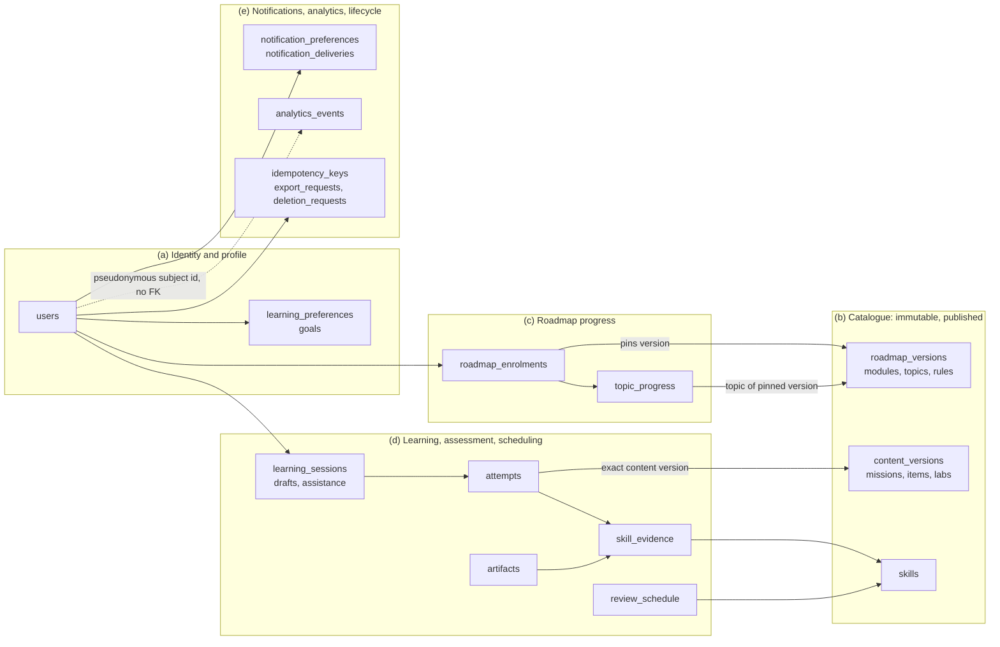
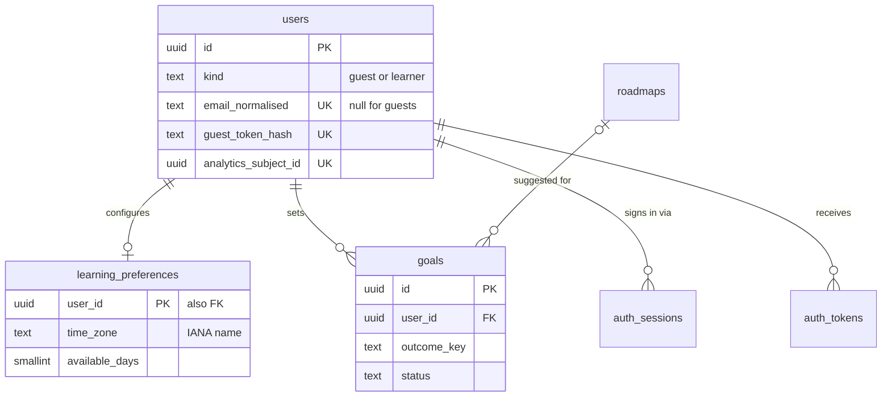
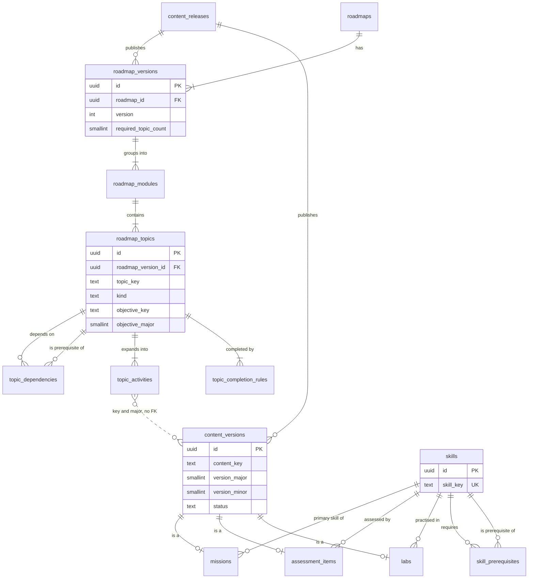
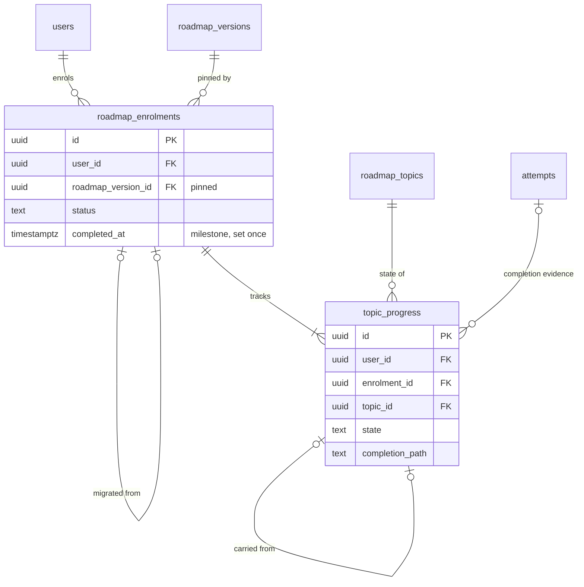
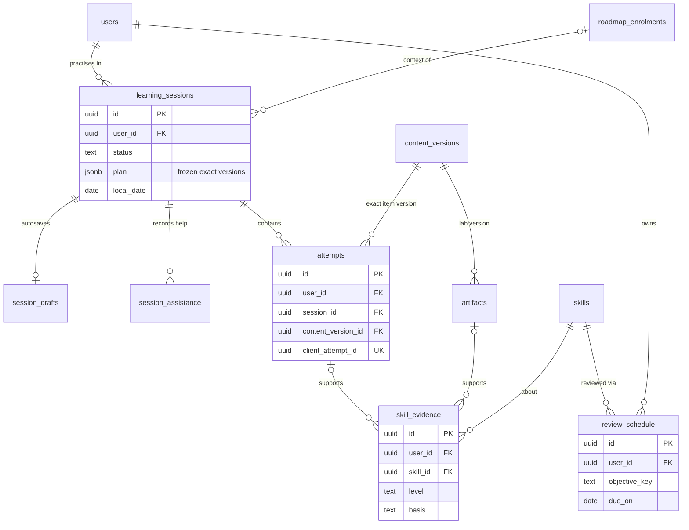
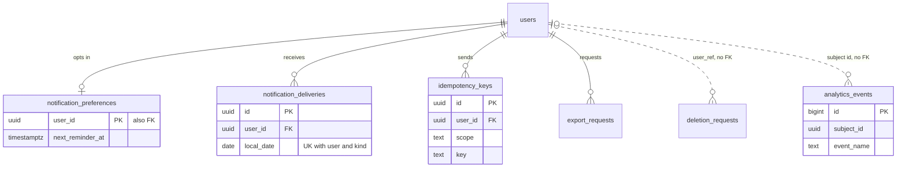
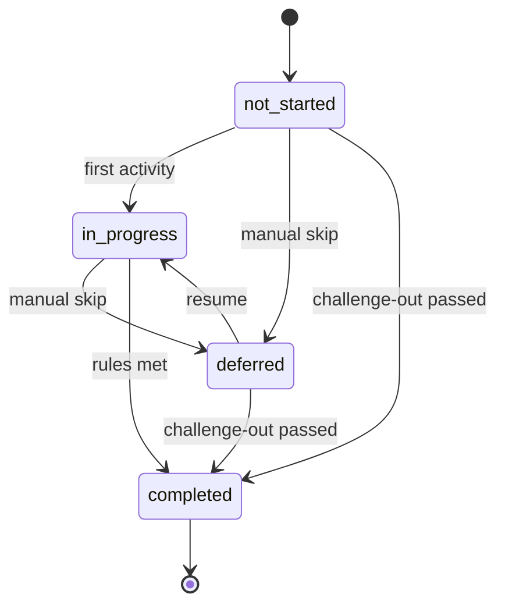

# 04 · Data model

Status: **Proposal — for discussion.** Planning only. No schema, migration or
code exists.

## Purpose

This doc defines DevStep's tables, owning modules, the constraints that enforce
PRD rules, retention, deletion, export and sizing. The founder can use it to
judge complexity and hosting cost before the stack decision in
`01-tech-stack-and-hosting.md`. Examples use Postgres-compatible SQL; §12 lists
what changes on SQLite. Out of scope: algorithms (`05-learning-engine.md`),
content file format and publish workflow (`06-content-system.md`), API shapes
(`02-system-architecture.md`) and flows (`03-key-flows.md`).

## Summary

- **34 tables in five domains.** Every learner row carries `user_id`. Composite
  foreign keys `(parent_id, user_id)` make a cross-learner reference
  impossible inside the database (PRD §11, §12).
- **Published content is insert-only.** Only retirement fields ever change.
  Learner rows reference exact versions with `ON DELETE RESTRICT`, so retiring
  content never erases evidence (PRD §11, §12, R01).
- **Two version axes** drive pinning, migration with retained credit (R06) and
  evidence reuse across roadmaps (§8A). They are the content version
  `major.minor` and the objective version (`objective_key` at
  `objective_major`).
- **Constraints carry correctness.** Partial unique indexes allow one open
  session, one current enrolment and one reminder per local day. Conditional
  updates make completion exactly-once. Drafts use revision compare-and-set.
  `idempotency_keys` replays responses but is never the only guard.
- **Enumerations are `text` columns with CHECK constraints.** `skill_evidence`
  is append-only and summarised at read time. "A revealed solution never
  demonstrates" is a CHECK constraint.
- **Guests are server-side `users` rows** tied to a device cookie. Sign-up
  converts the row in place; signing in to an existing account merges by
  re-keying.
- **Deletion is a hard delete by cascade.** Analytics rows are kept but given
  new random IDs, so not even a backup can link them back. Export is a
  versioned JSON zip.
- **Size:** about 3 MB raw per active learner-year (plan for 5 MB). That is
  roughly 0.3, 2.6 or 25 GB for 50, 500 or 5,000 fully active learners.

## 1. Modelling conventions used here

| Topic | Rule (**Proposal** unless cited) |
| --- | --- |
| Keys | `id uuid`, generated by the application and time-ordered. Exceptions: `analytics_events.id bigint`, and composite PKs on edge tables. |
| Time | `timestamptz` in UTC, named `*_at` (conventions). Learner-local calendar days are `date` columns (`local_date`, `due_on`), computed at write time from the learner's IANA zone. |
| Enumerations | `text` plus `CHECK (col IN (...))` (§6.1). |
| JSON | `jsonb` only for authored bodies, learner responses, frozen snapshots, allow-listed analytics properties and short author lists. Never filtered or joined on. |
| Audit | Mutable tables also have `created_at` and `updated_at`; the tables below omit them. |
| Owner scoping | `user_id uuid NOT NULL`, indexed as the leading column. Parents expose `UNIQUE (id, user_id)`, and children use composite FKs to them. These FKs are `DEFERRABLE` so a guest merge can re-key in one transaction (§7). |
| FK actions | Learner → `users`: `CASCADE`. Learner → learner parent: `CASCADE`. Learner → catalogue: `RESTRICT`. Every FK column is indexed. |
| Portable subset | No native enum types, arrays, extensions, advisory locks or `SELECT … FOR UPDATE`. Unique constraints and conditional updates only, which also work on SQLite. |
| PII classes | **ID**: direct identifier. **LC**: learner content (free text or files; may hold personal or employer details). **LA**: activity tied to `user_id`. **PS**: pseudonymous (`subject_id` only). **—**: none. |

## 2. Domain overview and ERDs

ERDs show keys and the columns that define each entity; §3 holds the full
column lists.

### 2.1 How the domains connect



### 2.2 (a) Identity and profile



### 2.3 (b) Catalogue and content



### 2.4 (c) Roadmap progress



### 2.5 (d) Learning, assessment and scheduling



### 2.6 (e) Notifications, analytics, idempotency and lifecycle



## 3. Table definitions

### 3.0 Table register

Retention and deletion behaviour per table: §8.1.

| Table | Module | Purpose | Owner scope | PII |
| --- | --- | --- | --- | --- |
| `users` | `identity` | Account or guest identity, plus the analytics subject ID | `id` | ID |
| `auth_sessions` | `identity` | Server-side login sessions, only if `02` chooses them | `user_id` | ID |
| `auth_tokens` (added) | `identity` | Hashes of one-time tokens (verification, reset, login link) | `user_id` | ID |
| `learning_preferences` | `profile` | Zone, days, mode, targets, stack tags, diagnostic status (F01) | `user_id` (PK) | LA |
| `goals` | `profile` | One active desired outcome; history kept (F01) | `user_id` | LA, LC |
| `content_releases` (added) | `catalogue` | One row per publish run; links to the content repository revision | — | — |
| `roadmaps` | `catalogue` | Stable roadmap identity | — | — |
| `roadmap_versions` | `catalogue` | Immutable roadmap structure that enrolments pin (R01) | — | — |
| `roadmap_modules` | `catalogue` | Ordered modules within a version | — | — |
| `roadmap_topics` | `catalogue` | Topics with kind, objective and stable `topic_key` | — | — |
| `topic_dependencies` | `catalogue` | Topic prerequisite edges within one version | — | — |
| `topic_activities` (added) | `catalogue` | Ordered missions, labs and check groups per topic (§8A) | — | — |
| `topic_completion_rules` | `catalogue` | Standard and challenge-out conditions (R03) | — | — |
| `content_versions` | `catalogue` | Immutable envelope for every mission, item and lab version, with F11 metadata | — | — |
| `missions`, `assessment_items`, `labs` | `catalogue` | Typed metadata, 1:1 with `content_versions` | — | — |
| `skills`, `skill_prerequisites` | `catalogue` | Skill registry and its prerequisite edges | — | — |
| `roadmap_enrolments` | `roadmap` | Pinned enrolment, milestone, migration record | `user_id` | LA |
| `topic_progress` | `roadmap` | Workflow state per topic per enrolment (R02) | `user_id` | LA |
| `learning_sessions` | `learning` | Practice session with a frozen plan of exact versions | `user_id` | LA |
| `session_drafts` | `learning` | Autosaved answers with a revision counter (F03) | `user_id` | LC |
| `session_assistance` (added) | `learning` | Hints, worked examples, reveals recorded by the server (F04) | `user_id` | LA |
| `attempts` | `learning` writes, `assessment` evaluates | Answer to an exact item version (F04) | `user_id` | LC, LA |
| `skill_evidence` | `assessment` | Append-only evidence events (F08) | `user_id` | LA |
| `review_schedule` | `scheduling` | One review track per objective version (F05) | `user_id` | LA |
| `artifacts` | `learning` | Learner lab evidence (F07) | `user_id` | LC |
| `notification_preferences` | `notifications` | Consent, time, quiet hours, pause, next send instant (F10) | `user_id` (PK) | LA |
| `notification_deliveries` | `notifications` | One row per learner per local day on which a reminder was considered | `user_id` | LA |
| `analytics_events` | `analytics` | Pseudonymous funnel and outcome events (F12) | `subject_id` (no FK) | PS |
| `idempotency_keys` | cross-cutting; each scope is written by its module | Replay store for unsafe requests (F09) | `user_id` | LA |
| `export_requests` | `identity` | Async export jobs and file references (F09) | `user_id` | ID |
| `deletion_requests` | `identity` | Deletion workflow, plus a tombstone for replay after a backup restore | `user_ref` (no FK) | opaque ID only |

### 3.1 Identity and profile

**`users`**

| Column | Type | Null | Notes |
| --- | --- | --- | --- |
| `id` | uuid | no | PK |
| `kind` | text | no | CHECK `guest`, `learner` |
| `status` | text | no | CHECK `active`, `pending_deletion` |
| `email`, `email_normalised` | text | yes | NULL only for guests. The normalised form (lower-cased, trimmed) is unique |
| `email_verified_at`, `claimed_at` | timestamptz | yes | `claimed_at`: when a guest became a learner |
| `password_hash` | text | yes | Only if `02`/`09` choose passwords; never exported |
| `guest_token_hash` | text | yes | Hash of the guest cookie secret; cleared on claim |
| `analytics_subject_id` | uuid | no | Random and unique; the only link to `analytics_events` |
| `last_seen_at` | timestamptz | no | Written at most hourly |

Constraints: `CHECK ((kind = 'guest') = (email IS NULL))`;
`CHECK (kind <> 'guest' OR guest_token_hash IS NOT NULL)`. Indexes:
`uq_users_email (email_normalised) WHERE email_normalised IS NOT NULL`,
`uq_users_guest_token`, `uq_users_subject`,
`ix_users_guest_seen (last_seen_at) WHERE kind = 'guest'` (for the purge).

| Table | Key columns, constraints and indexes |
| --- | --- |
| `auth_sessions` | `id`; `user_id` FK cascade; `token_hash` UK; `expires_at`, `revoked_at`, `last_seen_at`; `client_label` (coarse browser family only; no IP address stored). Indexes `(user_id)`, `(expires_at)` |
| `auth_tokens` | `id`; `user_id` FK cascade; `purpose` CHECK `email_verification`, `password_reset`, `login_link`, `email_change`; `token_hash` UK; `expires_at`; `used_at` |
| `learning_preferences` | `user_id` PK and FK; `time_zone text NOT NULL` (IANA, validated by the app); `available_days smallint` (weekday bitmask, CHECK `0..127`; these are the "scheduled learning days"); `preferred_mode` CHECK session mode; `weekly_session_target` default 3 and `weekly_lab_target` default 1 (PRD §5); `stack_tags jsonb` (codes only); `diagnostic_status` CHECK `not_offered`, `skipped`, `partial`, `completed`. Skipped skills have no evidence rows, so they stay unknown (F01); `revision int` |
| `goals` | `id`; `user_id`; `outcome_key text` (an authored option); `note text NULL`, CHECK length ≤ 280; `suggested_roadmap_id` FK `roadmaps`; `status` CHECK `active`, `replaced`; `replaced_at`. `uq_goals_one_active (user_id) WHERE status = 'active'` enforces one goal (F01) |

### 3.2 Catalogue

Only the publish step of the content pipeline (`06`) writes these tables; the
runtime reads them (§4).

| Table | Key columns | Constraints and indexes |
| --- | --- | --- |
| `content_releases` | `id`, `release_key`, `source_ref` (repository revision), `manifest_hash`, `published_by`, `published_at` | UK `release_key` |
| `roadmaps` | `id`, `slug` (immutable), `retired_at` | UK `slug` |
| `roadmap_versions` | `id`, `roadmap_id`, `version int`, `status` CHECK `published`/`retired`, `release_id`, `previous_version_id`, `title`, `outcome`, `estimated_effort_hours` (R01), `required_topic_count` (denominator, set at publish), `changelog jsonb` (per-`topic_key` notes for R06), `published_at`, `retired_at` | UK `(roadmap_id, version)`; UK `(id, roadmap_id)`; CHECK `required_topic_count > 0` |
| `roadmap_modules` | `id`, `roadmap_version_id`, `module_key`, `position`, `title` | UK `(roadmap_version_id, module_key)`; UK `(id, roadmap_version_id)` |
| `roadmap_topics` | `id`, `roadmap_version_id`, `module_id`, `topic_key` (stable across versions), `position`, `kind` CHECK topic kind, `objective_key`, `objective_major`, `estimated_minutes`, `replaces_topic_keys jsonb` (renames, for migration) | UK `(roadmap_version_id, topic_key)`; UK `(id, roadmap_version_id)`; composite FK `(module_id, roadmap_version_id)` |
| `topic_dependencies` | `roadmap_version_id`, `topic_id`, `depends_on_topic_id` | PK `(topic_id, depends_on_topic_id)`; both ends use a composite FK with the same `roadmap_version_id`; CHECK no self-edge. Cycles are rejected at publish (§8A); a CHECK constraint cannot express acyclicity |
| `topic_activities` | `id`, `roadmap_version_id`, `topic_id`, `position`, `ref_kind` CHECK `mission`/`lab`/`item_group`, `ref_key`, `ref_major`, `role` CHECK `core`/`enrichment`/`topic_check`/`challenge`, `is_required` (pilot labs: `false`) | UK `(topic_id, position)`. No FK to content: resolved at run time to the latest published minor of `(ref_key, ref_major)`; publish validates that it exists |
| `topic_completion_rules` | `id`, `roadmap_version_id`, `topic_id`, `path` CHECK `standard`/`challenge_out`, `objective_key`, `objective_major`, `requirements jsonb` (schema-validated at publish, evaluated by `05`) | UK `(topic_id, path)` |
| `content_versions` | `id`, `content_kind` CHECK `mission`/`assessment_item`/`lab`, `content_key`, `version_major`, `version_minor`, `status` CHECK `published`/`retired`, `body jsonb` (including answer keys; the server reads it before submission), `content_hash`, `source_urls`, `stack_scope`, `reviewed_by` (a handle, not an FK), `last_reviewed_on date`, `release_id`, `published_at`, `retired_at`, `retire_reason` | UK `(content_kind, content_key, version_major, version_minor)`; CHECK `(status = 'retired') = (retired_at IS NOT NULL)`; `ix_content_latest (content_kind, content_key, version_major, version_minor DESC) WHERE status = 'published'` |
| `missions` | `content_version_id` PK/FK, `mode` CHECK `small`/`practise`, `small_equivalent_key` (curated smaller version, PRD §9), `primary_skill_id`, `objective_key`, `objective_major`, `estimated_minutes` | |
| `assessment_items` | `content_version_id` PK/FK, `mission_key` (NULL for standalone items), `skill_id` (one per item), `objective_key`, `objective_major`, `alternate_group_key` (interchangeable prompts), `eligible_purposes jsonb`, `response_kind`, `scoring` CHECK `auto`/`self_check`/`human` | Indexes `(alternate_group_key)`, `(skill_id)` |
| `labs` | `content_version_id` PK/FK, `primary_skill_id`, `kit_ref`, `kit_sha256`, `has_no_setup_fallback` (PRD §16) | |
| `skills` | `id`, `skill_key` (immutable), `title`, `status` CHECK `active`/`retired` | UK `skill_key` |
| `skill_prerequisites` | `skill_id`, `prerequisite_skill_id` | Composite PK; CHECK no self-edge; cycles rejected at publish |

### 3.3 Roadmap progress

**`roadmap_enrolments`**

| Column | Type | Null | Notes |
| --- | --- | --- | --- |
| `id`, `user_id` | uuid | no | UK `(id, user_id)` and `(id, user_id, roadmap_version_id)`, used as composite FK targets |
| `roadmap_id`, `roadmap_version_id` | uuid | no | Composite FK to `roadmap_versions` RESTRICT; the pinned version (R01) |
| `status` | text | no | CHECK `active`, `paused`, `ended`, `migrated` |
| `enrolled_at`, `paused_at`, `ended_at` | timestamptz | no / yes / yes | CHECK `(status = 'paused') = (paused_at IS NOT NULL)` (R05) |
| `completed_at`, `completion_summary` | timestamptz, jsonb | yes | Milestone, set together once and never cleared (R04). The summary is a frozen snapshot: skills covered, evidence by basis, optional labs, remaining reviews |
| `migrated_from_enrolment_id`, `migration_summary` | uuid, jsonb | yes | Set together. The FK is unique, so a source can be migrated once; the summary is the diff the learner accepted (R06) |
| `reviews_on_exit` | text | yes | CHECK `continue`, `pause`: the answer when switching roadmap (§8A) |

Indexes: `uq_enrolments_current (user_id) WHERE status IN ('active', 'paused')`
gives one active roadmap at a time (§8A); `(user_id, enrolled_at)`.

**`topic_progress`** (rows created for every topic at enrolment)

| Column | Type | Null | Notes |
| --- | --- | --- | --- |
| `id`, `user_id` | uuid | no | UK `(id, user_id)` |
| `enrolment_id`, `roadmap_version_id` | uuid | no | FK `(enrolment_id, user_id, roadmap_version_id)` → enrolments, cascade |
| `topic_id` | uuid | no | FK `(topic_id, roadmap_version_id)` → `roadmap_topics`. With the FK above, a row can only point at a topic of the learner's pinned version |
| `state` | text | no | CHECK topic workflow state |
| `completion_path` | text | yes | CHECK `standard`, `challenge_out`, `carried_over`, `reused_evidence`. There is no defer value (R03) |
| `completion_attempt_id`, `carried_from_progress_id` | uuid | yes | Composite FKs to `attempts` and to self |
| `started_at`, `completed_at`, `deferred_at` | timestamptz | yes | |

Constraints: UK `(enrolment_id, topic_id)`;
`CHECK ((state = 'completed') = (completed_at IS NOT NULL AND completion_path IS NOT NULL))`;
`CHECK (state <> 'deferred' OR deferred_at IS NOT NULL)`; `carried_over`
requires `carried_from_progress_id`; the other paths require
`completion_attempt_id`. A trigger blocks leaving `completed`.

### 3.4 Learning, assessment and scheduling

**`learning_sessions`**

| Column | Type | Null | Notes |
| --- | --- | --- | --- |
| `id`, `user_id` | uuid | no | UK `(id, user_id)` |
| `mode`, `purpose` | text | no | CHECK session mode. Purpose is CHECK `roadmap`, `recovery`, `diagnostic`, `sample`, `challenge`, `maintenance` (`05` may refine) |
| `status` | text | no | CHECK `open`, `suspended`, `completed`, `abandoned` |
| `enrolment_id`, `topic_id` | uuid | yes | Composite FK with `user_id`; FK to `roadmap_topics` |
| `content_version_id` | uuid | yes | The mission or lab version served (RESTRICT) |
| `plan` | jsonb | no | Ordered steps fixed at start, with the exact item `content_version_id`s, including review items chosen under the cap |
| `local_date` | date | no | The learner's local date at start; used for reminder suppression and weekly progress |
| `started_at`, `last_activity_at`, `completed_at` | timestamptz | no / no / yes | CHECK `(status = 'completed') = (completed_at IS NOT NULL)` |

Indexes: `uq_sessions_one_open (user_id) WHERE status = 'open'`;
`ix_sessions_user_activity (user_id, last_activity_at DESC)`;
`ix_sessions_user_done_day (user_id, local_date) WHERE status = 'completed'`.
Starting a new session suspends the open one in the same transaction and keeps
its draft (R05). Only an explicit "start over", or retirement of the content
version, moves a session to `abandoned`.

**`attempts`**

| Column | Type | Null | Notes |
| --- | --- | --- | --- |
| `id`, `user_id`, `session_id` | uuid | no | UK `(id, user_id)`; FK `(session_id, user_id)`, cascade |
| `content_version_id` | uuid | no | Exact assessment item version, RESTRICT (PRD §11) |
| `step_key`, `attempt_no` | text, smallint | no | UK `(session_id, step_key, attempt_no)` |
| `client_attempt_id` | uuid | no | The request's `Idempotency-Key`; UK `(user_id, client_attempt_id)` |
| `purpose` | text | no | CHECK assessment purpose (§6.1) |
| `response` | jsonb | no | Learner answer (LC) |
| `outcome`, `score`, `evaluated_at` | text, numeric, timestamptz | yes | Outcome is CHECK `correct`, `partially_correct`, `incorrect`, `self_met`, `self_not_met`. NULL until evaluated: `CHECK ((outcome IS NULL) = (evaluated_at IS NULL))` |
| `evidence_basis` | text | no | CHECK `auto_scored`, `self_assessed`, `human_reviewed`. `self_met` and `self_not_met` require `self_assessed` |
| `assistance`, `hint_count` | text, smallint | no | Copied from `session_assistance` at submit. CHECK `none` ⇒ 0 hints; `hint` ⇒ at least 1 |
| `submitted_at`, `feedback_viewed_at` | timestamptz | no / yes | `feedback_viewed_at` supports the "practised" rule (PRD §9) |

Each field is written once: `response`, version and assistance never change,
and evaluation is set by `UPDATE … WHERE outcome IS NULL`. Indexes:
`(user_id, submitted_at)`, `(content_version_id)` for item-quality analysis.

**`skill_evidence`** (append-only; §6.2)

| Column | Type | Null | Notes |
| --- | --- | --- | --- |
| `id`, `user_id`, `skill_id` | uuid | no | `skill_id` RESTRICT |
| `level`, `basis`, `assistance` | text | no | CHECK canonical enums. Basis is always present, so self-assessed evidence stays labelled (§8A) |
| `source` | text | no | CHECK `attempt`, `artifact`, `reading`, `human_review` |
| `attempt_id`, `artifact_id` | uuid | yes | Composite FKs with `user_id` |
| `content_version_id` | uuid | yes | Exact version (RESTRICT) |
| `objective_key`, `objective_major` | text, smallint | no | Copied at write time; used for reuse (§4.4) |
| `limitations` | jsonb | no | Limitation codes (§6.2) |
| `observed_at` | timestamptz | no | |
| `voided_at`, `void_reason` | timestamptz, text | yes | Set together, once. Reason is CHECK `content_error`, `artifact_deleted`, `duplicate` |

PRD rules as CHECKs:
`NOT (level IN ('demonstrated', 'retained') AND assistance = 'solution_revealed')`
(PRD §9);
`level = 'introduced' OR attempt_id IS NOT NULL OR artifact_id IS NOT NULL OR voided_at IS NOT NULL`
(reading alone never raises a level above introduced, F04); artifact-sourced
evidence never has basis `auto_scored` (PRD §9). "Retained at least 7 days
after demonstration" spans rows, so `assessment` enforces it and a nightly
invariant query reports violations. Index:
`ix_evidence_user_skill_time (user_id, skill_id, observed_at)`.

**`review_schedule`**

| Column | Type | Null | Notes |
| --- | --- | --- | --- |
| `id`, `user_id`, `skill_id` | uuid | no | UK `(user_id, objective_key, objective_major)` |
| `objective_key`, `objective_major`, `alternate_group_key` | text, smallint, text | no | What is reviewed, using rotating alternate prompts |
| `status` | text | no | CHECK `active`, `suspended` (learner paused reviews after a switch), `retired` (no alternates left) |
| `interval_step` | smallint | no | CHECK `0..10`; the interval values live in config (`05`) |
| `due_on` | date | no | Learner-local. **The cap never changes it** (§5.6) |
| `last_item_version_id`, `last_attempt_id`, `last_outcome` | uuid, uuid, text | yes | Used to rotate alternates and adjust the interval |
| `demonstrated_at`, `retained_at` | timestamptz | yes | Inputs to the delayed retained check |
| `source_enrolment_id` | uuid | yes | Supports "continue reviews from the previous roadmap?" |

Index: `ix_review_due (user_id, due_on) WHERE status = 'active'`.

| Table | Key columns, constraints and indexes |
| --- | --- |
| `session_drafts` | `session_id` PK with FK `(session_id, user_id)`, cascade; `user_id`; `revision int` CHECK ≥ 1 (§5.5); `step_key`; `payload jsonb` (LC); `updated_by_client` (a random ID per device, used on the conflict screen) |
| `session_assistance` | `id`; `user_id`; `session_id` (composite FK); `step_key`; `content_version_id`; `kind` CHECK `hint`, `worked_example`, `solution_revealed`; `hint_index` (≥ 1 for hints, otherwise 0); `used_at`. UK `(session_id, step_key, kind, hint_index)` makes retried calls harmless. The server records help *before* showing it, so a reload cannot turn assisted work into unassisted work (F04) |
| `artifacts` | `id`; `user_id`; UK `(user_id, client_artifact_id)`; `lab_version_id` (RESTRICT); `session_id`; `kind` CHECK `decision_record`, `experiment_result`, `check_output`, `diagram`, `notes`; `body text` (LC); `storage_key`, `byte_size`, `sha256`, used only if uploads are introduced (PRD §11), with CHECK body or `storage_key` present; `rubric_self_check jsonb` (met or not met, no text); `evidence_basis` CHECK `learner_submitted`, `self_assessed`, `human_reviewed`. Index `(user_id, submitted_at)`. A learner may delete one; its evidence is voided (`artifact_deleted`) |

### 3.5 Notifications, analytics, idempotency and lifecycle

**`notification_preferences`** (1:1 with `users`; opt-in, PRD §6)

| Column | Type | Null | Notes |
| --- | --- | --- | --- |
| `user_id` | uuid | no | PK; FK cascade |
| `email_enabled` | bool | no | Default `false`. When true, `consent_at`, `consent_text_version` and `reminder_local_time` must be set (CHECK) |
| `reminder_local_time`, `quiet_start`, `quiet_end` | time | yes | Local wall-clock times. Days come from `learning_preferences.available_days` |
| `paused_until`, `snoozed_until` | date, timestamptz | yes | Pause and snooze (F10) |
| `unsubscribed_at`, `unsubscribe_token_version` | timestamptz, int | yes / no | Tokens are signed and stateless; bumping the version invalidates old links |
| `next_reminder_at` | timestamptz | yes | Next candidate send in UTC, computed with IANA rules. CHECK `email_enabled OR next_reminder_at IS NULL` |

Index: `ix_notif_next (next_reminder_at) WHERE email_enabled`. Unsubscribing
clears `email_enabled` and `next_reminder_at`; re-enabling needs fresh consent.

| Table | Key columns, constraints and indexes |
| --- | --- |
| `notification_deliveries` | `id`; `user_id`; `kind` CHECK `learning_reminder`; `channel` CHECK `email`; `local_date` (the learner's local learning day); **UK `(user_id, kind, local_date)`**; `status` CHECK `claimed`, `sent`, `suppressed`, `failed`; `suppression_reason` CHECK `session_completed`, `paused`, `snoozed`, `quiet_hours`, `unsubscribed`, `not_learning_day` (set ⇔ suppressed); `claimed_at`, `sent_at`; `provider_message_ref`, `error_code`. No email address or message body is stored. Index `(claimed_at) WHERE status = 'claimed'` |
| `analytics_events` | `id bigint` identity; `client_event_id` UK (removes duplicate client retries); `subject_id uuid NOT NULL` (**no FK**); `event_name` (checked against the registry in `10`; CHECK length ≤ 64); `occurred_at`, `received_at`; `session_ref uuid` (no FK); `content_version_id`, `roadmap_version_id`, `topic_key`, `mode`; `properties jsonb` (allow-listed, CHECK ≤ 1 KB; §9); `schema_version`, `app_version`. Indexes `(event_name, occurred_at)`, `(subject_id, occurred_at)`. With no FKs, an analytics problem cannot block learning (PRD §12) |
| `idempotency_keys` | `id`; `user_id` FK cascade; `scope` CHECK `attempt_submit`, `session_complete`, `artifact_submit`, `guest_claim`, `export_request`, `account_delete`, `enrolment_migrate`; `key` (client-supplied, 8–128 characters); **UK `(user_id, scope, key)`**; `request_hash`; `state` CHECK `in_progress`, `completed`; `response_status`, `response_body jsonb` (≤ 16 KB, no learner text); `resource_ref`; `expires_at` (+24 h, indexed for the purge) |
| `export_requests` | `id`; `user_id` FK cascade; `status` CHECK `queued`, `running`, `ready`, `expired`, `failed`; `format_version`; `file_ref`, `byte_size`, `sha256`; `expires_at` (required when ready). `uq_export_inflight (user_id) WHERE status IN ('queued', 'running')` |
| `deletion_requests` | `id`; `user_ref uuid` (copy of `users.id`, **no FK**, so it survives deletion); `origin` CHECK `learner_request`, `guest_expiry`, `operator`; `status` CHECK `pending`, `cancelled`, `processing`, `completed`; `requested_at`, `effective_at`, `completed_at`; `steps jsonb` (checklist, so a crashed job resumes); `ledger_cleared_at`. `uq_deletion_open (user_ref) WHERE status IN ('pending', 'processing')` |

## 4. Content immutability and versioning

### 4.1 Rules

| Rule | PRD | Mechanism (**Proposal**) |
| --- | --- | --- |
| Published rows never change except lifecycle fields | §11, F11 | The runtime database role has `SELECT` only on catalogue tables. The publish role has `INSERT` plus `UPDATE (status, retired_at, retire_reason)`. A trigger rejects every other update, any transition except `published → retired`, and every `DELETE` |
| A version cannot be republished with different content | F11 | UK on `(kind, key, major, minor)`; publish compares `content_hash` and aborts on a mismatch |
| Learner rows reference exact versions | §11, F04 | FKs to `content_versions` with `RESTRICT` from `attempts`, `session_assistance`, `skill_evidence`, `artifacts` and `learning_sessions`. The session `plan` freezes item versions at start, so a mid-session publish changes nothing |
| Retired content never erases evidence | §12 | Retirement only stops new serving. No learner row is updated; the evidence view shows "task version retired on …" by joining at read time |
| Enrolments pin a version | R01 | `roadmap_enrolments.roadmap_version_id`; composite FKs keep every `topic_progress` row inside that version |

### 4.2 Two version axes

Credit depends on **what was assessed** (objective) and **whether the
assessment still measures it** (content major). Authors classify changes at
review (`06`).

| Change | Recorded as | Effect on enrolled learners |
| --- | --- | --- |
| Typo, clearer wording, extra hint, source link | content minor + 1 | Served from the next session. No migration; credit unaffected |
| New scenario, prompts or rubric for the same objective | content major + 1 | Reaches learners only through a new roadmap version. Old attempts still count if the rule lists the old major as accepted |
| Objective materially changed | `objective_major` + 1 | New roadmap version. Old completions are not carried; challenge-out is offered. Evidence history is unchanged |
| Content found wrong | Retire; void evidence with `content_error` | Rows stay. Voided evidence is excluded from levels and shown as voided |

`topic_activities` points to `(key, major)`, not a row ID. Minor fixes
therefore reach everyone without new roadmap versions, and anything that could
change credit forces a migration offer.

### 4.3 Version migration with retained credit (R06)

Migration happens only when the learner accepts it. It runs in one
transaction, guarded by scope `enrolment_migrate` and the unique
`migrated_from_enrolment_id`:

1. Match old and new topics by `topic_key` or through `replaces_topic_keys`.
2. A matched topic that was `completed`, with an equal `objective_key` and
   `objective_major`, becomes a new row with `completion_path = 'carried_over'`
   and `carried_from_progress_id` set.
3. Other matched topics become `not_started`, or `in_progress` if attempts
   exist, with challenge-out offered. Deferred topics stay deferred.
4. The accepted diff is frozen into `migration_summary`. The old enrolment
   becomes `migrated` and keeps its rows and any `completed_at` milestone.

```json
{ "from_version": 1, "to_version": 2,
  "required_before": { "completed": 11, "total": 18 }, "required_after": { "completed": 10, "total": 19 },
  "topics": [ { "topic_key": "perf.query-plans", "change": "wording_only", "credit": "carried" },
              { "topic_key": "caching.invalidation", "change": "objective_changed", "credit": "challenge_offered" } ] }
```

Learners stay on their pinned version until they accept, and the summary shows
before and after counts, so progress never drops silently.

### 4.4 Evidence reuse across roadmaps (§8A)

A topic in roadmap B completes with `completion_path = 'reused_evidence'` only
when an attempt matches both axes (sketch; the full rule is in `05`):

```sql
SELECT a.id FROM attempts a
  JOIN assessment_items i ON i.content_version_id = a.content_version_id
  JOIN content_versions cv ON cv.id = a.content_version_id
 WHERE a.user_id = :uid
   AND i.objective_key = :rule_objective_key AND i.objective_major = :rule_objective_major
   AND (i.alternate_group_key, cv.version_major) IN (:accepted_groups_from_rule)
   AND a.purpose IN ('topic_check', 'challenge') AND a.outcome = 'correct'
   AND a.assistance IN ('none', 'hint')
 LIMIT 1;
```

If nothing matches, the topic offers challenge-out. Credit is a reference
(`completion_attempt_id`); attempts and evidence are never copied.

## 5. Correctness via constraints

### 5.1 Invariants

| Invariant | PRD | Enforced by |
| --- | --- | --- |
| A topic completes once and never reverts | R02 | Conditional update, the state and path CHECK, and a terminal trigger |
| Manual defer never earns credit | R03 | `completion_path` has no defer value |
| A session completes once; side effects run once | F09 | Conditional status update plus idempotency replay |
| One open session; one current enrolment; one active goal; one in-flight export | F02, §8A, F01, F09 | Partial unique indexes |
| One attempt per client submission | F09 | UK `(user_id, client_attempt_id)` |
| No silent draft overwrite | §12 | Revision compare-and-set |
| At most one reminder per local learning day | F10 | UK on `notification_deliveries`, claimed before sending |
| A reveal never demonstrates; reading never raises a level | §9, F04 | CHECKs on `skill_evidence` |
| Rows belong to their owner and the pinned version | §11, R01 | Composite FKs |
| The milestone is awarded once and never revoked | R04 | `UPDATE … WHERE completed_at IS NULL`; a trigger forbids clearing it |

### 5.2 Exactly-once topic completion (R02)



```sql
UPDATE topic_progress
   SET state = 'completed', completed_at = :now, completion_path = :path,
       completion_attempt_id = :attempt_id
 WHERE enrolment_id = :enrolment_id AND topic_id = :topic_id
   AND user_id = :uid AND state <> 'completed'
RETURNING id;
-- 1 row: first completion, so emit events and re-check the milestone with the same pattern
--        (UPDATE roadmap_enrolments ... WHERE completed_at IS NULL AND
--         completed required topics = required_topic_count)
-- 0 rows: already completed (retry or second device), so do nothing
```

### 5.3 Idempotent session completion (F09)

```sql
BEGIN;
INSERT INTO idempotency_keys (id, user_id, scope, key, request_hash, state, expires_at)
VALUES (:id, :uid, 'session_complete', :key, :hash, 'in_progress', :now + interval '24 hours')
ON CONFLICT (user_id, scope, key) DO NOTHING RETURNING id;
-- no row: same hash and completed means replay the stored response;
--         same hash and in_progress means 409; a different hash means 422
UPDATE learning_sessions SET status = 'completed', completed_at = :now
 WHERE id = :sid AND user_id = :uid AND status IN ('open', 'suspended')
RETURNING id;
-- 0 rows: completed earlier by another key or device; return current state with no side effects
-- 1 row:  topic_progress (5.2), review_schedule, skill_evidence and analytics_events, all in this transaction
UPDATE idempotency_keys SET state = 'completed', response_status = 200, response_body = :resp
 WHERE id = :key_id;
COMMIT;
```

If the transaction fails, the key rolls back with it. The unique index
serialises two devices sending the *same* key. With *different* keys, both race
on the conditional update and exactly one wins.

### 5.4 `idempotency_keys` design

- **Scope and key.** Unique per `(user_id, scope, key)`. The client creates one
  random key per logical action and reuses it on retries (`02`).
- **Request hash.** Reusing a key with a different body returns 422, never a
  replay.
- **Stored response.** Status and body, so retries get identical answers. The
  learner's own text is never echoed (§9).
- **Expiry.** 24 hours, then a daily purge. Correctness never depends on the
  key still existing, because the invariant layer is permanent: UK
  `client_attempt_id`, conditional status updates, one in-flight export, and
  claim already applied.
- **Email dispatch** uses the `notification_deliveries` row as its key (§5.7),
  not this table. This deviates from the conventions list (Open question 9).

### 5.5 Draft revisions (PRD §12)

```sql
INSERT INTO session_drafts (session_id, user_id, revision, step_key, payload, updated_by_client)
VALUES (:sid, :uid, 1, :step, :payload, :client) ON CONFLICT (session_id) DO NOTHING;  -- base_revision 0

UPDATE session_drafts
   SET payload = :payload, step_key = :step, revision = revision + 1, updated_by_client = :client
 WHERE session_id = :sid AND user_id = :uid AND revision = :base_revision
RETURNING revision;
-- 0 rows: 409 with the server copy (revision, payload, updated_at, client);
-- the client shows both versions and never overwrites silently
```

### 5.6 Review cap at read time; deferred items preserved (F05, F06)

```sql
SELECT id, objective_key, alternate_group_key, last_item_version_id
  FROM review_schedule
 WHERE user_id = :uid AND status = 'active' AND due_on <= :learner_local_today
 ORDER BY due_on, interval_step, id
 LIMIT :cap;   -- 2 for practise, 1 for small (conventions); build is decided in 05
```

The cap is applied only here. Items beyond it keep their `due_on`, so nothing
is dropped, pushed back or doubled. The oldest surface first, and the backlog
spreads across future sessions (PRD §6). No overdue counter is stored.

### 5.7 One reminder per local learning day (F10)

```sql
INSERT INTO notification_deliveries (id, user_id, kind, channel, local_date, status, claimed_at)
VALUES (:id, :uid, 'learning_reminder', 'email', :local_date, 'claimed', :now)
ON CONFLICT (user_id, kind, local_date) DO NOTHING RETURNING id;
-- no row: this day is already handled
```

The worker that wins the claim then checks suppression: a session completed
today (`ix_sessions_user_done_day`), a pause, a snooze or quiet hours. It
either marks the row `suppressed` with a reason, or sends and marks it `sent`.
If the worker crashes after claiming, a sweep marks the row `failed` and **does
not resend**. Delivery is at-most-once by design, because a missed reminder
costs less than a duplicate (PRD §6).

## 6. Enumerations and evidence history

### 6.1 Check constraints, not lookup tables

**Decision (Proposal):** `text` columns with CHECK constraints. No lookup
tables or native enum types.

- Values are tied to code branches (for example, `solution_revealed` blocks
  demonstration), so adding one needs a deploy anyway.
- CHECK works the same on SQLite; native enum types do not exist there and are
  awkward to alter elsewhere.
- Values are readable in exports and ad-hoc SQL without joins.
- A change means re-creating one constraint, or rebuilding the table on SQLite.

Lookup tables are used only where rows carry authored data (`skills`). Event
names get only a length CHECK and are validated by the app against the
registry in `10`, because that list will change more often than the schema
should.

| Enumeration | Values | Columns | Origin |
| --- | --- | --- | --- |
| Session mode | `small`, `practise`, `build` | `learning_sessions`, `learning_preferences`, `missions` (subset) | Conventions |
| Topic workflow state | `not_started`, `in_progress`, `completed`, `deferred` | `topic_progress.state` | Conventions |
| Evidence level | `introduced`, `practised`, `demonstrated`, `retained` | `skill_evidence.level` | Conventions |
| Evidence basis | `auto_scored`, `self_assessed`, `learner_submitted`, `human_reviewed` | `skill_evidence`; subsets on `attempts`, `artifacts` | Conventions |
| Assistance | `none` < `hint` < `worked_example` < `solution_revealed` (highest used; hint count stored separately) | `attempts`, `skill_evidence`, `session_assistance.kind` | Conventions |
| Content status | Runtime subset: `published`, `retired` | `content_versions`, `roadmap_versions` | Conventions; `draft` and `in_review` live in the content repository (`06`) |
| Topic kind | `required`, `optional` | `roadmap_topics.kind` | Conventions |
| Assessment purpose | `practice`, `review`, `topic_check`, `challenge`, `diagnostic`, `transfer`, `delayed_check` | `attempts.purpose`, `assessment_items.eligible_purposes` | Added |
| Completion path | `standard`, `challenge_out`, `carried_over`, `reused_evidence` | `topic_progress` | Added |

Other added status sets are listed with their tables in §3.

### 6.2 Append-only `skill_evidence`, projected at read time

**Decision (Proposal):** `skill_evidence` is the source of truth and is
insert-only. The current level is derived when read; there is no projection
table at the pilot.

- F08 needs **dates per level and limitations**; a single current-level column
  would lose them.
- `retained` compares a delayed check with a demonstration at least 7 days
  earlier, which requires both events.
- Corrections appear as voids (`voided_at`, set once), never as silent edits.
  Rows are deleted only with the account.
- About 500 rows per learner-year (§11) makes aggregation per request cheap. A
  `skill_status` cache rebuilt from evidence can be added later if the
  evidence view misses its budget.

```sql
SELECT skill_id,
       MIN(CASE WHEN level = 'introduced'   THEN observed_at END) AS first_introduced_at,
       MIN(CASE WHEN level = 'practised'    THEN observed_at END) AS first_practised_at,
       MIN(CASE WHEN level = 'demonstrated' THEN observed_at END) AS first_demonstrated_at,
       MAX(CASE WHEN level = 'retained'     THEN observed_at END) AS last_retained_at,
       MAX(CASE WHEN basis = 'self_assessed' THEN 1 ELSE 0 END)   AS has_self_assessed
  FROM skill_evidence WHERE user_id = :uid AND voided_at IS NULL
 GROUP BY skill_id;
```

Limitation codes written when evidence is recorded include `self_assessed`,
`hint_used`, `worked_example_used`, `no_setup_fallback`, `learner_submitted_only`
and `single_scenario`. "Content since retired" is derived at read time. The
wording shown is decided in `05` and `08`.

## 7. Guest data and claim

| Option | How it works | For | Against |
| --- | --- | --- | --- |
| A. Device-local only | Progress lives in browser storage and is uploaded at sign-up | No server rows for drive-by visitors | A second evaluation path; the server must trust or re-score client evidence; the funnel breaks at sign-up |
| **B. Server-side guest row** | A `users` row with `kind = 'guest'`, created on the first answer and bound to an httpOnly cookie secret (only its hash is stored) | Same tables, constraints, scoring and idempotency as accounts. Claim is an in-place update. The activation funnel stays continuous (PRD §13) | Rows for people who never sign up. Losing the cookie loses the work, as with A |

**Decision (Proposal): B.** Guests have no email, so they cannot enable
reminders or exports. Guest creation is rate-limited (`09`). Unclaimed guests
are purged 30 days after `last_seen_at` through the normal deletion path
(`origin = 'guest_expiry'`). PRD §5 requires telling guests where their work
is saved. Suggested copy: "Saved in this browser for 30 days. Create an
account to keep it and use other devices." Final copy is in `08`.

- **Sign-up claim** is one `UPDATE users` that sets `kind = 'learner'`, the
  email and `claimed_at`, and clears `guest_token_hash`. It runs under scope
  `guest_claim`, and no child row moves.
- **Merge, when a guest signs in to an existing account,** is one transaction
  with the owner FKs deferred. Every table is re-keyed explicitly; a missed
  table makes the commit fail. Afterwards the guest `users` row is deleted. The
  sequence is in `03`.

| Table | Merge rule |
| --- | --- |
| `attempts`, `session_assistance`, `session_drafts`, `artifacts`, `skill_evidence` | Re-key. IDs are globally unique, so there is no conflict |
| `learning_sessions` | Re-key. If both have an `open` session, the guest's becomes `suspended` |
| `review_schedule` | On a conflict, keep the higher `interval_step` (on a tie, the earlier `due_on`) |
| `roadmap_enrolments`, `topic_progress` | If the account has no current enrolment, re-key. If it has one on the same version, merge per topic keeping the more advanced state (`completed` > `in_progress` > `deferred` > `not_started`) and end the guest enrolment. If the versions differ, end the guest enrolment and let reuse (§4.4) grant credit |
| `learning_preferences`, `goals`, `notification_preferences` | The account's rows win |
| `analytics_events` | Re-key the guest `subject_id` to the account's. It is the same person, and this keeps the sample-to-sign-up funnel |
| `idempotency_keys` | Delete |

## 8. Deletion, retention and export

### 8.1 Retention and deletion map

| Table | Retention while the account exists | On account deletion |
| --- | --- | --- |
| `users` | Account lifetime | Hard delete; everything below cascades unless stated |
| `auth_sessions`, `auth_tokens` | 30 days after expiry, or 7 days after use | Cascade |
| `learning_preferences`, `goals`, `notification_preferences` | Account lifetime | Cascade |
| `roadmap_enrolments`, `topic_progress`, `learning_sessions`, `session_assistance` | Account lifetime | Cascade |
| `session_drafts` | While the session is open or suspended; deleted 30 days after it closes | Cascade |
| `attempts` (free text) | Account lifetime (Open question 4) | Cascade |
| `skill_evidence`, `review_schedule` | Account lifetime | Cascade |
| `artifacts` | Account lifetime; the learner can delete any one | Cascade, plus deletion of stored files |
| `notification_deliveries` | Rolling 13 months | Cascade |
| `idempotency_keys` | 24 hours | Cascade |
| `export_requests` | File 7 days; row 90 days | Cascade, plus deletion of the file |
| `deletion_requests` | Tombstone until backups older than the deletion expire; then `user_ref` is set to NULL | Kept (opaque ID only) |
| `analytics_events` | 24 months (Open question 5) | **Kept, with `subject_id` and `session_ref` re-keyed** (§8.3) |
| Catalogue | Indefinitely | Unaffected |

### 8.2 Deletion procedure (F09, PRD §12)

1. `DELETE /v1/me` (scope `account_delete`) runs one transaction. It creates a
   `pending` request with `effective_at = now + 7 days`, sets
   `users.status = 'pending_deletion'`, revokes sessions, turns reminders off
   and cancels queued exports.
2. During the grace period the learner can cancel. Reminders stay off until
   consent is given again.
3. At `effective_at` the worker sets the request to `processing` and records
   progress in `steps`. It then re-keys analytics (§8.3), deletes stored
   files, runs `DELETE FROM users`, which cascades, and marks the request
   `completed`.
4. Backups expire on the schedule in `09`. The restore runbook replays every
   completed tombstone **before** the app reopens.

Active personal records are gone by day 8, inside the PRD's proposed 30 days.

### 8.3 Analytics on deletion: keep, but re-key

| Option | Result |
| --- | --- |
| Keep `subject_id` and drop only the mapping | The person can be re-linked from any backup that still holds `users` |
| **Re-key (recommended)** | All of the person's events get one fresh random `subject_id`, and each `session_ref` gets a fresh random value; the mapping exists only in memory during the job. Sequences per subject survive for cohort metrics, and the new values exist nowhere else, backups included. Cost: about 3,000 row updates per learner-year |
| Delete the events | Biases pilot metrics, because learners who drop out and delete their account disappear |

Remaining risk: in a pilot of 30–50 people, event timing alone could point to
someone. Access to analytics is limited to the operator (`09`).

### 8.4 Export (F09)

`POST /v1/me/export` queues a job. The worker builds a **ZIP of JSON files**.
`GET /v1/me/export/{id}` serves it to the owner only (PRD §12 authorisation
tests) for 7 days. Expected size is 1–3 MB per learner-year.

| File | Contents |
| --- | --- |
| `manifest.json`, `README.txt` | Format version, generation time (UTC), the learner's time zone, record counts; field and evidence-state explanations |
| `profile.json` | Email, account dates, preferences, goals with notes |
| `roadmaps.json` | Enrolments (slug, version), topic progress (`topic_key`, title, path), milestone and migration summaries |
| `sessions.json`, `attempts.json` | Sessions and assistance; full responses with outcome, basis, assistance, item key and version, prompt title |
| `evidence.json`, `reviews.json` | All evidence rows, including voided ones with reasons, plus a summary per skill; review schedule |
| `artifacts.json` and `artifacts/` | Artifact metadata, bodies and files |
| `drafts.json`, `notifications.json` | Open or suspended drafts; reminder settings and a delivery log |
| `analytics_events.json` | The learner's pseudonymous events. **Proposal:** include them, because they are linkable while the account exists |

Excluded: credential and token hashes, `idempotency_keys`, tombstones, and
authored content bodies and answer keys. Content is referenced by key and
version instead.

## 9. Free-text answers (F12)

**Where free text lives:** `attempts.response`, `session_drafts.payload`,
`artifacts.body` and its files, and `goals.note`. Nowhere else.

**It never reaches `analytics_events`.** Four guards:

1. `analytics_events` has no free-text column. `properties` follows a
   per-event allow-list (`10`) that permits only IDs, enumeration codes,
   numbers, booleans, and strings of at most 64 characters matching
   `[a-z0-9_.:-]`.
2. A CHECK caps `properties` at 1 KB.
3. `idempotency_keys.response_body`, delivery error codes and logs never echo
   learner text (`09`).
4. A planned automated test sends a canary string through every learner-text
   field and asserts it never appears in events, logs or stored responses.

**Limits and retention.** CHECK constraints cap responses at 32 KB, drafts and
artifact bodies at 64 KB, and goal notes at 280 characters. Text is stored raw
and escaped when rendered (`09`). It is kept for the life of the account
because the evidence view, feedback and export need it; drafts are purged 30
days after their session closes. Everything is deleted with the account. Text
is not used to train models without separate consent (PRD §12). No consent
column exists, so the default is no; F13 would add one.

## 10. Hot queries and the indexes that serve them

**Proposal:** the catalogue (about 2 MB per release) is cached in process
memory per `content_releases` row (`02` decides). Dependencies, activities and
latest minors are then not database queries.

| # | Query | Served by |
| --- | --- | --- |
| Q1 | Today: session to resume (open, or the latest suspended) | `uq_sessions_one_open`; `ix_sessions_user_activity` |
| Q2 | Today: current enrolment | `uq_enrolments_current` |
| Q3 | Today: topic states, to find the next prerequisite-ready mission | UK `(enrolment_id, topic_id)` (about 30 rows) plus cached dependencies |
| Q4 | Today: due reviews, capped (§5.6) | `ix_review_due` (partial on `active`) |
| Q5 | Today: absence detection (last practice) | `ix_sessions_user_activity` |
| Q6 | Today: weekly progress (completed sessions this local week) | `ix_sessions_user_done_day` |
| Q7 | Reminder candidates per tick, all time zones: `email_enabled AND next_reminder_at <= now() ORDER BY next_reminder_at LIMIT 200` | `ix_notif_next`. Because the value is a precomputed UTC instant, one range scan covers every zone, and DST is handled when the next value is computed |
| Q8, Q9 | Reminder suppression ("practised today?") and the slot claim | `ix_sessions_user_done_day`; UK `(user_id, kind, local_date)` |
| Q10 | Evidence view (§6.2) plus recent artifacts | `ix_evidence_user_skill_time`; artifacts `(user_id, submitted_at)` |
| Q11 | Roadmap progress: completed required topics ÷ `required_topic_count` | UK `(enrolment_id, topic_id)`, `roadmap_topics` PK, immutable denominator |
| Q12 | Analytics: activation, week-4 retention, return after absence, delayed retention (PRD §13) | `(subject_id, occurred_at)` for per-subject windows; `(event_name, occurred_at)` for cohorts |
| Q13, Q14 | Idempotency lookup; account deletion cascade | UK `(user_id, scope, key)`; an index starting with `user_id` on every learner table |
| Q15 | Purges: expired keys, closed drafts, stale guests | `(expires_at)`; drafts joined to session status; `ix_users_guest_seen` |

Each Today input is an index lookup over a few hundred rows at most, well
within the 500 ms p95 budget (PRD §12). At 5,000 learners (about 15 million
events a year), consider monthly roll-ups or partitioning for analytics (`10`).

## 11. Size estimates

**Assumptions (Hypothesis, not measured).** An active learner-year is the
default pace (PRD §5) over 48 weeks: about 200 sessions, 5 graded responses
per practise session, free-text answers averaging about 400 characters, and no
binary uploads. Bytes per row include rough row overhead and the §3 indexes.

| Table | Rows per learner-year | Bytes per row | Per learner-year |
| --- | --- | --- | --- |
| `attempts` | 1,000 | ~1,200 | ~1.2 MB |
| `analytics_events` | 3,000 | ~400 | ~1.2 MB |
| `skill_evidence` | 500 | ~350 | ~175 KB |
| `learning_sessions` | 200 | ~600 | ~120 KB |
| `session_assistance` | 300 | ~200 | ~60 KB |
| `artifacts` | 12 | ~5,000 | ~60 KB |
| `notification_deliveries` | 150 | ~300 | ~45 KB |
| `session_drafts` (live) | ~20 | ~2,000 | ~40 KB |
| `review_schedule`, `topic_progress`, `roadmap_enrolments` | ~110 | ~350 | ~45 KB |
| Identity, profile, auth, idempotency (live) | ~40 | — | ~30 KB |
| **Total** | **~5,300** | | **~3.0 MB raw; plan ~5 MB** (×1.6 for page fill, dead rows, index growth) |

The catalogue adds about 2 MB per full release (about 260 versions at about
8 KB) and stays under about 10 MB a year, because minor releases add only the
changed rows. Allow about 50 MB of fixed overhead, including the job queue
(`01`/`02`).

| Learners | Upper bound: all fully active for a year | Realistic: about 30% active on average (Hypothesis) |
| --- | --- | --- |
| 50 | ~0.3 GB | ~0.14 GB |
| 500 | ~2.6 GB | ~0.8 GB |
| 5,000 | ~25 GB | ~7.6 GB |

Growth is linear per year. Attempts and analytics are each about 40% of the
total; analytics is the first candidate to roll up or expire. At these sizes,
backup and restore time (`09`) matters more than storage cost.

## 12. If the database were SQLite

The logical model is unchanged, because every pattern uses only unique
constraints, conditional updates and CHECKs. The physical differences:

| Feature | Postgres-compatible (as written) | SQLite |
| --- | --- | --- |
| `jsonb` | Binary JSON | `TEXT` with `CHECK (json_valid(col))`; read with the JSON functions. No JSON indexes are needed |
| `timestamptz`, `date`, `time` | Native | Fixed-format ISO-8601 `TEXT` in UTC, or integer epoch milliseconds. The app supplies all timestamps and does interval arithmetic |
| `uuid`, `bool` | Native | `TEXT` (36 bytes, about +15% size) or a 16-byte `BLOB`; `INTEGER` 0/1 with a CHECK. Use `STRICT` tables |
| Partial unique indexes | Open session, current enrolment, active goal, in-flight export | Supported. Upserts must repeat the index `WHERE` in the conflict target, as in the Postgres-compatible form |
| CHECK, composite and deferred FKs | Enforced | Enforced, but FK checking must be switched on per connection. Changing a CHECK later needs a table rebuild |
| Catalogue immutability | Role grants plus a trigger | No roles: triggers (`RAISE(ABORT)`) and app discipline only |
| Concurrency | Many concurrent writers, row-level locking | **One writer at a time**; write-ahead logging keeps readers unblocked. Our patterns still hold because writes serialise. Needs a busy timeout, short transactions, and chunked long jobs (export, analytics re-key). The web process and the worker share one host with the file (`01`) |
| `RETURNING`, `ON CONFLICT` | Used | Available in recent releases; confirm the pinned version, or fall back to the changed-row count |
| `FILTER`, `IS DISTINCT FROM` | Avoided | Use `CASE` (as in §6.2) and `IS NOT` |
| Analytics volume | Same database | Optionally a separate attached file, so the main file and its backups stay small |

## 13. Deliberately not modelled yet

AI tutor usage, cost and consent (F13). Briefings (F14), companion state (F15)
and custom roadmaps (R08). Learner-reported content errors (PRD §16; free
text, owned by `06`'s workflow) and a human-review queue. The weekly burden
survey, proposed as an analytics event with a scale value (`10`).
Authentication details (`02`, `09`) and job-queue tables (`01`, `02`).

## Open questions for discussion

1. **Guest storage.** *Default:* a server-side `users` row with
   `kind = 'guest'`, bound to a cookie and purged after 30 days of inactivity
   (§7).
2. **Analytics on deletion.** *Default:* keep the events but re-key
   `subject_id` and `session_ref` to fresh random values (§8.3).
3. **Deletion grace period.** *Default:* 7 days, cancellable, then a hard
   delete. `09` sets backup retention; 30 days or less is suggested.
4. **Free-text retention.** *Default:* keep for the life of the account during
   the pilot. Before launch, revisit deleting response text after 24 months
   while keeping outcomes.
5. **Raw analytics retention.** *Default:* 24 months, then delete. Aggregates
   live in the reports owned by `10`.
6. **Composite owner FKs.** *Default:* adopt them. Fall back to single-column
   FKs plus authorisation tests only if the chosen framework fights them.
7. **Draft and review states in the runtime database.** *Default:* no. Store
   only `published` and `retired`; `draft` and `in_review` stay in the content
   repository (`06`).
8. **Evidence corrections.** *Default:* `voided_at` and `void_reason` are the
   only mutable fields, rather than separate correction rows.
9. **Email dispatch idempotency.** *Default:* the unique
   `notification_deliveries` row is the dispatch key and sending is
   at-most-once. Update the conventions list to match.
10. **Open sessions.** *Default:* one per learner. Starting another suspends
    it and keeps its draft.
11. **Export includes the learner's analytics events.** *Default:* yes, while
    they are linkable.
12. **Primary key format.** *Default:* time-ordered UUIDs generated by the
    application; `bigint` only for `analytics_events`.

## PRD traceability

| PRD | Covered by |
| --- | --- |
| F01 | `learning_preferences`, `goals`; diagnostic results stored as attempts with purpose `diagnostic`; skipped means no evidence |
| F02 | Today inputs Q1–Q6 (§10) |
| F03 | `learning_sessions`, `session_drafts` (§5.5) |
| F04 | `attempts` (exact version, outcome, assistance), `session_assistance`, `skill_evidence` CHECKs |
| F05, F06 | `review_schedule`; cap at read time (§5.6); suspended sessions; absence query |
| F07 | `labs`, `artifacts` |
| F08 | Append-only `skill_evidence` with dates and limitations (§6.2) |
| F09 | Idempotency (§5.3, §5.4); deletion and export (§8); auth tables; drafts across devices |
| F10 | `notification_preferences`, `notification_deliveries`, Q7–Q9 |
| F11 | `content_versions` metadata, `content_releases` |
| F12 | `analytics_events`; free-text guards (§9) |
| F13–F15, R08 | Not modelled (§13) |
| R01 | Pinned version and composite FKs (§4.1) |
| R02, R03 | Exactly-once completion; no defer completion path (§5.2) |
| R04 | `completed_at` and `completion_summary`, `required_topic_count`, basis labels |
| R05 | `paused` status, suspended sessions, drafts kept |
| R06 | Version axes and migration shape (§4.2, §4.3) |
| R07 | Multi-roadmap tables; one current enrolment |
| §8A | Topic kinds, progress formula, evidence reuse (§4.4), cycles rejected at publish |
| §11 | Owner scoping, exact versions, idempotency, UTC |
| §12 | Owner FKs, draft conflicts, deletion within 30 days, pseudonymous analytics, retired content keeps evidence |
| §13 | Event fields and metric queries (Q12) |
