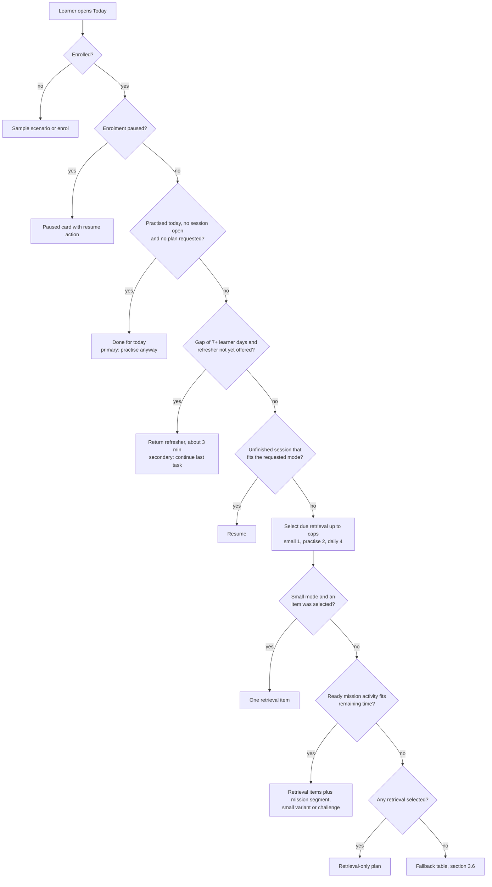
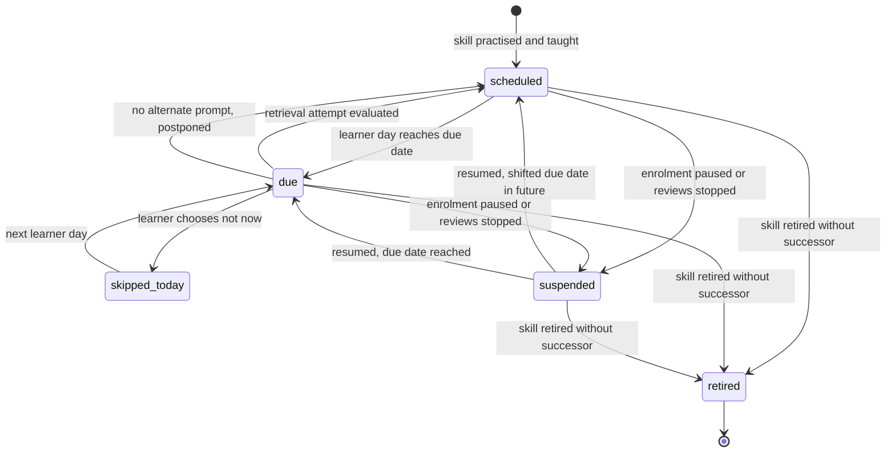
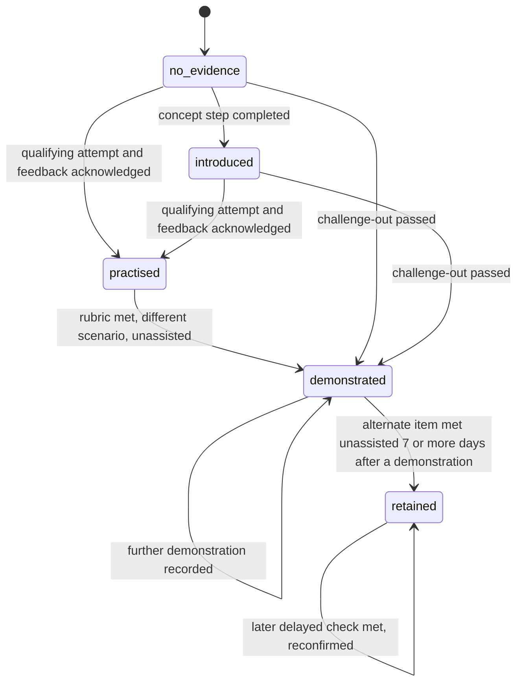
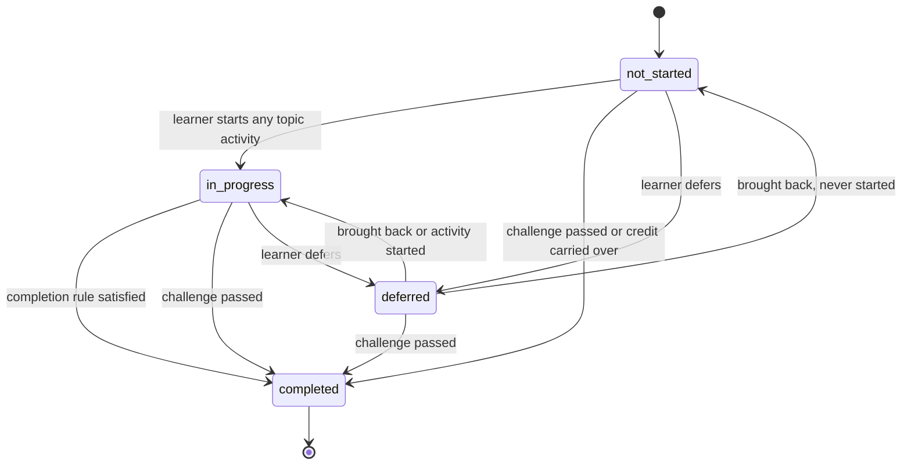
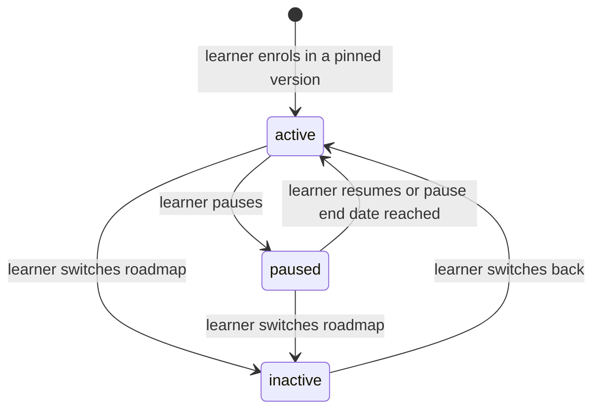
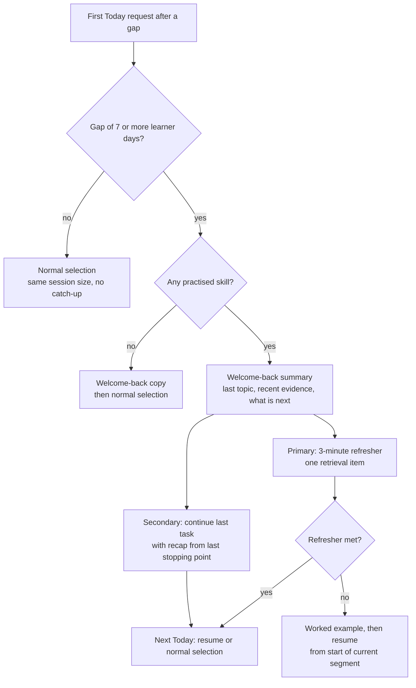

# 05 · Learning engine

Status: Proposal — for discussion

**Purpose.** This document defines the explainable rules that make DevStep adaptive: what Today recommends, when retrieval practice comes back, how skill evidence and topic completion are recorded, and how the plan adjusts around absence, pauses and new content versions. Every rule is written so that it can become an acceptance test.

**Summary**

- Today is a deterministic function of learner state, the learner's local day and one parameter set. The order is: a return refresher after a long absence, then resume, then up to 2 due retrieval items (1 in `small`), then the first prerequisite-ready mission segment that fits the time. It always gives exactly one primary action, with a reason code, a templated one-line rationale and roadmap · module · topic context, plus at most three secondary actions in total (Start small, resume, lab, challenge). After the day's practice it shows a "done for today" state.
- There is one review item per mission's primary skill. It climbs a 1 → 3 → 7 → 21-day ladder and then a 60-day maintenance interval; an unassisted topic-check pass jumps to the 7-day rung, so the next review is the retention check on a reserved alternate. Reviews step back after errors or heavy assistance, rotate alternate prompts (never the same prompt twice in a row), and are capped per session and per day. "Due" means "eligible from", so a backlog spreads itself across sessions and drains in maintenance. No overdue counter exists anywhere.
- Skill evidence is an append-only log. A displayed level never goes down: a later failed check adds a "refresh suggested" note and the level stays. Reading, self-report, diagnostics, confidence ratings and pre-submission reveals never raise a level.
- `demonstrated` and `retained` both need an unassisted attempt (zero hints, no reveal) on a different-scenario or alternate item. `retained` also needs the attempt to fall at least 7 days after a demonstration.
- Topic workflow is separate from evidence. The pilot rule is: mission attempt, plus feedback reviewed, plus a topic check met (no reveal, at most 1 hint) on a later learner day, using one of the topic's two check-eligible items; a failed check is retried later with the other item. Challenge-out (one attempt) completes a topic; manual defer never does.
- Progress is completed required topics ÷ required topics in the pinned version, rounded down, with the count shown beside it. Completion is evaluated idempotently. The milestone is written once and never revoked, and maintenance mode follows it.
- A new roadmap version is an opt-in migration with a preview, and completion credit for mapped topics always carries over. Absence never creates debt: the learner gets a 3-minute refresher on return, sessions stay the same size, and a pause shifts due dates.
- Every number lives in one parameters registry (§13). Most of them are Hypotheses to test in the concierge trial and the pilot.

**Out of scope here:** tables and columns (`04-data-model.md`), API shapes (`02-system-architecture.md`), cross-module sequences (`03-key-flows.md`), screens and copy placement (`08-ux-and-screens.md`), the content file format (`06-content-system.md`), the actual missions, items and labs (`07-curriculum-plan.md`), and event payloads and metrics (`10-measurement-and-validation.md`).

---

## 1. Principles and ownership

| # | Principle | Label |
| --- | --- | --- |
| P1 | Explainable rules only. Every output carries a reason code that maps to plain-language copy. No reinforcement learning and no opaque model. | PRD §9 |
| P2 | Deterministic. The same state, learner day and parameters always give the same result. The clock is an input, and ties are broken by stable keys. | Proposal |
| P3 | Effort recognition and skill evidence never mix (§12). | PRD §6, F15 |
| P4 | No debt. Missed time never makes the next session bigger. | PRD §6, F06, R05 |
| P5 | Nothing earned is silently taken away: topic completion, milestones and evidence all persist. | PRD R04, R06 |
| P6 | AI is optional and advisory. No rule here depends on a model call. | PRD §9, §11 |
| P7 | Autonomy. The learner can always choose smaller, resume, browse the roadmap, defer or pause, and the engine never blocks these. | PRD §2, §8A |

| Rule set | Owning module (`00-conventions.md`) | Section |
| --- | --- | --- |
| Today recommendation, review queue, recovery, weekly target | `scheduling` | §3, §4, §10, §12 |
| Hints, reveals, attempts, session plans | `learning` | §5 |
| Scoring, writing skill evidence | `assessment` | §5, §6 |
| Topic workflow, completion, progress, migration | `roadmap` | §7–§9 |
| Diagnostic baseline estimate | `profile` | §11 |

## 2. Shared definitions

| Term | Definition | Label |
| --- | --- | --- |
| Learner day | The local calendar date in the learner's IANA time zone, after subtracting `day_rollover_hour` (04:00). A session at 00:30 on Wednesday therefore belongs to Tuesday. Every rule about "today", "due", "gap" and "week" uses learner days. | Proposal |
| Planned learning day | A weekday the learner marked as available (F01). | PRD §5 |
| Qualifying attempt | The first scored submission on an item within a session step. It must be submitted before any reveal of that item's solution, and it must be non-empty: for a structured item, an answer is chosen; for a `self_check` free-text answer, at least `open_response_min_chars` characters. | Proposal |
| Feedback acknowledged | The learner takes an explicit action on the feedback step: continue, retry, or open the worked example. No dwell-time rule applies. | Proposal |
| Meaningful activity | A qualifying attempt whose feedback was acknowledged. Opening Today, reading, or starting a session without answering does not count. | Proposal, aligned to PRD §13 |
| Session plan | The ordered activities behind Today's single primary action. | Proposal |
| Activity | One of: resume, retrieval item (review or topic check), mission segment, small variant, challenge-out, refresher, lab. | Proposal |
| Mission segment | The steps from the learner's current position up to the next authored stopping point. A plan never ends in the middle of a step. | Proposal |
| Small variant | A separate, curated variant of a mission: one recall or decision task, feedback, and an explicit stopping point, at most 4 minutes (about 3). It is authored as a step subset in the `06-content-system.md` format, never produced by cutting a mission short. The mission's own ~3-minute steps (`07-curriculum-plan.md` §5.0) are resume stopping points inside a `practise` mission, not small variants. | PRD §5, §9 |
| Skill | The measurable objective a mission teaches. Each mission has exactly one primary skill; review items, topic checks and demonstration attach to it. Secondary skill tags get evidence only from labs and are otherwise used for analytics; they never get a review item. | Proposal |
| Check-eligible item | An item that can serve as a topic's check: the authored topic check item and Alternate A. Every topic has at least 2, so no extra authoring is needed. | Proposal |
| Retention-reserved item | Alternate B, flagged in content. It is held back for the skill's delayed retention check and never served as an ordinary review before that check. | Proposal |
| Retention-eligible | A review item whose skill was demonstrated at least `retained_min_delay_days` learner days ago, with no `retained` record since that demonstration. | Proposal |
| Teaching scenario | The scenario used in a mission's explanation, worked example and in-mission items. | Proposal |
| Different scenario | An item whose authored scenario key differs from the teaching scenario of the mission that taught the skill. | Proposal (reads PRD §9) |
| Alternate item | Any item other than a named reference item, such as the item last served for this skill or the item that produced a demonstration. | Proposal |
| Taught | A skill is taught once its mission activity is done (§7.2), a small variant of it is completed, or its topic is completed by any route. | Proposal |
| Due | `due_date ≤ learner day`. "Due" means eligible from that day. It is never a deadline. | Proposal |

**Assistance bands.** The stored assistance value uses the `00-conventions.md` enum. Rules use a derived **band**. The band is computed from usage before the qualifying submission, and the most severe usage wins.

| Usage before submission | Stored assistance | Band | Effect |
| --- | --- | --- | --- |
| No hint, no worked example, no reveal | `none` | unassisted | Can extend a review, demonstrate, or retain |
| 1 hint (tier 1) | `hint`, count 1 | light | Holds the review rung; can satisfy a topic check; cannot demonstrate |
| `heavy_hint_threshold` (2) or more hints | `hint`, count ≥ 2 | heavy | Steps the rung back; a worked example follows |
| Worked example opened (hint tier 3) | `worked_example` | heavy | Same as above |
| Solution revealed before submission | `solution_revealed` | revealed | Not a qualifying attempt; a fresh attempt is scheduled |

Seeing the correct answer in feedback **after** submitting is feedback, not a reveal (Proposal).

---

## 3. Today recommendation (F02, §9)

### 3.1 Contract

**Inputs:** preferences (mode, availability, time zone), enrolment, topic progress, unfinished sessions, review items, evidence, diagnostic estimate, the pinned catalogue version, the learner day, parameters, and an optional requested mode.

**Output** (logical shape only; the API shape belongs to `02-system-architecture.md`):

| Part | Content |
| --- | --- |
| Primary action (exactly one) | Reason code, mode, ordered activities, estimated minutes (sum rounded up and labelled "about"), one-line rationale, context line |
| Secondary actions (at most 3 in total) | `smaller` ("Start small"; only when a small plan exists (SM-2) and the primary is not small), `resume` (when an unfinished session exists but is not the primary), `lab_available` (§7.6), and `challenge` (on CHALLENGE_SUGGESTED, DEFERRED_BLOCKER or a `partial` diagnostic area, while the challenge is still available, §7.4). If more qualify, they are kept in this order. |
| Rest today | A control that skips today's reminder only (PA-6); not a secondary action |
| Weekly progress | Practice days this week against the target, and the optional lab (§12) |
| Never included | Backlog size, overdue counts, red states, or a list the learner must browse |

Rules:
- **TD-1:** Exactly one primary action. On the paused card it is "Resume"; in the done-for-today state it is an optional "Practise anyway" (§3.6).
- **TD-2:** Deterministic, with stable tie-breakers.
- **TD-3:** Retrieval items in a plan never exceed the caps in §4.4.
- **TD-4:** A plan never starts a step it cannot finish before a stopping point.
- **TD-5:** The plan is recomputed on every request, and starting a planned activity re-validates it against current state (concurrent devices, §14).
- **TD-6:** Once the learner has practised today (a meaningful activity this learner day) and no session is open, Today shows the done-for-today state unless the learner asks for a plan ("Practise anyway" or "Start small").

### 3.2 Selection order



| # | Enrolment | Long gap, refresher not offered | Unfinished session fits mode | Due retrieval after caps | Ready activity fits | Result (reason code) |
| --- | --- | --- | --- | --- | --- | --- |
| T1 | none | – | – | – | – | Sample scenario for a guest, otherwise the enrol prompt (SAMPLE_SCENARIO / ENROL) |
| T2 | paused | – | – | – | – | Paused card (PAUSED) |
| T11 | active, practised today, no session open, no plan requested | – | – | – | – | Done for today; the optional primary "Practise anyway" re-runs selection in the preferred mode (DONE_FOR_TODAY) |
| T3 | active | yes | – | – | – | One refresher item; resume is secondary (RETURN_REFRESHER) |
| T4 | active | no | yes | – | – | Resume, on its own (RESUME) |
| T5 | active, `small` | no | no | ≥ 1 | – | One retrieval item (REVIEW_DUE / TOPIC_CHECK / RELEARN) |
| T6 | active, `small` | no | no | 0 | small variant | Small variant (SMALL_VARIANT) |
| T7 | active, `practise` | no | no | 0–2 | yes | Retrieval items plus a segment; reviews trimmed if needed (NEXT_MISSION) |
| T8 | active, `practise` | no | no | ≥ 1 | no | Retrieval only (reason of first item) |
| T9 | active | no | no | 0 | no | Fallback (§3.6) |
| T10 | active, `build` | no | lab session | ≤ 1 (lab-related) | lab ready | Warm-up item if related, plus lab (LAB) |

### 3.3 Pseudo-code

```text
function recommend_today(learner, now, requested_mode = null):
    day  = learner_day(now, learner.tz)                     # §2
    mode = requested_mode or learner.preferred_mode         # small | practise | build
    enr  = current_enrolment(learner)                       # active or paused, else none
    if enr is none:            return sample_or_enrol(learner)            # T1
    if enr.status == paused:   return paused_card(enr)                    # T2
    if practised_on(learner, day) and no_open_session(learner) and requested_mode is null:
        return done_for_today(learner, day)                               # T11, TD-6
    if gap_days(learner, day) >= LONG_ABSENCE_DAYS
       and has_practised_skill(learner)
       and not return_refresher_offered_since(learner.last_meaningful_day):
        return return_plan(learner, day)                                  # T3, §10.2

    r = resume_candidate(learner, mode)
    if r: return plan([r], reason = RESUME)                               # T4

    slots   = min(REVIEW_CAP[mode], DAILY_REVIEW_CAP - retrieval_served(learner, day))
    if mode == build: slots = min(slots, count_lab_related_due(learner, day))
    reviews = select_due_retrieval(learner, day, max(slots, 0))           # §4.4
    if mode == small and reviews: return plan(reviews[0:1])               # T5

    candidates = ready_labs(enr, learner) if mode == build                # §7.6
                 else ready_topics_in_roadmap_order(enr, learner)         # §7.3
    for c in candidates:
        act = activity_for(c, mode)            # lab segment, or challenge if suggested (§11), else segment / small variant
        if act is none: continue
        for n from len(reviews) down to min(1, len(reviews)):             # trim reviews, keep at least 1 if any
            if est(reviews[0:n]) + est(act) <= FIT[mode]:                 # FIT = ceil(BUDGET * (1 + DURATION_TOLERANCE))
                return plan(reviews[0:n] + [act])                         # T6, T7, T10
    if reviews: return plan(reviews)                                      # T8
    return fallback(learner, enr, day, mode)                              # T9, §3.6

function resume_candidate(learner, mode):
    s = most_recently_touched_unfinished_session(learner)   # open or suspended; content still servable
    if s is none or s.dismissals >= RESUME_DISMISS_LIMIT: return none   # it stays as secondary action
    if mode == small and est_to_next_stopping_point(s) > FIT[small]:
        return none
    return resume(s, recap = days_since(s.last_activity_day) >= RESUME_RECAP_AFTER_DAYS)
```

`ready_topics_in_roadmap_order` yields required topics in the pinned version, in module order and then topic order. A topic is included when it is not `completed` or `deferred`, its mission activity is not yet done, and it is prerequisite-ready (§7.3). Topics whose only remaining component is a topic check are left out, because the check reaches Today through retrieval (§4.1). `activity_for` returns `none` for small mode when the topic has no unused curated small variant.

**Size limits and starvation guard (Proposal).** The fit limit is `FIT = ceil(budget × (1 + duration_tolerance))`: 4 minutes in `small` and 13 in `practise`. Content keeps a small variant at 4 minutes or less, a practise segment at 8 minutes or less, and a retrieval item (including a topic check and a prerequisite refresher) at 2 minutes or less, matching `06-content-system.md` (V14). Within these limits a small variant always fits small mode, and 2 retrieval items plus a segment always fit a practise plan (2 + 2 + 8 = 12 ≤ 13), so the trim loop is only a safety net. If a segment still does not fit even with one review, the plan becomes retrieval-only for that session, and an oversized-segment signal goes to authors.

### 3.4 "Smaller task"

- **SM-1:** "Smaller" re-runs §3.3 with `mode = small`. It never shortens or truncates the current activity (PRD §9).
- **SM-2:** A small plan is exactly one activity, taken from the first match in this order:
  1. resume, but only if the steps left to the next stopping point fit;
  2. one due retrieval item;
  3. the curated small variant of the first prerequisite-ready topic whose variant is unused;
  4. an early recall of the most recently practised skill (§4.2, it does not extend the interval);
  5. if none of these exists, the `smaller` secondary action is hidden.
- **SM-3:** If a topic has no curated small variant, the engine moves to the next option. It never builds one by cutting a mission.
- **SM-4:** A small session counts as practice: it counts toward the weekly target and can earn `practised`. A small variant does not satisfy a topic's mission-attempt component (§7.2), because "counts as practice, not proof of mastery" (PRD §5).
- **SM-5:** Choosing smaller suspends any open session with its draft. That session remains the resume candidate.

### 3.5 Rationale ("why this matters") and context

**Context line (PRD §8A):** `{roadmap title} · Module {n}: {module title} · {topic title}`.
- For a review item, the context is the topic that teaches the skill in the current pinned version.
- If the skill comes from a previous roadmap whose reviews continue (§8.6), that roadmap's title is shown instead.
- For a guest, the context is "Sample scenario".

**Rationale line.** The line is chosen like this:
- If the plan contains a mission segment, small variant, challenge or lab, the line comes from that activity.
- Otherwise it comes from the first retrieval item.
- The plan title lists the parts, for example "2 quick recalls + Query plans".

| Reason code | Template, filled from authored fields and learner data (illustrative copy) |
| --- | --- |
| RESUME | "Pick up where you stopped: {step title}." |
| RETURN_REFRESHER | "Welcome back. A 3-minute recall of {skill name} before you continue." |
| TOPIC_CHECK | "A short check on a new scenario completes {topic title}." |
| REVIEW_DUE | "Recalling {skill name} now, {n} days after you last practised it, helps it stick." |
| RELEARN | "Another angle on {skill name}, after last time's worked example." |
| PREREQ_REFRESHER | "A quick refresher on {prerequisite skill}, which {skill name} builds on." |
| NEXT_MISSION | `{mission.purpose}`, for example "Find what slows the work-order list before adding servers." |
| SMALL_VARIANT | `{small_variant.purpose}` |
| CHALLENGE_SUGGESTED | "Your diagnostic suggests you know {topic title}. Pass a short challenge to skip it." |
| DEFERRED_BLOCKER | "{topic title} unlocks the next {n} topics. Learn it or take the challenge." |
| LAB | "On desktop: {lab.purpose}." |
| MAINTENANCE | "Keep {skill name} fresh. Last checked {date}." |
| NOTHING_DUE | "You're up to date. This is optional; a rest day is fine too." |
| DONE_FOR_TODAY | "Done for today. Next: {next planned day}, about {n} min." |
| AWAITING_CONTENT | "Module {n} opens on {date}. Until then, keep earlier skills fresh." |
| PAUSED | "Your roadmap is paused. Resume whenever you're ready." |
| SAMPLE_SCENARIO | "Try one real scenario: {purpose}." |

Rules:
- **RA-1:** Text is authored only, with no generated prose in the MVP (P6).
- **RA-2:** At most 120 characters after substitution. Above that, the template's authored short form is used.
- **RA-3:** No urgency, fear, comparison with others, mastery claims, or counts of missed work (PRD §1, §6).
- **RA-4:** The reason code is attached to `recommendation_seen` (PRD §13). The payload is defined in `10-measurement-and-validation.md`.

### 3.6 Special states and fallbacks

| Condition (checked in this order) | Primary action | Reason code |
| --- | --- | --- |
| No enrolment | Guest: the sample scenario (first value before account, PRD §5). Signed in: enrol in the launch roadmap. Enrolment always shows the outcome, required topics and effort (R01). | SAMPLE_SCENARIO / ENROL |
| Enrolment paused | Paused card with resume. No plan, no reviews, no reminders (§10.4). | PAUSED |
| Practised today, no session open, no plan requested | Done-for-today state with the next planned day; the primary "Practise anyway" runs §3.3 in the preferred mode under the daily cap | DONE_FOR_TODAY |
| Roadmap complete (maintenance) and retrieval due | Due retrieval within caps; this is where the review backlog drains (RV-11). Optional topics and labs are secondary. | MAINTENANCE |
| Roadmap complete and nothing due | First available of: resume a started optional topic → next ready optional topic → early recall of the nearest-due skill → preview other roadmaps. Never auto-enrol. | NOTHING_DUE |
| Remaining required topics have content that is not yet published | Early recall, or an optional topic | AWAITING_CONTENT |
| All remaining required work is blocked by a deferred topic | The earliest blocking deferred topic's mission, with challenge as secondary. Shown at most once per `deferred_resurface_days`; otherwise the NOTHING_DUE options. | DEFERRED_BLOCKER |
| All remaining required work is blocked by a locked topic check (§7.2) | Prerequisite refresher for that skill | PREREQ_REFRESHER |
| Only topic checks remain and none is due yet | NOTHING_DUE options; the check arrives on its due day | NOTHING_DUE |

"All prerequisites unmet" therefore always resolves to a concrete activity or an explicit, optional "up to date" action, never to an empty Today.

### 3.7 Worked examples

Topic names follow PRD §8 and are illustrative (`07-curriculum-plan.md` owns the final names). Estimates are: review item 1.5 min, topic check or prerequisite refresher 2 min, mission segment 8 min, challenge 4 min (two check-eligible items). The fit limits are 4 min in `small` and 13 min in `practise` (§3.3).

| # | Learner state | Recommendation | Why (rules) |
| --- | --- | --- | --- |
| W1 | New learner, diagnostic skipped, enrolled, prefers `practise`, no history | T1 Request path, segment 1, about 8 min. Rationale: mission purpose. Context: "From CRUD to Reliable Systems · Module 1: Understand a system · Request path" | No resume and no review items; T1 has no prerequisites; 8 ≤ 13; an `unknown` area gives no challenge suggestion (§11) |
| W2 | T1 mission attempted and feedback acknowledged on Tuesday; it is Thursday | T1 topic check (2 min) + T2 segment (8 min), about 10 min. Rationale: T2 purpose; title "Short check + Requirements and constraints" | The check is due (RV-4) and is first in priority; T2 is next in roadmap order and has no prerequisite in `07-curriculum-plan.md` §4.3 |
| W3 | T5 Query plans session suspended at step 3 two days ago, 5 min left to the stopping point; three reviews due | Resume T5, about 5 min | Resume comes before retrieval; reviews wait and nothing doubles (P4) |
| W4 | Same as W3, learner taps "Smaller" | One review: the item with the highest overdue ratio, about 2 min | 5 > 4 (the small fit limit), so resume does not fit small mode (SM-2a); one retrieval (SM-2b); T5 stays suspended (SM-5) |
| W5 | Last meaningful activity 12 learner days ago; T8 Invalidation session suspended before its first attempt; six reviews due | Welcome-back summary, then a refresher item on T7 Suitable cached data (about 2 min); secondary: "Continue Invalidation" | Long absence (§10.2). The suspended topic's skill is not yet practised, so the most recently practised skill is used. The next Today is resume with a recap. At most 2 reviews per session, 4 per day |
| W6 | Diagnostic area "performance" is `strong`; T1–T3 completed; nothing due | Challenge-out for T4 Latency evidence (topic check item + Alternate A), about 4 min; secondary: "Do the mission instead" | §11 suggestion, offered once per topic, one attempt (CH-5). Pass: T4 completed by challenge and `demonstrated`. Fail: state unchanged, `practised`, T4 mission next, no second challenge |
| W7 | T10 Queue use cases deferred 20 days ago before any mission activity; every other required topic is complete except T11, T12, T14 and T18, which depend on T10 directly or through T11 and T12 (`07-curriculum-plan.md` §4.3); nothing due | T10 segment 1, with secondary "Take the challenge" | DEFERRED_BLOCKER: a deferred prerequisite with no mission activity satisfies no dependency, soft or strict (PR-2), so all remaining required work is blocked; not resurfaced in the last 7 days |
| W8 | The T6 topic check has been not met twice in a row (once on each check-eligible item); T6 check due; T7 ready | Prerequisite refresher on T5 (one recall, 2 min) + T6 check reusing the item not served last (2 min) + T7 segment (8 min), about 12 min | `refresher_after_not_met` = 2; the refresher takes one of the 2 retrieval slots and stays within the 2-minute item limit; 2 + 2 + 8 = 12 ≤ 13 |
| W9 | T12 topic check pending and due; T9's skill demonstrated 8 days ago and its review due; two other reviews due; T13 ready | T12 check (2 min) + T9 retention check on its reserved Alternate B (1.5 min) + T13 segment (8 min), about 12 min; the other two reviews wait | RV-10 order: pending topic check, then retention-eligible item, then other due items; 2 per practise session; 2 + 1.5 + 8 = 11.5 ≤ 13 |
| W10 | Roadmap complete (18 of 18); one review due | That review, about 2 min; secondary: Lab 4 available | MAINTENANCE; no new required missions; no auto-enrolment |
| W11 | Roadmap complete; nothing due | Early recall of the nearest-due skill, labelled optional; secondaries: optional lab, preview roadmaps | NOTHING_DUE; an early success does not extend the interval (§4.2) |
| W12 | Enrolment paused until 20 October | Paused card with resume | PAUSED; reviews and reminders paused automatically (§10.4) |
| W13 | A practise session ended at its stopping point this evening; nothing is open | "Done for today. Next: Wed, about 10 min."; primary "Practise anyway" | DONE_FOR_TODAY (TD-6); "Practise anyway" runs §3.3 under the daily cap |

---

## 4. Review scheduling (F05, §9)

### 4.1 Review items

- **RV-1:** There is one review item per learner × primary skill, which is one per mission because each mission has exactly one primary skill. Secondary skills never get one (§2). It is created when the skill first becomes both `practised` and taught: after a qualifying attempt with acknowledged feedback in a mission or small variant, after a challenge-out pass, or after a carried-over completion. A failed challenge alone earns `practised` but creates no review item, so a skill is never reviewed before it has been taught.
- **RV-2:** Conceptual fields (columns belong to `04-data-model.md`): skill, rung `k`, due date (a learner-local calendar date), state, check-pending topic, last served item, last outcome, consecutive not-met count, consecutive check failures, consecutive skips, and the used-item history (item, first served, last served, times served, outcomes).
- **RV-3:** A new item starts at `k = 0` with `due = learner day + initial_interval_days` (1).
- **RV-4:** When a topic's mission activity becomes done, the check-pending topic is set, and `due = min(due, learner day + topic_check_delay_days)`. The topic check is the skill's next retrieval.
- **RV-5:** Reviews are skill-level and independent of topic workflow. Completing a topic never stops them. Deferring a topic pauses only its check (§7.5).

### 4.2 Interval ladder and outcome rules

`interval(k) = LADDER[k]` for `k ∈ {0,1,2,3}` with `LADDER = [1, 3, 7, 21]` days (PRD §9, configurable). For `k ≥ 4`, `interval(k) = maintenance_interval_days` (60, Hypothesis). The next due date is always `attempt learner day + interval(new k)`.

| Occasion | Outcome | Band | Feedback | New `k` | Next due |
| --- | --- | --- | --- | --- | --- |
| Topic check (due) | met | unassisted | standard | `max(k + 1, topic_check_pass_rung)` = 2 | `+ interval(new k)` = 7; the next review is the retention check |
| Retrieval (due) | met | unassisted | standard | `k + 1` | `+ interval(k + 1)` |
| Retrieval or topic check (due) | met | light | standard | `k` (hold) | `+ interval(k)` |
| Retrieval or topic check (due) | met | heavy | worked example shown | `max(k − 1, 0)` | `+ interval(new k)` |
| Retrieval or topic check (due) | not met | unassisted, light or heavy | worked example shown | `0` | `+ 1` |
| Retrieval or topic check (due) | revealed | revealed | solution and worked example | `0` | `+ 1`, fresh attempt on an alternate item |
| Early recall (not due) | met | any | standard | unchanged | unchanged (`early_review_extends = false`) |
| Early recall (not due) | not met or revealed | – | worked example shown | `0` | `+ 1` |
| In-mission or small-variant item | met | any | per mission | unchanged | unchanged (a new item uses RV-3) |
| In-mission or small-variant item | not met or revealed | – | per mission | `0` | `min(due, + 1)` |
| Challenge-out | passed | unassisted (enforced) | standard | `max(k, challenge_pass_rung)` = 2 | `+ interval(new k)` = 7 |
| Challenge-out | failed | – | per item | no change, or no item (RV-1) | – |

The rules above give these behaviours. "Correct unassisted extends" and "incorrect or heavily assisted → worked example and an earlier alternate review" (PRD §9). An unassisted topic-check pass is a demonstration, so it jumps to the 7-day rung and the next review can earn `retained` on the retention-reserved alternate. Mission attempts are learning, not spaced retrieval, so they never extend the ladder. Lateness carries no penalty: the ladder simply restarts from the day of the actual attempt.

### 4.3 Prompt rotation

```text
function choose_prompt(learner, item):
    pool = published topic check and alternate items of the mission whose primary skill is item.skill,
           with a compatible assessment version (§9.1)              # never diagnostic, transfer or path-level check items
    if item.check_topic and state(item.check_topic) != deferred:
        pool = pool.where(check_eligible)                            # topic check item and Alternate A, at least 2
    else:
        reserved = pool.where(retention_reserved and never served to this learner)
        if reserved and retention_eligible(item): return first(reserved)    # the delayed retention check
        pool = pool.exclude(reserved)                                # never an ordinary review before that check
    pool = pool.exclude(item.last_served_item)                       # never the same prompt twice in a row
    if pool is empty: return reuse_last_or_postpone(item)            # RV-8
    fresh = pool.where(never served to this learner)
    if fresh:  return first(fresh ordered by (preferred role, different_scenario desc, authored order))
               # a check prefers the topic check item; an ordinary review prefers Alternate A
    spaced = pool.where(learner days since last served >= PROMPT_REUSE_MIN_DAYS)
    if spaced: return least_recently_served(spaced) marked reused
    return least_recently_served(pool) marked reused                 # spacing relaxed, still not the last one
```

- **RV-6:** Every serve updates the used-item history. Items that are retired or withdrawn leave the pool, but their history stays.
- **RV-7:** A reused item can still extend the ladder. It cannot be the "alternate" for `retained` if it was the reference demonstration item (§6.1). Its evidence carries the limitation "repeated prompt".
- **RV-8 (alternates run out):** Every topic has at least 2 check-eligible items, so a failed check is always retried with the other item (TC-5). The pool can be empty after excluding the last item only when items are retired or withdrawn. Then the last item is served again, marked reused, once `prompt_reuse_min_days` have passed since it was last served; until then the item is postponed to that day with no outcome and no change to `k`. Nothing is postponed indefinitely. A content-gap signal goes to the author queue (`06-content-system.md`), and the learner sees nothing.

### 4.4 Caps, priority and spreading the backlog

- **RV-9 caps:** At most 2 retrieval items per `practise` session and 1 per `small` session (PRD §9, fixed). `build` allows 1, and only when the item's skill is a prerequisite of the lab (Proposal). At most `daily_review_cap` (4) per learner day (Hypothesis). Topic checks, refreshers, return refreshers and early recalls all count against the caps.
- **RV-10 priority:** Due items are sorted by these keys, in order:
  1. items with fewer than `skip_deprioritise_after` consecutive skips first (RV-15 respects "not now");
  2. items with a pending topic check first (they complete topics);
  3. retention-eligible items next (§2);
  4. then other due items: relearning items (`k = 0` after not met or revealed) first;
  5. higher overdue ratio `(learner day − due) / interval(k)` first;
  6. skills that are prerequisites of the next ready topic first;
  7. earlier due date;
  8. skill id, as a stable tie-breaker.
- **RV-11 spreading:** Nothing is re-dated. Due items that do not fit simply wait, and the caps release them over later sessions and days. Because the next due date is computed from the actual attempt day, the whole schedule shifts forward instead of compressing. At the default pace, spaced-review demand exceeds the free review slots (`07-curriculum-plan.md` §9), so reviews spill past the path and drain in maintenance after completion (§8.5). This is accepted because delayed review is separate from completion (PRD §8A); topic checks always come first, so completion is not delayed (Hypothesis; the backlog guardrail below watches for trouble).
- **RV-12 no counter:** No surface shows a total of due or overdue items, and nothing is shown in red as overdue (PRD §9). The Evidence view may show a neutral "next practice" date per skill (`08-ux-and-screens.md`).
- **RV-13 guardrail:** If more than `backlog_signal_threshold` items stay due for 7 learner days, the "review backlog" guardrail is raised (PRD §13, owned by `10-measurement-and-validation.md`). The threshold is set by simulating the default pace before the pilot, so the expected spill-over does not trigger it. Today's rules do not change.

### 4.5 Skipped and deferred review items (preserved)

- **RV-14:** "Not now" on a retrieval item hides it for the rest of the learner day. The due date and `k` are unchanged and `consecutive_skips` goes up by 1. The item is offered again on the next session day.
- **RV-15:** After `skip_deprioritise_after` (3) consecutive skips, the item sorts after the other due items (RV-10, key 1). It is never deleted, and any served attempt resets the skip count.
- **RV-16:** In the Evidence view a learner can choose "Stop reviewing this skill". This moves the item to `suspended`; it is reversible and leaves the evidence untouched.

### 4.6 Review item states



Retiring a review item never removes evidence (PRD §12).

### 4.7 Confidence is not competence (PRD §9)

- **CC-1:** An optional confidence prompt ("guessing / fairly sure / certain") can appear before a structured item is submitted. It is off by default (`confidence_prompt_enabled`, Hypothesis: friction).
- **CC-2:** Confidence never changes scoring, "met", evidence levels or intervals, in either direction.
- **CC-3:** A "certain" answer that is not met counts as a confident error. Feedback then leads with the authored misconception note, and the misconception tag is recorded for later recognition (§12). This is the only effect.
- **CC-4:** No self-rating of skills appears during onboarding or anywhere else (PRD §5). "I already know this" leads only to a challenge (§7.4).

### 4.8 Example timeline (one skill, all learner days)

| Day | Event | Evidence | Review item |
| --- | --- | --- | --- |
| 0 | T5 mission attempt met, feedback acknowledged | `practised` (auto_scored) | Created, `k = 0`, check pending, due day 1 |
| 2 | Topic check met, unassisted, different scenario (topic check item) | `demonstrated`; T5 `completed` | Jumps to `k = 2`, due day 9 |
| 9 | Retention check on Alternate B, met with 1 hint | – (light help cannot retain) | Hold `k = 2`, due day 16 |
| 16 | Retrieval met, unassisted, on Alternate A | `retained` (14 days after demonstration) | `k = 3`, due day 37 |
| 40 | Retrieval not met (late) | `retained` stays; "refresh suggested" note added | `k = 0`, due day 41; worked example shown |
| 43 | Retrieval met, unassisted | `retained` reconfirmed; note cleared | `k = 1`, due day 46 |

---

## 5. Assessment items, scoring and hints (§9)

### 5.1 Item purposes and evidence ceilings

| Purpose | Used in | Hints | Reveal | Highest level it can produce |
| --- | --- | --- | --- | --- |
| `in_mission` | Mission segments (teaching scenario) | yes | yes | `practised` |
| `small_variant` | Small mode | yes | yes | `practised` |
| `retrieval` | Reviews, refreshers, early recall, retention check: the topic check item and Alternate A; Alternate B first as the retention check, then in rotation | yes | yes | `retained` (`demonstrated` only on a different scenario) |
| `topic_check` | Topic completion, then retrieval: the check-eligible items (topic check item, then Alternate A) | yes (at most 1 for completion) | yes (the check is then not met) | `retained` (always a different scenario) |
| `challenge` | Challenge-out: the topic check item and Alternate A in one sitting | disabled | disabled | `demonstrated` |
| `lab` | Lab local checks and write-ups | lab hints | lab solution | `demonstrated`; basis `learner_submitted` for local-check output, `self_assessed` for an open-ended write-up such as the L6 decision record |
| `diagnostic` | Onboarding baseline | disabled | disabled | none (baseline estimate only, §11) |
| `transfer` | Baseline and final transfer assessments (PRD §8, §13), and the pilot path-level delayed check, which uses its own 6-item pool (`07-curriculum-plan.md` §8.4) | disabled | disabled | none (measurement only; never served in missions or reviews) |

### 5.2 Item types and "met" rules

| Type | Learner action | Met when (Proposal; per-item thresholds are authored) | Basis |
| --- | --- | --- | --- |
| `single_choice` | Pick one option | The chosen option is the key | `auto_scored` |
| `multi_select` | Pick all options that apply | The selected set equals the key set | `auto_scored` |
| `ordering` | Arrange steps | Exact order, or within the authored swap tolerance (default 0) | `auto_scored` |
| `numeric` | Enter a value and unit | Within the authored absolute or relative tolerance, with a matching unit | `auto_scored` |
| `classification` | Sort statements into categories | Every statement is in its keyed category | `auto_scored` |
| `choice_with_reason` | Pick an option (for example an experiment), then the reason or predicted result | Both the option and the reason are keyed or in the authored acceptable set; a right option with a wrong reason is not met | `auto_scored` |
| `spot_the_bug` | Select the faulty line or step in a code, log or config excerpt, then pick what is wrong | The location and the explanation both match the key | `auto_scored` |
| `plan_interpretation` | Select the plan or log node(s), then pick an explanation | Every part marked essential is correct | `auto_scored` |
| `self_check` | Write an explanation or decision, then see the exemplar and rate each rubric criterion | Every essential criterion is rated 2, at least `selfcheck_supporting_ratio` (half) of the supporting criteria are rated 1 or more, and the response is at least `open_response_min_chars` long | `self_assessed`, or `human_reviewed` if a reviewer scores it |
| Lab local checks | Submit the local-check output | All required checks pass | `learner_submitted` (not verified) |

**One rubric scale.** Every rubric criterion uses the scale in `07-curriculum-plan.md` §8.6: 0 missing, 1 partial, 2 clear. A lab's open-ended write-up (such as the L6 decision record) is scored like `self_check`.

**Outcomes.** Each evaluated attempt records one outcome. "Met" in this document means `correct` or `self_met`; "not met" means any other outcome.

| Outcome | When |
| --- | --- |
| `correct` | A structured item meets its rule above |
| `partially_correct` | A structured item with several parts has some, but not all, essential parts right; the partial score is kept for analytics only |
| `incorrect` | A structured item with no essential part right |
| `self_met` | A `self_check` item or write-up meets its rule above |
| `self_not_met` | A `self_check` item or write-up does not |

Distractors on structured items carry authored misconception tags. Choosing one shows targeted feedback and records the tag (§12). A check made of several items or parts (a challenge, or a topic check with a self-assessed part such as M6.3's) is met when all of them are met, unless the author sets `min_items_met`. Its hint limit applies to the whole set. No item has a time limit, and elapsed time never affects scoring (PRD §5, §10).

### 5.3 Graduated hints

| Tier | Content | Example (query plans) |
| --- | --- | --- |
| 1 Nudge | Where to look, or which concept applies | "Compare estimated and actual rows on each node." |
| 2 Narrow | Rules out options or states the key principle | "A sequential scan on a large table filtered to a few rows is a clue." |
| 3 Worked parallel example | A solved, similar problem (sets `worked_example`) | A short plan for a different table, walked through |
| Reveal | The answer to this item, after a confirmation step | "You'll see this skill again soon with a fresh question." |

- **HN-1:** Tiers unlock in order. "Show solution" (reveal) is available at any time, without using any hint first, after a confirmation step, on every item whose purpose allows reveal (§5.1). The band is computed as described in §2.
- **HN-2:** Hint copy never mentions penalties.
- **HN-3:** If the AI tutor (F13, P1) is added, each tutor exchange on an item counts as one hint. The tutor's feedback is advisory and cannot set "met".

### 5.4 Which attempt counts

- **AT-1:** Each item in each session step has one qualifying attempt. Retries after feedback are recorded as `retry`; they are practice only and are never "met" for demonstration or completion.
- **AT-2:** A replayed submission with the same `Idempotency-Key` returns the original result (`02-system-architecture.md`).
- **AT-3:** A second submission for the same step from another device returns the first evaluation, with a notice. It is not a new attempt.
- **AT-4:** Every attempt references the exact published content version (PRD §11, F04).

---

## 6. Skill evidence (F04, F08, §9)

### 6.1 Level definitions (exact conditions)

| Level | PRD §9 | Condition (Proposal) |
| --- | --- | --- |
| `introduced` | "Encountered the concept." | The learner reached the end of a step that presents the concept for this skill (explanation or worked example), or made any qualifying attempt on it. This is an **exposure marker** only and is not counted as a skill level in progress, metrics or rewards. |
| `practised` | "Submitted an attempt and engaged with feedback." | A qualifying attempt with any outcome and a band of unassisted, light or heavy, on an item that is not `diagnostic` or `transfer`, with feedback acknowledged. |
| `demonstrated` | "Met a rubric on a different scenario without revealing the answer." | A qualifying attempt that (a) met the rubric, (b) was on a different-scenario item, (c) was unassisted (0 hints, no worked example, no reveal), and (d) had purpose `retrieval`, `topic_check`, `challenge` or `lab`. |
| `retained` | "Met a delayed alternate assessment at least seven days later." | A qualifying attempt that (a) met the rubric, (b) was unassisted, (c) was on an item other than the one that produced the reference demonstration, and (d) occurred at least `retained_min_delay_days` (7) learner days after any earlier demonstration of this skill. |

A higher level implies the lower ones. A challenge pass, for example, records `practised` and `demonstrated` from the same attempt. Mission, check and review items write evidence only for the mission's primary skill; secondary skills get evidence only from labs (§2).

### 6.2 State machine (highest level reached per skill)



`no_evidence` is a display state, not a value of the evidence-level enum. A skipped diagnostic leaves skills here (F01).

### 6.3 What never counts

| Activity | Effect on evidence | Label |
| --- | --- | --- |
| Reading an explanation or worked example | At most `introduced` | PRD F04, §9 |
| Revealing the solution before submitting | No `practised`, `demonstrated` or `retained`; a fresh attempt is scheduled | PRD §9 |
| "I already know this" (self-report) | Nothing; a challenge is offered | PRD §6 |
| Confidence ratings | Nothing (§4.7) | PRD §9 |
| Diagnostic and transfer answers | Nothing; baseline estimate or measurement only | Proposal |
| Retries after feedback, or hints during a check | `practised` at most | Proposal |
| Effort: sessions, minutes, days, weekly target, recognitions | Nothing | PRD §6, F15 |
| AI tutor feedback | Advisory only; it can never set "met" | PRD §9, F13 |

### 6.4 Levels never regress; new evidence is recorded instead (decision)

- **EV-1:** Evidence records are append-only. A correction is a new record that references the old one.
- **EV-2:** The displayed level for a skill is the highest level ever achieved, shown with the date it was first achieved and the date it was last confirmed. Forgetting never lowers it (consistent with R04, "never revokes").
- **EV-3:** The view also shows the latest check (date, met or not met, assistance) and the next practice date. If the latest delayed check on a `demonstrated` or `retained` skill was not met, the skill shows **"Refresh suggested"** until a later check is met. This is how F08's "limitations" are made visible without revoking anything.
- **EV-4:** Exception for reviewer correction. If a `human_reviewed` record finds that the very attempt behind a `self_assessed` level did not meet the rubric, that record no longer supports the level and the view says why. This corrects an error; it is not regression.
- **EV-5:** Metrics use check outcomes, not the displayed level. The delayed-retention metric (PRD §13) belongs to `10-measurement-and-validation.md`.

### 6.5 Basis labels and limitations

| Basis | Source | Display order (strongest first) |
| --- | --- | --- |
| `human_reviewed` | A reviewer scored the attempt against the rubric | 1 |
| `auto_scored` | A structured item scored against the authored key | 2 |
| `learner_submitted` | Lab local-check output; "not a verified credential" (PRD §9) | 3 |
| `self_assessed` | A `self_check` response or open-ended lab write-up (such as the L6 decision record) with exemplar and self-check, "explicitly labelled" (PRD §8A) | 4 |

For each level the view shows the strongest basis, then "also: …". Each record exposes its limitations (F08), using these labels:
- light or heavy assistance;
- done in small mode;
- repeated prompt;
- no-setup lab fallback (PRD §16);
- content version later retired or withdrawn;
- objective changed since (§9.1);
- earned in a previous roadmap or version;
- refresh suggested.

---

## 7. Topic workflow and completion (§8A, R02, R03)

### 7.1 States and transitions

Topic workflow states are separate from evidence. A completion percentage is not a mastery percentage (PRD §8A).



- **TP-1:** Starting a challenge does not change the state. Only a pass changes it.
- **TP-2:** `completed` is terminal for the enrolment and is never revoked by reviews, retirement or evidence corrections.
- **TP-3:** Within `in_progress`, three sub-statuses are derived for display: **learning** (C1 or C2 missing), **check pending** (C1 and C2 done, C3 missing) and **needs support** (check locked). These are not new enum values.
- **TP-4:** Each completion records its route: `activities`, `challenge` or `carried_over` (Proposal, added; storage belongs to `04-data-model.md`).

### 7.2 Pilot completion rule (PRD §8A)

Illustrative only; the real format belongs to `06-content-system.md`:

```yaml
completion_rule: pilot_core_topic
all_of:
  C1_mission_attempt:   { activity: mission, qualifying_attempt: true }      # any outcome
  C2_feedback_reviewed: { of: C1, acknowledged: true }
  C3_topic_check_met:
    purpose: topic_check
    items: check_eligible       # topic check item or Alternate A
    scenario: different_from_teaching
    min_items_met: all
    max_hints_total: 1          # topic_check_max_hints
    reveal: not_allowed
    earliest: C1_day + 1        # topic_check_delay_days, learner days
alternative: challenge_out_passed
```

- **TC-1:** "Mission activity done" means C1 and C2. Components are sticky: once satisfied for this enrolment version, they stay satisfied.
- **TC-2:** A check met with one hint completes the topic but does not demonstrate the skill. The two outcomes are deliberately independent (Proposal).
- **TC-3:** After `refresher_after_not_met` (2) consecutive not-met attempts on the skill, its next retrieval is preceded by a prerequisite refresher (PRD §6): one recall on the prerequisite skill whose feedback walks through that skill's worked example, or, if the skill has no prerequisite, a re-read of the mission's worked example. It takes one retrieval slot and at most 2 minutes (§3.3).
- **TC-4:** After `check_lock_after_failures` (3) consecutive failed checks, the check is locked and the sub-status becomes "needs support". The learner gets the refresher, supportive copy, and a "report a problem with this question" link. Completing the refresher unlocks the check. Dependent topics with soft dependencies continue as normal.
- **TC-5:** The check is served on a later learner day than the mission attempt (`topic_check_delay_days`). A failed check is retried on a later learner day with the other check-eligible item (§4.3), and it is never postponed for lack of an item.

### 7.3 Prerequisite readiness

- **PR-1:** A dependency is satisfied when the prerequisite topic is `completed`, or when the dependency is not marked `strict` and the prerequisite's mission activity is done. `strict` is a flag on `topic_dependencies` (`06-content-system.md` schema, `04-data-model.md` column) and defaults to off, so prerequisites are soft unless `07-curriculum-plan.md` marks an edge strict (Proposal).
- **PR-2:** A deferred prerequisite whose mission activity was never done is not satisfied.
- **PR-3:** Optional topics never block required ones. Prerequisite cycles are rejected before publication (PRD §8A).
- **PR-4:** A learner can still start a topic that is not ready from the Roadmap view, after the prerequisites are explained (PRD §8A). Today never recommends such a topic.

### 7.4 Challenge-out (R03)

- **CH-1:** Challenge-out is available for a topic that is not completed, while its one attempt is unused and before either check-eligible item has been served to the learner: from the Roadmap view, as a Today suggestion (§11), or from "I already know this".
- **CH-2:** It uses the challenge set from `07-curriculum-plan.md` §8.3: the topic check item and Alternate A in one sitting, both on different scenarios, so no extra authoring is needed. Hints and reveal are disabled, and there is no time limit. Alternate B stays reserved for retention.
- **CH-3:** **Pass** (both items met): the topic is `completed` with route `challenge`, the skill is `demonstrated` (`auto_scored`), and the review item gets `k = max(k, 2)`, so the next check falls 7 days later on Alternate B and can earn `retained`.
- **CH-4:** **Fail**: the topic state is unchanged and the skill is `practised`. Feedback shows the gaps, Today recommends the mission, and the copy stays neutral ("Good to know where to start"). The later topic check reuses a challenge item, marked "repeated prompt" (RV-7).
- **CH-5:** There is one attempt per topic per enrolment (`challenge_max_attempts` = 1). Once it is used, or once a check item has been served, "I already know this" explains that the topic check after the mission completes the topic.

### 7.5 Manual defer

- **DF-1:** A topic can be deferred from `not_started` or `in_progress`, never from `completed`.
- **DF-2:** Deferring earns no completion credit and leaves progress unchanged. Drafts and suspended sessions are preserved.
- **DF-3:** Today recommends a deferred topic only as DEFERRED_BLOCKER (§3.6), and at most once per `deferred_resurface_days` (7).
- **DF-4:** While a topic is deferred its check is paused, but the skill's ordinary reviews continue. The learner can stop those with RV-16.

### 7.6 Optional topics and labs (recorded separately)

- **OP-1:** Optional topics use the same workflow states. They are listed separately, never counted in the denominator, and never block required topics. They become a Today primary only when the learner is resuming one, in maintenance, or as a fallback.
- **OP-2:** Each lab is its module's optional topic (`06-content-system.md`), so it uses the topic workflow states and OP-1 applies. A lab topic is `completed` when the learner submits its evidence. Local-check output yields evidence with basis `learner_submitted`; an open-ended write-up such as the L6 decision record is `self_assessed`. Labs never change required topics or roadmap progress (PRD §8A).
- **OP-3:** A lab is available once its prerequisite topics have their mission activities done. Today shows `lab_available` as a secondary action when the weekly lab slot has not been used this week. A lab becomes the primary action only in `build` mode.
- **OP-4:** The no-setup scenario fallback for a lab (PRD §16) yields `auto_scored` or `self_assessed` evidence carrying the limitation "no-setup fallback".

---

## 8. Enrolment, progress, completion and maintenance (R01, R02, R04, R05)

### 8.1 Enrolment status (added)



A learner has at most one enrolment that is `active` or `paused`; this is the one current roadmap (PRD §8A). The completion milestone is a separate, permanent attribute, not a status. **Maintenance** means the enrolment is `active` and has a milestone.

### 8.2 Progress formula

```text
required  = topics in enrolment.roadmap_version where kind == required
completed = required where topic_progress.state == completed
percent   = floor(100 * count(completed) / count(required))   # 100 only when every topic is complete
display   = "{count(completed)} of {count(required)} required topics · {percent}%"
```

Optional topics, labs, deferred topics and evidence levels never enter this formula (PRD §8A).

### 8.3 Exactly-once updates (R02)

- **EO-1:** Completion is evaluated after every event that can satisfy a component: attempt evaluated, feedback acknowledged, challenge evaluated, migration accepted, or enrolment carry-over.
- **EO-2:** The change to `completed` is atomic per enrolment × topic and only happens if the topic is not already completed. Re-evaluating is a no-op that returns the original completion time and route.
- **EO-3:** Progress is derived by counting topic states, never by incrementing a counter, so duplicates and retries cannot double-count.
- **EO-4:** Recognition (§12) and analytics fire only on the evaluation that actually changes state.

### 8.4 Completion milestone and summary (R04)

- **MS-1:** The milestone is written the first time the number of completed required topics equals the number of required topics (and that number is above zero) in this enrolment. It records the roadmap version, the date achieved, and counts by route.
- **MS-2:** The milestone is never revoked or edited by later not-met reviews, content retirement, migration, or evidence corrections (PRD §8A).
- **MS-3:** The completion summary contains:
  - each covered skill with its highest evidence level, date and basis label, with self-assessed items marked;
  - topics completed by challenge or carry-over, marked as such;
  - optional labs listed separately (done or not done, with `learner_submitted` evidence);
  - remaining review opportunities, shown as next dates with no counts of overdue work;
  - the statement that completion "signals coverage and checked understanding, not verified implementation proficiency" (PRD §8A).
- **MS-4:** The learner is offered maintenance practice or another roadmap. There is never automatic enrolment.

### 8.5 Maintenance mode

Today keeps serving due retrieval under the normal caps (§3.6). Spaced reviews that waited during the path drain here under the same caps (RV-11). Skills at `k ≥ 4` move to the 60-day maintenance interval. Optional topics and labs appear as secondary actions. The weekly target continues, and the learner can lower it or pause.

### 8.6 Switching roadmaps (PRD §8A)

- **SW-1:** On switching from A to B, A becomes `inactive` and every topic state, draft and milestone is preserved. The learner is asked whether A's reviews should continue; the default is to continue (see the open questions).
- **SW-2:** If B was enrolled before, it is reactivated with its state. Otherwise a new enrolment is created, with the carry-over check in §9.5.
- **SW-3:** Each skill has a single review item, even when the skill appears in both roadmaps. Its context line follows the current roadmap where the skill is mapped there.

---

## 9. Version migration and evidence reuse (R06)

### 9.1 Compatibility

- Each skill objective has a version `major.minor` (format in `06-content-system.md`). A **major** bump means a material change to the objective. The same rule applies to assessment item versions.
- Two versions are compatible when the skill is the same and the major version is the same.
- Every new roadmap version publishes a mapping from old topic keys to new ones, each with a change class. Publication is blocked without it when enrolments exist on the previous version (`06-content-system.md`).

### 9.2 Carry-over rules

| Change class | Topic state after migration | Evidence | Preview wording (illustrative) |
| --- | --- | --- | --- |
| Unchanged or editorial | Carried over | Unchanged | Collapsed under "No change" |
| Content revised, objective compatible | Carried over | Unchanged; future sessions use the new content | "Updated content. Your credit carries over." |
| Objective materially changed | `completed` stays completed, with "refresh suggested"; other states carry over, and C1–C3 are carried only where compatible | Kept, labelled with the old objective version | "Changed. Credit kept; a refresh is suggested." |
| New required topic | `not_started`; challenge offered if compatible evidence exists | – | "New required topic (+1 to the total)" |
| Removed topic | Leaves the denominator; kept in history | Kept | "Removed. Your earlier work stays in your history." |
| Required → optional | Moves to optional with its state | – | "Now optional" |
| Optional → required | Joins the denominator with its state | – | "Now required" |
| Split (one → many) | A successor inherits `completed` where the mapping marks it as covered; otherwise `not_started` with challenge offered | Kept | "Split into …" |
| Merged (many → one) | `completed` if every predecessor was completed, otherwise `in_progress` if any had started | Kept | "Merged into …" |
| Deferred topic | Stays `deferred` | – | – |

### 9.3 Migration flow

- **VM-1:** Enrolments stay pinned. Publishing a new version never changes a learner's version (R01).
- **VM-2:** The migration offer ("Update available") lives in the Roadmap view. Today shows only a one-line, non-blocking notice that links to it; the primary action is unchanged.
- **VM-3:** The preview lists every change: before and after count and percentage, credit retained, new required topics with their effort, and any refresh suggestions.
- **VM-4:** If the learner accepts, the migration applies at a session boundary. An open session finishes on its original content version.
- **VM-5:** If the learner declines, they stay on the pinned version. The offer repeats only when another version arrives or the pinned content becomes unservable.
- **VM-6:** If content is **withdrawn** (retired because it is wrong), new sessions cannot start on it. Those topics ask for migration (with a preview) while the other topics continue. Any open session on withdrawn content is closed, and its draft is kept read-only.
- **VM-7:** Review items keep their skill keys. Prompt pools switch to compatible items, and the used-item history carries over.

### 9.4 Invariants

- **MI-1:** Every topic that was completed and maps to a topic in the new version is still completed after migration.
- **MI-2:** The completed count can fall only through removals or merges, and only when those are listed in a preview the learner accepted. "Never silently reduce progress" (R06).
- **MI-3:** Migration never deletes or rewrites evidence.
- **MI-4:** Milestones from earlier versions persist. Completing a new version earns a separate milestone.

### 9.5 Reuse across roadmaps (PRD §8A)

When a learner enrols in a roadmap that shares skills with earlier work, a topic is completed with route `carried_over` only if existing attempts satisfy its completion rule with compatible objective and assessment versions. Otherwise the topic is `not_started` and a challenge is suggested. The enrolment preview shows the number of carried-over topics (R01).

---

## 10. Recovery after absence and pause (F06, R05, §6)

### 10.1 Definitions

| Term | Definition | Label |
| --- | --- | --- |
| Gap | The number of learner days from the last meaningful activity to today | Proposal |
| Missed planned session | A planned learning day that ended (at rollover) with no meaningful activity | Proposal |
| Short gap | A gap of 1–6 days | Proposal |
| Long absence | A gap of at least `long_absence_days` (7), matching the PRD §13 return metric | Proposal |
| Very long absence | A gap of at least `very_long_absence_days` (30) | Hypothesis |

### 10.2 Return flow



- **RC-1, missed planned session:** Nothing changes. The next Today has the same mode budget and caps, and nothing says "you missed". A secondary "Move this week's plan" action lets the learner reschedule the remaining planned days, with the weekly target unchanged (PRD §6 "resume or reschedule").
- **RC-2, long absence:** The return flow is offered once per absence (PRD §6, §10 return screen). If the learner picks "continue", selection proceeds as normal.
- **RC-3, refresher skill:** The refresher uses the skill of the unfinished session's topic if that skill is practised; otherwise the most recently practised skill. It follows §4.3 rotation and counts toward the caps. Outcome rules apply: §4.2 if the item is due, otherwise the early-recall rules.
- **RC-4, summary:** The summary shows the current topic and step, the progress count, the last three evidence records with dates, and the next activity. It never shows missed sessions or backlog counts.
- **RC-5, very long absence:** The return screen also offers "adjust schedule" and "pause". Resume opens with a recap from the last stopping point (`resume_recap_after_days`).
- **RC-6, no doubled workload:** Budgets, caps, the daily cap and the weekly target are all unchanged. There are no catch-up sessions.

### 10.3 How the schedule shifts

Due dates are never re-dated by an absence. Items that became due stay eligible, the caps release them over later sessions (RV-11), and each new interval runs from the day of the actual attempt. Pending topic checks stay pending. Drafts and unfinished sessions never expire (R05).

### 10.4 Pause and resume (R05)

- **PA-1:** The learner pauses the enrolment, optionally with an end date.
- **PA-2:** While paused, Today shows the PAUSED card, and review items are `suspended` and reminders paused automatically, with no extra question (the notifications module applies it). Topic states, drafts and suspended sessions are kept.
- **PA-3:** On resume, whether manual or at the end date, each item that was **not yet due** when the pause started has its due date moved forward by the pause length in learner days. Items that were already due stay due.
- **PA-4:** If the pause lasted at least `long_absence_days`, the first Today after it runs the return flow, with "welcome back from your break" copy.
- **PA-5:** Paused weeks show "Paused" in place of the weekly target and are never shown as 0 of N. Pausing never changes progress, evidence or milestones.
- **PA-6:** "Rest today" is not a pause. It skips today's reminder only (a notification setting, `08-ux-and-screens.md`). No rest record is written, and due dates, caps, the weekly target and the return flow are unchanged.

---

## 11. Onboarding and baseline (F01, §5)

| Rule | Detail | Label |
| --- | --- | --- |
| OB-1 | The diagnostic is optional and can be skipped per area. Its items are `diagnostic` purpose only and are never reused. | PRD §5 |
| OB-2 | Each area gets an estimate: `unknown` (skipped or unanswered), `not_yet` (no items met), `partial` (some met), or `strong` (all met). Hints are disabled. | Proposal |
| OB-3 | Diagnostic answers never write skill evidence, change topic states or affect progress. Skipped areas stay `unknown` (F01). | PRD F01; Proposal |
| OB-4 | Effect on recommendations: `unknown` and `not_yet` follow the normal path. For `partial`, challenge is a secondary action on that area's topics. For `strong`, Today's primary is the challenge for the first not-completed topic in that area when it comes up next (CHALLENGE_SUGGESTED, offered once per topic). | Proposal |
| OB-5 | "I already know this" anywhere offers a challenge only. Self-report is stored only as a preference signal for analytics. | PRD §6 |
| OB-6 | The first recommendation is the first ready topic of the pinned version, adjusted only by OB-4. The goal does not reorder the single pilot path. | Proposal |
| OB-7 | A guest's sample-scenario attempts follow the same rules, and their evidence moves to the account on claim (`identity`, `03-key-flows.md`). | PRD §5 |

---

## 12. Weekly target and effort recognition (§6)

**Weekly target.**

- **WT-1:** The target is counted in **practice days**: distinct learner days with at least one meaningful activity. Several sessions on one day count once, which encourages distributed practice (PRD §2). The default equals the number of planned days, so 3 in the pilot (PRD §5). This is a Hypothesis.
- **WT-2:** The week runs from `week_start_day` (Monday) at rollover to the next Monday at rollover. Small sessions count. The optional lab is shown separately as done or not done this week.
- **WT-3:** The target is flexible. The learner can change it at any time, and the change applies to the current week. Extra days beyond the target are never banked or shown as a streak, and a missed target is never carried over or described negatively.

**Effort recognition.** At most `max_recognitions_per_session` (1) is shown per session, chosen in table order.

| Trigger (exact) | Linked record | Example copy |
| --- | --- | --- |
| Skill demonstrated | The demonstrating attempt | "You used a query plan to choose an investigation." |
| Misconception corrected: an earlier attempt chose a distractor tagged M, and an alternate item testing M is now met (unassisted or light) | Both attempts | "Earlier you expected an index to fix every slow query. Today you showed when it won't." |
| Skill retained | The retained attempt | "Nine days later, you still read the plan correctly, without hints." |
| Returned after a gap: the first meaningful activity after a long absence | The session | "Welcome back. You picked up caching where you left it." |
| Lab evidence submitted | The artifact | "You recorded a before-and-after experiment with its limits." (learner-submitted) |
| Started: the first meaningful activity ever, or a completed `small` session | The session | "Three minutes, one decision, done. That's practice." |
| Weekly target met | The week | "That's your planned practice for this week." |

- **ER-1:** Recognitions never write or read skill evidence levels. Evidence never depends on effort counts (PRD §6, F15).
- **ER-2:** Copy names the concrete action, filled from authored per-skill templates (`06-content-system.md`). It never says "mastered", never compares the learner with others, and never mentions streaks or missed days (PRD §5, §6).
- **ER-3:** Recognitions show in an area visually separate from evidence (`08-ux-and-screens.md`).

---

## 13. Parameters registry

All values are configurable. Labels: **PRD** means stated or fixed by the PRD, **Proposal** means our choice, **Hypothesis** means it must be validated in the concierge trial or the pilot.

| Parameter | Default | Unit | Rationale | Label |
| --- | --- | --- | --- | --- |
| `day_rollover_hour` | 4 | local hour | After-work sessions count toward the evening's day; avoids common DST transition hours | Proposal |
| `budget_small` / `budget_practise` / `budget_build` | 3 / 10 / 40 | minutes | Session formats | PRD §5 |
| `duration_tolerance` | 0.3 | fraction of budget | Estimates are approximate; fit limit = ceil(budget × 1.3): small 4, practise 13 | Hypothesis |
| `max_small_variant_minutes` / `max_segment_minutes` / `max_retrieval_item_minutes` | 4 / 8 / 2 | minutes | Content size limits that keep plans inside the fit limits (`06-content-system.md` V14) | Proposal |
| `review_cap_practise` / `review_cap_small` | 2 / 1 | items per session | Visible review cap | PRD §9 (fixed) |
| `review_cap_build` | 1 | items per session | Lab-related warm-up only | Proposal |
| `daily_review_cap` | 4 | items per learner day | Spreads backlog across days, not just sessions | Hypothesis |
| `review_ladder` | 1, 3, 7, 21 | days | Initial intervals | PRD §9 (configurable) |
| `initial_interval_days` | 1 | days | First rung after learning | PRD §9 |
| `maintenance_interval_days` | 60 | days | Keeps retained skills alive with little burden | Hypothesis |
| `heavy_hint_threshold` | 2 | hints | "Heavily assisted" | Hypothesis |
| `heavy_assist_step_down` | 1 | rungs | "Earlier alternate review" | Proposal |
| `challenge_pass_rung` | 2 | rung | Next check 7 days later enables `retained` | Proposal |
| `topic_check_pass_rung` | 2 | rung | An unassisted check pass demonstrates; the next review is the retention check | Proposal |
| `topic_check_delay_days` | 1 | learner days | The check doubles as the first spaced retrieval | Hypothesis |
| `topic_check_max_hints` | 1 | hints per check | Checked understanding while allowing a nudge | Hypothesis |
| `refresher_after_not_met` | 2 | consecutive not met | Prerequisite refresher (PRD §6) | Hypothesis |
| `check_lock_after_failures` | 3 | consecutive failed checks | Prevents looping on a stuck item | Hypothesis |
| `retained_min_delay_days` | 7 | learner days | Delay before retention can count | PRD §9 (fixed) |
| `prompt_reuse_min_days` | 14 | learner days | Limits answer memorisation | Hypothesis |
| `skip_deprioritise_after` | 3 | consecutive skips | Respects "not now" without deleting | Proposal |
| `challenge_max_attempts` | 1 | per topic per enrolment | The challenge set is the topic's two check-eligible items | Proposal |
| `long_absence_days` | 7 | learner days | Matches the PRD §13 return metric | Proposal |
| `very_long_absence_days` | 30 | learner days | Offer schedule change or pause | Hypothesis |
| `resume_recap_after_days` | 7 | learner days | Recap before continuing old work | Hypothesis |
| `resume_dismiss_limit` | 2 | dismissals | Stops resume nagging | Proposal |
| `abandon_after_minutes` | 30 | minutes inactive | Analytics label only; sessions stay resumable | Proposal |
| `deferred_resurface_days` | 7 | learner days | Respects deferral | Proposal |
| `weekly_target_default` | 3 | practice days | Default pilot schedule | PRD §5 |
| `week_start_day` | Monday | weekday | Weekly window | Proposal |
| `open_response_min_chars` | 40 | characters | Stops empty submissions counting | Hypothesis |
| `selfcheck_supporting_ratio` | 0.5 | fraction | Self-check "met" | Hypothesis |
| `est_review_item_minutes` / `est_topic_check_minutes` | 1.5 / 2 | minutes | Used when the item has no authored estimate | Hypothesis |
| `max_recognitions_per_session` | 1 | per session | Avoids noise | Proposal |
| `confidence_prompt_enabled` | false | flag | Friction against calibration value | Hypothesis |
| `backlog_signal_threshold` | set by simulation before the pilot (placeholder 10) | due items for 7 days | Guardrail (PRD §13); must not fire on the expected spill-over (RV-11, RV-13) | Hypothesis |
| `early_review_extends` | false | flag | Early success is weaker evidence of spacing | Proposal |

---

## 14. Edge cases (PRD §12)

| Edge case | Rule | Ref |
| --- | --- | --- |
| Skipped diagnostics | Areas stay `unknown`, no challenge is suggested, the normal path applies, no evidence is written | OB-2–OB-4 |
| All prerequisites unmet | DEFERRED_BLOCKER, PREREQ_REFRESHER or NOTHING_DUE; Today is never empty; Roadmap still allows starting a topic after a warning | §3.6, PR-4 |
| Repeated incorrect answers | Each failed check is retried later with the other check-eligible item; 2 in a row → prerequisite refresher; 3 failed checks → lock with support; soft dependencies keep the path moving; no negative copy | TC-3–TC-5 |
| Exhausted content: alternates | LRU reuse, never the last item; if only the last item is left (retirement), it is reused after `prompt_reuse_min_days` and a content-gap signal is raised; never postponed indefinitely | §4.3, RV-8 |
| Exhausted content: missions | NOTHING_DUE or AWAITING_CONTENT with an optional primary action | §3.6 |
| Obsolete lesson versions | Open sessions finish on their own version. Withdrawn content: the step restarts on the replacement and the draft is kept read-only. Evidence is kept with a limitation, and a refresh is suggested if the objective's major version changed | VM-4, VM-6, §6.5 |
| Duplicate submissions | Idempotency key replay; one qualifying attempt per step; completion is a no-op if repeated | AT-1–AT-3, EO-2 |
| Abandoned sessions | Labelled after 30 min for analytics only; stays resumable; recap after 7 days; demoted to a secondary action after 2 dismissals | §3.3 |
| Long absences | Return flow, no debt, caps unchanged | §10 |
| DST changes | Due dates are local calendar dates; intervals are calendar days; rollover at 04:00. If that instant does not exist or repeats, the first instant at or after it is used | §2 |
| Time zone change (travel) | The new zone applies from the next request and due dates keep their calendar dates. A repeated date is counted once for the weekly target | WT-1 |
| Concurrent devices | Today is recomputed per request; starting a plan re-validates it; the first submission for a step wins; drafts use `base_revision` (`03-key-flows.md`) | TD-5, AT-3 |
| Retired content | Evidence and history are never erased; review pools drop the retired items | RV-6, MI-3 |
| Topic check passed on another device while Today still shows it | Starting the stale plan re-validates and returns the current plan | TD-5 |
| Optional topic completed before required ones | Shown separately; progress unchanged | OP-1 |

---

## 15. Acceptance scenario catalogue

| ID | Given | When | Then |
| --- | --- | --- | --- |
| LE-01 | A suspended T5 session and 3 due review items, mode `practise` | Today is requested | The primary is "Resume T5" alone, with reason RESUME |
| LE-02 | 5 due items, no unfinished session, mode `practise` | Today is requested | The plan has at most 2 retrieval items, then a mission segment; no count of the other 3 appears anywhere |
| LE-03 | Mode `small`, 2 due items | Today is requested | The plan is exactly 1 retrieval item |
| LE-04 | 4 retrieval items already served today | A third `practise` session is requested the same learner day | The plan has 0 retrieval items |
| LE-05 | A suspended session with 5 minutes left to its stopping point (over the 4-minute small fit limit) | The learner taps "Smaller" | No resume; one due item or a curated small variant is offered; the suspended session is unchanged |
| LE-06 | A topic whose mission has no curated small variant | A small plan is built | No truncated mission step is offered; the next SM-2 option is used; if no option exists, "Start small" is not shown |
| LE-07 | Review item at `k = 1` | Due retrieval is met unassisted | `k = 2`, due = attempt day + 7 |
| LE-08 | Review item at `k = 2` | Due retrieval is not met | Worked example shown; `k = 0`; due = attempt day + 1; the next prompt differs from this one |
| LE-09 | Review item at `k = 2` | Due retrieval is met with 2 hints | `k = 1`; due = attempt day + 3 |
| LE-10 | A skill left with exactly one servable item after a retirement, which was the last one served 3 days ago | Its review falls due | The item is postponed to the day `prompt_reuse_min_days` after it was last served, then served again marked reused; a content-gap signal is raised |
| LE-11 | A due item the learner skips | Today is requested again the same day | That item is absent; the next learner day it returns with the same `k` |
| LE-12 | A learner who only views the explanation and worked example of T3 | Evidence is read | T3's skill shows `introduced` only |
| LE-13 | A learner reveals the solution, then submits | The attempt is evaluated | No `practised` or `demonstrated` record; a fresh attempt is due the next learner day |
| LE-14 | An in-mission item met, unassisted, in the teaching scenario | Evidence is read | `practised`, not `demonstrated` |
| LE-15 | `demonstrated` on day 2 | An alternate item is met unassisted on day 8, then again on day 15 | No `retained` on day 8; `retained` on day 15 |
| LE-16 | A `retained` skill | The next delayed check is not met | The level still shows `retained` with "Refresh suggested"; `k = 0` |
| LE-17 | T1 mission attempted and feedback acknowledged on day 0 | The topic check is met on day 1 with 1 hint | T1 is `completed`; progress shows "1 of 18 required topics · 5%"; the skill is not `demonstrated` |
| LE-18 | T1 is ready to complete | The completion request is replayed and also arrives from a second device | Exactly one completion and one count increment; both responses match |
| LE-19 | T4 is `in_progress` | The learner defers T4 | T4 is `deferred`; progress is unchanged; drafts are kept; Today does not recommend T4 unless it is a blocker |
| LE-20 | T4 is `not_started` | Challenge-out is passed | T4 is `completed` with route `challenge`; skill `demonstrated`; next review in 7 days, on Alternate B |
| LE-21 | T4 is `not_started` | Challenge-out is failed | T4 stays `not_started`; skill `practised`; Today recommends the T4 mission; no review item exists before the mission; no second challenge is offered |
| LE-22 | The learner taps "I already know this" and then closes the challenge | State is read | No topic or evidence change |
| LE-23 | An optional topic is completed | Progress is read | Numerator and denominator are unchanged |
| LE-24 | 17 of 18 required completed | The last topic completes, and a later review of any skill is not met | One milestone is written; it is still present after the failed review |
| LE-25 | An enrolment on v1 with T1–T6 completed, and v2 adds 1 required topic and revises T3's objective | The learner opens the update | The preview shows "6 of 18" becoming "6 of 19", T3 credit kept with a refresh suggestion; nothing changes until the learner accepts; declining keeps v1 |
| LE-26 | Last meaningful activity 10 learner days ago, a suspended session, 6 due items | Today is requested | The primary is a 3-minute refresher with continue as a secondary; afterwards Today resumes; no session holds more than 2 retrieval items |
| LE-27 | A planned day passed with no activity | Today is requested the next day | Same mode budget and caps; no "missed" copy; the weekly target is unchanged |
| LE-28 | An item due on 10 Oct; the learner pauses 5 Oct to 15 Oct | The learner resumes on 15 Oct | The item is due 20 Oct; Today during the pause showed only the paused card; reminders were paused with no extra question |
| LE-29 | Time zone Europe/London, attempt on 25 Oct 00:30 local (the night DST ends) with a 3-day interval | The due date is computed | The learner day is 24 Oct and the due date is 27 Oct |
| LE-30 | Diagnostic skipped | First Today after enrolling | The T1 mission is recommended with no challenge suggestion; all areas are `unknown` and the skills have no evidence |
| LE-31 | Two `small` sessions on Monday and one `practise` session on Wednesday, with a target of 3 | Weekly progress is read | "2 of 3 practice days"; no negative copy at week end; nothing carries over |
| LE-32 | A skill is demonstrated | The session ends | One recognition citing the action is shown; the evidence records are unchanged by the recognition |
| LE-33 | The T6 topic check was not met on the topic check item | The check falls due again | It is served on a later learner day with Alternate A; it is never postponed for lack of an item |
| LE-34 | T5's topic check is met unassisted on day 2 | The review item is read | `k = 2`, due day 9; on day 9 the item served is Alternate B, never served before |
| LE-35 | Due: a pending topic check, a retention-eligible item and 2 other items; mode `practise` | Today is requested | The 2 retrieval items are the topic check, then the retention-eligible item |
| LE-36 | A practise session completed today; no session open | Today is requested | Done-for-today state; the primary is the optional "Practise anyway"; at most 3 secondary actions, "Start small" included |
| LE-37 | The learner taps "Rest today" | State is read | Today's reminder is skipped; no rest record; due dates and the weekly target are unchanged |
| LE-38 | A mission with primary skill P and a secondary skill tag S | The mission attempt and topic check are met | Evidence and a review item exist for P only; S has neither |

---

## 16. Content fields this engine depends on

These are requirements passed to `06-content-system.md`; the format belongs there.

- **Mission:** exactly one primary skill, optional secondary skill tags; purpose line; segments with stopping points and minute estimates (at most 8 per practise segment); a separate curated small variant (one recall or decision task, at most 4 minutes, a step subset); teaching-scenario key; worked example; misconception notes.
- **Item:** role (topic check, Alternate A, Alternate B with a retention-reserved flag); type from §5.2; scenario key; skill; key or rubric with essential flags on the one rubric scale; "met" threshold or tolerance; hint tiers 1–3; misconception tags on distractors; minute estimate (at most 2 for retrieval use); assessment version.
- **Topic:** kind; completion rule; dependencies with a `strict` flag; at least 2 check-eligible items (the topic check item and Alternate A), which also form the challenge set, so no extra authoring is needed.
- **Skill:** objective version; recognition copy templates.
- **Roadmap version:** topic mapping with change classes.
- **Retirement:** a reason, either `superseded` or `withdrawn`.

---

## Open questions for discussion

1. **What comes first after a long absence: the refresher or resume?** PRD §6 says to start with a retrieval check; §10 lists "continue" first. *Recommended default:* the refresher is primary and continue is an equal secondary action.
2. **Does reading record `introduced`?** F04 says reading "cannot raise skill level". *Recommended default:* yes, but only as an exposure marker that is excluded from levels, metrics and rewards.
3. **Do reviews from the previous roadmap continue after switching?** *Recommended default:* ask, with "continue" preselected.
4. **What happens after the 21-day rung?** *Recommended default:* repeat every 60 days until the learner stops reviewing that skill.
5. **How is `backlog_signal_threshold` read from the pre-pilot simulation?** *Recommended default:* simulate the default pace (3 practise sessions a week, 18 topics) and set the threshold just above the backlog that pace reaches at completion, so only unusual build-up raises the guardrail.
6. **After a failed challenge, should the topic check reuse a challenge item?** Both check-eligible items were seen in the challenge. *Recommended default:* yes, labelled "repeated prompt" (CH-4); author a third check-eligible item only if pilot data show inflated pass rates after failed challenges.
7. **Should "Show solution" unlock only after a hint has been used?** *Recommended default:* no; keep it available at any time behind a confirmation (HN-1), and review reveal rates in the concierge trial.

## PRD traceability

| PRD ID / section | Covered in |
| --- | --- |
| F01 Goal and baseline | §11 |
| F02 Today screen | §3 |
| F03 Learning player (hints, feedback, completion) | §5.3, §5.4 |
| F04 Evidence-based progress | §2, §6 |
| F05 Review scheduling | §4 |
| F06 Recovery flow | §10 |
| F07 Continuing project (labs) | §7.6 |
| F08 Skill evidence view | §6.4, §6.5 |
| F09 Idempotent completion | §5.4, §8.3 |
| F12 Instrumentation (reason codes, signals) | §3.5, RV-8, RV-13 |
| F13 Bounded AI tutor (advisory) | HN-3, §6.3 |
| F15 Effort kept separate from skill | §12 |
| R01–R06 Roadmap requirements | §7, §8, §9 |
| §5 Onboarding, session formats | §2, §3.4, §11 |
| §6 Motivation and return | §3.4, §10, §12 |
| §8A Roadmaps and completion rules | §3.5, §7, §8, §9 |
| §9 Adaptation and assessment rules | §3–§6 |
| §12 Edge cases | §14 |
| §13 North star, return metric, guardrails | §4.4, §6.4, §10.1 |
