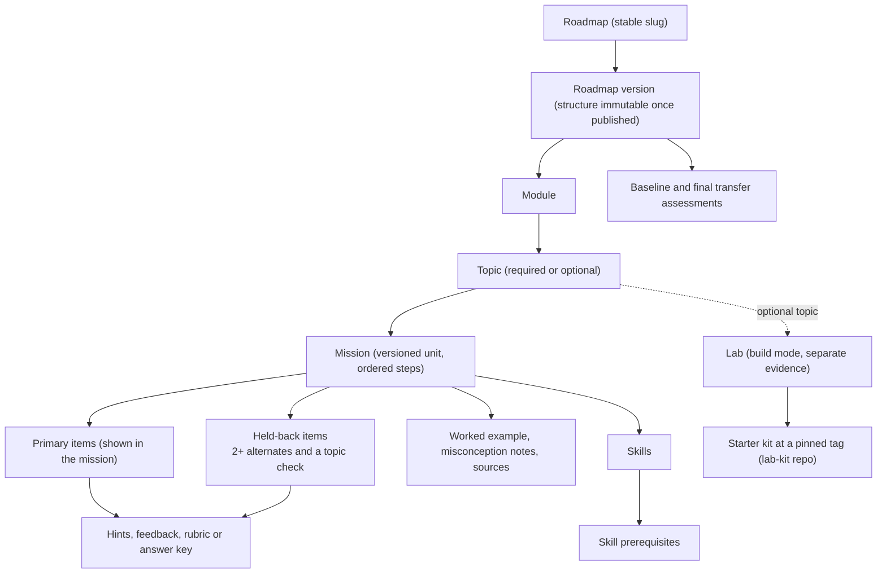
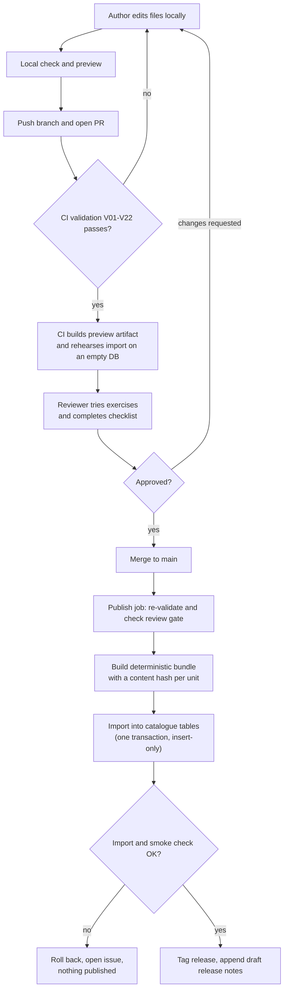
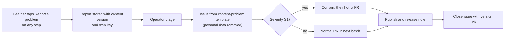

# 06 · Content system

Status: **Proposal — for discussion.** Planning only. No tooling, schema or
content has been built.

## Purpose

This doc covers how DevStep content is authored, reviewed, versioned, published
into the read-only `catalogue` and retired (PRD F11). The process is designed so
that one part-time founder and one part-time reviewer can produce and maintain
the 18-mission, 6-lab path without paying for a CMS.

## Summary

- **Proposal:** content is stored as Markdown and YAML files in a private Git
  repository. It is reviewed through pull requests (PRs) and published by CI
  into the `catalogue` tables. The MVP has no CMS and no admin UI.
- **Proposal:** a versioned unit is one of four things: a mission directory (the
  mission, its assessment items and its assets), a lab, a transfer assessment,
  or the structure of a roadmap version. Published versions never change. Every
  attempt references one (PRD §11).
- **PRD §8:** every mission has a measurable objective, prerequisites, time
  estimates, a worked example, misconception notes, graded items with hints and
  feedback, sources, a stack/version scope, an accessibility review, an author,
  a reviewer and a last-reviewed date. The minimum item pool is the primary
  items, at least 2 held-back alternates and a topic check.
- **Proposal:** CI enforces 22 rules (V01–V22). They cover schema validity,
  unique IDs, prerequisite cycles (§8A), item minimums, feedback, link checks,
  freshness of volatile content, accessibility lint and answer leakage.
- **PRD §8:** a reviewer other than the author tries every exercise before it is
  published. The publish job checks this itself, so the rule holds even without
  a paid Git plan.
- **Proposal:** each unit uses semantic versions: patch, minor or breaking, plus
  a `defect_fix` flag. Only breaking or structural changes create a new roadmap
  version, which in turn triggers an R06 migration offer.
- **Proposal:** retiring a unit stops new use but never deletes it. Old
  attempts, drafts and evidence keep pointing at it (§12).
- **Hypothesis:** the path needs about 425 hours of content work (about 360
  author hours and 65 reviewer hours; range about 270–655). At part-time pace
  this takes far longer than the PRD's 8–11 pre-pilot weeks, so content sets the
  schedule (PRD §14).

## 1. Scope and boundaries

| In this doc | Owned elsewhere |
| --- | --- |
| Content format, repository layout, required metadata | Topics, mission themes, lab kit contents: `07-curriculum-plan.md` |
| Workflow, roles, review checklist, publish pipeline | Columns, constraints and retention of catalogue tables: `04-data-model.md` |
| Automated validation rules | Evidence, completion, migration and review-scheduling rules: `05-learning-engine.md` |
| Version classes and which changes need a new roadmap version | Stack, CI host, where the import job runs: `01-tech-stack-and-hosting.md`, `02-system-architecture.md` |
| Content operations, AI drafting policy, content effort | Report, release-note and retired-content screens: `08-ux-and-screens.md`; schedule: `12-delivery-plan.md` |

## 2. Decision: where content lives

### Options compared

| Criterion | A. Files in Git, PR review, CI publish | B. Admin UI inside the app | C. Headless CMS (hosted or self-hosted) |
| --- | --- | --- | --- |
| Extra money | Git host and CI free tiers (limits unverified). Required-review enforcement on private repos may need a paid plan (unverified). §7.3 covers how to avoid needing it. | None, but costs weeks of build time | Hosted: subscription or a limited free tier (unverified). Self-hosted: one more service to run, back up and patch. |
| Review workflow | Mature: diffs, line comments, approvals, PR templates | Has to be built: states, comments, diffs, roles | Depends on vendor and plan (unverified); diffs of structured fields are often weaker |
| History and audit | Full per-line history at no cost; each version carries a commit SHA | Audit tables have to be built | Vendor revision history (unverified) |
| Ease for one technical person | High: any editor, search-and-replace across files, works offline | Comfortable to use, but building it delays the pilot | Medium: content types are modelled in the vendor UI, outside the codebase |
| Preview | Needs a small local or CI preview (§12) | Real player preview comes naturally | Needs a preview integration |
| Custom checks (cycles, leakage, links) | Any check can block a merge | Custom app code | Webhooks or custom code; harder to block a publish |
| Non-technical authors | Weak: Markdown, YAML and Git | Strong | Strong |
| Portability and lock-in | Plain text, fully portable | Tied to the app | Export needed |
| Concierge trial (before the app exists) | The same files and preview can be used by hand | Not available yet | Possible, but adds setup |

### Recommendation

**Proposal: option A for the MVP.** The author and reviewer are both technical
(conventions: Actors), there is no budget for another service, and the PRD's
gates all map onto existing Git and CI features: review, sources, versions, an
audit trail and rejecting prerequisite cycles before publication. Option A also
works for the concierge trial before any app code exists.

Honest costs of option A:

| Cost | Mitigation |
| --- | --- |
| YAML mistakes and Git friction | JSON Schemas give editor hints and clear CI errors. The Git host's web editor is enough for small fixes. |
| No WYSIWYG preview at first | A static preview build (§12). The real player can be used locally once it exists. |
| Publishing needs an import step and deploy credentials | Reuse the deploy pipeline (Open question 2). The import is idempotent and runs in one transaction. |
| Answer keys would leak from a public repo | Keep content private. Lab kits, which contain no answer keys, can be public (Open question 6). |

Revisit if: more than one non-technical author joins, subject experts need to
edit inside the app, or the catalogue grows past what one person can navigate
as files. A later admin UI should write the **same schema** and run the **same
validator**, so the file format remains the contract.

## 3. Content hierarchy



- **PRD §8A:** in the pilot, each of the 18 required topics has one core
  mission. The format allows several missions per topic.
- **Proposal:** each lab is attached to its module as an **optional topic**.
  This keeps labs out of the progress denominator (§8A) and records them
  separately (R04).
- **Proposal:** item roles are `primary` (shown inside the mission),
  `alternate` (held back for later review), `topic_check` (held back for topic
  completion; challenge-out is assembled from held-back items), `baseline`,
  `final_transfer` and `diagnostic` (F01 onboarding, which may reuse the
  format). Which held-back item is used when is a `05-learning-engine.md` rule.
  This doc only guarantees the minimum pool.
- **Proposal:** the API never sends held-back items, answer keys or feedback to
  the client before an attempt is submitted. Content-side checks for leakage
  are useless without this. The requirement is handed to
  `02-system-architecture.md`.

## 4. Repository layout and identifiers

```text
content/                                 # private repo (Open question 1)
├── schemas/                             # JSON Schema per file kind
│   ├── mission.schema.json
│   ├── assessment-item.schema.json
│   ├── lab.schema.json
│   ├── transfer-assessment.schema.json
│   ├── roadmap-version.schema.json
│   └── skills.schema.json
├── skills/
│   └── skills.yaml                      # skills and skill prerequisites
├── roadmaps/
│   └── crud-to-reliable/
│       ├── roadmap.yaml                 # slug, title, outcome (display)
│       └── versions/
│           ├── v1.yaml                  # structure immutable once published
│           └── v2.yaml
├── missions/
│   └── m-query-plans/                   # directory name = mission ID
│       ├── mission.md                   # front matter + step bodies
│       ├── items/
│       │   ├── primary-1.yaml
│       │   ├── primary-2.yaml
│       │   ├── alt-1.yaml               # held back
│       │   ├── alt-2.yaml               # held back
│       │   └── check-1.yaml             # held back, topic check
│       └── assets/                      # images with alt text, text plans
├── labs/
│   └── lab-perf-experiment/
│       ├── lab.yaml
│       └── tasks/                       # 01-reproduce.md, 02-change.md, ...
├── assessments/
│   ├── rubric-transfer.yaml             # shared by baseline and final
│   ├── ta-baseline/                     # assessment.yaml + items/
│   └── ta-final/
└── release-notes/
    └── 2026-11.md                       # learner-facing, per month
.github/                                 # or the Git host's equivalent
├── pull_request_template.md             # review checklist (§7.3)
├── ISSUE_TEMPLATE/content-problem.yml   # problem reports (§11.2)
└── workflows/                           # validate, preview, publish, scheduled
```

The validator and preview tools are engineering code. They live with the app's
tooling, in the language chosen by `01-tech-stack-and-hosting.md`, and are not
stored under `content/`. Lab starter kits live in a separate lab-kit repository
that learners can download (Open question 6), and their contents belong to
`07-curriculum-plan.md`.

**Identifier rules (Proposal).** IDs are lowercase ASCII and stay stable across
versions. An ID never encodes order or position, because order lives in
manifests. An ID is never reused, even after retirement. Published units are
never deleted from the repository. They are retired instead, so uniqueness
checks always see them.

| Unit | Pattern | Example | Note |
| --- | --- | --- | --- |
| Roadmap | slug | `crud-to-reliable` | |
| Roadmap version | `v` + integer | `v1` | Pinned by enrolment (R01) |
| Module | `mod-<slug>` | `mod-investigate-performance` | |
| Topic | `t-<slug>` | `t-query-plans` | Stable across roadmap versions so that R06 can map credit; **a new meaning gets a new ID** |
| Mission | `m-<slug>` | `m-query-plans` | |
| Assessment item | `<mission>/<key>` | `m-query-plans/alt-1` | Stable across mission versions |
| Lab | `lab-<slug>` | `lab-perf-experiment` | |
| Skill | `sk-<slug>` | `sk-read-query-plan` | |
| Misconception | `mc-<slug>` | `mc-scale-out-first` | Unique across the repo |
| Transfer assessment | `ta-<form>` | `ta-baseline`, `ta-final` | |

## 5. Required metadata

### 5.1 Per mission

| Field | Purpose | Source |
| --- | --- | --- |
| `id`, `version`, `status`, `change_class` | Identity, versioning, workflow | F11, Proposal |
| `objective` | One observable outcome ("Given…, choose/explain/identify…") | PRD §8 |
| `prerequisites` (missions, skills) | Readiness and prerequisite explanations | PRD §8, §8A |
| `skills` | Which skills the evidence attaches to | PRD §9 |
| `time_estimate_minutes` per supported mode (`small`, `practise`) | Today time label; never a countdown | PRD §5, §8 |
| `steps` and a curated `small_variant` | Step-by-step player; a curated 3-minute equivalent rather than a truncated lesson | PRD §9, §10 |
| Worked example (body section) | Support after errors or heavy assistance | PRD §8, §9 |
| Misconception notes (body, with `mc-` IDs) | Linked from wrong-answer feedback | PRD §8 |
| Item references: primary, alternates, topic check | Graded prompts, at least 2 alternates | PRD §8, §8A |
| `sources[]`: `url`, `title`, `supports`, `accessed`, `verified_by` | Each source is tied to the claim it supports | PRD §8, F11 |
| `stack_scope`: portable concept flag plus tech and version range | States which versions the examples are correct for | PRD §8 |
| `volatility`, `volatility_watch[]` | Drives review cadence (§11.1) | Proposal |
| `accessibility`: reviewer and date | Accessibility review recorded | PRD §8, §10 |
| `author` | Accountability | F11 |
| `review`: `reviewer`, `last_reviewed`, `tried_exercise`, `tried_minutes` | Reviewer is not the author, tried the exercise, and time is calibrated | PRD §8, F11 |
| `ai_assisted`: used flag and which parts | Audit trail for AI drafting (§13) | PRD §14, Proposal |

### 5.2 Per assessment item

`id`, `role`, `type` (`single_choice`, `multi_select`, `ordering`, `numeric`,
`self_check`), `evidence_basis` (`auto_scored` or `self_assessed`), `skills`,
`scenario`, `prompt`, an answer key or a rubric with an exemplar, feedback (for
a correct answer, for each wrong option, or after a self-check), graduated
`hints`, a `reveal` explanation, `misconception` links, and
`time_estimate_minutes`. Held-back items also carry `changed_conditions_of`,
which names the primary item they vary and feeds the leakage check. Items never
have a time-limit field (PRD §5: no countdowns).

### 5.3 Per lab

Identity, workflow and review fields as for missions, plus:
- the `objective`;
- `mode: build` and a time estimate of 30–45 minutes;
- `starter_kit`: repository, immutable tag, path, archive checksum, supported
  environments and setup-check command;
- `synthetic_data`: generator, seed, scale, and `contains_personal_data: false`;
- ordered `tasks` and checkpoints;
- `local_checks`, which run on the learner's machine only;
- a `rubric` with an exemplar;
- `evidence.basis: learner_submitted` (PRD §9: not a verified credential);
- a `no_setup_fallback`, labelled as different evidence (PRD §16);
- `review.ran_end_to_end` and `review.clean_machine`.

### 5.4 Per transfer assessment

`form` (`baseline` or `final`), `rubric` (the same shared rubric for both forms,
PRD §13), items, scoring guidance, time estimate, and a note on comparability.
Its items are never used in missions or reviews.

### 5.5 Per roadmap version

Roadmap slug, version number, `change_class` against the previous version,
outcome, modules in order, and topics. Each topic records its kind
(`required` or `optional`), its prerequisites, its missions or lab pinned by
**major version**, and a completion rule (an identifier defined in
`05-learning-engine.md`). The version also records its transfer assessments and
its display text: titles, descriptions and effort estimates.

## 6. Illustrative files

> **Illustrative only.** Field names show what must be captured, not a final
> schema. Mission themes come from PRD §8; `07-curriculum-plan.md` owns the real
> ones.

### 6.1 Mission (`missions/m-query-plans/mission.md`)

```markdown
---
id: m-query-plans
kind: mission
version: 1.1.0
change_class: minor              # patch | minor | breaking | defect_fix
status: in_review                # draft | in_review | published | retired
title: Read a query plan before adding servers
objective: >-
  Given a query plan for a slow list endpoint, identify the step that
  dominates cost and choose one experiment that tests it.
skills: [sk-read-query-plan]
prerequisites: { missions: [m-latency-evidence], skills: [sk-latency-evidence] }
time_estimate_minutes: { practise: 10, small: 3 }
steps:                           # body H2 headings, in this order
  - { key: scenario, kind: scenario }
  - { key: first-move, kind: response, item: m-query-plans/primary-1 }
  - { key: worked-example, kind: explanation }
  - { key: read-the-plan, kind: response, item: m-query-plans/primary-2 }
small_variant:                   # curated equivalent (PRD §9)
  steps: [scenario-short, first-move]
held_back:                       # never shown inside the mission
  alternates: [m-query-plans/alt-1, m-query-plans/alt-2]
  topic_check: [m-query-plans/check-1]
misconceptions: [mc-scale-out-first, mc-index-always-helps]
stack_scope:
  portable_concept: true
  examples: [{ tech: postgresql, versions: "pinned when authored" }]
volatility: volatile
volatility_watch: ["PostgreSQL major release (EXPLAIN output)"]
sources:
  - url: https://www.postgresql.org/docs/current/using-explain.html
    title: "PostgreSQL documentation: Using EXPLAIN"
    supports: "Reading plan nodes; estimated versus actual rows"
    accessed: 2026-10-05
    verified_by: author          # a human opened it (§13)
    pin_note: "Swap /current/ for the pinned version path"
accessibility: { reviewed_by: reviewer-a, reviewed_on: 2026-10-20 }
author: founder
review:
  reviewer: reviewer-a
  last_reviewed: 2026-10-20
  tried_exercise: true
  tried_minutes: 12
ai_assisted: { used: true, parts: ["distractor ideas for primary-2"] }
---

## Scenario
The work-order dashboard takes about four seconds to list open orders…

## Scenario (short)
One-paragraph version for the 3-minute mode…

## First move
(The player renders item primary-1 here.)

## Worked example
A small plan, read node by node, with text output rather than an image…

## Read the plan
(The player renders item primary-2 here.)

## Misconceptions
- **mc-scale-out-first**: "Add servers first." More app servers do not
  reduce the rows the database reads per query…
- **mc-index-always-helps**: …
```

### 6.2 Assessment items: a primary and a held-back alternate with a rubric

```yaml
# missions/m-query-plans/items/primary-2.yaml
id: m-query-plans/primary-2
role: primary                    # primary | alternate | topic_check | ...
type: single_choice
evidence_basis: auto_scored
skills: [sk-read-query-plan]
time_estimate_minutes: 2
scenario: |
  The open-orders query filters by site and status, sorts by created
  date and returns 25 rows. The plan (assets/plan-a.txt) shows a
  sequential scan reading about 400,000 synthetic rows.
prompt: Which experiment would you run first?
options:
  - key: a
    text: Add a second application server and measure again.
    misconception: mc-scale-out-first
    feedback: >-
      The plan shows the database reading far more rows than it
      returns. A second app server does not change that work.
  - key: b
    correct: true
    text: Try an index matching the filter and sort, then compare plans.
    feedback: >-
      Yes. The cost is in rows read, and comparing before and after
      plans on the same seeded data tests that directly.
  - key: c
    text: Cache the whole page for every user.
    misconception: mc-cache-hides-cause
    feedback: >-
      Caching can hide the symptom without explaining it, and a shared
      page cache risks showing one site's orders to another.
hints:                           # graduated; the last stops short of the answer
  - Compare rows read with rows returned.
  - Which plan node reads most of those rows?
reveal: >-
  The sequential scan dominates. An index matching filter and sort lets
  the database stop early. A reveal never counts as demonstration.
---
# missions/m-query-plans/items/alt-1.yaml (held back)
id: m-query-plans/alt-1
role: alternate
type: self_check                 # open-ended; evidence labelled self-assessed
evidence_basis: self_assessed
changed_conditions_of: m-query-plans/primary-2
skills: [sk-read-query-plan]
time_estimate_minutes: 3
scenario: |
  A monthly report query already uses an index, yet its plan shows a
  nested loop executed 12,000 times on synthetic data.
prompt: In two or three sentences, say what you would check next and why.
rubric:
  - { id: names-evidence, text: "Points to a specific plan figure." }
  - { id: proposes-test, text: "Proposes one experiment that could disprove the guess." }
  - { id: states-limit, text: "States one assumption or limitation." }
exemplar: >-
  The loop count, not the index, dominates…
feedback:
  after_self_check: >-
    If you ticked fewer than two criteria, compare your answer with the
    exemplar's first sentence: it names a number from the plan.
hints:
  - Look at how many times each node ran, not only its cost.
```

### 6.3 Lab definition (`labs/lab-perf-experiment/lab.yaml`)

```yaml
id: lab-perf-experiment
kind: lab
version: 1.0.0
status: draft
title: Before-and-after query experiment
objective: >-
  Reproduce a slow query on seeded data, change one thing, and record
  before and after plans and timings with one stated limitation.
mode: build
time_estimate_minutes: 45
prerequisites: { missions: [m-query-plans, m-indexes-pagination] }
skills: [sk-read-query-plan, sk-design-experiment]
starter_kit:
  repository: devstep-labs              # learner-downloadable, no answer keys
  ref: lab-perf-experiment-v1.0.0       # immutable tag
  path: perf-experiment/
  archive_sha256: "<written by CI>"
  supported_environments: ["pinned when authored"]
  setup_check: "./devstep check-setup"  # command shape decided in 07
synthetic_data:
  generator: seed/generate              # inside the kit
  seed: 20261005
  scale: { sites: 40, work_orders: 400000 }
  contains_personal_data: false
tasks: [tasks/01-reproduce.md, tasks/02-change-one-thing.md, tasks/03-record.md]
local_checks:                           # run on the learner's machine only
  - { id: plan-before-captured, describes: "A before plan exists from the seeded DB." }
  - { id: same-dataset, describes: "Both runs used the same seed and scale." }
  - { id: result-recorded, describes: "The record names the change and one limitation." }
rubric:
  - { id: reproducible, levels: [not_yet, meets], text: "Another developer could rerun it." }
  - { id: one-variable, levels: [not_yet, meets], text: "Only one thing changed between runs." }
  - { id: limitations, levels: [not_yet, meets], text: "States what the result does not show." }
evidence: { basis: learner_submitted, submit: [decision_record, check_summary] }
no_setup_fallback: { mission: m-perf-experiment-scenario }   # labelled differently
sources: [ … ]
review: { reviewer: reviewer-a, ran_end_to_end: true, clean_machine: true, minutes: 50 }
```

### 6.4 Roadmap version manifest (`roadmaps/crud-to-reliable/versions/v1.yaml`)

```yaml
roadmap: crud-to-reliable
version: 1
change_class: initial                 # initial | additive | structural
status: in_review
outcome: >-
  Reason about performance, caching, background work, reliability and
  architecture choices for an application you already understand.
modules:
  - id: mod-understand-system
    title: Understand a system
    topics:
      - id: t-request-path
        kind: required
        missions: [{ id: m-request-path, major: 1 }]
        prerequisites: []
        completion: { rule: attempt_feedback_topic_check }   # rule IDs: 05
      - id: t-requirements-constraints
        kind: required
        missions: [{ id: m-requirements-constraints, major: 1 }]
        prerequisites: [t-request-path]
        completion: { rule: attempt_feedback_topic_check }
      - id: t-lab-architecture-notes
        kind: optional                # labs never enter the denominator
        lab: { id: lab-annotated-architecture, major: 1 }
        prerequisites: [t-request-path]
        completion: { rule: lab_evidence_submitted }
  - id: mod-investigate-performance
    title: Investigate performance
    topics:
      - id: t-query-plans
        kind: required
        missions: [{ id: m-query-plans, major: 1 }]
        prerequisites: [t-latency-evidence]
        completion: { rule: attempt_feedback_topic_check }
        challenge_out: allowed        # R03; composition rule in 05
      # …
transfer_assessments:
  baseline: { id: ta-baseline, major: 1 }
  final: { id: ta-final, major: 1 }
roadmap_completion: { rule: all_required_topics_complete }   # §8A
display:                              # may be patched in place (§10.2)
  estimated_effort: "About six weeks at the default pace"
```

## 7. Workflow and roles

### 7.1 States (content status enum)


| Rule | Detail |
| --- | --- |
| Where states live | `draft` and `in_review` exist only in the repository. The `catalogue` only ever receives `published` and `retired` versions. **Proposal** |
| Drafts on the main branch | Allowed with `status: draft`, so long-lived branches are not needed. The publish job ignores them. |
| Editing published content | Creates a new version in `draft`. The old version stays `published` and referenced until the new one publishes. After that it is *superseded*: still `published`, but no longer served to new sessions. Whether a "current version" pointer is needed is decided in `04-data-model.md`. |
| Deleting | Only drafts that were never published may be deleted. |

### 7.2 Roles

| Activity | Author | Reviewer | Operator |
| --- | --- | --- | --- |
| Draft and edit units, run local check and preview | Does | Suggests changes | — |
| Open the PR and declare change class and AI use | Does | — | — |
| Try every new or changed exercise, and run labs end to end | — | **Does (mandatory)** | — |
| Approve publication | Never for their own work | Does | — |
| Merge, then monitor publish and import | May merge after approval | — | Owns the pipeline |
| Retire a unit | Proposes | Reviews (after the fact in an emergency, §11.3) | Executes |
| Triage problem reports and release notes | Fixes | Reviews fixes | Triages and publishes notes |
| Scheduled review (§11.1) | Updates | Re-tries volatile units | Schedules and tracks |

**PRD / Proposal:** at first the founder is both author and operator. The
reviewer must be a different person. If there is no reviewer, nothing can be
published, and that is intentional (PRD §8, §14: recruit a reviewer early).

### 7.3 PR review checklist (the `pull_request_template.md` content)

| # | Check | Who | Basis |
| --- | --- | --- | --- |
| 1 | Change class declared and version bumped to match (§10) | Author | Proposal |
| 2 | Local check passes; preview viewed at phone width | Author | PRD §10 |
| 3 | I opened every source myself and it supports the stated claim | Author | PRD §8, §14 |
| 4 | AI assistance declared (none, or which parts) | Author | §13 |
| 5 | Learner-facing note written, or "none" | Author | §11.4 |
| 6 | **I attempted every new or changed item before reading its answer or feedback. Minutes taken: __** | Reviewer | PRD §8 |
| 7 | Labs: from a clean checkout at the pinned tag, the setup check passes; local checks pass for a correct solution and fail for a plausible wrong one | Reviewer | PRD F07 |
| 8 | The objective is measurable and the items test that objective, not something else | Reviewer | PRD §8 |
| 9 | Held-back items change the conditions and cannot be answered from primary items' feedback, hints or reveal | Reviewer | PRD §9 |
| 10 | Each wrong option's feedback explains *why* and links a misconception; hints are graduated | Reviewer | PRD §8 |
| 11 | Version-specific claims match `stack_scope` | Reviewer | PRD §8 |
| 12 | Accessible at phone width: meaningful alt text, no colour-only meaning, readable code | Reviewer | PRD §10 |
| 13 | No fear framing, no rewards for needless complexity, synthetic data only, no secrets or employer code | Reviewer | PRD §1, §11 |
| 14 | Breaking or structural change: roadmap-version impact noted | Reviewer | PRD R06 |

**Enforcement (Proposal).** The reviewer commits the `review:` block (reviewer
name, date, `tried_exercise`, minutes) in the PR. On the main branch, the
publish job checks four things before importing anything: the merged PR has an
approval from someone listed in a reviewers file; that approver is not the
unit's author; the `review:` block names the same person; and checklist items
6–14 are ticked. If any check fails, nothing is published. This works without
branch-protection features that may need a paid plan for private repositories
(unverified). If a reviewer's minutes are more than 1.5 times the estimate, the
PR is flagged so the estimate can be recalibrated.

## 8. Publish pipeline



### 8.1 What publish writes (catalogue tables owned by `04-data-model.md`)

| Source | Catalogue tables | Note |
| --- | --- | --- |
| `skills/skills.yaml` | `skills`, `skill_prerequisites` | Cycles rejected (V04) |
| `roadmaps/<slug>/roadmap.yaml` | `roadmaps` | Stable slug |
| `roadmaps/<slug>/versions/vN.yaml` | `roadmap_versions`, `roadmap_modules`, `roadmap_topics`, `topic_dependencies`, `topic_completion_rules` | Structure written once; later only status and display text change |
| `missions/<id>/mission.md` | `content_versions`, `missions` | One `content_versions` row per published version |
| `missions/<id>/items/*.yaml` | `assessment_items` | Rows belong to the mission's content version; item IDs stay stable |
| `labs/<id>/lab.yaml` and task files | `content_versions`, `labs` | The kit stays in the lab-kit repository |
| `assessments/` | `content_versions`, `assessment_items` | Roles `baseline` and `final_transfer`; `04-data-model.md` decides whether a grouping record is needed |

Each published version must carry the following, with column names left to
`04-data-model.md`:
- unit kind, ID, semantic version and change class;
- a learner-facing content hash (which excludes review metadata);
- the source commit SHA;
- author, reviewer, last-reviewed date and "tried" flag;
- published-at time and status;
- retirement reason and replacement, when retired.

This gives a full audit chain: attempt → content version → commit → PR →
review.

### 8.2 Publish rules (Proposal)

| Rule | Behaviour |
| --- | --- |
| Idempotent | Re-importing the same bundle changes nothing. The key is unit ID, version and hash. |
| Immutable | If an existing ID and version arrive with a different hash, the whole import is aborted (V17). |
| Atomic | One transaction per bundle. A failure leaves the catalogue exactly as it was. |
| Rehearsed | Every PR imports into a throwaway database inside CI, so import errors surface before merge, at no hosting cost. |
| Who runs it | An import command run by the deploy pipeline, so there is no new admin endpoint (Open question 2). |
| Smoke check | After import, read `GET /v1/roadmaps/{slug}` and one changed mission through the API. |
| Drafts | Never imported into production. |

### 8.3 Retirement without erasing evidence (PRD §12)

- Retiring is a PR that sets `status: retired`, `retired_reason`, and an
  optional `replaced_by`. The import changes only the status fields. Rows are
  never deleted.
- Attempts, `session_drafts`, `skill_evidence` and `artifacts` keep referencing
  the retired version. The Evidence view shows it with a "retired" label and the
  reason (`08-ux-and-screens.md`).
- A retired unit is not offered to new sessions or new review scheduling. How
  queued reviews are replaced is decided in `05-learning-engine.md`.
- You cannot retire a unit that a non-retired roadmap version still uses unless
  you give a compatible `replaced_by`, which keeps the same objective, or
  publish a new roadmap version (V22).
- Retiring a roadmap version closes it to new enrolments. Existing enrolments
  continue until they migrate (R06, `05-learning-engine.md`).

## 9. Automated validation

`block` fails both the PR and the publish job. `warn` adds an annotation for the
reviewer to judge. All thresholds are **hypotheses** to tune after the first
module.

| ID | Rule | How | Level |
| --- | --- | --- | --- |
| V01 | Schema validity | Every file validates against its JSON Schema; unknown fields are rejected | block |
| V02 | Unique, stable IDs | Unique across the repo, retired units included; pattern matches §4; directory name equals ID | block |
| V03 | References resolve | Missions, items, skills, labs, topics, misconceptions, assets and step headings all exist | block |
| V04 | Prerequisite cycles (§8A) | Topological sort of `topic_dependencies` per roadmap version and of `skill_prerequisites`; the error prints the cycle | block |
| V05 | Reachability | A required topic may not depend on an optional topic; every required topic can be reached | block |
| V06 | Item minimums (§8) | Each mission has at least 1 primary, at least 2 alternates and at least 1 topic check; held-back items are not referenced by any step | block |
| V07 | Feedback on every item | Choice items have feedback for the correct answer and each wrong option; self-check items have a rubric, exemplar and post-check feedback | block |
| V08 | Hints | Primary and topic-check items have at least 1 hint; no hint contains the correct option's text | block |
| V09 | Sources present | Each mission and lab has at least 1 HTTPS source with `url`, `title`, `supports`, `accessed` and `verified_by` | block |
| V10 | Links reachable | Link check on changed files in PRs and on all files weekly; 404/410 blocks publication; timeouts are retried, then warn | block / warn |
| V11 | Freshness | `last_reviewed` within 90 days for `volatile` units and 365 days for `stable` units at publish time; a weekly report lists units due within 30 days | block |
| V12 | Accessibility lint | Images need alt text (not the filename); data figures need a text equivalent; colour words in instructions ("in red", "the green") are flagged; heading order, table headers and descriptive link text are checked | block / warn |
| V13 | Mobile code blocks | Lines over 60 characters or blocks over 25 lines are flagged for a phone preview check (rendering belongs to `08-ux-and-screens.md`) | warn |
| V14 | Time estimates | Present for every supported mode and every item. Bounds: `small` ≤ 4 min, `practise` ≤ 12 min, `build` 30–45 min | block / warn |
| V15 | No answer leakage | Held-back items share no correct-answer text with primary items, hints, worked example or reveal; word 5-gram overlap between any two items in a mission warns above 30% and blocks above 60% | block / warn |
| V16 | Required metadata | `published` units need author, a reviewer who is not the author, `last_reviewed`, `tried_exercise: true`, accessibility review, stack scope and version | block |
| V17 | Version discipline | A diff that touches the objective, answer key, rubric, scoring, prerequisites or skills needs a major bump unless `defect_fix`; a published ID and version cannot change hash | block |
| V18 | Manifest discipline | A published roadmap version may change only status and `display`; a new version's `change_class` must match its diff against the previous version (§10.2) | block |
| V19 | Lab completeness | Kit pinned to a tag and checksum; synthetic data declared with no personal data; setup check, at least 1 local check, rubric and no-setup fallback present | block |
| V20 | Transfer assessments | Baseline and final are distinct, share the same rubric, and reuse no items or text from missions | block |
| V21 | Hygiene | Secret-pattern scan, no real email addresses or personal data, image size at most 200 KB (supports the PRD §12 load budget) | block / warn |
| V22 | Legal transitions | Only §7.1 transitions; `retired` needs a reason; retirement follows the §8.3 rule | block |
| — | Measurable objective | The objective starts with an observable verb from an allow-list; "understand", "know" and "learn about" are flagged | warn (part of V16) |

V15 is a heuristic. Item 9 of the reviewer checklist remains the real control.

## 10. Versioning semantics

### 10.1 Unit versions (missions, labs, transfer assessments)

**Proposal:** a session pins the content version it started on, and drafts
carry that version. `05-learning-engine.md` and `04-data-model.md` confirm the
mechanics. "Compatible" evidence means the same unit ID and the same **major**
version. This is how this doc makes PRD §8A's "objectives and assessment
versions are compatible" concrete.

| Class | Examples | Bump | Learner mid-mission | Existing evidence | New roadmap version? |
| --- | --- | --- | --- | --- | --- |
| Patch | Typo, clearer wording with the same meaning, replacing a dead link with an equivalent source, better alt text, re-certification after review | `x.y.Z` | The open session stays on its version; the next session gets the new one | Fully valid | No |
| Minor | New hint, new alternate or held-back item, new worked example or misconception note, better feedback, time-estimate change | `x.Y.0` | As for patch; new items become eligible for future reviews | Fully valid | No |
| Defect fix | The answer key or feedback was wrong *against the unchanged objective*; the lab check accepted a wrong solution | Patch or minor with `defect_fix: true` | Neutral notice at the next step boundary, then continue on the fixed version with the draft kept | Kept and annotated. **Proposal:** schedule a fresh alternate check. Final rule in `05-learning-engine.md` (Open question 7) | No |
| Breaking | Objective changes; what an item assesses changes (rubric criteria, scoring, scenario logic); prerequisites or skill mapping change; a new stack version changes correct answers; an item drops below the minimum set | `X.0.0` | Open sessions finish on the old major | Stays attached to the old major; reuse needs compatibility or challenge-out (§8A) | **Yes**, if any non-retired roadmap version uses the unit |
| Retirement | Unit withdrawn | Status only | See §8.3 | Never erased (§12) | Only under the §8.3 rule |

The principle: a fix that brings an item back in line with its stated objective
is not breaking. A change to *what we intend to assess* is breaking.

### 10.2 Roadmap versions (which change triggers what)

Roadmap manifests pin missions by **major** version. Patch, minor and defect-fix
updates therefore reach enrolled learners without a new roadmap version.

| Change | Result | `change_class` | Migration behaviour (rules in `05-learning-engine.md`) |
| --- | --- | --- | --- |
| Titles, descriptions, effort text in `display` | Patched in place on the same roadmap version | — | None needed |
| Mission or lab patch, minor or defect fix | No new roadmap version | — | None |
| Add an optional topic or lab; add a mission to an optional topic | New `vN` | `additive` | A simple offer; the denominator is unchanged |
| Add or remove a required topic; switch a topic between required and optional | New `vN` | `structural` | Migration summary showing what changed and what credit is kept (R06) |
| Change `topic_dependencies` or a topic completion rule | New `vN` | `structural` | As above |
| A breaking (major) change to a mission used by any topic | New `vN` | `structural` | As above |
| Change of transfer assessment form | New `vN` | `structural` | Affects pilot measurement comparability (`10-measurement-and-validation.md`) |

**PRD R06:** new content may never silently reduce progress. Topic IDs stay
stable across versions so that `05-learning-engine.md` can map credit. A topic
whose meaning changes gets a new ID.

## 11. Content operations

### 11.1 Volatility tagging and review cadence

| Tag | Meaning | Examples | Review cadence (Proposal, PRD §8) |
| --- | --- | --- | --- |
| `volatile` | The content depends on specific versions, CLI output, defaults, vendor features or security advice | Query-plan output, framework queue APIs, all labs (pinned dependencies) | Quarterly, and whenever a `volatility_watch` item has a known breaking change |
| `stable` | The content is concept-level and version-independent | What idempotency means; monolith versus services trade-offs | Yearly |

| Activity | Cadence | Owner | Output |
| --- | --- | --- | --- |
| Link check | Every PR and weekly | Operator | One rolling issue on failure |
| Freshness report | Weekly scheduled CI | Operator | Lists units due within 30 days |
| Quarterly volatile review | Each quarter | Author and reviewer | Re-try, fix, then a patch bump or re-certification |
| Breaking-change watch | When a watched technology releases | Operator opens an issue; author assesses | Units found through `stack_scope` and `volatility_watch`; patch, breaking change or retirement |
| Kit dependency advisories | When the Git host alerts (availability unverified) | Operator | Treated as a breaking-change trigger for that lab |

### 11.2 "Report a problem" loop



- **Proposal:** the in-app form attaches the content version and step key
  automatically. The learner chooses a category (factual error, wrong answer,
  broken link, lab setup, unclear, accessibility, outdated) and can add
  optional text. Reports are stored as `content_reports` (added). Columns and
  retention belong to `04-data-model.md` and `09-security-privacy-ops.md`.
  Report text never enters analytics (F12). Learners never need a Git host
  account. During the concierge trial a prefilled email link is enough
  (Open question 8).
- The issue template has these fields: unit ID and version, step, category,
  severity, evidence or source, and reproduction steps for labs.

| Severity | Examples | Target (Proposal; pilot hypothesis) |
| --- | --- | --- |
| S1 | Wrong answer key; insecure or harmful advice; a lab check that passes a wrong solution or damages a machine; an accessibility blocker | Triage within 1 working day; contain within 2 |
| S2 | Broken link, lab setup broken on a supported environment, misleading wording, outdated for the pinned version | Next weekly batch |
| S3 | Typo, style, suggestion | Monthly batch |

### 11.3 Hotfix path

1. Label the issue `s1`.
2. **Contain (operator):** if a reviewed fix cannot ship within the target,
   retire the faulty item through a retire-only PR. Retiring adds no new
   unreviewed content, so the review may happen afterwards. If this leaves a
   mission below the V06 minimum, retire the mission instead. The topic then
   shows as temporarily unavailable, which must never reduce progress (R06;
   presentation in `05-learning-engine.md` and `08-ux-and-screens.md`).
3. **Fix:** open a `hotfix/<issue>` branch with `change_class: defect_fix`.
   Every check runs; none can be skipped.
4. **Expedited review:** the reviewer re-tries the changed items only.
5. **Publish and tell learners:** add a release note, and notify learners who
   attempted the faulty version (§10.1).
6. **Learn:** if the defect class can be checked automatically, add a
   validation rule or checklist item.

### 11.4 Release notes for learners

- Each PR's learner-facing note is collected by the publish job into
  `release-notes/YYYY-MM.md`. The operator edits it before release.
- Only learner-visible changes are listed, grouped by roadmap, in a neutral
  tone with no urgency. Patch typos are not listed.
- Structural roadmap versions come with the R06 migration summary. Display
  belongs to `08-ux-and-screens.md`.

## 12. Local authoring experience (described, not built)

| Need | Minimal approach (Proposal) |
| --- | --- |
| Editing | Any text editor. The JSON Schemas give autocompletion and inline errors in editors that support YAML schemas. |
| One command for checks | A `content check` command runs the same validator as CI. Offline mode skips the link check; `--changed` limits it to changed units. |
| Preview | A `content preview` command renders selected missions as static HTML in a phone-width frame. It shows one step at a time, and hints, feedback and reveal stay hidden until clicked, so a reviewer can attempt honestly. CI attaches the same preview to each PR as a downloadable artifact, with no hosting cost. |
| Real-player preview | Once the app exists, a local import loads working-tree content, drafts included, into the developer's own database for the real player. Drafts are never imported into production. |
| Labs | Clone the kit at the referenced tag and run the setup check and local checks. Reviewers do the same on a clean machine or container. |
| Stats | A `content stats` command reports item counts per mission, time totals per module, units due for review, and estimate versus reviewer minutes. |
| Optional | A pre-commit hook running `content check --changed`. |

A staging environment with the real player is an optional upgrade, and only
worth it if `01-tech-stack-and-hosting.md` finds one at no extra cost
(Open question 11).

## 13. AI-assisted drafting policy

**PRD §14:** "do not treat lesson generation as a free by-product of AI."
**PRD §11:** do not use employer repositories, secrets or learner data.

| Allowed as a drafting aid | Not allowed |
| --- | --- |
| Brainstorming scenario variations and changed conditions for alternates | Auto-publishing, or any path to `published` without human review |
| Suggesting plausible distractors linked to known misconceptions | Using AI output as a source of facts; every claim needs a human-verified source |
| Rewording for clarity and reading level | Citations generated by AI that no human has opened (`verified_by` must name a person) |
| Draft alt text that the author then checks | Answer keys accepted without the author working the problem |
| Drafting synthetic-data generator ideas | AI acting as the reviewer, or ticking the checklist |
| — | Pasting learner data, report text, employer code or secrets into AI tools |

- AI use is declared in the `ai_assisted` metadata and on the PR. The review
  bar is the same whether or not AI was used.
- Authors must check that generated text does not reproduce third-party
  material.
- The effort model (§14) assumes **no** time saved by AI. Savings must be
  measured before anyone plans around them.

## 14. Content effort model (all figures are hypotheses)

| Work unit | Qty | Author h each (range) | Reviewer h each (range) | Author total | Reviewer total |
| --- | --- | --- | --- | --- | --- |
| Mission core: scenario, explanation, worked example, misconception notes, 1–3 primary items with hints and feedback, small variant, sources, accessibility pass | 18 | 6 (4–9) | — | 108 | — |
| Held-back item (alternate or topic check) with feedback and hints | 54 (18 × 3) | 1 (0.5–1.5) | — | 54 | — |
| Mission review: try every item before reading answers; check sources and accessibility | 18 | — | 1.5 (1–2.5) | — | 27 |
| Rework after review and re-check | 18 | 1.5 (0.5–3) | 0.25 | 27 | 4.5 |
| Shared lab starter project (fictional work-order app, seed generator, setup check) | 1 | 32 (24–48) | 4 (3–6) | 32 | 4 |
| Lab: tasks, checkpoints, synthetic data, local checks, rubric, no-setup fallback, clean-machine test | 6 | 18 (12–28) | 3.5 (2.5–5) | 108 | 21 |
| Shared transfer rubric | 1 | 6 (4–8) | 1.5 (1–2) | 6 | 1.5 |
| Transfer assessment form (baseline, final), including scoring calibration | 2 | 8 (6–12) | 2.5 (2–4) | 16 | 5 |
| Roadmap manifest, skills list, module introductions, completion rules | 1 | 8 (6–12) | 2 (1–3) | 8 | 2 |
| **Total** | | | | **≈ 360 (226–557)** | **≈ 65 (47–99)** |

**Total ≈ 425 hours (range ≈ 270–655).** The pipeline tooling (validator,
preview, import) is engineering effort and is estimated in
`12-delivery-plan.md`. Ongoing work during the pilot is estimated at 2–4 author
hours and about 1 reviewer hour per week, plus about 15 hours per quarter for
the volatile review (hypothesis). Reviewer cost is these hours times a rate that
has not been checked; get quotes first (PRD §14).

| Founder content hours per week | Weeks for ≈ 360 author hours |
| --- | --- |
| 10 | 36 |
| 15 | 24 |
| 20 | 18 |

**Content is the likely critical path.** The PRD's pre-pilot phases add up to
8–11 weeks (discovery 1–2, concierge 2, alpha 3–4, readiness 2–3), and pilot
readiness requires "six modules reviewed" (PRD §14). The same part-time person
also builds the app. Levers that stay within the PRD:

1. Start authoring module 1 and lab 1 during discovery. The concierge trial
   needs them anyway (PRD §14).
2. **Calibrate after module 1.** Compare actual hours with this model; if they
   exceed it by more than 1.3 times, re-plan before writing module 2.
3. Author held-back items at the minimum (2 alternates and 1 topic check). Add
   more only where pilot data shows failure or exhaustion.
4. Reuse one starter project across all six labs (already assumed above).
5. Recruit and book the reviewer early, so review does not queue behind
   authoring.
6. If still short: bring in a second author for labs, or use a rolling module
   release. A rolling release changes a PRD exit condition, so it is
   Open question 5.

## 15. Risks

| Risk | Mitigation |
| --- | --- |
| Effort overrun delays the pilot | Calibrate after module 1 (§14); keep scope to PRD §8 |
| Reviewer unavailable, so nothing publishes | Recruit early; book review windows; containment by retirement only (§11.3) |
| Answer leakage through repo, API or similar items | Private repo; API withholds keys (§3); V15 plus checklist item 9 |
| Stale volatile content | Volatility tags, V11, quarterly review, watch list |
| AI-introduced errors or fabricated sources | §13 policy; `verified_by`; V09 and V10 |
| Schema churn early on | Treat schemas as 0.x until module 1 is calibrated; migrate files with scripts |

## Open questions for discussion

1. **Where does `content/` live?** *Recommended default:* a folder in the
   app's private repository, with path-filtered CI. There is one PR flow, and
   the schema and import code change together with the content.
2. **How does publish reach production?** *Recommended default:* an import
   command run by the deploy pipeline after the merge, with no admin endpoint
   and no extra secret. An authenticated import endpoint is the alternative if
   content and app deploys must be fully separate.
3. **How is "reviewer is not the author" enforced on a private repo?**
   *Recommended default:* the publish job's own gate (§7.3), so the free plan
   is enough. Buy a plan only if the gate proves unreliable (plan features
   unverified).
4. **Reviewer recruitment and budget.** *Recommended default:* one paid
   part-time reviewer, booked before discovery ends, for about 65 hours across
   the path plus about 1 hour per week during the pilot. Rate unverified; get
   quotes.
5. **What if content is not ready for the pilot?** *Recommended default:*
   follow PRD §14, with all six modules reviewed before the pilot. If module 1
   overruns by more than 1.3 times, the founder chooses between delaying the
   pilot and a rolling release that stays at least two modules ahead of the
   cohort.
6. **Lab kits in a separate public repository?** *Recommended default:* yes.
   Kits contain no answer keys, and lab evidence is learner-submitted rather
   than a credential, so visible checks are acceptable.
7. **Evidence earned on a defective item.** *Recommended default:* keep the
   evidence and the completion credit (never reduce progress), annotate them,
   and schedule a fresh alternate check. `05-learning-engine.md` confirms.
8. **Problem reports.** *Recommended default:* a prefilled email link during
   the concierge trial, and an in-app form storing `content_reports` (added)
   for the pilot.
9. **Review cadence.** *Recommended default:* 90 days for volatile content,
   365 days for stable content, plus event-driven review on breaking releases.
10. **Minimum held-back pool.** *Recommended default:* 2 alternates and 1 topic
    check per mission for the pilot. Add a third alternate where retention or
    challenge-out exhausts the pool.
11. **Preview fidelity.** *Recommended default:* the static preview as a CI
    artifact. Add a staging environment with the real player only if it costs
    nothing extra.

## PRD traceability

| PRD reference | Covered in |
| --- | --- |
| F11 Content operations (workflow, sources, version, reviewer, last-reviewed) | §2, §5, §7, §8, §9, §11 |
| §8 Mission requirements, item budget, reviewer tries exercises, quarterly review | §5.1, §7.3, §9 (V06, V11), §11.1, §14 |
| §8A Roadmap structure, required/optional, completion rules, cycle rejection, evidence reuse | §3, §6.4, §9 (V04, V05), §10 |
| R01, R03, R04, R06 Pinned versions, challenge-out, optional labs, version stability | §6.4, §8.3, §10.2 |
| F03, F05 Player steps, hints, feedback, alternate prompts | §5.1–5.2, §6.1–6.2 |
| F04, §9 Task version recorded, self-assessed labelling, reveal never demonstrates | §5.2, §6.2, §8.1 |
| F07, §16 Labs: starter files, synthetic data, rubrics, local checks, no-setup fallback | §5.3, §6.3, §9 (V19) |
| §10 Accessibility (mobile code, non-colour cues, no timed answers) | §5.2, §7.3, §9 (V12, V13) |
| §11 Attempts reference exact content versions; no employer code; local labs | §8.1, §10.1, §13 |
| §12 Retired content keeps evidence; obsolete lesson versions | §8.3, §10.1 |
| §13 Transfer assessments with the same rubric; no free text in analytics | §5.4, §9 (V20), §11.2 |
| §14 Content as critical path; recruit reviewer early; AI not free | §13, §14, Open questions 4–5 |
