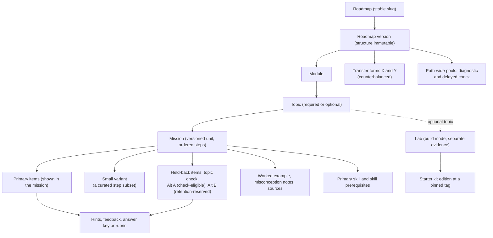
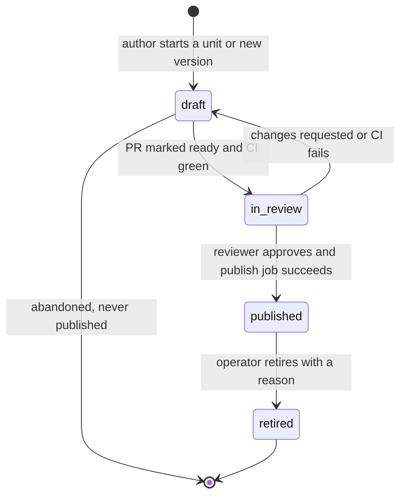
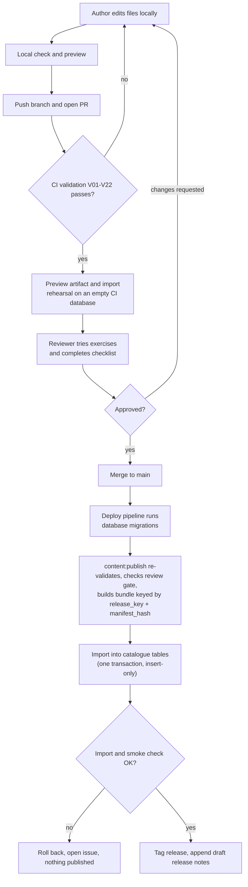
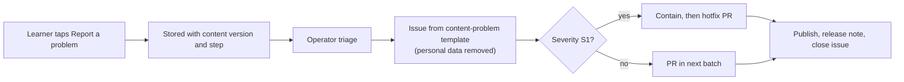

# 06 · Content system

Status: **Proposal — for discussion.** Planning only. No tooling, schema or
content exists yet.

## Purpose

This doc covers how DevStep content is authored, reviewed, versioned, published
into the read-only `catalogue` and retired (PRD F11). It assumes one part-time
founder and one part-time reviewer, and no paid content service.

## Summary

- **Proposal:** content is Markdown and YAML in a private Git repo, reviewed by
  pull request (PR) and published by CI into `catalogue`. No CMS or admin UI.
- **Proposal:** versioned units are mission directories (mission, items,
  assets), labs, transfer assessments and roadmap-version structures. Published
  versions never change, and every attempt references one (PRD §11).
- **PRD §8:** each mission carries all required metadata (§5). Minimum pool:
  the primary items, one curated small variant, and at least 2 held-back
  alternates (Alt A check-eligible, Alt B retention-reserved) plus a topic
  check, so every topic has at least 2 check-eligible items.
- **Proposal:** 22 CI rules block publication, including prerequisite cycles
  (§8A), item minimums, link checks, freshness, accessibility and leakage.
- **PRD §8:** a reviewer other than the author tries every exercise. The publish
  job checks this itself, so no paid Git plan is needed to enforce it.
- **Proposal:** semantic versions `X.Y.Z` (patch, minor, breaking, plus
  `defect_fix`) and a separate objective version (`objective_key`,
  `objective_major`). Only breaking or structural changes create a new roadmap
  version (R06).
- **Proposal:** retiring a unit stops new use but never deletes it. Attempts and
  evidence keep their references (§12).
- **Hypothesis:** about 430 hours of content work before the pilot (≈360
  author, ≈70 reviewer), plus ≈20 reviewer hours and blind transfer scoring
  during the pilot. All six modules are reviewed before the pilot starts, so
  content is the critical path (PRD §14).

## 1. Scope and boundaries

| In this doc | Owned elsewhere |
| --- | --- |
| Content format, repository layout, required metadata | Topics, mission themes, lab kit contents: `07-curriculum-plan.md` |
| Workflow, roles, review checklist, publish pipeline | Columns, constraints and retention of catalogue tables: `04-data-model.md` |
| Validation rules; which changes need a new roadmap version | Evidence, completion, migration and scheduling rules: `05-learning-engine.md` |
| Content operations, AI drafting policy, content effort | Stack, CI host, import location: `01-tech-stack-and-hosting.md`, `02-system-architecture.md`; screens: `08-ux-and-screens.md`; schedule: `12-delivery-plan.md` |

## 2. Decision: where content lives

| Criterion | A. Files in Git, PR review, CI publish | B. Admin UI inside the app | C. Headless CMS (hosted or self-hosted) |
| --- | --- | --- | --- |
| Extra money | Git host and CI free tiers (limits unverified). Enforcing reviews on a private repo may need a paid plan (unverified); §7.3 avoids needing it. | None, but weeks of build time | Hosted: subscription or limited free tier (unverified). Self-hosted: another service to run, back up and patch. |
| Review workflow | Mature: diffs, line comments, approvals, templates | Has to be built | Vendor- and plan-dependent (unverified); weaker diffs of structured fields |
| History and audit | Full per-line history; each version carries a commit SHA | Audit tables have to be built | Vendor revision history (unverified) |
| Ease for one technical person | High: any editor, bulk edits, works offline | Comfortable, but building it delays the pilot | Medium: content model lives in a vendor UI, outside the codebase |
| Preview | Needs a small preview tool (§12) | Natural | Needs an integration |
| Custom blocking checks (cycles, leakage) | Any check can block a merge | Custom code | Webhooks; hard to block a publish |
| Non-technical authors | Weak | Strong | Strong |
| Lock-in | None (plain text) | Tied to the app | Export needed |
| Concierge trial before the app exists | The same files and preview can be used by hand | Not yet available | Possible, but adds setup |

**Recommendation (Proposal): option A for the MVP.** The author and reviewer
are both technical, the budget allows no extra service, and every PRD gate maps
onto existing Git and CI features: review, sources, versions, audit trail and
rejecting cycles before publication.

| Honest cost of option A | Mitigation |
| --- | --- |
| YAML mistakes and Git friction | JSON Schemas give editor hints and clear CI errors; the Git host's web editor covers small fixes |
| No WYSIWYG preview at first | Static preview (§12); the real player locally once it exists |
| Publishing needs an import step and credentials | A deploy-time `content:publish` command after migrations (§8.2); idempotent and atomic, with no admin endpoint |
| A public repo would leak answer keys | Keep content private. Public lab kits hold only planted starter states, checks and templates; answer keys, reference solutions and exemplars stay private (§5.2) |
| Outgrowing files | Revisit if a non-technical author joins or experts must edit in the app; a later admin UI writes the **same schema** and runs the **same validator** |

## 3. Content hierarchy



- **PRD §8A:** in the pilot, each of the 18 required topics has one core
  mission. The format allows several per topic.
- **Proposal:** each lab is its module's **optional topic**: outside the
  progress denominator and recorded separately (R04). Labs never affect
  required progress.
- **Proposal:** item roles are `primary` (shown in the mission), `alternate`
  and `topic_check` (both held back), `diagnostic` (F01), `transfer` and
  `delayed_check` (the path-level pool). Two flags refine held-back items:
  `check_eligible` (every `topic_check`, plus Alt A, at no extra authoring) and
  `retention_reserved` (Alt B, kept unseen for the delayed retention check). An
  item is never both. `05-learning-engine.md` decides which held-back item is
  used when, including challenge-out and the retry after a failed check; this
  doc only guarantees the pool and the flags.
- **Proposal, for `02-system-architecture.md`:** the API never sends held-back
  items, answer keys or feedback to the client before submission.

## 4. Repository layout and identifiers

```text
content/                                 # private repo (Open question 1)
├── schemas/                             # one JSON Schema per file kind
├── skills/skills.yaml                   # skills and skill prerequisites
├── roadmaps/crud-to-reliable/
│   ├── roadmap.yaml                     # slug, title, outcome
│   └── versions/                        # v1.yaml, v2.yaml: structure immutable
├── missions/
│   └── perf.query-plans/                # directory name = mission ID
│       ├── mission.md                   # front matter + step bodies
│       ├── items/                       # primary-1, primary-2 (shown);
│       │                                # check-1, alt-a, alt-b (held back)
│       └── assets/                      # images with alt text, text plans
├── labs/perf.lab-experiment/            # lab.yaml, tasks/*.md, reference/
│                                        # (private: reference states, exemplars)
├── shared/                              # constraint cards, rubric scale
├── assessments/                         # rubric-transfer.yaml (shared),
│   │                                    # crud-to-reliable.transfer-x/, -y/
│   └── pools/                           # diagnostic and delayed-check items
└── release-notes/2026-11.md             # learner-facing, per month
.github/                                 # or the Git host's equivalent:
                                         # pull_request_template.md (§7.3),
                                         # ISSUE_TEMPLATE/content-problem.yml
                                         # (§11.2), workflows/
```

Validator and preview tools are engineering code in the app's language
(`01-tech-stack-and-hosting.md`). Lab starter kits live in a separate,
downloadable repository (contents: `07-curriculum-plan.md`).

**Identifier rules (Proposal).** IDs are dotted, lowercase and stable: one or
more segments joined by `.`, each segment lowercase ASCII letters, digits and
hyphens, starting with a letter. The first segment is the module area used by
skills in `07-curriculum-plan.md` (`sys`, `perf`, `cache`, `async`, `rel`,
`arch`), or the roadmap slug for path-wide units. IDs never encode order (so
not `m2.2`), never change, and are never reused. Kinds are told apart by the
field or directory that holds them, and IDs are unique within a kind
(`04-data-model.md` keys catalogue rows by kind and key). Published units are
retired, never deleted, so uniqueness checks always see them. `07`'s working
labels (M2.2, L2, A0, AF) map onto these IDs.

| Unit | Pattern | Example |
| --- | --- | --- |
| Roadmap / version | slug / `v` + integer | `crud-to-reliable` / `v1` (pinned by enrolment, R01) |
| Module | `<area>` | `perf` |
| Skill, objective | `<area>.<name>` (07's style) | `perf.query-plans`. A mission's `objective_key` defaults to its primary skill ID |
| Topic | `<area>.<name>` | `perf.query-plans`. Stable across roadmap versions so that R06 can map credit; a topic whose meaning changes gets a new ID |
| Mission | `<area>.<name>`; a topic's core mission shares the topic's ID | `perf.query-plans` |
| Item | `<mission>.<key>`; keys `primary-N`, `changed-condition`, `check-N`, `alt-a`, `alt-b`, … | `perf.query-plans.alt-b` |
| Lab (and its optional topic) / no-setup fallback | `<area>.lab-<name>` / `<lab>-no-setup` | `perf.lab-experiment` / `perf.lab-experiment-no-setup` |
| Misconception, scenario key | `<area>.mc.<name>`, `<area>.sc.<name>` | `perf.mc.scale-out-first`, `perf.sc.open-orders-list` |
| Path-wide forms and pools | `<roadmap>.<kind>[-<form>]` | `crud-to-reliable.transfer-x`, `crud-to-reliable.transfer-y`, `crud-to-reliable.diagnostic`, `crud-to-reliable.delayed-check` |

## 5. Required metadata

### 5.1 Per mission

| Field | Purpose | Source |
| --- | --- | --- |
| `id`, `version`, `status`, `change_class` | Identity, versioning, workflow | F11, Proposal |
| `objective`, `objective_key`, `objective_major` | One observable outcome ("Given…, choose/explain/identify…") and its own version axis (§10.1) | PRD §8, Proposal |
| `prerequisites` (missions, skills), `primary_skill`, `secondary_skills` | Readiness and prerequisite explanations. Review items and demonstration attach to the one primary skill; secondary skills get lab evidence or analytics only | PRD §8, §8A, §9 |
| `scenario_key` | The teaching scenario. Every held-back item's scenario key must differ from it, which is how `05-learning-engine.md` recognises a "different scenario" | PRD §9, Proposal |
| `time_estimate_minutes` per supported mode | Today time label; never a countdown | PRD §5, §8 |
| `steps`, `small_variant` | One step at a time. The small variant is one curated subset of the steps holding a single recall or decision task, about 3 and at most 4 minutes, not a truncated lesson. Resume stopping points inside a `practise` mission are not small mode | PRD §9, §10 |
| Worked example, misconception notes (body, misconception IDs) | Support after errors; linked from wrong-answer feedback | PRD §8, §9 |
| Item references: primary, topic check, alternates | Graded prompts; at least 2 alternates, with Alt A `check_eligible` and Alt B `retention_reserved` | PRD §8, §8A |
| `sources[]`: `url`, `title`, `supports`, `accessed`, `verified_by` | Each source is tied to a claim. Use version-pinned documentation URLs where the publisher offers them (PostgreSQL `/docs/18/`, not `/docs/current/`) | PRD §8, F11, §17 |
| `stack_scope`, `volatility`, `volatility_watch[]` | Which versions the examples are correct for; drives review cadence | PRD §8, Proposal |
| `accessibility` (reviewer, date) | Accessibility review recorded | PRD §8, §10 |
| `author`; `review` (reviewer, last-reviewed date, tried flag, minutes) | Reviewer is not the author, tried the exercise, and time is calibrated | PRD §8, F11 |
| `ai_assisted` (used flag, which parts) | Audit of AI drafting (§13) | PRD §14 |

### 5.2 Per assessment item, lab, transfer assessment and roadmap version

- **Item.** `id`, `role`, `type`, `evidence_basis`, `skill` (one; defaults to
  the mission's primary skill), `objective_key` and `objective_major` (default
  to the mission's), `scenario_key`, `scenario`, `prompt`, answer key or rubric
  with exemplar, feedback (correct, each wrong option, or after self-check),
  graduated `hints`, `reveal`, misconception links, time estimate. Held-back
  items add `check_eligible` or `retention_reserved` and `changed_conditions_of`
  (leakage check). No time-limit field exists (PRD §5).
- **Item types.** Every type `07-curriculum-plan.md` uses: `single_choice`,
  `multi_select`, `ordering`, `numeric`, `plan_interpretation`,
  `classification`, `choice_with_reason`, `spot_the_bug` (all `auto_scored`)
  and `self_check` (open response, `self_assessed`). Each type has one key
  shape in the JSON Schema; `05-learning-engine.md` owns when each is "met".
- **One rubric scale.** Every rubric criterion, whether on a `self_check` item,
  a lab or the transfer rubric, uses the scale in `shared/`: `not_yet` (0),
  `partly` (1), `met` (2), and is marked `essential` or `supporting`.
  `05-learning-engine.md` defines when a whole response counts as met.
- **Lab.** Mission identity and review fields, plus `starter_kit` (repository,
  setup check, and one entry per kit **edition**, each with an immutable tag,
  checksum and supported environments; the pilot has only the Laravel 13
  edition), `synthetic_data` (generator, tier, seed, scale,
  `contains_personal_data: false`), tasks and checkpoints, `local_checks`, a
  rubric, the evidence basis of each submission (local-check output is
  `learner_submitted`; an open-ended record judged only by the learner's
  rubric self-check, such as L6's decision record, is `self_assessed`; PRD §9),
  a `no_setup_fallback` labelled as different evidence (PRD §16), and
  `review.ran_end_to_end` and `review.clean_machine`.
- **Public kit, private reference.** The public kit repository holds planted
  starter states, local checks and templates only. Reference solution states,
  exemplars and answer keys live in the lab's private `reference/` folder; CI
  fetches the public kit and runs every check against both states (`07`).
  Exemplars reach learners only through the app, after submission.
- **Transfer assessment.** Two counterbalanced forms, `x` and `y` (each
  participant takes one as baseline and the other as final; assignment belongs
  to `10-measurement-and-validation.md`), the shared rubric (PRD §13), items
  with role `transfer`, scoring guidance, time estimate and a comparability
  note. Both forms use the same item types per section. Their items never
  appear in missions, reviews or other pools.
- **Path-wide pools.** Six `diagnostic` items (F01, one per module) and the
  six-item `delayed_check` pool for the pilot's path-level delayed check (one
  per module); both are separate from mission items.
- **Roadmap version.** `change_class`, outcome, ordered modules and topics. Each
  topic records its kind, `objective_key` and `objective_major`, prerequisites
  (each edge soft by default; `strict: true` means the prerequisite must be
  `completed`, and `07-curriculum-plan.md` marks strict edges), the missions or
  lab it uses (pinned by **major** version), its completion rule (rule IDs come
  from `05-learning-engine.md`) and, from v2 on, a `topic_changes` entry
  mapping it to the previous version with a change class (§10.2). The version
  also lists its two transfer forms and a `display` block that can be edited.

## 6. Illustrative files

> **Illustrative only.** These show what must be captured, not a final schema.
> Themes come from PRD §8; `07-curriculum-plan.md` owns the real ones.

### 6.1 Mission (`missions/perf.query-plans/mission.md`)

```markdown
---
id: perf.query-plans
version: 1.1.0
change_class: minor              # patch | minor | breaking | defect_fix
status: in_review                # draft | in_review | published | retired
title: Read a query plan before adding servers
objective_key: perf.query-plans  # defaults to the primary skill
objective_major: 1               # rises only if the objective materially changes (§10.1)
objective: >-
  Given a query plan for a slow list endpoint, identify the step that
  dominates cost and choose one experiment that tests it.
primary_skill: perf.query-plans
secondary_skills: []             # lab evidence or analytics only
scenario_key: perf.sc.open-orders-list          # the teaching scenario
prerequisites: { missions: [perf.latency-evidence] }
time_estimate_minutes: { practise: 8, small: 3 }
steps:                           # body H2 headings, in order; modes default to [practise]
  - { key: scenario, kind: scenario }
  - { key: first-move, kind: response, item: perf.query-plans.primary-1, modes: [practise, small], stop_after: true }
  - { key: worked-example, kind: explanation, stop_after: true }   # resume points, not small mode
  - { key: read-the-plan, kind: response, item: perf.query-plans.primary-2 }
  - { key: scenario-short, kind: scenario, modes: [small] }
small_variant:                   # one curated step subset (PRD §9): one decision task, ≤ 4 min
  steps: [scenario-short, first-move]
  purpose: "Choose the first experiment for a slow list"
held_back:                       # never shown inside the mission
  topic_check: [perf.query-plans.check-1]                      # check-eligible by role
  alternates: [perf.query-plans.alt-a, perf.query-plans.alt-b] # flags are set in each item
stack_scope: { portable_concept: true, postgresql: "18" }
volatility: volatile
volatility_watch: ["PostgreSQL major release (EXPLAIN output)"]
sources:
  - url: https://www.postgresql.org/docs/18/using-explain.html
    title: "PostgreSQL documentation: Using EXPLAIN"
    supports: "Reading plan nodes; estimated versus actual rows"
    accessed: 2026-10-05
    verified_by: founder         # a human opened it (§13)
accessibility: { reviewed_by: reviewer-a, reviewed_on: 2026-10-20 }
author: founder
review: { reviewer: reviewer-a, last_reviewed: 2026-10-20, tried_exercise: true, tried_minutes: 12 }
ai_assisted: { used: true, parts: ["distractor ideas for primary-2"] }
---

## Scenario
The work-order dashboard takes about four seconds to list open orders…

## Scenario (short) · ## First move · ## Worked example · ## Read the plan
(Each heading is its own section in the real file.)

## Misconceptions
- **perf.mc.scale-out-first**: "Add servers first." More app servers do not
  reduce the rows the database reads per query…
```

### 6.2 Assessment items: a primary and a held-back alternate with a rubric

```yaml
# items/primary-2.yaml
id: perf.query-plans.primary-2
role: primary
type: single_choice
evidence_basis: auto_scored
time_estimate_minutes: 2
scenario_key: perf.sc.open-orders-list   # same as the mission: teaching scenario
scenario: |
  The open-orders query filters by site and status, sorts by created
  date and returns 25 rows. The plan (assets/plan-a.txt) shows a
  sequential scan reading about 1.2 million synthetic rows (lab tier).
prompt: Which experiment would you run first?
options:
  - key: a
    text: Add a second application server and measure again.
    misconception: perf.mc.scale-out-first
    feedback: The database reads far more rows than it returns; more app servers do not change that.
  - key: b
    correct: true
    text: Try an index matching the filter and sort, then compare plans.
    feedback: Yes. The cost is in rows read; before and after plans on the same seeded data test that.
  - key: c
    text: Cache the whole page for every user.
    misconception: cache.mc.cache-hides-cause
    feedback: That hides the symptom, and a shared page cache risks showing one site's orders to another.
hints:                           # graduated; the last stops short of the answer
  - Compare rows read with rows returned.
  - Which plan node reads most of those rows?
reveal: The sequential scan dominates. A revealed answer never counts as demonstration.
---
# items/alt-b.yaml (held back; alt-a carries check_eligible: true instead)
id: perf.query-plans.alt-b
role: alternate
retention_reserved: true         # kept unseen for the delayed retention check
type: self_check                 # open-ended, so evidence_basis: self_assessed
changed_conditions_of: perf.query-plans.primary-2   # input to the leakage check
scenario_key: perf.sc.report-loop                   # must differ from the teaching scenario
scenario: A report query already uses an index, yet one plan node ran 12,000 times.
prompt: In two or three sentences, say what you would check next and why.
rubric:                          # one shared scale: not_yet | partly | met
  - { id: names-evidence, weight: essential, text: "Points to a specific plan figure." }
  - { id: proposes-test, weight: essential, text: "Proposes one experiment that could disprove the guess." }
  - { id: states-limit, weight: supporting, text: "States one assumption or limitation." }
exemplar: The loop count, not the index, dominates…
feedback: { after_self_check: "Ticked fewer than two? Compare with the exemplar's first sentence." }
hints: [Look at how many times each node ran, not only its cost.]
```

### 6.3 Lab definition (`labs/perf.lab-experiment/lab.yaml`)

```yaml
id: perf.lab-experiment
version: 1.0.0
status: draft
objective: >-
  Reproduce a slow query on seeded data, change one thing, and record
  before and after plans with one stated limitation.
mode: build
time_estimate_minutes: 45
prerequisites: { missions: [perf.query-plans, perf.indexes-pagination] }
starter_kit:
  repository: devstep-labs              # public: planted states, checks, templates only
  setup_check: "./devstep check-setup"  # command shape decided in 07
  editions:                             # one at the pilot; a later edition adds an entry
    - edition: laravel-13
      ref: perf.lab-experiment/laravel-13/v1.0.0   # immutable tag
      archive_sha256: "<written by CI>"
      supported_environments: [macos-apple-silicon, windows-11-wsl2, ubuntu-lts]
reference: reference/                   # private: reference state and exemplar, never in the kit
synthetic_data: { generator: seed/generate, tier: lab, seed: 20261005, scale: { work_orders: 1200000 }, contains_personal_data: false }
tasks: [tasks/01-reproduce.md, tasks/02-change-one-thing.md, tasks/03-record.md]
local_checks:                           # run on the learner's machine only
  - { id: plan-before-captured, describes: "A before plan exists from the seeded DB." }
  - { id: same-dataset, describes: "Both runs used the same seed and tier." }
rubric:                                 # one shared scale: not_yet | partly | met
  - { id: reproducible, weight: essential, text: "Another developer could rerun it." }
  - { id: one-variable, weight: essential, text: "Only one thing changed between runs." }
  - { id: limitations, weight: supporting, text: "States what the result does not show." }
evidence:                               # labs never affect required progress
  submit:
    - { kind: check_output, basis: learner_submitted }
    - { kind: experiment_result, basis: learner_submitted }
    # L6's open-ended decision record would be { kind: decision_record, basis: self_assessed }
no_setup_fallback: { mission: perf.lab-experiment-no-setup }   # labelled as different evidence
review: { reviewer: reviewer-a, ran_end_to_end: true, clean_machine: true, minutes: 50 }
```

### 6.4 Roadmap version manifest (`roadmaps/crud-to-reliable/versions/v1.yaml`)

```yaml
roadmap: crud-to-reliable
version: 1
change_class: initial                 # initial | structural (§10.2)
modules:
  - id: sys
    topics:
      - id: sys.request-path
        kind: required
        objective_key: sys.request-path
        objective_major: 1
        missions: [{ id: sys.request-path, major: 1 }]
        completion: { rule: attempt_feedback_topic_check }   # rule IDs: 05
      - id: sys.requirements
        kind: required
        objective_key: sys.requirements
        objective_major: 1
        missions: [{ id: sys.requirements, major: 1 }]
        prerequisites: [{ topic: sys.request-path }]          # strict defaults to false
        completion: { rule: attempt_feedback_topic_check }
        challenge_out: allowed        # R03; composition in 05
      - id: sys.boundaries
        kind: required
        objective_key: sys.boundaries
        objective_major: 1
        missions: [{ id: sys.boundaries, major: 1 }]
        prerequisites: [{ topic: sys.request-path, strict: true }, { topic: sys.requirements }]
        completion: { rule: attempt_feedback_topic_check }   # 07 marks the strict edges
      - id: sys.lab-architecture-notes
        kind: optional                # never in the progress denominator
        lab: { id: sys.lab-architecture-notes, major: 1 }
        prerequisites: [{ topic: sys.request-path }]
        completion: { rule: lab_evidence_submitted }
  - id: perf
    topics: [ … ]
transfer_forms: [{ id: crud-to-reliable.transfer-x, major: 1 }, { id: crud-to-reliable.transfer-y, major: 1 }]
pools: { diagnostic: { id: crud-to-reliable.diagnostic, major: 1 }, delayed_check: { id: crud-to-reliable.delayed-check, major: 1 } }
roadmap_completion: { rule: all_required_topics_complete }   # §8A
display:                              # editable in place (§10.2)
  titles: { sys: "Understand a system" }
  estimated_effort: "About six weeks at the default pace"
# From v2 on, every topic key in the previous or the new version needs an
# entry; V18 recomputes each class from the diff and blocks a mismatch:
# topic_changes:
#   - { from: perf.query-plans, to: perf.query-plans, class: content_revised }
#   - { from: cache.invalidation, to: cache.invalidation, class: objective_changed }
#   - { from: null, to: rel.backpressure, class: added }
```

## 7. Workflow and roles

### 7.1 States (content status enum)



- `draft` and `in_review` exist only in the repository; `catalogue` receives
  only `published` and `retired`. Drafts may sit on main; publish ignores them.
- Editing published content starts a new `draft` version. Once that publishes,
  the old one is *superseded*: still `published` and referenced, but not served
  to new sessions (`04-data-model.md` decides on a "current" pointer). Only
  never-published drafts may be deleted.

### 7.2 Roles

| Activity | Author | Reviewer | Operator |
| --- | --- | --- | --- |
| Draft and edit, run local check and preview, open the PR | Does | Suggests | — |
| Try every new or changed exercise; run labs end to end | — | **Does (mandatory)** | — |
| Approve publication | Never their own work | Does | — |
| Publish and import; monitor | May merge after approval | — | Owns pipeline |
| Retire a unit | Proposes | Reviews (after the fact in an emergency, §11.3) | Executes |
| Problem triage, release notes, scheduled review | Fixes and updates | Reviews and re-tries | Triages, schedules, publishes notes |

The founder starts as author and operator; the reviewer must be someone else.
With no reviewer, nothing publishes, and that is intended (PRD §8, §14).

### 7.3 PR review checklist (`pull_request_template.md` content)

| # | Check | Who | Basis |
| --- | --- | --- | --- |
| 1 | Change class declared; version bumped to match (§10) | Author | Proposal |
| 2 | Local check passes; preview viewed at phone width | Author | PRD §10 |
| 3 | I opened every source myself; each supports its stated claim | Author | PRD §8, §14 |
| 4 | AI assistance declared, or "none"; learner-facing note written, or "none" | Author | §11.4, §13 |
| 5 | **I attempted every new or changed item before reading its answer or feedback. Minutes: __** | Reviewer | PRD §8 |
| 6 | Labs: from a clean checkout of each edition's pinned tag the setup check passes; local checks pass a correct solution and fail a plausible wrong one; the public kit holds no reference solution or exemplar | Reviewer | PRD F07 |
| 7 | The objective is measurable and the items test it; if its meaning changed, `objective_major` was raised (§10.1) | Reviewer | PRD §8 |
| 8 | Held-back items use their own scenario, change the conditions and cannot be answered from primary feedback, hints or reveal; Alt B is marked retention-reserved | Reviewer | PRD §9 |
| 9 | Each wrong option's feedback explains why and links a misconception; hints are graduated | Reviewer | PRD §8 |
| 10 | Version-specific claims match `stack_scope` | Reviewer | PRD §8 |
| 11 | Readable at phone width: alt text, no colour-only meaning, readable code | Reviewer | PRD §10 |
| 12 | No fear framing or reward for needless complexity; synthetic data only; no secrets or employer code | Reviewer | PRD §1, §11 |
| 13 | Breaking or structural change: roadmap-version impact noted; each `topic_changes` class matches what changed for learners | Reviewer | PRD R06 |

**Enforcement (Proposal).** The reviewer commits the `review:` block. Before
import, the publish job checks: a listed reviewer approved the merged PR; that
reviewer is not the author and matches `review:`; checks 5–13 are ticked.
Otherwise nothing publishes. This needs no paid branch protection (unverified).
Reviewer minutes over 1.5 times the estimate flag it for recalibration.

## 8. Publish pipeline



### 8.1 What publish writes (catalogue tables owned by `04-data-model.md`)

| Source | Catalogue tables |
| --- | --- |
| `skills/skills.yaml` | `skills`, `skill_prerequisites` |
| `roadmaps/<slug>/roadmap.yaml` | `roadmaps` |
| `roadmaps/<slug>/versions/vN.yaml` | `roadmap_versions`, `roadmap_modules`, `roadmap_topics`, `topic_dependencies`, `topic_completion_rules` (structure written once) |
| `missions/<id>/mission.md` and `items/*.yaml` | `content_versions` (one row per published version), `missions`, `assessment_items` (item IDs stable) |
| `labs/<id>/` | `content_versions`, `labs` (the kit stays in the lab-kit repository) |
| `assessments/` | `content_versions`, `assessment_items` (roles `transfer`, `diagnostic` and `delayed_check`; transfer items record form `x` or `y`; `04-data-model.md` decides whether a grouping record is needed) |

Each published version carries (columns: `04-data-model.md`) kind, ID, version
(major, minor, patch), change class, `objective_key` and `objective_major`,
learner-facing hash (excluding review metadata), commit SHA, author, reviewer,
last-reviewed date, tried flag, published-at, status and any retirement reason.
Item flags (`check_eligible`, `retention_reserved`) and roles become 04's
`eligible_purposes`. Audit chain: attempt → content version → release → commit
→ PR → review.

### 8.2 Publish rules (Proposal)

- **Runner:** `content:publish`, a deploy-time command the pipeline runs after
  database migrations. There is no admin publish endpoint and no extra secret.
  The publish job enforces the review gate itself (§7.3); `CODEOWNERS` is only
  a convenience.
- **Keyed release:** each run builds one release keyed by `release_key` and
  `manifest_hash` (a hash over every unit's learner-facing hash);
  `04-data-model.md` stores the merged commit beside them as `source_ref`. An
  unchanged manifest means no new release, so a re-run is a no-op.
  **Immutable:** an existing ID and version with a different hash aborts the
  import (V17).
- **Atomic:** one transaction per release. **Rehearsed:** every PR imports into
  a throwaway CI database, at no hosting cost.
- **Smoke check:** read `GET /v1/roadmaps/{slug}` and one changed mission.
  Drafts never reach production.

### 8.3 Retirement without erasing evidence (PRD §12)

- A retiring PR sets `status: retired`, `retired_reason` and an optional
  `replaced_by`. The import changes only status fields and never deletes rows.
- `retired_reason` is one of `superseded` (a newer version or `replaced_by`
  serves new sessions), `content_error` (wrong against its objective; 05 calls
  this withdrawn), `outdated` (its pinned stack is no longer supported),
  `unsafe` (insecure or harmful advice, the S1 containment path in §11.3) or
  `removed_from_path` (no non-retired roadmap version uses it).
- Attempts, `session_drafts`, `skill_evidence` and `artifacts` keep their
  references; the Evidence view labels retired content (`08-ux-and-screens.md`).
  Evidence earned on `content_error` or `unsafe` content is kept and annotated,
  never voided.
- Retired units get no new sessions or reviews; queued reviews are replaced by
  `05-learning-engine.md` rules.
- A unit used by a non-retired roadmap version needs a compatible
  `replaced_by` (same objective) or a new roadmap version (V22). A retired
  roadmap version takes no new enrolments; existing ones migrate (R06).

## 9. Automated validation

`block` fails the PR and the publish job. `warn` adds a note for the reviewer to
judge. All thresholds are **hypotheses**, to be tuned after module 1.

| ID | Rule | How | Level |
| --- | --- | --- | --- |
| V01 | Schema validity | Every file validates against its JSON Schema; unknown fields are rejected | block |
| V02 | Unique, stable IDs | Unique within each kind across the repo, retired units included; dotted pattern matches §4; directory name equals ID | block |
| V03 | References resolve | Missions, items, skills, labs, topics, misconceptions, assets and step headings all exist | block |
| V04 | Prerequisite cycles (§8A) | Topological sort of `topic_dependencies` (strict and soft edges alike) per roadmap version and of `skill_prerequisites`; the error prints the cycle | block |
| V05 | Reachability | A required topic may not depend on an optional one; every required topic can be reached | block |
| V06 | Item minimums (§8) | Each mission has at least 1 primary, at least 1 topic check and at least 2 alternates, at least one of them `retention_reserved`. Each topic has at least 2 check-eligible items (its topic checks plus alternates marked `check_eligible`); no item is both check-eligible and retention-reserved. Exactly one small variant, a subset of the mission's steps with one response step. No practise step references a held-back item | block |
| V07 | Feedback on every item | Choice items: feedback for the correct answer and each wrong option. Self-check items: rubric, exemplar and post-check feedback | block |
| V08 | Hints | Primary and check-eligible items have at least 1 hint (a topic check allows one, 05); no hint contains the correct option's text | block |
| V09 | Sources present | Each mission and lab has at least 1 HTTPS source with `url`, `title`, `supports`, `accessed` and `verified_by`; an unpinned documentation URL (`/current/`, `/latest/`) warns | block / warn |
| V10 | Links reachable | Changed files on each PR and all files weekly; 404/410 blocks publication; timeouts are retried, then warn | block / warn |
| V11 | Freshness | At publish, `last_reviewed` is within 90 days for `volatile` units and 365 days for `stable` ones; a weekly report lists units due within 30 days | block |
| V12 | Accessibility lint | Images need alt text (not the filename); data figures need a text equivalent; colour words in instructions ("in red") are flagged; heading order, table headers and link text are checked | block / warn |
| V13 | Mobile code blocks | Lines over 60 characters or blocks over 25 lines are flagged for a phone preview check (rendering is decided in `08-ux-and-screens.md`) | warn |
| V14 | Time estimates | Present for every supported mode and every item. Bounds: the `small` variant ≤ 4 min, a `practise` mission ≤ 10 min in total with each segment ≤ 8 min (segment breaks are marked between steps), each held-back item ≤ 2 min, `build` 30–45 min | block / warn |
| V15 | No answer leakage | Held-back items have a `scenario_key` that differs from the teaching scenario and from each other, and share no correct-answer text with primary items, hints, worked example or reveal; word 5-gram overlap between items in a mission warns above 30% and blocks above 60% | block / warn |
| V16 | Required metadata | `published` units need author, a reviewer who is not the author, `last_reviewed`, `tried_exercise: true`, accessibility review, stack scope and version. Objectives without an observable verb ("understand", "know") warn | block / warn |
| V17 | Version discipline | A diff that touches objective, answer key, rubric, scoring, scenario key, prerequisites or skills needs a major bump unless `defect_fix`; `objective_major` never falls and rises only with a content major bump; a published ID and version cannot change hash | block |
| V18 | Manifest discipline | A published roadmap version may change only `status` and `display`. From v2 on, `topic_changes` has exactly one entry for every topic key in the previous and the new version; the validator recomputes each class from the two manifests and the pinned units (for example a higher `objective_major` must be `objective_changed`, a key absent from the new version `removed`, `split` or `merged`) and blocks any mismatch; `change_class` must be `structural` (§10.2) | block |
| V19 | Lab completeness | Each kit edition pinned by tag and checksum; the public kit contains no reference state, exemplar or answer key; synthetic data declared by tier with no personal data; setup check, at least 1 local check, rubric and no-setup fallback present; check output has basis `learner_submitted` | block |
| V20 | Transfer assessments | Forms X and Y are distinct, share one rubric and use the same item types per section; neither reuses items, text or scenario keys from missions, alternates or the diagnostic and delayed-check pools | block |
| V21 | Hygiene | Secret-pattern scan, no real emails or personal data, images ≤ 200 KB (supports the PRD §12 load budget) | block / warn |
| V22 | Legal transitions | Only §7.1 transitions; `retired` needs a `retired_reason` from §8.3's list and follows §8.3 | block |

V15 is a heuristic. Checklist item 8 remains the real control.

## 10. Versioning semantics

### 10.1 Unit versions (missions, items, labs, transfer forms, pools)

**Proposal:** a session and its drafts pin the content version it started on
(mechanics: `05-learning-engine.md`, `04-data-model.md`). Versions are
`X.Y.Z`. Each unit also carries a second axis, `objective_key` at
`objective_major`. PRD §8A's "compatible" evidence means the same
`objective_key` and `objective_major`.

| Class | Examples | Bump | Learner mid-mission | Existing evidence | New roadmap version? |
| --- | --- | --- | --- | --- | --- |
| Patch | Typo, clearer wording with the same meaning, equivalent replacement link, better alt text, re-certification | `x.y.Z` | Open session stays on its version; the next session gets the new one | Fully valid | No |
| Minor | New hint, new held-back item, new worked example or misconception note, better feedback, new time estimate, a new kit edition | `x.Y.0` | As for patch; new items become eligible for future reviews | Fully valid | No |
| Defect fix | Answer key, feedback or lab check was wrong *against the unchanged objective* | Patch or minor + `defect_fix: true` | Neutral notice at the next step boundary, then continue on the fixed version with the draft kept | Kept and annotated, never voided; a fresh alternate check is scheduled (`05-learning-engine.md` confirms) | No |
| Breaking, same objective | What an item assesses or how changes (rubric, scoring, scenario logic or key); prerequisites or skills change; a new stack version changes correct answers | `X.0.0`; `objective_major` unchanged | Open sessions finish on the old major | Stays attached to the old content major; on migration the topic's credit carries over, because the objective is compatible | **Yes** (`structural`), if any non-retired roadmap version uses the unit |
| Objective change | The observable outcome itself changes (a different verb, condition or standard) | `X.0.0` **and** `objective_major` + 1 | Open sessions finish on the old major | Kept and labelled with the old objective version. A completed topic keeps its credit with "Refresh suggested" (05); reuse in another roadmap needs the same `objective_major` or challenge-out (§8A) | **Yes** (`structural`) |

The principle: a fix that brings an item back in line with its stated objective
is not breaking. A change to *how* we assess an unchanged objective is a
content-major change: credit carries over and only the assessment is new. A
change to *what we intend to assess* is an objective change: credit stays where
it was earned, but the learner is told a refresh is suggested, and other
roadmaps cannot reuse it without the same objective version. If the topic now
covers something different altogether, it gets a new topic ID instead (§10.2).

### 10.2 Roadmap versions: which change triggers what

Manifests pin missions by **major** version, so patch, minor and defect-fix
updates reach enrolled learners without a new roadmap version. Only breaking or
structural changes create one, and every new version has `change_class:
structural`. Structural means any change to what the manifest pins: topics and
their kinds, objective versions, dependencies (including a `strict` flag),
completion rules, pinned majors or transfer forms.

| Change | Result | `change_class` | Migration (rules in `05-learning-engine.md`) |
| --- | --- | --- | --- |
| Titles, descriptions or effort text in `display` | Edited in place | — | None |
| Mission or lab patch, minor or defect fix | No new version | — | None |
| Add an optional topic, lab, or mission in an optional topic | New `vN` | `structural` | Simple offer; denominator unchanged |
| Add or remove a required topic; switch a topic between required and optional | New `vN` | `structural` | Migration summary showing changes and retained credit (R06) |
| Change `topic_dependencies` (including `strict`) or a completion rule | New `vN` | `structural` | As above |
| Breaking change or objective change to a mission used by any topic | New `vN` | `structural` | As above |
| Change of transfer form | New `vN` | `structural` | Also affects pilot comparability (`10-measurement-and-validation.md`) |

**Per-topic change classes.** From v2 on, `topic_changes` maps every topic key
in the previous and the new version, using the classes in
`05-learning-engine.md`: `unchanged`, `content_revised`, `objective_changed`,
`added`, `removed`, `made_optional`, `made_required`, `split` and `merged`. V18
recomputes each class from the two manifests and blocks a mismatch, so the
migration preview cannot understate a change.

**PRD R06:** new content never silently reduces progress. Topic IDs stay stable
so that credit can be mapped. A refined objective keeps the topic ID and raises
`objective_major`; a topic that now covers something different gets a new ID,
mapped through `topic_changes`.

## 11. Content operations

### 11.1 Volatility tagging and review cadence

| Tag | Meaning | Review cadence (Proposal, PRD §8) |
| --- | --- | --- |
| `volatile` | Depends on specific versions, CLI output, defaults, vendor features or security advice (for example query-plan output, framework queue APIs, and every lab) | Quarterly, and when a `volatility_watch` item has a known breaking change |
| `stable` | Concept-level and version-independent (for example what idempotency means) | Yearly |

| Activity | Cadence | Owner | Output |
| --- | --- | --- | --- |
| Link check and freshness report | Every PR and weekly | Operator | One rolling issue listing failures and units due within 30 days |
| Volatile review | Quarterly | Author and reviewer | Re-try and fix, then a patch bump or re-certification |
| Breaking-change watch | When a watched technology releases | Operator opens an issue; author assesses | Units found through `stack_scope` and `volatility_watch` |
| Kit dependency advisories | When the Git host alerts (availability unverified) | Operator | Treated as a breaking-change trigger for that lab |

### 11.2 "Report a problem" loop



**Proposal:** an in-app form auto-attaches content version and step; the learner
picks a category (factual, wrong answer, link, lab setup, unclear,
accessibility, outdated) and may add text. Stored as `content_reports` (added;
columns `04`, retention `09`), never in analytics (F12), no Git account needed;
email link in the concierge trial (Open question 4). Issue template fields:
unit ID and version, step, category, severity, evidence, reproduction steps.

| Severity | Examples | Target (Proposal; pilot hypothesis) |
| --- | --- | --- |
| S1 | Wrong answer key; insecure advice; a lab check that passes a wrong solution or harms a machine; accessibility blocker | Triage within 1 working day; contain within 2 |
| S2 | Broken link or lab setup; misleading wording; outdated for the pinned version | Next weekly batch |
| S3 | Typo, style, suggestion | Monthly batch |

### 11.3 Hotfix path

1. **Contain (operator):** if a reviewed fix cannot ship within the target,
   retire the faulty item in a retire-only PR (reason `content_error` or
   `unsafe`), reviewed afterwards because it adds nothing unreviewed. If the
   mission falls below V06, retire the mission;
   the topic shows as temporarily unavailable and progress never drops (R06).
2. **Fix:** a `hotfix/<issue>` branch with `change_class: defect_fix`. Every
   check runs. **Review:** the reviewer re-tries only the changed items.
3. **Publish:** add a release note and notify learners who attempted the faulty
   version (§10.1). **Learn:** add a rule or checklist item where possible.

### 11.4 Release notes for learners

The publish job collects PR learner notes into `release-notes/YYYY-MM.md` for
the operator to edit: learner-visible changes only, by roadmap, neutral tone, no
typos. Structural versions add the R06 migration summary (display: `08`).

## 12. Local authoring experience (described, not built)

| Need | Minimal approach (Proposal) |
| --- | --- |
| Editing | Any text editor. The JSON Schemas give autocompletion and inline errors in editors that support YAML schemas. |
| Checks | `content check` runs the same validator as CI. Offline mode skips the link check; `--changed` limits it to changed units. An optional pre-commit hook can run it. |
| Preview | `content preview` renders missions as static HTML in a phone-width frame, one step at a time. Hints, feedback and reveal stay hidden until clicked, so a reviewer can attempt honestly. CI attaches the same preview to each PR as a downloadable artifact, with no hosting cost. |
| Real player | Once the app exists, a local import loads working-tree content, drafts included, into the developer's own database. The pull request's preview environment (`01-tech-stack-and-hosting.md`) can import the branch's content the same way. Drafts never reach production, and there is no separate staging environment. |
| Labs | Clone the kit at the edition's tag and run the setup check and local checks; CI also runs them against the private reference state. Reviewers do the same on a clean machine or container, across the reference matrix (macOS on Apple silicon, Windows 11 with WSL 2, Ubuntu LTS). |
| Stats | `content stats` reports item counts per mission, time totals per module, units due for review, and estimated versus reviewer minutes. |

## 13. AI-assisted drafting policy

PRD §14: "do not treat lesson generation as a free by-product of AI." PRD §11
and §12: no employer repositories, no secrets, no learner data.

| Allowed as a drafting aid | Not allowed |
| --- | --- |
| Brainstorming scenario variations and changed conditions for alternates | Auto-publishing, or any path to `published` without human review |
| Suggesting distractors linked to known misconceptions | AI output as a source of facts; every claim needs a human-verified source |
| Rewording for clarity and reading level | AI-generated citations that no human has opened (`verified_by` names a person) |
| Draft alt text that the author checks | Answer keys accepted without the author working the problem |
| Ideas for synthetic-data generators | AI as the reviewer, or ticking the checklist; pasting learner data, report text, employer code or secrets into AI tools |

AI use is declared in `ai_assisted` and on the PR; the review bar is unchanged.
Authors check generated text does not reproduce third-party material. §14
assumes **no** AI time saving until one is measured.

## 14. Content effort model (all figures are hypotheses)

| Work unit | Qty | Author h each (range) | Reviewer h each (range) | Author total | Reviewer total |
| --- | --- | --- | --- | --- | --- |
| Mission core: scenario, explanation, worked example, misconception notes, primary items and changed-condition question with hints and feedback, small variant (a step subset), sources, accessibility pass | 18 | 5 (3.5–8) | — | 90 | — |
| Held-back items: topic check, Alt A (check-eligible, no extra authoring), Alt B (retention-reserved), each with feedback and hints | 54 (18 × 3) | 1 (0.5–1.5) | — | 54 | — |
| Mission review: try every item before reading answers; check sources and accessibility | 18 | — | 1.5 (1–2.5) | — | 27 |
| Rework after review, and re-check | 18 | 1.5 (0.5–3) | 0.25 | 27 | 4.5 |
| Shared lab kit: core, Laravel 13 edition, two-tier seed generator, setup check, three templates | 1 | 32 (24–48) | 4 (3–6) | 32 | 4 |
| Setup test on the 3-OS reference matrix | 1 | 8 (6–12) | 2 (1–3) | 8 | 2 |
| Lab: tasks, checkpoints, planted problems, local checks, rubric | 6 | 13 (9–20) | 2.5 (2–4) | 78 | 15 |
| Private reviewer pack: reference solution states and the L6 exemplar | 1 | 6 (4–10) | 1 (0.5–2) | 6 | 1 |
| No-setup lab fallback | 6 | 3 (2–4) | 0.5 (0.5–1) | 18 | 3 |
| Constraint cards with exemplars | 3 | 2 (1.5–3) | 0.5 | 6 | 1.5 |
| Shared transfer rubric | 1 | 6 (4–8) | 1.5 (1–2) | 6 | 1.5 |
| Transfer form (X, Y), including scoring calibration | 2 | 8 (6–12) | 2.5 (2–4) | 16 | 5 |
| Diagnostic item (one per module) | 6 | 1 (0.5–1.5) | 0.25 | 6 | 1.5 |
| Path-level delayed-check item (one per module) | 6 | 1 (0.5–1.5) | 0.25 | 6 | 1.5 |
| Roadmap manifest, skills list, module introductions, completion rules, strict edges | 1 | 8 (6–12) | 2 (1–3) | 8 | 2 |
| **Total before the pilot** | | | | **≈ 360** | **≈ 70** |

**Planning figure ≈ 430 hours before the pilot** (author ≈ 300–450, reviewer
≈ 50–80). Every row at its extreme at once (author ≈ 230–565) is unlikely. All
six modules are reviewed before the pilot starts. During the pilot: 2–4 author
hours a week, ≈ 20 reviewer hours in total (re-tries of fixes and the volatile
review), plus blind scoring of the transfer forms' open parts (about 5 minutes
an answer, Hypothesis; volume depends on cohort size in
`10-measurement-and-validation.md`). Ask the reviewer to quote for ≈ 90 hours,
and name a backup scorer. Reviewer cost is these hours times an unverified
rate; people costs belong to `12-delivery-plan.md` (PRD §14). Tooling is
engineering work.

| Founder content hours per week | 10 | 15 | 20 |
| --- | --- | --- | --- |
| Weeks for ≈ 360 author hours | 36 | 24 | 18 |

**Content is the likely critical path.** The PRD's pre-pilot phases add up to
8–11 weeks, pilot readiness requires "six modules reviewed" (PRD §14), and the
same part-time person also builds the app. Levers that stay within the PRD:

1. Start the Module 2 query-plans mission and Lab 2 during discovery; the
   sample and the concierge trial need them, and Lab 2 is the first lab built.
2. **Calibrate after Module 1:** if actual hours exceed the model by more than
   1.3 times, re-plan before the next module.
3. Author only the minimum held-back pool; one kit for all labs.
4. Book the reviewer early so review never queues behind authoring.
5. If still short: a paid co-author for Modules 3–6, or a later pilot date
   (`12-delivery-plan.md`). There is no rolling release.

## Open questions for discussion

1. **Where does `content/` live?** *Default:* a folder in the app's private
   repo with path-filtered CI, so schema, importer and content change together.
2. **Reviewer and backup scorer.** *Default:* one paid part-time reviewer
   booked before discovery ends, quoted for ≈ 90 h (≈ 70 h before the pilot and
   ≈ 20 h during it) plus blind transfer scoring, and a named backup scorer
   (rates unverified).
3. **If Module 1 overruns by more than 1.3 times.** *Default:* the founder
   chooses between a paid co-author for Modules 3–6 and a later pilot date;
   all six modules are still reviewed before the pilot starts.
4. **Problem reports.** *Default:* a prefilled email link in the concierge
   trial; an in-app form storing `content_reports` (added) for the pilot.
5. **Review cadence.** *Default:* volatile 90 days, stable 365 days, plus a
   review when a watched technology has a breaking release.
6. **Real-player review in pull-request previews.** *Default:* once the app
   exists, a content PR's preview environment imports its branch; until then,
   the static CI-artifact preview.

## PRD traceability

| PRD reference | Covered in |
| --- | --- |
| F11 Content operations (workflow, sources, version, reviewer, last-reviewed) | §2, §5, §7, §8, §9, §11 |
| §8 Mission requirements, item budget, reviewer tries exercises, quarterly review | §5.1, §7.3, §9 (V06, V11), §11.1, §14 |
| §8A Structure, required/optional topics, completion rules, cycle rejection, evidence reuse | §3, §5.2, §6.4, §9 (V04, V05, V18), §10 |
| R01, R03, R04, R06 Pinned versions, challenge-out, optional labs, version stability | §6.4, §8.3, §10.2 |
| F03, F05 Player steps, hints, feedback, alternate prompts | §5, §6.1–6.2 |
| F04, §9 Task version recorded, self-assessed labelling, reveal never demonstrates | §5.2, §6.2, §8.1 |
| F07, §16 Labs: starter files, synthetic data, rubrics, local checks, no-setup fallback | §5.2, §6.3, §9 (V19) |
| §10 Accessibility (mobile code, non-colour cues, no timed answers) | §5.2, §7.3, §9 (V12, V13) |
| §11 Attempts reference exact content versions; no employer code; local labs | §8.1, §10.1, §13 |
| §12 Retired content keeps evidence; obsolete lesson versions | §8.3, §10.1 |
| §13 Transfer assessments share one rubric (forms X and Y); delayed retention; no free text in analytics | §5.2, §9 (V06, V20), §11.2 |
| §14 Content as critical path; recruit reviewer early; AI not free | §13, §14, Open questions 2–3 |
