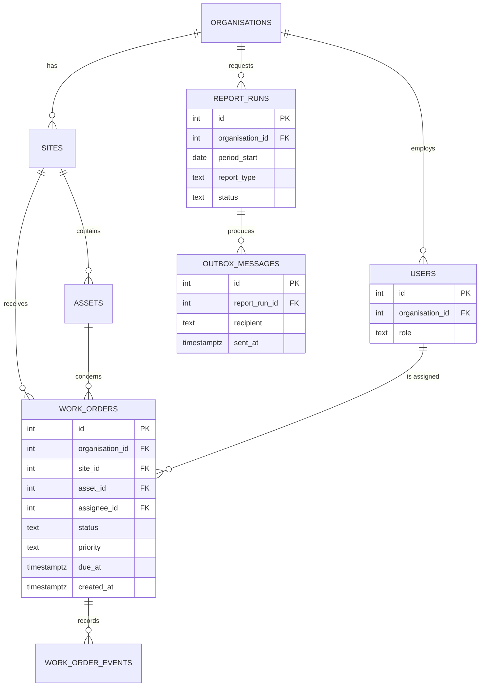
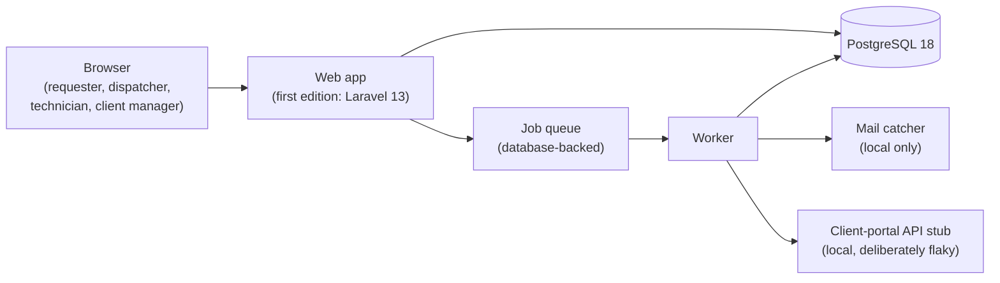
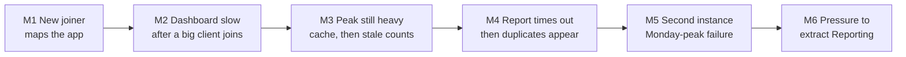
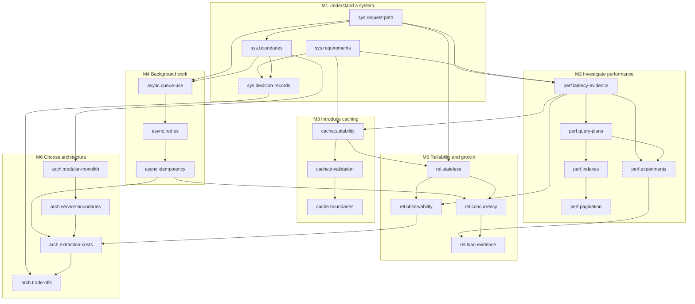
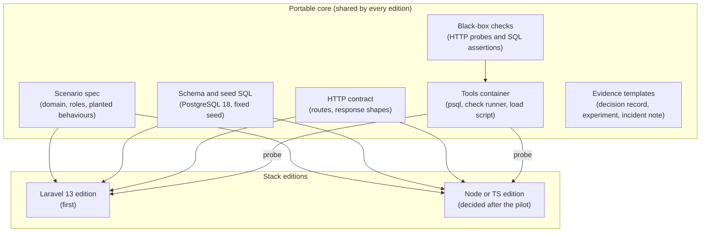

# 07 · Curriculum plan — From CRUD to Reliable Systems

Status: Proposal — for discussion

**Purpose.** This doc defines the launch roadmap at outline level: what the path should achieve, the work-order scenario that runs through it, the skills and their prerequisites, the 18 missions, the six labs, the lab-kit stack, the assessments, the default pacing and the sources. Lesson text is out of scope. So are the content file format and workflow (`06-content-system.md`), evidence and scheduling rules (`05-learning-engine.md`) and screens (`08-ux-and-screens.md`).

## Summary

- **Outcome (Proposal).** Learners practise, and are checked on, how to investigate and improve the performance and reliability of an ordinary CRUD web application, and how to decide when the architecture should not change. Completion means the topics were covered and understanding was checked. It does not show verified implementation proficiency (PRD §8A).
- **One continuing scenario (PRD §5, §8).** The scenario is a fictional facilities-maintenance work-order app. Each module adds a new problem: a slow dashboard, stale cached counts, duplicate report jobs, a failure under Monday-peak load, and pressure to extract a service.
- **23 skills with stable IDs** sit in an acyclic prerequisite graph (`sys.*`, `perf.*`, `cache.*`, `async.*`, `rel.*`, `arch.*`). Each of the 18 required mission topics has one primary skill; the other five skills are secondary and evidenced by labs only. Prerequisites are soft by default with three `strict` edges, and some modules (for example M6.1 and M6.2) can be started early.
- **Missions are stack-neutral.** Every mission uses SQL on PostgreSQL 18, HTTP semantics and pseudo-code, so it works on a phone and for developers in any stack. Framework notes are optional asides.
- **Lab-kit recommendation (Proposal).** Build a portable core: PostgreSQL 18 in Docker Compose, a deterministic synthetic dataset, and black-box checks that run in a tools container. Ship a **Laravel 13 / PHP 8.5 edition** as the first application layer. Only labs L3–L5 need edits to application code, and L2 also has a SQL-only route. L2 is built first, during discovery. No second edition is built before the pilot.
- **Assessments.** Baseline and final transfer assessments use two counterbalanced forms with unseen non-work-order scenarios and a shared rubric (PRD §13). There are 18 auto-scored topic checks, each with Alternate A as a second check-eligible item, retention checks (Alternate B) at least 7 days after demonstration, and a separate six-item pool for the pilot's path-level delayed check. Open-ended architecture answers are self-assessed and labelled that way.
- **Pacing (PRD §5).** The default is six weeks: one module per week, 3 × 10-minute sessions and one optional lab. At the PRD's review cap, spaced-review demand from week 5 runs at about twice the free review slots, so the backlog drains in maintenance after completion (Open question 3).
- **Inventory.** Everything below is still to be authored: 18 missions with 18 curated small variants, 36 alternates, 18 changed-condition questions, 18 topic checks, 6 path-level delayed-check items, 6 labs with 6 no-setup fallbacks, 1 dataset generator, 1 setup check, 2 transfer-assessment forms and 6 diagnostic items.

## 1. Scope and neighbours

| This doc owns | Owned elsewhere |
| --- | --- |
| Path outcome, scenario, skills graph, mission and lab outlines, assessment *content* design, lab-kit stack, pacing, sources | Content format, IDs, authoring/review/publish workflow → `06-content-system.md` |
| Which item plays which role (topic check, alternate, retention check) | Evidence-level rules, review intervals, queue caps, completion evaluation → `05-learning-engine.md` |
| What a lab contains and checks | Lab, path and evidence screens → `08-ux-and-screens.md` |
| Which assessments exist and what they measure | Pilot design, metrics, analysis → `10-measurement-and-validation.md` |
| Lab-kit stack (runs on the learner's machine) | DevStep's own app stack → `01-tech-stack-and-hosting.md` (an independent decision) |

Mission IDs (`M1.1`…`M6.3`), lab IDs (`L1`…`L6`) and assessment IDs (`A0`, `AF`) are working identifiers. `06-content-system.md` sets the final ID format. Skill IDs (`perf.query-plans`) are proposed as stable and are stored in `skills`.

## 2. Path outcome, audience fit, and what completion signals

**Outcome statement (Proposal, shown at enrolment per R01):**

> In about six weeks at your chosen pace, you will practise how to trace a request through a web application, investigate slow pages with evidence, add caching and background jobs safely, diagnose failures under load, and decide when to keep or change an architecture, all in one continuing work-order application. Each topic ends with a check in a new scenario.

| Audience fit | Detail |
| --- | --- |
| Designed for (PRD §4) | Developers with roughly 1–5 years' experience who ship CRUD features in one stack and lack confidence in performance, reliability and system design. |
| Assumed, not taught | Basic SQL (`SELECT`, `JOIN`, `WHERE`, `ORDER BY`), the HTTP request/response cycle, one server-side framework in any language. Labs additionally assume a terminal, a code editor and willingness to install Docker (the setup check guides this). |
| Not designed for (PRD §4) | Complete beginners, interview cramming, enterprise compliance training. |
| Stack fit | Missions need no particular stack. Labs L3–L5 need PHP to be readable in the first edition (§7). |

| Completion **does** signal | Completion **does not** signal |
| --- | --- |
| All 18 required topics covered, each by an attempt plus feedback review (PRD §8A). | Verified implementation proficiency. Labs are optional and recorded separately (PRD §8A). |
| A pass on a topic check in a different scenario for each topic (on a later day, at most one hint), or a challenge-out. | Production experience or on-call competence. |
| Which skills reached `demonstrated`, and later `retained` (shown separately in Evidence, F08). | Any credential. Local lab-check output is learner-submitted evidence (PRD §9). |
| | Expert judgement on architecture. Open-ended answers are `self_assessed` unless a human reviewed them. |

**Proposal: copy for the completion summary** (tone per §10; `08-ux-and-screens.md` places it): "You covered all 18 topics in From CRUD to Reliable Systems and passed a check on each one in a new scenario. This shows checked understanding. It is not a verified measure of implementation skill. Your completed labs and their evidence are listed separately. Reviews will keep coming back so you can keep what you learned."

Required vs optional (PRD §8A): the 18 mission topics are `required` and form the progress denominator. The six labs are `optional` topics (the `06-content-system.md` model) and never affect required progress or the denominator. No other optional enrichment topics ship at launch.

## 3. The continuing scenario: a work-order application

All names, organisations and figures below are **fictional**. The app belongs to a made-up facilities-maintenance provider and is referred to as "the work-order app". It must not resemble a real company's branding.

### 3.1 Domain and main entities

Client organisations raise maintenance requests (work orders) for equipment (assets) at their sites. Dispatchers triage and assign them to technicians. Each work order carries an SLA due time set by its priority. Client managers see a dashboard for their own organisation and receive a monthly SLA report.

The lab app's schema is shown below. It is fictional and is **not** DevStep's data model, which lives in `04-data-model.md`.

### 3.2 User roles

| Role | Does | Tenant scope |
| --- | --- | --- |
| Requester | Raises work orders and follows their status. | Own organisation |
| Dispatcher | Triages, prioritises and assigns work. Uses the dispatcher dashboard heavily on Monday mornings. | All organisations (provider staff) |
| Technician | Updates status from a phone browser and adds notes. | Assigned work only |
| Client manager | Views their organisation's dashboard and requests SLA reports. | Own organisation. The tenant boundary is central to Module 3. |
| Operator | Runs the app with a small team. | Infrastructure |

### 3.3 Request paths used across the path

| Path | Purpose | Modules that revisit it |
| --- | --- | --- |
| `POST /work-orders` | Create a work order. Validate, insert, queue a confirmation email. | M1, M4, M5 |
| `GET /dashboard` | Open, overdue and urgent counts by site, plus an overdue list. | M2, M3, M5 |
| `GET /work-orders?status=…&sort=due_at&page=…` | Paged work-order list. | M2 |
| `PATCH /work-orders/{id}/status` | Technician or dispatcher status change. Writes an event row. | M3 (invalidation), M5 (concurrency) |
| `POST /reports/sla` | Request a monthly SLA report. A queued job writes `report_runs` and emails the client. | M4, M6 |

The queue is database-backed, in line with PRD §11, which treats a database queue as adequate and Redis as something to add only when evidence calls for it.

### 3.4 Story arc

| Module | What goes wrong (fictional) | What the learner should leave with (not "the answer") |
| --- | --- | --- |
| 1 | The learner joins the team. A requester says the confirmation email never arrived, and a manager asks for a "real-time dashboard that never goes down". | A request path, measurable requirements, explicit boundaries and a decision record. |
| 2 | A large client (about 35% of all work orders) comes on board and dashboard p95 rises roughly sevenfold. A colleague suggests doubling the app servers. | Evidence first: a query plan, one controlled change, and a limitation stated. |
| 3 | After indexing, Monday 09:00 still repeats the same expensive aggregates. A cache helps, but closed jobs show as open for minutes, and a staging near-miss shows one client another client's counts. | Cache only what can tolerate it, scope the key to its audience, and know the stale window. |
| 4 | The SLA report times out in the request. Once it moves to a queue, a flaky upload makes retries send two reports and two emails. | Choose what goes to the background, retry with backoff, and make side effects idempotent. |
| 5 | A second app instance is added for peak load. Users get logged out at random, connections run out at 09:00, and the nightly job runs twice. | Stateless requests, saturation evidence, and logs and metrics that localise a fault. |
| 6 | Reporting keeps breaking dispatch, and someone proposes a Reporting microservice. | A defended decision under explicit constraints. Keeping the monolith can be the right answer. |

## 4. Skills taxonomy and prerequisite graph

### 4.1 Skills (23)

Each mission has exactly one **primary** skill (18 in all). Its topic check, alternates, review item and any demonstration attach to it. The other five skills are **secondary**: a mission practises them, but they earn evidence only from labs and otherwise appear only in analytics. They have no review items. Secondary uses are marked "(secondary)" below.

| Skill ID | Observable ability | Mission(s) | Lab evidence |
| --- | --- | --- | --- |
| `sys.request-path` | Sequence the hops of a request and mark which are synchronous or background, and where state lives. | M1.1 | L1 |
| `sys.requirements` | Separate functional requirements, quality targets and constraints, and make a quality target measurable. | M1.2 | L1 |
| `sys.boundaries` | Identify components or modules, data ownership and a boundary violation. | M1.3 | L1, L6 |
| `sys.decision-records` | Write a decision record with context, options, decision, consequences and conditions for revisiting it. | M1.3, M6.3 (secondary) | L1, L6 |
| `perf.latency-evidence` | Use percentiles, traces and query counts to locate a latency contributor before acting. | M2.1 | L2 |
| `perf.query-plans` | Read `EXPLAIN (ANALYZE)` output: costly node, estimate vs actual rows, scan types. | M2.2 | L2 |
| `perf.experiments` | Design a reproducible before/after measurement that changes one variable and states its limitations. | M2.2 (secondary) | L2, L5 |
| `perf.indexes` | Choose an index and column order for a query shape, and name its write and storage cost. | M2.3 | L2 |
| `perf.pagination` | Choose offset or keyset pagination for a use case and state the limitation of each. | M2.3 (secondary) | L2 |
| `cache.suitability` | Judge whether a read is safe and worthwhile to cache: change rate, staleness tolerance, cost, audience. | M3.1 | L3 |
| `cache.invalidation` | Choose TTL, explicit invalidation or versioned keys, and predict the stale window and stampede risk. | M3.2 | L3 |
| `cache.boundaries` | Keep cached data inside its tenant or user audience, including HTTP cache headers. | M3.3 | L3 |
| `async.queue-use` | Decide what runs in the request and what runs in the background, and design the pending state. | M4.1 | L4 |
| `async.retries` | Choose retry limits, backoff with jitter and non-retryable errors, and spot retry amplification. | M4.2 | L4 |
| `async.idempotency` | Make duplicate or retried processing harmless using keys, constraints and conditional side effects. | M4.3 | L4 |
| `rel.stateless` | Find state that is local to one instance (sessions, files, memory, schedulers) and move it to shared services. | M5.1 | L5 |
| `rel.concurrency` | Recognise races, lost updates and connection limits, and choose a locking or constraint approach. | M5.2 (secondary) | L5 |
| `rel.load-evidence` | Read throughput, latency and errors against concurrency to find the saturated resource. | M5.2 | L5 |
| `rel.observability` | Localise an incident using golden signals, structured logs and request IDs, and name a missing signal. | M5.3 | L5 |
| `arch.modular-monolith` | Define module interfaces and owned data inside one deployable, and choose a way to enforce them. | M6.1 | L6 |
| `arch.service-boundaries` | Evaluate candidate service boundaries by cohesion, data ownership, change rate and transactional coupling. | M6.2 | L6 |
| `arch.extraction-costs` | List the operational, consistency and delivery costs of extracting a service. | M6.3 | L6 |
| `arch.trade-offs` | Make and defend an architecture choice under explicit constraints, including when not to change. | M6.3 (secondary) | L6 |

### 4.2 Skill prerequisite graph (`skill_prerequisites`)

Each edge points from a prerequisite to the skill that depends on it. The graph is acyclic: using the node numbers in the diagram (S01–S23), every edge goes from a lower number to a higher one, so the numbering is itself a valid topological order. Dashed nodes are secondary skills (§4.1). **PRD §8A** requires cycles to be rejected before publication. `06-content-system.md` owns the validator.

### 4.3 Topic dependencies (`topic_dependencies`)

Each mission is one required topic. Its prerequisites come from the skill graph after transitive reduction. The module order is the *recommended* sequence. Prerequisites are kept minimal so learners have some real choice (PRD §2, autonomy). For example, M6.1 opens once M1.3 is done, so Module 6 can start early.

Prerequisites are **soft by default**. Three edges carry the `strict` flag on `topic_dependencies`, because the later mission builds directly on the earlier one's checked understanding: M2.2 → M2.3 (an index is verified by reading its plan), M4.2 → M4.3 (a timeout does not mean the operation did not happen) and M6.2 → M6.3 (the extraction decision is about the chosen boundary).

| Topic | Prerequisites | | Topic | Prerequisites |
| --- | --- | --- | --- | --- |
| M1.1 | none | | M4.1 | M1.3 |
| M1.2 | none | | M4.2 | M4.1 |
| M1.3 | M1.1, M1.2 | | M4.3 | M4.2 (`strict`) |
| M2.1 | M1.1, M1.2 | | M5.1 | M3.1 |
| M2.2 | M2.1 | | M5.2 | M2.2, M4.3, M5.1 |
| M2.3 | M2.2 (`strict`) | | M5.3 | M2.1, M5.1 |
| M3.1 | M1.2, M2.1 | | M6.1 | M1.3 |
| M3.2 | M3.1 | | M6.2 | M6.1 |
| M3.3 | M3.2 | | M6.3 | M4.3, M5.3, M6.2 (`strict`) |

A soft prerequisite is met once its mission activity is done or the topic is `completed`. A `strict` one is met only when the topic is `completed`, by its rule or by challenge-out. A `deferred` topic whose mission was never done does not count (PRD §8A, R03). `05-learning-engine.md` applies these rules.

## 5. Missions

### 5.0 Mission conventions

These apply to every mission (all Proposals unless marked otherwise):

- **Required parts (PRD §8):** measurable objective, prerequisites, time estimate, worked example, misconception notes, graded prompts, hints, feedback, sources, stack/version scope and accessibility review. A reviewer tries every exercise before it is published.
- **Three self-contained steps of about 3 minutes each:** (1) scenario and first decision, (2) worked example and explanation, (3) changed-condition question and summary. The step boundaries are resume stopping points inside a `practise` mission: a learner who leaves mid-mission picks up at the next step with nothing lost.
- **Practise time is at most 10 minutes; segments are at most 8.** A mission takes 8–10 minutes in `practise` mode (the `P` figure). A `P 8` mission runs as one segment, so with the previous topic's check (about 2 minutes, §9) a session is about 10 minutes. A `P 9` or `P 10` mission is planned as two segments split at a step boundary (shown as, for example, `P 10 (7 + 3)`), and its last step can move to the start of the next session.
- **Small mode is a separate curated variant** (PRD §9). Each mission has one authored recall or decision task of about 3 minutes, never more than 4, with its own feedback and a clean stopping point. It is expressed in `06-content-system.md`'s format as a curated subset of the mission's steps, not a lesson cut off halfway. It counts as practice but does not complete the mission (`05-learning-engine.md`).
- **One primary skill per mission** (§4.1). The topic check, alternates, review item and any demonstration attach to it. A secondary skill in a mission's Skills row is practised there but earns evidence only from labs.
- **Roles for each mission's items.** The primary prompt and the changed-condition question are part of learning. The **topic check** and **Alternates A and B** are distinct scenarios used later (§8.1). The topic check and Alternate A are check-eligible; Alternate B is reserved for retention. Prompt ideas below name the intended reasoning so authors can work from them. Learner-facing text must not give the answer away, and no alternate may share a scenario or a correct answer with the primary prompt.
- **Stack/version scope:** SQL is PostgreSQL 18, HTTP follows RFC 9110/9111, and code is pseudo-code. Optional "In Laravel 13" asides cover framework mechanics. Every figure in a scenario is fictional and labelled as such.
- **Phone-readable artefacts:** query plans, logs and metrics are text tables with line numbers. Diagrams always have a text equivalent. No content is image-only (PRD §10).
- **Time labels are estimates** and are never countdowns (PRD §5). In the tables, `P 8` means about 8 minutes in practise mode as one segment, `P 10 (7 + 3)` means two segments, and `Sm 3` means a small variant of about 3 minutes.

### 5.1 Module 1 — Understand a system

| Field | M1.1 Trace a request end to end | M1.2 Requirements and constraints | M1.3 Component boundaries |
| --- | --- | --- | --- |
| Objective | **Sequence** the hops of `POST /work-orders` from browser to database, queue, worker and mail, **mark** each hop as synchronous or background, and **identify** the most likely failure hop from a log excerpt. | **Classify** stakeholder statements as functional requirement, quality target or constraint, and **rewrite** one vague target as a measurable one (percentile, threshold, load, data size). | **Identify** modules and the tables each one owns, **select** the dependency that breaks a stated boundary rule, and **write** a five-part decision record for one boundary choice. |
| Prerequisites | none | none (recommended after M1.1) | M1.1, M1.2 |
| Time | P 8 · Sm 3 | P 8 · Sm 3 | P 9 (6 + 3) · Sm 3 |
| Scenario hook | On your first week, a requester says "I submitted a job but never got the confirmation email." | The operations manager asks for "a real-time dashboard that never goes down". The contract has a 4-hour SLA for urgent jobs, there are four developers, and the team must stay on PostgreSQL. | Reporting code updates `work_orders.sla_breached` directly. A reporting bug changed live job states last month. |
| Misconception(s) | The request is finished when the response returns, even though background work continues. The browser talks to the database. | "Fast" and "scalable" count as requirements. Average latency is a sufficient target. Constraints are preferences. | A boundary means a separate service. A folder is a module. Shared tables are fine if the code is tidy. |
| Primary prompt | Order eight hops, tag each sync or background, then pick the hop where the email most likely failed, given a worker log line. | Sort eight statements into three groups, then build a measurable version of "the dashboard must be fast" from given parts. | From a component sketch and dependency list, pick the violating dependency and a remedy (go through the owning module's interface). |
| Alternate A | A technician's status update from a phone (`PATCH`). Where is it persisted, and what does a second device see on refresh? | A clinic appointment-booking brief. Classify the statements and make "reliable" measurable. | A school timetabling app. Which module should own "room availability", and why? |
| Alternate B | A library "reserve a book" request that sends a notification. Sequence the hops and say where to look first for a missing notification. | An internal expenses app. Which stated constraint rules out one of three hosting options? | An online shop's returns flow. Find the cyclic dependency between Orders, Returns and Refunds. |
| Changed condition | If the email were sent inside the request instead of queued, what would change when the mail server is slow? | If the urgent SLA tightened from 4 hours to 30 minutes, which requirement changes, and which design concern follows first? | If Dispatch and Reporting moved to two teams, which boundary rule matters more, and why? |
| Topic check (format) | Order the hops of an unseen request type and locate the failure (auto-scored). | Classify six new statements and choose the measurable rewrite (auto-scored). | Find the violation in a new dependency list and choose a remedy (auto-scored). |
| Skills | `sys.request-path` | `sys.requirements` | `sys.boundaries` (primary); `sys.decision-records` (secondary) |
| Sources | [MDN-HTTP], [OTEL-SIG], [LV-LIFECYCLE] (aside) | [ARC42-2], [ARC42-10], [SRE-SLO] | [C4], [FOWLER-BC], [NYGARD], [ADR-ORG] |

Notes: M1.3 introduces the decision-record template reused in L1 and L6. The template should stay short (Nygard's form) so writing it on a phone is realistic.

### 5.2 Module 2 — Investigate performance

| Field | M2.1 Latency evidence | M2.2 Query plans | M2.3 Indexes and pagination |
| --- | --- | --- | --- |
| Objective | **Identify** the main contributor to dashboard p95 from a trace summary and percentile table, **select** the next investigation step, and **explain** whether adding app servers would help under the stated assumptions. | **Interpret** an `EXPLAIN (ANALYZE, BUFFERS)` plan: **locate** the most expensive node, **compare** estimated and actual rows, and **choose** one experiment that tests a stated hypothesis. | **Choose** a composite-index column order for a query shape and **name** one cost. **Choose** offset or keyset pagination for a use case and **state** a limitation of each. |
| Prerequisites | M1.1, M1.2 | M2.1 | M2.2 (`strict`) |
| Time | P 8 · Sm 3 | P 10 (7 + 3) · Sm 4 | P 9 (6 + 3) · Sm 3 |
| Scenario hook | A large client joins and dashboard p95 rises from about 0.4 s to about 3 s (fictional). A colleague proposes doubling the app servers. | The dashboard's "overdue urgent jobs per site" query, with a prepared plan in text. | The work-order list `?status=open&sort=due_at&page=4000` takes seconds, and the dashboard filters on organisation, status and due time. |
| Misconception(s) | The average represents users' experience. More servers fix a slow query. One timing run is evidence. | `Seq Scan` is always bad. Cost units are milliseconds. Plain `EXPLAIN` shows real timings. `EXPLAIN ANALYZE` is harmless on writes (it executes the statement). | Index every column. Column order does not matter. Indexes are free. Keyset pagination can jump to page N. |
| Primary prompt | A trace shows about 85% of time in one SQL statement. Pick the investigation step and say why not to scale out first. | Prepared plan with a sequential scan and a sort. Pick the node, state a hypothesis, pick an experiment. | Choose among four candidate indexes for `WHERE organisation_id = ? AND status = ? ORDER BY due_at LIMIT 50`, and choose pagination for a technician's infinite-scroll history. |
| Alternate A | Slow invoice-PDF endpoint where the trace is dominated by an external API call, not SQL. Choose the evidence step. | A plan whose row estimate is off by about 1000× because statistics are stale. Choose the first experiment. | Login lookup by `lower(email)`. Choose the index type (an expression index). |
| Alternate B | A list page issuing about 200 queries per request (N+1). Diagnose from query count rather than duration. | A plan where a sequential scan is correct because the query returns most of the rows. Say whether an index would help. | An audit-log table takes about 2,000 inserts per second and is read once a month. Decide whether a proposed index on `(actor_id, created_at)` is worth its write cost. |
| Changed condition | If p50 is fine but p99 is bad only on Monday mornings, what extra evidence would you collect? | If the same query ran for the smallest client (0.1% of rows), how might the plan change, and why? | If the table takes about 50 status writes per second, which cost of your index becomes significant? |
| Topic check (format) | Unseen trace: choose the next evidence step and the reason (auto-scored). | Unseen plan: costly node and estimate error (auto-scored). | Unseen query shape: choose the index and column order, and name one cost (auto-scored). |
| Skills | `perf.latency-evidence` | `perf.query-plans` (primary); `perf.experiments` (secondary) | `perf.indexes` (primary); `perf.pagination` (secondary) |
| Sources | [SRE-MON], [SRE-SLO], [PG-STATS], [LV-ELOQ] (aside) | [PG-EXPLAIN] (PRD [9]) | [PG-IDX], [PG-MULTI], [PG-LIMIT], [PG-ROWCMP], [UTIL-SEEK], [LV-PAGE] (aside) |

Notes: this module carries the PRD §5 worked example ("what would you investigate before adding servers?"). Every prepared plan must be captured on the pinned PostgreSQL version and recaptured whenever that version changes, because plan output varies between major versions. In M2.2 and M2.3 the secondary skills (experiment design, pagination) are practised in the mission and evidenced in L2; checks and reviews target the primary skill.

### 5.3 Module 3 — Introduce caching

| Field | M3.1 What is safe to cache | M3.2 Invalidation | M3.3 Stale results and access boundaries |
| --- | --- | --- | --- |
| Objective | **Classify** five candidate reads as good, poor or unsafe to cache using change rate, staleness tolerance, compute cost and audience, and **name** the deciding factor for each. | **Select** an invalidation approach (TTL, delete on write, versioned key) for a stated freshness need, and **sequence** a race that still produces a stale read. | **Identify** a cache key or HTTP header that could serve one tenant's or user's data to another, **correct** it, and **state** the acceptable stale window. |
| Prerequisites | M1.2, M2.1 | M3.1 | M3.2 |
| Time | P 8 · Sm 3 | P 9 (6 + 3) · Sm 3 | P 8 · Sm 3 |
| Scenario hook | After the Module 2 fix, Monday 09:00 still recomputes the same aggregates hundreds of times. | A dispatcher closes a job, but the client's dashboard shows it open for up to 10 minutes. | Staging near-miss: the key `dashboard:summary` had no organisation ID, and a client manager briefly saw another client's counts. |
| Misconception(s) | Cache everything slow. A cache fixes the slow path permanently, even though the miss path is still slow. Caching costs nothing in consistency. | Deleting the key on update removes staleness. TTL alone suits all data. Stampedes are rare. | Authorisation before the cache makes it safe. HTTPS stops shared caches storing responses. `no-cache` means "do not store". |
| Primary prompt | Classify the site list, dashboard counts, a technician's own job list, a generated monthly report and the login session (which is not a cache). | Pick a strategy for dashboard counts, then order five events into the read-miss/update/delete race. | Spot-the-bug across three cache keys and two response headers. Choose the unsafe one and its fix. |
| Alternate A | A news site: article body, comment count, a logged-in reader's bookmarks. | A shop price cache where price changes are scheduled ahead. Choose between versioned keys and scheduled expiry. | A CDN in front of `/account/invoices`. Choose the response header. |
| Alternate B | An invoicing app's exchange rates, fixed daily at 16:00. Derive the TTL from the business rule. | A per-user permissions cache after a role is revoked. Choose the approach and say what is at risk. | A feature-flag cache shared across tenants. Decide whether sharing is safe given the stated flag scope. |
| Changed condition | If the dashboard must reflect changes within 5 seconds, which caching options remain? | If 200 requests miss at the same moment after expiry, what happens to the database, and which mitigation would you consider? | If the dashboard adds a per-user "my assigned jobs" panel, what must change in the key or headers? |
| Topic check (format) | Classify new candidates (auto-scored). | Order an unseen stale-read race (auto-scored). | Find the unsafe key or header in a new snippet (auto-scored). |
| Skills | `cache.suitability` | `cache.invalidation` | `cache.boundaries` |
| Sources | [AZ-CACHEASIDE], [AZ-CACHING], [MDN-CACHE] | [AZ-CACHEASIDE], [RFC9111], [LV-CACHE] (aside: atomic locks) | [MDN-CC], [RFC9111], [PS-WCD] |

Notes: M3.3 frames the access boundary as a correctness and privacy issue, not an exploit tutorial. The PortSwigger reference explains the mechanism only. Labs never include attack tooling.

### 5.4 Module 4 — Background work

| Field | M4.1 What belongs in the background | M4.2 Retries | M4.3 Duplicate processing and idempotency |
| --- | --- | --- | --- |
| Objective | **Decide** for each of six tasks whether it runs in the request or in the background, using user-visible latency, failure isolation and consistency needs, and **describe** what the user sees while a job is pending. | **Choose** a retry policy (attempt limit, backoff with jitter, retryable errors) for a job calling a flaky dependency, **identify** one error that must not be retried, and **calculate** the amplification from layered retries. | **Identify** where a retried or duplicated job causes a duplicate effect, **choose** a mechanism that makes the second run harmless, and **explain** why de-duplicating at dispatch does not, on its own, make processing idempotent. |
| Prerequisites | M1.3 | M4.1 | M4.2 (`strict`) |
| Time | P 8 · Sm 3 | P 9 (6 + 3) · Sm 3 | P 10 (7 + 3) · Sm 4 |
| Scenario hook | The SLA report for the largest client is generated inside the request and times out. | The queued report job uploads to a fictional client-portal API that times out now and then. Immediate retries pile up. | A client receives two identical monthly reports and two emails. `report_runs` has two rows for the same organisation and month. |
| Misconception(s) | A queue makes work faster, when it only moves it. Everything slow should be queued, including validation. Queued failures will be noticed. | Retry everything immediately. More retries mean more reliability. A timeout means the operation did not happen. | The queue guarantees exactly-once delivery. A "unique job" lock equals idempotent processing. Check-then-insert is safe under concurrency. |
| Primary prompt | Classify: validate input, create the work order, send the confirmation, generate the SLA report, refresh dashboard counts, change status. | Choose a policy from four options, then sort error types into retry with backoff, do not retry, or respect a delay hint. | Given job pseudo-code, choose the fix: a natural key with a unique constraint and conditional insert, with the email sent only when the row is new (outbox). |
| Alternate A | A marketplace photo upload that needs thumbnails. Decide, and design the pending state. | A mobile app syncing to an API after reconnecting. Choose the backoff and explain why jitter matters. | A payment-provider webhook delivered twice. Choose where the event ID is recorded and when it is checked. |
| Alternate B | Password reset. Which part is synchronous (token creation) and which is queued (email)? | A nightly import fails on one malformed row. What should happen to that message instead of retrying forever? | A consumer that adds loyalty points. Redesign the operation so a repeat has no effect. |
| Changed condition | If the client needs the report within 2 minutes of asking, what do you now need to measure about the queue? | If three layers each retry three times, how many attempts can one user action cause at the dependency? | If the email is sent before the database commit and the commit fails, what does the next retry do? |
| Topic check (format) | Classify new tasks and choose a pending state (auto-scored). | Choose a policy and a non-retryable error for a new job (auto-scored). | Find the duplicate effect in a new job and choose a mechanism (auto-scored). |
| Skills | `async.queue-use` | `async.retries` | `async.idempotency` |
| Sources | [LV-QUEUE] (aside), [AZ-ASYNC] | [AWS-RETRY], [SRE-CASCADE], [LV-QUEUE] (aside: tries/backoff) | [AWS-IDEM], [EIP-IDEM], [PG-INSERT], [RFC9110], [IETF-IDEM], [STRIPE-IDEM] |

Notes: M4.3 uses Laravel's `ShouldBeUnique` as an explicit misconception. It prevents duplicate *dispatch* while a lock is held, but a retried job can still repeat side effects. The IETF Idempotency-Key document is an expired draft and must be cited as one, not as a standard.

### 5.5 Module 5 — Reliability and growth

| Field | M5.1 Stateless requests | M5.2 Concurrency and load evidence | M5.3 Logs and metrics |
| --- | --- | --- | --- |
| Objective | **Identify** state kept on one instance (file sessions, local uploads, in-process cache, per-instance scheduler) and **choose** a shared home for each so any instance can serve any request. | **Interpret** a load-test table (throughput, p95, error rate against concurrency) plus connection counts, **identify** the saturated resource and where it saturates, and **propose** one measured change with a way to verify it. Recognise a lost-update race. | **Localise** a supplied incident to a component and time window using golden-signal metrics and structured logs with request IDs, and **name** one missing signal that would have shortened the diagnosis. |
| Prerequisites | M3.1 | M2.2, M4.3, M5.1 | M2.1, M5.1 |
| Time | P 8 · Sm 3 | P 10 (7 + 3) · Sm 4 | P 9 (6 + 3) · Sm 3 |
| Scenario hook | A second app container is added for Monday peaks. Dispatchers are logged out at random and some attachments return 404. | At Monday 09:00, throughput plateaus, p95 climbs and errors say the database has too many clients. Separately, two dispatchers assign the same technician at once. | Tuesday 14:05–14:25 (fictional): status updates fail intermittently. Logs come from two app instances, a worker and the database. |
| Misconception(s) | Sticky sessions solve statelessness. Stateless means no database. A local file cache is harmless with two instances. | Raising `max_connections` fixes it. Throughput grows linearly with concurrency. A laptop load test predicts production capacity. | More logs mean more observability. An error count shows impact without traffic as the denominator. Metrics explain *why*. |
| Primary prompt | From a config excerpt (file sessions, file cache, local uploads, scheduler on every instance), pick the cause of logouts and the cause of the nightly job running twice. | Read a concurrency table and connection metrics, then choose the saturated resource and one change (connection pooling or limits, shorter connection hold, queueing). | From a four-signal snapshot and a log excerpt, choose the component and a first hypothesis. |
| Alternate A | A chat app keeps presence in process memory behind three instances. Decide what breaks. | A search API's throughput stops rising at 40 concurrent users while CPU stays at 35% and requests wait for pool connections. Name the saturated resource and the evidence for it. | A checkout's error rate is flat but traffic dropped 40%. What does that suggest? |
| Alternate B | A rate limiter counting in process memory across three instances. Predict the effective limit. | Image workers are CPU-bound. Going from 4 to 8 workers raises latency. Interpret this. | A worker backlog grows while app metrics stay green. Which signal reveals it? |
| Changed condition | If the scheduler runs on both instances, which earlier technique protects the nightly job? | If the load test used 1% of production data volume, which conclusions still hold? | If logs lacked request IDs, how would you connect the worker failure to the user's request? |
| Topic check (format) | Find instance-local state in a new config (auto-scored). | Read a new load table to find the saturated resource and a valid change (auto-scored). | Localise a new incident (auto-scored). |
| Skills | `rel.stateless` | `rel.load-evidence` (primary); `rel.concurrency` (secondary) | `rel.observability` |
| Sources | [12F-PROC] | [PG-CONN], [PG-LOCK], [PG-ISO], [USE], [PG-BENCH], [K6], [SRE-OVERLOAD] | [SRE-MON], [OTEL-SIG], [OTEL-PRIMER], [USE] |

Notes: M5.2 is the densest mission, which is why it gets two segments (`P 10 (7 + 3)`) and a 4-minute small variant. The lost-update race practises the secondary skill `rel.concurrency`, evidenced in L5; checks and reviews target load evidence. If concierge testing shows the mission runs long, split the race-condition part into an optional enrichment topic (Open question 7).

### 5.6 Module 6 — Choose architecture

| Field | M6.1 Modular monolith | M6.2 Service boundaries | M6.3 Extraction costs and trade-offs |
| --- | --- | --- | --- |
| Objective | **Propose** modules for the work-order app (Dispatch, Reporting, Notifications, Identity), **state** each one's public interface and owned tables, and **choose** one way to enforce a boundary. | **Evaluate** three candidate extraction boundaries by cohesion, data ownership, change rate and transactional coupling, **select** the most defensible one (or none), and **name** the data it would own. | **List** the costs an extraction would add (network failure modes, distributed consistency, deployment, observability, duplicated data) and **write** a keep-or-extract decision that fits the stated constraints and names the conditions that would reverse it. |
| Prerequisites | M1.3 | M6.1 | M4.3, M5.3, M6.2 (`strict`) |
| Time | P 8 · Sm 3 | P 9 (6 + 3) · Sm 3 | P 10 (7 + 3) · Sm 4 |
| Scenario hook | Reporting changes keep breaking dispatch screens. Someone says "this is why we need microservices". | Leadership asks which part could become its own service. The candidates are a per-entity "WorkOrderService", Reporting and Notifications. | The CTO asks for a recommendation on extracting Reporting next quarter. A constraint card is supplied (§8.7). |
| Misconception(s) | Monolith means big ball of mud. Modularity needs separate deployments. A shared database rules out boundaries. | Split by technical layer, or one service per entity. Smaller is always better. | Microservices scale better by default. Extraction is a one-off refactor. Keeping the monolith is a non-decision. |
| Primary prompt | From a module dependency matrix, choose the call that crosses a boundary and the fix: use the module interface or a read model. | Rank the three candidates with a reason each, choosing from given criteria. | Structured part: select the costs that apply under the card (auto-scored). Open part: a decision of up to 150 words (self-assessed against the exemplar). |
| Alternate A | An online-course platform. Assign "certificates" to a module and justify the choice. | A clinic system. Is Appointments or Billing the cleaner split, given billing needs appointment data in the same transaction? | The same situation under a different card (two teams, conflicting release cadences, reporting load hurting dispatch p95). Select the costs that now apply (auto-scored); the decision that follows may flip. |
| Alternate B | A booking system. Should "pricing" be its own module, given how often it changes? | A two-developer start-up. Is any service boundary worth having yet? | A ticketing system. Which microservice prerequisite (monitoring, rapid provisioning, deployment automation) is missing before extraction? |
| Changed condition | If Reporting needs data from three modules every night, what interface avoids coupling it to their tables? | If Reporting must never be more than 5 minutes behind, what does that mean for the extracted service's data? | If operations is one part-time person, which cost dominates? |
| Topic check (format) | Assign responsibilities in a new domain and find a violation (auto-scored). | Rank new candidates with reasons (auto-scored). | New card: auto-scored cost selection, plus a short decision labelled `self_assessed` that does not decide the check. |
| Skills | `arch.modular-monolith` | `arch.service-boundaries` | `arch.extraction-costs` (primary); `arch.trade-offs` and `sys.decision-records` (secondary) |
| Sources | [FOWLER-MF] (PRD [8]), [SHOPIFY-MM], [FOWLER-BC] | [FOWLER-BC], [FOWLER-MS], [FOWLER-TRADEOFFS] | [FOWLER-MF], [FOWLER-PREMIUM], [FOWLER-PREREQ], [TILKOV], [FOWLER-SF] |

Notes: M6.3 deliberately includes Tilkov's counter-argument, "Don't start with a monolith", so learners weigh the trade-off instead of learning a slogan (PRD §1, §2). Rubrics in this module reward fit to constraints and never reward the more complex option for being complex. The primary skill of M6.3 is `arch.extraction-costs` because its cost selection can be auto-scored. The open decision (`arch.trade-offs`) is self-assessed, so in-product it is practice. Its only evidence comes from L6 (`self_assessed`); the transfer assessments' open items measure it for the pilot but record no evidence.

## 6. Labs

### 6.0 Common lab design (Proposal)

- **One kit, six labs.** The kit is a single repository the learner downloads once. Labs are tagged checkpoints in it, and each lab starts from a known state with a `reset` command. Nothing touches production systems or employer code (F07, PRD §11). Each lab is an `optional` topic (`06-content-system.md`) and never affects required progress.
- **Public kit, private reviewer pack.** The public kit contains no reference solutions or exemplars. Reference states, the L6 exemplar and reviewer notes sit in a private reviewer pack used by the reviewer and CI (§7.4).
- **Everything runs in containers.** The learner needs Docker with Compose, a browser and an editor. Scripts, `psql`, checks and the load generator run inside a `tools` container, so learners need no local PHP, Node or shell utilities (§7).
- **Checks are black-box.** They probe HTTP endpoints and query the database; they do not run the framework's test runner. This keeps them identical across stack editions (§7.4). Each check prints what it verified and what it cannot verify.
- **Evidence basis** (canonical enum): local-check output and the files it verified are `learner_submitted`. Rubric self-ratings are `self_assessed`, and so is L6's open-ended decision record, because no check can judge whether it fits the constraints. A reviewer's rating is `human_reviewed`. Lab evidence never contributes to topic completion (PRD §8A). `05-learning-engine.md` owns how it appears in Evidence.
- **Checkpoints and save-and-return (PRD §10).** Each lab has two or three checkpoints so it can be split across sittings.
- **The no-setup fallback is different evidence (PRD §16).** Every lab has a "read-and-decide" variant built on captured outputs. It is labelled "Scenario evidence — no setup", is `self_assessed` or auto-scored, and never counts as lab evidence.

### 6.1 Shared synthetic dataset

| Aspect | Proposal |
| --- | --- |
| Generation | Deterministic SQL using `generate_series` with a fixed seed, run inside PostgreSQL. Nothing large is downloaded. A checksum query confirms every learner has the same data. |
| Tiers | **small** (default for L1, L3, L4, L6): 40 organisations, about 800 sites, about 16k assets, about 2.5k users, about 60k work orders, about 240k events. **lab** (L2, L5): the same shape with about 1.2M work orders and about 4.8M events. Seed-time and disk targets (Hypothesis: under 3 minutes, under 2 GB on the reference laptop) are measured and written into the lab manifest. |
| Shape | Skewed client sizes, with one client holding about 35% of work orders. Status mix of about 70% closed, 15% open, 10% in progress and 5% on hold. Due times spread over 36 months. About 10% urgent priority. Each user has a role and an organisation. |
| Personal data | None. Names come from fixed word lists ("Site 0412", "Technician 0193"), emails use reserved example domains, and there are no free-text fields copied from anywhere. |
| Planted problems | No composite index for the dashboard filter. Deep `OFFSET` on the list endpoint. N+1 site lookups on the dashboard. A cache key without the tenant (L3). A non-idempotent report job and a flaky upload stub (L4). File-based sessions, a per-instance scheduler, a low connection limit and a connection held during a slow external call (L5). Reporting writing a dispatch-owned column (L1, L6). |

### 6.2 Setup check (runs before L1, about 10–15 minutes)

The `check-setup` command verifies: the Docker engine is reachable; the Compose version meets the minimum; the required ports are free; there is enough disk; the images are pulled and match the manifest digests; the database is seeded with the expected row counts and checksum; the app's `/health` responds; and the worker processes a test job. Each failure prints one fix hint and a link to the troubleshooting page. Reference matrix (Proposal; confirmed at the planning gate and tested before the pilot): macOS on Apple silicon, Windows 11 with WSL 2, and Ubuntu LTS. If the setup check fails twice, the learner is offered the no-setup fallback with its label explained (PRD §16).

### 6.3 L1 — Annotated architecture and a short decision record

| Field | Content |
| --- | --- |
| Objective | Produce an annotated component diagram of the running app showing the paths for creating a work order and requesting a report (sync/async, owned data), and a decision record for one boundary. |
| Prerequisites | M1.1–M1.3 recommended. Setup check passed. |
| Starter contents | Compose stack (app, worker, database, mail catcher, tools). Partial diagram in Mermaid text with gaps. Route list. JSON logs with request IDs. Decision-record template. |
| Dataset and planted problems | Small tier. Reporting writes `work_orders.sla_breached`. The confirmation email is synchronous on one path and queued on another. |
| Ordered tasks | 1) Run the setup check. 2) Create a work order with the supplied `curl` command and note its request ID. 3) Follow that ID through the app and worker logs. 4) Complete the diagram. 5) Find both planted issues. 6) Write a decision record for the reporting boundary. |
| Checkpoints | After step 3 (traced), step 4 (diagram), step 6 (record). |
| Local checks: verify | The diagram parses and names the required components and edges. The cited request ID exists in the logs. The decision record has all five sections filled in. |
| Local checks: cannot verify | Whether the annotations are correct, whether the decision is sound, or whether the work was unassisted. |
| Rubric criteria | Path complete and in order. Sync/async correctly marked. Data owner named for each table group. Record states the context, at least two options, consequences including a negative one, and when to revisit. |
| Evidence recorded | Diagram and decision record (`learner_submitted`) plus a rubric self-rating (`self_assessed`). |
| No-setup fallback | Supplied log excerpt and an incomplete diagram. The learner completes it and writes the same record. Labelled scenario evidence. |
| Time | 30–40 minutes. |

### 6.4 L2 — Reproducible before/after experiment

| Field | Content |
| --- | --- |
| Objective | Measure the dashboard query, form a hypothesis from its plan, change **one** thing (an index, a query rewrite, or keyset pagination for the list), re-measure with the same protocol, and report with limitations. |
| Prerequisites | M2.1–M2.3 recommended. Lab-tier data seeded. |
| Starter contents | SQL files for the dashboard and list queries. A `measure` script (warm-up, then repeated runs, reporting median and p95 of execution time). An `explain` helper. Experiment template (hypothesis, change, protocol, before, after, limitations). A **SQL-only route** that runs entirely through `psql` in the tools container, for learners in any stack. |
| Dataset and planted problems | Lab tier with a skewed client. Missing composite index. Deep `OFFSET`. Optional application-layer N+1 for the Laravel edition. |
| Ordered tasks | 1) Baseline measurement. 2) Capture the plan. 3) Write the hypothesis. 4) Apply one change. 5) Re-measure with identical parameters. 6) Confirm the results are unchanged using the checksum. 7) Record at least two specific limitations, such as laptop hardware, warm cache, one connection, or data size. |
| Checkpoints | After step 3 (hypothesis), step 5 (after-measure), step 7 (record). |
| Local checks: verify | The result checksum is identical before and after. The target query's plan changed. Both measurement files exist with the same protocol parameters. The record has every field, including at least two limitations. |
| Local checks: cannot verify | Whether the improvement transfers to production, whether the change is the best option, its write overhead under real traffic, or whether the reasoning was unassisted. |
| Rubric criteria | One variable changed. Same protocol both times. Percentiles rather than a single run. Limitations specific to this setup. Write or storage cost considered. |
| Evidence recorded | Before/after experiment with limitations (`learner_submitted`) plus a self-rating (`self_assessed`). |
| No-setup fallback | Captured before/after plans and timing tables. The learner interprets them and critiques a flawed experiment write-up. Labelled scenario evidence. |
| Time | 40–45 minutes (two sittings suggested). |

### 6.5 L3 — Cache one safe read and describe failure behaviour

| Field | Content |
| --- | --- |
| Objective | Fix an unsafe cache key, then cache the dashboard summary with a tenant-scoped key, invalidation on status change and a TTL backstop. Show what happens when the cache is unavailable, stale or cold, and write it down. |
| Prerequisites | M3.1–M3.3 recommended. |
| Starter contents | App using the database cache store by default, with an optional Redis profile for comparison (PRD §11). A `two-tenant-probe` that compares the responses two client managers receive. A cache on/off toggle. A query counter. A failure-behaviour note template. |
| Dataset and planted problems | Small tier with two named test tenants. One endpoint caches under a key without the tenant. A per-user page is served without restrictive cache headers. |
| Ordered tasks | 1) Run the probe and observe the leak. 2) Fix the key and headers. 3) Justify the dashboard as a cache candidate using the M3.1 criteria. 4) Add cache-aside with a tenant key. 5) Invalidate on status change. 6) Compare query counts with the cache cold and warm. 7) Disable the cache and observe the behaviour. 8) Write the failure note: stale window, stampede risk, outage behaviour. |
| Checkpoints | After step 2 (leak fixed), step 5 (cache in place), step 8 (note). |
| Local checks: verify | The probe finds no cross-tenant data. After a status change, the dashboard reflects it within the declared window. With the cache disabled, the endpoint still returns correct data. Per-user responses carry `private` or `no-store`. |
| Local checks: cannot verify | Every stale path under real concurrency, behaviour of production cache infrastructure, or that no other endpoint leaks. |
| Rubric criteria | Key includes every dimension of the audience. Freshness requirement stated and met. Miss path still correct. Failure behaviour is concrete, not "it might be stale". |
| Evidence recorded | Change summary and failure-behaviour note (`learner_submitted`) plus a self-rating. |
| No-setup fallback | Supplied code excerpt and event sequences. The learner identifies the leak and the race and writes the failure note. Labelled scenario evidence. |
| Time | 35–45 minutes. |

### 6.6 L4 — A retry-safe synthetic report job

| Field | Content |
| --- | --- |
| Objective | Make the SLA report job produce exactly one `report_runs` row and one outbox email per (organisation, period, report type), even under duplicate dispatch, retries and two concurrent workers. |
| Prerequisites | M4.1–M4.3 recommended. |
| Starter contents | Job code, a flaky upload stub that fails the first attempt for a fixed, seeded subset of jobs, a `chaos` script (dispatch twice, fail between write and email, run two workers), an outbox table, and a decision-record template. |
| Dataset and planted problems | Small tier plus report requests. No natural-key constraint. The email is sent before commit. Retries are immediate and unlimited. |
| Ordered tasks | 1) Reproduce the duplicates with `chaos`. 2) Choose the idempotency key. 3) Add a unique constraint and a conditional insert. 4) Make the email conditional through the outbox. 5) Set the attempt limit and backoff. 6) Run the full chaos suite. 7) Record the decision and the remaining risks. |
| Checkpoints | After step 1 (reproduced), step 4 (idempotent), step 7 (record). |
| Local checks: verify | After the chaos suite there is exactly one row and one outbox message per key. Jobs that keep failing end in a failed state within the attempt limit. Retry delays are non-zero and vary. |
| Local checks: cannot verify | Behaviour on other queue brokers, every crash point, clock skew, or whether the chosen key matches the business meaning in every case. |
| Rubric criteria | The key reflects business identity, not a random job ID. The side effect is tied to the state change. Non-retryable errors are not retried. Remaining risks are named. |
| Evidence recorded | Chaos-suite output (`learner_submitted`) and a decision record (`self_assessed` rubric). |
| No-setup fallback | Supplied job traces showing duplicates. The learner locates the duplicate path and proposes a fix with a sequence. Labelled scenario evidence. |
| Time | 40–45 minutes. |

### 6.7 L5 — Diagnose a supplied failure and propose a measured change

| Field | Content |
| --- | --- |
| Objective | Reproduce a Monday-peak failure with the provided load script, localise it using logs and metrics, make one change, and verify it with an identical re-run, stating the limitations. |
| Prerequisites | M5.1–M5.3 recommended. L2 helpful (experiment protocol). |
| Starter contents | Compose profile with two app replicas behind a local proxy and a low database connection limit. Load script run from the tools container. JSON logs with request IDs. A `db-activity` summary built from PostgreSQL's activity views. Incident-note template. |
| Dataset and planted problems | Lab tier. File sessions (logouts across replicas). The scheduler runs on both replicas. Each request holds a connection during a slow stubbed call. |
| Ordered tasks | 1) Run the load at three levels. 2) Tabulate throughput, p95 and errors. 3) Inspect the logs and database activity. 4) Write a hypothesis. 5) Make one change. 6) Re-run with identical parameters. 7) Probe sessions across replicas. 8) Write the incident note with limitations. |
| Checkpoints | After step 2 (baseline table), step 6 (re-run), step 8 (note). |
| Local checks: verify | Both load runs used identical parameters. The error rate at the target level is below the lab's threshold after the change. The session probe survives a replica switch. The note includes limitations. |
| Local checks: cannot verify | Production capacity, whether the change is the smallest sufficient one, or behaviour on other hardware. |
| Rubric criteria | The saturated resource is identified from evidence. One change at a time. Verification uses the same protocol. A missing signal is named. Laptop-scale limitations are acknowledged. |
| Evidence recorded | Load tables and incident note (`learner_submitted`) plus a self-rating. |
| No-setup fallback | Supplied metrics and logs from both runs. The learner writes the diagnosis and proposes and justifies a change. Labelled scenario evidence. |
| Time | 40–45 minutes (two sittings suggested). |

### 6.8 L6 — Defend keeping the monolith or extracting one service

| Field | Content |
| --- | --- |
| Objective | Write a decision record that keeps a strengthened modular monolith or extracts Reporting, under an assigned constraint card. It must cover couplings, costs, a migration path if extracting (strangler-fig style), and the conditions for reversing the decision. |
| Prerequisites | M6.1–M6.3 recommended. L5 outputs optional as evidence. |
| Starter contents | Three constraint cards (§8.7), one assigned at random. A `module-deps` script that scans code and SQL for cross-module table access. The decision-record template and the shared rubric. No exemplar: it sits in the private reviewer pack (§6.0). |
| Dataset and planted problems | Small tier. A hidden coupling: the report job updates `work_orders.sla_breached`. |
| Ordered tasks | 1) Run the dependency scan. 2) List the couplings, including the hidden one. 3) List the costs of extracting. 4) Decide. 5) State the conditions for revisiting. 6) Submit, then self-assess against the shared rubric, quoting the sentence that meets each criterion (§8.7). |
| Checkpoints | After step 2 (couplings), step 6 (submitted and self-assessed). |
| Local checks: verify | The record has every section, cites the card ID, and names the couplings the scan found, including the hidden one by table and column. |
| Local checks: cannot verify | Whether the decision fits the constraints. Only the rubric, or a human reviewer, can judge that. |
| Rubric criteria | Shared transfer rubric (§8.6). Both "keep" and "extract" can score full marks. |
| Evidence recorded | Scan and local-check output (`learner_submitted`). The decision record and its rubric rating are `self_assessed` (PRD §9); a reviewer's score, if any, is recorded separately as `human_reviewed`. |
| No-setup fallback | Supplied scan output. Otherwise identical. Still labelled scenario evidence, because the learner did not run the scan. |
| Time | 30–45 minutes. |

## 7. Lab-kit stack decision

The lab kit is what learners run locally. It is separate from DevStep's own app stack (`01-tech-stack-and-hosting.md`). The PRD's open question applies here: "Is Laravel-first the best recruiting niche?" (PRD §16).

### 7.1 What actually needs an application layer

| Lab | Stack exposure |
| --- | --- |
| L1, L6 | Read logs and code, write a record. Light. Reading PHP is enough. |
| L2 | SQL only. Fully stack-neutral through the SQL-only route. |
| L3, L4, L5 | Change application code (cache, job, sessions or pooling). Stack-specific. |

All 18 missions are stack-neutral (§5.0). The stack choice therefore affects the optional labs L3–L5 heavily, L1 and L6 lightly, and the required path not at all.

### 7.2 Options compared

Ratings are the author's judgement (**Proposal**), not measurements.

| Criterion | (a) Laravel/PHP + PostgreSQL via Compose (PRD default) | (b) SQL-first only (PostgreSQL + `psql` + scripts) | (c) Node/TypeScript starter | (d) Python starter |
| --- | --- | --- | --- | --- |
| Audience fit | Narrow but reachable community. Matches the creator's credibility. Non-PHP learners must read PHP for L3–L5. **Hypothesis**: enough Laravel developers fit the persona to run a pilot. | Broadest for M2. Every developer touches SQL. | Broad, but fragmented across frameworks, so "which TypeScript?" needs an answer. | Broad, with growing adoption (Stack Overflow 2025 survey [SO-2025]; no figures quoted). Split across Django and FastAPI. |
| Learner setup friction | Medium: app, worker and database containers. PHP dependencies baked into the image, so no local PHP needed. | Lowest: one database container plus tools. | Medium (same container approach). | Medium (same container approach). |
| Authoring effort (this founder) | Lowest. Existing strength, faster review. | Low for L2. High for L3–L5, because caching, jobs and sessions have to be simulated without an app, which weakens authenticity. | Higher. Less fluent author, more reviewer time. | Higher, for the same reasons. |
| Portability of concepts | Medium. Framework conveniences (unique jobs, cache helpers) can hide mechanisms. Mitigated by making them explicit misconceptions (M4.3). | Highest for database topics. None for HTTP and app-state topics. | Medium. | Medium. |
| Covers all six labs authentically | Yes. | No (L3–L5). | Yes. | Yes. |
| Version churn | Laravel 13 (released 17 Mar 2026): bug fixes for 18 months, security fixes for 2 years [LV-REL]. Annual majors. PHP 8.5 actively supported to 31 Dec 2027 [PHP-VER]. | PostgreSQL majors are supported for 5 years; 18 is supported to Nov 2030 [PG-VER]. | Node moves to one major a year from v27 [NODE-REL]. | Annual releases; 3.14 is in bugfix status [PY-VER]. |
| Future stack editions | Needs the portable core (§7.4) to avoid rewriting. | Is the portable core. | Needs the same core. | Needs the same core. |

### 7.3 Recommendation (Proposal)

Adopt **(b) as the portable core and (a) as the first application edition**. Together these make up option (e).

1. **Core (stack-neutral):** PostgreSQL 18 in Docker Compose, the deterministic dataset, SQL assets, a tools container (`psql`, checks, load generator), the HTTP contract and black-box checks.
2. **First edition: Laravel 13 on PHP 8.5.** It is the fastest to author well and matches the creator's strengths. The kit ships its own Compose file with PostgreSQL rather than relying on Laravel Sail's defaults: Sail's documentation describes a PHP, MySQL and Redis starting point [LV-SAIL].
3. **Positioning:** "a stack-neutral path with a Laravel/PHP lab edition". It is not "a Laravel course". This keeps recruitment broad while the pilot tests whether Laravel developers are the right first niche.
4. **No second edition before the pilot; decide after it (Hypothesis):** the SQL-only route for L2 covers non-PHP learners meanwhile. In discovery interviews, the concierge trial and the pilot, record each participant's main stack and whether they would do labs. After the pilot, decide whether to commission a Node/TypeScript edition (before Python); one suggested input is whether at least 40% of lab-willing participants do not use PHP. This is Open question 2, and the threshold is a project choice, not a benchmark.
5. **Build order and gate:** L2 (Module 2) is the first lab built, during discovery, because its SQL-only route needs no application edition and interviewees can try it. The lab-kit stack, Docker licensing and the three-OS setup matrix (§6.2) are planning-gate items (`12-delivery-plan.md`).
6. **Docker licensing caveat:** Docker's subscription terms appear to require a paid subscription for commercial use of Docker Desktop at larger organisations (more than 250 employees or US$10M revenue, `unverified`: taken from search summaries of [DOCKER-SSA], not read directly), while personal use falls under Docker Personal [DOCKER-PERSONAL]. Learners on employer laptops may be affected. The setup-check guide should recommend a personal machine or employer-approved tooling, and list Docker Engine on Linux. Other Compose-compatible runtimes are `unverified` until tested on the reference matrix.

### 7.4 Keeping lab content portable

Portability rules (Proposal):

1. **Write planted problems as behaviours**, for example "the dashboard cache key ignores the tenant". The scenario spec states the behaviour, and each edition implements it.
2. **Every edition implements the same HTTP contract and database schema.** Checks probe only those, never framework internals.
3. **Each edition has two states:** *planted* (the public starter) and *reference* (a fixed solution). The reference state lives only in the private reviewer pack (§6.0), never in the public kit. CI runs every check against both. Starter checks must fail for the planted reason, and reference checks must pass.
4. **Split lab instructions** into shared concept steps and short edition steps ("In Laravel 13: …"). Missions never depend on edition steps.
5. **Each edition has its own version manifest** (§7.5). Upgrading the database version re-runs the dataset checksum and recaptures every prepared plan.
6. **Evidence templates and rubrics are shared**, so lab evidence from different editions means the same thing (`05-learning-engine.md`).

### 7.5 Version pins (to confirm when authoring starts)

Dates and support windows come from the official pages, as returned by search on 6 Oct 2026 (§12). Re-read the pages directly before pinning.

| Component | Pin (Proposal) | Basis |
| --- | --- | --- |
| PostgreSQL | 18.x via `postgres:18`, with the exact minor and digest recorded at authoring (18.6 was current on 6 Oct 2026). Stay on 18 even after 19 is released, unless a lesson needs a 19 feature. | 18 is current, 19 is in beta, and majors are supported for 5 years [PG-VER], [HUB-PG] |
| PHP | 8.5 | Actively supported to 31 Dec 2027, security fixes to 31 Dec 2029 [PHP-VER] |
| Laravel | 13.x | Released 17 Mar 2026. Requires PHP 8.3–8.5. Security fixes to 17 Mar 2028 [LV-REL] |
| Docker Compose | Minimum version set by the setup check | [DOCKER-COMPOSE] |
| Load tool | k6 image or `pgbench`, tag pinned at authoring | [K6], [PG-BENCH] |
| Docs cited in missions | Versioned URLs (`/docs/18/`, `/docs/13.x/`), never `current` | F11 |

Policy (Proposal): pin versions that remain supported through the end of the pilot plus six months. Never upgrade during a cohort. Upgrade between cohorts through the content version workflow (`06-content-system.md`).

### 7.6 Safety rules for labs (PRD F07, §11, §12)

- The lab uses synthetic data only, needs no production access and never asks for employer repositories, data or secrets.
- No outbound network calls during a lab except pulling images. The "client-portal API" is a local stub, and email goes to a local mail catcher.
- No telemetry from the kit. Learners submit evidence through `POST /v1/labs/{id}/artifacts` by choice.
- DevStep never executes learner code on its servers. Local check output is learner-submitted (PRD §9, §11).

## 8. Assessment design

### 8.1 Item roles per mission (Proposal; `05-learning-engine.md` owns the scheduling rules)

| Item | When | Evidence it can support | Notes |
| --- | --- | --- | --- |
| Primary prompt and changed-condition question | During the mission | `introduced`, `practised` | Hints and worked examples allowed. A revealed solution is practice only. |
| **Topic check** | A later learner day than the mission (the next session by default), first in the review order | Completion of the topic (at most one hint) and, if unassisted, `demonstrated` | Distinct scenario. All 18 are auto-scored on the primary skill; M6.3's adds a labelled self-assessed decision that does not decide the check. An unassisted pass moves the review to the 7-day rung. |
| **Alternate A** | Check-eligible: the retry after a failed topic check, the second item in challenge-out (§8.3), otherwise a spaced review after a pass with a hint | Completion and `demonstrated` when used as a check, otherwise practice | Gives every topic two check-eligible items with no extra authoring. |
| **Alternate B** | At least 7 days after demonstration, unassisted | `retained` | Retention-reserved (flagged): never used as a check, in challenge-out or in the path-level delayed check. Kept unseen until then. |
| Later reviews (about 21 days, then maintenance) | Maintenance | Practice | Reuse the topic check or Alternate A with changed parameters. Weaker validity (Open question 4). |
| Path-level delayed-check item | Pilot only, at least 21 days after AF | Pilot measure, not in-product evidence | Separate pool of six (§8.4). |

### 8.2 Topic checks

- Each topic has **two check-eligible items**: its topic check (18 in all) and Alternate A, so no extra authoring is needed. Both use unseen scenarios and are scored by an authored rubric or key (PRD §9).
- The check is served on a later learner day than the mission, never straight after it. One hint is allowed: a pass with a hint completes the topic but does not demonstrate the skill (`05-learning-engine.md`).
- Formats include ordering, classification, choice with a selected reason, plan or log interpretation, and spot-the-bug. Every choice item asks for the reason as well, so guessing is less effective.
- If the learner fails, they get a worked example and a fresh attempt on a later day with the other check-eligible item. They are not shown the answer and immediately re-asked (PRD §9).
- Feedback explains why each distractor fails under the stated assumptions.

### 8.3 Challenge-out and the onboarding diagnostic

- **Challenge-out (R03)**, Proposal: pass the topic check **and** Alternate A in one sitting, both unassisted. Alternate B stays reserved for retention. Manual defer earns no credit.
- **Onboarding diagnostic (F01)**: six items, one per module, drawn from a separate pool and skippable. Skipped areas stay unknown. It only informs suggestions such as "you might challenge out of M2.1". It is not the baseline (§8.5).

### 8.4 Delayed retention checks

- **Per topic:** Alternate B, unassisted, at least 7 days after `demonstrated`. A pass sets `retained`, and a later miss never revokes the completion milestone (PRD §8A).
- **Pilot path-level check (PRD §13):** at least 21 days after the final assessment (AF), matching `10-measurement-and-validation.md`, a session of about 15 minutes drawn from a **separate pool of six items**, one per module, each on a primary skill of that module. These items appear in no mission, check, review or transfer form, so Alternate B stays reserved for in-product retention. Missing checks are reported, not imputed (PRD §13).

### 8.5 Baseline (A0) and final (AF) transfer assessments

| Aspect | Proposal |
| --- | --- |
| Forms | Two parallel forms. **Form X** is a clinic appointment-booking service. **Form Y** is a parcel-delivery tracking service. Neither is the work-order app, and neither appears in any mission (PRD §2: test unfamiliar scenarios). |
| Counterbalancing | Pilot participants are assigned at random to X→Y or Y→X, so differences in form difficulty do not pass for learning gain (PRD §13 transfer metric). |
| Structure | Six sections, one per module. About 12 structured items (auto-scored) and 2 open responses (`sys.*` and `arch.*`). Estimated at about 25 minutes (Hypothesis, measured in concierge). No timer (PRD §5). |
| Same rubric | Both forms are scored with the shared rubric (§8.6) and identical item types per section. |
| Feedback | Baseline: a summary only, with no model answers, so item styles are not taught. Final: full feedback after submission. |
| Scoring of open parts | Learners self-assess, labelled. **For pilot measurement**, a reviewer also scores open parts blind to whether each answer came from the baseline or the final (`10-measurement-and-validation.md`). |
| Placement | A0 at enrolment for pilot participants (optional for others). AF after the last required topic, in week 6 or 7. |

### 8.6 Shared rubric for open-ended architecture responses

Each criterion is scored 0 (missing), 1 (partial) or 2 (clear). The maximum is 10 per open item. Structured items are scored by key. The transfer score is points earned divided by points available, and is the same computation for A0 and AF.

| Criterion | 2 = clear |
| --- | --- |
| Evidence before action | Cites the specific evidence that motivates the decision, or names what to measure first. |
| Mechanism | Names the actual cause or coupling, not a generic label such as "scalability". |
| Costs and side effects | Names at least two costs or risks of the chosen option, including one operational cost. |
| Fit to constraints | Uses the stated constraints (team, staleness tolerance, ops capacity, SLA) to justify the choice. |
| Verification and reversal | States how to verify the outcome and the condition that would change the decision. |

The rubric rewards fit, not sophistication. A simpler option that fits the constraints scores full marks, and so does a more complex one that is justified (PRD §2, §16).

### 8.7 Self-assessed responses and an exemplar

Process (Proposal): 1) The learner writes an answer and submits it; that first submission is the attempt. 2) The exemplar and rubric are revealed. 3) For each criterion, the learner rates met, partly or not yet, and **quotes the sentence** in their own answer that meets it. 4) The learner may revise. A revision made after seeing the exemplar is practice, not evidence, by analogy with "a revealed solution never counts" (PRD §9). The stored evidence basis is `self_assessed` unless a reviewer scores it (`human_reviewed`). Step 2 applies in the app (M6.3). In L6 the exemplars stay in the private reviewer pack, so the learner self-assesses against the rubric alone.

**Constraint card A (used in M6.3 and L6):** four developers and one part-time operator. A single PostgreSQL primary. Reporting runs monthly and on demand, and a staleness of 24 hours is acceptable. Dispatch p95 meets its target after the Module 2 fix. Reporting changes weekly and has broken dispatch twice this quarter.

*Card B:* two teams with conflicting release cadences, reporting load that measurably hurts dispatch p95, and an existing deployment and monitoring platform. *Card C:* mixed signals, where either choice is defensible with conditions.

**Exemplar for card A (about 130 words):**

> Keep the monolith for now and make Reporting a stricter module. The problem is coupling, not deployment: Reporting writes `work_orders.sla_breached` and reads dispatch tables directly, which is how it broke dispatch twice. Extracting it would add a network hop, a second deployment, copied data, and more monitoring for a team with one part-time operator, and we would pay those costs before fixing the coupling. Instead: (1) move the `sla_breached` update into Dispatch behind its interface; (2) give Reporting a read model refreshed nightly, which the 24-hour tolerance allows; (3) add an automated check that fails on cross-module table access. Revisit extraction if reporting load starts to move dispatch p95, or if a separate team takes ownership of Reporting with its own release cadence.

| Rubric criterion | Where the exemplar meets it |
| --- | --- |
| Evidence before action | "broke dispatch twice", plus the named write and the direct reads |
| Mechanism | Coupling through the `sla_breached` write and direct table reads |
| Costs and side effects | Network hop, second deployment, copied data, monitoring load |
| Fit to constraints | One part-time operator, 24-hour staleness tolerance |
| Verification and reversal | Dispatch p95 trigger, team-ownership trigger, automated boundary check |

## 9. Default pacing

The default follows PRD §5: three 10-minute sessions and one optional 30–45-minute lab per week. These are estimates for a starting schedule, not an optimal dose. Learners can change the schedule, the path is fully resumable, and missed sessions never create catch-up debt (R05, F06).

| Week | Session 1 (about 10 min) | Session 2 (about 10 min) | Session 3 (about 10 min) | Optional lab (30–45 min) | Notes |
| --- | --- | --- | --- | --- | --- |
| 0 | Onboarding and diagnostic (skippable) | A0 baseline, about 25 min (pilot) | — | Setup check, 10–15 min | Sample scenario before sign-up (PRD §5) |
| 1 | M1.1 | TC M1.1 + M1.2 | TC M1.2 + M1.3 | L1 | — |
| 2 | TC M1.3 + M2.1 | TC M2.1 + M2.2 | TC M2.2 + M2.3 | L2 | Retention checks (Alternate B) for Module 1 fall due and take the free review slot |
| 3 | TC M2.3 + M3.1 | TC M3.1 + M3.2 | TC M3.2 + M3.3 | L3 | Each session's free slot holds one retention check |
| 4 | TC M3.3 + M4.1 | TC M4.1 + M4.2 | TC M4.2 + M4.3 | L4 | A check passed with a hint brings Alternate A back as an extra review |
| 5 | TC M4.3 + M5.1 | TC M5.1 + M5.2 | TC M5.2 + M5.3 | L5 | 21-day reviews for Module 1 begin. Demand exceeds the cap and items wait (no red counter) |
| 6 | TC M5.3 + M6.1 | TC M6.1 + M6.2 | TC M6.2 + M6.3 | L6 | TC M6.3 opens the next session |
| 6–7 | TC M6.3 | AF final, about 25 min | — | — | Completion milestone once TC M6.3 passes |
| 7+ | Maintenance reviews | Maintenance reviews | — | — | The review backlog drains here. Reviews continue after completion (PRD §8A) |
| 9–10 | Pilot path-level delayed check, about 15 min (≥21 days after AF) | — | — | — | Separate six-item pool (§8.4) |

*TC = topic check of the previous mission (about 2 minutes, one of the two review slots, always on a later learner day than its mission). The grid shows whole missions for readability: when a `P 9` or `P 10` mission's last step moves to the next session (§5.0), its check moves one session later too.*

Load estimate (Hypothesis, to simulate in `05-learning-engine.md`). The PRD caps stay: 2 review items per `practise` session, 1 per `small`. Each mission has one review item, on its primary skill, and due items are served in this order: a pending topic check, then a retention-eligible item (Alternate B), then other due items. An unassisted topic-check pass moves the item to the 7-day rung, so its next review is the retention check; a pass with a hint holds the rung and brings Alternate A back first. If every pass is unassisted, the 3 free review slots a week (one per session after the topic check) match the 3 retention checks a week from week 2. From week 5 the 21-day reviews add about 3 more, so demand runs at about 2× the free slots, and more when checks need hints or retries. Topic checks always come first, so completion stays at about six weeks, and the remaining backlog drains in maintenance after completion. PRD §8A treats delayed review as separate from completion, and the completion copy (§2) says so. The backlog alert threshold is set by simulation before the pilot (Open question 3).

Total planned time at the default (estimates): core path, about 3 hours of sessions plus about 50 minutes of assessments; labs, about 3–4.5 hours.

## 10. Tone and framing rules (PRD §1, §5, §6, §16)

| Rule | Do | Do not |
| --- | --- | --- |
| Name the evidence, not mastery | "You used a query plan to choose an investigation." | "You mastered database performance." Avoid "mastered" and "expert" anywhere. |
| No fear | "This helps when a dashboard slows down after growth." | "Developers who can't do this will be left behind." No obsolescence messaging, no job-loss framing. |
| Trade-offs over fashion | "Under these constraints, keeping the monolith is defensible because…" | Treating microservices, Redis or queues as upgrades in themselves. |
| State assumptions | "Assuming 24-hour staleness is acceptable…" | Universal "best practice" claims. "It depends" must say on what. |
| Respect effort and rest | "Nice: you came back after a break." | Streak guilt, red overdue counts, "you're falling behind". |
| Honest scope | "Labs ran on your laptop with synthetic data. Results may differ in production." | Implying lab output proves production skill. |
| Neutral about stacks | "In Laravel 13, one way is…" as an aside | Implying one framework is the correct choice. |

## 11. Content inventory

All items have status **to author**. The Author drafts and the Reviewer tries every exercise (PRD §8). The publish workflow is in `06-content-system.md`, and the schedule is in `12-delivery-plan.md`. Authoring and review effort is planned only in `06-content-system.md`'s effort model (≈430 h before the pilot); this doc keeps no separate total.

| Item | Count | Unit contents | Status |
| --- | --- | --- | --- |
| Missions (required topics) | 18 | Three steps, one primary skill, worked example, misconceptions, hints, feedback, sources, stack/version scope, accessibility review | to author |
| Small variants | 18 | One curated recall or decision task per mission, at most 4 minutes | to author |
| Alternate prompts | 36 (A and B × 18) | Distinct scenario, key or rubric, feedback. A is check-eligible; B is retention-reserved | to author |
| Changed-condition questions | 18 | One per mission | to author |
| Topic checks | 18 | Unseen scenario. All auto-scored; M6.3's adds a labelled self-assessed decision | to author |
| Path-level delayed-check items | 6 | One per module, separate pool, pilot only (§8.4) | to author |
| Labs | 6 | Starter checkpoint, tasks, checkpoints, local checks, rubric, templates | to author |
| No-setup fallbacks | 6 | Captured outputs and prompts, labelled scenario evidence | to author |
| Shared dataset generator | 1 | Seed SQL, two tiers, checksum, planted problems | to author |
| Setup check and troubleshooting page | 1 | Checks from §6.2 and a reference test matrix | to author |
| Lab-kit core and Laravel 13 edition | 1 kit | Compose, tools container, HTTP contract, planted states (public) | to author |
| Private reviewer pack | 1 | Reference states, the L6 exemplar, reviewer notes (never in the public kit) | to author |
| Transfer assessments | 2 forms (X, Y) | About 12 structured items and 2 open items each, shared rubric | to author |
| Constraint cards and exemplars | 3 cards, 3 exemplars | M6.3, L6, and the open items in AF and A0. Exemplars live in the app and the private reviewer pack, never the public kit | to author |
| Diagnostic items | 6 | One per module, separate pool | to author |
| Decision-record, experiment and incident-note templates | 3 | Shared across editions | to author |

## 12. Sources

**How these were verified:** checked on 6 Oct 2026. Direct page fetching was blocked by this environment's egress policy, so each URL was confirmed through web-search results that returned the URL with a matching title. Contents were not re-read in full. *Verified (v18)* means the search returned the PostgreSQL 18 page (labelled "Documentation: 18"). The pinned `/docs/18/` path follows PostgreSQL's versioned-docs scheme, which was confirmed for other v18 pages. Authors must re-read every source when writing (F11), record the last-reviewed date, and cite versioned URLs. Every URL below was confirmed, and sources that could not be confirmed were left out. The one `unverified` item is a figure: the Docker licence thresholds in §7.3.

### Module 1

| Key | Source | Type | URL | Status |
| --- | --- | --- | --- | --- |
| MDN-HTTP | MDN, Overview of HTTP | Reference docs | https://developer.mozilla.org/en-US/docs/Web/HTTP/Guides/Overview | Verified |
| OTEL-SIG | OpenTelemetry, Signals (traces, metrics, logs) | Official docs | https://opentelemetry.io/docs/concepts/signals/ | Verified |
| LV-LIFECYCLE | Laravel 13.x, Request Lifecycle | Official docs (aside) | https://laravel.com/docs/13.x/lifecycle | Verified |
| ARC42-2 | arc42, Section 2: Constraints | Practitioner template | https://docs.arc42.org/section-2/ | Verified |
| ARC42-10 | arc42, Section 10: Quality | Practitioner template | https://docs.arc42.org/section-10/ | Verified |
| SRE-SLO | Google SRE book, Service Level Objectives | Practitioner book (free online) | https://sre.google/sre-book/service-level-objectives/ | Verified |
| C4 | C4 model (Simon Brown) | Practitioner method | https://c4model.com/ | Verified |
| FOWLER-BC | Martin Fowler, Bounded Context | Practitioner | https://martinfowler.com/bliki/BoundedContext.html | Verified |
| NYGARD | Michael Nygard, Documenting Architecture Decisions (2011) | Practitioner | https://cognitect.com/blog/2011/11/15/documenting-architecture-decisions | Verified |
| ADR-ORG | Architectural Decision Records (adr.github.io) | Community reference | https://adr.github.io/ | Verified |

### Module 2

| Key | Source | Type | URL | Status |
| --- | --- | --- | --- | --- |
| PG-EXPLAIN | PostgreSQL 18, 14.1 Using EXPLAIN (PRD [9]) | Official docs | https://www.postgresql.org/docs/18/using-explain.html | Verified (v18) |
| PG-IDX | PostgreSQL 18, Chapter 11 Indexes (incl. 11.4 ordering, 11.7 expressions, 11.8 partial, 11.9 index-only) | Official docs | https://www.postgresql.org/docs/18/indexes.html | Verified (v18) |
| PG-MULTI | PostgreSQL 18, 11.3 Multicolumn Indexes | Official docs | https://www.postgresql.org/docs/18/indexes-multicolumn.html | Verified (v18) |
| PG-LIMIT | PostgreSQL 18, 7.6 LIMIT and OFFSET | Official docs | https://www.postgresql.org/docs/18/queries-limit.html | Verified (v18) |
| PG-ROWCMP | PostgreSQL 18, 9.25 Row and Array Comparisons (keyset predicates) | Official docs | https://www.postgresql.org/docs/18/functions-comparisons.html | Verified (v18) |
| PG-STATS | PostgreSQL 18, pg_stat_statements | Official docs | https://www.postgresql.org/docs/18/pgstatstatements.html | Verified (v18) |
| UTIL-SEEK | Markus Winand, Use The Index, Luke: fetching the next page | Practitioner | https://use-the-index-luke.com/sql/partial-results/fetch-next-page | Verified |
| SRE-MON | Google SRE book, Monitoring Distributed Systems | Practitioner book | https://sre.google/sre-book/monitoring-distributed-systems/ | Verified |
| LV-ELOQ | Laravel 13.x, Eloquent Relationships (eager loading) | Official docs (aside) | https://laravel.com/docs/13.x/eloquent-relationships | Verified |
| LV-PAGE | Laravel 13.x, Pagination (cursor pagination) | Official docs (aside) | https://laravel.com/docs/13.x/pagination | Verified |

### Module 3

| Key | Source | Type | URL | Status |
| --- | --- | --- | --- | --- |
| MDN-CACHE | MDN, HTTP caching | Reference docs | https://developer.mozilla.org/en-US/docs/Web/HTTP/Guides/Caching | Verified |
| MDN-CC | MDN, Cache-Control header | Reference docs | https://developer.mozilla.org/en-US/docs/Web/HTTP/Reference/Headers/Cache-Control | Verified |
| RFC9111 | RFC 9111, HTTP Caching (June 2022) | Standard | https://www.rfc-editor.org/rfc/rfc9111.html | Verified |
| AZ-CACHEASIDE | Azure Architecture Center, Cache-Aside pattern | Vendor-neutral pattern docs | https://learn.microsoft.com/en-us/azure/architecture/patterns/cache-aside | Verified |
| AZ-CACHING | Azure Architecture Center, Caching guidance | Vendor docs | https://learn.microsoft.com/en-us/azure/architecture/best-practices/caching | Verified |
| PS-WCD | PortSwigger Web Security Academy, Web cache deception | Security reference | https://portswigger.net/web-security/web-cache-deception | Verified |
| LV-CACHE | Laravel 13.x, Cache | Official docs (aside) | https://laravel.com/docs/13.x/cache | Verified |

### Module 4

| Key | Source | Type | URL | Status |
| --- | --- | --- | --- | --- |
| LV-QUEUE | Laravel 13.x, Queues (tries, backoff, unique jobs) | Official docs (aside) | https://laravel.com/docs/13.x/queues | Verified |
| AZ-ASYNC | Azure Architecture Center, Asynchronous Request-Reply pattern | Pattern docs | https://learn.microsoft.com/en-us/azure/architecture/patterns/asynchronous-request-reply | Verified |
| AWS-RETRY | Amazon Builders' Library, Timeouts, retries and backoff with jitter | Practitioner | https://aws.amazon.com/builders-library/timeouts-retries-and-backoff-with-jitter/ | Verified |
| AWS-IDEM | Amazon Builders' Library, Making retries safe with idempotent APIs (2021) | Practitioner | https://aws.amazon.com/builders-library/making-retries-safe-with-idempotent-APIs/ | Verified |
| EIP-IDEM | Enterprise Integration Patterns, Idempotent Receiver | Pattern reference | https://www.enterpriseintegrationpatterns.com/patterns/messaging/IdempotentReceiver.html | Verified |
| PG-INSERT | PostgreSQL 18, INSERT (ON CONFLICT) | Official docs | https://www.postgresql.org/docs/18/sql-insert.html | Verified (v18) |
| RFC9110 | RFC 9110, HTTP Semantics (9.2.2 Idempotent Methods) | Standard | https://www.rfc-editor.org/info/rfc9110/ | Verified |
| IETF-IDEM | The Idempotency-Key HTTP Header Field, draft-07 (**expired draft**, not a standard) | IETF draft | https://datatracker.ietf.org/doc/draft-ietf-httpapi-idempotency-key-header/ | Verified |
| STRIPE-IDEM | Stripe API, Idempotent requests (worked industry example) | Vendor docs | https://docs.stripe.com/api/idempotent_requests | Verified |

### Module 5

| Key | Source | Type | URL | Status |
| --- | --- | --- | --- | --- |
| 12F-PROC | The Twelve-Factor App, VI Processes | Practitioner | https://12factor.net/processes | Verified |
| PG-CONN | PostgreSQL 18, 19.3 Connections and Authentication (`max_connections`) | Official docs | https://www.postgresql.org/docs/18/runtime-config-connection.html | Verified (v18) |
| PG-LOCK | PostgreSQL 18, 13.3 Explicit Locking | Official docs | https://www.postgresql.org/docs/18/explicit-locking.html | Verified (v18) |
| PG-ISO | PostgreSQL 18, 13.2 Transaction Isolation | Official docs | https://www.postgresql.org/docs/18/transaction-iso.html | Verified (v18) |
| PG-SELECT | PostgreSQL 18, SELECT (locking clause, SKIP LOCKED) | Official docs | https://www.postgresql.org/docs/18/sql-select.html | Verified (v18) |
| PG-BENCH | PostgreSQL 18, pgbench | Official docs | https://www.postgresql.org/docs/18/pgbench.html | Verified (v18) |
| K6 | Grafana k6 documentation | Official docs | https://grafana.com/docs/k6/latest/ | Verified (pin the version when authoring) |
| USE | Brendan Gregg, The USE Method | Practitioner | https://www.brendangregg.com/usemethod.html | Verified |
| SRE-OVERLOAD | Google SRE book, Handling Overload | Practitioner book | https://sre.google/sre-book/handling-overload/ | Verified |
| SRE-CASCADE | Google SRE book, Addressing Cascading Failures (also used in M4.2) | Practitioner book | https://sre.google/sre-book/addressing-cascading-failures/ | Verified |
| OTEL-PRIMER | OpenTelemetry, Observability primer | Official docs | https://opentelemetry.io/docs/concepts/observability-primer/ | Verified |

### Module 6

| Key | Source | Type | URL | Status |
| --- | --- | --- | --- | --- |
| FOWLER-MF | Martin Fowler, Monolith First (2015) (PRD [8]) | Practitioner, not a universal rule | https://martinfowler.com/bliki/MonolithFirst.html | Verified |
| FOWLER-PREMIUM | Martin Fowler, Microservice Premium | Practitioner | https://martinfowler.com/bliki/MicroservicePremium.html | Verified |
| FOWLER-PREREQ | Martin Fowler, Microservice Prerequisites | Practitioner | https://martinfowler.com/bliki/MicroservicePrerequisites.html | Verified |
| FOWLER-MS | Lewis and Fowler, Microservices | Practitioner | https://martinfowler.com/articles/microservices.html | Verified |
| FOWLER-TRADEOFFS | Martin Fowler, Microservice Trade-Offs | Practitioner | https://martinfowler.com/articles/microservice-trade-offs.html | Verified |
| TILKOV | Stefan Tilkov, Don't start with a monolith (2015), the counterpoint | Practitioner | https://martinfowler.com/articles/dont-start-monolith.html | Verified |
| FOWLER-SF | Martin Fowler, Strangler Fig | Practitioner | https://martinfowler.com/bliki/StranglerFigApplication.html | Verified |
| SHOPIFY-MM | Shopify Engineering, Deconstructing the Monolith | Practitioner case study | https://shopify.engineering/deconstructing-monolith-designing-software-maximizes-developer-productivity | Verified |

### Lab kit and stack decision

| Key | Source | URL | Status |
| --- | --- | --- | --- |
| PG-VER | PostgreSQL Versioning Policy | https://www.postgresql.org/support/versioning/ | Verified (18 current, 19 in beta, 6 Oct 2026) |
| HUB-PG | Docker Hub, `postgres` official image | https://hub.docker.com/_/postgres | Verified (18.6 tags) |
| DOCKER-COMPOSE | Docker Docs, Docker Compose | https://docs.docker.com/compose/ | Verified |
| DOCKER-SSA | Docker Subscription Service Agreement | https://www.docker.com/legal/docker-subscription-service-agreement/ | URL verified. Licence thresholds quoted in §7.3 are `unverified` |
| DOCKER-PERSONAL | Docker Personal | https://www.docker.com/products/personal/ | Verified |
| PHP-VER | PHP, Supported Versions | https://www.php.net/supported-versions.php | Verified |
| LV-REL | Laravel 13.x, Release Notes (support policy) | https://laravel.com/docs/13.x/releases | Verified |
| LV-SAIL | Laravel 13.x, Laravel Sail | https://laravel.com/docs/13.x/sail | Verified |
| NODE-REL | Node.js Releases | https://nodejs.org/en/about/previous-releases | Verified |
| PY-VER | Python Developer's Guide, Status of Python versions | https://devguide.python.org/versions/ | Verified |
| DEVCONT | Development Containers specification (optional editor integration later) | https://containers.dev/ | Verified |
| SO-2025 | Stack Overflow Developer Survey 2025, Technology | https://survey.stackoverflow.co/2025/technology | Verified (no figures quoted) |
| PG-SRF | PostgreSQL 18, Set Returning Functions (`generate_series` for seeding) | https://www.postgresql.org/docs/18/functions-srf.html | Verified (v18) |

Learning-science basis for retrieval and spacing: PRD §17 [2] (Dunlosky et al.), cited through the PRD rather than repeated here.

## 13. Open questions for discussion

1. **Lab-kit stack.** Should the path use a portable SQL/HTTP core with a Laravel 13 edition, a Laravel-only kit, or SQL-only labs? This is a planning-gate decision (30 Nov 2026). *Recommended default:* portable core plus a Laravel 13 / PHP 8.5 edition (§7.3), with L2 also offered as SQL-only and built first.
2. **What would justify a second stack edition after the pilot.** No second edition is built before the pilot. *Recommended default:* record each participant's stack from the first interview through the pilot, and decide after the pilot; consider a Node/TypeScript edition if at least 40% of lab-willing participants do not use PHP.
3. **Review backlog alert threshold.** The caps, the review order and draining the backlog in maintenance are agreed (§9). *Recommended default:* set the threshold from the `05-learning-engine.md` simulation before the pilot, and tell learners at completion that reviews continue (§2).
4. **Two alternates per mission or three?** Two is the PRD minimum. Alternate B is retention-reserved, so the 21-day reviews reuse the topic check or Alternate A. *Recommended default:* author two now, and add a third for modules 2–4 only if pilot data shows reuse inflates retention scores.
5. **Docker on employer laptops** (licensing and IT policy). Docker licensing and the three-OS setup matrix are planning-gate items. *Recommended default:* recommend a personal machine in the setup guide. Test Docker Engine on Linux and one alternative Compose-compatible runtime on the reference matrix. Get the licence terms read before the gate.
6. **Baseline length versus activation.** About 25 minutes at enrolment may hurt the PRD's 60% activation target. *Recommended default:* make A0 pilot-only and offer it in two parts of about 12 minutes. Non-pilot users get the six-item diagnostic.
7. **M5.2 density.** *Recommended default:* keep it as one required topic. If concierge timings are consistently over its 10-minute practise estimate, move the lost-update race to an optional enrichment topic, which leaves the denominator unchanged.
8. **Fictional company and app names.** *Recommended default:* use generic labels ("the work-order app", "Site 0412") rather than a brand-like company name, to avoid any resemblance to a real organisation.

## 14. PRD traceability

| PRD reference | Covered in |
| --- | --- |
| §1 Product decision (no fear, architecture selection) | §2, §10, §5.6, §8.6 |
| §2 Research limits (transfer tested separately) | §8.5 counterbalanced unseen scenarios |
| §4 Persona and exclusions | §2 audience fit |
| §5 Session formats, schedule, slow-dashboard example | §5.0 practise segments and curated small variants, §5.2, §9 |
| §6 Motivation and return behaviour | §9 (no catch-up debt), §10 tone rules |
| §8 Curriculum and content inventory | §4–§6, §11 |
| §8A Roadmap, completion rules, coverage vs proficiency | §2, §4.3, §8.3, §8.4 |
| §9 Adaptation and assessment rules | §8.1–§8.7 (rules owned by `05-learning-engine.md`) |
| §10 Lab screen (setup check, checkpoints, rubric, save-and-return) | §6.0–§6.8 |
| §11 Local labs, no arbitrary code execution, database queue first | §3.3, §6.0, §7.6 |
| §12 Privacy (no secrets, synthetic data) | §6.1, §7.6 |
| §13 Transfer and delayed retention metrics, pilot sequence | §8.4, §8.5, §8.6 |
| §14 Content production alongside engineering | §11 |
| §16 Shallow familiarity, lab setup risk, Laravel-first question | §8, §6.2, §6.0 fallback, §7 |
| F04, F05, F07, F08, F11 | §8.1, §8.4, §6, §2 and §6.0 evidence labels, §12 and §7.5 |
| R01, R02, R03, R04, R05, R06 | §2, §4.3, §8.3, §2 completion copy, §9, §7.5 version policy |
