# 08 · UX and screens

Status: Proposal — for discussion

**Purpose.** Define how DevStep is organised and how it behaves on screen:
navigation, the journeys that matter for the pilot, low-fidelity wireframes,
screen states, interaction and copy rules, and accessibility acceptance checks.
It turns PRD §5, §6, §8A and §10 into screens that a builder and a reviewer can
check against, without choosing a stack.

**Summary**

- Three primary destinations, **Today, Roadmap, Evidence**, with **Settings**
  secondary. Player and Lab are focus modes entered from Today or Roadmap. *(PRD §10)*
- First value comes before sign-up. A guest completes one sample scenario, sees
  feedback, and is told plainly that the work is saved only in this browser
  until they create an account. *(PRD §5)*
- Today always shows one action with time and reason, plus **Start small** and
  **Rest today**. Nothing on Today requires browsing. *(PRD F02, §6)*
- The player shows one step at a time, autosaves drafts with a visible status,
  offers optional graduated hints, and ends on an explicit stopping point that
  names the evidence earned. *(PRD F03, §5, §10)*
- Roadmap is an expandable ordered list. Progress reads "5 of 18 required
  topics · 28%" and is labelled as coverage, not mastery. Challenge-out and
  defer are separate, clearly explained choices. *(PRD §8A, R01–R06)*
- Evidence separates introduced, practised, demonstrated and retained, with
  dates, limitations and basis labels such as **Self-assessed** and
  **Submitted by you**. *(PRD F08, §9)*
- No countdowns, red overdue counters, streak loss, comparisons with other
  users or fear of obsolescence. Copy rewards specific evidence. *(PRD §1, §6, §9)*
- Accessibility is an acceptance gate: 21 checks covering keyboard, screen
  reader, mobile code blocks, reduced motion, non-colour cues, themes, focus
  and target size. *(PRD §10)*

**Not in this doc:** API shapes (`02-system-architecture.md`), system-level
sequences (`03-key-flows.md`), selection, review, evidence and completion rules
(`05-learning-engine.md`), content format and authoring constraints
(`06-content-system.md`), mission and lab content (`07-curriculum-plan.md`),
retention and deletion timing (`09-security-privacy-ops.md`), analytics events
(`10-measurement-and-validation.md`). This doc shows how those rules surface;
it does not define them.

## 1. Design principles

| Principle | What it means on screen | Basis |
| --- | --- | --- |
| One next action | Today shows one recommendation. Other choices are visibly secondary. | PRD §6 "This feels too big", F02 |
| Small is legitimate | **Start small** is one tap away and ends cleanly, not as a failure state. | PRD §5, §6 |
| Leaving is safe | Save and exit from any step. Drafts survive network loss and device switches. | PRD §12, R05 |
| Evidence, not effort theatre | Rewards name what was shown. Effort and skill appear in separate places. | PRD §5, §6 |
| Honest labels | Self-assessed, learner-submitted, hinted and revealed work is always labelled. | PRD §8A, §9 |
| Return without debt | No missed-session counts, no backlog totals, no doubled workload. | PRD §6, F06, R05 |
| Limited choice, real autonomy | Few options at once, but the learner can always pick smaller, rest, pause, or preview. | PRD §2 (self-determination), §8A |

## 2. Information architecture

### 2.1 Sitemap

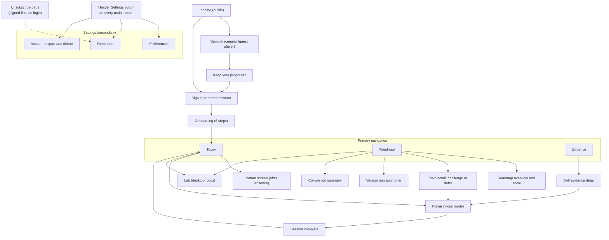

### 2.2 Navigation pattern *(Proposal)*

| Context | Phone (compact) | Desktop (wide) |
| --- | --- | --- |
| Primary nav | Bottom tab bar: Today, Roadmap, Evidence. Icon plus visible text. | Top bar, same order and labels. |
| Settings | Header button with the text "Settings", not an icon alone. | Header, right side. |
| Player | Focus mode: tab bar hidden, **Save and exit** top left, step count top right. | Same focus mode in a centred reading column. |
| Lab | Overview only (see §10). | Top nav stays visible; two-pane layout (W13). |
| Back | Browser or OS back from the player returns to Today; draft already saved. | Same. |
| Deep links | Each main screen and each open session has its own URL, so "Continue" links and reminder emails land in the right place. | Same. |

### 2.3 Screen inventory

Operation names follow the starting vocabulary in `00-conventions.md`;
`02-system-architecture.md` owns the final list.

| ID | Screen | Reached from | Wireframe | Main operations |
| --- | --- | --- | --- | --- |
| S01 | Landing | Public link | — | none |
| S02 | Sample scenario | S01 | W02–W05 | local only until claim |
| S03 | Keep your progress | End of sample | W07 | none |
| S04 | Sign in / create account | S01, S03, any guest prompt | — | `POST /v1/guest/claim` after sign-up |
| S05 | Onboarding | First sign-in | W09 | `PUT /v1/me/preferences`, `PUT /v1/me/goal`, `POST /v1/me/diagnostic`, `POST /v1/enrolments` |
| S06 | Today | Tab bar, after every session | W01 | `GET /v1/today` |
| S07 | Return screen | Today after an absence | W08 | `GET /v1/today` (return variant) |
| S08 | Player | Today, topic detail, skill detail | W02–W05 | `POST /v1/sessions`, `PUT …/draft`, `POST …/hints`, `POST …/reveal`, `POST …/attempts` |
| S09 | Session complete | Player | W06 | `POST /v1/sessions/{id}/complete` |
| S10 | Roadmap | Tab bar | W10 | `GET /v1/roadmaps/{slug}` |
| S11 | Roadmap overview and enrol | Roadmap, onboarding | — | `GET /v1/roadmaps`, `POST /v1/enrolments` |
| S12 | Topic detail | Roadmap row | — | `POST /v1/topics/{id}/challenge`, `POST /v1/topics/{id}/defer` |
| S13 | Version migration offer | Roadmap banner | W16 | `POST /v1/enrolments/{id}/migrate` |
| S14 | Roadmap completion summary | Last required topic completed | W11 | `GET /v1/evidence` |
| S15 | Evidence | Tab bar | W12 | `GET /v1/evidence` |
| S16 | Skill evidence detail | Evidence row | — | `GET /v1/evidence` |
| S17 | Lab | Today, Roadmap | W13 | `POST /v1/labs/{id}/artifacts` |
| S18 | Preferences | Settings | — | `GET/PUT /v1/me/preferences` |
| S19 | Reminders | Settings, onboarding | W14 | `GET/PUT /v1/me/notifications` |
| S20 | Account: export and delete | Settings | — | `POST /v1/me/export`, `DELETE /v1/me` |
| S21 | Unsubscribe confirmation | Email footer link | — | `POST /v1/notifications/unsubscribe` |

### 2.4 Guest and signed-in differences

| Area | Guest | Signed in |
| --- | --- | --- |
| Content | One sample scenario *(PRD §5)*. Further practice asks for an account. | All roadmap content for the enrolled version. |
| Today | Shows the sample result and "Create an account to keep it". | Full recommendation. |
| Roadmap | Read-only preview of modules and topics. **Enrol** asks for an account. | Enrol, pause, resume, challenge, defer, migrate. |
| Evidence | Sample evidence with the label **Saved on this device only**. | Full evidence, available on every device. |
| Settings | Theme, code-line wrapping, **Clear data on this device**. | Preferences, reminders, export, delete. |
| Reminders | Not offered (no email address). | Opt-in. |
| Storage | This browser only, with a stated expiry *(Open question 1)*. | Server-side; a local draft is kept only during interruptions. |

## 3. User journeys

Journeys are screen-level. The matching system sequences live in
`03-key-flows.md`; the rules behind each decision live in `05-learning-engine.md`.

### 3a. First visit: sample as guest, then keep progress

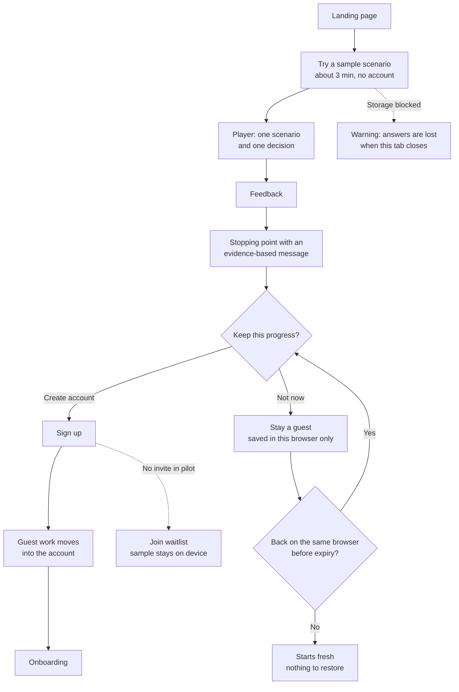

- The device-only message appears **before** the learner chooses, in plain words
  (W07). "Saved" alone is never used for guest work. *(PRD §5)*
- Pilot access is invite-only *(PRD §15)*; the waitlist branch is a Proposal
  *(Open question 2)*.

### 3b. Onboarding

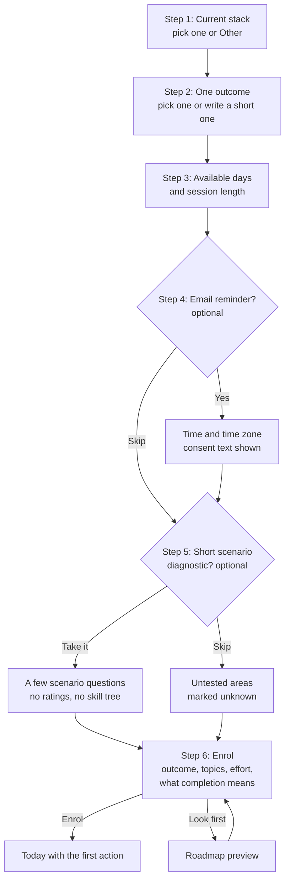

- Six steps, one question per screen, **Back** on every step, **Skip** on
  optional steps, progress shown as "Step 3 of 6" in text. *(Proposal)*
- Defaults are pre-filled from the PRD pilot schedule: three 10-minute sessions
  plus one optional lab a week, labelled "a starting point, not a rule". *(PRD §5)*
- Stack is context only. Copy says examples use Laravel/PHP and SQL and that
  the concepts are portable. *(PRD §8)*
- No skill tree and no "rate yourself on 30 technologies". Skipped diagnostic
  areas show as **Not checked yet** in Evidence, never as zero. *(PRD §5, F01)*
- Hypothesis: onboarding without the diagnostic takes under two minutes. Test
  in the concierge trial (`10-measurement-and-validation.md`).

### 3c. Daily loop

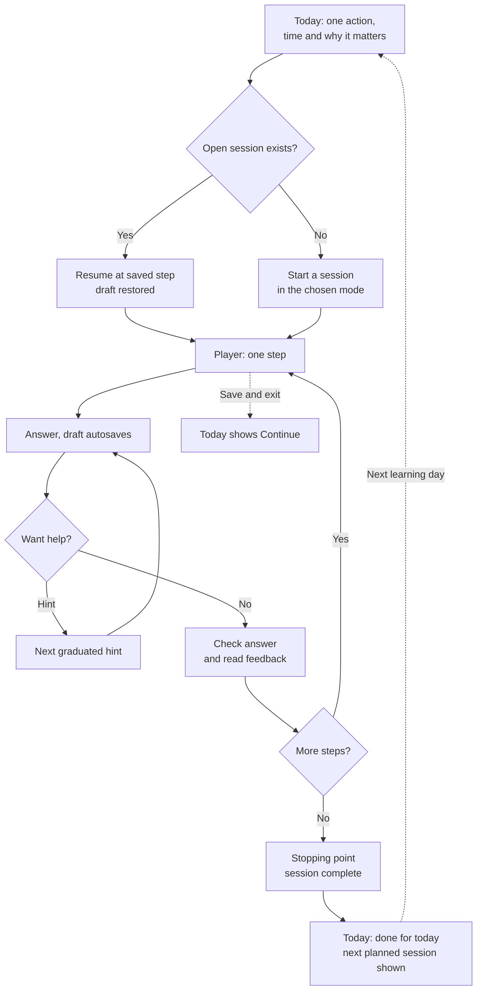

### 3d. "I'm tired": small mode or planned rest

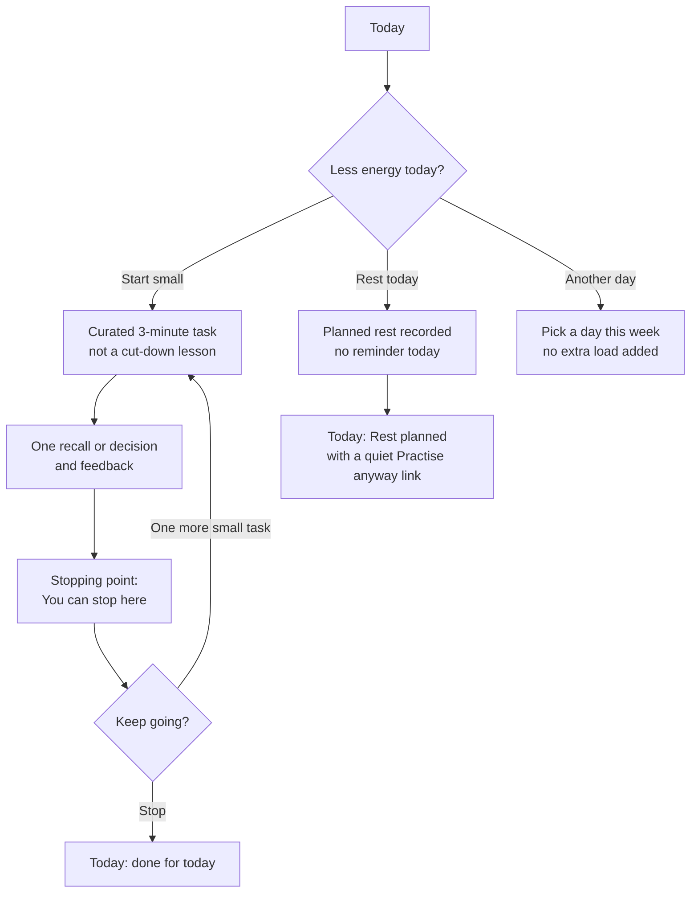

- **Start small** uses a curated equivalent, never a truncated lesson. *(PRD §9)*
- **Rest today** asks for no reason and is undoable the same day. Whether it
  suppresses that day's reminder is *Open question 7*.

### 3e. Return after absence

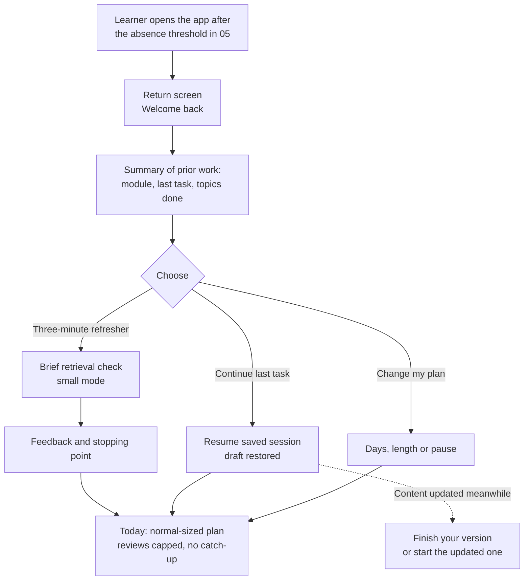

- The refresher is the primary button because the PRD asks to start with a
  brief retrieval check after a long absence. *(PRD §6, F06)*
- The screen never states how long the learner was away or how many sessions
  were missed. *(PRD §6)*

### 3f. Lab on desktop

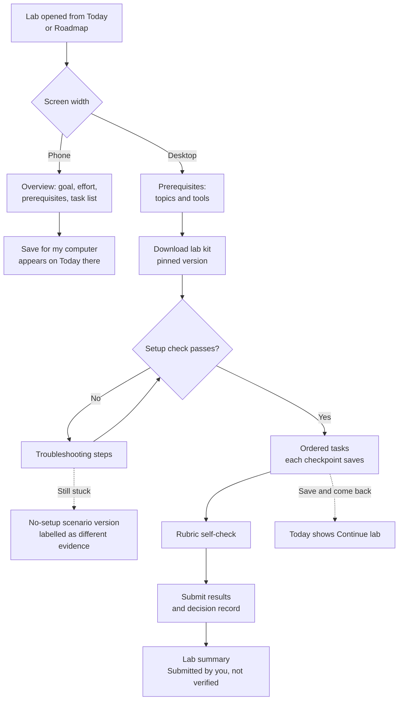

- Labs run on the learner's machine; DevStep never runs their code. The setup
  check is a command in the lab kit whose output the learner pastes. *(PRD §11,
  F07; kit details in `07-curriculum-plan.md`)*
- On a phone, **Open anyway** is available; nothing is blocked by width alone.
- The no-setup fallback comes from PRD §16 and is labelled on the evidence record.

### 3g. Roadmap: enrol, preview, pause and resume

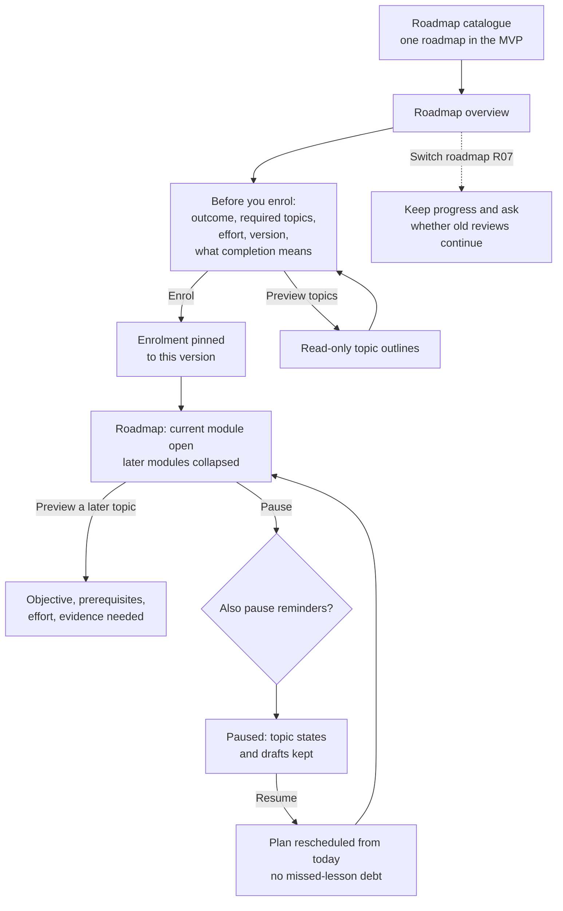

The enrolment screen (S11) must show, before the button *(PRD R01, §8A)*:

| Item | Example copy |
| --- | --- |
| Outcome | "Reason about performance, caching, background work and architecture choices in an app you already understand." |
| Required topics | "18 required topics in 6 modules. 6 optional labs." |
| Estimated effort | "About 6 weeks at three 10-minute sessions a week. Reviews can add time. Labs are extra." |
| Version | "Version 1.0. You stay on this version unless you choose to move." |
| What completion means | "Completing shows you covered each topic and passed a check on it. It does not verify that you can implement it; optional labs and Evidence show more." |

### 3g (continued). Challenge-out or defer

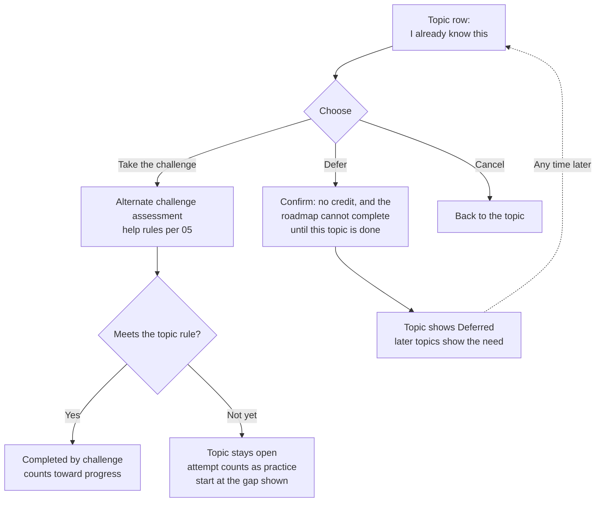

- The choice screen states both consequences side by side. Self-report alone is
  never offered as a skip. *(PRD §6, R03)*
- A failed challenge is framed as information: "This showed where to start."

### 3h. Evidence review

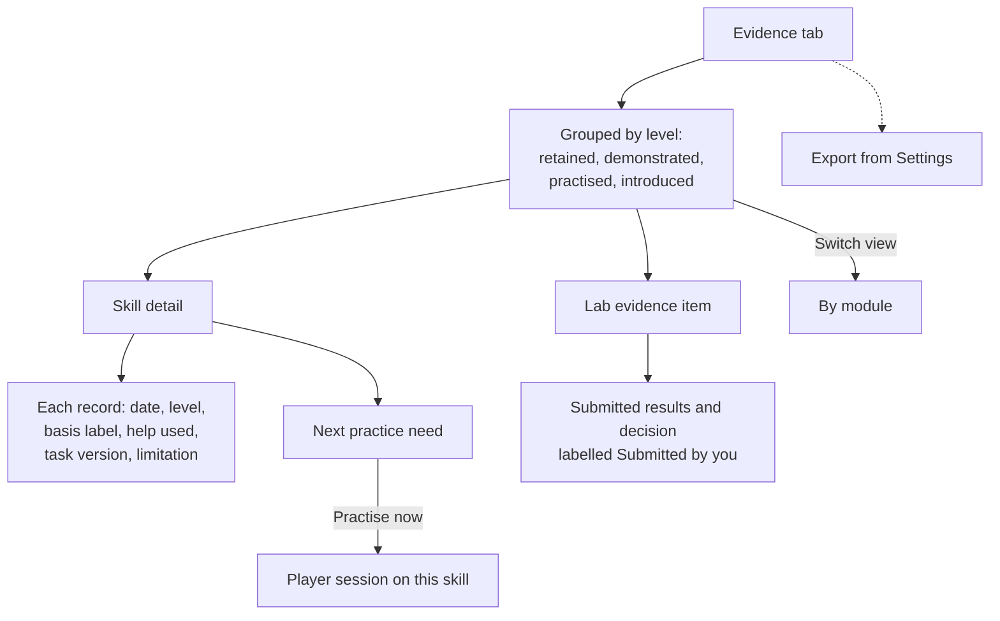

### 3i. Reminder settings

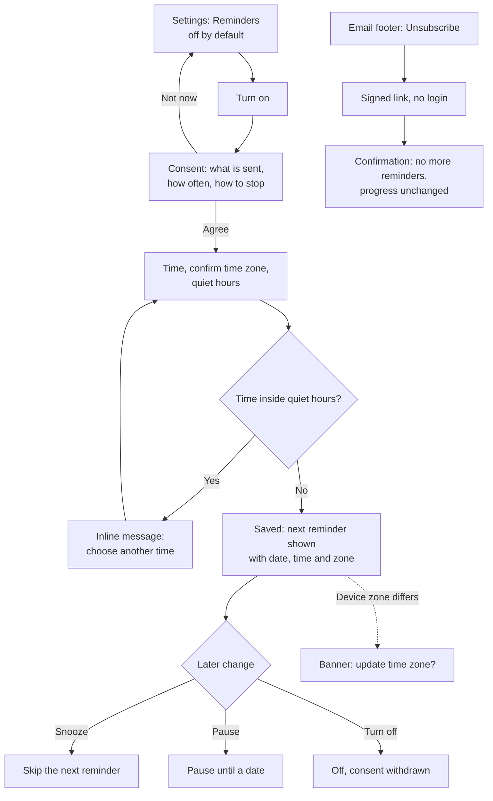

- Reminders only go out on learning days, at most one a day, and not when the
  learner has already practised that day. *(PRD §6, F10)*
- The time zone is detected from the device but always shown and confirmed;
  schedules use the learner's IANA time zone. *(PRD §11)*

### 3j. Export and delete account

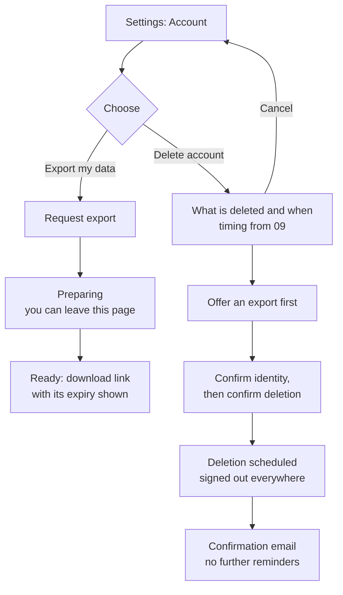

- Deletion copy states the PRD's proposed window ("active personal records are
  removed within 30 days") and links to the backup expiry policy owned by
  `09-security-privacy-ops.md`. *(PRD §12)*
- Guests get **Clear data on this device** instead, with no server step.

## 4. Low-fidelity wireframes

Phone frames are 40 characters wide; the lab is 80. Bracketed text is a
control; `[x]`/`[ ]` are checkboxes, `(X)`/`( )` radio buttons. Evidence icons
use the ASCII stand-ins defined in §9.3. These show content and hierarchy, not
visual design.

### W01 · Today

```text
+--------------------------------------+
| DevStep                   [Settings] |
+--------------------------------------+
| Today                                |
|                                      |
| From CRUD to Reliable Systems        |
| Module 2 > Query plans               |
| +----------------------------------+ |
| | Read a query plan to choose      | |
| | what to investigate              | |
| | About 10 min - Practise          | |
| | Includes 1 short review          | |
| |                                  | |
| | Why: the work-order dashboard is | |
| | slow. A plan shows where time    | |
| | goes before anyone adds servers. | |
| |                                  | |
| | [ Start ]                        | |
| +----------------------------------+ |
| [ Start small - about 3 min ]        |
| Rest today                           |
|                                      |
| This week: 1 of 3 sessions           |
| Any session counts.                  |
+--------------------------------------+
| [Today]    Roadmap    Evidence       |
+--------------------------------------+
```

Variants: **Continue** (card reads "Continue: Indexes and pagination · step 3
of 5 · your draft is saved"); **Done for today** ("Done for today. Next: Thu,
about 10 min." plus a quiet "Practise anyway"); **Desktop** adds one line,
"Optional lab ready: before/after experiment", below the card, never a second
card. The roadmap, module, topic and purpose line is required. *(PRD §8A, F02)*

### W02 · Player step: scenario and question

```text
+--------------------------------------+
| [<] Save and exit       Step 2 of 5  |
| Query plans - Practise               |
+--------------------------------------+
| Scenario                             |
| The work-order dashboard takes about |
| 4 s to load. The trace shows most of |
| that time in one SQL query.          |
|                                      |
| +----------------------------------+ |
| | SQL - 4 lines     [Wrap] [Copy]  | |
| | SELECT * FROM work_orders        | |
| |   WHERE site_id = 42             | |
| |   ORDER BY created_at DESC       | |
| |   LIMIT 50;                      | |
| +----------------------------------+ |
|                                      |
| Question                             |
| What would you investigate before    |
| adding servers?                      |
|                                      |
| ( ) Add a read replica               |
| ( ) Look at this query's plan        |
| ( ) Add more app servers             |
| ( ) Cache the whole dashboard        |
|                                      |
| [ Need a hint? ]                     |
|                                      |
| Draft saved                          |
| [ Check answer ]                     |
+--------------------------------------+
```

### W03 · Player hint, and reveal confirmation

```text
+--------------------------------------+
| [<] Save and exit       Step 2 of 5  |
+--------------------------------------+
| Question                             |
| What would you investigate before    |
| adding servers?                      |
|                                      |
| +- Hint 1 of 3 --------------------+ |
| | Where does the trace say the     | |
| | time goes? Start there.          | |
| |                                  | |
| | [ Show hint 2 ]                  | |
| +----------------------------------+ |
| Hints are optional. Using one is     |
| recorded and still counts as         |
| practice.                            |
|                                      |
| ( ) Add a read replica               |
| (X) Look at this query's plan        |
| ( ) Add more app servers             |
| ( ) Cache the whole dashboard        |
|                                      |
| Saving...                            |
| [ Check answer ]                     |
+--------------------------------------+

Reveal confirmation (dialog). "Show solution" appears only after the last
hint or after an incorrect attempt (IR-04).
+--------------------------------------+
| Show the solution?                   |
|                                      |
| You can keep learning after this.    |
| This question won't count as         |
| demonstrated, and a fresh question   |
| on the same idea will come back      |
| later.                               |
|                                      |
| [ Keep trying ]                      |
| [ Show solution ]                    |
+--------------------------------------+
```

### W04 · Player feedback

```text
+--------------------------------------+
| [<] Save and exit       Step 2 of 5  |
+--------------------------------------+
| Your answer                          |
| Look at this query's plan            |
|                                      |
| [ok] A good first move               |
| The trace puts most of the time in   |
| one query. Its plan shows whether    |
| the database reads the whole table,  |
| so you can test a cheap fix before   |
| buying capacity.                     |
|                                      |
| [>] Why not the other options?       |
| [>] Worked example: reading a plan   |
|                                      |
| Help used: 1 hint                    |
|                                      |
| [ Next: one changed condition ]      |
+--------------------------------------+
```

Incorrect variant: "[!] Not quite" heading, an explanation of why the chosen
option may not help under the stated assumptions, the worked example expanded,
and "A similar question will come back sooner." Status is carried by the
marker and the word, never by colour alone. *(PRD §5 step 5, §9)*

### W05 · Open-ended response with self-check

```text
+--------------------------------------+
| [<] Save and exit       Step 4 of 5  |
+--------------------------------------+
| Your explanation                     |
| "Index site_id and created_at so the |
| sort can use the index..."           |
|                                      |
| Compare with an example answer       |
| [>] Show example answer              |
|                                      |
| Does yours...                        |
| [ ] name what the plan showed?       |
| [ ] say what you would measure?      |
| [ ] state one limitation?            |
|                                      |
| This is self-assessed. A person has  |
| not reviewed it.                     |
|                                      |
| [ Next ]                             |
+--------------------------------------+
```

### W06 · Stopping point: session complete

```text
+--------------------------------------+
| Session complete                     |
+--------------------------------------+
| You used a query plan to choose an   |
| investigation.                       |
|                                      |
| You can stop here.                   |
|                                      |
| What you did                         |
| - Found the slow query in a trace    |
| - Read a plan and chose a test       |
| - Handled a changed condition,       |
|   with 1 hint                        |
|                                      |
| Evidence recorded                    |
| (+) Query plans - Practised          |
|     Checked automatically            |
|                                      |
| Not shown yet: reading a different   |
| plan without help. A check like that |
| comes back in a few days.            |
|                                      |
| Topic: Query plans - 2 of 3 parts    |
| Next planned: Thu, about 10 min      |
|                                      |
| [ Back to Today ]                    |
| One more task (optional)             |
+--------------------------------------+
```

The headline is the evidence-based reward from PRD §5. Effort recognition, if
any, sits in "What you did", never in the evidence block. *(PRD §6)*

### W07 · Guest: keep your progress

```text
+--------------------------------------+
| Sample complete                      |
+--------------------------------------+
| You used a trace to decide what to   |
| investigate first.                   |
|                                      |
| Where this is saved                  |
| Only in this browser on this device. |
| It is lost if you clear browser      |
| data, close a private window or      |
| switch devices. Kept here for up to  |
| 30 days.                             |
|                                      |
| [ Create an account to keep it ]     |
| Your answer and feedback move into   |
| your account.                        |
|                                      |
| Not now                              |
| Already have an account? Sign in     |
+--------------------------------------+
```

### W08 · Return screen

```text
+--------------------------------------+
| DevStep                   [Settings] |
+--------------------------------------+
| Welcome back.                        |
| Continue your last task or try a     |
| three-minute refresher.              |
|                                      |
| Where you left off                   |
| Module 2: Investigate performance    |
| Last task: Indexes and pagination,   |
| step 3 of 5. Your draft is saved.    |
| Topics completed: 5 of 18            |
|                                      |
| [ Three-minute refresher ]           |
| [ Continue last task ]               |
|                                      |
| Your plan picks up from here.        |
| Change my plan                       |
| Pause this roadmap                   |
+--------------------------------------+
| [Today]    Roadmap    Evidence       |
+--------------------------------------+
```

### W09 · Onboarding step (3 of 6)

```text
+--------------------------------------+
| [<] Back                 Step 3 of 6 |
+--------------------------------------+
| When could you practise?             |
| Pick days that usually work. You can |
| change this any time.                |
|                                      |
| [x] Mon  [ ] Tue  [x] Wed  [ ] Thu   |
| [x] Fri  [ ] Sat  [ ] Sun            |
|                                      |
| Usual session length                 |
| ( ) About 3 min - Start small        |
| (X) About 10 min - Practise          |
|                                      |
| Optional weekly lab                  |
| 30-45 min on a computer              |
| [x] Offer me a lab when one is ready |
|                                      |
| Suggested start: three 10-minute     |
| sessions and one optional lab a      |
| week. A starting point, not a rule.  |
|                                      |
| [ Continue ]                         |
+--------------------------------------+
```

### W10 · Roadmap

```text
+--------------------------------------+
| Roadmap                    [Options] |
+--------------------------------------+
| From CRUD to Reliable Systems        |
| Version 1.0 - enrolled 2 Sep         |
|                                      |
| 5 of 18 required topics - 28%        |
| [######..............]               |
| Completion shows coverage, not       |
| mastery. Skills are in Evidence.     |
|                                      |
| [>] 1 Understand a system      3/3   |
| [v] 2 Investigate performance  2/3   |
|   [x] Latency evidence   Completed   |
|   [x] Query plans        Completed   |
|   [~] Indexes and pagination         |
|       In progress, about 20 min left |
|       Needs: Query plans (done)      |
|       Done when: attempt, feedback   |
|       review and a topic check       |
|       [ Continue ]                   |
|       I already know this            |
|   Lab: before/after experiment       |
|       Optional, 30-45 min, computer  |
| [>] 3 Introduce caching    Preview   |
| [>] 4 Background work      Preview   |
| [>] 5 Reliability and growth         |
| [>] 6 Choose architecture  Preview   |
+--------------------------------------+
| Today    [Roadmap]    Evidence       |
+--------------------------------------+
```

- Default disclosure: current module open, others collapsed; later modules say
  **Preview** and expand on request. *(PRD §10 "avoid exposing every future
  topic by default"; Open question 5)*
- Optional topics and labs carry the word **Optional** and are excluded from the
  count. *(PRD §8A)*
- **Options** menu: Pause roadmap, Change pace (opens Preferences), Show all
  topics, Version details, Switch roadmap (shown once R07 adds roadmaps).

### W11 · Roadmap completion summary

```text
+--------------------------------------+
| Roadmap complete                     |
+--------------------------------------+
| From CRUD to Reliable Systems 1.0    |
| 18 of 18 required topics - 100%      |
| Completed 14 Nov 2026                |
|                                      |
| What this means                      |
| You covered every required topic and |
| passed a check on each. This shows   |
| coverage and checked understanding,  |
| not verified implementation skill.   |
|                                      |
| Skills by evidence level             |
| (@) Retained          5              |
| (#) Demonstrated      9              |
|     3 of these self-assessed         |
| (+) Practised         4              |
|                                      |
| Optional labs: 4 of 6 submitted      |
| Submitted by you, not verified.      |
|                                      |
| Reviews continue for 13 skills.      |
| They never undo this milestone.      |
|                                      |
| What next? Nothing starts until you  |
| choose.                              |
| [ Maintenance practice ]             |
| [ See other roadmaps ]               |
| [ Take a break ]                     |
+--------------------------------------+
```

No confetti or animation. **See other roadmaps** shows a "more coming" note
until R07 ships; no automatic enrolment. *(PRD §8A, R04)*

### W12 · Evidence

```text
+--------------------------------------+
| Evidence                             |
+--------------------------------------+
| What you can show, with dates and    |
| limits. Separate from roadmap        |
| completion.                          |
| View: [By level]  By module          |
|                                      |
| (@) RETAINED - 1 skill               |
|   Request path             24 Sep    |
|   Different check, 10 days later.    |
|   Checked automatically.             |
|                                      |
| (#) DEMONSTRATED - 2 skills          |
|   Component boundaries     18 Sep    |
|   Self-assessed against an example.  |
|   Not reviewed by a person.          |
|   Query plans              30 Sep    |
|   Checked automatically. Retention   |
|   check from 7 Oct.                  |
|                                      |
| (+) PRACTISED - 3 skills     [Show]  |
| (.) INTRODUCED - 2 skills    [Show]  |
|                                      |
| Lab evidence - 1 item                |
|   Before/after query test   2 Oct    |
|   Submitted by you: local results,   |
|   not verified by DevStep.           |
|                                      |
| Next practice                        |
|   Indexes: one unassisted attempt    |
|   on a new scenario.                 |
|   [ Practise now ]                   |
+--------------------------------------+
| Today     Roadmap    [Evidence]      |
+--------------------------------------+
```

- Each skill appears once, under its highest current level. Skill detail (S16)
  lists every record with date, level, basis, help used, task version and a
  plain limitation. *(PRD F04, F08)*
- Skills never attempted (including skipped diagnostic areas) appear under a
  collapsed **Not checked yet** group, not as zero. *(PRD F01)*

### W13 · Lab (desktop, 80 characters)

```text
+------------------------------------------------------------------------------+
| DevStep      Today      Roadmap      Evidence                    [Settings]  |
+------------------------------------------------------------------------------+
| Lab 2: Before/after query experiment             Optional, about 30-45 min   |
| Module 2: Investigate performance       Lab kit 1.0 - progress saved 19:42   |
+----------------------------+-------------------------------------------------+
| Before you start           | Task 3 of 5: Compare one change                 |
| Recommended topics         | Goal: test one index and record what changed.   |
| [x] Query plans            |                                                 |
| [~] Indexes and pagination | 1. In the lab kit, add the index described in   |
| Tools: listed in the kit   |    this task's notes.                           |
|                            | 2. Run the same plan command as in Task 2.      |
| Setup check                | 3. Paste the new plan summary below.            |
| [x] Lab kit downloaded     |                                                 |
| [x] Setup check passed     | +- Your result: plan output ------------------+ |
|     (pasted 2 Oct)         | | Index Scan using work_orders_site_created   | |
|                            | | ...                                         | |
| Tasks                      | +---------------------------------------------+ |
| [x] 1 Seed synthetic data  | Checkpoint: result pasted               Saved   |
| [x] 2 Record a baseline    |                                                 |
| [>] 3 Compare one change   | Rubric self-check (4 criteria)                  |
| [ ] 4 Note limitations     | [x] I changed one thing at a time               |
| [ ] 5 Submit evidence      | [ ] I used the same data for both runs          |
|                            | [ ] I recorded timings from the plan output     |
| Rubric                     | [ ] I noted at least one limitation             |
| 4 criteria  [View all]     |                                                 |
|                            | [ Save and come back later ]   [ Next task > ]  |
+----------------------------+-------------------------------------------------+
| What you submit is labelled "Submitted by you". DevStep does not run your    |
| code; checks run on your machine.                                            |
+------------------------------------------------------------------------------+
```

Phone variant: the left column becomes the whole screen, tasks are readable,
and the primary button is **Save for my computer**. Task content and rubric
criteria come from `07-curriculum-plan.md`; the ones above are placeholders.

### W14 · Reminder settings

```text
+--------------------------------------+
| [<] Settings             Reminders   |
+--------------------------------------+
| Email reminders                [On]  |
| At most one email on a learning day, |
| and none if you've already practised |
| that day.                            |
| Sent to a***@example.com             |
|                                      |
| Days: your learning days             |
| Mon, Wed, Fri          [Change days] |
|                                      |
| Time           [ 18:30           ]   |
| Time zone      [ Europe/London   v ] |
|                Detected from device  |
|                                      |
| Quiet hours                          |
| No email from [ 21:30 ] to [ 07:30 ] |
|                                      |
| Next reminder: Wed 7 Oct, 18:30      |
| (Europe/London)                      |
|                                      |
| [ Skip the next one ]                |
| [ Pause until a date ]               |
| Turn off reminders                   |
|                                      |
| [ Save ]                             |
+--------------------------------------+
```

Reminder days are a subset of learning days, so "at most one per scheduled
learning day" holds by construction. *(PRD §6, F10)*

## 5. Screen state catalogue

Every screen in §2.3 must define the states below where they apply. W15 and
W16 follow the table.

| State | Where | What the learner sees | Actions | Never |
| --- | --- | --- | --- | --- |
| Loading | Today, Roadmap, Evidence, Player | Layout-shaped placeholders with the real heading. After about 1 s: "Getting your next step…" *(Proposal)* | none | Blank screen; spinner covering a typed answer. |
| Empty | Evidence, Roadmap (not enrolled) | "Nothing here yet. Evidence appears after your first answer with feedback." / "Choose a roadmap to get a daily next step." | Go to Today; See roadmap | Sample data dressed as real progress. |
| Offline, unsynced draft | Player, Lab | Banner: "You're offline. Your answer is saved on this device and will sync when you reconnect." Indicator: "Saved on this device, not synced". **Check answer** disabled with the reason shown. | Keep writing; Save and exit | Discarding the local draft; showing "Saved" for a local-only draft. *(PRD §12)* |
| Sync conflict | Player, Lab | W15: both versions with device and time; learner chooses. | Keep this device's; Keep the other | Silent overwrite or last-write-wins without asking. *(PRD §12)* |
| Completed elsewhere | Player | "You finished this session on another device." Any unsynced local text is offered for copying. | Back to Today | Double credit (completion is idempotent, F09). |
| Error | Any | "Couldn't load Today. Your progress is safe." / "Couldn't check your answer. It's saved; try again." | Try again | Losing the answer; error codes as the only message. |
| Signed out mid-task | Player, Lab | "You've been signed out. Your answer is saved on this device. Sign in to continue." Returns to the same step. | Sign in | Expiring work (no timed answers). |
| Content exhausted | Today | "You've done everything available right now. Next review: Thu." | Revisit a deferred topic; Optional lab; Rest | Filler tasks; unreviewed content. |
| All prerequisites unmet | Today, Roadmap | "The next topics build on Query plans, which is deferred. Start it (about 10 min) or take its challenge." Rows read "Needs: Query plans (deferred)". | Start; Take the challenge; Preview | A dead end; a padlock with no explanation. |
| Enrolment paused | Today, Roadmap | "Your roadmap is paused. Progress and drafts are kept." Roadmap header: "Paused since 3 Oct". | Resume; Three-minute refresher | "You're losing progress"; auto-resume countdown. *(R05)* |
| Roadmap completed | Today | Maintenance card: "Maintenance: 1 short review, about 3 min." | Start; See other roadmaps; Take a break | Automatic enrolment. *(PRD §8A)* |
| New roadmap version | Roadmap banner only | "Version 1.1 is available. You can stay on 1.0." → W16 | See changes; Not now | Silent migration; unexplained drop in percentage. *(R06)* |
| Content updated mid-session | Player | "This task was updated after you started. Finish your version or start the updated one. Your history is kept." | Finish mine; Start updated | Losing the draft or past evidence. *(PRD §12)* |
| Guest storage unavailable | Sample | "This browser isn't saving. Your answers will be lost when you close this tab." | Create an account; Continue anyway | Implying the work is saved. |
| Lab setup fails | Lab | "The setup check didn't pass." Troubleshooting list, then "Still stuck? Try the no-setup version. It is recorded as different evidence." | Retry check; No-setup version | Blocking the roadmap on lab setup (labs are optional). *(PRD §16)* |
| Missed planned session | Today | Normal recommendation; at most "Your plan moved on. Nothing to catch up." | Start; Start small | "You missed…", doubled load. *(PRD §6)* |

### W15 · Sync conflict

```text
+--------------------------------------+
| [!] Changed on another device        |
+--------------------------------------+
| This answer was edited on two        |
| devices. Choose which to keep.       |
|                                      |
| This device - edited 14:02           |
| +----------------------------------+ |
| | Check the plan for a sequential  | |
| | scan on work_orders, then...     | |
| +----------------------------------+ |
| Another device - edited 13:55        |
| +----------------------------------+ |
| | Look at the trace first...       | |
| +----------------------------------+ |
|                                      |
| [ Keep this device's ]               |
| [ Keep the other one ]               |
| The one you don't keep stays below   |
| your answer to copy from until you   |
| submit.                              |
+--------------------------------------+
```

### W16 · New roadmap version: migration offer

```text
+--------------------------------------+
| Version 1.1 is available             |
+--------------------------------------+
| You're on 1.0 and can stay on it.    |
|                                      |
| What changes (illustrative)          |
| + New required topic: Read replicas  |
| ~ Updated: Cache invalidation        |
|   Your completion is kept.           |
| - Retired: none                      |
|                                      |
| Your credit                          |
| Kept: all 12 completed topics        |
| Now:   12 of 18 required - 67%       |
| After: 12 of 19 required - 63%       |
| The percentage changes only because  |
| a required topic was added.          |
|                                      |
| [ Move to 1.1 ]                      |
| [ Stay on 1.0 ]                      |
| Full change notes                    |
+--------------------------------------+
```

Which credit carries over is decided by `05-learning-engine.md` and
`06-content-system.md`; this screen only has to show it before the learner
decides. *(PRD R06)*

## 6. Interaction rules

| ID | Rule | Detail | Basis |
| --- | --- | --- | --- |
| IR-01 | One step at a time | The player shows one step: scenario, explanation, question or feedback. Earlier steps are available read-only under **Earlier steps**. Position is text ("Step 2 of 5"), not only a bar. | PRD F03, §10 |
| IR-02 | Draft autosave with visible status | Saves while typing (debounced) and always before a step change. Indicator states: **Saving…**, **Saved**, **Saved on this device, not synced**, **Couldn't save, retrying**. Only the last two are announced to screen readers. | PRD §12, F03 |
| IR-03 | Hints optional and graduated | Never shown automatically. Each level needs a deliberate tap: a nudge, then a narrower pointer, then a worked example (the number per item is authored, see 06). Hints never block **Check answer**. The count is recorded as assistance. | PRD §6, §9 |
| IR-04 | Reveal needs confirmation | **Show solution** appears after the last hint or after an incorrect attempt *(Open question 4)*. The dialog (W03) says the question won't count as demonstrated and a fresh one will come back. Learning continues afterwards. | PRD §9 |
| IR-05 | No countdown timers | Time appears only as estimates ("about 10 min"). No visible timer, no auto-submit, no session expiry that discards work. | PRD §5, §10 |
| IR-06 | Capped reviews, no overdue counter | At most 2 review items in `practise`, 1 in `small`. Today says "Includes 1 short review"; no screen shows a backlog total, an overdue badge or red counts. | PRD §6, §9 |
| IR-07 | Explicit stopping points | Every session ends on a screen that says "You can stop here." **One more task** is secondary and never starts by itself. | PRD §5, §10 |
| IR-08 | Leave at any time | **Save and exit** is always visible in the player. No "are you sure?" when the draft is saved. | PRD R05 |
| IR-09 | Limited choice on Today | One primary action, at most two secondary ones (Start small or Continue, Rest today). No browsing needed to start. | PRD F02 |
| IR-10 | Feedback before moving on | **Next** sits inside the feedback panel, so feedback is seen before the next step. Practised evidence depends on engaging with feedback. | PRD §9 |
| IR-11 | Open-ended answers | After submitting, show an example answer and a short self-check (W05). The record is labelled **Self-assessed**. | PRD §9 |
| IR-12 | Safe repeat taps | **Check answer** and **Finish** disable on press and show "Checking…"; repeat taps cannot create duplicate attempts or completions. | PRD F09, R02 |
| IR-13 | No surprise navigation | Nothing auto-advances to a new session, step or roadmap. Every transition follows a learner action. | Proposal |
| IR-14 | Context on every task | Today and the player header show roadmap, module, topic and practical purpose. | PRD §8A |
| IR-15 | No free text to analytics | Interaction events carry IDs, mode, content version and timestamps only (event list in 10). | PRD F12, §12 |

## 7. Microcopy guide

### 7.1 Voice

- Plain, specific and calm. Short sentences, second person, sentence case.
- Name the concrete thing the learner did or will do.
- No exclamation marks in assessment feedback; no emoji in learning content.
- British spelling: *practise* (verb), *practice* (noun), *behaviour*, *colour*.
- Never imply a clinical benefit or that the app cures procrastination. *(PRD §2, §4)*

### 7.2 Do and don't

| Situation | Do | Don't |
| --- | --- | --- |
| Session reward | "You used a query plan to choose an investigation." | "You mastered database scaling!" |
| Effort recognition | "You started after a busy week." (kept apart from evidence) | "+50 XP! Level up!" |
| Corrected misconception | "You changed your answer after reading the plan. That is the skill." | "Finally got it right." |
| Incorrect answer | "Not quite. The plan shows a full table scan, so a replica would copy the slow read." | "Wrong!" or a red cross with no explanation. |
| Return after absence | "Welcome back. Continue your last task or try a three-minute refresher." | "You've been gone 23 days. Your streak is lost." |
| Missed session | "Your plan moved on. Nothing to catch up." | "You missed 3 sessions. You're falling behind." |
| Weekly progress | "1 of 3 sessions this week. Any session counts." | "Only 2 days left to hit your goal!" |
| Tired | "Start small: one question, about 3 minutes. Or rest today." | "No excuses. Keep the chain going." |
| Reminder subject | "Your 10-minute task: read a query plan" | "Don't lose your progress!" |
| Technology relevance | "Optional: relevant if your app runs background jobs." | "Learn this or become obsolete." |
| Comparison | (none: never compare learners) | "You're ahead of 70% of learners." |
| Self-assessed evidence | "Self-assessed against an example answer. Not reviewed by a person." | "Verified." |
| Learner-submitted evidence | "Submitted by you: local test results. Not verified by DevStep." | "Certified." |
| Completion percentage | "5 of 18 required topics (28%). Completion shows coverage, not mastery." | "28% mastered." |
| Revealed solution | "You saw the solution, so this one won't count as demonstrated. A fresh question will come back." | Silence, or "Cheating doesn't help." |
| Defer | "Deferred, no credit. Come back or take the challenge any time." | "Skipped" with a tick. |
| Pause | "Paused. Your progress and drafts are kept." | "Are you sure you want to give up?" |
| Unsubscribe | "You won't get reminder emails. Your progress is unchanged." | "We're sad to see you go." |
| Guest storage | "Saved only in this browser on this device." | "Your progress is saved." |
| Time labels | "About 10 min" | "10:00 remaining" |

### 7.3 Display labels for canonical enums

| Enum value | Label shown | Short explanation (skill detail, help text) |
| --- | --- | --- |
| Session mode `small` / `practise` / `build` | Start small / Practise / Build | About 3 min / about 10 min / 30–45 min on a computer |
| Topic `not_started` | Not started | — |
| Topic `in_progress` | In progress | — |
| Topic `completed` | Completed (or "Completed by challenge") | Activities and topic check done, or challenge passed. |
| Topic `deferred` | Deferred, no credit | Moved aside; the roadmap can't complete until it's done. |
| Topic kind `optional` | Optional | Not counted in progress. |
| Evidence `introduced` | Introduced | You've met the concept. |
| Evidence `practised` | Practised | You attempted it and reviewed feedback. |
| Evidence `demonstrated` | Demonstrated | You met the rubric on a different scenario without the solution. |
| Evidence `retained` | Retained | You passed a different check at least 7 days later. |
| Basis `auto_scored` | Checked automatically | Scored against an authored answer key. |
| Basis `self_assessed` | Self-assessed | You compared your answer with an example. |
| Basis `learner_submitted` | Submitted by you | Results from your machine; not verified by DevStep. |
| Basis `human_reviewed` | Reviewed by a person | A reviewer checked it against the rubric. |
| Assistance `none` / `hint` / `worked_example` / `solution_revealed` | No help / Used N hints / Used a worked example / Solution shown | Shown on every evidence record. |

## 8. Accessibility acceptance checklist

These are product acceptance requirements, not a claim of certified compliance
*(PRD §10)*. WCAG 2.2 success criteria are cited as a checking reference.

| ID | Requirement | How to check | Reference |
| --- | --- | --- | --- |
| A-01 | Every action works by keyboard alone, in a logical order, with no traps. | Complete onboarding, a `practise` session, a lab task and reminder setup with keyboard only. | 2.1.1, 2.1.2, 2.4.3 |
| A-02 | Focus is always visible in both themes and never hidden by sticky headers or tab bars. | Tab through every screen at 100% and 200% zoom. | 2.4.7, 2.4.11 |
| A-03 | Landmarks (header, nav, main), one `h1` per screen, step title as heading; skip link to main content. | Screen reader heading and landmark lists. | 1.3.1, 2.4.1 |
| A-04 | All controls have accessible names; icon buttons have text; evidence icons always have a text label. | Screen reader pass on W01–W16 equivalents. | 4.1.2, 1.1.1 |
| A-05 | Feedback results, offline, conflict and save-failure messages are announced politely; routine autosaves are not. | Screen reader on desktop and mobile. | 4.1.3 |
| A-06 | Focus management: on **Next**, focus moves to the new step heading; on feedback, to the feedback heading; dialogs take focus, trap it, close with Escape and return focus to the trigger; errors move focus to the error summary; **Save and exit** lands on Today's `h1`. | Scripted walkthrough per transition. | 2.4.3, 3.2.1 |
| A-07 | Mobile code blocks: monospace at least 14 CSS px *(Proposal)*, line height about 1.4, no wrap by default, horizontal scroll inside the block only, a **Wrap** toggle remembered per device, and a **Copy** button. | Check every W02-type block at 320 CSS px width. | 1.4.10 |
| A-08 | A scrollable code block is focusable, named (for example "SQL, 4 lines, scrolls sideways") and scrolls with arrow keys. Line numbers, if any, are not copied or read. | Keyboard and screen reader on a long query plan. | 2.1.1, 1.3.1 |
| A-09 | The page never scrolls sideways at 320 CSS px; only code and plan blocks may. | Resize test on every screen. | 1.4.10 |
| A-10 | Text resizes to 200% without loss of content or controls. | Browser zoom and OS text size. | 1.4.4 |
| A-11 | Reduced motion: the OS setting is honoured, transitions removed, no parallax, nothing essential conveyed by motion; completion is static. | Toggle OS setting; repeat W06, W11. | 2.3.3 |
| A-12 | Status never relies on colour alone: correct/incorrect uses a marker and a word; topic states use markers and text; progress bars have a count; diffs use `+`/`-`. | Greyscale review of every state in §5. | 1.4.1 |
| A-13 | Contrast: text at least 4.5:1, large text and UI components at least 3:1, in light and dark themes, including syntax highlighting. | Contrast tool on tokens and both code themes. | 1.4.3, 1.4.11 |
| A-14 | Light and dark themes follow the system setting, with a manual override in Preferences. | Switch both ways on each screen. | Proposal |
| A-15 | No timed answers: no countdowns, no auto-advance; sign-in expiry keeps the draft and returns to the same step. | Leave a step open past session expiry. | 2.2.1 |
| A-16 | Targets at least 24 × 24 CSS px; primary actions, tab bar items and choice rows about 44 × 44 *(Proposal)*. | Measure on W01, W02, W09. | 2.5.8 |
| A-17 | Forms: visible labels, text errors beside the field and in a summary; time can be typed; time-zone picker is searchable. | Keyboard and screen reader on W09, W14. | 3.3.1, 3.3.2 |
| A-18 | No single-key shortcuts in the MVP (or they can be turned off). | Review key handlers. | 2.1.4 |
| A-19 | Page language set to `en-GB`; abbreviations expanded on first use in content. | Markup review; content checklist in 06. | 3.1.1 |
| A-20 | Illustrations have text alternatives; decorative images are hidden from assistive technology. No audio or video in the MVP. | Screen reader pass. | 1.1.1 |
| A-21 | Release check: keyboard only, one desktop and one mobile screen reader (for example NVDA on Windows and VoiceOver on iOS), 200% zoom, 320 px width, reduced motion, both themes. Automated checks supplement but never replace this. | Recorded per release in the pilot readiness checklist (12). | Proposal |

Content-side duties (alt text, code line length, plain language) belong to the
per-mission accessibility review in `06-content-system.md`. *(PRD §8)*

## 9. Minimal design system

### 9.1 Tokens

Semantic tokens only, resolved per theme. Values are chosen in the design phase
and contrast-checked (A-13); none are set here.

```yaml
# Illustrative structure, not values
color:
  text: [primary, secondary]
  surface: [base, raised, sunken]
  border: [default, strong]
  focus: ring
  action: [primary, primary-text, quiet]
  status: [positive, attention, info]   # always paired with a marker and text
  code: [background, text, syntax-*]    # syntax palette contrast-checked per theme
type:
  family: [ui, mono]
  size: [sm, base, lg, xl]              # base at least 16 CSS px; mono at least 14
space: [1, 2, 3, 4, 6, 8]               # multiples of a 4 CSS px unit
radius: [sm, md]
motion:
  duration: [none, short]               # none under reduced motion
breakpoint: [compact, medium, wide]     # see §10
theme: [light, dark]                    # system default, manual override
```

### 9.2 Component inventory

Kept to sixteen. A new component needs a reason that an existing one cannot meet.

| Component | Used on | Notes |
| --- | --- | --- |
| App shell | All main screens | Header with Settings; tab bar (phone) or top nav (desktop). |
| Button | All | Primary, secondary, quiet (link-style). One primary per view. |
| Action card | Today | Title, time estimate, mode, context line, reason, one button. |
| Step container | Player | Heading, body, footer actions, autosave indicator. |
| Code block | Player, Lab | Language label, line count, Wrap, Copy, focusable scroll region. |
| Choice list | Player, Onboarding | Single or multiple choice; full-row targets. |
| Text answer | Player, Lab | Multi-line; autosave indicator; paste-friendly for lab output. |
| Hint panel | Player | Graduated levels with "Hint N of M". |
| Feedback panel | Player | Marker and word, explanation, help used, **Next**. |
| Dialog | Reveal, defer, delete | Confirmations only; never for promotion. |
| Disclosure row | Roadmap, Evidence, Feedback | Expand and collapse with state announced. |
| Status marker | Roadmap, Evidence, Feedback | Icon shape plus text label (§9.3). |
| Progress count | Roadmap, Today, Summary | "N of M" first, percentage second, optional bar. |
| Banner | Offline, conflict, paused, version | Inline and persistent until resolved; no toasts. |
| Form controls | Onboarding, Settings | Day chips, toggle, select, time input. |
| Placeholder and empty block | All | Layout-shaped loading; empty state with one action. |

Deliberately excluded: toasts (easy to miss), numeric badges, carousels,
confetti, leaderboards, streak flames.

### 9.3 Evidence and topic iconography

Shape carries the meaning; colour is decoration. The text label is always shown
beside the icon, including in compact rows.

| Level | Icon shape | Wireframe stand-in | Label |
| --- | --- | --- | --- |
| `introduced` | Outline circle | `(.)` | Introduced |
| `practised` | Half-filled circle | `(+)` | Practised |
| `demonstrated` | Filled circle | `(#)` | Demonstrated |
| `retained` | Filled circle with outer ring | `(@)` | Retained |

| Topic state | Marker | Label |
| --- | --- | --- |
| `not_started` | Empty square | Not started |
| `in_progress` | Square with partial fill | In progress |
| `completed` | Square with tick | Completed |
| `deferred` | Square with dash | Deferred, no credit |

Basis is shown as a text tag, never an icon alone: **Checked automatically**,
**Self-assessed**, **Submitted by you**, **Reviewed by a person**.

## 10. Phone and desktop responsibilities

Breakpoints *(Proposal)*: compact below 600 CSS px, medium 600–1023, wide
1024 and above. Reading columns stay at about 70 characters on every size.

| Task | Phone | Desktop |
| --- | --- | --- |
| Sample scenario | Primary target | Supported |
| Onboarding | Primary target | Supported |
| Today | Primary target | Supported; adds an "Optional lab ready" line |
| `small` and `practise` sessions | Primary design target *(PRD §1)* | Supported in a centred column |
| `build` labs | Overview, prerequisites, task list, **Save for my computer**; **Open anyway** allowed | Primary: setup check, tasks, pasted output, checkpoints, rubric, evidence |
| Long code and query plans | Scroll inside the block, Wrap toggle, full-width view | Wider column, no extra features |
| Roadmap browse, enrol, pause, challenge, defer | Supported | Supported; list and topic detail side by side |
| Evidence | Supported | Supported; list and detail side by side |
| Reminder settings | Supported | Supported |
| Export and delete | Supported | Supported; downloading the export is usually easier here |
| Cross-device continuity | Open sessions and drafts resume on either device; conflicts use W15 | Same |

Hypothesis to test in discovery: learners practise on the phone between desktop
labs. *(PRD §16 open question)* If they do not, phone stays supported but is no
longer the primary design target.

## 11. Companion and progress illustration

The companion is F15, P1. The MVP needs only a simple progress illustration,
and expensive animation is not a launch dependency. *(PRD §6, §7)*

**What the MVP shows instead** *(Proposal)*

- Roadmap progress as text ("5 of 18 required topics · 28%"), the main measure.
- Weekly practice on Today ("1 of 3 sessions this week. Any session counts."),
  reset each week with no carry-over.
- Optionally, if cheap to produce: a static **workshop** illustration on the
  Roadmap screen showing the fictional work-order app, which gains one labelled
  part per completed module (request path, query plan, cache, queue, metrics,
  decision record). It has a text alternative that repeats the count, and no
  animation *(Open question 10)*.

**Rules for any illustration or later companion**

| Must | Must not |
| --- | --- |
| Reflect effort or coverage only; stay separate from skill evidence. *(F15)* | Become sick, sad, hungry or lonely; lose items; decay; show absence. *(PRD §6)* |
| Only ever gain or stay the same. | Send its own notifications or "misses you" messages. |
| Be hideable in Preferences. | Affect recommendations, evidence levels or completion. |
| Respect reduced motion and have a text alternative. | Use streaks, counters of missed days or comparisons. |
| Treat returning after a gap as something to celebrate. | Be sold as a paid cosmetic before learning value is shown *(Proposal)*. |

Hypothesis: a companion improves return visits. The PRD says the research does
not establish this *(PRD §2)*; test it only after the core loop works.

## 12. Open questions for discussion

1. **How is guest work stored, and for how long?** *Recommended default:* in
   this browser only, labelled on screen, kept for 30 days, moved into the
   account on sign-up; nothing stored server-side for guests beyond
   pseudonymous analytics (`09`, `10`).
2. **What does an uninvited guest see after the sample during the pilot?**
   *Recommended default:* a **Join the waitlist** option with explicit consent
   to be contacted; the sample stays on the device; full sign-up needs an invite.
3. **Code blocks on phones: wrap or scroll by default?** *Recommended default:*
   no wrap and horizontal scroll inside the block, with a remembered **Wrap**
   toggle; authors keep key lines to about 60 characters (`06`).
4. **When does Show solution appear?** *Recommended default:* after the last
   hint or after one incorrect attempt, always behind the W03 confirmation.
5. **How much of the future roadmap is visible by default?** *Recommended
   default:* current module open, completed modules collapsed with counts,
   later modules collapsed and labelled **Preview**, one tap to expand.
6. **Can answers be checked offline?** *Recommended default:* no in the MVP.
   Drafts are kept locally and sync later; checking needs a connection.
7. **Does Rest today suppress that day's reminder?** *Recommended default:*
   yes; no reason asked; undoable the same day. `05` confirms the scheduling
   effect.
8. **Does pausing a roadmap pause reminders?** *Recommended default:* the pause
   dialog asks "Also pause reminders?" with **Yes** preselected.
9. **Should Today show weekly progress at all?** *Recommended default:* yes, as
   "N of M sessions this week" with no streak; learners can hide it in
   Preferences.
10. **Is a progress illustration in the MVP?** *Recommended default:* text-only
    progress for the alpha; add the static workshop illustration before the
    pilot only if it does not delay core work.
11. **Can Practise now on Evidence override Today's recommendation?**
    *Recommended default:* yes, it starts a session on that skill and Today
    recalculates afterwards; `05` confirms selection rules.
12. **How are sync conflicts resolved?** *Recommended default:* W15: show both
    versions with device and time, the learner chooses, and the other version
    stays visible for copying until the step is submitted.

## PRD traceability

| PRD reference | Covered in |
| --- | --- |
| §1 Responsive web, phone practice, desktop labs; no fear marketing | §2.2, §7.2, §10 |
| §5 Onboarding (stack, outcome, days, length, reminder, skippable diagnostic) | §3b, W09 |
| §5 First value before account; device-only saving explained | §2.4, §3a, W07 |
| §5 Session formats; no countdown; example reward | W01, W06, IR-05, §7.2 |
| §6 Barriers: too big, tired, don't understand, already know, missed, long absence, many reviews | W01, §3d, IR-03, §3g, §5, §3e, IR-06 |
| §6 Weekly target, celebrate starting and returning, effort separate from skill | W01, W06, §7.2, §11 |
| §6 Companion never punishes; simple illustration for MVP | §11 |
| §6 Reminders: opt-in, one per learning day, snooze, pause, time zones, quiet hours | §3i, W14 |
| §8A Roadmap list, prerequisites, effort, completion conditions, preview, pause | §3g, W10 |
| §8A Completion summary, maintenance, no automatic enrolment | W11, §5 |
| §8A Completion % is not mastery %; count beside percentage | W10, W11, §7.2 |
| §9 Evidence states; revealed solution; review cap; no red counter | W12, W03, IR-04, IR-06, §9.3 |
| §10 Primary nav, Today, Player, Path, Lab, Evidence, Return screen | §2, W01–W16 |
| §10 Accessibility requirements | §8 |
| §12 Draft persistence, offline, no silent overwrite, edge cases | §5, W15, IR-02 |
| F01 Goal and baseline | §3b, W09, W12 |
| F02 Today screen | W01, IR-09 |
| F03 Authored learning player | W02–W06, IR-01–IR-03 |
| F04 Evidence-based progress | W06, W12, §7.3 |
| F05 Review scheduling (surface only) | IR-06 |
| F06 Recovery flow | §3e, W08 |
| F07 Continuing project labs | §3f, W13 |
| F08 Skill evidence view | §3h, W12 |
| F09 Account and continuity | §3a, §3j, §5, IR-12 |
| F10 Optional email reminder | §3i, W14 |
| F12 Instrumentation (no free text) | IR-15 |
| F15 Optional companion | §11 |
| R01 Enrolment | §3g, enrolment table |
| R02 Topic progression | IR-12, W06 |
| R03 Prerequisites and skips | §3g challenge-out, §5 |
| R04 Completion milestone | W11 |
| R05 Pause and return | §3g, §5, IR-08 |
| R06 Version stability | §5, W16 |
| R07 Additional roadmaps (switch entry point only) | §3g, W10 Options |

Not covered here: F11 (content operations, `06`), F13 (AI tutor, P1; the hint
panel is its likely home), F14 (relevance briefing, P1), R08 (custom roadmap,
later).
