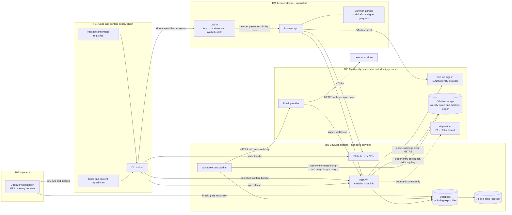
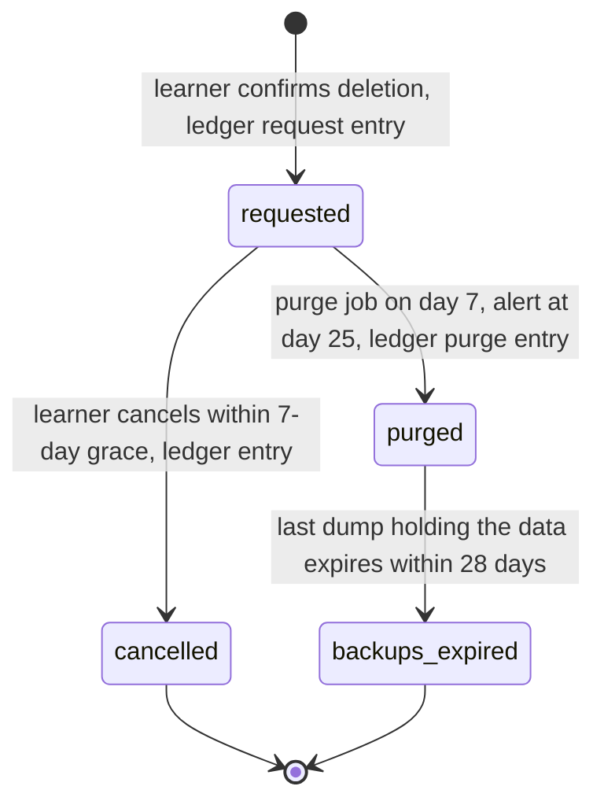

# 09 · Security, privacy and operations

Status: Proposal — for discussion

Based on PRD v0.1 (5 October 2026). Writing rules and canonical names: [`00-conventions.md`](00-conventions.md).

**Purpose.** Define how DevStep protects learner data, which security and privacy controls must exist before the invited pilot, and how one part-time operator can run production safely. Section 9 is the single gate that has to pass before anyone is invited.

> This is planning guidance, not legal advice. Before the pilot, have a qualified adviser check the privacy notice, lawful bases and vendor terms.

## Summary

- DevStep holds personal data of modest sensitivity: email, preferences, learning records and free text. Free-text answers and lab artifacts are classed **Restricted** because learners may paste employer code or secrets, even after being warned not to.
- The most likely threats are broken object-level authorisation (IDOR), account takeover, XSS through learner text or authored Markdown, leaked secrets and unexpected bills. Each one has a named control and a test.
- Authorisation denies by default and scopes every record to the owner taken from the session. PRD §12 requires authorisation tests, so the automated negative suite (§5) is a pilot gate.
- Privacy defaults: reminders are opt-in. Guest work stays on the device. Analytics are pseudonymous and only allow-listed fields are accepted. No model training. AI processing is disclosed and opt-in. Export is JSON. Deletion completes within 30 days, and backups age out within a further 30 days.
- Email: one-click unsubscribe, suppression checked at the moment of sending, at most one reminder per scheduled learning day, quiet hours, and no open or click tracking.
- Operations rely on features of managed services: 14-day point-in-time recovery plus a weekly encrypted off-site dump, budget alerts, an external uptime check and heartbeat checks. There are eight alert rules, and each one has a runbook.
- Four things must pass before the first pilot invitation: a timed restore drill, the authorisation suite, end-to-end tests of export and deletion, and SPF/DKIM/DMARC on the sending domain.
- Support is best-effort, with no 24/7 cover: published hours, one support address, and modest pilot SLOs (99% monthly availability).

## 1. Scope and assumptions

In scope: data classification, threat model, controls, authorisation tests, privacy, email compliance, operations, the pilot gate.
Out of scope and owned elsewhere: vendor choice and prices (`01-tech-stack-and-hosting.md`; the hosting region is the founder's call, and §6.8 covers what it means for transfers); API catalogue and cross-cutting design (`02-system-architecture.md`); sequence diagrams for sign-up, guest claim, export, deletion and reminders (`03-key-flows.md`); table definitions and constraints (`04-data-model.md`); content workflow (`06-content-system.md`); lab kit content (`07-curriculum-plan.md`); consent and warning copy (`08-ux-and-screens.md`); the event catalogue (`10-measurement-and-validation.md`).

| # | Assumption (Proposal unless marked) | Why it matters here |
| --- | --- | --- |
| A1 | One modular monolith with a scheduler/worker and a managed PostgreSQL database (**PRD** §11; 01 confirms). | Small attack surface; one place for authorisation. |
| A2 | The browser app and API share one registrable domain, and sessions use HttpOnly cookies, not bearer tokens kept in browser storage. | Lowers the impact of XSS; CSRF controls become relevant (§3). |
| A3 | Pilot registration is by invitation only. | Removes most abuse and sign-up spam. |
| A4 | Guest work (onboarding answers and the one sample scenario) stays on the device until the guest claims it at sign-up or sign-in (**PRD** §5 asks us to explain this to guests). The server keeps no guest rows. At claim it re-evaluates every answer and records evidence no higher than `practised`. | No server-side guest records to hijack, and an edited bundle cannot inflate evidence; 03 owns the claim flow. |
| A5 | In the pilot, lab evidence is text typed into structured fields. There are no file uploads and no application object storage: export files are kept in Postgres too (**PRD** §11). The only bucket holds the off-site backup copy and the deletion ledger (§8.5, §6.4). | No malware scanning and no public storage buckets. |
| A6 | No admin web UI in the pilot. Content is published through CI (06). Production data fixes run as reviewed scripts. | Removes a high-privilege attack surface. |
| A7 | The AI tutor (F13) is P1 and switched off. Its controls are listed now so that they gate switching it on. | **PRD** §11, §12, §14. |

Where a control relies on a managed-service feature (point-in-time recovery, budget caps, signed webhooks, suppression lists, secret scanning), whether each vendor offers it is **unverified**. Confirm it in 01 when vendors are chosen. Unlabelled table rows in this doc are **Proposals**.

## 2. Data inventory and classification

| Class | Meaning | Handling minimum |
| --- | --- | --- |
| Public | Published catalogue content and marketing pages. | Integrity only. |
| Internal | Operational data with no personal content: configuration, aggregate metrics, pipeline logs. | Operator only. |
| Personal | Relates to an identifiable learner, including pseudonymous data. | Owner-scoped, minimised, deletable, exportable. |
| Restricted | Exposure would materially harm a learner or the service: credentials, tokens, secrets, free text that may contain third-party code, export files, backups. | Personal handling plus encryption at rest, never logged, never copied out of production. |

| Data category | Examples | Class | Stored in | Who can access | Retention | In export? | Deleted with account? |
| --- | --- | --- | --- | --- | --- | --- | --- |
| Email address | Login identifier, reminder destination | Personal | `users`; email provider delivery logs | Learner; operator (break-glass); email provider | Account lifetime; provider logs at the shortest setting available (01) | Yes | Yes. A keyed hash stays in `email_suppressions (added)` only after a complaint or hard bounce (§7) |
| Display name | Optional | Personal | `users` | Learner; operator | Account lifetime | Yes | Yes |
| Linked GitHub identity | GitHub account ID, username and the verified email GitHub returns, for "Sign in with GitHub"; no repository access | Personal | `users` or a linked-identity table (04 decides); GitHub's own records | Learner; operator; GitHub (§6.6) | Account lifetime; unlinked on request | Yes | Yes (GitHub keeps its own account records) |
| Time zone | IANA zone | Personal | `learning_preferences` (04 decides) | Learner; app; operator | Account lifetime | Yes | Yes |
| Preferences | Available days, session length, reminder time, quiet hours | Personal | `learning_preferences`, `notification_preferences` | Learner; app; operator | Account lifetime | Yes | Yes |
| Goals and baseline | Desired outcome, stack context, diagnostic results | Personal | `goals`, `learning_preferences` (04 places the diagnostic) | Learner; operator | Account lifetime | Yes | Yes |
| Free-text answers | Explanations, decision records, drafts | Restricted | `session_drafts`, `attempts` | Learner; operator (break-glass) | Answers: account lifetime. Drafts: one per session, deleted with the session's retention (04) | Yes | Yes |
| Lab artifacts | Pasted results, decision records (files later) | Restricted | `artifacts` | Learner; operator (break-glass) | Account lifetime | Yes | Yes |
| Attempts and evidence | Outcomes, assistance, content version, evidence level, review dates | Personal | `learning_sessions`, `attempts`, `skill_evidence`, `review_schedule`, `roadmap_enrolments`, `topic_progress` | Learner; operator | Account lifetime | Yes | Yes |
| Consent records | Reminder opt-in, pilot research consent, AI opt-in (P1), notice version | Personal | `consent_records (added)` | Learner (via settings); operator | Account lifetime | Yes | Yes |
| Analytics events | Pseudonymous `subject_id`, content IDs, mode, outcome enums, `device_class`, timestamps | Personal (pseudonymous) | `analytics_events` | Operator (analysis only); no third party | 18 months | Yes | Yes, at purge (§6.4). Pilot metrics survive as frozen weekly aggregates (10) |
| Guest analytics events | Allow-listed sample events under a random `subject_id` generated in the browser (§6.2) | Personal (pseudonymous) | `analytics_events`; the ID in browser storage | Operator (analysis only) | 18 months | Yes, once claimed | Yes, once claimed (the account adopts the ID) |
| Notification deliveries | Local date, status, provider message ID, no message body | Personal | `notification_deliveries`; provider logs | Operator; email provider | 12 months | Yes | Yes |
| Auth credentials | Password hash, hashed verification and reset tokens | Restricted | `users`, `auth_tokens (added)` | System only. Nobody can read plaintext | Tokens: minutes to hours (§3.5) | No | Yes |
| Auth sessions | Session ID, created and last-seen times, coarse device label | Restricted | `auth_sessions` | System; operator (revocation) | 90 days at most | No | Yes |
| Idempotency keys | Key, user, operation, stored result reference | Personal | `idempotency_keys` | System | 7 days | No | Yes |
| Export files | ZIP produced on request | Restricted | `export_requests` (the file is stored in Postgres; 04 places the column) | Learner (signed in) | File 7 days; metadata 90 days | — | Yes |
| Deletion records | User UUID and timestamps only | Personal (pseudonymous) | `deletion_requests`; deletion ledger in off-site storage, outside the main database (§6.4) | Operator | 12 months (longer than backup retention) | No | Tombstone kept (§6.4) |
| Invites | Code (hashed), invited address, cohort and arm, used date | Personal | `invites (added)` | Operator | Pilot end + 30 days | No | Yes |
| Pilot participation | Participant code, cohort, arm, consent version, recruitment source, internal flag; no names or emails | Personal (pseudonymous) | `pilot_participants (added)` | Operator | Until the pilot's continue/pivot decision | Yes | Yes; counted as an exclusion per arm (10) |
| Application and access logs | Path without query string, status, timing, user UUID, IP | Personal | Hosting platform logs; error tracker | Operator; hosting and error-tracking processors | 30 days | On request | Expires after 30 days |
| Support correspondence | Emails to the support address | Personal | Support mailbox | Operator | 12 months after closure | On request | Yes, on request |
| Guest progress | Onboarding answers, sample-scenario answers and drafts | Personal | Browser storage on the device only | Learner only | Until claimed; the browser deletes an unclaimed bundle after 30 days | — | — |
| Backups | Everything above that is held in the database | Restricted | Platform point-in-time recovery; weekly encrypted dump in off-site storage | Operator; database and storage providers | PITR window 14 days; each dump 28 days | No | Expire ≤ 28 days after the hard delete |
| AI tutor usage (P1) | Token counts, latency, cost; text redacted | Personal | Usage log (04 decides) | Operator | 12 months | Yes | Yes |

Authors and reviewers have no access to learner data. They work only in the content repository.

**Research data before the pilot gate.** Discovery interviews, the concierge trial and pilot recruitment (10) collect personal data outside the app. It is part of the record of processing. None of it enters the production database except the pseudonymous `pilot_participants` row.

| Data category | Examples | Class | Stored in | Who can access | Retention (Proposal, in line with 10 §6.6) | Consent | On withdrawal |
| --- | --- | --- | --- | --- | --- | --- | --- |
| Screener and recruitment-form answers | Role, experience, stack, availability, recording preference | Personal | Form tool, then the research store under a participant code | Founder; form-tool processor | People not taken forward: 30 days after that phase's recruitment closes. Others: until the pilot decision | Notice on the form; taking part is optional | Deleted |
| Contact details | Name, email for scheduling | Personal | Separate contact sheet in the research store | Founder only | Until the pilot decision; deleted at once for anyone who declines further contact | As above | Deleted |
| Interview recordings and transcripts | Audio/video, transcript if a transcription tool is used | Restricted | Research store | Founder only; call and transcription processors | Recordings deleted 90 days after synthesis | Consent note before the call, plus a clear yes on the call before recording | Deleted |
| Interview and concierge notes | Pseudonymised notes, concierge tracking sheet, form submissions, exit interviews | Personal | Research store; form tool | Founder only | Until the pilot decision | Consent note (interviews); participant information sheet (concierge, pilot) | Deleted, or excluded from analysis if already aggregated |

## 3. Threat model (STRIDE-lite)

### 3.1 Trust boundaries

Every arrow that crosses a boundary is an input to validate or an output to minimise. The lab kit never connects to DevStep. Results move only when the learner copies them across.

### 3.2 Containers and STRIDE focus

| Container | Trust | Holds or does | STRIDE focus | Threats |
| --- | --- | --- | --- | --- |
| Browser app | Untrusted | UI, local drafts, guest progress | T, I | T02, T05, T06, T07, T08, T19 |
| App API | Trusted core | Authentication, authorisation, every write | S, T, I, D, E | T01, T03, T04, T05, T09, T10, T17, T21 |
| Database and backups | Trusted, private | All durable state, including export files | I, T, D | T20, T23 |
| Scheduler and worker | Trusted | Reminders, exports, deletion and retention jobs, weekly dump | T, R, D | T12, T21, T24 |
| Off-site storage | Processor, private bucket | Encrypted weekly dumps; deletion ledger | I, T, D | T13, T20 |
| Email provider | Processor | Addresses, message bodies, delivery events | S, I, R | T03, T11, T12 |
| GitHub sign-in | Identity provider | GitHub account ID, username, verified email | S, I | T01, T03 |
| Content repo and CI | Inputs only partly trusted | Code, content, build, publish | T, E | T13, T14, T15 |
| Static host or CDN | Trusted delivery | Browser bundle, public content | T, I | T16 |
| Lab kits | Our code on learners' machines | Containers, synthetic data, local checks | T, I, E | T18 |
| AI provider (P1) | Processor, switched off | Prompts and responses | I, D | T22 |
| Operator workstation and consoles | Highest privilege | Admin access to every vendor | S, E | T13, T23 |

### 3.3 Threat register

L = likelihood and I = impact for the pilot context (H, M, L). These are judgement calls, not measurements.

| ID | Threat | STRIDE | L | I | Main controls (§4) |
| --- | --- | --- | --- | --- | --- |
| T01 | Account takeover by credential stuffing or password guessing | S | M | M | C01, C02, C05, C24 |
| T02 | Session theft or fixation through XSS, insecure cookies, a shared device or clickjacking | S, I | L | H | C03, C07, C16, C18 |
| T03 | Takeover through the reset, email-change or GitHub sign-in flow: leaked token, open redirect, change made without notice, forged OAuth `state`, a GitHub identity linked to someone else's account | S | L | H | C01, C04, C29 |
| T04 | IDOR on sessions, drafts, attempts, evidence, artifacts, enrolments, exports or notification settings | I, T, E | H | H | C10–C14 |
| T05 | Guest claim abuse: an edited bundle that inflates evidence, a replayed claim, overwriting account records, adopting another account's analytics ID | T, E | L | M | C10, C12, C14, C29 |
| T06 | Stored XSS through learner text (answers, goals, display name, artifacts) in the app, the export summary or email | T, I | M | H | C16, C18, C19, C21 |
| T07 | XSS or malicious links through authored Markdown or source URLs | T | L | H | C17, C18, C46 |
| T08 | CSRF on state-changing endpoints | T | M | M | C03, C20 |
| T09 | Brute force, account enumeration, sign-up spam, email bombing through reset or verification | S, I, D | M | M | C05, C06, C24 |
| T10 | Guessing, forging or replaying unsubscribe tokens, export download links or OAuth `state` | S, I | L | M | C11, C29, C31 |
| T11 | Spoofed email from the DevStep domain; DNS or registrar takeover | S | M | H | C32, C33, C39 |
| T12 | Reminder failure: sent after unsubscribe, duplicated, sent in quiet hours, sent to a dead address | R | M | M | C14, C34 |
| T13 | Secrets leaked through repositories, CI logs, the client bundle, lab kits or logs | I | M | H | C36–C38, C51 |
| T14 | Compromised dependency, CI action or base image | T, E | M | H | C41–C45 |
| T15 | Content pipeline: malicious or careless PR, unreviewed publish, compromised CI token | T | L | H | C43, C46, C47 |
| T16 | Tampered static bundle, or the CDN caching personal API responses | T, I | L | H | C23, C38, C43 |
| T17 | Learner text, code or email leaking into analytics or logs | I | M | M | C50, C51 |
| T18 | A lab kit harms the learner: compromised kit, embedded secret, telemetry, real data, exposed port, changes to the host | T, I, E | L | H | C44, C48, C49 |
| T19 | Learners submit employer code or secrets in free text or artifacts | I | M | M | C56, C57, C58 |
| T20 | Database or backup exposed, restore fails, or data is lost | I, D | L | H | C52, C54, C55, C64 |
| T21 | Denial of service and denial of wallet: request floods, autoscaling, email or log overage, abuse of export generation | D | M | M | C24–C28 |
| T22 | AI tutor (P1): prompt injection, leakage between learners, secrets sent to the provider, provider retention, cost abuse | I, D, T | M | H | C59–C62 |
| T23 | Operator account or workstation compromised; accidental destructive change in production | S, E, T | L | H | C15, C38, C39, C54 |
| T24 | Dispute over consent, unsubscribe, export or deletion with no record to settle it | R | L | M | C34, C55, C67 |

### 3.4 Rate limits (Proposal; tune using pilot data)

| Endpoint class | Limit | Key | When exceeded |
| --- | --- | --- | --- |
| Login (password, or the GitHub callback) | 5 per 15 min per account+IP; 50 per hour per IP | account+IP, IP | 429 and a generic message; no hard lockout, which would let an attacker lock learners out |
| Invite redemption, sign-up | 10 per hour per IP | IP | 429 |
| Reset or verification email | 3 per hour per account; 20 per hour per IP | account, IP | Same response as success, nothing sent |
| Draft save | 60 per minute per user | user | 429. The client backs off and keeps the local draft |
| Attempt, complete, hint, reveal | 30 per minute per user | user | 429 |
| Client events | 120 per minute per user; 50 events per batch at most | user | Excess dropped |
| Guest sample and guest events (no login: `GET /v1/guest/sample`, `POST /v1/guest/attempts`, guest `POST /v1/events`) | 30 per minute per IP; 50 events per batch at most | IP | 429; excess events dropped |
| Guest claim | 5 per hour per user | user | 429; the bundle stays on the device |
| Export request | 1 per 24 h per user | user | 429 with the next allowed time |
| Unsubscribe | 30 per minute per IP | IP | 429 |
| AI tutor (P1) | Daily quota per user plus a global monthly cap (figures set before F13) | user, global | Fall back to authored hints |

### 3.5 Token rules

| Token | Form | Lifetime | Use | Notes |
| --- | --- | --- | --- | --- |
| Email verification | Random, ≥ 128 bits, stored hashed | 24 h | Single-use | Bound to user and address |
| Password reset | Random, ≥ 128 bits, stored hashed | 60 min | Single-use | Using it revokes all sessions; no redirect parameter |
| Invite code | Random, stored hashed | Until pilot start + 30 days | Single-use | Bound to the invited address; carries the cohort and arm |
| GitHub OAuth `state` | Random, bound to the browser session | ≤ 10 min | Single-use | Callback rejected if missing or mismatched. Scopes limited to profile and verified email; no repository access. A GitHub identity is never linked to an existing account just because the emails match |
| Unsubscribe | HMAC-signed: user, purpose `reminder_unsubscribe`, issued-at | 60 days | Idempotent | Grants nothing else. Inert if issued before a later re-subscription |
| Export download | Short-lived signed link returned by `GET /v1/me/export/{id}`; honoured only with the owner's session. The file is served from Postgres | Link ≤ 5 min | Per request | The "export ready" email carries no link token |
| Guest claim | No token. The signed-in learner uploads the device-held bundle (A4) with an `Idempotency-Key` | The browser deletes an unclaimed bundle after 30 days | Once per bundle; a replay returns the stored result | Attaches only to the caller's own account. Every answer is re-evaluated against the pinned content version; evidence capped at `practised` |
| Provider webhook | Provider signature plus timestamp | ≤ 5 min clock skew | Deduplicated by event ID | Rejected if unsigned or stale |

Signing keys support two active versions for rotation. Comparisons are constant-time.

### 3.6 Lab kit rules (learners run our code locally)

- Container images are pinned by digest, not tag. Nothing is fetched at run time apart from those pinned images.
- No secrets, tokens or real credentials anywhere in a kit. Throwaway lab passwords are labelled `lab-only` and used only locally.
- Data is synthetic only, produced by a seeded generator committed with the kit. No real or scraped personal data (**PRD** F07, §5).
- No telemetry, phone-home, auto-update or analytics. Check results are shown locally, and the learner decides what to paste into DevStep.
- Services bind to `127.0.0.1` only. No privileged containers, no host networking, and no host mounts beyond the kit folder.
- No `curl | sh` installers, no global installs, and no changes to host configuration. Every kit includes a teardown command.
- Each release publishes SHA-256 checksums from our own HTTPS release location, and the lab page shows them. Signed releases come later.
- Kit CI builds the kit, scans it and runs its local checks on a clean machine image before every release (07 owns the kit content).

### 3.7 AI tutor rules (P1, gate for enabling F13)

- The context holds only reviewed content for the current step and the learner's current question. Calls are stateless, and nothing from another learner is ever included (**PRD** §11).
- No repository integration and no file ingestion. Secret-like patterns are redacted or rejected before sending, and the UI tells learners not to paste employer code (**PRD** §11).
- Learner input and model output are both treated as untrusted. Output is rendered through the same sanitiser as authored Markdown. The model has no tools and never writes `skill_evidence`; its use is recorded only as assistance.
- No response cache shared between learners when the cache key includes learner text.
- Provider configuration stays server-side. The vendor's terms must exclude training on our data and keep retention minimal. Learners see a disclosure and opt in before first use (**PRD** §12).
- Per-user quota, global monthly cap, maximum tokens per call, a kill switch, and authored-hint fallback on failure. Latency, tokens and cost are logged with text redacted (**PRD** §11, §14).

## 4. Controls checklist

Tags: **Must-before-pilot**, **Before-public-launch**, **Later**.

| ID | Control | Threats | Tag |
| --- | --- | --- | --- |
| C01 | Use the framework's maintained authentication and OAuth libraries (email and password, GitHub sign-in); no hand-rolled crypto or session code; no email-only login links | T01–T03 | Must-before-pilot |
| C02 | Passwords of 12+ characters, no composition rules, breached-password check; hashed with the framework's default adaptive algorithm (for example Argon2id or bcrypt) | T01 | Must-before-pilot |
| C03 | Session cookies HttpOnly, Secure, SameSite=Lax, host-only; session ID rotated at login; 30-day rolling idle limit, 90-day absolute limit | T02, T08 | Must-before-pilot |
| C04 | Fresh sign-in (≤ 15 min old) required for email change, password change and deletion; the old address is told about an email change; reset revokes all sessions | T03 | Must-before-pilot |
| C05 | Login, sign-up and reset give the same response whether or not the account exists | T01, T09 | Must-before-pilot |
| C06 | Invite-only registration with single-use, expiring codes | T09, T21 | Must-before-pilot |
| C07 | Operator script that revokes every session for a user | T01, T02 | Must-before-pilot |
| C08 | "Sign out everywhere" in learner settings | T01, T02 | Before-public-launch |
| C09 | Optional TOTP second factor for learners | T01 | Later |
| C10 | Deny by default; owner taken from the session only; a policy per module; `user_id` never accepted from the client | T04, T05 | Must-before-pilot |
| C11 | Random UUIDs for user-owned records; a record the caller doesn't own returns the same 404 as one that doesn't exist | T04, T10 | Must-before-pilot |
| C12 | Explicit allow-lists of writable fields; evidence level and basis are never writable by the client | T04, T05 | Must-before-pilot |
| C13 | Authorisation suite (§5) plus a route-inventory check in CI; failures block merge | T04 | Must-before-pilot |
| C14 | Idempotency keys unique per user, operation and key; one `notification_deliveries` row per user and local learning day (at-most-once reminders) | T04, T12 | Must-before-pilot |
| C15 | No admin web UI. Operator scripts are kept in the repo, reviewed as diffs and logged when run | T23 | Must-before-pilot |
| C16 | Learner text rendered as plain text with framework auto-escaping; a lint rule bans raw-HTML APIs outside one reviewed Markdown component | T02, T06 | Must-before-pilot |
| C17 | Authored Markdown: the validator rejects raw HTML; allow-list sanitiser at publish and at render; HTTPS links only, with `rel="noopener noreferrer"`; images from our own origin only | T07 | Must-before-pilot |
| C18 | Headers: CSP (`script-src 'self'`, `object-src 'none'`, `base-uri 'none'`, `frame-ancestors 'none'`), HSTS, `nosniff`, `Referrer-Policy: strict-origin-when-cross-origin` | T02, T06, T07 | Must-before-pilot |
| C19 | Server-side schema validation and length caps, as 04 sets them: 32 KB per answer, 64 KB per attempt, 64 KB per draft | T06, T21 | Must-before-pilot |
| C20 | CSRF token plus an Origin check on every state-changing request; CORS allows only our exact origin | T08 | Must-before-pilot |
| C21 | Email templates contain no learner-supplied text; template variables are escaped | T06 | Must-before-pilot |
| C22 | HTTPS only, with HSTS; TLS to the database | T02, T20 | Must-before-pilot |
| C23 | `Cache-Control: no-store` on authenticated responses; the CDN caches only the static bundle and the public catalogue | T16 | Must-before-pilot |
| C24 | Rate limits as in §3.4 | T01, T09, T21 | Must-before-pilot |
| C25 | Caps on scaling (maximum instances or concurrency), database storage auto-growth, request body size and job concurrency | T21 | Must-before-pilot |
| C26 | Budget alerts at 50/80/100% on every paid service; hard spend caps where offered; ingestion caps on logs and error tracking | T21 | Must-before-pilot |
| C27 | Kill switches (configuration flags) for reminders, exports, new sign-ups, the guest sample and AI | T12, T21, T22 | Must-before-pilot |
| C28 | Privacy-friendly bot challenge on public sign-up and the sample scenario | T09, T21 | Before-public-launch |
| C29 | Token rules as in §3.5 | T03, T05, T10 | Must-before-pilot |
| C30 | Webhooks: signature and timestamp verified, deduplicated by provider event ID | T12 | Must-before-pilot |
| C31 | Query strings stripped from access logs on token-bearing routes (unsubscribe) | T10, T17 | Must-before-pilot |
| C32 | SPF, DKIM and DMARC (`p=none` with aggregate reports) on the sending domain | T11 | Must-before-pilot |
| C33 | DMARC moved to `quarantine` after a clean reporting period, then to `reject` | T11 | Before-public-launch |
| C34 | One-click unsubscribe, suppression checked at send time, bounce and complaint handling (§7) | T12, T24 | Must-before-pilot |
| C35 | Open and click tracking turned off | T17 | Must-before-pilot |
| C36 | Secrets only in the platform's secret store, separate per environment; never in repos, the client bundle, lab kits or logs | T13 | Must-before-pilot |
| C37 | Secret scanning on the code host (push protection where offered) and a pre-commit scan | T13 | Must-before-pilot |
| C38 | Least-privilege credentials: send-only email key; scoped deploy token; publish credential limited to the catalogue; separate database roles (app without DDL, migration, read-only operator); an off-site storage key for the app that can only add deletion-ledger entries, separate from the dump job's key | T13, T16, T23 | Must-before-pilot |
| C39 | MFA on every operator account (code host, hosting, database, email, DNS registrar, password manager); registrar lock and auto-renew; recovery codes kept offline; operator disk encrypted | T11, T23 | Must-before-pilot |
| C40 | Secret rotation runbook: rotate on any suspicion and once a year | T13 | Before-public-launch |
| C41 | Lockfiles committed; CI installs from the frozen lockfile | T14 | Must-before-pilot |
| C42 | Dependency audit in CI (fails on a critical issue that has a fix); update PRs batched weekly | T14 | Must-before-pilot |
| C43 | CI actions pinned to a commit SHA; minimal token permissions; no secrets exposed to PRs from forks; protected main branch with required checks | T14–T16 | Must-before-pilot |
| C44 | Base images pinned by digest and rebuilt monthly | T14, T18 | Must-before-pilot |
| C45 | An SBOM for every release; signed app bundles and kit releases | T14, T18 | Later |
| C46 | Content repo: protected main branch, reviewer approval required, validator must pass (schema, sanitiser, links, no HTML or scripts, prerequisite cycles; see 06) | T07, T15 | Must-before-pilot |
| C47 | Content published only from CI on main; bundle checksum recorded with `content_versions`; published versions immutable; rollback by republishing (R3) | T15 | Must-before-pilot |
| C48 | Lab kit rules (§3.6) enforced by a kit CI check | T18 | Must-before-pilot |
| C49 | Kit checksums published and shown in the app; downloads only from our HTTPS release location | T18 | Must-before-pilot |
| C50 | Allow-listed analytics schema; the server rejects unknown properties and free text; no IP address or user agent stored with events | T17 | Must-before-pilot |
| C51 | Logging policy: no request bodies, tokens, passwords or email addresses; user UUID only; scrubbing switched on in the error tracker | T13, T17 | Must-before-pilot |
| C52 | Database and backups encrypted at rest (check the provider default in 01); weekly dumps and ledger entries encrypted before upload | T20 | Must-before-pilot |
| C53 | Production data never copied to preview environments or local machines; restore drills use a throwaway cloud database (§8.5); previews and local use synthetic data and send no real email | T13, T20 | Must-before-pilot |
| C54 | Database not publicly reachable, or reachable only from an allow-list over TLS; operator access through the read-only role, recorded in a simple access log (date, reason, scope) | T20, T23 | Must-before-pilot |
| C55 | Export and deletion tested end to end, including the deletion ledger and replay after a restore (§6.4) | T20, T24 | Must-before-pilot |
| C56 | A notice at every free-text and lab-evidence input: do not paste employer code, credentials or personal data (copy in 08) | T19 | Must-before-pilot |
| C57 | Warning in the browser when free text matches secret-like patterns, shown before submit | T19 | Before-public-launch |
| C58 | If file uploads arrive: type and size limits, private storage, `Content-Disposition: attachment`, malware scan | T19 | Later |
| C59 | AI: off by default; disclosure and per-learner opt-in; a DPA with no-training terms; DPIA screened again | T22 | Later (gate for F13) |
| C60 | AI: bounded, stateless context; no data from other learners; no shared cache keyed on learner text; no tools; no writes to evidence | T22 | Later (gate for F13) |
| C61 | AI: secret redaction before sending; output sanitised; authored fallback | T19, T22 | Later (gate for F13) |
| C62 | AI: per-user quota, global cap, token limit per call, kill switch, redacted logging of cost and latency | T21, T22 | Later (gate for F13) |
| C63 | Minimal alert set (§8.6) plus a weekly review | T12, T20, T21 | Must-before-pilot |
| C64 | Restore drill passed and recorded (§8.5) | T20 | Must-before-pilot |
| C65 | External TLS and header scan, plus a peer review of authentication and authorisation code | T01–T08 | Before-public-launch |
| C66 | Vulnerability disclosure contact (`security.txt`, RFC 9116, plus a security address) | All | Before-public-launch |
| C67 | Append-only `consent_records (added)` with the wording version and a timestamp | T24 | Must-before-pilot |

## 5. Authorisation test plan (PRD §12)

PRD §12 requires "authorization tests" that stop anyone accessing another learner's attempts, drafts and exports. This plan extends that requirement to every user-owned resource. The tests run at API level in CI and failures block merge (C13).

**Fixtures.** Learners A and B each have an enrolment, an open learning session with a draft, a submitted attempt, skill evidence, a lab artifact, a completed export, opted-in reminders and a past reminder delivery. Also used: guest devices G1 and G2, an unauthenticated client U, and a deleted learner D.

**Route inventory.** A generated list of every route records whether it is public or owner-scoped. A route missing from the list, or an owner-scoped route without tests AZ01–AZ12, fails CI.

| ID | Actor and target | Request | Expected |
| --- | --- | --- | --- |
| AZ01 | B reads A's session | `GET /v1/sessions/{A}` | 404, with the same body as an unknown ID |
| AZ02 | B writes A's draft | `PUT /v1/sessions/{A}/draft` | 404; A's draft and revision unchanged |
| AZ03 | B submits to A's session | `POST /v1/sessions/{A}/attempts` with a new key | 404; no `attempts`, `skill_evidence` or `analytics_events` row created |
| AZ04 | B acts on A's session | `POST .../complete`, `.../hints`, `.../reveal` | 404; A's assistance and completion unchanged |
| AZ05 | B lists evidence with a filter | `GET /v1/evidence?user_id={A}` | Only B's evidence; the parameter is ignored |
| AZ06 | B fetches A's export | `GET /v1/me/export/{A's id}` | 404; no download link issued |
| AZ07 | Anyone uses A's download link | Fetch after expiry, or without A's session | Denied; links last ≤ 5 min and work only with the owner's session |
| AZ08 | B changes A's enrolment | `PATCH /v1/enrolments/{A}`, `POST .../migrate` | 404; no change |
| AZ09 | B defers or challenges a topic in A's enrolment | `POST /v1/topics/{id}/defer` or `/challenge` with A's enrolment | 404 or 422; A's `topic_progress` unchanged |
| AZ10 | B attaches lab evidence to A | `POST /v1/labs/{id}/artifacts` referring to A's session or enrolment | Rejected; nothing attached to A |
| AZ11 | B attempts mass assignment | Any write carrying `user_id`, owner, evidence level or basis | Field ignored or 422; record owned by B |
| AZ12 | B changes A's reminder settings | `PUT /v1/me/notifications` with `user_id` = A | Only B's settings change |
| AZ13 | Tampered unsubscribe token | A's token with a changed user or purpose, or signed by a retired key | Rejected; no change |
| AZ14 | Replayed unsubscribe token | A's token used twice; then used again after A re-subscribes | First use idempotent; inert after re-subscription |
| AZ15 | Token used for the wrong job | Unsubscribe token presented as a session or to any other route | 401 |
| AZ16 | Edited guest claim | B claims a G1 bundle whose answers were changed after feedback, or which carries outcomes or evidence levels | Client outcomes and levels ignored; every answer re-evaluated against the pinned content version; evidence recorded no higher than `practised` |
| AZ17 | Replayed guest claim | G1's claim replayed with the same `Idempotency-Key`; the same bundle claimed into a second account | Replay returns the stored result and adds nothing. The second account gets only re-evaluated evidence (capped at `practised`) and cannot adopt a `subject_id` already adopted by another account |
| AZ18 | Guest claim overwriting data | Claim payload whose IDs or timestamps collide with B's records | Only new rows owned by B are added; existing rows untouched (03 and 05 own merge rules) |
| AZ19 | Idempotency key reused across users | B sends A's `Idempotency-Key` | Processed as B's own request; A's stored result never returned |
| AZ20 | Concurrent devices | A's second device saves with a stale `base_revision` | 409; no silent overwrite (**PRD** §12) |
| AZ21 | Unauthenticated | U calls every owner-scoped route in the inventory | 401 |
| AZ22 | CSRF | State-changing request with a valid cookie but no CSRF token, or a foreign Origin | 403 |
| AZ23 | Deletion | B calls `DELETE /v1/me` without a recent sign-in; after D's purge, D's session, tokens and export IDs are tried | Fresh sign-in required; everything of D's inert or 404 |
| AZ24 | Analytics injection | `POST /v1/events` carrying text, an email address or another subject ID; a guest batch with a non-allow-listed event or an already adopted `subject_id` | Rejected or stripped. For signed-in learners the subject always comes from the session. Guests may send only the allow-listed sample events under an unadopted random ID |
| AZ25 | Webhook forgery | Unsigned, wrongly signed or stale provider event | 401; no state change |
| AZ26 | Error leakage | Every failure above | No other learner's identifiers, no stack traces, no SQL |

Run AZ01–AZ06 against each pull request's preview environment as well (synthetic data only).

## 6. Privacy

### 6.1 Roles, purposes and consent

DevStep (the founder, or a company the founder sets up) is the controller. Hosting, database, off-site storage, email, monitoring, research tools (form, video call, transcription) and AI vendors are processors. GitHub is the identity provider for "Sign in with GitHub"; for the learner's GitHub account it probably acts as an independent controller rather than our processor (adviser to confirm).

| Purpose | Data | Lawful basis (Proposal) | Default | Withdraw or object |
| --- | --- | --- | --- | --- |
| Account, learning, progress, export | Account and learning records | Contract | On | Delete the account |
| Sign in with GitHub | GitHub account ID, username, verified email | Contract | The learner's choice at sign-up or sign-in | Unlink in settings, or delete the account |
| Transactional email (verification, reset, export ready, deletion, security notices) | Email | Contract | On; cannot be switched off | Not applicable while the account exists |
| Reminder email (F10) | Email, schedule, time zone | Consent (**PRD** §6, F10) | Off; opt-in | Unsubscribe link, settings, pause |
| Evaluation analytics (F12) | Pseudonymous events, including allow-listed guest sample events under a browser-generated ID | Legitimate interests (guest device ID: Open question 5) | On | Objection through support removes the learner from analysis |
| Discovery interviews, concierge trial and pilot recruitment (before the pilot) | Screener answers, contact details, notes, recordings, form submissions (§2) | Consent, via a consent note or participant information sheet (10) | Asked before taking part; recording only after a clear yes | Withdraw at any time; notes, recordings and contacts deleted |
| Pilot research measures: baseline, final and delayed checks, burden survey, interviews | Assessment outcomes, survey answers, `pilot_participants` (cohort, arm) | Consent, via a participant information sheet | Asked at pilot onboarding | Withdraw at any time; data then excluded |
| Security and abuse prevention | IP address, user UUID, request metadata | Legitimate interests | On | Not applicable |
| Support | Correspondence | Legitimate interests | When the learner writes in | Deleted on request |
| AI tutor (P1) | Current question and reviewed content | Consent, after disclosure (**PRD** §12) | Off | Settings toggle |
| Model training on learning data | None | Not done. Would need separate, explicit consent (**PRD** §12) | None | — |
| Marketing email | None | Not in the pilot. Would need separate consent | None | — |

Every consent is stored in `consent_records (added)` with the purpose, the wording version, the timestamp and how it was given. Every withdrawal is stored the same way. No non-essential cookies are used. Session, CSRF, local-draft and guest-bundle storage are strictly necessary. The one exception is the guest's random analytics `subject_id` in browser storage, which is not strictly necessary; whether it needs consent under cookie law (PECR/ePrivacy) is Open question 5. Revisit cookie law before adding anything else to the device.

### 6.2 Analytics pseudonymisation and forbidden payloads

- Each account has a random `analytics_subject_id`, carried on events as `subject_id`. It is not the `users` primary key and never the email (04 places the column).
- **Guests:** the browser generates a random `subject_id`; the server keeps no guest row. Guests may send only the allow-listed sample events (`sample_started`, `first_answer_submitted`, `attempt_evaluated` for the sample, `guest_progress_claimed`). At claim the account adopts that `subject_id`, so the sample-to-sign-up funnel joins up (04 and 10 own the mechanics). An unclaimed guest's events link to no one and expire with the 18-month retention.
- **Allowed fields** (an allow-list; 10 owns the event catalogue; column names follow 04): `event_name`, `event_id`, `client_event_id`, `subject_id`, `session_ref`, `actor`, `source`, `occurred_at` (UTC), `local_date`, roadmap version, topic, mission, assessment item and content version IDs, session mode, outcome enum, assistance enum and hint count, evidence level, duration in seconds, `device_class` (`phone`, `tablet`, `desktop`, `unknown`), `app_version`, and allow-listed `properties`.
- **Forbidden** (F12, **PRD** §12):
  - Answer or draft text; code, SQL, lab output or artifact content.
  - Goal or stack free text; survey comments.
  - Email address, display name, invite code.
  - IP address, full user agent, device fingerprint, location.
  - URLs with query strings, and any token.
  - Error messages or stack traces that contain input.
  - AI prompts or responses.
- **Enforcement:** a JSON schema for each event in the repo; the server rejects unknown properties; string fields are limited to enums and IDs; AZ24 sends forbidden payloads; a monthly spot-check query looks for long strings.
- No third-party analytics scripts. Events go to `analytics_events`. If an analytics write fails, the event is dropped and learning carries on (**PRD** §12).

### 6.3 Export (F09)

- **Request:** `POST /v1/me/export` (signed in, 1 per 24 h). An async job builds the ZIP and stores it in Postgres (no object storage at pilot; an export is well under 1 MB, 01). It then emails "your export is ready — sign in to download". The email carries no link token. `GET /v1/me/export/{id}` returns a short-lived download link (≤ 5 min) to the owner only, and the link works only with the owner's session. The stored file is deleted after 7 days. Target turnaround is ≤ 24 h.
- **Format (this doc owns the layout):** a ZIP containing `README.txt` (field and evidence-level explanations), `manifest.json` (`export_format_version`, `generated_at` UTC, the learner's time zone, record counts, a SHA-256 for each file) and these files:

| File | Contents |
| --- | --- |
| `account.json` | `users` (email, display name, dates, linked GitHub username; no password hash), `learning_preferences`, `goals`, `consent_records`, and the `pilot_participants` row if any (cohort, arm, consent version) |
| `roadmaps.json` | `roadmap_enrolments` (including migrated ones), `topic_progress`, with roadmap and topic titles, version IDs and migration summaries |
| `sessions.json` | `learning_sessions` with assistance, `attempts` (free text, outcome, assistance, content version ID, mission title) |
| `drafts.json` | `session_drafts` that still exist (open or suspended sessions) |
| `evidence.json` | `skill_evidence` with basis and dates, including annotated rows, plus a summary per skill |
| `reviews.json` | `review_schedule` |
| `artifacts.json` | `artifacts` (metadata and text bodies) |
| `notifications.json` | `notification_preferences` (reminder settings) and `notification_deliveries` (dates and status only) |
| `analytics_events.json` | The learner's pseudonymous events, including adopted guest events |
| `summary.html` | A readable overview, escaped, with no scripts |

- **Excluded:** password hash, token hashes, `auth_sessions`, `idempotency_keys`, deletion-ledger entries, catalogue content bodies and answer keys (referenced by title and version), suppression hashes and other learners' data. Security logs are provided on request under the right of access.

### 6.4 Deletion and backup expiry

- `DELETE /v1/me` needs a fresh sign-in (C04). It takes effect at once: every session is revoked, reminders and pending jobs stop, the account is hidden, a `deletion_requests` row is written, a **request entry** goes to the deletion ledger, and a confirmation email gives the purge date.
- **Grace period:** 7 days, cancellable. During it, signing in allows only cancelling (`POST /v1/me/deletion/cancel`) or exporting.
- **Hard delete:** the purge job runs on day 7, and never later than day 30 (**PRD** §12); alert #8 fires if an account is still not purged by day 25. It removes every row marked "Yes" in §2, including the stored export and the learner's `analytics_events`. Pilot metrics survive through frozen weekly aggregate snapshots (10), and each deleted account is reported as a counted exclusion per arm. Where the provider's API allows, it also removes provider-side contact data, except for complaint or hard-bounce suppression. It sends a final confirmation, then writes a **purge entry** to the ledger.
- **Deletion ledger (where it lives):** a ledger inside the database would roll back with any restore, so it sits outside it. Proposal, the simplest option: one small encrypted JSON object per entry under a `deletion-ledger/` prefix in the off-site storage bucket that already holds the weekly dump (01). Each entry holds the user UUID, `requested_at` and, for purge entries, `purged_at` (04 defines the record); no email. The app writes with a key that can only add objects there (C38); a cancellation also writes an entry, so a cancelled request is never replayed. Whether the vendor can scope a key to one prefix is unverified; if not, use a second small bucket with its own key. Ledger entries are kept 12 months, longer than any backup.
- **Backups:** 14-day point-in-time recovery and a weekly encrypted dump kept 28 days (§8.5). Data therefore leaves backups ≤ 28 days after the purge, about 35 days after the request in normal running. The published commitment is unchanged: "removed from active systems within 30 days and from backups within a further 30 days".
- **Restores:** after any restore, from point-in-time recovery or a weekly dump, replay the ledger **before the app reopens** (R2): purge again every account with a purge entry later than the restore point, and recreate the pending request, with its original dates, for every request entry later than the restore point that has no cancellation. Logs age out within 30 days.

### 6.5 Retention schedule

| Retention | Records | Clock starts | Enforced by |
| --- | --- | --- | --- |
| Minutes to 24 h | Reset tokens (60 min), verification tokens (24 h), GitHub OAuth `state` (≤ 10 min), export download links (≤ 5 min) | Issue | Expiry check plus a daily purge job |
| 7 days | `idempotency_keys`, export files (in Postgres), deletion grace | Creation or request | Daily retention job |
| 14 days | Point-in-time recovery window | Continuous | Platform setting (01) |
| 28 days | Each weekly off-site dump | Dump date | Bucket lifecycle rule on the dump prefix only |
| 30 days | Platform and access logs, error-tracker events; unclaimed guest bundles in the browser | Event | Provider retention setting (check in 01); the browser app |
| 30 days after recruitment closes | Screener and recruitment-form answers of people not taken forward | Phase close | By hand |
| 90 days | `auth_sessions` (absolute maximum), `export_requests` metadata | Creation | Retention job |
| 90 days after synthesis | Interview recordings and transcripts | Synthesis | By hand |
| 12 months | `notification_deliveries`, deletion ledger, operator access log, support mail after closure, AI usage log (P1) | Event | Retention job; mailbox handled monthly by hand |
| 18 months | `analytics_events`, including guest events. Aggregate pilot results are kept | Event | Retention job |
| Pilot end + 30 days | `invites` | Pilot end | By hand |
| Until the pilot's continue/pivot decision | `pilot_participants`, research notes, concierge records, contact sheet (sooner on withdrawal or a decline of further contact) | Decision | By hand |
| With the session (04) | `session_drafts`: one draft per session, deleted with the session's retention | Session | Retention job |
| Account lifetime | Profile, preferences, goals, learning records, evidence, artifacts, consent records | Deletion request | Deletion job |
| 24 months inactive | The whole account, after 30 days' notice | Last sign-in | Before-public-launch |
| Until removed at yearly review | `email_suppressions` hashes (complaints, hard bounces) | Event | Yearly review |

### 6.6 Data-protection checklist (GDPR / UK GDPR style)

- [ ] Controller identity and contact details decided; check whether the regulator requires registration or a fee (for example the ICO data protection fee in the UK).
- [ ] Record of processing kept. §2 (including the pre-pilot research data) and §6.1 of this doc are the first version.
- [ ] Lawful basis recorded for each purpose (§6.1).
- [ ] Plain-language privacy notice published before the pilot: purposes, bases, retention (§6.5), processors, international transfers, rights, contact, and the right to complain to the supervisory authority.
- [ ] Interview consent note names every research tool, including transcription if used (10 §6.6).
- [ ] Pilot participant information sheet and research consent (Open question 1).
- [ ] Subprocessor list published:

| Role | Vendor | Data | Region | DPA in place | Transfer mechanism |
| --- | --- | --- | --- | --- | --- |
| Hosting / app platform | TBD (01) | All | Chosen region (§6.8) | ☐ | TBD |
| Managed database and point-in-time recovery | TBD (01) | All | Chosen region (§6.8) | ☐ | TBD |
| Off-site storage (weekly dump, deletion ledger) | TBD (01) | Encrypted dumps; user UUIDs and dates | TBD | ☐ | TBD |
| Email provider | TBD (01) | Email, message bodies, delivery events | TBD | ☐ | TBD |
| Static host or CDN | TBD (01) | IP addresses, request logs | TBD | ☐ | TBD |
| Uptime monitor and error tracking | TBD (01) | Request metadata, user UUID | TBD | ☐ | TBD |
| Identity provider: Sign in with GitHub | GitHub | GitHub account ID, username, verified email, sign-in requests | US (unverified) | ☐ (role to confirm, §6.1) | TBD |
| Code host and CI | GitHub (01) | No learner data in repositories or CI. The same vendor is the sign-in provider above | US (unverified) | ☐ | — |
| Research tools: forms, video calls, transcription if used, research store | TBD (10) | Screener answers, contacts, recordings, notes | TBD | ☐ | TBD |
| AI provider (P1, not enabled) | TBD | Question and reviewed content | TBD | ☐ | TBD |

- [ ] A DPA (Art. 28 processor terms) accepted with every processor before it receives learner data.
- [ ] Data-subject requests handled within one month (Art. 12(3)): access and portability through export, rectification through settings, erasure through deletion, objection and restriction through pause, opt-out or support. Confirm identity by requiring the request to come from the account's address and be confirmed while signed in.
- [ ] Breach procedure (R4) and a breach log, including incidents that were not notified.
- [ ] DPIA screening recorded. The pilot is probably not high-risk. Screen again before the AI tutor or any employer-facing feature.
- [ ] Skill evidence is described as advisory, not a credential. No automated decision with legal or similarly significant effects (Art. 22).
- [ ] No sale or sharing of learner data, and no employer access to individual progress (**PRD** §15).

### 6.7 Audience and claims

- Not aimed at children. Sign-up includes a declaration of being 18 or over (Open question 2), and the terms say the same.
- No clinical claims (**PRD** §4). Copy about procrastination or stress does not promise treatment, and support redirects health-related requests to appropriate services.
- The terms tell learners not to submit employer code, credentials or third-party personal data.

### 6.8 Hosting region and data transfers

The region is **provisional**: the founder picks it at the planning gate (30 Nov 2026), once the pilot cohort's location is clearer (01 lists the options). It decides where the database, point-in-time recovery and app logs sit. Email, error tracking, uptime checks, GitHub and off-site storage may process data elsewhere whatever the choice, so each still needs a row and a mechanism in §6.6. This is not legal advice; the adviser confirms each mechanism.

| Region | What it means for transfers (UK/EU learners) |
| --- | --- |
| EU (Frankfurt) or UK (London) | Core data stays in the UK/EU. EU↔UK flows rely on adequacy decisions (check that they are current). Only the US-based vendors need a transfer mechanism. Simplest for a UK/EU cohort. |
| US (Virginia) | All core data is transferred to the US. Rely on the EU–US Data Privacy Framework and its UK Extension where the vendor is certified (unverified per vendor), otherwise Standard Contractual Clauses or the UK Addendum/IDTA, plus a transfer risk assessment. Name the transfer in the privacy notice. |
| Singapore | No EU or UK adequacy decision for Singapore, so Standard Contractual Clauses or the UK Addendum/IDTA plus a transfer risk assessment are needed for UK/EU learners. Learners in Singapore or elsewhere in Asia may bring their own local rules (for example Singapore's PDPA); the adviser checks. |

Whatever the region, the founder's own country of establishment may add obligations for the controller. Record the decision and the mechanism for each vendor in §6.6.

## 7. Email compliance and deliverability

| Rule | Detail |
| --- | --- |
| Streams | Transactional and reminder messages kept apart: separate templates, and a separate provider stream where offered. Reminder suppression never blocks security email. |
| Authentication | SPF and DKIM on a dedicated sending subdomain, with aligned DMARC. Move from `p=none` to `quarantine` to `reject` (C32, C33). Aggregate reports go to one mailbox, reviewed monthly. |
| One-click unsubscribe | Reminder emails carry `List-Unsubscribe` (an HTTPS URL to `POST /v1/notifications/unsubscribe` with a signed token, RFC 2369) and `List-Unsubscribe-Post: List-Unsubscribe=One-Click` (RFC 8058). The footer link opens a page with a confirm button. A GET request never unsubscribes, so link scanners can't trigger it. The effect is immediate. |
| Suppression list | Checked at send time, not at scheduling time. App side: `email_suppressions (added)` holds a keyed hash and a reason. Provider side: its own list. Unsubscribe, pause and opt-out stop reminders only. |
| Hard bounce | Reminders stop and the address is marked undeliverable. The app shows "check your email address". Provider suppression is added. |
| Soft bounce | The provider retries. After 3 consecutive failed days, reminders pause and the app shows a banner. |
| Complaint | Reminders are turned off at once and the address is suppressed. A digest alert reaches the operator (§8.6). |
| Frequency | At most one reminder per scheduled learning day (**PRD** §6, F10). The de-duplication key is a unique `notification_deliveries` row per user and local learning day, not an idempotency key. Sending is at-most-once: no automatic retry after an ambiguous timeout. No reminder if the learner has already practised that learning day (05's definition; the day starts at 04:00 local). |
| Quiet hours | Default 21:00–08:00 learner-local (Proposal; editable). Nothing is sent inside quiet hours. A reminder that falls inside them is skipped, not carried over. |
| Stale sends | A reminder more than 2 hours late, for example after an outage, is dropped. |
| Pause and snooze | Honoured at send time. Time zone and DST rules belong to 03 and 05. |
| Content | Plain, short, no urgency, no job-loss framing, no comparison with other learners (**PRD** §6). The reply-to address is the support mailbox. No learner text (C21). |
| Tracking | Open and click tracking off (C35). No link shorteners. |
| Law | Reminders are consent-based service messages. Confirm that PECR (and, for US learners, CAN-SPAM) applies as expected; any later marketing email needs separate consent. |

## 8. Operations for one part-time operator

### 8.1 Principles

- Use the platform's built-in features first: point-in-time recovery, platform logs, budget alerts, managed TLS and an external uptime check. The weekly off-site dump is the one job we run ourselves. Self-hosted monitoring is out.
- Every alert has to be actionable and must link to a runbook. If an alert fires twice and needs no action, retune it or delete it.
- Learning must keep working when email, analytics or AI is down (**PRD** §12). Kill switches (C27) are the first response.
- No 24/7 cover. Learners can see the support hours.

### 8.2 Environments

| Environment | Purpose | Data | Email | Access |
| --- | --- | --- | --- | --- |
| Local | Development | Seeded synthetic data | Local mail catcher | Operator |
| Preview (one per pull request) | Review a change, try content, run smoke tests and AZ01–AZ06 | Synthetic seed data only, never a copy of production (C53) | Log driver only; no real email | Operator and reviewer; scales to zero |
| Production | Pilot learners | Real | Real | Operator with MFA, using least-privilege roles |

There is no separate staging environment; previews fill that role (01). Configuration has the same shape in every environment. Secrets are separate for each environment, and a preview can never reach the production database.

### 8.3 Deploy and rollback

1. Every pull request runs CI (tests including the §5 suite, dependency audit, content validation, build) and gets a preview environment, where the smoke tests and AZ01–AZ06 run on synthetic data.
2. A pull request merges to protected `main` only with green CI and an approved review. Merging **is** deploying, so merge only when 1 hour of attention is available afterwards. No merges late on Friday or just before time away.
3. `main` deploys to production automatically: build, migrations, then `content:publish` (01, 06).
4. **Smoke check on production** straight after the deploy: `/up` (the framework's health endpoint, extended with a database check) and Today for a seed test account. Then watch error rate and uptime for 15 minutes.
5. **Rollback:** redeploy the previous build (target ≤ 15 min), then revert the change on `main` so the next deploy doesn't bring it back. This works because migrations are backward-compatible (§8.4). Content has its own rollback (R3).

### 8.4 Database migration safety

- Expand, then contract: add first and backfill, switch reads, and remove old columns only in a **later** release. Release N−1 code must run against the schema of release N.
- Never rename or drop in the same release that stops using the column. Large backfills run as batched background jobs.
- Use index builds that don't block where the database supports them (for example, PostgreSQL's concurrent index builds).
- Take an on-demand snapshot before any destructive migration and note its time in the PR. Destructive migrations need a written rollback plan in the PR.
- Migrations run under the migration role. The app role has no DDL rights (C38).
- Rehearse each risky migration on a preview environment seeded with synthetic data at least ten times the pilot's expected volume.

### 8.5 Backups and restore drill (must pass before the pilot)

**Backup policy (from the pilot):** the platform's point-in-time recovery with a 14-day window (01), plus a weekly encrypted logical dump to separate off-site storage, kept 28 days, which protects against losing the hosting account. Both are encrypted. Total retention stays under 30 days, so deletions leave backups in time (§6.4). Targets: RPO ≤ 15 min through point-in-time recovery (granularity unverified, 01), or ≤ 7 days if only the weekly dump survives. RTO is one working day, best-effort.

**Restore drill runbook.** Run it before the pilot (**PRD** §12), then every quarter and after any major change to the database setup. Before the pilot, production holds only synthetic and test accounts, so the drill carries little risk.

1. Write down the start time and the chosen restore points: one point-in-time restore and the latest weekly dump.
2. Restore each into a **throwaway cloud database** in the production hosting account. Never restore over the live database, and never onto a laptop (no production data on local machines, C53). Treat each copy as production data.
3. Verify:
   - The schema migration version matches production.
   - Row counts per table are within the expected difference from production.
   - The newest `attempts` timestamp agrees with the restore point.
   - A temporary app environment, created for the drill in the production account (never a preview), pointed at the restored copy can sign in a test account and load Today.
4. Practise replaying the deletion ledger (§6.4) against each copy and resyncing suppressions from the email provider.
5. Record RTO (start to verified) and the RPO actually achieved. Compare them with the targets.
6. Destroy the throwaway databases and the temporary app, and write the result in the operations log (date, durations, problems found).
7. Fix every gap found, and update this runbook and R2.

**Pass criteria:** the restore completes and is verified within one working session (≤ 4 hours hands-on). Data loss is within the RPO. Ledger replay works. The runbook has been updated.

### 8.6 Monitoring and alerting (minimal set)

Alerts go to a single channel that reaches the operator's phone (push or email). Everything not listed below goes into a weekly digest.

| # | Signal | Source | Alert when (Proposal) | First action |
| --- | --- | --- | --- | --- |
| 1 | Uptime | External HTTPS check on the app and `/up` (with its database check) | 2 consecutive failures | Check platform status; roll back if a deploy is the cause |
| 2 | Server errors | Platform metrics or error tracker | ≥ 10 5xx responses in 15 min | Check the last deploy and the error tracker; roll back |
| 3 | Scheduler and reminder jobs | Heartbeat ping after each scheduler run; job failure count | Heartbeat missed twice, or ≥ 3 permanent job failures in an hour | Check the worker; pause reminders (C27); R1 if the cause is the provider |
| 4 | Backup freshness | Heartbeat from the weekly dump job; provider notice for point-in-time recovery | Dump heartbeat missed (newest dump older than 8 days), or point-in-time recovery reported unhealthy | Rerun the dump job; open a provider ticket; take an on-demand snapshot |
| 5 | Cost | Budget alerts on every paid vendor | 50%, 80% or 100% of the monthly budget, or forecast overrun | R5 |
| 6 | Email health | Provider webhooks | Any complaint, or ≥ 3 hard bounces in a day | Check list hygiene, templates and the DMARC report |
| 7 | Database capacity | Provider metrics | Storage ≥ 80%, or connections near the limit | Clean up or resize, within caps (C25) |
| 8 | Account lifecycle deadlines | Daily check job | An export pending for more than 24 h, or an account not purged by day 25 after its deletion request | Rerun the job; investigate; meet the PRD limit |

Auto-renewal handles TLS and domain renewal; the registrar's own notices are enough. Digest only: new error types, dependency advisories, DMARC reports.

### 8.7 Pilot SLO proposals

| Objective | Target (pilot) | Measured by |
| --- | --- | --- |
| Availability of app and API | 99.0% per calendar month (about 7 h downtime allowed), excluding announced maintenance | External uptime check |
| Today API latency | p95 < 500 ms at pilot load (**PRD** §12) | Platform metrics; 10 records the test conditions |
| Reminder timeliness | ≥ 95% of due reminders handed to the provider within 15 min of schedule, on days the provider is healthy | `notification_deliveries` |
| Reminder correctness | Zero sends to unsubscribed or paused learners; zero second reminders on the same local day. Any breach is an S1 | `notification_deliveries` audit query |
| Data durability | RPO ≤ 15 min through point-in-time recovery (≤ 7 days from the weekly dump if the hosting account is lost); restore within one working day | Restore drill records |
| Export and deletion | Export ≤ 24 h; deletion purged ≤ 30 days (target 7) | Lifecycle alert (#8) |
| Support | First reply within 2 working days; a reported data exposure is looked at the same day, best-effort | Support mailbox |

### 8.8 Severity, on-call and support

| Severity | Examples | Response (best-effort, during published hours unless noted) |
| --- | --- | --- |
| S1 | Suspected data exposure; production down; reminders to unsubscribed learners or duplicate sends at scale; runaway cost | Acknowledge within 4 waking hours, including outside published hours where possible; work on it until contained |
| S2 | Email outage; export or deletion jobs failing; a feature broken; a restore needed | Within 1 working day |
| S3 | Content error, cosmetic bug, a problem affecting one learner | Within 5 working days, batched |

- **Support channel:** one support address (also the reply-to on email). In-app links for "Report a problem" and "Report a content error"; the content report includes the mission and content version (F11, **PRD** §16) but no answer text. A pilot announcement channel carries status notes and planned maintenance.
- **Published hours:** the operator picks a weekly window and states it in the pilot invitation. Outside it, learners get best-effort cover only.
- **Bus factor (Open question 3):** a sealed break-glass note held by a trusted person. It says where the runbooks live and how to switch on maintenance mode. It grants no standing access.

### 8.9 Incident runbooks

**R1 · Email provider outage**
- [ ] Confirm on the provider's status page. Learning carries on regardless (**PRD** §12).
- [ ] Pause reminder dispatch (C27) so a burst doesn't fire on recovery. Reminders more than 2 hours late are dropped (§7).
- [ ] Transactional email waits in the queue, with retries and expiry. Tell affected learners that resets or exports may be delayed.
- [ ] If the outage lasts more than 1 day, post a note in the pilot channel. Resume dispatch and watch alerts 3 and 6.

**R2 · Production database restore**
- [ ] Turn on maintenance mode. Pause the scheduler (reminders, exports, purges).
- [ ] Pick the restore point (just before the fault). Use point-in-time recovery; fall back to the latest weekly dump only if the hosting account or its backups are lost. Restore into a new cloud database, following the §8.5 steps.
- [ ] Verify, then point the app at the new database. Keep the old one read-only until the incident is closed.
- [ ] Before the app reopens, replay the deletion ledger for entries after the restore point (§6.4). Resync unsubscribes and suppressions from the provider.
- [ ] Keep reminders paused until the next local day so learners aren't sent duplicates.
- [ ] Tell affected learners which work may have been lost (anything after the restore point). Write it in the operations log.

**R3 · Bad content publish rollback**
- [ ] Identify the faulty `content_versions` entry. Republish the previous version, or retire the faulty one (06 owns the mechanism).
- [ ] Attempts reference exact versions, so historical evidence stays valid (**PRD** §11, §12). Don't edit published rows.
- [ ] If the content was malicious (script or link), also follow R4 and rotate the publish credential.
- [ ] Add a validator rule or test that would have caught it. Tell the reviewer.

**R4 · Suspected data exposure**
- [ ] Contain: disable the affected route or feature, revoke sessions (C07) and rotate any exposed secrets.
- [ ] Preserve evidence: export the relevant logs before the 30-day expiry and note timestamps.
- [ ] Assess what data was involved, how many learners, and whether it is still exposed. Record it in the breach log.
- [ ] If it is a personal data breach that is likely to put people at risk, notify the supervisory authority within 72 hours of becoming aware (Art. 33). Tell affected learners without undue delay if the risk is high. Get legal advice.
- [ ] Fix, add a regression test (usually in §5), and write a short post-incident note.

**R5 · Runaway cost**
- [ ] Use the budget alert to find which vendor and which resource.
- [ ] Use kill switches as needed: AI, reminders, exports, new sign-ups. Lower scaling caps. Block abusive IPs or accounts.
- [ ] If an API key leaked, rotate it at once (the most common cause of surprise bills).
- [ ] Contact vendor support about abuse credits. Afterwards, lower caps and add a rate limit.

**R6 · Faulty or compromised lab kit release**
- [ ] Withdraw the release and mark it in the app. Publish a notice with the bad and good checksums.
- [ ] Tell learners who opened that lab to run teardown and re-download. Rotate any credential that might have been embedded.

**R7 · Learner reports account compromise**
- [ ] Verify through the account's address. Revoke all sessions (C07) and force a password reset.
- [ ] Review recent email-change and export activity. Restore the original address if it was changed.

### 8.10 Routine operations calendar

| When | Task | Time |
| --- | --- | --- |
| Daily (automated) | Retention purge, lifecycle deadline check, backup freshness check, heartbeat | 0 |
| Weekly (automated) | Encrypted off-site dump, with its heartbeat | 0 |
| Weekly | Digest: alerts, new errors, budget, bounces and complaints, dependency PRs, support inbox | 15 min |
| Monthly | DMARC reports; access review (accounts, keys, the operator access log); base image rebuild; cost per weekly active learner (**PRD** §14) | 30 min |
| Quarterly | Restore drill; check secret rotation; review this doc; content review cadence (06) | 2–4 h |

## 9. Pilot launch readiness gate

No pilot invitation is sent until every box is ticked and the evidence is linked in the operations log.

**Security**
- [ ] C01–C07 and C10–C24 in place. Session, CSRF and header settings checked in a deployed environment.
- [ ] Authorisation suite AZ01–AZ26 passes in CI. The route-inventory check is on and blocks merge.
- [ ] Rate limits (§3.4) and token rules (§3.5) implemented and tested.
- [ ] Secrets kept only in secret stores. Secret scanning on. A full-history scan of every repository finds nothing.
- [ ] MFA on every operator account. Registrar lock and auto-renew on. Recovery codes stored offline.
- [ ] Database not publicly reachable. Separate roles exist. The operator access log has been started.
- [ ] Lockfiles, dependency audit, pinned CI actions and protected branches in place for the code, content and kit repos.

**Content and labs**
- [ ] The content validator rejects raw HTML and scripts. Publishing needs reviewer approval and CI on main (C46, C47).
- [ ] Every pilot lab kit passes its rules check (§3.6). Checksums are published and match what the app shows.

**Privacy**
- [ ] Privacy notice, terms (18+, no clinical claims, no employer code) and participant information sheet published and linked at sign-up.
- [ ] Lawful basis recorded for each purpose. Subprocessor list filled in. DPAs accepted with every processor.
- [ ] Consent capture works and writes `consent_records`. Reminders are off by default.
- [ ] Analytics allow-list enforced. Forbidden-payload tests pass. A test pass through every pilot flow leaves no free text in `analytics_events`.
- [ ] Export produces the §6.3 ZIP for a populated test account. A fresh reviewer has checked it for completeness and for leaks.
- [ ] Deletion purges a populated test account. The ledger holds its request and purge entries. The §2 "Yes" rows, including its analytics events, are gone (checked by query). Replay after a restore has been tested.
- [ ] Guest flow checked: nothing guest-related is stored on the server before claim, guest events carry only allow-listed sample events, and a claim caps evidence at `practised` (AZ16–AZ18).
- [ ] Pre-pilot research data (§2) is held as stated: recordings past 90 days after synthesis deleted, contact sheet separate, research tools listed in §6.6.
- [ ] Logs and the error tracker hold no bodies, tokens or email addresses (checked by sampling).

**Email**
- [ ] SPF, DKIM and DMARC (`p=none`) pass on a test send to at least two major mailbox providers.
- [ ] One-click unsubscribe works from a real mailbox. A GET request doesn't unsubscribe. Suppression is checked at send time.
- [ ] Bounce and complaint webhooks verified with the provider's test events.
- [ ] Rules for one reminder per day, quiet hours, completion suppression and stale-send dropping tested, including a DST change and two time zones.

**Operations**
- [ ] Restore drill (§8.5) passed for both point-in-time recovery and the weekly dump, into throwaway cloud databases. RTO and RPO recorded.
- [ ] Weekly off-site dump running, encrypted, with a 28-day lifecycle rule and a green heartbeat.
- [ ] All eight alerts configured and each test-fired once. Runbooks R1–R7 linked from the alerts.
- [ ] Budget alerts and spend caps set on every paid vendor. Kill switches tested on a preview environment.
- [ ] Merge-to-deploy, the production smoke check (`/up`, Today for a seed account) and rollback rehearsed while production holds only test accounts, including one rollback across a migration.
- [ ] Support address, in-app report links, published hours and the pilot announcement channel all live.
- [ ] Break-glass note written and handed to its holder (if Open question 3 is accepted).

## 10. Open questions for discussion

1. **Basis for pilot research measures?** *Recommended default:* explicit consent through a participant information sheet at pilot onboarding, covering baseline, final and delayed checks, surveys and interviews. Core analytics stay under legitimate interests.
2. **Minimum age?** *Recommended default:* 18+ by declaration at sign-up. The audience is employed developers (**PRD** §4).
3. **Bus factor?** *Recommended default:* a sealed break-glass note held by one trusted person. It covers maintenance mode, the runbooks, and how to contact pilot learners. It gives no standing production access.
4. **Which provisional hosting region at the planning gate?** *Recommended default:* the region nearest most pilot participants (01). If most are in the UK or EU, Frankfurt or London keeps the database and backups out of transfer rules (§6.8). Record the choice and each vendor's transfer mechanism in §6.6.
5. **Does the guest's random analytics ID in browser storage need consent under cookie law?** *Recommended default:* ask the adviser before the pilot. Until then, explain it in one line on the sample's first screen and offer a "don't count my visit" switch that stops guest events. The ID is random, links to no account until claim, and carries only the allow-listed sample events.

## 11. PRD traceability

| PRD reference | Covered in |
| --- | --- |
| §4 exclusions, no clinical claim | §6.7 |
| §5 guest work and device storage | §1 A4, §3.5, §5 AZ16–AZ18, §6.2 |
| §6 reminders (opt-in, ≤ 1 per day, quiet hours, no urgency) | §6.1, §7 |
| F07 labs (synthetic data, no production access) | §3.6, C48, C49, R6 |
| F09 secure login, cross-device, idempotency, export, deletion | §3.5, C01–C14, §5, §6.3, §6.4 |
| F10 email reminders: consent, time zone, pause, unsubscribe, completion suppression | §6.1, §7, §8.7 |
| F11 content operations (review gate, version) | C46, C47, R3 |
| F12 analytics without free text | §6.2, C50, AZ24 |
| F13 bounded AI tutor (P1) | §3.7, C59–C62 |
| §11 owner-scoped records, idempotency, no code execution, AI boundaries, no employer repos or secrets | C10–C14, §3.6, §3.7, A5 |
| §12 authorisation tests | §5 |
| §12 TLS, secure sessions, rate limiting, validation, safe rendering | C03, C16–C24, §3.4 |
| §12 drafts and concurrent devices | AZ20 |
| §12 pseudonymous analytics | §6.2 |
| §12 export, deletion within 30 days, documented backup expiry | §6.3, §6.4, §6.5, §8.5 |
| §12 no training without consent; disclose third-party AI | §6.1, §3.7, C59 |
| §12 p95 Today latency budget | §8.7 |
| §12 email, AI or analytics outage must not block learning; backups tested before pilot | §8.1, R1, §8.5, §9 |
| §14 cost discipline, AI spending caps | C26, C27, C62, R5, §8.10 |
| §15 no employer surveillance | §6.6 |
| §16 error reporting for content | §8.8 |
