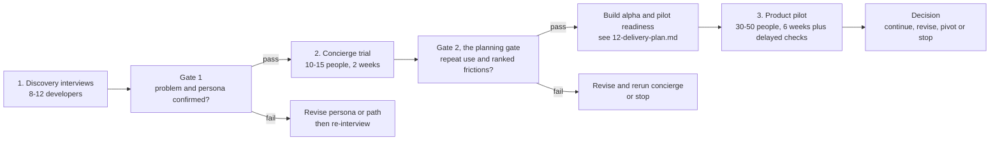
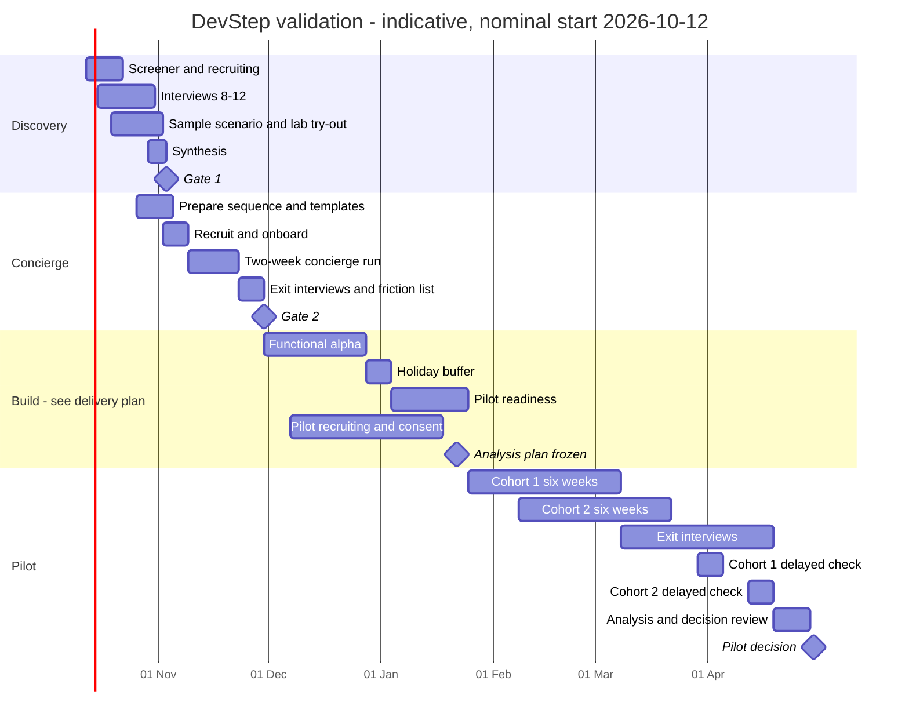

# 10 · Measurement and validation

Status: Proposal — for discussion

**Purpose.** Define what DevStep measures, how every number is calculated, and
how the founder tests the idea in three gated stages (discovery interviews, a
manual concierge trial, a measured product pilot) before committing further.
Sections 6 and 7 can be used as they stand; nothing in them needs the product
to exist.

## Summary

- Validation runs in three gated stages (PRD §13): 8–12 interviews, then a
  two-week concierge trial with 10–15 people, then a six-week pilot with 30–50
  people plus delayed checks. Nothing is built before gate 1.
- Analytics is one `analytics_events` table, queried with SQL. The server emits
  every event it can observe. A per-event allow-list keeps answer text, code,
  email and all other free text out.
- Learners appear in analytics only as a random `subject_id`. A guest's is
  generated in the browser and adopted by the account at claim. The data is
  pseudonymous, not anonymous. A deleted account's events are deleted at
  purge; frozen weekly aggregate snapshots keep the pilot metrics.
- North star: the number of learners each week with at least one unassisted,
  machine- or reviewer-scored success on an alternate task. Practice-only and
  self-assessed learners are reported beside it, never inside it.
- Every PRD §13 metric has a numerator, denominator and window, with
  pseudo-SQL where the logic is not obvious. Every rate is shown with its raw
  counts (for example "9/24").
- The pilot compares DevStep with a static checklist that has the same content
  and workload. The recommendation is randomised arms within two staggered
  cohorts, and two alternatives are costed.
- A decision table maps outcomes to continue, revise or stop. Engagement with
  no transfer gain means "revise the curriculum", not success.
- Business signals (paid path or subscription) are recorded only as past
  behaviour or labelled stated preference. No prices are tested and no
  willingness-to-pay claim is made.

## 1. Validation stages at a glance



| Stage | Main question | People | Duration | Tooling | Output | Gate |
| --- | --- | --- | --- | --- | --- | --- |
| 1 Discovery | Does the problem exist as described, for whom, and what do people do now? | 8–12 | 2–3 weeks including recruiting | Video calls, a screener form, a spreadsheet | Synthesis and a findings-to-decisions table (§6.9) | Gate 1 (§6.9); a fail adds 1–2 weeks of interviews |
| 2 Concierge | Do people come back to a curated sequence without personal encouragement? Where is the friction? | 10–15 | 2 weeks plus 1 week of exit interviews | Email, a form tool, a spreadsheet | Evidence of repeat use and a ranked friction list (PRD §14) | Gate 2, the planning gate (§7.6) |
| 3 Pilot | Do people start, return and learn, and do they do so more than with a static checklist? | 30–50 | 6 weeks, a delayed check about 3 weeks later, then exit interviews | The product, `analytics_events`, SQL | Metrics against thresholds and a recorded decision (§9) | Decision table (§9) |

## 2. Measurement principles

| # | Principle | Label |
| --- | --- | --- |
| 1 | Measure demonstrated capability and sustainable return, not time in app, articles read or streaks. | PRD §1 |
| 2 | If the server can observe an action, the server emits the event. Client events are kept to what only the UI knows, such as what was shown or chosen. | Proposal |
| 3 | Definitions, thresholds and the comparison design are written down and dated before the pilot starts (§8.5). Concierge thresholds are frozen the same way at Phase 2 entry, before the trial (§7.6). Changes made afterwards are logged. | Proposal |
| 4 | Show counts next to every percentage and always report the denominator. | PRD §13, Proposal |
| 5 | Pilot results are directional. Make no causal or significance claims. | PRD §13 |
| 6 | An analytics outage must never block learning. | PRD §12 |
| 7 | Each event property must feed at least one metric or guardrail in §4. Otherwise it is dropped. | Proposal |
| 8 | Targets are the project's decision thresholds, not industry benchmarks. | PRD §13 |

## 3. Event taxonomy

### 3.1 Where data lives

| Data | Store | Identifier | Who can see it | Notes |
| --- | --- | --- | --- | --- |
| Product events | `analytics_events` (`04-data-model.md` owns columns and retention) | `subject_id` | Operator | No free text (§3.4). |
| Pilot cohort, arm, consent version, recruitment source | `pilot_participants` (added; `04-data-model.md` owns the definition) | `participant_code`, `invite_id`; `subject_id` once the invite is redeemed | Operator | No names or emails. One row per invite, created when the invite is issued (§8.1). |
| Answers, drafts, lab evidence, transfer-task responses | `attempts`, `session_drafts`, `artifacts` | Owner `user_id` | The learner, plus a reviewer when scoring | Never copied into analytics. |
| Screener answers, contact details, interview notes and recordings, concierge tracking sheet, exit interviews | Research store: one access-restricted folder plus spreadsheet | `participant_code` (I-xx, C-xx, P-xxx) | Founder only | Retention rules in §6.6. |

### 3.2 Pseudonymous learner ID

| Rule | Detail (Proposal) |
| --- | --- |
| Generation | A random UUID (v4). A guest's `subject_id` is generated in the browser on the first visit and kept with the local guest bundle; the server stores no guest row. An account gets one from the server at sign-up, unless it adopts a guest's at claim. It is never derived from the email, user ID or device, because hashed emails can be reversed by guessing. |
| Storage | `users.analytics_subject_id` (`04-data-model.md`), owned by `identity`, is the only mapping. A guest's ID exists only in the browser until it is claimed. |
| Assignment | For a signed-in learner the server stamps `subject_id` from the authenticated context; clients never send it, so it cannot be spoofed. A guest's browser sends its own ID, and `POST /v1/events` accepts only the guest allow-list from it: `sample_started`, and `first_answer_submitted` and `attempt_evaluated` for the sample. A forged guest ID can therefore add only sample events. |
| Guest to account | At claim (`POST /v1/guest/claim`), a new account adopts the bundle's `subject_id`, so the sample-to-sign-up funnel joins up with no change to stored rows, and the server emits `guest_progress_claimed`. If the guest signs in to an existing account (or the ID is already taken), the guest's events are re-keyed to the account's `subject_id` after the claim commits. This re-keying at claim is the only update ever allowed on existing event rows. |
| Exposure | Never placed in URLs, emails, reminder links or third-party tools. Reminder links carry their own signed token (`02-system-architecture.md`, `09-security-privacy-ops.md`). |
| Research link | Pilot participants also get a `participant_code` (P-001 and so on) in `pilot_participants` (added), so exit-interview themes can be joined to behaviour. Interviewees (I-xx) and concierge participants (C-xx) never get analytics IDs. |
| Honesty | The data is pseudonymous, not anonymous: the operator can re-identify a learner through the mapping. The aim is to keep direct identifiers out of events and to keep the mapping deletable. With only 30–50 people, event sequences alone could still single someone out, so access stays limited to the operator. |
| Deletion | At purge (the end of the deletion grace period, `09-security-privacy-ops.md`), every event with the account's `subject_id` is deleted along with its other personal records. At n = 30–50, unlinking would give no meaningful anonymity. Pilot metrics already reported survive in the frozen weekly aggregate snapshots (§5.2), and each deleted account is reported as a counted exclusion in its arm (§8.5). |

### 3.3 Event envelope

These are the logical fields every metric needs. `04-data-model.md` owns the
physical table.

| Field | Type | Rule |
| --- | --- | --- |
| `event_id` | uuid | Unique for every event. Server events that must happen exactly once (for example `session_completed`) get a deterministic ID derived from the event name plus the entity ID, so a repeated write is a no-op. Other events get a random one. |
| `client_event_id` | uuid, nullable | Client events only: generated on the client and unique, so a retried batch drops its duplicates. Null on server events. |
| `event_name` | text | Must appear in §3.5 or §3.6. Unknown names are rejected. |
| `schema_version` | int | Set per event and incremented whenever the event's properties change. |
| `subject_id` | uuid | Stamped by the server for signed-in learners; generated in the browser for guests (§3.2). |
| `source` | enum | `server`, `client`. |
| `actor` | enum | `learner` (the learner started it), `system` (the scheduler or reminder worker), `operator` (for example, a reviewer scoring). Absence calculations use `learner` only. |
| `occurred_at` | timestamptz | UTC. For client events, this is the client timestamp corrected by the batch clock offset (`received_at` minus the client send time). |
| `received_at` | timestamptz | When the server received the event. |
| `local_date` | date | The learner's local learning day when the event happened, in their IANA time zone. The day starts at 04:00 local time (`05-learning-engine.md`). Day-based metrics use it without needing joins. |
| `app_version` | text | Build identifier, so metrics can be split before and after a release. |
| `device_class` | enum | `phone`, `tablet`, `desktop`, `unknown`. Derived from viewport width on client events and on `session_started`. No user-agent string is stored. Answers the PRD §16 question about phone practice. |
| `session_ref` | uuid, nullable | The `learning_sessions` ID, set when the event happens inside a learning session. |
| `content_version_id` | uuid, nullable | The exact published content version (PRD §11). |
| `mode` | enum, nullable | `small`, `practise`, `build`. |
| `properties` | jsonb | Only the properties allow-listed for this event and schema version. |

### 3.4 Forbidden data and enforcement

Never put any of the following in any event (PRD §12, F12):

- Answer text, explanations, draft content, self-assessment comments or any other free-text response.
- Code, SQL text, lab files, test output, logs, file paths, repository or machine names.
- Email addresses, names, usernames, employer or team names, job titles.
- IP addresses, full user-agent strings, precise location.
- URLs with query strings, referrer URLs, error messages or stack traces.
  Use enumerated `origin` and `error_code` values instead.
- Goal text or stack descriptions typed by the learner. Use enumerated keys instead.
- AI prompts or responses (F13 is P1 and outside the pilot).
- Health or wellbeing disclosures, beyond the enumerated weekly-check answer.

Enforcement (Proposal):

| Rule | Detail |
| --- | --- |
| Allow-list | Each event name and schema version lists its permitted properties. An unknown property rejects the whole event. |
| No free strings | Every string must be a UUID or a declared enum member, and every number a bounded integer. Free text has no route in. |
| Rejections | Rejected events are counted in logs and never stored with their payload. |
| Source check | `POST /v1/events` accepts only the "client" events in §3.5–§3.6. A server event name sent from a client is rejected, except the guest allow-list (§3.2), which is accepted only without a signed-in session and stored with `source = client`. |
| Weekly scan | A forbidden-data scan runs every week (§3.7, V10). |
| Never blocking | Client events are fire-and-forget, with an offline queue discarded after 24 hours. Server events are written after the state change they describe commits, never inside the learning transaction; the deterministic `event_id` keeps each one to a single row. `02-system-architecture.md` chooses the mechanism. A failed analytics write must never fail the learner's request. |

### 3.5 PRD events (§13)

"By" says who emits the event. Every row also carries the envelope (§3.3).

| Event | By | Trigger | Properties | Never include (in addition to §3.4) |
| --- | --- | --- | --- | --- |
| `onboarding_completed` | server | First save of goal, availability and the optional diagnostic (F01) | `diagnostic_status` (`completed`, `partial`, `skipped`), `diagnostic_items_answered`, `planned_days_per_week`, `preferred_mode`, `reminder_opted_in` (bool), `stack_family` (enum; list in `08-ux-and-screens.md`), `goal_key` (enum, or `custom` when typed) | Goal text, diagnostic answers |
| `recommendation_seen` | client | Today has rendered a recommendation and its start control is interactive. Fires on the first render per `recommendation_id`. | `recommendation_id` (added; opaque ID issued by `GET /v1/today`), `recommendation_kind` (`resume`, `review`, `mission`, `lab`, `recovery`), `mission_id` or `lab_id`, `offered_smaller` (bool) | Rationale text |
| `session_started` | server | `POST /v1/sessions` creates a new session. It does not fire when the call returns an already-open session. | `origin` (`today`, `smaller_mode`, `return_screen`, `roadmap`, `reminder_link`), `recommendation_id` (nullable), `mission_id`, `roadmap_enrolment_id`, `topic_id` | — |
| `first_answer_submitted` | server (client for a guest's sample) | The first attempt accepted in a session. Fires once per session. For a guest, the browser sends it after the first sample answer is evaluated. | `assessment_item_id`, `seconds_since_session_start` | The answer |
| `hint_used` | server | `POST /v1/sessions/{id}/hints` | `assessment_item_id`, `hint_index`, `hint_kind` (`hint`, `worked_example`) | Hint text |
| `answer_revealed` | server | `POST /v1/sessions/{id}/reveal` | `assessment_item_id`, `hints_before`, `after_attempt` (bool) | Solution text |
| `attempt_evaluated` | server (`actor = operator` when a reviewer scores; client for a guest's sample) | The `assessment` module records the outcome of an attempt. If an attempt is re-scored, a new event is emitted and the latest one per `attempt_id` wins. A guest's browser sends it with the result of the stateless sample evaluation, carrying only `assessment_item_id`, `outcome`, `assistance` and `hint_count`, so it never counts as evidence. | `attempt_id`, `assessment_item_id`, `skill_id`, `rubric_version`, `attempt_purpose` (`mission`, `topic_check`, `review`, `delayed_check`, `challenge_out`, `transfer_baseline`, `transfer_final`, `pilot_delayed_check`), `assessment_form` (`X`, `Y`, null), `is_alternate` (bool), `outcome` (`correct`, `partially_correct`, `incorrect`, `self_met`, `self_not_met`; defined in `05-learning-engine.md`), `score_points`, `score_max` (rubric items only), `assistance`, `hint_count`, `evidence_basis`, `evidence_level_before`, `evidence_level_after`, `days_since_demonstrated` (nullable) | Answer, code, reviewer comments |
| `session_completed` | server | `POST /v1/sessions/{id}/complete` succeeds. Fires once per session, guaranteed by the idempotency key. | `items_attempted`, `items_met`, `review_items_served`, `duration_s` (wall clock from start to complete), `completion_reason` (`finished`, `stopped_at_point`) | — |
| `session_resumed` | server | `POST /v1/sessions` returns an open session, or a session is reopened after ≥ 30 minutes with no activity | `gap_minutes` (capped at 43 200), `resume_origin` (same values as `origin`) | Draft content |
| `review_completed` | server | A scheduled review item is resolved inside a session. Fires alongside that attempt's `attempt_evaluated`. | `skill_id`, `assessment_item_id`, `interval_step` (1–4), `outcome`, `assistance`, `next_interval_days`, `is_delayed_check` (bool, per `05-learning-engine.md`) | — |
| `lab_evidence_submitted` | server | `POST /v1/labs/{id}/artifacts` is accepted | `lab_id`, `artifact_id`, `artifact_kind` (`decision_record`, `experiment_report`, `test_result`), `checks_passed`, `checks_total`, `evidence_basis` (always `learner_submitted`) | File contents, test output, repository names, paths, machine details |
| `reminder_paused` | server | The learner skips reminders in reminder settings: "Rest today" skips today's, "Snooze" skips the next one. Pausing an enrolment also pauses reminders and is recorded as `enrolment_paused`. Unsubscribe links can only unsubscribe. | `pause_kind` (`rest_today`, `snooze_next`) | — |

`attempt_evaluated` is the evidence record. `review_completed` is the
scheduling record for the same moment. Evidence levels and delayed-check
eligibility follow the rules in `05-learning-engine.md`; this document only
reads them.

### 3.6 Added events (for §8A metrics, guardrails and the pilot)

| Event | By | Trigger | Properties | Never include |
| --- | --- | --- | --- | --- |
| `invitation_redeemed` (added) | server | A pilot invite code is used for the first time, by a guest or an account | `invitation_id` | Email |
| `account_created` (added) | server | An account is created | `was_guest` (bool), `origin` (`sample_scenario`, `invitation`, `direct`) | Email, name |
| `roadmap_enrolled` (added) | server | `POST /v1/enrolments` succeeds | `roadmap_enrolment_id`, `roadmap_id`, `roadmap_version_id`, `required_topic_count` | — |
| `topic_started` (added) | server | A topic moves from `not_started` to `in_progress` | `topic_id`, `module_id`, `topic_kind`, `roadmap_version_id` | — |
| `topic_completed` (added) | server | A topic moves to `completed`. Fires exactly once (R02). | `topic_id`, `module_id`, `topic_kind`, `completion_basis` (`rules_met`, `challenge_out`, `migrated_credit`), `required_completed`, `required_total` | — |
| `topic_deferred` (added) | server | `POST /v1/topics/{id}/defer` | `topic_id`, `module_id`, `topic_kind`, `from_state` | Any reason text |
| `roadmap_completed` (added) | server | Every required topic is complete (R04) | `roadmap_enrolment_id`, `roadmap_version_id`, `elapsed_days`, `optional_labs_with_evidence` | — |
| `enrolment_paused` (added) | server | `PATCH /v1/enrolments/{id}` sets the enrolment to paused | `roadmap_enrolment_id`, `planned_pause_days` (nullable) | — |
| `enrolment_resumed` (added) | server | A paused enrolment is resumed | `roadmap_enrolment_id`, `paused_days` | — |
| `return_screen_seen` (added) | client | The return screen is shown (`08-ux-and-screens.md` defines when) | `days_inactive` (capped at 365), `offered_small` (bool) | — |
| `small_mode_chosen` (added) | client | The learner picks the smaller option on Today, on the return screen or inside a session | `origin` (`today`, `return_screen`, `in_session`), `mission_id` | — |
| `reminder_enabled` (added) | server | Reminders are switched on | `source` (`onboarding`, `settings`), `days_per_week` | Reminder address |
| `reminder_sent` (added) | server (`actor = system`) | A reminder is handed to the email provider | `notification_delivery_id`, `template_key` (enum), `is_return_template` (bool) | Address, subject, body |
| `reminder_skipped` (added) | server (`actor = system`) | A reminder that was due is suppressed | `reason` (`already_practised`, `paused`, `quiet_hours`, `daily_cap`, `send_failed`) | — |
| `reminder_unsubscribed` (added) | server | Reminders are turned off in settings or through the unsubscribe link | `source` (`settings`, `email_link`) | — |
| `weekly_check_shown` (added) | client | The weekly burden prompt is shown after the learner's first `session_completed` in a pilot week (UI in `08-ux-and-screens.md`) | `week_index` | — |
| `weekly_check_answered` (added) | client | The learner answers the weekly prompt | `week_index`, `manageable` (1–5), `guilty_or_overwhelmed` (`no`, `a_little`, `yes`) | Comment text. Link out to the research form instead. |
| `lab_setup_reported` (added) | client | The learner records the result of a lab's setup check on the lab page | `lab_id`, `result` (`passed`, `failed`, `gave_up`, `used_no_setup_fallback`), `setup_minutes_band` (`lt_10`, `10_30`, `gt_30`) | Error output, OS details |
| `error_shown` (added) | client | The learner sees an error state | `error_code` (`offline`, `save_failed`, `sync_conflict`, `server_error`, `not_found`, `rate_limited`, `unknown`), `surface` (`today`, `player`, `roadmap`, `evidence`, `lab`, `settings`) | Message text, stack trace, URL |

**Derived, not emitted:** session abandonment (a session started and not
completed within 24 hours), absence (a gap in learner-initiated events) and
review backlog (a snapshot query on `review_schedule`).

**Deliberately not tracked (Proposal):** email opens (tracking pixels), page
views, scroll depth and time on page. None of these feeds a decision in §9.

### 3.7 Instrumentation acceptance checks (part of pilot readiness)

| Check | How | Pass |
| --- | --- | --- |
| Coverage | Run a scripted walkthrough on a test account: guest sample, account, onboarding, enrol, a `small` session, a `practise` session with a hint and a reveal, lab setup and evidence, pause reminders, unsubscribe | Every event in §3.5–3.6 appears at least once and its properties pass validation |
| Exactly once | Repeat the complete and submit calls with the same idempotency key | One `session_completed` and one `topic_completed` |
| Forbidden-data scan | SQL that flags any `props` string that is not a UUID or enum member, contains `@` or whitespace, or is longer than 40 characters | Zero rows |
| Orphans | Look for `first_answer_submitted` or `session_completed` with no `session_started` for the same `learning_session_id` | Zero rows |
| Clock sanity | Compare client `occurred_at` with `received_at` while online | Most within a few seconds. Investigate outliers. |
| Exclusions | Test and operator accounts are flagged `is_internal` in `pilot_participants` | Absent from every view |

## 4. Metric definitions

All formulas are **Proposal**. All targets are **PRD §13** unless marked
otherwise.

### 4.1 Building blocks

| Term | Definition |
| --- | --- |
| Participant | A row in `pilot_participants` (added) with consent recorded, not internal and not withdrawn. Invited people who never visit still count in the denominators where stated. |
| Learner-initiated activity | Any event with `actor = learner`. |
| Day 1, day N | Day 1 is the `local_date` of the learner's first learner-initiated event. Day N = day 1 + (N − 1). |
| Meaningful practice task (MPT) | A `session_completed` with `items_attempted ≥ 1` in any mode, including `small`, or a `lab_evidence_submitted`. A session that only involved reading does not count. |
| Activated learner | A participant whose first MPT happens within 24 hours of their first learner-initiated event. |
| Weekly active learner (WAL) | A learner with at least one MPT in the week. |
| Week | During the pilot: `week_index = floor((local_date − cohort_start_date) / 7) + 1`, covering weeks 1–6. After the pilot: ISO weeks in learner-local dates. |
| Unassisted alternate success (UAS) | An `attempt_evaluated` where `outcome = met`, `assistance = none`, `is_alternate = true`, `evidence_basis` is `auto_scored` or `human_reviewed`, `evidence_level_after` is `demonstrated` or `retained`, and `attempt_purpose` is not one of the research instruments (`transfer_baseline`, `transfer_final`, `pilot_delayed_check`). |
| Maturity | A learner counts towards a windowed metric only once the whole window has ended before the data cut-off. For example, week-4 retention needs day 28 ≤ cut-off. |
| Cut-off | Every report states its cut-off. Weekly snapshots are frozen once taken (§5.2). |

### 4.2 North star

**PRD §13:** weekly learners demonstrating or retaining at least one skill on an
alternate unassisted task. Practice-only users are reported separately.

| Line (per week, per arm) | Definition | Note |
| --- | --- | --- |
| **North star** | Distinct learners with at least one UAS in the week | The headline number. The PRD sets no target, so track the trend by week. |
| Practice-only | WAL with no UAS that week | Shown beside the north star so early learners stay visible (PRD §13). |
| Self-assessed only | WAL whose only demonstration-level evidence that week is `self_assessed` | Not counted in the headline (Open question 1). |
| Hint-assisted only | WAL whose only successes that week used `assistance = hint` | Not counted in the headline (Open question 6). |
| Share | North star ÷ WAL | Context only, not a target. |

### 4.3 Pilot metrics (PRD §13)

| Metric | Numerator | Denominator | Window | Target | Always report alongside |
| --- | --- | --- | --- | --- | --- |
| Activation | Participants whose first MPT happens ≤ 24 h after their first learner-initiated event | Every invited participant, including those who never visited | 24 h from the first visit | ≥ 60% | Time from invitation to first visit. Count who never visited. An invitation-anchored variant (Open question 2). |
| Start friction | Median of `first_answer_submitted.occurred_at` − `recommendation_seen.occurred_at`, over new sessions started from a recommendation that reached a first answer (resumed sessions excluded) | The sessions in that set (report n) | Per week and for the whole pilot | Median < 2 min | Abandonment A1: recommendation seen, but no session started within 30 min. A2: session started, but no first answer before it closed or within 24 h. Also p75, and splits by `mode` and `device_class`. |
| Week-4 retention | Activated learners with at least one MPT on days 22–28 | Activated learners whose day 28 ≤ cut-off | Days 22–28 | ≥ 35% | Split by arm and cohort. Share of retained learners whose MPTs on days 22–28 were all `small` sessions. |
| Return after absence | Return episodes followed by an MPT within 7 days (the return day plus 6) | Return episodes: the first learner-initiated event after ≥ 7 consecutive local days with none, among activated learners, with the 7-day follow-up window complete | 7 days after the return | ≥ 40%. Report the denominator. | Counts of episodes and of learners. First episode per learner. Planned pause (`enrolment_paused`) versus unplanned absence. Whether the return came through a reminder link. Learners still absent at cut-off (absent, not returned). |
| Transfer learning | Per learner: final score % − baseline score %, using the same rubric on the other form | Learners with both tasks scored (report n, and how many invited participants have no final) | Baseline on day 0, final on day 42 ± 3 | Directionally positive, with a median gain of 15 percentage points | Every individual value (n is small), quartiles, split by form order and by arm. |
| Delayed retention | First delayed checks per (learner, skill) with `outcome = met` and `assistance = none` | First delayed checks completed with `days_since_demonstrated ≥ 7` | At least 7 days after demonstration | ≥ 65% across completed checks | Missing checks: (learner, skill) pairs demonstrated ≥ 14 days before cut-off with no delayed check. Split in-product checks from the pilot delayed check. |
| Burden | `weekly_check_answered` with `manageable` of 4 or 5 | All `weekly_check_answered` | Per pilot week | ≥ 70% agree | Response rate = answered ÷ shown. Only active learners see the prompt; inactive learners are covered by exit interviews (§8.7). |

### 4.4 Pseudo-SQL

The three least obvious metrics (north star, return after absence and delayed
retention) are written out below in PostgreSQL-flavoured pseudo-SQL. Notes for
the rest follow the queries. Column names follow §3.3, and
`04-data-model.md` owns the real schema. `:cutoff` is the learner-local
cut-off date.

```sql
-- Shared views: consenting, non-internal participants, and meaningful practice tasks
CREATE VIEW ev AS
SELECT e.*, p.cohort_id, p.arm, p.cohort_start_date
FROM analytics_events e JOIN pilot_participants p USING (analytics_learner_id)
WHERE NOT p.is_internal AND p.withdrawn_at IS NULL;

CREATE VIEW mpt AS
SELECT analytics_learner_id AS lid, arm, cohort_start_date, occurred_at, local_date, mode
FROM ev
WHERE (event_name = 'session_completed' AND (props->>'items_attempted')::int >= 1)
   OR event_name = 'lab_evidence_submitted';
```

North star and practice-only, per pilot week and arm:

```sql
WITH uas AS (
  SELECT DISTINCT analytics_learner_id AS lid, arm, week_index(local_date, cohort_start_date) AS wk
  FROM ev
  WHERE event_name = 'attempt_evaluated'
    AND props->>'outcome' = 'met' AND props->>'assistance' = 'none'
    AND (props->>'is_alternate')::bool
    AND props->>'evidence_basis' IN ('auto_scored', 'human_reviewed')
    AND props->>'evidence_level_after' IN ('demonstrated', 'retained')
    AND props->>'attempt_purpose' NOT IN ('transfer_baseline', 'transfer_final', 'pilot_delayed_check')
), wal AS (
  SELECT DISTINCT lid, arm, week_index(local_date, cohort_start_date) AS wk FROM mpt
)
SELECT w.wk, w.arm,
       (SELECT COUNT(*) FROM uas u WHERE u.wk = w.wk AND u.arm = w.arm)      AS north_star,
       COUNT(*) FILTER (WHERE (w.lid, w.wk) NOT IN (SELECT lid, wk FROM uas)) AS practice_only,
       COUNT(*)                                                             AS wal
FROM wal w GROUP BY w.wk, w.arm;
```

Return after absence (`activated` is the set of learners meeting the
activation definition):

```sql
WITH days AS (
  SELECT DISTINCT analytics_learner_id AS lid, local_date FROM ev WHERE actor = 'learner'
), gaps AS (
  SELECT lid, local_date AS return_date,
         local_date - LAG(local_date) OVER (PARTITION BY lid ORDER BY local_date) - 1 AS inactive_days
  FROM days
)
SELECT COUNT(*) FILTER (WHERE EXISTS (SELECT 1 FROM mpt m WHERE m.lid = g.lid
         AND m.local_date BETWEEN g.return_date AND g.return_date + 6)) AS practised_after_return,
       COUNT(*) AS return_episodes, COUNT(DISTINCT g.lid) AS learners
FROM gaps g
WHERE g.inactive_days >= 7 AND g.lid IN (SELECT lid FROM activated)
  AND g.return_date + 6 <= :cutoff;
```

Delayed retention with missing checks:

```sql
WITH checks AS (     -- first qualifying delayed check per learner and skill
  SELECT DISTINCT ON (analytics_learner_id, props->>'skill_id')
         analytics_learner_id AS lid, props->>'skill_id' AS skill_id,
         props->>'outcome' AS outcome, props->>'assistance' AS assistance
  FROM ev
  WHERE event_name = 'attempt_evaluated'
    AND props->>'attempt_purpose' IN ('delayed_check', 'pilot_delayed_check')
    AND (props->>'days_since_demonstrated')::int >= 7
  ORDER BY analytics_learner_id, props->>'skill_id', occurred_at
), demonstrated AS ( -- first demonstration meeting the UAS conditions in §4.1
  SELECT analytics_learner_id AS lid, props->>'skill_id' AS skill_id, MIN(local_date) AS d_demo
  FROM ev WHERE <UAS conditions> AND props->>'evidence_level_after' = 'demonstrated'
  GROUP BY 1, 2
)
SELECT (SELECT COUNT(*) FROM checks WHERE outcome = 'met' AND assistance = 'none') AS passed,
       (SELECT COUNT(*) FROM checks)                                              AS completed_checks,
       (SELECT COUNT(*) FROM demonstrated d
         WHERE d.d_demo + 14 <= :cutoff
           AND NOT EXISTS (SELECT 1 FROM checks c
                           WHERE c.lid = d.lid AND c.skill_id = d.skill_id))      AS missing_checks;
```

How to compute the remaining metrics:

- **Activation:** start from `pilot_participants` and LEFT JOIN to events, so
  invited people who never visited stay in the denominator.
- **Start friction:** join the first `recommendation_seen` per
  `recommendation_id` to `session_started` with the same `recommendation_id`,
  then to `first_answer_submitted` with the same `learning_session_id`. Drop
  sessions that have a `session_resumed` before the first answer. A1 and A2
  are the rows that drop out at each join.
- **Transfer gain:** take the latest `attempt_evaluated` per `attempt_id`, to
  allow for re-scoring. For each learner and phase, compute
  `100 × Σ score_points ÷ Σ score_max`. Then take the median of final minus
  baseline, per arm.
- **Week-4 retention and burden:** direct counts over `mpt` and
  `weekly_check_*`, as defined in §4.3.

### 4.5 Roadmap metrics (PRD §8A)

PRD §8A says to interpret these "alongside retained understanding". Every
roadmap view therefore shows delayed retention for the same learners beside
completion.

| Metric | Numerator | Denominator | Window | Report alongside |
| --- | --- | --- | --- | --- |
| Enrolment-to-first-topic activation | Enrolments with at least one `topic_completed` (`completion_basis` other than `migrated_credit`) within 7 days of `roadmap_enrolled` | Enrolments at least 7 days old | 7 days | Median days to the first completed topic. Share of first completions that came from challenge-out. |
| Topic completion | For each topic, learners with `topic_completed` | Learners with `topic_started` on that topic, at least 14 days before cut-off | Pilot | Deferral rate per topic. Hint and reveal rates on its items (V7). |
| Learner coverage | Completed required topics ÷ required topics in the enrolled version (the PRD progress formula) | — | At cut-off | The full distribution, not only the mean. Always show the topic count. |
| Module drop-off | For module m: learners who reached m (started at least one topic in it), never started a topic in m+1, and have been inactive for ≥ 14 days at cut-off | Learners who reached m | Pilot | A funnel per module of reached, completed and deferred counts. |
| Roadmap completion by cohort and elapsed time | Enrolments with `roadmap_completed`, cumulative by elapsed week since enrolment (weeks 6, 8, 10 and 12) | Enrolments in the cohort that are old enough for that week | Cumulative | Median elapsed days among completers. Split by arm. |
| Return for maintenance | Completers with at least one MPT or `review_completed` on days 1–28 after `roadmap_completed` | Completers whose 28-day window has ended | 28 days | Counts only while n < 10. Also feeds the business signals in §11. |

The default pace is six weeks, so few learners will complete before the pilot
ends. Completion and maintenance figures are therefore likely to be immature
when the decision is made (§4.8).

### 4.6 Guardrails (PRD §13)

Flag thresholds are a **Proposal**. They exist to prompt a look and are not
benchmarks.

| Guardrail | Definition | Flag when | First response |
| --- | --- | --- | --- |
| Reminders disabled | Among learners with reminders enabled at the start of the week, the share with `reminder_unsubscribed` that week. Also tracked cumulatively from enabling. | More than 10% in any week, or more than 20% cumulatively by the end of week 2 | Check the copy, the send time and that `reminder_skipped` is behaving correctly. Ask about it in exit interviews. `reminder_paused` is reported separately: pausing is supported rest (PRD §16), not a failure. |
| Repeated solution reveals | Learner level: WAL with at least 3 `answer_revealed` in a week, covering more than 50% of the items they attempted. Item level: reveal rate per `assessment_item_id`, once it has at least 8 attempts. | More than 15% of WAL at learner level, or any single item above 25% | For items: content review (`06-content-system.md`). For learners: check difficulty and prerequisites. |
| Excessive small-mode-only use | WAL whose completed sessions in the last 14 days (at least 2) were all `small` | More than 30% of WAL for 2 weeks in a row | Check whether `practise` sessions feel too long. Ask in exit interviews. A small-only week is fine on its own. |
| Review backlog | For each active learner, review items due before today and not yet served (a snapshot query on `review_schedule`) | Median above 4, or p90 above 10 | Check the cap and interval configuration (`05-learning-engine.md`). Never show this to learners as a red counter (PRD §9). |
| Technical errors | `error_shown` per 100 `session_started`. Server 5xx responses and job failures from monitoring (`09-security-privacy-ops.md`). Any confirmed loss of progress. | More than 3 per 100 sessions in a week. Any lost progress means stop and fix. | Fix before making any content change. Record the release in the change log. |
| Felt guilty or overwhelmed | Share of `weekly_check_answered` with `guilty_or_overwhelmed = yes`, plus any learner who answers `yes` twice | More than 10% of responses in any week, or any learner answering `yes` twice | Review the tone of reminders and messages, and the default workload. No personal outreach beyond the standard in-product pause offer. |

### 4.7 Cost metrics (PRD §14)

| Metric | Formula | Notes |
| --- | --- | --- |
| Cost per weekly active learner | (Operating cost for the period ÷ weeks in the period) ÷ mean WAL per week | Operating cost covers hosting, database, backups, email, monitoring, and AI if enabled. Use actual invoices; the cost model in `01-tech-stack-and-hosting.md` provides only the line items. |
| Cost per demonstrated skill | Cost for the period ÷ distinct (learner, skill) pairs that first reach `demonstrated` under the UAS conditions during the period | Report two versions: operating cost only, and operating cost plus content-review spend for the period. |
| AI cost (only if F13 is enabled) | Active learners × assisted sessions per learner × calls per session × measured mean cost per call (PRD §14) | Use costs measured from logs, never list prices. Set spending caps before enabling the tutor. |

Founder time is excluded, and every cost report says so. At pilot scale,
fixed costs dominate, so per-learner figures are an upper bound and not a
forecast of unit economics.

### 4.8 Missing data and inconclusive results (Proposal)

| Condition | Treatment |
| --- | --- |
| Denominator below 10 | Report the counts only, with no percentage. |
| Burden response rate below 50% | Mark burden "inconclusive". |
| More than 40% of due delayed checks missing | Mark delayed retention "inconclusive". |
| Transfer pairs below 50% of activated participants in an arm | Mark transfer "inconclusive", because survivors are a biased sample. |
| A metric is inconclusive | It cannot support "continue". It can support "revise" or "rerun measurement". |

## 5. Pilot dashboard and weekly review

### 5.1 Views

| ID | View | Question | Built from | Shape |
| --- | --- | --- | --- | --- |
| V1 | Cohort overview | Who is in, and how far did they get? | `pilot_participants`, `ev`, `mpt` | One row per cohort and arm: invited, visited, activated, enrolled, WAL this week, north star, practice-only |
| V2 | Start funnel | Does Today get people answering quickly? | `recommendation_seen`, `session_started`, `first_answer_submitted`, `session_completed` | Weekly counts at each step, A1 and A2, median and p75 start friction by mode and device |
| V3 | Retention grid | Do people keep coming back? | `mpt`, `return_screen_seen`, `enrolment_paused` | A grid of WAL counts by cohort and week, week-4 retention, return-after-absence episodes |
| V4 | Learning outcomes | Are people learning? | `attempt_evaluated` | North star by week, transfer gain per learner as a list of values, delayed retention with missing checks |
| V5 | Roadmap progress | Where do people stall? | `roadmap_*`, `topic_*` | Module funnel, plus a topic table of started, completed and deferred counts |
| V6 | Guardrails | Is it causing harm, or breaking? | §4.6 queries | One row per guardrail: value, threshold, flag |
| V7 | Content quality | Which items need fixing? | `hint_used`, `answer_revealed`, `attempt_evaluated` by `assessment_item_id` and `content_version_id` | Items sorted by reveal, not-met and hint rate, with a minimum of 8 attempts |
| V8 | Burden | How does it feel? | `weekly_check_*` | Share agreeing, share answering `yes` to guilt, response rate, by week |
| V9 | Cost | What does a learner cost? | Invoices and V1 | Monthly, as defined in §4.7 |
| V10 | Data quality | Can the numbers be trusted? | `ev` and the rejected-event counter | Events per day by name, orphans, forbidden-data scan, clock skew |

### 5.2 Producing the views cheaply (Proposal)

| Level | What | When |
| --- | --- | --- |
| 0 | The concierge tracking spreadsheet, with columns mirroring the event names | Concierge trial |
| 1 (default) | One saved SQL query per view, created as read-only views in a reporting schema. Run them from any SQL client or a notebook, through a read-only database role, and export each view to CSV every week. | Pilot |
| 2 | A read-only operator page behind operator authentication that renders the view tables. Plain tables of counts are enough, with no charting. | Only if Level 1 proves painful; treat it as P1 |

- **Frozen snapshots.** Each Monday's export is never edited afterwards, so
  late events and re-scoring cannot shift past numbers. Decisions use these
  snapshots.
- **No third-party analytics tool.** Only aggregate CSVs leave the database.
  The volume needs nothing special: a rough estimate is 50 learners × about
  150 events a week, or about 7,500 rows a week.

### 5.3 Weekly review ritual

A fixed 60-minute slot each week (for example on Monday), run by the founder,
with the content reviewer invited for step 4.

| Step | Minutes | Look at | Output |
| --- | --- | --- | --- |
| 1 Data quality | 5 | V10 | Fix instrumentation before reading anything else. |
| 2 Guardrails | 10 | V6 | Each flag gets an action and a date. |
| 3 Funnel and retention | 10 | V1–V3 | Notes only. Never decide on a single week's data. |
| 4 Learning and content | 15 | V4, V5, V7 | A queue of content fixes, with item IDs. |
| 5 Qualitative | 10 | Support messages, the contact log, research-form comments | An updated friction list. |
| 6 Decide | 10 | — | At most 3 changes. Log each one in the pilot change log with the date, release, reason and expected effect. |

Change rules during the pilot (Proposal):

- Transfer tasks, delayed checks and rubrics are never changed mid-pilot.
- Content fixes ship as new content versions (`06-content-system.md`), so
  metrics can be split by `content_version_id`.
- Product changes go to both arms or to neither. The arm difference itself is
  the only exception.
- Bugs are fixed straight away and logged by `app_release`.

## 6. Discovery interviews (PRD §13 step 1)

### 6.1 Goals and sample

**Goals.** Learn where and why real work-related learning attempts stopped;
what people use now and where it falls short; how much time they really have,
and on which device; what they have paid for before and which observable
skill matters to them. Together these answer the PRD §16 questions (§6.9).

Sample (Proposal):

| Quota | Target |
| --- | --- |
| Laravel/PHP as main stack | At least 4 |
| Other backend or full-stack stacks | At least 3 |
| 1–2 years' experience / 3–5 years | At least 3 of each |
| Outside 1–5 years, as contrast (the PRD §4 range is a hypothesis) | At most 2 |
| Personal contacts | At most a third |
| People who learn mainly through AI chat or documentation | At least 2 |

Stop at 12 interviews, or once three interviews in a row add no new
stop-reason code (§6.8).

### 6.2 Screener (a 2-minute form)

| # | Question | Options | Use |
| --- | --- | --- | --- |
| Q1 | Do you currently work as a software developer, employed or contracting? | Yes / No | No → exclude |
| Q2 | How many years have you worked professionally as a developer? | < 1 / 1–2 / 3–5 / 6–10 / > 10 | < 1 → exclude. Also feeds the quotas. |
| Q3 | Which best describes most of your work? | Backend / Full-stack / Frontend only / Mobile / Data / DevOps / Other | Prefer backend and full-stack. At most 1 frontend-only. |
| Q4 | What is your main language or framework at work? | PHP/Laravel, PHP (other), JavaScript or TypeScript (Node), Python, Java or Kotlin, C#/.NET, Ruby, Go, Other | Quotas |
| Q5 | In the last 12 months, have you started a course, tutorial series, book or learning path for a work-related skill and stopped before finishing? | Yes / No / Not sure | No → waitlist. At most 2 kept as contrast. |
| Q6 | Which of these have you done in your job in the last year? Tick any. | Built CRUD features on a database / Investigated a slow query or endpoint / Added caching / Used a background job queue / Designed a service boundary / None | Must tick the CRUD option. The rest gives a reliability-experience profile. |
| Q7 | What is your main learning goal for the next 3 months? | Get better at my current job / Prepare for job interviews soon / Move to a different field / Learn to code / No specific goal | Interviews or learning to code → exclude (PRD §4) |
| Q8 | Do you work on a developer learning or training product? | Yes / No | Yes → exclude (conflict of interest) |
| Q9 | Is a 35-minute video call OK? May it be recorded for note-taking? | Yes, recorded / Yes, not recorded / No | No → exclude. Recording is optional. |
| Q10 | Email address for scheduling | — | Kept in the research store only |

Exclusions (PRD §4): complete beginners, people whose main goal is interview
cramming, enterprise training buyers (a separate study, if ever), employees of
competing products, and anyone seeking help with a health condition. The
screener does not ask about health. If someone raises it in an interview, the
interviewer acknowledges it, does not probe and records no detail.

### 6.3 Recruiting message

Community rules (PRD §15):

- Read each community's rules on research requests and self-promotion first,
  and ask a moderator if they are unclear. Post once per community. Send no
  bulk unsolicited messages, and reply only to people who respond.
- Say openly that a product idea is being explored, and do not sell. Never
  recruit through someone's manager or employer.
- Record each participant's `recruitment_source`, so any bias from the source
  stays visible.

Draft message (about 110 words):

> **Looking for 35-minute chats with working developers about learning on the job**
>
> I'm a developer researching how people keep improving their skills alongside
> a full-time job. I'm at an early stage of exploring a product idea and want to
> understand real experiences before building anything. This is research, not
> a sales pitch.
>
> I'd like to talk to developers with roughly 1–5 years' experience in backend
> or full-stack work who started a work-related course, tutorial or book in the
> past year and stopped part-way.
>
> It's a 35-minute video call with nothing to prepare. Notes are pseudonymised
> and recording is optional. [Thank-you, if any — Open question 4.]
>
> If you're interested, a 2-minute form checks fit: [link]
> [Posted with moderator permission.]

### 6.4 Interview script (about 35–40 minutes)

Interviewer rules: listen more than talk; ask about specific past events
("tell me about the last time…"); reuse the participant's own words; allow
silence. Do not describe DevStep at any point in the interview.

| Part | Minutes | Main question, then probes | Informs |
| --- | --- | --- | --- |
| 0 Open | 3 | Thank them. "I'm trying to understand how developers learn alongside work. There are no right answers, and I'm not selling anything." Confirm consent and recording. Tell them they can skip any question or stop at any time. | Consent |
| 1 Context | 5 | "Tell me about your current role. What does a typical week look like?" Probes: "Where does learning fit in, if at all?" "When did you last learn something new for work? What was it?" | Persona fit |
| 2 Last abandoned attempt | 12 | "Tell me about the last course, tutorial or book you started for work and didn't finish." Probes: "What made you start it then?" "How did you choose it?" "Where and when did you usually do it, and on what device?" "Walk me through the last session you did. What were you working on?" "What happened in the days after that?" "Did you try to go back? What happened?" "If a friend asked why it stopped, what would you tell them?" | Stop point and reason (PRD §13 step 1). Avoidance type (PRD §16). |
| 3 Current alternatives | 6 | "When you need to understand something new for work now, what do you actually do? Tell me about the last time." Probes: "What worked? What got in the way?" "Have you used an AI chat assistant to learn something? Walk me through it." "Do you keep any plan or list of things to learn? What's on it?" | The current substitute (PRD §3, §16) |
| 4 Time and devices | 4 | "Think about the last two weeks. When, if at all, did you spend time learning? How long each time?" Probes: "Phone or computer?" "What was going on around it?" "The last time you set up a project locally to try something, how did it go?" | Default schedule, phone practice, lab setup (PRD §5, §16) |
| 5 Skills and value | 6 | "Is there a skill you'd like to have in six months that you don't have now?" Probes: "How would you know you had it? Who would notice?" "Tell me about the last time you or your employer paid for learning. What was it, how was it decided, and was it worth it?" "Does your employer have a learning budget? Have you used it?" | Observable skill, payment history (PRD §15, §16) |
| 6 Close | 4 | "Is there anything about learning at work I should have asked?" "May I contact you about a two-week trial later? There's no obligation." "Is there anyone you'd suggest I talk to?" | Concierge pipeline |

If time runs short, shorten parts 3 and 4. Never shorten part 2.

### 6.5 What not to ask

| Avoid | Why | Ask instead |
| --- | --- | --- |
| "Would you use an app that…?" | It is hypothetical, and people are polite. | "Tell me about the last time you…" |
| "Would you pay for this? How much?" | Stated willingness to pay is unreliable, and PRD §15 makes no willingness-to-pay claim. | "What did you last pay for to learn something? How was that decided?" |
| "Isn't it frustrating when courses are too long?" | It is leading. | "What happened after that session?" |
| "How often would you practise?" | It asks for a prediction about the future. | "In the last two weeks, when did you…?" |
| "Do you like the idea of…?" | It turns into a pitch and invites compliments. | Do not pitch at all in the interview. |
| "Why didn't you have the discipline to…?" | It is judgemental and blames the participant. | "What got in the way?" |
| "Was it time or difficulty?" | It forces a false choice. | "What got in the way?" |
| Questions about health, diagnoses or employer confidential details | Out of scope (PRD §4), and a privacy risk | If raised, acknowledge and move on. Record no detail. |

### 6.6 Consent and recording

| Topic | Practice |
| --- | --- |
| Before the call | Send a short consent note covering the purpose, what is recorded, where it is stored and for how long, the right to withdraw at any time, and a promise of no sales follow-up. |
| On the call | Get verbal confirmation first. Record only after a clear yes, and stop whenever asked. |
| Storage | Notes and recordings go in the research store under the participant code. Names and emails go in a separate contact sheet. |
| Retention (Proposal) | Delete recordings 90 days after synthesis. Keep pseudonymised notes until the pilot decision. Delete the contact details of anyone who declines further contact. |
| Quotes | Attribute by code only, with employer and product names removed. |
| Third-party transcription | If used, name it in the consent note. `09-security-privacy-ops.md` owns data-processing obligations. This document is not legal advice. |

### 6.7 Sample scenario and lab try-out (PRD §14 discovery exit)

- **Scenario.** In a separate 20-minute session, 4–6 interviewees try one
  sample scenario while thinking aloud, for example the Module 2 query-plan
  mission (`07-curriculum-plan.md`) as a form or mock-up. Observe the time to
  the first answer, where they hesitate, and whether the feedback lands.
- **Lab.** 2–3 interviewees set up one lab kit on their own machine and report
  the setup time band and any blockers.
- **Questions afterwards** stay grounded in what they just did: "What was
  unclear?" and "What did you expect after the feedback?"

### 6.8 Synthesis template

**Per-interview snapshot.** Fill it in within 24 hours, one per participant.

| Field | Content |
| --- | --- |
| Code and profile | I-07 · 3–5 years · Laravel · full-stack · company size band |
| Abandoned attempt | What it was, when, why they started, format, who paid |
| Stop point | Where they stopped (lesson or module), what was happening that week, primary stop code, secondary codes |
| Return attempts | What happened when they tried to go back |
| Current alternatives | What they use now, and where it falls short |
| Time pattern | When, how long, which device |
| Skill wanted in six months | The skill, and how they would know they had it |
| Paid-learning history | What they paid for, who paid, whether it was worth it |
| Quotes | At most 3, verbatim |
| Surprises and contradictions | Anything that challenges the PRD |

**Stop-reason codes.** These map to PRD §13 step 5 and PRD §16.

| Code | Meaning |
| --- | --- |
| S1 | Too big, or the next step was unclear (a decision problem) |
| S2 | Lost relevance to their work |
| S3 | Content quality: too basic, too advanced or outdated |
| S4 | Setup or environment problems |
| S5 | Time, energy or a life event |
| S6 | Lost their place, or restarting after a gap was hard |
| S7 | Obligation or notification burden |
| S8 | Had learned enough (stopping was not a failure) |
| S9 | Other |

**Affinity synthesis.** Write each observation on its own card, cluster the
cards, then fill in:

| Theme | Participants | Count (n/N) | Representative quote | Contradicting evidence | Decision it informs |
| --- | --- | --- | --- | --- | --- |
| e.g. "Couldn't tell what to do next after a gap" | I-02, I-05, I-09 | 3/10 | "…" | I-04 restarted easily from bookmarks | Priority of F06 recovery and of Today |

**Frequency table.** Count participants per primary stop code, and list
secondary codes separately. Report counts as n/N, not percentages.

### 6.9 Findings to decisions, and gate 1

| Question (PRD §16 and §13) | What to look for | Decision it informs |
| --- | --- | --- |
| Is Laravel-first the best recruiting niche? | The share of qualified screener respondents on Laravel/PHP. Whether non-Laravel interviewees see PHP examples as a barrier. | Keep Laravel-first examples, or move to stack-neutral framing (`07-curriculum-plan.md`, `11-market-and-positioning.md`) |
| Are people avoiding decisions, setup, difficulty or time commitment? | Frequency of S1, S4, S3 and S5 | Build priority between Today (F02), recovery (F06), the lab setup fallback (F07) and small mode |
| Do they value phone practice? | Which device they used in the last two weeks, and when | How much to invest in the mobile player (`08-ux-and-screens.md`) |
| Which observable skill would they pay to gain? | Named skills, and how they would show them | Curriculum emphasis, transfer-task design, positioning |
| What does their current alternative fail to provide? | Alternatives used, and their gaps | Choice of comparison arm (checklist or AI chat) and differentiation (PRD §16) |
| How much time is realistic? | Minutes per week, and the pattern | The default schedule of 3 × 10 minutes plus a lab (PRD §5) |
| How often does stopping mean "had learned enough" (S8)? | Share of S8 | Whether finite completion is the right milestone, which also feeds §11 |

**Gate 1, proceed to concierge (Proposal; judged, not counted mechanically):**

1. At least half of the interviewees describe a specific work-related learning
   attempt they abandoned in the last 12 months, and its primary stop code is
   one DevStep addresses (S1, S4, S6, or S5 where a smaller task would have
   helped), not S2 or S8.
2. At least half name a performance, reliability or architecture skill they
   want within six months.
3. For most interviewees, their current alternative has a visible gap. It is
   not "AI chat already handles this for me."

If the gate fails, revise the persona or the path and run 4–6 more interviews
before the concierge trial. Record the decision in
`13-decisions-and-open-questions.md`.

## 7. Concierge trial (PRD §13 step 2)

### 7.1 Design

| Item | Proposal |
| --- | --- |
| Participants | 10–15. Recruit 15 to allow for drop-out before the start. At least half should not be interviewees, and at most a third should be personal contacts. |
| Duration | 14 days, plus exit interviews in week 3 |
| Content | Modules 1–2 from `07-curriculum-plan.md`: 6 short missions, 12 alternate prompts, a 3-minute variant of each mission, and Lab 2 as an optional desktop exercise |
| Schedule | Participants choose their days. The default of 3 sessions a week (PRD §5) gives 6 planned sessions. |
| Delivery | One email per scheduled day, at the time the participant chose |
| Feedback | Authored, standard and immediate: a static feedback page linked from the form's confirmation screen |

### 7.2 Manual versus tooled

| Product function | Concierge equivalent | Manual or tooled |
| --- | --- | --- |
| Onboarding (F01) | A form for goal (pick list plus optional words), stack, days, time, time zone and reminder consent | Tooled (form) |
| Today (F02) | An email from a template: one action, estimated time, why it matters and a link, plus a link to the 3-minute version | The operator chooses the item; the email client's scheduled send delivers it |
| Player (F03) | One form per mission: scenario, question, an optional hint section, submit | Tooled. Authored once. |
| Feedback | A static page per mission with the explanation and an exemplar | Authored once |
| Evaluation (F04) | The operator marks structured answers against a key in the sheet. Participants self-check open answers against the exemplar (met / partly / not yet). | Manual |
| Review scheduling (F05) | The sheet computes due dates 1, 3 and 7 days after an unassisted correct answer. The next email includes at most 1 due prompt (small) or 2 (otherwise). | Manual, using a formula |
| Recovery (F06) | After a missed scheduled day, the next email uses the neutral return template with a 3-minute option and no catch-up work | Manual, from a template |
| Labs (F07) | A kit download plus a self-report form for setup result and evidence | Tooled (kit) |
| Reminders (F10) | The scheduled email is the reminder. Participants pause by replying "pause". | Manual |
| Analytics (F12) | A tracking sheet with one row per participant per scheduled day, and columns named after the §3 events | Manual |

Form tools differ. Before choosing one, check that it records submission
timestamps and supports section branching (for example "Need a hint? Yes or
no"), which makes hint use observable. If it does not, use a self-report
checkbox. These tool features are unverified.

### 7.3 Protocol

**Week −1:** send the consent and onboarding form and confirm each
participant's schedule. Tell participants: "Skip when you need to. You'll only
get an email on the days you chose. We're testing whether this fits into a
real week, so a skipped session is useful information, not a failure."

**Daily (about 20–30 minutes of operator time):**

| Step | When | Action |
| --- | --- | --- |
| 1 | Morning | Enter yesterday's submissions, mark outcomes and recompute due reviews. |
| 2 | Before each participant's chosen time | Choose the next item in PRD §9 order: unfinished item, then capped due reviews, then the next mission. Fill in the template and schedule the send. |
| 3 | When a participant replies | Answer only from the reply library (§7.4) and log the contact. |
| 4 | End of day | Record missed scheduled sessions. Take no other action. |

**Templates, all written before day 1:** T1 Today; T2 Today with a review;
T3 Welcome back with a 3-minute option (sent after 2 missed scheduled days or 5
inactive days); T4 weekly check (the same items as `weekly_check_answered`);
T5 exit-interview invitation; T6 pause confirmation.

**Weekly and at the end:** send the weekly check on days 7 and 14. During the
trial, fix content errors only, and log each fix. On days 15–21, hold
20-minute exit interviews with everyone, including people who stopped (§8.7
questions; one invitation plus one reminder).

### 7.4 Keeping personal encouragement out of the result

PRD §13 asks whether people return "without extensive personal encouragement".

| Allowed | Not allowed |
| --- | --- |
| Template emails, only on the days chosen | Personal nudges such as "Haven't seen you in a while!" |
| Replies to questions the participant asked, from the reply library | Chasing non-responders between scheduled emails |
| Technical help when asked, logged | Personal praise or encouragement beyond the template feedback |
| One exit-interview invitation plus one reminder | Social pressure, such as "most others have finished…" |

- **Contact log.** Log every non-template message with the date, the
  participant, who started it and a category (content, technical, scheduling,
  other).
- **Unprompted return.** A submission after a missed scheduled day, where the
  participant has received only template emails since the miss.
- **Split reporting.** Report return separately for strangers and personal
  contacts, and for participants with and without non-template contact. Send
  from a project address, not a personal one, to reduce felt obligation.

### 7.5 What to measure

| Measure | Definition | Source |
| --- | --- | --- |
| Activation | First submission within 24 hours of the first scheduled email | Sheet |
| Repeat use | Submissions on at least 3 distinct days, with at least 1 in week 2 | Sheet |
| Planned versus done | Sessions submitted ÷ sessions scheduled | Sheet |
| Unprompted return | As defined in §7.4 | Sheet and contact log |
| Email-to-answer latency | Submission time − scheduled send time. Includes inbox delay, so it is not comparable with in-app start friction. | Sheet |
| Small-version share | 3-minute submissions ÷ all submissions | Sheet |
| Assistance | Hint use, and opening the feedback before answering | Form |
| Review outcomes | Unassisted correct answers on alternate prompts | Sheet |
| Lab | Setup result band, and whether evidence was submitted | Lab form |
| Burden | The two weekly items | Form |
| Friction log | Every confusion, error, question and complaint, with participant and stage | Contact log and exit interviews |

### 7.6 Signals and exit criteria (gate 2)

The signals below are directional at n ≈ 12. Thresholds are a **Proposal**.

| Success signal | Threshold |
| --- | --- |
| Repeat use | At least 60% of starters |
| Unprompted return | At least half of the participants who missed a scheduled session later submit one with no non-template contact |
| Activation | At least 60%, matching the PRD pilot target |
| Burden | At least 70% agree, and at most 1 person answers "yes" to feeling guilty or overwhelmed |
| Lab | At least 2 participants attempt it, with setup issues documented |

| Failure signal | Reading |
| --- | --- |
| Most activity falls in days 1–3 and then stops | Novelty, not a habit |
| Returns cluster among personal contacts, or follow participant-started contact | Social obligation, not product pull |
| Repeated "not relevant to my work" or "too basic" | The path or persona is wrong (`07-curriculum-plan.md`) |
| Three or more people report guilt or overwhelm, or ask to stop the emails | The burden is too high, so revise the default schedule |

**Exit criteria (PRD §14: evidence of repeat use and a ranked list of
friction points):**

1. Repeat use and unprompted return, computed and recorded with counts.
2. A ranked friction list in the format below. Rank by severity first, then
   by count.
3. A recorded gate decision: build (`12-delivery-plan.md`), revise and rerun
   the concierge trial, or stop or pivot.

| Rank | Friction | Stage | Participants (n/N) | Severity | Evidence | Proposed change | Requirement |
| --- | --- | --- | --- | --- | --- | --- | --- |
| 1 | e.g. "Didn't know the 3-minute option existed after missing a day" | Return | 4/12 | Major | C-03, C-07 quotes | Make the return template lead with the small option | F06 |

Severity scale: **Blocker** (the participant stopped), **Major** (caused a
skipped or abandoned session), **Minor** (an annoyance).

## 8. Product pilot (PRD §13 steps 3–5)

### 8.1 Design and cohorts

| Item | Proposal |
| --- | --- |
| Size | 30–50 consenting participants. As a planning assumption only, invite about 44 to end with roughly 36 activated. |
| Cohorts | C1 and C2, each of 15–25, starting two weeks apart. Onboarding bugs found in C1 are fixed before C2, and C2 acts as a replication check. |
| Arms | Within each cohort, participants are randomised to DevStep or the static checklist (Option A, §8.4). Randomisation is stratified by stack (Laravel/PHP or other) and experience (1–2 years or 3+). Generate the allocation list before recruitment opens. |
| Duration | 6 weeks of practice (default 3 × 10 minutes plus an optional lab each week), then a delayed check at least 21 days after the final transfer task |
| Freeze | Transfer forms, delayed-check items and rubrics are frozen. Bug fixes are allowed and logged by `app_release`. |
| Prior exposure | Concierge participants may join, but are flagged `prior_exposure` and excluded from the headline transfer gain |
| Business tests | None during the pilot. See §11. |

### 8.2 Assessment schedule

| Pilot day | Instrument | Who | Duration | Scoring |
| --- | --- | --- | --- | --- |
| 0, before any mission | Consent, onboarding, baseline transfer task (form A or B, counterbalanced) | Everyone | About 30 minutes | A blind reviewer, using the rubric |
| 1–42 | Missions, topic checks, reviews, labs | Everyone | As scheduled | Automatic, self-assessed (labelled) or learner-submitted |
| Weekly | Weekly check (2 items) | Active learners | About 30 seconds | — |
| 42 ± 3 | Final transfer task, on the other form | Everyone, including inactive participants (one invitation plus one reminder) | About 30 minutes | A blind reviewer |
| 63 ± 4 (at least 21 days after the final) | Pilot delayed check: alternate items for skills each learner demonstrated | Everyone with at least one demonstrated skill | About 15 minutes | Automatic, or a blind reviewer |
| 43–70 | Exit interviews | All reachable dropouts, plus at least 8 completers | 20–30 minutes | Coded as in §8.7 |

### 8.3 Transfer tasks

| Aspect | Proposal |
| --- | --- |
| Forms | Two parallel forms, A and B, authored under `06-content-system.md` with content in `07-curriculum-plan.md`. Both cover the same skills (about one scenario per module) with the same rubric, using unseen scenarios that appear in no mission or review. |
| Counterbalancing | Half of each arm takes A as baseline and B as final; the other half the reverse. Report gain by form order to detect any difference in form difficulty. |
| Conditions | Untimed (PRD §10), no hints. Learners are asked not to use AI or documentation, and tick a declaration. Responses with declared assistance are reported but excluded from the headline. |
| Scoring | The reviewer is blind to phase, arm and learner: responses are exported under random IDs and shuffled. At least 20% are double-scored, gaps of more than one rubric level are resolved by discussion, and the agreement rate is reported. |
| Recording | Scores go into analytics as `attempt_evaluated` (`actor = operator`, `evidence_basis = human_reviewed`), as numbers only. The responses stay in `attempts`. |
| Separation | Transfer tasks never change in-product evidence levels and never count towards the north star, which keeps the arms comparable. |

### 8.4 Comparison with a structured static checklist (PRD §13 step 4)

**The checklist condition** uses the same missions, alternate prompts, topic
checks, labs and planned workload as DevStep, presented as a static, ordered
checklist that links into the same player. It has no Today recommendation, no
adaptive review (alternate prompts sit at fixed positions in the list) and no
recovery flow. Both arms get the same reminder text and schedule, so reminders
are not what differs. Running this needs an `arm` flag on enrolment and a
checklist page; `12-delivery-plan.md` should plan for both.

| Option | How it works | Pros | Cons | Use when |
| --- | --- | --- | --- | --- |
| **A. Randomised parallel arms** (recommended) | Within each cohort, participants are randomised (stratified) to DevStep or the checklist | The cleanest comparison. Cohort and timing effects are balanced. Both return behaviour and learning can be compared. | Halves the number per arm (about 15–25). Needs a checklist mode. Participants might compare notes. | At least 30 activated participants are expected |
| B. Alternating cohorts | C1 uses the checklist and C2 uses DevStep, or the reverse | The simplest to run, with one experience per cohort. C1 can start before DevStep-only features are finished. | Differences between cohorts (recruitment source, timing, fixes made in between) confound the comparison. Same n per arm as A, but weaker evidence. | Recruits arrive in two distinct waves, or build time is short |
| C. Within-subject by module (crossover) | Everyone uses DevStep for three modules and the checklist for three, counterbalanced (half have DevStep for modules 1–3, half for 4–6) | Each learner is their own control, and the full n is available for per-module learning outcomes | Habits carry over between halves. Modules differ in difficulty. Return and retention cannot be compared cleanly. The experience is confusing. | The main question narrows to per-module learning rather than return behaviour |

An arm using a general AI chat workflow (PRD §16) is not recommended at this
sample size. AI use is captured instead through the transfer-task declaration
and exit interviews.

### 8.5 Sample-size caveats and analysis plan

| Topic | Rule (PRD §13: small samples are directional) |
| --- | --- |
| Scale | With about 20 people per arm, one person moves a rate by 5 percentage points. Week-4 retention of 35% against 25% is 7 people against 5, a gap chance alone could easily produce. |
| Reporting | Report counts, individual values, medians and ranges. Never use p-values, "significant", confidence claims or causal wording ("DevStep caused…"). Write "directional" or "consistent with". |
| What counts | Large differences that hold in both cohorts and across several metrics, and that exit interviews explain. |
| Denominators | Everyone randomised stays in their arm's denominator. Dropouts are never removed. |
| Attrition | Report attrition by arm. If one arm loses noticeably more people before the final transfer task, flag the transfer comparison. |
| Subgroups | Subgroups (for example Laravel and other stacks) are described in counts only, never reported as findings. |
| Analysis plan | Before C1 starts, write and date a one-page plan in the research store and link it from `13-decisions-and-open-questions.md`. It fixes the metrics (§4), thresholds (§9), exclusions, comparison design and cut-off dates. Every later change records its date and reason. |

### 8.6 Consent and ethics

| Topic | Proposal |
| --- | --- |
| Informed consent | A plain-language sheet covering: the purpose; that two versions are being compared (without saying which is expected to do better); what is collected (practice events, answers, scores, weekly check, interviews); what analytics never contains (answer text, code, email); retention; that taking part is voluntary; that participants can withdraw at any time and have their data deleted; and a contact. |
| Voluntariness | Recruit individuals, never through managers or employers. Participation and results are never shared with employers (PRD §15). |
| Incentives | The same for both arms, and never tied to practice volume or scores, because that would pay for retention. If there is an incentive, tie it to completing the assessment tasks and the exit interview (Open question 4). |
| Fairness | The checklist arm gets full DevStep access after the delayed check. |
| Wellbeing | Pausing and stopping take one click. The guilt guardrail is reviewed weekly. No punitive messages and no clinical claims (PRD §4, §6). |
| Data | Analytics are pseudonymous (§3). Only the founder can access the research store. Deletion follows `09-security-privacy-ops.md`. |
| Ethics review | This is not an institutional study, so no formal ethics board is assumed. If the results will be published, or a university is involved, seek appropriate review first. |
| AI | No third-party AI processing during the pilot unless it is disclosed and separately consented to (PRD §12). |

### 8.7 Exit interviews with completers and dropouts (PRD §13 step 5)

- **Who.** Every dropout who can be reached (one invitation plus one reminder,
  no pressure) and at least 8 completers spread across both arms. A
  **dropout** is a participant with no MPT in the last 14 days of the six
  weeks, or none after week 3. Interviews take place within two weeks of the
  final transfer task.
- **Questions (20–25 minutes, non-leading).**
  - "Walk me through the last session you did."
  - Dropouts: "What happened after that?" Completers: "What brought you back
    after gaps?"
  - "Tell me about a week when it fit into your schedule, and one when it
    didn't."
  - "Which part took more effort than you expected?"
  - "What did the reminders do for you, if anything?"
  - "What went through your mind when you missed a planned day?"
  - "Is there anything you now do differently at work? Can you give an
    example?"
  - "What else did you use to learn during these weeks?"
- **Coding.** Give each interview one primary problem and any secondary ones:
  task size, relevance, content quality, setup, notification burden, time or
  life, learned enough, other. Report counts by arm and by completer or
  dropout. As PRD §13 requires, decide which problem dominates before adding
  any feature.

## 9. Decision framework

**Bands (Proposal).** The "Met" column uses the PRD targets. The "Near" band
is a project choice.

| Metric | Met | Near | Miss |
| --- | --- | --- | --- |
| Activation | ≥ 60% | 45–59% | < 45% |
| Start friction (median) | < 2 min | 2–4 min | > 4 min |
| Week-4 retention | ≥ 35% | 25–34% | < 25% |
| Return after absence | ≥ 40% | 25–39% | < 25% |
| Transfer gain (median) | ≥ 15 pp | 5–14 pp | < 5 pp or negative |
| Delayed retention | ≥ 65% | 50–64% | < 50% |
| Burden | ≥ 70% agree | 55–69% | < 55% |

**Outcomes to decisions:**

| Pattern of results | Decision | Next step |
| --- | --- | --- |
| Core metrics Met or Near, transfer Met, guardrails clear, and DevStep at least matching the checklist on both return and learning | **Continue** | Run the business signals (§11). Plan a wider beta and a second path only after content review capacity is confirmed (`12-delivery-plan.md`). |
| Engagement (activation, week 4, return) Met, but transfer or delayed retention Miss | **Revise the curriculum, not success** (PRD §13) | Diagnose items (V7). Strengthen alternate practice, feedback and labs. Rerun with a smaller cohort. |
| Transfer Met or Near, but week 4 or return Miss | **Revise the loop** | Act on the dominant exit code: task size → mission sizing; notification burden → reminder defaults; setup → the no-setup fallback. |
| DevStep and the checklist are similar on both return and learning | **Pivot** the positioning or product | The value may be the content, not the loop. Consider a content-led or checklist product, or a different wedge (`11-market-and-positioning.md`). Do not build more loop features. |
| DevStep is worse than the checklist on return or burden | **Revise the loop or stop** | Check whether adaptivity or the reminders add burden. |
| Activation Miss | **Fix onboarding and recruiting first** | Check recruitment source and persona fit before reading anything else. |
| A burden or guilt guardrail stays flagged for 2 weeks or more | **Reduce burden first**, whatever else the results show | Lower the default schedule and change reminder defaults. |
| Lab setup failures dominate the exit codes | **Revise the labs** | Improve the setup check and make the no-setup fallback more prominent (PRD §16). |
| A key metric is inconclusive (§4.8) | **Rerun the measurement**, without deciding | Fix data collection or follow-up first. |
| Most metrics Miss, and exit interviews show the problem matters little to people | **Stop** | Record what was learned and archive it. |

The founder decides in a dedicated review using the frozen snapshots, and
records the decision in `13-decisions-and-open-questions.md`.

## 10. Validation timeline

The dates are **indicative only**. They use a nominal start of 2026-10-12, and
`12-delivery-plan.md` owns the build phases. One week of holiday buffer
follows an alpha that runs through late December. Concierge preparation starts
before gate 1 to save time, and that work is dropped if the gate fails.



## 11. Business-hypothesis signals (PRD §15)

PRD §15: test a paid complete path against a subscription only after learning
and retention have been demonstrated, and make no claim about pricing or
willingness to pay. The validation stages can collect **signals** at no extra
cost, as long as those signals are labelled honestly.

| Hypothesis | Signal | Stage | How it is collected | What it does **not** show |
| --- | --- | --- | --- | --- |
| Developers in this persona pay for their own learning | Past purchases: what, who paid, how it was decided, whether it was worth it | Interviews (§6.4 part 5) | Snapshot field | Willingness to pay for DevStep |
| An employer route exists | Whether an employer learning budget exists and has been used | Interviews | Snapshot field | Employer purchase intent. Team plans are out of scope (PRD §15). |
| A finite path fits a one-time purchase | Roadmap completion by elapsed time. How often S8 ("learned enough") appears. | Interviews, pilot (§4.5) | Codes and SQL | That people would buy it |
| Ongoing practice has value (subscription) | Return for maintenance after completion. Review activity after week 6 among completers. Interest in a second path, asked as "Which would you do next, if any?" from a list with "none". | Pilot and the delayed-check period | SQL and exit interview | That people would pay for it. Free usage overstates demand. |
| Which skill is worth paying for | Named skills, and how people say they would show them | Interviews, exit interviews | Snapshot field | A price |
| The public sample scenario brings people in | Completion of the guest sample, then conversion to an account (`account_created.was_guest`) | Pilot and the public sample | SQL | Paid intent |
| Path versus subscription preference | Stated choice after a neutral, price-free description of both models | Exit interviews (last 2 minutes) | Recorded and labelled "stated" | Willingness to pay |

Rules (Proposal):

- Show no prices, fake checkouts or "buy" buttons during the free pilot. They
  would also bias the pilot's behaviour data.
- Label every stated preference as stated. Report it as n/N, never as demand.
- Real price tests (a pre-order or a paid early-access cohort) come only after
  the §9 "continue" decision, and are disclosed clearly.
  `11-market-and-positioning.md` owns the market context.

## Open questions for discussion

| # | Question | Recommended default |
| --- | --- | --- |
| 1 | Does self-assessed evidence count towards the north star? | No. Report it as a separate line, since PRD §9 labels it self-assessed. |
| 2 | What anchors activation's 24-hour window: the first visit, or the invitation being sent? | The first visit. Report the invitation-anchored variant and the never-visited count beside it. |
| 3 | Which checklist comparison design? | Option A: randomised arms within two staggered cohorts. Fall back to Option B if fewer than 30 people have consented by the recruitment deadline. |
| 4 | Incentives? | No payment for practice. Give an equal thank-you, not tied to outcomes, for interviews and for completing the pilot assessments and exit interview. The founder sets the amount; this document proposes no figure. |
| 5 | What happens to analytics events when an account is deleted? | Delete them within the standard deletion window. At n = 30–50, merely unlinking them gives no meaningful anonymity. |
| 6 | Does a hint-assisted success count as "unassisted"? | No. The north star uses `assistance = none` only, and hint-assisted successes are reported separately. Evidence-level rules stay in `05-learning-engine.md`. |
| 7 | When is the pilot's delayed check? | At least 21 days after the final transfer task (around day 63). In-product delayed checks run from day 7 regardless. |
| 8 | Should inactive learners get the weekly burden check by email? | No, because it adds burden for the people most under strain. Cover them through exit interviews, and say so whenever burden is reported. |
| 9 | May concierge participants join the pilot? | Yes, flagged `prior_exposure` and excluded from the headline transfer gain. |
| 10 | Should the concierge trial include a lab? | Yes, one optional lab (Lab 2), so setup friction surfaces before anything is built. |

## PRD traceability

| PRD reference | Covered in |
| --- | --- |
| §1 Success means demonstrated capability and return, not time or streaks | §2, §4.2 |
| §4 Persona, exclusions | §6.1, §6.2 |
| §5 Default schedule, guest first value | §6.9, §7.1, §8.1. `account_created` and `invitation_redeemed` in §3.6. |
| §6 Reminders limited and opt-in, no guilt | §3.6 reminder events, §4.6, §7.4, §8.6 |
| §8 Content inventory, baseline and final transfer assessments | §8.3 |
| §8A Roadmap metrics (enrolment-to-first-topic, topic completion, module drop-off, completion by cohort and elapsed time, maintenance return) | §3.6, §4.5, V5 |
| §9 Evidence states, reveals never demonstrate, review cap | §4.1 (UAS), §4.6, §7.2 |
| §12 Pseudonymous analytics, no answer text, code or email. An analytics outage never blocks learning. | §3.2–§3.4, §3.7 |
| §13 North star, metric table, events, validation sequence steps 1–5, guardrails, "engagement without transfer means revise" | §3.5, §4.2–§4.4, §4.6, §6–§9 |
| §14 Discovery and concierge exit conditions, cost per WAL and per demonstrated skill, AI cost model | §6.7, §7.6, §4.7, §10 |
| §15 Free invited pilot, community rules, path versus subscription, no willingness-to-pay claims, no employer surveillance | §6.3, §8.6, §11 |
| §16 Open discovery questions, differentiation test against a checklist, setup risk, rest over reminders | §6.9, §8.4, §3.6 `lab_setup_reported`, §4.6 |
| F12 Evaluation instrumentation | §3, §4 |
| F10 Optional email reminders (suppression, unsubscribe) | §3.6, §4.6 |
| R02, R04 Exactly-once completion, completion milestone | §3.6 `topic_completed` and `roadmap_completed`, §3.7 |
