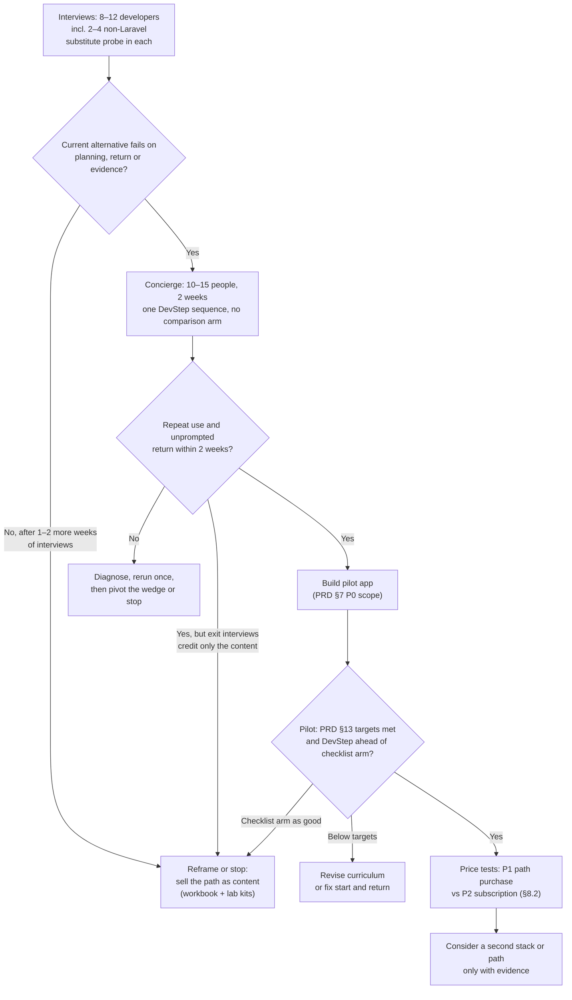

# 11 · Market and positioning

Status: Proposal — for discussion

**Purpose.** Refresh the PRD's competitive comparison (PRD §3) with sourced
public information, propose a positioning for DevStep's wedge, and say plainly
where that wedge looks strong or weak, so the founder can decide what to pursue
before any build starts.

> **Research limits — read first.** Direct page fetching was blocked by this
> environment's network egress policy for every site tried (roadmap.sh,
> boot.dev, educative.io, habitica.com, exercism.org, ankiweb.net, wikipedia).
> Web **search** worked. Every product fact below comes from a search-engine
> extract of the product's **own** domain (queries were restricted to that
> domain), checked **2026-10-06**. Pages were not opened directly, so treat
> each fact as "as indexed on that date". Re-verify prices by opening the page
> before using any figure externally. Anything sourced only from forums,
> wikis or third parties is marked `unverified`. No competitor was
> signed up for, used, or interviewed.

## Summary

- **The PRD's four references are confirmed and, in detail, overlap more than
  the PRD's one-line descriptions suggest.** Boot.dev publicly describes
  spaced-repetition practice weighted towards weak topics ("Training Grounds")
  and a Socratic AI tutor; roadmap.sh sells AI-generated courses, quizzes and
  team progress tracking for US$10/month. [M1, M7]
- **Every individual wedge element already exists somewhere:** roadmaps,
  spaced repetition, step-by-step rubric feedback on design problems, real
  projects, AI tutors and streak protection. DevStep's distinctiveness can
  only be the *combination* plus *content quality*, for a specific user and
  job. *Hypothesis.*
- **The strongest substitute is free or cheap.** Documentation, a calendar,
  and a general AI assistant with a study mode and scheduled reminders. All
  three major assistants publicly describe guided-learning modes. [M30–M35]
- **The interview-prep segment is crowded and clearly priced** (Hello
  Interview, ByteByteGo, Educative, Codemia). DevStep's on-the-job framing
  avoids that fight but targets a segment whose willingness to pay is
  unproven. *Hypothesis.*
- **Candid view: the wedge is moderate as a niche content product and weak as
  a software moat.** What a competitor or AI assistant would find hard to copy
  is reviewed scenarios, rubrics and *measured* retention or transfer results.
  None of these exist yet. *Hypothesis.*
- **Pursue:** content-first validation that probes the "docs + calendar + AI
  study mode" substitute explicitly in every discovery interview. The two-week
  concierge has no comparison arm; the pilot compares DevStep with a static
  checklist (PRD §13 step 4), and whether to add an AI-study-mode condition is
  an open question. If the comparison does as well, sell the path as content.
  **Do not pursue yet:** AI-tutor positioning, multiple stacks, catalogue
  breadth, gamification, team plans. *Proposal.*
- **Laravel-first is a good *recruiting* niche, not yet a *market* decision.**
  Recruit first through Laravel communities to reach credible early
  participants, but describe the product as "for backend developers, with
  examples in Laravel/PHP first". Include 2–4 non-Laravel interviewees to test
  whether the concepts carry across.
  *Proposal / Hypothesis.*
- **Pricing benchmarks span US$8–59/month for subscriptions and roughly
  US$25–349 for one-time or lifetime purchases** (listed prices, USD, often
  promotional). These are anchors for *testing*, not a recommendation.
  [§8]

## 1. How to read this document

| Marker | Meaning |
| --- | --- |
| `[Mn]` | Public-page finding; URL and check date in [Sources](#sources). Describes what the product **says it offers**; not verified by use. |
| `S*` | Official-domain extract, but figures were inconsistent across extracts or look promotional. Use with care. |
| `unverified` | Not confirmed on the product's own page (forum, wiki, third party, or not found). |
| **PRD** | Stated in the PRD (section or ID cited). |
| **Proposal** | Our recommended choice. |
| **Hypothesis** | Opinion or inference that needs validation. Most of §§4–6 and §9 are hypotheses. |
| **Open question** | Needs a founder decision; see the end of the document. |

Rule carried from PRD §3: we describe what each product publicly offers. We
never claim a competitor *lacks* something unless its own page says so. An
"implication" is about DevStep's choices, not a competitor's gaps.

## 2. Refresh of the PRD's four references

The PRD checked these pages on 5 October 2026, one day before this refresh, so
little will have *changed*. This section lists publicly described details that
the PRD's one-line summaries leave out and that bear on the wedge.

| Product | Detail not captured in PRD §3 | Effect on the PRD's implication |
| --- | --- | --- |
| roadmap.sh | Pro plan US$10/month or US$100/year; free tier is limited (e.g. 20 AI chats, 2 AI courses). Users can generate AI courses "on any topic, matched to their exact skill level", with quizzes and AI mock interviews [M1]. Team plan at US$10/seat/month (annual, minimum 3 seats) with custom team roadmaps, progress tracking and skill-gap analysis [M2]. Project ideas with community solution submission and feedback [M3]. iOS app (free with in-app purchases) [M4]. About page reports 3.2M registered users, 369K GitHub stars and 52K Discord members (self-reported) [M2]. | PRD implication stands ("compete on the next action and resumption, not another map"). AI-generated courses and roadmaps at US$10/month set a **low price anchor** for "AI + roadmap". Building R01–R08 roadmap features is not differentiating in itself. |
| Boot.dev | US$59/month or US$399/year; 30-day refund; student and regional (purchasing-power) discounts [M5]. Lessons are free to read, while membership unlocks the interactive checker, the AI tutor "Boots" and certificates [M6]. Boots is described as Socratic, and using it "carries an in-game penalty" [M6]. **Training Grounds**: personalised challenges chosen from completed courses, recent topics, struggles and time-based spaced repetition. Challenges are LLM-generated from hand-written examples and validated on the backend [M7]. Streaks with purchasable "frozen flames" and "embers" to protect them [M8]. Its backend path is described as 16 courses and 8 projects, taking "most beginners about 12 months" [M6]. | Overlap is **higher** than the PRD states. Adaptive review (F05) and AI hints with an assistance cost (F04, F13) are publicly described by Boot.dev, so they are not unique to DevStep. The PRD's response holds: target already-employed developers and engineering *decisions*. Boot.dev's public framing centres on a beginner timeline. |
| Educative | Three annual tiers: Standard US$149, Premium US$199 and Premium Plus US$249 per year. The site cites 1,600+ courses; projects and AI mock interviews from Premium; cloud labs in Premium Plus (lab counts inconsistent across extracts, `S*`) [M9]. "Personalized Paths" start from a 3-minute quiz, and checkpoint assessments condense the curriculum [M10]. AI Code Mentor [M10]. Reports 3.1M developers (self-reported) [M11]. Heavy system-design *interview* catalogue [M11]. | PRD implication stands. Educative also publicly describes **adaptive personalisation**, so "adaptive" alone is not a differentiator. |
| Habitica | Free; reports 4M+ users (self-reported). Missing Dailies "causes you to lose HP", with game rewards and punishments [M12]. Tavern and public Guilds were discontinued on 8 August 2023; Parties and Challenges remain [M13]. Subscription exists; price `unverified` (community wiki only). | Confirms the PRD's design stance (PRD §6: no sickness or punishment). Habitica is a **contrast** reference, not a competitor. Any "habit" framing should avoid HP-loss-style mechanics. |

## 3. Extended landscape

### 3.1 Comparison table

Format key: **S** short sessions · **C** courses or videos · **P** projects or
labs · **R** spaced repetition or review · **AI** AI tutor or generation · **H**
human mentoring or coaching. Prices are as listed in USD on 2026-10-06, before
tax, and may be promotional or regionally adjusted. "Overlap" means overlap with
DevStep's wedge (§4.1) and is a *Hypothesis*.

| # | Product | Publicly described offering | Target user (as described) | Format | Public pricing | Overlap | Implication for DevStep |
| --- | --- | --- | --- | --- | --- | --- | --- |
| **(a)** | **Roadmap / curriculum** | | | | | | |
| 1 | roadmap.sh [M1–M4] | Role roadmaps, project ideas, AI courses and tutor, quizzes, team plans. | Developers choosing a direction; teams. | C, P, AI | Free tier; Pro US$10/mo or US$100/yr; Team US$10/seat/mo (annual, min 3). | Med | Do not compete on maps or AI courses. Compete on the daily next action, return, and evidence. |
| 2 | Boot.dev [M5–M8] | Gamified backend, DevOps and data curriculum; graded coding; projects; Socratic AI tutor; spaced-repetition Training Grounds. | People becoming backend developers (beginner timeline cited). | S, C, P, R, AI | US$59/mo or US$399/yr; 30-day refund. | **High** | Closest product. Differentiate on audience (already employed), on decisions over syntax, and on no streak pressure. |
| 3 | Master.dev, formerly Frontend Masters [M14–M16] | 300+ video courses, 24 learning paths, including *Backend System Design* and *Backend Architecture Fundamentals* (monolith to microservices to serverless). Renamed in June 2026 to signal full-stack scope. | Working engineers across frontend, full-stack, DevOps and AI. | C | US$39/mo or US$390/yr; team pricing. | Low–Med | Long-form expert courses cover the same *concepts*. DevStep must win on application and retention, not explanation. |
| 4 | Laracasts, plus the free official Laravel Learn [M17, M18] | Laravel/PHP video series; "Larabits" short lessons "for when you have five or ten minutes"; public forum. Laravel Learn offers free beginner courses (e.g. 13 lessons, about 120 minutes). | Laravel and PHP developers. | S, C | Laracasts subscription price `unverified` (forum threads conflict); Laravel Learn free. | Med (same audience) | The incumbent in Laravel learning. A Laravel-first DevStep must be clearly *not* a framework course, and should be complementary to it. |
| **(b)** | **Interactive backend / system design** | | | | | | |
| 5 | Educative [M9–M11] | 1,600+ interactive text courses, projects, cloud labs, AI mentor, AI mock interviews, Personalized Paths. | Developers; strong interview-prep emphasis. | C, P, AI | US$149, US$199 or US$249 per year (3 tiers). | Med | Catalogue breadth plus adaptivity is already sold. Do not compete on breadth (PRD §3). |
| 6 | ByteByteGo [M19] | Visual system-design guides, books and courses; reports 1M+ newsletter subscribers. Live cohort programme. | Engineers and interview candidates. | C | One-year and lifetime "pay once" options, amounts `unverified`; Live US$2,999/yr. | Low | Strong at concept explanation. A source of *reading*, not of practice routines. Also a large newsletter channel (§9). |
| 7 | Hello Interview [M20] | Guided practice: step-by-step system-design problems with rubric-based AI feedback per step; courses; AI tutor; paid human mock interviews. | Software-engineering interview candidates. | S, C, AI, H | Premium: 1 month US$59, 1 year US$99, lifetime US$349 list (lower discounted figures shown, `S*`); human mocks about US$170–289 each. | Med | Closest to DevStep's *scenario-decision with rubric* format, but aimed at interviews. Shows rubric-based design feedback is buildable and sellable. |
| 8 | CodeCrafters [M21] | "Build your own Redis, Git, SQLite…" challenges in your own IDE; `git push` to run tests. | Experienced engineers. | P | 3-month, 1-year and lifetime memberships listed; amounts `unverified`. Teams plan for 5+. | Low–Med | Local, test-checked projects (like F07) work for experienced developers. Its focus is internals, not product-system reliability decisions. |
| 9 | Exercism [M22] | Language-fluency exercises with free human mentoring (page cites 84 languages). | Anyone building language fluency. | P, H | Free; "Insiders" extras for donations from US$10/mo. | Low | A free, respected practice substitute. Sets the expectation that practice *can* be free. |
| 10 | Codemia [M23] | 120+ system-design problems with solutions; SM-2 spaced-repetition flashcards for system design, DSA and OOD. | Interview candidates. | P, R | Some problems free; Premium amount `unverified`. | Med | System design combined with spaced repetition is already described publicly. DevStep's angle is delayed *application* checks, not flashcard recall. |
| **(c)** | **Bite-size / habit** | | | | | | |
| 11 | Brilliant [M24] | Interactive lessons in maths, CS, programming and AI. The "Koji" tutor "tracks what you've mastered" and personalises practice and review sessions. | General learners (Koji described as covering "5th grade through college"). | S, R, AI | US$30/mo or US$240/yr (US); family and group plans. | Low–Med | Shows that short interactive sessions with tracked mastery are a mainstream pattern. Not developer-career content. |
| 12 | Mimo / Sololearn [M25, M26] | Mobile-first bite-size coding lessons, hearts/limits, certificates, AI tutors (Mimo Max; Sololearn "Kodie" on MAX). | Beginners and career-changers. | S, AI | Mimo Pro US$9.99/mo, Max US$39.99/mo. Sololearn PRO US$12.99/mo or US$69.99/yr; MAX US$119.88/yr. | Low | A different audience (PRD §4 excludes beginners). Useful as **price anchors** for mobile bite-size practice. |
| 13 | Habitica [M12, M13] | Gamified habits, dailies and to-dos with HP loss for missed dailies. | Anyone tracking habits. | S | Free; subscription price `unverified`. | Low | Contrast case: completion is not competence, and punishment mechanics are rejected (PRD §6). |
| **(d)** | **Spaced repetition** | | | | | | |
| 14 | Anki [M28] | Flashcards with active recall and spaced repetition; SM-2 or FSRS algorithms. | Anyone memorising. | R | Desktop and AnkiDroid free; AnkiMobile US$24.99 one-time. | Med (mechanism) | Developers can already self-schedule recall for free. DevStep must offer *authored* alternate application prompts, which hand-made recall cards do not provide. |
| 15 | Execute Program [M29] | Sequenced developer courses (TypeScript, SQL, regex, Python, JS) with integrated spaced repetition. | Working programmers. | S, C, R | US$39/mo; 16 lessons free. | Med | Closest "spaced repetition for working developers" precedent. Shows the concept is established. DevStep's difference is scenario decisions and reliability topics. |
| **(e)** | **Substitutes** | | | | | | |
| 16 | General AI assistants [M30–M35] | ChatGPT *study mode* (Socratic questions, knowledge checks) and *scheduled tasks*. Claude *Learning mode* (education plans) and Claude Code *Learning* output style. Gemini *Guided Learning* (quizzes, recap, next steps) and *scheduled actions*. | Everyone; study modes framed around students. | S, AI | Free tiers; ChatGPT Go US$8/mo (US), Plus US$20/mo; Claude Pro US$20/mo or US$17/mo billed annually. Gemini scheduled actions need Google AI Pro/Ultra (price not checked). | **High** | The default substitute. DevStep must show it saves planning and improves return *and* transfer compared with this stack (§7). |
| 17 | Documentation + calendar ("do nothing") [M36] | Official docs and blocked calendar time. In the Stack Overflow 2025 survey, technical documentation was the most-used learning resource (≈68%). | Every developer. | — | Free. | **High** | What every participant already has. Probe it in each discovery interview (§7.4). If this plus an AI chat already works for most interviewees, the app is not needed. |

Also noted, not tabled: Codecademy describes AI-driven "Smart Practice"
spaced repetition in its Pro plan (US$39.99/month, or US$19.99/month billed
annually) [M27]. This is a further sign that adaptive review is a common
feature.

### 3.2 What the landscape tells us

| Observation | Evidence | Implication — *Hypothesis* unless marked |
| --- | --- | --- |
| Adaptive or spaced review is now common. | Boot.dev, Codecademy, Codemia, Brilliant, Execute Program, Anki [M7, M23, M24, M27–M29]. | F05 is *table stakes*, not a selling point. Lead with outcomes, not mechanism. |
| AI tutors are everywhere, often with "don't just give the answer" framing. | Boot.dev (penalty for use), Brilliant Koji, ChatGPT, Claude, Gemini [M6, M24, M30–M35]. | Keep F13 at P1 (PRD §7). Do not position on AI. "Bounded, sourced hints" is a quality detail, not a headline. |
| Rubric-based, step-by-step feedback on design problems is sold, but for interviews. | Hello Interview guided practice [M20]. | The format is validated commercially. DevStep's angle is *on-the-job* decisions with delayed alternate checks. |
| Prices cluster: US$8–20/mo for AI assistants and light apps; US$30–59/mo for premium developer platforms. | §8. | A new single-path product must justify itself against free and US$8–20 substitutes. |
| Large incumbents publicly describe team progress tracking. | roadmap.sh Teams [M2]; Educative, Master.dev team plans [M9, M15]. | PRD §15 is right to defer team plans and avoid surveillance-style scores. |
| The Laravel learning space has a strong incumbent plus free official courses. | Laracasts, Laravel Learn [M17, M18]. | Laravel-first positioning must not read as "another Laravel course". |

## 4. Positioning

### 4.1 The wedge (restated from PRD §3)

**PRD:** *a constrained, adaptive practice routine for employed developers,
combining one continuing engineering scenario, limited daily choice, easy
return after absence, and visible evidence of retained skills.*

Broken into testable parts (*Proposal*):

| Wedge element | PRD anchor | Already described publicly by (examples) |
| --- | --- | --- |
| For **employed** developers, about 1–5 years' experience | §1, §4 | Master.dev, CodeCrafters, Execute Program (working engineers) |
| **One continuing engineering scenario** (work-order app) | §8, F07 | Partly: Boot.dev and roadmap.sh projects, CodeCrafters (one artefact per challenge) |
| **Limited daily choice** (one recommended action) | F02 | Partly: Training Grounds picks a challenge for you [M7] |
| **Easy return after absence** (no debt, small restart) | §6, F06, R05 | Different philosophy: Boot.dev protects streaks via purchasable items [M8] |
| **Visible evidence of *retained* skill** (delayed alternate checks) | F04, F08, §9 | Partly: Brilliant "tracks what you've mastered"; spaced-repetition products track recall |

No single element is unique. The **bundle**, aimed at **on-the-job reliability
decisions**, is DevStep's proposed position. *Hypothesis.*

### 4.2 Axes and 2×2 view

Axes chosen (*Proposal*):

- **X: breadth of catalogue ↔ one guided path.** This maps to "limited daily
  choice" and "one continuing scenario" (F02, §8). Breadth answers "what can I
  learn?"; a guided path answers "what do I do *now*?".
- **Y: content consumption ↔ demonstrated evidence.** This maps to the PRD's
  success definition (§1) and F04/F08 ("reading alone cannot raise skill
  level"). The question is whether a product records what you *read or
  completed*, or what you *showed you can do later*.

Rejected axes: "AI vs no AI" (everyone has AI) and "price" (an outcome, not a
position). Audience (beginner vs employed; interview vs on-the-job) is shown as
a tag instead.

Placement is a *Hypothesis* based on public descriptions only. Products often
span quadrants; the cell shows their **predominant public emphasis**.

| | **Breadth of catalogue** | **One guided path / constrained** |
| --- | --- | --- |
| **Demonstrated evidence** (graded practice, tests, rubrics, delayed checks) | Boot.dev (graded + Training Grounds) · Codecademy Smart Practice · Codemia *(interview)* · Exercism · Anki *(recall only)* | **DevStep target** *(on-the-job, retained evidence)* · Hello Interview guided practice *(interview)* · CodeCrafters *(one challenge at a time, tests)* · Execute Program *(sequenced + SRS)* |
| **Content consumption** (read, watch, generate) | Educative · Master.dev · Laracasts · ByteByteGo · roadmap.sh AI courses · Brilliant · Mimo / Sololearn | Laravel Learn *(single beginner course)* · a single Master.dev learning path · general AI study mode on one topic · docs + calendar |

**Reading of the 2×2** (*Hypothesis*): the target quadrant is **not empty**.
DevStep's neighbours there are interview-focused (Hello Interview),
internals-focused (CodeCrafters) or language-focused (Execute Program).
DevStep's claim is the intersection of *employed backend developer* × *system
reliability decisions* × *retained, not merely demonstrated, evidence* ×
*no-guilt return*. That is a real but narrow space. It needs content quality to
hold.

### 4.3 Draft positioning statement (*Proposal*, for interview testing only)

> For employed backend developers who can ship CRUD features but want to make
> performance and reliability decisions with confidence, DevStep is a practice
> routine that gives one next step in a continuing system scenario, lets you
> come back after a gap without catch-up debt, and shows what you can still do
> weeks later. It focuses on decisions you make at work and on skills you keep,
> not on content you have watched.

### 4.4 Messaging guardrails

| Do | Avoid | Why |
| --- | --- | --- |
| "Know what to practise next" (PRD promise) | "Never fall behind", "don't get left behind" | PRD §1 forbids fear of obsolescence. |
| "Evidence you can use it weeks later" | "Master system design" | PRD §5 example; retained ≠ mastered. |
| "Start with three minutes" | "Build a streak" | PRD §6, §13 guardrails; Habitica/Boot.dev contrast. |
| "Reviewed scenarios and rubrics" | "AI-powered" as the headline | AI is common (§3.2) and optional in the PRD (§11). |
| "Choose architecture by trade-offs" | "Learn microservices" | PRD §1, §8 module 6; Fowler reference in PRD [8]. |

## 5. Differentiation hypotheses

Each hypothesis is meant to be **falsified** cheaply before code. The stages
map to PRD §13 (interviews → concierge → pilot). Copyability is a *Hypothesis*:
**Low** means months of authored or reviewed work; **High** means a UI or prompt
change.

| ID | Differentiation hypothesis | Falsified if… (stage) | Copyable by a competitor | Copyable by a general AI assistant |
| --- | --- | --- | --- | --- |
| D1 | **No-debt return** (small restart, no streak loss, capped reviews) increases return after absence. | Interviews: abandonment reasons are rarely "fell behind / guilt", and mostly relevance or time. Concierge: participants who miss a scheduled session rarely come back unprompted within the two weeks. Pilot: return after absence below 40% (PRD §13), or no better than the checklist arm. | **High**: a UX pattern. Boot.dev already offers streak protection [M8]. | **Med**: scheduled tasks can nudge [M31, M35]. The user must still design the restart. |
| D2 | **One continuing scenario** (work-order app) makes concepts feel relevant and improves transfer. | Interviews: users say they want *their own* codebase or work problems, not a fictional app. Pilot: transfer gain is no better than the checklist arm; "felt irrelevant" is a top-3 dropout reason. | **Med**: needs authored scenario arcs; incumbents with content teams could. | **Med–Low**: AI can generate scenarios, but consistency and correctness across six weeks is unproven. |
| D3 | **On-the-job reliability decisions** (not interview prep) are under-served *for this persona* and valued. | Interviews: most abandoned courses were interview prep and interview success is the real goal; or users say docs and AI already answer "what to investigate". | **Med**: Master.dev and ByteByteGo cover the concepts [M16, M19]; reframing is easy, authoring practice is not. | **High** for explanation, **Med** for structured practice. |
| D4 | **Evidence ladder** (introduced → practised → demonstrated → retained) motivates return and is worth paying for. | Concierge: participants do not look at or mention evidence. Interviews: no observable skill they would pay to gain (PRD §16 question). Pilot: Evidence screen views do not relate to return. | **High** for the UI, **Low–Med** for substance (needs alternate items, rubrics, delayed checks). | **Med**: memory exists, but a durable, versioned evidence record is assembled by the user. |
| D5 | **One recommended action** reduces start friction compared with browsing. | Concierge: participants routinely ignore the given task. Pilot: median start friction above 2 minutes (PRD §13); frequent requests to browse. | **High**. | **High**: "Tell me what to do today" is one prompt. |
| D6 | **Authored, reviewed content and rubrics** are more trustworthy than AI-generated lessons for performance and reliability topics. | Discovery and concierge exit interviews: people who already study these topics with an AI study mode rate it equal on usefulness and trust. Desk check: the reviewer finds similar error rates in AI answers to the sample prompts. | **Low–Med**: requires reviewers and time (PRD §8, §14). | **Med**: quality of AI explanations keeps improving. This is the most time-sensitive hypothesis. |
| D7 | **Laravel-flavoured labs** lower setup and relevance barriers for Laravel developers. | Interviews: Laravel developers say Laracasts plus docs already cover this. Concierge: Laravel and non-Laravel participants show similar activation; non-Laravel participants are fine with PHP labs. | **High** for Laracasts or Laravel-ecosystem authors. | **Med**. |

**Reading** (*Hypothesis*): D1, D4 and D5 are easy to copy. D2, D3 and D6 are
where defensibility could come from, and all three depend on **content
quality**, which matches PRD §3 ("defensibility comes from … authored
scenarios, reviewer rubrics, and validated learning sequences"). The most
valuable asset would be *published, measured pilot outcomes* (transfer and
delayed retention). Competitors cannot copy those without running their own
studies.

## 6. Where the wedge is strong and weak (candid assessment)

*All rows are Hypotheses.*

| Aspect | Assessment | Reason |
| --- | --- | --- |
| Problem reality | **Plausible, unproven** | PRD §2 lists no interviews. The learning-science basis is sound (PRD [1–3]), but demand is not shown. |
| Novelty of mechanism | **Weak** | Every mechanism is publicly described elsewhere (§3.2). |
| Novelty of combination and audience | **Moderate** | Few public offerings target *employed* developers on *reliability decisions* with *retained* evidence. |
| Defensibility | **Weak now; moderate if pilot outcomes are strong** | Content and outcome data are slow to copy. Features are not. |
| Substitute pressure | **High and rising** | Free AI study modes and scheduled reminders improve every quarter [M30–M35]. |
| Willingness to pay | **Unknown** | Clear WTP exists for interview prep (§8). On-the-job upskilling WTP is untested. Employer learning budgets may matter. |
| Founder fit | **Strong for the first path** | PRD §8: Laravel/PHP and SQL are the creator's practical strengths. Credible authored content is the moat. |

**Bottom line** (*Hypothesis*): the wedge is worth **testing**, cheaply and
content-first. It is not yet worth a software build. The app's job is to make
a good curriculum easier to *start, resume and prove*. If a well-made workbook
plus calendar plus AI chat does that equally well, then the product is the
**content**, not the app. The signals are discovery interviews, concierge exit
interviews and, decisively, the pilot's static-checklist arm (same content, no
app guidance). The delivery plan carries this content-only branch at its
Phase 2 and Phase 5 checkpoints (`12-delivery-plan.md`).

## 7. The "do nothing / substitute" threat

### 7.1 What the substitute stack looks like

| Component | Publicly described capability | Cost |
| --- | --- | --- |
| Official documentation | Most-used learning resource in the Stack Overflow 2025 survey (≈68%) [M36]. | Free |
| Calendar | Recurring time blocks and reminders. | Free |
| General AI assistant | Study/learning modes with guiding questions and knowledge checks [M30, M33, M35]. Scheduled or recurring tasks (ChatGPT: once-per-day recurring on Free; Gemini: on Google AI Pro/Ultra) [M31, M35]. | Free to about US$20/month [M32, M34] |
| Free practice | Exercism mentoring, roadmap.sh project ideas, Anki [M3, M22, M28]. | Free |

The Stack Overflow 2025 survey reports 84% of respondents using or planning to
use AI tools in development [M36]. A figure for *learning* with AI tools
appeared inconsistently across extracts and is `unverified`.

### 7.2 What the substitute leaves to the learner

Phrased as *work the learner must do themselves*, not as missing features:

- Decide **what** to study next and in **what order**: planning effort.
- Write or find **realistic scenarios** and judge whether AI-generated ones
  are correct.
- Design **alternate, delayed checks** and remember to take them.
- Keep a **record of evidence** across weeks and devices.
- Restart after a gap **without** rebuilding the plan.

### 7.3 What DevStep must do measurably better

PRD §3 says DevStep must "save planning effort and improve follow-through
enough to justify another tool". *Proposal:* make this concrete at each stage,
without asking a stage to measure what it cannot.

- **Concierge (two weeks, 10–15 people):** no comparison arm. Split two ways,
  it would leave about six people per arm, too few to tell the arms apart, and
  two weeks cannot show week-4 retention or delayed checks. It uses two-week
  measures only, with unprompted return as the kill test
  (`10-measurement-and-validation.md` owns the definitions).
- **Pilot (six weeks plus delayed checks):** participants are randomised to
  DevStep or a static checklist with the same content and reminders (PRD §13
  step 4; `10-measurement-and-validation.md` owns the design). Whether to add an
  AI-study-mode condition is open question 1.

The relative bars below are decision rules for this project, not industry
benchmarks. Small samples are directional only (PRD §13).

| Dimension | Concierge measure (2 weeks, absolute only) | Pilot measure | PRD absolute target (pilot) | Proposed *relative* bar vs the pilot comparison arm |
| --- | --- | --- | --- | --- |
| Planning effort | Exit interview: time spent deciding what to study, against their usual approach | Self-reported minutes per week spent deciding what to study; start friction | Start friction under 2 min | Noticeably less planning time reported by most DevStep participants. |
| Follow-through | Repeat use: submissions on at least 3 distinct days, at least 1 in week 2 | Week-4 retention (days 22–28) | ≥ 35% | At least 10 percentage points higher (*Hypothesis* threshold). |
| Return after absence | Unprompted return after a missed scheduled session, with template emails only | Task completed within 7 days of returning after 7 inactive days | ≥ 40% | Higher than the comparison arm; report denominators. |
| Transfer | Not measured (too short) | Baseline → unseen final scenario, same rubric | Median gain 15 pp | **Not lower** than the comparison arm. |
| Retention | Unassisted answers on alternate review prompts (directional) | Delayed alternate checks ≥ 7 days | ≥ 65% | Not lower than the comparison arm. |
| Burden | The two weekly burden items | "Plan felt manageable" | ≥ 70% agree | Equal or better. |
| Trust | Content errors found by reviewer or participants | Same | — | Zero known uncorrected errors. |

**Decision rule** (*Proposal*): if, in the pilot, DevStep's arm does not beat
the comparison arm on **follow-through or return**, and match it on
**transfer**, do not build more of the PRD §7 app. Sell the path as content
instead: a guided workbook with the lab kits. The concierge cannot apply this
rule, but it can point the same way when participants return and exit
interviews credit only the content, not the next step, the return emails or the
evidence feedback. `12-delivery-plan.md` carries this branch at its Phase 2
(concierge) and Phase 5 (pilot) checkpoints. Agree it before Phase 2 starts,
when the go/no-go thresholds are frozen.

### 7.4 Probing the substitute (*Proposal*)

Before any comparison is run, ask about the substitute directly. Every discovery
interview covers it, and the concierge exit interviews repeat the last two
probes. These feed the "current alternative" question in
`10-measurement-and-validation.md` and gate 1.

| Probe | What to listen for | Hypothesis it tests |
| --- | --- | --- |
| "What do you use today to learn a work skill like this?" Prompt for docs, calendar blocks, AI chat or study mode, courses. | Which parts of the substitute stack they actually use, not what they own. | §7.1 is the real baseline. |
| "Walk me through the last time you used an AI assistant to study, not to get an answer." | Whether it planned, quizzed or reminded them, and for how long they kept using it. | D5, D6 |
| "Where did that set-up stop working?" | Planning effort, restarting after a gap, no record of progress, trust in answers (§7.2). | D1, D4, D6 |
| "If you had this sample as a workbook, with your calendar and an AI chat, what would you still be missing?" | Whether the gap is the app or only the content. | Content-only branch (§7.3) |

If the pilot design adds an AI-study-mode condition (open question 1), a
sketch of it, built on the pilot's static checklist:

```yaml
ai_study_mode_condition:
  materials: the pilot's static checklist (same missions, lab kits, transfer tasks)
  planning: participant schedules their own sessions in their calendar
  ai_use: allowed; suggested starter prompt for a study or learning mode provided
  reminders: same reminder text and schedule as the other arms
  devstep_specific_withheld: [today_recommendation, recovery_flow, evidence_view]
  measured: same pilot metrics + weekly planning-minutes question + declared AI use
```

## 8. Public pricing benchmarks (for PRD §15 tests, not a recommendation)

All USD as listed on official pages via search extracts, checked 2026-10-06.
Prices vary by region (Boot.dev and ChatGPT Go describe localised pricing
[M5, M32]), tax and promotions.

### 8.1 Benchmarks by model

| Model | Product | Listed price | Ref |
| --- | --- | --- | --- |
| Low monthly | ChatGPT Go | US$8/mo (US) | M32 |
| Low monthly | Mimo Pro | US$9.99/mo | M25 |
| Low monthly / annual | roadmap.sh Pro | US$10/mo; US$100/yr | M1 |
| Low monthly / annual | Sololearn PRO | US$12.99/mo; US$69.99/yr | M26 |
| Mid monthly | ChatGPT Plus; Claude Pro | US$20/mo; Claude Pro US$17/mo billed annually | M32, M34 |
| Mid annual | Educative | US$149, 199 or 249/yr | M9 |
| Mid annual | Brilliant | US$30/mo; US$240/yr | M24 |
| Premium monthly | Execute Program | US$39/mo | M29 |
| Premium monthly / annual | Master.dev | US$39/mo; US$390/yr | M15 |
| Premium monthly | Mimo Max; Codecademy Pro | US$39.99/mo each (Codecademy US$19.99/mo billed annually) | M25, M27 |
| Premium monthly / annual | Boot.dev | US$59/mo; US$399/yr | M5 |
| Time-boxed pass | Hello Interview | 1 month US$59; 1 year US$99 (list, `S*`) | M20 |
| One-time / lifetime | AnkiMobile | US$24.99 one-time | M28 |
| One-time / lifetime | Hello Interview lifetime | US$349 list (lower discounted price shown, `S*`) | M20 |
| One-time / lifetime | ByteByteGo; CodeCrafters; Laracasts | Lifetime or "pay once" options exist; amounts `unverified` | M19, M21, M17 |
| Human service | Hello Interview mock interview | about US$170–289 per session | M20 |
| Cohort | ByteByteGo Live | US$2,999/yr | M19 |
| Free | Exercism; Laravel Learn; Anki desktop; AI free tiers | US$0 | M22, M18, M28, M30 |

### 8.2 Options to test later (after the PRD §13 pilot shows learning and retention)

| Option | Shape | Anchors it will be compared with | Fits if… | Risk | Test method (*Proposal*) |
| --- | --- | --- | --- | --- | --- |
| P1 | **One-time path purchase** (one finite path, lifetime access to that version) | AnkiMobile (tool), lifetime interview platforms, one month of a premium platform | The path is finite and completable (PRD §8A); users see a clear endpoint. | Revenue stops after purchase; reviews and updates have ongoing cost. | Interview price-sensitivity questions; later a clearly refundable pre-order to pilot alumni. |
| P2 | **Subscription** | roadmap.sh at the low end, Boot.dev at the high end, AI assistants in the middle | New reviewed paths and maintenance practice give recurring value (PRD §15). | Competes directly with US$8–20 general AI and breadth catalogues. | Only after a second path exists; compare retention of paying users by month 3. |
| P3 | **Path + paid progress review** (human review of lab evidence) | Hello Interview human mocks | Users value expert review of their decision records (PRD §15 "personal progress review"). | Does not scale with one founder; reviewer cost. | Offer to a few pilot completers; measure take-up and review time. |
| P4 | **Employer-expensed individual purchase** (not a team plan) | Educative, Master.dev and roadmap.sh team pricing | Participants have learning budgets they can spend themselves. | Can drift towards employer reporting; PRD §15 cautions against surveillance. | Interview question: "Do you have a learning budget? What has it paid for?" |

Do not collect payment before the pilot has shown learning and retention
(PRD §15). Any pre-order test must be explicit and refundable.

## 9. Pilot recruiting channels (channels only, no outreach)

PRD §15: recruit through relevant developer communities, personal
professional contacts and a publicly usable sample scenario, subject to
community rules. **Read each community's current rules before any post. Where
rules are marked `unverified`, they could not be checked.**

| Channel | Audience fit | Best stage | Rules / notes | Ref |
| --- | --- | --- | --- | --- |
| Personal professional network, former colleagues | High trust; mixed stacks | Interviews, concierge | Selection bias towards friendly participants. Keep a log of recruit source. | PRD §15 |
| Laravel.io (forum and community portal) | Laravel developers | Interviews (ask for stories, not promotion) | Listed as an official support channel in Laravel's contribution guide. Posting rules `unverified`. | M40 |
| Laracasts forum | Laravel/PHP developers | Interviews | Laracasts is also a potential competitor or partner. Posting rules `unverified`. | M17, M40 |
| Laravel Discord / Larachat | Laravel developers | Interviews | Listed among Laravel support channels. `#internals` is for framework development and is not suitable for recruiting. Rules `unverified`. | M40 |
| Laravel News | 48,000+ newsletter subscribers, about 45% open rate (self-reported) | Public sample scenario (after pilot readiness) | Link submissions are for packages and tutorials and feed the newsletter. Sponsorship tiers start at US$500/month. Paid placement is premature for a free pilot. | M39 |
| Hacker News "Show HN" | Broad, experienced developers | Public sample scenario | Must be something people can try, ideally without sign-up. Sign-up pages and newsletters are off-topic. Do not ask for upvotes. Suits the PRD's "value before account" sample (§5). | M41 |
| DEV Community | Broad developer audience | Write-up of a sample scenario | Content must be substantial and "not designed primarily for the purposes of promotion". Affiliate links must be disclosed. | M43 |
| Lobsters | Experienced, technical | Low priority | Self-promotion should be under a quarter of one's stories and comments, and the site is a community, not a marketing channel. Joining process `unverified`. | M42 |
| Reddit (r/laravel, r/PHP, r/ExperiencedDevs and similar) | Mixed; ExperiencedDevs matches the 1–5+ year persona | Interviews | Could not be checked (site not reachable by the research tool). Rules `unverified`. Many subreddits restrict self-promotion and surveys; read the sidebar first. | — |
| Backend newsletters (e.g. ByteByteGo, 1M+ subscribers) | Broad backend and interview audience | Later, if a broader stack is pursued | Audience is mostly outside the Laravel niche, and paid placement pricing is `unverified`. | M19 |
| PHP / Laravel meetups and conferences | Laravel developers, in person | Interviews, concierge | Event details and speaker/sponsor rules `unverified`. In-person conversations suit the "last course you abandoned" interview (PRD §13). | — |

Market-size signals for the Laravel niche (context, not a forecast):

- **State of Laravel 2025:** 3,238 completed responses. 94.84% use Laravel in a
  business context (employment, freelancing or self-employment). 32.03% have
  2–5 years' Laravel experience. Most respondents have 5–20 years' general
  programming experience [M37].
- **JetBrains State of PHP 2025:** Laravel used by 64% of 1,720 respondents
  whose main language is PHP [M38].

## 10. Recommendation

### 10.1 Pursue / do not pursue

*All items are Proposals; reasons are Hypotheses.*

| Pursue now (planning and discovery) | Reason |
| --- | --- |
| Interviews (PRD §13 step 1) that ask what the *current alternative* fails to do. Include at least 2–4 non-Laravel backend developers and probe whether goals are interview or on-the-job. | Tests D3 and D7, and the PRD §16 open questions. |
| An explicit **substitute probe** in every interview: docs, calendar and AI study mode, what people use today and why it stops working (§7.4). | The cheapest early test of whether an app is needed at all. |
| A concierge with **one DevStep sequence and no comparison arm**; the comparison waits for the pilot's static-checklist arm (§7.3). | About six people per arm over two weeks could not separate the arms. The concierge tests unprompted return instead. |
| Content-first: author module 1–2 missions and one lab to reviewer standard before app work. | Content is the only plausible moat (D2, D6). |
| Position on outcome ("evidence you can still use it"), not on AI or gamification. | §3.2: AI and adaptivity are common. |
| Publish a no-signup sample scenario once it is reviewed. | Fits PRD §5 and HN/DEV rules (§9). |

| Do not pursue (yet) | Reason |
| --- | --- |
| AI tutor as a launch feature or headline | Widely available elsewhere; PRD already sets it at P1 (F13). |
| Multiple stacks or paths, and a broad catalogue | Competes with Educative, Master.dev and roadmap.sh on their strength (PRD §3). |
| Streaks, companions, leaderboards | Easy to copy, at odds with PRD §6, and Boot.dev and Habitica own this space. |
| Interview-prep positioning | Crowded and priced (§3, §8); PRD §4 excludes it. |
| Team or employer plans | PRD §15; incumbents already publicly describe team progress tracking. |
| Paid acquisition (newsletter sponsorships) | Premature before a pilot shows learning and retention. |

### 10.2 Is Laravel-first a good recruiting niche? (PRD §16)

| For | Against |
| --- | --- |
| Founder credibility and content quality (PRD §8). | Laracasts and the free Laravel Learn are well-known incumbents in Laravel learning [M17, M18]. |
| Reachable, named community hubs (Laravel.io, Laracasts forum, Discord, Laravel News) [M39, M40]. | The audience is smaller than general backend. Some "reliability" topics may feel non-Laravel-specific, which could invite the question "why Laravel?". |
| Laravel is the main PHP framework among PHP-main developers in the JetBrains survey (64%) [M38]. It is mostly used at work (95% business context in State of Laravel 2025), which matches the employed persona [M37]. | Labs in PHP may deter non-PHP developers, which limits later expansion without a second stack (PRD §8 cautions to confirm fit first). |
| A narrow niche makes 8–12 interviews and 10–15 concierge participants realistic. | Risk of being read as a framework course rather than engineering practice. |

**Verdict** (*Hypothesis*): Laravel-first is a **good recruiting niche for
discovery, concierge and pilot**. It is **too narrow to treat as the market
definition**. Keep the promise and the concepts stack-neutral ("backend
developers; first examples in Laravel/PHP and SQL"). Decide on a second stack
only if non-Laravel interviewees show the same pain *and* would use PHP labs or
ask for their own stack.

### 10.3 Decision gates for positioning



## Open questions for discussion

1. **Should the pilot comparison include an AI-study-mode condition (sketch in
   §7.4)?** *Recommended default:* not as a third randomised arm. With 30–50
   participants, three arms leave about 10–17 people each, too few to read a
   difference. Record declared AI use in both arms and ask about it in exit
   interviews (`10-measurement-and-validation.md` owns the pilot design). The
   reason to keep the question open: what developers actually have is docs, a
   calendar and an AI study mode, not a static checklist, so a pilot win over
   the checklist does not show a win over that stack. Revisit if discovery shows
   most interviewees already study with AI, or test it in a later, larger cohort
   if the pilot is positive.
2. **How do we frame Laravel-first publicly?** *Recommended default:* "for
   backend developers; first examples in Laravel/PHP and SQL". Recruit mainly
   from Laravel channels, and include 2–4 non-Laravel interviewees.
3. **If the content-only branch is taken (§7.3), what form comes first?**
   *Recommended default:* a self-paced workbook with the lab kits, because it
   needs no facilitator time from a solo founder. Run it as a cohort only if
   exit interviews show that a shared schedule, not the content, is what kept
   people going.
4. **Do we keep interview-prep users excluded?** *Recommended default:* keep
   them excluded from the pilot (PRD §4), but record in interviews whether
   abandoned courses were interview-driven. Revisit if that is the majority.
5. **Which price structure do we test first after the pilot?** *Recommended
   default:* a one-time path purchase (P1), because the curriculum is finite
   (PRD §8A, §15). Ask about subscriptions and learning budgets in interviews,
   with no payment collection before pilot evidence.
6. **Should "AI" appear in positioning at all?** *Recommended default:* no.
   Mention bounded, sourced hints only as a feature detail once F13 ships.
7. **Should we approach Laracasts or the Laravel ecosystem as a potential
   partner rather than a competitor?** *Recommended default:* not before pilot
   evidence. Revisit if the pilot shows the path complements framework
   courses.
8. **How often is this landscape refreshed, and by what method?**
   *Recommended default:* before each phase gate in PRD §14, with direct page
   checks, since this version relied on search extracts. Re-verify every price
   before external use.

## PRD traceability

| PRD reference | Covered in |
| --- | --- |
| §1 Product decision, promise, no fear marketing | §4.3, §4.4 |
| §2 Research findings (roadmaps, lessons, projects and AI exist) | §2, §3.2 |
| §3 Competitive landscape, proposed wedge, defensibility | §2, §3, §4.1, §5, §6 |
| §4 Persona, exclusions (beginners, interview cramming) | §3.1 overlap ratings, §4.2, §10.1, OQ4 |
| §5 Value before account creation | §9 (Show HN fit), §10.1 |
| §6 No punishment or guilt mechanics | §2 (Habitica), §4.4, §10.1 |
| §8 Laravel/PHP first implementation; future tracks | §10.2, OQ2 |
| §8A Finite roadmap with completion milestone | §8.2 option P1 |
| §13 Validation sequence, comparison with checklist, metrics | §5, §7.3, §7.4, §10.3, OQ1 |
| §14 Content as schedule driver; phase gates | §10.1, OQ8 |
| §15 Free pilot; path purchase vs subscription; team plans later | §8, §9, §10.1, OQ5 |
| §16 Differentiation risk; open question "Is Laravel-first the best recruiting niche?"; "What does their current alternative fail to provide?" | §5, §6, §7, §10.2, OQ2, OQ3 |
| F02, F04, F05, F06, F07, F08 | §4.1 wedge mapping, §5 |
| F13 Bounded AI tutor (P1) | §3.2, §10.1, OQ6 |
| R01–R08 Roadmap requirements | §2 (roadmap.sh implication) |

## Sources

All checked **2026-10-06** through web-search extracts restricted to the named
official domain. Pages were not opened directly because of the environment's
egress block. Self-reported user numbers are the companies' own claims.

- **M1** roadmap.sh Premium — https://roadmap.sh/premium
- **M2** roadmap.sh About and Teams — https://roadmap.sh/about, https://roadmap.sh/teams
- **M3** roadmap.sh backend projects — https://roadmap.sh/backend/projects, https://roadmap.sh/backend/project-ideas
- **M4** roadmap.sh iOS app listing — https://apps.apple.com/mg/app/roadmap-sh/id6756168440
- **M5** Boot.dev pricing — https://www.boot.dev/pricing
- **M6** Boot.dev home, backend path and comparison posts — https://www.boot.dev/, https://www.boot.dev/paths/backend?tech=python-golang, https://www.boot.dev/blog/education/bootdev-vs-codecademy
- **M7** Boot.dev Training Grounds — https://blog.boot.dev/news/training-grounds-launch/, https://www.boot.dev/training
- **M8** Boot.dev streaks, frozen flames and embers (monthly "Boot.dev Beat" posts; exact post not isolated) — https://www.boot.dev/blog/news
- **M9** Educative plans — https://www.educative.io/unlimited
- **M10** Educative AI features and Personalized Paths — https://www.educative.io/ai-learning, https://www.educative.io/blog/learn-to-code-personalized-learning-plans
- **M11** Educative home and system design courses — https://www.educative.io/, https://www.educative.io/courses/grokking-the-system-design-interview
- **M12** Habitica home, features and FAQ — https://habitica.com/, https://habitica.com/static/features, https://habitica.com/static/faq
- **M13** Habitica Tavern and Guild discontinuation — https://habitica.com/static/faq/tavern-and-guilds
- **M14** Frontend Masters becomes Master.dev — https://blog.master.dev/today-frontend-masters-becomes-master-dev/
- **M15** Master.dev / Frontend Masters pricing — https://frontendmasters.com/join/, https://master.dev/join/
- **M16** Backend courses — https://frontendmasters.com/courses/backend-system-design/, https://frontendmasters.com/courses/backend-architectures/
- **M17** Laracasts home, Larabits and FAQ — https://laracasts.com/, https://laracasts.com/series/jeffreys-larabits, https://laracasts.com/faq
- **M18** Laravel Learn — https://laravel.com/learn
- **M19** ByteByteGo pricing, guides and Live — https://bytebytego.com/pricing, https://bytebytego.com/guides/, https://live.bytebytego.com/pricing, https://blog.bytebytego.com/about
- **M20** Hello Interview pricing, premium and guided practice — https://www.hellointerview.com/pricing, https://www.hellointerview.com/premium, https://www.hellointerview.com/practice/system-design
- **M21** CodeCrafters home and pricing — https://codecrafters.io/, https://codecrafters.io/pricing
- **M22** Exercism home and Insiders — https://exercism.org/, https://exercism.org/insiders
- **M23** Codemia — https://codemia.io/
- **M24** Brilliant Premium and Koji — https://brilliant.org/subscribe/, https://brilliant.org/help/features/how-does-koji-work/
- **M25** Mimo plans — https://mimo.org/pro, https://support.mimo.org/hc/en-us/articles/14951451385746-What-s-the-difference-between-Mimo-Pro-and-Mimo-Max-subscriptions
- **M26** Sololearn plans — https://www.sololearn.com/en/plans
- **M27** Codecademy pricing and Smart Practice — https://www.codecademy.com/pricing, https://www.codecademy.com/resources/blog/behind-the-build-smart-practice
- **M28** Anki and AnkiMobile FAQ — https://apps.ankiweb.net/, https://faqs.ankiweb.net/why-does-ankimobile-cost-more-than-a-typical-mobile-app.html, https://faqs.ankiweb.net/what-spaced-repetition-algorithm
- **M29** Execute Program — https://www.executeprogram.com/, https://www.executeprogram.com/spaced-repetition
- **M30** ChatGPT study mode — https://openai.com/index/chatgpt-study-mode/, https://help.openai.com/en/articles/11780217-using-study-mode-in-chatgpt
- **M31** ChatGPT scheduled tasks — https://help.openai.com/en/articles/10291617-scheduled-tasks-in-chatgpt
- **M32** ChatGPT pricing and Go — https://chatgpt.com/pricing/, https://openai.com/index/introducing-chatgpt-go/
- **M33** Claude Learning mode and Claude Code output styles — https://www.anthropic.com/news/introducing-claude-for-education, https://code.claude.com/docs/en/output-styles
- **M34** Claude pricing — https://claude.com/pricing
- **M35** Gemini Guided Learning and scheduled actions — https://blog.google/products-and-platforms/products/education/guided-learning/, https://support.google.com/gemini/answer/16316416
- **M36** Stack Overflow Developer Survey 2025 — https://survey.stackoverflow.co/2025/, https://survey.stackoverflow.co/2025/developers
- **M37** State of Laravel 2025 results — https://stateoflaravel.com/results
- **M38** JetBrains, The State of PHP 2025 — https://blog.jetbrains.com/phpstorm/2025/10/state-of-php-2025/
- **M39** Laravel News sponsorship, advertising and submissions — https://laravel-news.com/sponsor, https://laravel-news.com/advertising, https://laravel-news.com/submit
- **M40** Laravel contribution guide (support channels) and Laravel.io — https://laravel.com/docs/12.x/contributions, https://laravel.io/
- **M41** Hacker News Show HN guidelines — https://news.ycombinator.com/showhn.html, https://news.ycombinator.com/newsguidelines.html
- **M42** Lobsters About (self-promotion) — https://lobste.rs/about
- **M43** DEV Community terms and code of conduct — https://dev.to/terms, https://dev.to/code-of-conduct
