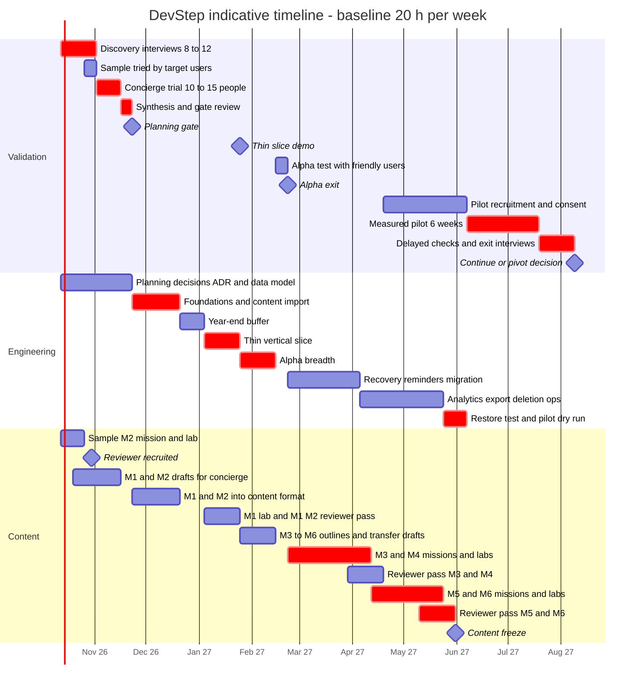
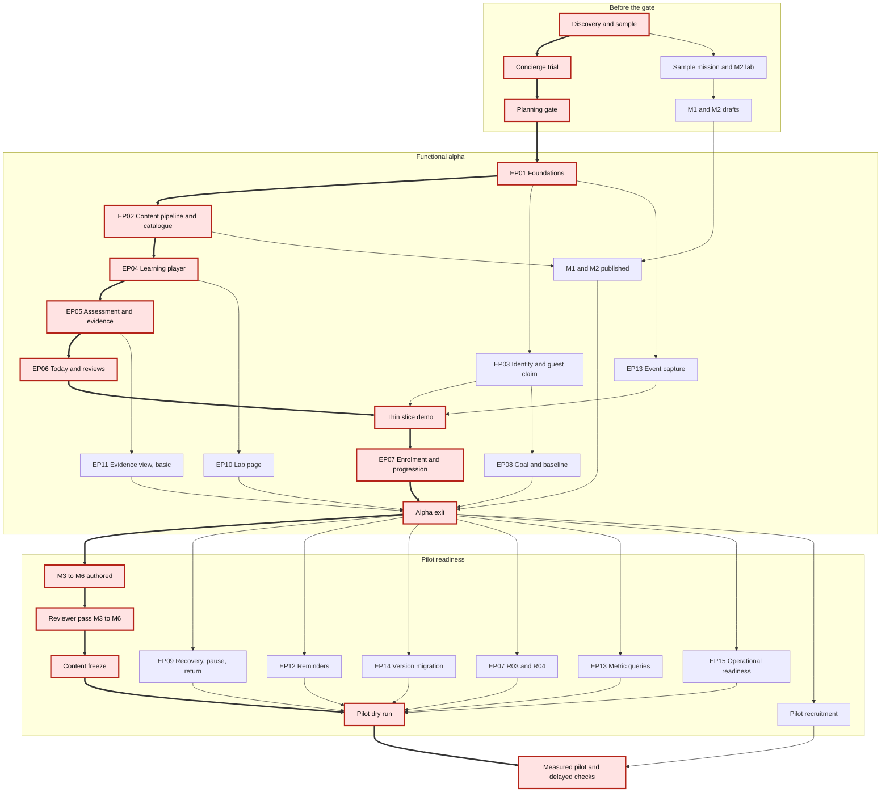

# 12 · Delivery plan

Status: Proposal — for discussion

## Purpose

This plan sets what to do, in what order, and what to leave out between today's
planning and a continue/pivot decision on the first DevStep pilot. It decides
sequencing, gates and scope. It does not choose vendors (`01-tech-stack-and-hosting.md`),
design the architecture (`02-system-architecture.md`) or define metrics
(`10-measurement-and-validation.md`).

## Summary

- **No product code before the planning gate (§1).** The gate comes after
  discovery (with gate 1) and a two-week concierge trial. Until then the founder's hours go
  into interviews and authoring Modules 1–2, which the concierge trial needs anyway.
- **Five phases, following PRD §14.** The PRD durations are planning ranges, not
  commitments. They roughly fit a near-full-time builder. At a hypothesised
  **20 h/week solo founder**, the indicative dates are: gate 1 on 1 Nov 2026, planning
  gate 30 Nov 2026, alpha exit 1 Mar 2027, content freeze 13 Aug 2027, pilot cohorts
  from 6 and 20 Sep 2027, continue/pivot decision about 10 Dec 2027 (§3, §8).
- **Content sets the schedule, not code.** Content is ≈430 h before the pilot
  (author ≈300–450 h, reviewer ≈50–80 h; `06-content-system.md`) against ≈185–355
  engineering hours (**Hypothesis**; calibrate on the discovery sample and after Module 1).
  Adding authoring hours moves the pilot date more than adding engineering hours does.
- **The first engineering milestone is a thin vertical slice (§5):** a guest
  completes the sample in the browser, signs up with an invite, the claim records
  `practised` evidence, and Today on a second device shows the review the next day.
  It runs on the real hosting.
- **Every P0 requirement (F01–F12, R01–R06) maps to one of 16 epics** with an
  owning module, phase, size and dependencies (§4). EP16 adds the pilot's checklist
  arm. P1 and Later items stay locked until named evidence arrives.
- **Each phase has a kill/pivot checkpoint.** The most important is the
  concierge trial: if unprompted return misses the threshold in
  `10-measurement-and-validation.md`, do not build. Phases 2 and 5 also name a
  content-only branch (sell the path as a workbook plus lab kits).
- **The not-now list (§9) and risk register (§10)** add delivery risks to PRD §16:
  content bottleneck, reviewer availability, scope creep, lab setup, solo-operator
  bus factor and free-tier limits.
- **The budget (§11) holds people costs** (reviewer ≈90 h plus a backup scorer);
  the ≈$30/month in `01-tech-stack-and-hosting.md` is infrastructure only. Amounts come from quotes.

## Sequencing principles

These are **Proposals**. They are the rules used to order everything below.

1. **Validate before building.** Discovery and the concierge trial need no software (PRD §13 steps 1–2).
2. **Write content before code where possible.** The pre-code weeks produce the Module 1–2 drafts that the concierge and alpha both use.
3. **Build the slice before breadth.** The thin vertical slice (§5) comes first because it tests the riskiest decisions, and its build time calibrates the estimates.
4. **Prove the content format before scaling content.** M3–M6 are written in final format only after M1–M2 have gone through the pipeline in alpha. Before that, only outlines are written for M3–M6.
5. **Protect the content track.** In pilot readiness, engineering has float and content does not. In a short week, the content hours come first.
6. **One thing in flight per track.** At most one engineering epic and one content module are open at a time. This is a WIP limit for one person.
7. **Validation dates are calendar-bound, build dates are not.** The concierge's two weeks and the pilot's six weeks do not shrink with more hours.
8. **Measurement integrity beats features during the pilot.** Content and code are frozen except for logged fixes.

## 1. Planning gate — definition of ready to start building

The gate sits between concierge validation and the functional alpha. Before it, nobody writes product
application code. Gate 1, after discovery, is a separate and earlier check (Phase 1 exit, §2); its
pass criteria are in `10-measurement-and-validation.md` §6.9.

Allowed before the gate:
- planning docs
- content drafts
- lab kits, which are curriculum artefacts that run on the learner's machine
- a plain domain, bought in Phase 1 so the email sending domain can warm up (no landing page)
- one optional throwaway hosting spike of at most one day, if `01-tech-stack-and-hosting.md` leaves a hosting risk open.

**How to run it (Proposal):** hold one 60–90-minute review, with the reviewer present for the content items.
Record the outcome in `13-decisions-and-open-questions.md`. Items marked ★ cannot be waived. Other items
can be waived only with a written reason, an owner and a date.

### A. Decisions accepted

- [ ] **G01 ★** The stack and hosting ADR is accepted. It includes the free-tier limits that could bite during a 30–50-person pilot and the upgrade path (`01-tech-stack-and-hosting.md`). The founder has chosen a provisional hosting region (`09-security-privacy-ops.md` states what each choice means for data transfers).
- [ ] **G02** The module boundaries and API catalogue have been reviewed against the thin slice (`02-system-architecture.md`).
- [ ] **G03** The data model has been reviewed by walking each flow in `03-key-flows.md` through `04-data-model.md`. Check owner scoping, attempts pinned to content version, guest claim, idempotency keys and deletion.
- [ ] **G04** The learning-engine rules are written as decision tables with worked examples: recommendation order, review intervals and caps, evidence transitions, completion rules (`05-learning-engine.md`).
- [ ] **G05** The content format and publish workflow are agreed, and the discovery sample mission already exists in that format (`06-content-system.md`).
- [ ] **G06** The privacy baseline is agreed: event payload allow-list, retention, deletion window and backup-expiry approach (`09-security-privacy-ops.md`).
- [ ] **G07** The alpha event list and pilot metric definitions are frozen (`10-measurement-and-validation.md`). The concierge go/no-go thresholds were frozen at Phase 2 entry, before the first participant started, and have not changed since.
- [ ] **G08** The thin slice (§5) and not-now list (§9) in this plan are accepted.

### B. Validation evidence

- [ ] **G09 ★** 8–12 interviews have been done and synthesised (PRD §13 step 1). The synthesis answers the PRD §16 discovery questions: is Laravel-first the right niche, what do users avoid, do they use their phone for practice, which skill would they pay for, and what does their current alternative fail to give them.
- [ ] **G10 ★** At least five target users have tried the sample mission and the Lab 2 (M2) path. Concierge participants who attempted Lab 2 count. Setup success and setup time are recorded. If setup failed, the no-setup fallback has been decided (PRD §16).
- [ ] **G11 ★** The concierge trial is complete. It meets the repeat-use and unprompted-return thresholds in `10-measurement-and-validation.md` (template emails only, no personal chasing) and has produced a ranked friction list (PRD §14).
- [ ] **G12** Each of the top three frictions has a response in alpha scope, or is explicitly deferred with a reason.

### C. Content readiness

- [ ] **G13 ★** The reviewer has been recruited, has tried the sample mission and lab, and has agreed hours through the pilot (about 90 h, §7).
- [ ] **G14** Authoring hours for the sample mission and lab have been recorded. The effort model in `06-content-system.md` (summarised in §7) has been recalibrated from them.
- [ ] **G15** M1 and M2 mission drafts exist from the concierge trial and have been revised from participant feedback.
- [ ] **G19** The lab-kit decisions are made: the kit stack and the Docker licensing guidance for employer laptops (`07-curriculum-plan.md`). There is no second lab-kit edition before the pilot.
- [ ] **G20** The 3-OS setup matrix is agreed (macOS on Apple silicon, Windows 11 with WSL 2, Ubuntu LTS, per `07-curriculum-plan.md`), with a named test machine for each and the Lab 2 setup results so far recorded against it.

### D. Capacity and operations

- [ ] **G16** The founder has confirmed weekly hours for the next 12 weeks, and §8 has been re-baselined.
- [ ] **G17** A pilot budget ceiling has been set from quotes (§11), covering people costs (reviewer, backup scorer) as well as infrastructure. Spending alerts are set: provider budget alerts where available, otherwise a monthly bill check (`01-tech-stack-and-hosting.md`).
- [ ] **G18** A backlog has been created from the §4 epics, and the definition of done (§4.3) is agreed.

## 2. Phase plan

The phases follow PRD §14. **PRD durations are planning ranges, not a delivery
commitment.** They appear to assume near-full-time engineering (**Hypothesis**).
Each table shows the PRD range next to the baseline plan, which assumes the
founder works 20 h/week (§8). Dates are indicative.

Before Phase 1 (now to 11 Oct 2026), this document set is discussed and the open questions get default answers.

### Phase 1 — Discovery and sample content

| Aspect | Plan |
| --- | --- |
| Goal | Learn why target developers abandon learning, and test whether one authored scenario and lab is worth an evening of their time. |
| Duration | **PRD:** 1–2 weeks. **Baseline:** 3 weeks (12 Oct – 1 Nov 2026), ending with gate 1 on 1 Nov. Interview scheduling is calendar-bound, and the founder is also authoring. |
| Entry criteria | The doc set has been discussed once. The interview guide and recruitment message are ready (`10-measurement-and-validation.md`). The sample is the M2 "query plans" mission (the PRD §5 example) plus Lab 2, which is the first lab built. |
| Exit criteria | **PRD:** interviews completed, and one scenario and lab tried by target users. **Proposal:** gate 1 passed against the criteria in `10-measurement-and-validation.md` §6.9. Authoring hours recorded, reviewer recruited, and 10–15 concierge participants recruited. |
| Key deliverables | Interview synthesis and gate 1 note. Sample mission in the draft content format. Lab 2 kit v0 (starter, seeded synthetic data, setup check, rubric). Concierge participant list. Reviewer agreement. Optionally, a plain domain with the sending domain set up to warm up. |
| Not done in this phase | Product code. A landing page with a sign-up funnel. Brand work (a plain domain for email is allowed). AI tooling. A second stack. |
| Kill/pivot checkpoint | **Gate 1 fails:** revise the persona or path and run 4–6 more interviews. That adds 1–2 weeks, and the concierge trial and planning gate move by the same amount. **Re-target** the channels or audience if fewer than 8 target developers can be recruited for a short interview. This is a leading indicator for recruiting a 30–50-person pilot. **Pivot the topic or wedge** if interviewees keep describing a need DevStep excludes, such as interview cramming (PRD §4). **Pivot the lab format** to the no-setup fallback if most testers cannot finish setup. |

### Phase 2 — Concierge validation

| Aspect | Plan |
| --- | --- |
| Goal | Test, without software, whether people return to a curated sequence, and find out what stops them. |
| Duration | **PRD:** 2 weeks. **Baseline:** 2-week trial (2–15 Nov 2026), then 1 week of synthesis and the gate review (16–22 Nov). |
| Entry criteria | Phase 1 exit. M1 missions and the M2 sample are drafted, and the remaining M2 missions stay at least one week ahead of participants. Delivery uses tools already at hand, such as email, shared documents and one form (**Proposal**). |
| Exit criteria | **PRD:** evidence of repeat use and a ranked list of friction points. **Proposal:** every item on the §1 gate checklist is checked or waived. |
| Key deliverables | Run log recording who did what, when, and after how much prompting. Ranked friction list. Revised M1–M2 drafts. Gate decision note in `13-decisions-and-open-questions.md`. |
| Not done in this phase | Product code. Automated reminders: the founder sends manual nudges and logs each one, so the amount of encouragement is measurable. AI help. Pricing tests. |
| Kill/pivot checkpoint | **This is the plan's main kill point.** If most participants return only after personal chasing, do not start building. Diagnose per PRD §13 step 5 (task size, relevance, content quality, setup or notification burden), change one variable and rerun once with a small fresh cohort. If the rerun also fails, pivot the wedge or stop. |

### Planning gate

See §1. The baseline date is 23 Nov 2026.

### Phase 3 — Functional alpha

| Aspect | Plan |
| --- | --- |
| Goal | Prove the core loop works end to end in software, with Modules 1–2. |
| Duration | **PRD:** 3–4 weeks. **Baseline:** about 13 calendar weeks including a 2-week year-end buffer (23 Nov 2026 – 21 Feb 2027). That is about 150 engineering hours and 55 content hours. |
| Entry criteria | The planning gate is passed. |
| Exit criteria | **PRD:** auth, Today/player, saved progress, review rules and the first two modules work end to end. **Proposal:** 3–5 friendly users (concierge alumni) each complete a mission on their own device and come back for a review the next day. No data-ownership defects are open. |
| Key deliverables | The thin vertical slice on real hosting (milestone about 25 Jan 2027). The alpha scope of EP01–EP08, EP10, EP11 and EP13 (§4). M1–M2 published, with both labs. Authorisation tests. |
| Not done in this phase | Reminders. The recovery flow. Roadmap version migration. Self-serve export and deletion: during alpha the operator handles any request manually (**Proposal**). Metric queries. Visual polish beyond accessible defaults. A content admin UI. AI. |
| Kill/pivot checkpoint | If the slice takes more than **twice** its planned time, stop and re-plan before adding breadth, because the cause is scope, stack or capacity. If alpha users find the app harder to start than the concierge emails, fix the start path before any pilot-readiness work. |

### Phase 4 — Pilot readiness

| Aspect | Plan |
| --- | --- |
| Goal | Build everything a six-week measured pilot with 30–50 people needs, and nothing more. |
| Duration | **PRD:** 2–3 weeks. **Baseline:** about 15 weeks (22 Feb – 6 Jun 2027). Most of this is M3–M6 authoring and review. |
| Entry criteria | Alpha exit. M3–M6 outlines exist (objectives, prerequisites, misconceptions, scenario sketch). Transfer-assessment drafts exist. |
| Exit criteria | **PRD:** all six modules reviewed, and reminders, recovery, evidence, analytics and essential operational checks pass. **Proposal:** restore test done. Performance budgets measured under recorded conditions (PRD §12). Pilot dry run with 2–3 people done. At least 30 consenting participants. |
| Key deliverables | EP09, EP12, EP14 and EP15. R03–R04. Self-serve export and deletion. The full evidence view. Metric queries for PRD §13. Content freeze: 18 missions, 6 labs, baseline and final transfer assessments. Pilot runbook. Consent and privacy notice. A static-checklist version of the path, if `10-measurement-and-validation.md` runs the comparison. |
| Not done in this phase | P1 features (F13–F15, R07). Payments. A second roadmap. Native apps. Anything that no pilot metric or guardrail needs. |
| Kill/pivot checkpoint | **Delay the pilot rather than ship unreviewed content** (PRD §8). If recruitment is below 30 consenting participants at the planned start, either delay by up to four weeks or run with fewer and label all results directional (PRD §13 step 4). If projected content freeze slips more than four weeks past the planned start, use the co-author lever (§8, open question 4). |

### Phase 5 — Measured pilot and delayed checks

| Aspect | Plan |
| --- | --- |
| Goal | Produce the retention and learning evidence needed for a continue/pivot decision. |
| Duration | **PRD:** 6 weeks plus delayed checks. **Baseline:** 6 weeks (7 Jun – 18 Jul 2027), then 3 weeks of delayed checks and interviews (to 8 Aug). Decision about 9 Aug 2027. |
| Entry criteria | Pilot-readiness exit. Baseline assessment live. Content frozen. Runbook rehearsed. |
| Exit criteria | **PRD:** retention and learning data support a continue/pivot decision. Completers and dropouts have been interviewed (PRD §13 step 5). |
| Key deliverables | A weekly guardrail review (PRD §13). A fix log in which every change is versioned and dated. Final transfer assessment and delayed checks. A decision memo. |
| Not done in this phase | New features. New content beyond fixes. Mid-pilot changes to scheduling rules or reminder policy, unless a guardrail trips; any such change is logged because it affects interpretation. |
| Kill/pivot checkpoint | Use the decision matrix below. |

**Pilot decision matrix (Proposal).** Thresholds are the PRD §13 targets. Their
definitions are in `10-measurement-and-validation.md`.

| Return behaviour (activation, week-4 retention, return after absence) | Learning (transfer, delayed retention) | Decision |
| --- | --- | --- |
| At or near target | At or near target | **Continue:** unlock P1 items by evidence (§4.2) and test pricing (PRD §15). |
| At or near target | Below target | **Revise the curriculum and assessments** before adding any feature (PRD §13: engagement without transfer is not success). |
| Below target | At or near target among completers | **Fix start and return friction**, then rerun a smaller pilot. |
| Below target | Below target | **Pivot the wedge or stop.** Do not add features to rescue it. |

## 3. Indicative timeline

This timeline is **indicative only**. The nominal start is Monday 12 Oct 2026. It assumes the baseline
capacity (founder 20 h/week, reviewer part-time; §8). Validation tasks are
calendar-bound. `crit` marks the critical path. The year-end buffer is an
assumption. Section 8 shows how the dates move with other capacity.

How to read the chart:
- The engineering and content tracks look parallel, but **one person works both**.
  During alpha the split is about 70% engineering and 30% content. During
  readiness it is about 35% engineering and 65% content (**Hypothesis**).
- From alpha exit onwards, readiness engineering (e4, e5) has float. Content
  M3–M6 and its review do not.
- The pilot runs through June and July. Check the recruitment region's holiday
  calendar (risk RK15).

## 4. Epics and stories

### 4.1 P0 requirements mapped to epics

Size is relative. **Hypothesis** for calibration: S ≈ 3–6, M ≈ 8–16 and
L ≈ 20–35 focused engineering hours. Summed over the table, that is ≈180–340 h, which matches the
PRD's 5–7 near-full-time weeks for alpha plus readiness. The thin slice will
recalibrate it. Content effort is sized separately in §7. Phase "Alpha"
includes the slice. Where a row names two phases, the later phase completes it.

| Req | Epic | Owning module | Phase | Size | Depends on | First-cut stories |
| --- | --- | --- | --- | --- | --- | --- |
| — | EP01 Foundations | cross-cutting | Alpha | M | Gate (G01–G03) | Repository and environments. Deploy pipeline to the hosting chosen in `01-tech-stack-and-hosting.md`. Schema migrations. A controllable clock outside production. Test harness with per-owner authorisation tests. |
| F11 | EP02 Content pipeline and catalogue | `catalogue` + content pipeline | Alpha (validate, version, publish, import). Readiness (retire, last-reviewed report) | L | EP01, G05 | Validate content files: schema, prerequisite cycles rejected, sources and reviewer present. Publishing creates an immutable version. Retiring keeps history. Report of last-reviewed dates. |
| F09 | EP03 Identity and continuity | `identity` | Alpha (login, guest claim, idempotent completion, cross-device). Readiness (export, deletion) | L | EP01 | Guest progress on the device is claimed at sign-up. Secure login per `09-security-privacy-ops.md`. Idempotency keys on attempt and completion. `base_revision` conflict on drafts. Export and deletion requests. |
| F03 | EP04 Learning player | `learning` | Alpha (slice) | L | EP02 | One step at a time: scenario, explanation, response, hints, feedback, completion. Draft saved before each step transition. A local draft survives network loss and shows unsynced status. Hint and reveal use recorded. |
| F04 | EP05 Assessment and evidence | `assessment` | Alpha (slice) | M | EP04 | Structured items auto-scored against the rubric. Open-ended items self-assessed against an exemplar and labelled as such. Each attempt stores content version, outcome and assistance. Reading never raises a level. A reveal never counts as demonstration. |
| F02 | EP06 Today and reviews | `scheduling` | Alpha (slice) | M | EP04, EP05, EP07 | One action with time and rationale. An open session is resumed first. "Smaller" swaps in a curated `small` equivalent. Shows roadmap, module, topic and purpose (PRD §8A). |
| F05 | EP06 Today and reviews | `scheduling` | Alpha | M | EP05 | Reviews use alternate prompts. Intervals are ≈1, 3, 7 and 21 days and configurable. Cap of 2 per session (1 in `small`). Deferred reviews are preserved and spread out, with no overdue counter. |
| R01 | EP07 Roadmap progression | `roadmap` | Alpha (slice: one roadmap, pinned at sign-up) | S | EP02, EP03 | Enrolment pins the published roadmap version. Shows outcome, required topics, effort, and the coverage-versus-proficiency note (PRD §8A). |
| R02 | EP07 Roadmap progression | `roadmap` | Alpha | M | EP05 | A topic completes exactly once. Progress is completed required topics ÷ required topics, with the count shown. Next prerequisite-ready task is passed to Today. |
| F01 | EP08 Goal and baseline | `profile` | Alpha (goal, stack, availability, time zone). Readiness (skippable diagnostic) | M | EP03 | One goal, stack context, days and session length. Time zone captured and editable. Diagnostic is optional, and skipped skills stay unknown. |
| F07 | EP10 Labs | `catalogue`, `learning`, `assessment` + lab kits | Alpha (lab page, M1–M2 kits). Readiness (M3–M6 kits) | M | EP02, EP04, EP05 | Lab page with prerequisites, setup check, ordered tasks, checkpoints, rubric and save-and-return. Evidence is submitted as structured text, with no uploads, and stored with basis `learner_submitted`. |
| F08 | EP11 Evidence view | `assessment` | Alpha (basic). Readiness (full) | M | EP05 | Introduced, practised, demonstrated and retained shown separately, with dates. Basis and limitations visible. Lab and self-assessed evidence labelled. |
| F12 | EP13 Instrumentation | `analytics` | Alpha (event capture). Readiness (metric queries, delayed outcomes) | M | EP01 | PRD §13 events carry IDs, content version, mode and timestamps only. A payload allow-list rejects free text. Queries follow `10-measurement-and-validation.md`. An analytics outage never blocks learning. |
| F06 | EP09 Recovery, pause and return | `scheduling` | Readiness | S | EP06, EP07 | Return screen after absence. A small restart with a brief retrieval check and a summary of prior work. No catch-up overload. |
| R05 | EP09 Recovery, pause and return | `roadmap`, `scheduling` | Readiness | S | EP07, F06 | Pause and resume keep topic states and drafts. Future work is rescheduled without missed-lesson debt. |
| R03 | EP07 Roadmap progression | `roadmap` | Readiness | M | R02, alternate assessments | Deferring sets `deferred` and earns no credit. Challenge-out uses an alternate assessment and can complete the topic. Prerequisites are explained. |
| R04 | EP07 Roadmap progression | `roadmap` | Readiness | S | R02, R03 | Completion is awarded only when every required topic is satisfied. The summary separates optional labs and self-assessed evidence. Reviews continue afterwards and never revoke completion. |
| F10 | EP12 Reminders | `notifications` | Readiness | M | EP03, EP06, EP08 | Opt-in consent. Schedule in the learner's time zone. At most one reminder per learning day, suppressed once that day's session is done. Pause, snooze, quiet hours. Signed unsubscribe. Idempotent dispatch. |
| R06 | EP14 Version migration | `roadmap`, `catalogue` | Readiness | M | EP02, EP07 | A new version never silently reduces progress. The learner sees the changes and the credit they keep, then chooses to migrate. Tested with a real M1–M2 revision. |
| — | EP15 Operational readiness | cross-cutting | Readiness | M | All alpha epics | Backups and a restore test. Monitoring and alerts. Performance budgets measured under recorded conditions. Accessibility pass. Rate limits. Pilot runbook (`09-security-privacy-ops.md`). |

### 4.2 P1 and Later — locked until evidence arrives

| ID | Item | Priority | Evidence that unlocks it | Earliest |
| --- | --- | --- | --- | --- |
| F13 | Bounded AI tutor | P1 | Pilot shows learners stalling after authored hints (hint-then-abandon pattern) or asking for explanations the hints lack. The authored fallback works. Per-user and global spending caps and a cost model are set (PRD §14). AI processing is disclosed (PRD §12). | After the pilot decision |
| F14 | Technology relevance briefing | P1 | The core loop retains learners, and interviews show they want help deciding what to ignore. Someone has the capacity to curate and review one item a week. | After the pilot decision |
| F15 | Optional companion | P1 | Return and burden guardrails are healthy, and users say the simple progress illustration is not enough. It must never affect skill ratings or punish inactivity (PRD §6). | After the pilot decision |
| R07 | Additional roadmaps | P1 | The first path meets its learning thresholds. There is demand evidence for one specific next roadmap. A reviewer for that domain is available. | After the pilot decision |
| R08 | Custom roadmap | Later | Several reviewed roadmaps with compatible objectives exist, and users ask to recombine them. Arbitrary AI-generated curricula remain excluded. | Later |

### 4.3 Definition of done (every story)

These are **Proposals**. `09-security-privacy-ops.md` owns the security detail.

- Every endpoint that touches learner records has a test proving another learner is refused access (PRD §12).
- The feature works with keyboard and screen reader, uses non-colour status cues and has no timers (PRD §10).
- Any event it sends passes the payload allow-list: no answer text, code or email (PRD §12).
- Operations that are idempotent in the canonical API stay idempotent.
- An email, analytics or AI outage cannot block learning.
- If the change alters a rule in `05-learning-engine.md` or a table in `04-data-model.md`, that doc is updated in the same change.

## 5. Thin vertical slice

**Definition:** a guest completes the published sample mission on a phone and
gets authored feedback. They create an account, and the guest work is claimed. The
attempt and `practised` evidence are recorded against the exact content version.
A review is scheduled in the learner's time zone. The next day, Today on a second
device shows that review before the next prerequisite-ready mission. Everything
runs on the real hosting.

### Demo script (acceptance)

1. A guest opens the public sample link on a phone without signing in. The player says that guest work is saved only on this device (PRD §5).
2. The player runs the sample mission (the discovery sample, M2 "query plans", already in the `06-content-system.md` format) one step at a time. The draft autosaves, and the guest uses one hint.
3. The guest submits. The attempt is scored against the rubric and authored feedback appears.
4. The guest creates an account, and their progress is claimed (`POST /v1/guest/claim`). The learner is enrolled in the single roadmap, pinned to its published version (R01).
5. `GET /v1/evidence` shows `practised` evidence with assistance `hint` and the content version.
6. A review is scheduled per `05-learning-engine.md`. Because a hint was used, it is an earlier alternate review. It is stored in UTC and evaluated in the learner's IANA zone.
7. The clock is advanced one day in staging, and once more in real time before the demo is signed off. On a second device, `GET /v1/today` returns the alternate review within the cap, with a rationale. The next action is M1's first mission.
8. Sending the completion again with the same `Idempotency-Key` records nothing new. The analytics events contain no free text.

The slice deliberately leaves out labs, the roadmap view, the full evidence view,
recovery, reminders, the diagnostic, export and deletion.

### Why this slice removes the most risk

It touches 8 of the 9 modules (all except `notifications`), and it is the PRD's own
activation path.

| Risk | How the slice exposes it early |
| --- | --- |
| The content format cannot express real missions | A real mission travels from file to validation, a published version, the player and feedback. |
| Errors in data ownership or the guest claim | Guest records move to an account, and authorisation tests run against them. |
| Evidence rules implemented wrongly | Hint use, `practised` versus `demonstrated`, and version pinning are all visible. |
| Time-zone and scheduling errors | The review due date is computed in the learner's zone, and the clock is controllable. |
| Duplicate submissions or concurrent devices | The demo repeats completion and uses a second device. |
| Hosting or free-tier fit | The slice runs on the `01-tech-stack-and-hosting.md` choice, not on localhost. |
| Analytics privacy | The payload allow-list is enforced from the first event. |
| Activation and recruitment | This is PRD §5 "first value before account". The same link becomes the public sample used for recruitment (PRD §15). |
| Estimates | The slice's actual time against plan triggers the 2× re-plan rule (§2, Phase 3). |

## 6. Build order and critical path

Thick arrows and highlighted nodes mark the critical path in the baseline plan.
After alpha exit, the critical path runs through **content**. Readiness
engineering has float.

**Build order inside alpha (Proposal):**
1. EP01, then EP02 with the sample mission imported.
2. EP03 and EP13 event capture, in parallel with EP04.
3. EP05, then EP06, completing the slice.
4. EP07 R01–R02 and EP08.
5. EP10 and EP11 basics.

**Build order inside readiness:** EP09, then EP12, EP14, R03–R04, EP13 queries, and
finally EP15. EP15 runs last so that the restore test and performance checks run against
the pilot build.

## 7. Content production track

### What must exist at each milestone

| Milestone (baseline date) | Authored | Reviewed | Form |
| --- | --- | --- | --- |
| Discovery exit (1 Nov 2026) | Sample mission M2 "query plans" and M2 lab kit v0 | Tried by at least five target users (**Proposal**), and by the reviewer once recruited | Draft in the `06-content-system.md` format |
| Concierge start (2 Nov 2026) | M1 missions 1–3 with alternate prompts, the M2 sample and M2 lab. The other M2 missions are written at least one week ahead of participants. | Reviewer reads for technical correctness. **Proposal:** a read rather than a full try-out, because nothing is published in the app yet. | Documents and a form |
| Planning gate (23 Nov 2026) | Authoring hours recorded; M1–M2 drafts revised from feedback | — | Drafts |
| Thin slice (about 25 Jan 2027) | Sample mission published through the pipeline | Reviewer-tried (PRD §8) | Published version |
| Alpha exit (22 Feb 2027) | M1–M2: 6 missions, at least 12 alternate prompts, topic checks, M1 and M2 labs. M3–M6 outlines. Drafts of the baseline and final transfer assessments. | M1–M2 reviewer-tried and accessibility-reviewed | Published |
| Content freeze (31 May 2027) | All six modules: 18 missions, at least 36 alternate prompts, 6 labs, distinct baseline and final transfer assessments, diagnostic items. A static-checklist version if the comparison runs. | Everything reviewer-tried. Sources, stack/version scope, reviewer and last-reviewed date recorded (F11). | Published and frozen |
| During the pilot (7 Jun – 8 Aug 2027) | Fixes only | Each fix reviewed, versioned and logged | New versions (R06 rules apply) |

`07-curriculum-plan.md` decides whether alternate prompts also serve as topic
checks (PRD §8A) and as the curated `small`-mode equivalents (PRD §9). If they
do not, the inventory and the estimates below grow.

### Effort hypotheses (calibrate on the discovery sample, gate item G14)

| Item | Count (PRD §8) | Author hours each (Hypothesis) | Subtotal (h) |
| --- | --- | --- | --- |
| Short mission with ≥2 alternates, worked example, misconceptions, hints, feedback, sources | 18 | 5–8 | 90–144 |
| Lab kit: starter changes, synthetic data, setup check, instructions, rubric, local checks | 6 | 12–20 | 72–120 |
| Baseline and final transfer assessments with rubric | 2 | 8–12 | 16–24 |
| Onboarding diagnostic items | 1 set | 4–8 | 4–8 |
| Revisions after review (≈20–25%) | — | — | 40–70 |
| **Total author time** | | | **≈220–370** |
| Reviewer time: try-outs (≈1 h per mission, ≈2–3 h per lab) plus re-checks | | | **≈40–55** |

**Proposal:** all six labs share one base work-order starter project, and each lab is a
tagged variant of it. This should cut lab effort, but `07-curriculum-plan.md` decides.

### Reviewer recruitment and load

- **When:** start recruiting in discovery week 1, with an agreement in place by **30 Oct 2026**, before the concierge trial. This is gate item G13. PRD §14 says to recruit early.
- **Profile:** a working backend developer with SQL performance and reliability experience who did not author the content. Laravel/PHP familiarity is useful for the labs.
- **Load (Hypothesis):** about 1–2 h/week until alpha, then a peak of about 5–8 h/week from Mar to May 2027. Book review windows in advance (§3 c7, c8).
- **Backup:** name a second reviewer by alpha exit, to reduce the bus-factor risk.
- **Rule:** an AI-drafted item counts as done only after a human has authored it and the reviewer has tried it (PRD §14).

## 8. Capacity assumptions

| Role | Who | Weekly hours (Hypothesis) | Notes |
| --- | --- | --- | --- |
| Builder, author and operator | Founder | **20** (baseline) | The same hours cover engineering, content and validation operations. Confirm at the gate (G16). |
| Technical reviewer | Part-time, external | About 1–2, rising to 5–8 in Mar–May 2027 | See §7. Paid or volunteer is open question 8. |
| Participants | Interviewees, concierge, pilot | Calendar-bound | Their pace fixes the length of the validation phases. |

**Effort envelope (Hypothesis):**
- Before the gate: ≈100–140 h. That covers interviews, the sample, concierge drafts and operations, and planning decisions.
- After the gate: ≈390–690 h, with a midpoint of about 520 h. Engineering is ≈180–340 h. Content is ≈190–320 h. Pilot preparation is ≈15–25 h.
- During the pilot: about 5–8 h/week for support, guardrail review and interviews.

### How the timeline stretches

| Scenario | Founder h/week | Gate | Alpha exit | Pilot start | Decision |
| --- | --- | --- | --- | --- | --- |
| A. PRD reading: near-full-time builder plus a separate author (≈15 h/week) | ≈40 + author | 23 Nov 2026 | ~mid Jan 2027 | ~Apr 2027 (content-bound) | ~Jun 2027 |
| B. Strong part-time | 30 | 23 Nov 2026 | ~late Jan 2027 | ~early Apr 2027 | ~mid Jun 2027 |
| **C. Baseline (the gantt in §3)** | **20** | **23 Nov 2026** | **22 Feb 2027** | **7 Jun 2027** | **9 Aug 2027** |
| D. Evenings only | 10 | ~mid Jan 2027 | ~mid Jun 2027 | ~mid Jan 2028 | ~late Mar 2028 |

What the scenarios show:
- **Validation phases do not compress.** The gate cannot move much earlier than late Nov 2026, and the pilot plus delayed checks always takes about 9–10 weeks.
- **Content is the bottleneck in every scenario.** A full-time builder does not bring the pilot forward much unless authoring hours also rise (scenario A compared with B).
- **At about 10 h/week the plan takes well over a year.** Below about 15 h/week sustained, switch to content-first sequencing: author all six modules and run them as an extended concierge before building (open question 5).

**Compression levers, best first:**
1. A paid co-author for M3–M6, or the reviewer co-authoring.
2. A shared lab starter project.
3. Managed services and a simple stack (`01-tech-stack-and-hosting.md`).
4. AI-assisted first drafts. Do not plan on large gains from this, because every draft still needs authoring and review.

**Never compress by** skipping review, skipping the concierge trial or starting
the pilot with unreviewed modules.

**Re-plan triggers (Proposal):**
- Actual hours stay below 75% of plan for three consecutive weeks.
- The slice takes more than 2× its plan.
- After M1–M2, the measured authoring rate is more than 1.5× the §7 hypothesis.

## 9. Not now

Each item names the trigger to reconsider it. "PRD §7" items are out of the MVP
by PRD decision. The rest are **Proposals** for tempting work to defer.

| Item | Source | Why not now | Trigger or evidence to reconsider |
| --- | --- | --- | --- |
| Native mobile apps | PRD §7, §14 | The responsive web app covers phone practice. | Pilot shows phone sessions are a large share and that web friction hurts return. |
| Social feed | PRD §7 | It adds obligation and comparison. | Completers ask for peer accountability. Test it first with an outside group chat. |
| Public leaderboards | PRD §7, §6 | They conflict with the no-comparison principle. | Only by an explicit founder decision recorded in `13-decisions-and-open-questions.md`. |
| Live tutoring marketplace | PRD §7 | It is a different, two-sided business. | A paid personal progress review (PRD §15) shows demand. |
| Universal course generation | PRD §7 | Quality comes from authored, reviewed content. | Not while content is unreviewed. See R08. |
| Repository scanning | PRD §7, §11 | Employer code and secrets risk. | A separate project with a consent model and security review, once there is strong demand. |
| Enterprise dashboards and team plans | PRD §7, §15 | Individual demand comes first, and the product must avoid becoming employer surveillance. | Paying individuals ask for a team purchase. |
| Full browser IDE, hosted sandboxes, server-side code execution | PRD §7, §11, §14 | Cost and security. | Lab setup is still the main dropout reason even after the no-setup fallback. |
| Automated job-market ranking | PRD §7 | Fear-marketing risk and data cost. | Users want help choosing. Try F14 first. |
| Lab versions for other stacks | PRD §8 | Audience fit for the first stack is unconfirmed. | Interviews or the pilot show a large non-PHP segment wanting this path. |
| Video lessons | PRD §14 | Production cost. | Text worked examples fail comprehension checks. |
| Multiple initial curricula | PRD §14 | Spreads content effort too thin. | The R07 unlock conditions (§4.2). |
| Content admin UI or CMS | Proposal | Files plus the pipeline are enough for one author. | A non-technical author joins, or two or more authors edit at the same time. |
| Visual roadmap map or graphical editor | PRD §8A | The ordered list is enough for the MVP. | Users report they cannot understand the path from the list. |
| Payments and pricing pages | PRD §15 | Learning value is unproven. | The pilot decision is "continue". Then test a paid path against a subscription. |
| Redis, extra caching or separate services | PRD §11 | A modular monolith with a database queue is enough for a pilot. | A measured breach of a PRD §12 performance budget at pilot load. |
| Object storage and file uploads | PRD §11 | Lab evidence is captured as structured text. | Lab evidence genuinely needs files. |
| Push, SMS or chat reminders | PRD §6, F10 | One opt-in email channel is enough to test reminders. | Pilot shows reminders are valued but email goes unseen. |
| Companion, mascot or animation | PRD §6, F15 | Not a launch dependency. | The F15 unlock conditions (§4.2). |
| BI or analytics vendor dashboards | Proposal | SQL queries cover a 30–50-person pilot. | Running the metrics by hand takes more than about an hour a week. |
| Marketing site, SEO, brand identity | PRD header (working name only) | Recruitment is by invitation. | Public recruitment beyond the pilot. Check name availability before buying anything. |
| Multiple login providers | Proposal | One method, decided in `09-security-privacy-ops.md`, is enough. | Pilot sign-up drop-off at the login step. |
| Offline mode beyond local draft recovery | PRD §12 | Draft recovery is already required. | Evidence of practice with no connection, for example while commuting. |
| Localisation | Proposal | English-only pilot. | A target segment needs another language. |

**Never, under the current principles:** streak-loss punishment, red overdue
counters, job-loss fear messaging, comparisons with other users, and mastery
claims after one exercise (PRD §1, §6, §9).

## 10. Risk register

L = likelihood and I = impact, each rated H (high), M (medium) or L (low) as an initial
**Hypothesis**. The owner is the founder unless stated. Review the register at
every phase exit.

| ID | Risk | Source | L | I | Mitigation | Early-warning signal |
| --- | --- | --- | --- | --- | --- | --- |
| RK01 | Another app becomes an extra obligation | PRD §16 | M | H | One action, an adjustable schedule, a finite path, easy pause. No punitive messaging. | Concierge participants return only after chasing. Burden response falls, or reminder pauses rise. |
| RK02 | Small lessons create shallow familiarity | PRD §16 | M | H | Alternate scenarios, delayed checks, optional labs. Exposure is kept separate from demonstration. | High completion with a flat transfer gain. Skills reach `demonstrated` but not `retained`. |
| RK03 | Learners cannot set up labs | PRD §16 | H | M | Setup check, a tested starter, and a clearly labelled no-setup fallback. Tested in discovery. | Discovery testers fail setup. Drop-off between lab start and the first checkpoint. |
| RK04 | Incorrect or outdated content | PRD §16 | M | H | Review gates, sources, versioning, error reports, retirement procedure. | Reviewer finds substantive errors. Learners report errors. |
| RK05 | Points or AI answers replace learning | PRD §16 | L | M | Effort is kept separate from evidence. Reveals never count as demonstration. No AI in the MVP. | Rising `answer_revealed` rate (PRD §13 guardrail). |
| RK06 | Differentiation proves too weak | PRD §16 | M | H | Test against a checklist or general-AI workflow before expanding the catalogue. | Interviewees are content with docs, a calendar and a chat tool. Concierge participants say a checklist would do. |
| RK07 | Learners need rest more than reminders | PRD §16 | M | M | Pause, lower frequency, no punitive messages. | Reminders disabled. Usage only in small mode. |
| RK08 | **Content bottleneck**: authoring slower than planned | Delivery | H | H | Calibrate in discovery. Author before code. Prove the format before M3–M6. Protect content hours. Use the co-author lever. | The sample takes more than 1.5× its estimate. Converting M1–M2 slips. |
| RK09 | **Reviewer availability** | Delivery | M | H | Recruit early with agreed hours. Book review windows. Name a backup reviewer by alpha exit. | Review turnaround exceeds two weeks, or a booked window is missed. |
| RK10 | **Scope creep** | Delivery | H | M | Use the not-now list. A new item must serve a pilot metric or guardrail. WIP limit of one. Record changes in `13-decisions-and-open-questions.md`. | The backlog grows faster than it burns down. Items appear with no PRD ID. |
| RK11 | **Solo-operator bus factor** | Delivery | H | H | Keep docs, content and runbook in the repository. Use managed services. Test the restore. Name a backup reviewer. Promise pilot participants no 24/7 support. | Founder unavailable for more than one week. Undocumented manual steps. |
| RK12 | **Free-tier limits or a surprise bill** | Delivery | M | M | Limits listed in `01-tech-stack-and-hosting.md`. Spending alerts and caps. Estimates of pilot email volume and load. | Usage passes about 70% of a free-tier limit. Today misses its performance budget. |
| RK13 | Founder capacity drops or burnout | Delivery | M | H | Plan at a sustainable baseline. Keep the year-end buffer. Use the re-plan triggers (§8). | Hours below 75% of plan for three weeks. |
| RK14 | Pilot recruitment falls short of 30–50 | Delivery | M | H | Start six weeks ahead. Use the public sample, concierge-alumni referrals, and channels that respect community rules (PRD §15). | Discovery struggles to find 8 interviewees. Fewer than half the target signed up three weeks before start. |
| RK15 | Pilot runs into holiday periods | Delivery | M | M | Check the recruitment region's calendar. Delay the pilot rather than run it through a main holiday. | Projected start drifts into a main holiday period. |
| RK16 | Engineering estimates are wrong | Delivery | M | M | The slice calibrates the estimates, and the 2× rule triggers a re-plan. | Slice takes more than 2× its plan. |
| RK17 | Data loss or privacy incident during the pilot | Delivery | L | H | Backups and a restore test before the pilot (PRD §12). Authorisation tests. Analytics allow-list. | Restore test not done by the dry run. Gaps in authorisation tests. |
| RK18 | AI-assisted drafting introduces subtle errors | Delivery | M | M | AI drafts never count as done. The reviewer tries everything. | Higher reviewer error rate on AI-assisted items. |

## 11. Budget categories

These are categories only. No amounts are set until quotes and pricing pages have been checked (PRD
§14). Estimates and vendor options belong in `01-tech-stack-and-hosting.md`. Keep the
baseline working without any model calls.

- [ ] **Hosting (app runtime).** Check the pricing pages and free-tier limits for each option in `01-tech-stack-and-hosting.md`. *Needed by:* the thin slice.
- [ ] **Database and backups.** Check pricing for managed backups and restore, and confirm that a restore can be tested. *Needed by:* alpha. The restore test is due before the pilot.
- [ ] **Domain name** (added). Check name availability and registrar pricing. *Needed by:* email sending and the public sample.
- [ ] **Email** (reminders, plus account emails if used). Check the pricing page at pilot volume, which is at most one reminder per learner per learning day, and check the provider's sending-domain requirements. *Needed by:* pilot readiness.
- [ ] **Content review.** Get a quote, or agree a rate with the reviewer and the backup reviewer, for ≈40–55 h (Hypothesis). *Needed by:* discovery (G13).
- [ ] **Monitoring** (errors, uptime, alerts). Check the free-tier pricing pages. *Needed by:* pilot readiness (EP15).
- [ ] **Optional AI usage.** Not budgeted for the MVP. When F13 is considered, apply the PRD §14 cost model and set per-user and global caps first.
- [ ] **Co-author** (added, contingent). Get a quote only if the content lever is triggered (§8).
- [ ] **Participant thanks or incentives** (added, open question). Decide whether to offer them, and check community rules.
- [ ] Track **cost per weekly active learner** and **cost per demonstrated skill** from the pilot onwards (PRD §14). The definitions are in `10-measurement-and-validation.md`.

## Open questions for discussion

1. **What weekly hours can the founder sustain?** *Recommended default:* plan at 20 h/week, then re-baseline at the gate using actual hours from discovery and the concierge trial.
2. **Which sample should discovery use?** *Recommended default:* the M2 "query plans" mission and the M2 lab. It is the PRD §5 example, it is concrete, and it tests the lab-setup risk early.
3. **Should the pilot start with all six modules reviewed, or release M5–M6 during the pilot?** *Recommended default:* all six reviewed before day 1, as PRD §14 requires. Delay the pilot rather than risk learners hitting a content wall, which would confound the retention data.
4. **Should a co-author be paid for M3–M6?** *Recommended default:* decide at alpha exit from the measured authoring rate. Trigger it if projected content freeze is more than four weeks later than the planned pilot start.
5. **Should the plan switch to content-first sequencing if capacity is low?** *Recommended default:* yes, if sustained capacity is below about 15 h/week. Author all six modules and run them as an extended concierge before building.
6. **How should the concierge trial be delivered?** *Recommended default:* email, shared documents and one form. No new tools and no build.
7. **Is a hosting spike allowed before the gate?** *Recommended default:* yes, at most one day, and the code is thrown away. Only if `01-tech-stack-and-hosting.md` flags an unresolved hosting risk.
8. **Should the reviewer be paid or a volunteer?** *Recommended default:* paid at an agreed rate. Reliable availability matters more than the cost (RK09).
9. **How should pilot timing handle holidays?** *Recommended default:* do not run the pilot through the recruitment region's main holiday period. Delay it instead.
10. **Should there be a static-checklist comparison arm?** *Recommended default:* only as a document-based arm with no extra engineering, and only if `10-measurement-and-validation.md` recommends it.
11. **How are export and deletion handled during alpha?** *Recommended default:* the operator handles them manually for friendly alpha users. Self-serve export and deletion (F09) are required before the pilot.

## PRD traceability

| PRD section or ID | Covered in this doc |
| --- | --- |
| §5 Onboarding (first value before account) | §5 thin slice |
| §6 Motivation, companion, reminders | §4.1 (F10), §4.2 (F15), §9 |
| §7 F01–F12 (P0) | §4.1, with every ID mapped to an epic, module, phase, size and dependencies |
| §7 F13–F15 (P1) | §4.2, unlock evidence |
| §7 Out of MVP | §9 |
| §8 Curriculum and content inventory | §7 content track, effort hypotheses, reviewer rule |
| §8A R01–R06 (P0) | §4.1 |
| §8A R07–R08 | §4.2 |
| §11 Technical boundaries (monolith, no code execution, Redis only when justified) | §9 |
| §12 Quality, privacy and operations checks | §4.3 definition of done, EP15, Phase 4 exit |
| §13 Validation sequence and decision thresholds | §1 (G09–G11), §2 phases and pilot decision matrix |
| §14 Phases, durations, content track, budget categories | §2, §3, §7, §8, §11 |
| §15 Free invited pilot, pricing later | §2 Phase 5, §9 |
| §16 Risks and discovery questions | §10 (RK01–RK07), §1 (G09) |
